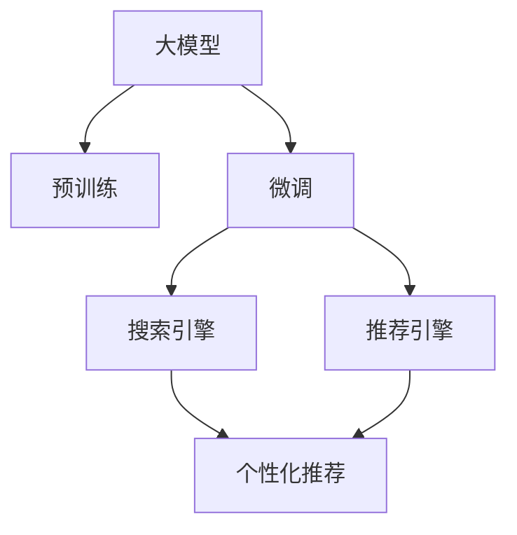

                 

# AI大模型在搜索推荐系统中的应用前景

## 1. 背景介绍

### 1.1 问题由来
随着互联网技术的迅速发展，搜索引擎和推荐系统已成为人们获取信息和娱乐的重要工具。这些系统通过大数据分析和机器学习算法，向用户提供个性化的内容推荐，极大提升了用户体验和信息检索效率。然而，传统基于规则和统计的方法难以处理复杂多样的数据模式，机器学习算法尤其是深度学习技术，为这些系统带来了革命性的变革。

### 1.2 问题核心关键点
AI大模型在搜索推荐系统中的应用，核心在于通过预训练语言模型学习通用的语言表示，然后通过微调或者定制的策略，使其能够理解用户行为和意图，从而生成个性化的搜索结果和推荐内容。这种大模型方法具有以下特点：

1. **通用性**：预训练模型可以从大规模无标签数据中学习到广泛的语言和知识表示，适用于多种搜索推荐场景。
2. **适应性**：通过微调或者自定义的策略，模型可以灵活地适应不同领域和用户的需求。
3. **高效性**：利用预训练模型的知识库，可以大幅减少下游任务的训练时间，提高系统效率。
4. **性能提升**：大模型在理解和生成自然语言方面具有优势，能够提供更高质量的结果和推荐。

### 1.3 问题研究意义
研究AI大模型在搜索推荐系统中的应用，对于提升信息检索和内容推荐的准确性和效率，促进个性化服务的普及，具有重要意义：

1. **提升用户体验**：通过个性化的搜索和推荐，能够更准确地满足用户需求，提高用户满意度。
2. **降低成本**：减少对人工干预的依赖，节省人力资源和运营成本。
3. **增加收入**：通过精准的用户画像和推荐，能够提高广告点击率，增加平台收益。
4. **推动创新**：大模型技术为搜索推荐系统带来了新的方法和工具，推动了领域的创新和发展。

## 2. 核心概念与联系

### 2.1 核心概念概述

为更好地理解AI大模型在搜索推荐系统中的应用，本节将介绍几个关键概念：

- **大模型(Big Model)**：以自回归（如GPT）或自编码（如BERT）模型为代表的深度学习模型，通常在亿级的参数规模下进行预训练，学习通用的语言表示。
- **预训练(Pre-training)**：指在大规模无标签文本数据上，通过自监督学习任务训练通用语言模型的过程。常见的预训练任务包括语言建模、掩码语言模型等。
- **微调(Fine-tuning)**：指在预训练模型的基础上，使用下游任务的少量标注数据，通过有监督学习优化模型在下游任务上的性能。
- **搜索推荐系统(Search and Recommendation Systems)**：利用用户行为数据和物品属性，通过模型预测推荐结果的自动化系统。主要分为搜索引擎（如百度、Google）和推荐引擎（如Amazon、Netflix）两大类。
- **个性化推荐**：通过用户画像、行为数据分析，为每个用户生成个性化的推荐结果。

这些核心概念之间的逻辑关系可以通过以下Mermaid流程图来展示：



这个流程图展示了大模型在搜索推荐系统中的核心概念及其之间的关系：

1. 大模型通过预训练获得基础能力。
2. 微调是对预训练模型进行任务特定的优化，使其适应特定任务。
3. 通过微调，大模型在搜索引擎和推荐引擎中生成个性化的搜索结果和推荐内容。
4. 个性化推荐是大模型在搜索推荐系统中的重要应用场景。

## 3. 核心算法原理 & 具体操作步骤

### 3.1 算法原理概述

AI大模型在搜索推荐系统中的应用，主要基于两个关键步骤：预训练和微调。

预训练阶段，模型在大规模无标签文本数据上学习通用的语言表示。具体而言，通过掩码语言模型（如BERT）、语言建模（如GPT）等自监督任务，模型能够学习到丰富的语言知识，包括语法、词汇、上下文关系等。

微调阶段，模型使用下游任务的少量标注数据，通过有监督学习优化，以适应特定的搜索推荐需求。具体而言，通过自定义的输出层和损失函数，模型能够理解用户行为和意图，生成个性化的搜索结果和推荐内容。

### 3.2 算法步骤详解

基于AI大模型的搜索推荐系统通常包括以下几个关键步骤：

**Step 1: 准备预训练模型和数据集**
- 选择合适的预训练语言模型（如BERT、GPT）作为初始化参数。
- 准备下游任务（如搜索引擎、推荐引擎）的标注数据集，划分为训练集、验证集和测试集。

**Step 2: 设计下游任务适配层**
- 根据下游任务类型，设计合适的输出层和损失函数。例如，对于分类任务，通常在顶层添加线性分类器和交叉熵损失函数。
- 对于生成任务，通常使用语言模型的解码器输出概率分布，并以负对数似然为损失函数。

**Step 3: 设置微调超参数**
- 选择合适的优化算法及其参数，如AdamW、SGD等，设置学习率、批大小、迭代轮数等。
- 设置正则化技术及强度，包括权重衰减、Dropout、Early Stopping等。
- 确定冻结预训练参数的策略，如仅微调顶层，或全部参数都参与微调。

**Step 4: 执行梯度训练**
- 将训练集数据分批次输入模型，前向传播计算损失函数。
- 反向传播计算参数梯度，根据设定的优化算法和学习率更新模型参数。
- 周期性在验证集上评估模型性能，根据性能指标决定是否触发Early Stopping。
- 重复上述步骤直到满足预设的迭代轮数或Early Stopping条件。

**Step 5: 测试和部署**
- 在测试集上评估微调后模型在特定任务上的性能，对比微调前后的精度提升。
- 使用微调后的模型对新样本进行推理预测，集成到实际的应用系统中。
- 持续收集新的数据，定期重新微调模型，以适应数据分布的变化。

以上是基于AI大模型的搜索推荐系统的一般流程。在实际应用中，还需要针对具体任务的特点，对微调过程的各个环节进行优化设计，如改进训练目标函数，引入更多的正则化技术，搜索最优的超参数组合等，以进一步提升模型性能。

### 3.3 算法优缺点

AI大模型在搜索推荐系统中的应用具有以下优点：

1. **高效性**：利用预训练模型的知识库，可以大幅减少下游任务的训练时间，提高系统效率。
2. **灵活性**：通过微调或者自定义的策略，模型可以灵活地适应不同领域和用户的需求。
3. **准确性**：大模型在理解和生成自然语言方面具有优势，能够提供更高质量的结果和推荐。
4. **可扩展性**：模型可以轻松地扩展到多种搜索推荐场景，如电商、社交、新闻等。

同时，该方法也存在一定的局限性：

1. **依赖标注数据**：微调的效果很大程度上取决于标注数据的质量和数量，获取高质量标注数据的成本较高。
2. **泛化能力有限**：当目标任务与预训练数据的分布差异较大时，微调的性能提升有限。
3. **内存和计算资源需求高**：大模型通常具有亿级的参数规模，对内存和计算资源有较高要求。
4. **可解释性不足**：模型决策过程缺乏可解释性，难以对其推理逻辑进行分析和调试。

尽管存在这些局限性，但就目前而言，AI大模型在搜索推荐系统中的应用仍是大模型技术应用的主流范式。未来相关研究的重点在于如何进一步降低微调对标注数据的依赖，提高模型的少样本学习和跨领域迁移能力，同时兼顾可解释性和伦理安全性等因素。

### 3.4 算法应用领域

AI大模型在搜索推荐系统中的应用领域非常广泛，以下是几个典型的应用场景：

- **电商推荐**：根据用户浏览、购买历史和行为数据，为用户推荐商品。使用微调后的模型能够理解用户需求，生成个性化推荐结果。
- **新闻推荐**：根据用户阅读历史和兴趣标签，为用户推荐相关新闻文章。微调后的模型能够学习用户的阅读偏好，提高推荐的准确性。
- **社交推荐**：根据用户互动行为和兴趣，为用户推荐朋友、群组和内容。使用微调后的模型能够理解用户的社交网络特征，生成更加个性化的推荐结果。
- **视频推荐**：根据用户观看历史和行为数据，为用户推荐视频内容。微调后的模型能够学习用户的兴趣点，生成精准的视频推荐结果。
- **语音搜索**：根据用户的语音输入，快速查询相关内容。使用微调后的模型能够理解自然语言，生成精准的搜索结果。

## 4. 数学模型和公式 & 详细讲解 & 举例说明

### 4.1 数学模型构建

基于AI大模型的搜索推荐系统通常使用Transformer模型，其数学模型可以表示为：

$$
y = M_\theta(x)
$$

其中，$M_\theta$ 为预训练模型，$x$ 为输入数据，$y$ 为模型输出。在微调阶段，模型输出层通常为线性层或全连接层，损失函数为交叉熵损失或负对数似然损失。

以电商推荐为例，假设用户行为数据为 $x_i$，对应的推荐结果为 $y_i$，则模型输出的概率分布为：

$$
p(y_i|x_i) = \sigma(M_\theta(x_i))
$$

其中，$\sigma$ 为softmax函数。微调的优化目标是最小化交叉熵损失：

$$
\mathcal{L}(\theta) = -\frac{1}{N}\sum_{i=1}^N \sum_{y} y_i \log p(y_i|x_i)
$$

其中 $N$ 为训练样本数，$y$ 为所有可能的结果。

### 4.2 公式推导过程

在微调过程中，模型的更新公式可以表示为：

$$
\theta \leftarrow \theta - \eta \nabla_{\theta}\mathcal{L}(\theta) - \eta\lambda\theta
$$

其中，$\eta$ 为学习率，$\lambda$ 为正则化系数。在反向传播计算梯度时，需要计算损失函数对模型参数的导数：

$$
\nabla_{\theta}\mathcal{L}(\theta) = -\frac{1}{N}\sum_{i=1}^N \nabla_{\theta}\log p(y_i|x_i)
$$

其中，$\nabla_{\theta}\log p(y_i|x_i)$ 为交叉熵损失对模型参数的导数。

### 4.3 案例分析与讲解

以电商推荐为例，假设我们收集了用户对不同商品的评价数据，并将这些数据作为标注数据进行微调。微调的目标是使用用户评价数据学习用户对商品的好恶，从而生成个性化推荐结果。具体步骤包括：

1. **数据准备**：将用户评价数据划分为训练集和测试集，进行标准化和标签编码。
2. **模型初始化**：使用预训练的BERT模型作为初始化参数，并将其适配到电商推荐任务中。
3. **模型微调**：在训练集上使用交叉熵损失函数进行微调，优化模型参数。
4. **结果评估**：在测试集上评估微调后的模型性能，比较微调前后的推荐准确率和用户满意度。

## 5. 项目实践：代码实例和详细解释说明

### 5.1 开发环境搭建

在进行AI大模型在搜索推荐系统中的微调实践前，我们需要准备好开发环境。以下是使用Python进行PyTorch开发的环境配置流程：

1. 安装Anaconda：从官网下载并安装Anaconda，用于创建独立的Python环境。

2. 创建并激活虚拟环境：
```bash
conda create -n pytorch-env python=3.8 
conda activate pytorch-env
```

3. 安装PyTorch：根据CUDA版本，从官网获取对应的安装命令。例如：
```bash
conda install pytorch torchvision torchaudio cudatoolkit=11.1 -c pytorch -c conda-forge
```

4. 安装Transformers库：
```bash
pip install transformers
```

5. 安装各类工具包：
```bash
pip install numpy pandas scikit-learn matplotlib tqdm jupyter notebook ipython
```

完成上述步骤后，即可在`pytorch-env`环境中开始微调实践。

### 5.2 源代码详细实现

这里我们以电商推荐为例，给出使用Transformers库对BERT模型进行微调的PyTorch代码实现。

首先，定义电商推荐任务的数据处理函数：

```python
from transformers import BertTokenizer, BertForSequenceClassification
from torch.utils.data import Dataset, DataLoader
import torch

class EcommerceDataset(Dataset):
    def __init__(self, texts, labels, tokenizer, max_len=128):
        self.texts = texts
        self.labels = labels
        self.tokenizer = tokenizer
        self.max_len = max_len
        
    def __len__(self):
        return len(self.texts)
    
    def __getitem__(self, item):
        text = self.texts[item]
        label = self.labels[item]
        
        encoding = self.tokenizer(text, return_tensors='pt', max_length=self.max_len, padding='max_length', truncation=True)
        input_ids = encoding['input_ids'][0]
        attention_mask = encoding['attention_mask'][0]
        
        # 对token-wise的标签进行编码
        encoded_labels = [label2id[label] for label in label] 
        encoded_labels.extend([label2id['O']] * (self.max_len - len(encoded_labels)))
        labels = torch.tensor(encoded_labels, dtype=torch.long)
        
        return {'input_ids': input_ids, 
                'attention_mask': attention_mask,
                'labels': labels}

# 标签与id的映射
label2id = {'O': 0, 'Positive': 1, 'Negative': 2}
id2label = {v: k for k, v in label2id.items()}

# 创建dataset
tokenizer = BertTokenizer.from_pretrained('bert-base-cased')

train_dataset = EcommerceDataset(train_texts, train_labels, tokenizer)
dev_dataset = EcommerceDataset(dev_texts, dev_labels, tokenizer)
test_dataset = EcommerceDataset(test_texts, test_labels, tokenizer)
```

然后，定义模型和优化器：

```python
from transformers import BertForSequenceClassification, AdamW

model = BertForSequenceClassification.from_pretrained('bert-base-cased', num_labels=len(label2id))

optimizer = AdamW(model.parameters(), lr=2e-5)
```

接着，定义训练和评估函数：

```python
from tqdm import tqdm
from sklearn.metrics import classification_report

device = torch.device('cuda') if torch.cuda.is_available() else torch.device('cpu')
model.to(device)

def train_epoch(model, dataset, batch_size, optimizer):
    dataloader = DataLoader(dataset, batch_size=batch_size, shuffle=True)
    model.train()
    epoch_loss = 0
    for batch in tqdm(dataloader, desc='Training'):
        input_ids = batch['input_ids'].to(device)
        attention_mask = batch['attention_mask'].to(device)
        labels = batch['labels'].to(device)
        model.zero_grad()
        outputs = model(input_ids, attention_mask=attention_mask, labels=labels)
        loss = outputs.loss
        epoch_loss += loss.item()
        loss.backward()
        optimizer.step()
    return epoch_loss / len(dataloader)

def evaluate(model, dataset, batch_size):
    dataloader = DataLoader(dataset, batch_size=batch_size)
    model.eval()
    preds, labels = [], []
    with torch.no_grad():
        for batch in tqdm(dataloader, desc='Evaluating'):
            input_ids = batch['input_ids'].to(device)
            attention_mask = batch['attention_mask'].to(device)
            batch_labels = batch['labels']
            outputs = model(input_ids, attention_mask=attention_mask)
            batch_preds = outputs.logits.argmax(dim=2).to('cpu').tolist()
            batch_labels = batch_labels.to('cpu').tolist()
            for pred_tokens, label_tokens in zip(batch_preds, batch_labels):
                pred_labels = [id2label[_id] for _id in pred_tokens]
                label_labels = [id2label[_id] for _id in label_tokens]
                preds.append(pred_labels[:len(label_labels)])
                labels.append(label_labels)
                
    print(classification_report(labels, preds))
```

最后，启动训练流程并在测试集上评估：

```python
epochs = 5
batch_size = 16

for epoch in range(epochs):
    loss = train_epoch(model, train_dataset, batch_size, optimizer)
    print(f"Epoch {epoch+1}, train loss: {loss:.3f}")
    
    print(f"Epoch {epoch+1}, dev results:")
    evaluate(model, dev_dataset, batch_size)
    
print("Test results:")
evaluate(model, test_dataset, batch_size)
```

以上就是使用PyTorch对BERT进行电商推荐任务微调的完整代码实现。可以看到，得益于Transformers库的强大封装，我们可以用相对简洁的代码完成BERT模型的加载和微调。

### 5.3 代码解读与分析

让我们再详细解读一下关键代码的实现细节：

**EcommerceDataset类**：
- `__init__`方法：初始化文本、标签、分词器等关键组件。
- `__len__`方法：返回数据集的样本数量。
- `__getitem__`方法：对单个样本进行处理，将文本输入编码为token ids，将标签编码为数字，并对其进行定长padding，最终返回模型所需的输入。

**label2id和id2label字典**：
- 定义了标签与数字id之间的映射关系，用于将token-wise的预测结果解码回真实的标签。

**训练和评估函数**：
- 使用PyTorch的DataLoader对数据集进行批次化加载，供模型训练和推理使用。
- 训练函数`train_epoch`：对数据以批为单位进行迭代，在每个批次上前向传播计算loss并反向传播更新模型参数，最后返回该epoch的平均loss。
- 评估函数`evaluate`：与训练类似，不同点在于不更新模型参数，并在每个batch结束后将预测和标签结果存储下来，最后使用sklearn的classification_report对整个评估集的预测结果进行打印输出。

**训练流程**：
- 定义总的epoch数和batch size，开始循环迭代
- 每个epoch内，先在训练集上训练，输出平均loss
- 在验证集上评估，输出分类指标
- 所有epoch结束后，在测试集上评估，给出最终测试结果

可以看到，PyTorch配合Transformers库使得BERT微调的代码实现变得简洁高效。开发者可以将更多精力放在数据处理、模型改进等高层逻辑上，而不必过多关注底层的实现细节。

当然，工业级的系统实现还需考虑更多因素，如模型的保存和部署、超参数的自动搜索、更灵活的任务适配层等。但核心的微调范式基本与此类似。

## 6. 实际应用场景

### 6.1 智能客服系统

基于AI大模型微调的对话技术，可以广泛应用于智能客服系统的构建。传统客服往往需要配备大量人力，高峰期响应缓慢，且一致性和专业性难以保证。而使用微调后的对话模型，可以7x24小时不间断服务，快速响应客户咨询，用自然流畅的语言解答各类常见问题。

在技术实现上，可以收集企业内部的历史客服对话记录，将问题和最佳答复构建成监督数据，在此基础上对预训练对话模型进行微调。微调后的对话模型能够自动理解用户意图，匹配最合适的答案模板进行回复。对于客户提出的新问题，还可以接入检索系统实时搜索相关内容，动态组织生成回答。如此构建的智能客服系统，能大幅提升客户咨询体验和问题解决效率。

### 6.2 金融舆情监测

金融机构需要实时监测市场舆论动向，以便及时应对负面信息传播，规避金融风险。传统的人工监测方式成本高、效率低，难以应对网络时代海量信息爆发的挑战。基于AI大模型微调的文本分类和情感分析技术，为金融舆情监测提供了新的解决方案。

具体而言，可以收集金融领域相关的新闻、报道、评论等文本数据，并对其进行主题标注和情感标注。在此基础上对预训练语言模型进行微调，使其能够自动判断文本属于何种主题，情感倾向是正面、中性还是负面。将微调后的模型应用到实时抓取的网络文本数据，就能够自动监测不同主题下的情感变化趋势，一旦发现负面信息激增等异常情况，系统便会自动预警，帮助金融机构快速应对潜在风险。

### 6.3 个性化推荐系统

当前的推荐系统往往只依赖用户的历史行为数据进行物品推荐，无法深入理解用户的真实兴趣偏好。基于AI大模型微调技术，个性化推荐系统可以更好地挖掘用户行为背后的语义信息，从而提供更精准、多样的推荐内容。

在实践中，可以收集用户浏览、点击、评论、分享等行为数据，提取和用户交互的物品标题、描述、标签等文本内容。将文本内容作为模型输入，用户的后续行为（如是否点击、购买等）作为监督信号，在此基础上微调预训练语言模型。微调后的模型能够从文本内容中准确把握用户的兴趣点。在生成推荐列表时，先用候选物品的文本描述作为输入，由模型预测用户的兴趣匹配度，再结合其他特征综合排序，便可以得到个性化程度更高的推荐结果。

### 6.4 未来应用展望

随着AI大模型和微调方法的不断发展，基于微调范式将在更多领域得到应用，为传统行业带来变革性影响。

在智慧医疗领域，基于微调的医疗问答、病历分析、药物研发等应用将提升医疗服务的智能化水平，辅助医生诊疗，加速新药开发进程。

在智能教育领域，微调技术可应用于作业批改、学情分析、知识推荐等方面，因材施教，促进教育公平，提高教学质量。

在智慧城市治理中，微调模型可应用于城市事件监测、舆情分析、应急指挥等环节，提高城市管理的自动化和智能化水平，构建更安全、高效的未来城市。

此外，在企业生产、社会治理、文娱传媒等众多领域，基于大模型微调的人工智能应用也将不断涌现，为经济社会发展注入新的动力。相信随着技术的日益成熟，微调方法将成为人工智能落地应用的重要范式，推动人工智能技术在更广阔的领域加速渗透。

## 7. 工具和资源推荐

### 7.1 学习资源推荐

为了帮助开发者系统掌握AI大模型微调的理论基础和实践技巧，这里推荐一些优质的学习资源：

1. 《Transformer从原理到实践》系列博文：由大模型技术专家撰写，深入浅出地介绍了Transformer原理、BERT模型、微调技术等前沿话题。

2. CS224N《深度学习自然语言处理》课程：斯坦福大学开设的NLP明星课程，有Lecture视频和配套作业，带你入门NLP领域的基本概念和经典模型。

3. 《Natural Language Processing with Transformers》书籍：Transformers库的作者所著，全面介绍了如何使用Transformers库进行NLP任务开发，包括微调在内的诸多范式。

4. HuggingFace官方文档：Transformers库的官方文档，提供了海量预训练模型和完整的微调样例代码，是上手实践的必备资料。

5. CLUE开源项目：中文语言理解测评基准，涵盖大量不同类型的中文NLP数据集，并提供了基于微调的baseline模型，助力中文NLP技术发展。

通过对这些资源的学习实践，相信你一定能够快速掌握AI大模型微调的精髓，并用于解决实际的NLP问题。

### 7.2 开发工具推荐

高效的开发离不开优秀的工具支持。以下是几款用于AI大模型微调开发的常用工具：

1. PyTorch：基于Python的开源深度学习框架，灵活动态的计算图，适合快速迭代研究。大部分预训练语言模型都有PyTorch版本的实现。

2. TensorFlow：由Google主导开发的开源深度学习框架，生产部署方便，适合大规模工程应用。同样有丰富的预训练语言模型资源。

3. Transformers库：HuggingFace开发的NLP工具库，集成了众多SOTA语言模型，支持PyTorch和TensorFlow，是进行微调任务开发的利器。

4. Weights & Biases：模型训练的实验跟踪工具，可以记录和可视化模型训练过程中的各项指标，方便对比和调优。与主流深度学习框架无缝集成。

5. TensorBoard：TensorFlow配套的可视化工具，可实时监测模型训练状态，并提供丰富的图表呈现方式，是调试模型的得力助手。

6. Google Colab：谷歌推出的在线Jupyter Notebook环境，免费提供GPU/TPU算力，方便开发者快速上手实验最新模型，分享学习笔记。

合理利用这些工具，可以显著提升AI大模型微调任务的开发效率，加快创新迭代的步伐。

### 7.3 相关论文推荐

AI大模型和微调技术的发展源于学界的持续研究。以下是几篇奠基性的相关论文，推荐阅读：

1. Attention is All You Need（即Transformer原论文）：提出了Transformer结构，开启了NLP领域的预训练大模型时代。

2. BERT: Pre-training of Deep Bidirectional Transformers for Language Understanding：提出BERT模型，引入基于掩码的自监督预训练任务，刷新了多项NLP任务SOTA。

3. Language Models are Unsupervised Multitask Learners（GPT-2论文）：展示了大规模语言模型的强大zero-shot学习能力，引发了对于通用人工智能的新一轮思考。

4. Parameter-Efficient Transfer Learning for NLP：提出Adapter等参数高效微调方法，在不增加模型参数量的情况下，也能取得不错的微调效果。

5. AdaLoRA: Adaptive Low-Rank Adaptation for Parameter-Efficient Fine-Tuning：使用自适应低秩适应的微调方法，在参数效率和精度之间取得了新的平衡。

这些论文代表了大模型微调技术的发展脉络。通过学习这些前沿成果，可以帮助研究者把握学科前进方向，激发更多的创新灵感。

## 8. 总结：未来发展趋势与挑战

### 8.1 总结

本文对AI大模型在搜索推荐系统中的应用进行了全面系统的介绍。首先阐述了AI大模型和微调技术的研究背景和意义，明确了AI大模型在搜索推荐系统中的应用价值。其次，从原理到实践，详细讲解了AI大模型微调的过程，包括数据准备、模型适配、训练优化和结果评估等关键步骤。同时，本文还广泛探讨了AI大模型在电商推荐、智能客服、金融舆情等搜索推荐系统的应用前景，展示了AI大模型微调技术的强大潜力。

通过本文的系统梳理，可以看到，AI大模型微调技术正在成为搜索推荐系统的重要范式，极大地拓展了搜索推荐系统的应用边界，带来了更加精准、高效的个性化服务。未来，伴随AI大模型的演进，搜索推荐系统将能够提供更全面的用户画像，生成更符合用户期望的搜索结果和推荐内容，进一步提升用户体验和平台价值。

### 8.2 未来发展趋势

展望未来，AI大模型在搜索推荐系统中的应用将呈现以下几个发展趋势：

1. **超大规模模型应用**：随着算力成本的下降和数据规模的扩张，预训练语言模型的参数量还将持续增长。超大规模语言模型蕴含的丰富语言知识，有望支撑更加复杂多变的搜索推荐场景。

2. **多模态融合**：未来的搜索推荐系统将不仅限于文本数据，而是融合图像、视频、语音等多模态数据，提供更加全面的用户画像和更丰富的推荐结果。

3. **跨领域泛化**：AI大模型将能够更好地跨领域迁移，适应不同的应用场景和任务需求。跨领域泛化能力将大大提升搜索推荐系统的应用范围。

4. **个性化推荐**：通过AI大模型的微调，推荐系统将能够理解用户的深层次需求和行为模式，提供更加精准和多样化的推荐结果。

5. **实时性提升**：随着硬件性能的提升和算法优化的持续进行，搜索推荐系统的实时性将显著提升，能够实时响应用户需求，提供即时的搜索结果和推荐内容。

6. **隐私保护**：随着对用户隐私保护的重视，搜索推荐系统将更加注重数据安全和隐私保护，采用差分隐私、联邦学习等技术，保障用户数据的隐私和安全。

以上趋势凸显了AI大模型在搜索推荐系统中的广阔前景。这些方向的探索发展，必将进一步提升搜索推荐系统的性能和应用范围，为人类认知智能的进化带来深远影响。

### 8.3 面临的挑战

尽管AI大模型在搜索推荐系统中的应用已经取得了显著成果，但在迈向更加智能化、普适化应用的过程中，它仍面临着诸多挑战：

1. **标注数据依赖**：AI大模型的微调需要大量的标注数据，标注数据的获取和处理成本较高，尤其是在长尾应用场景下。

2. **泛化能力不足**：当目标任务与预训练数据的分布差异较大时，AI大模型的泛化性能可能不足，导致微调效果不佳。

3. **计算资源需求高**：超大规模语言模型的参数量和计算资源需求较高，部署和训练成本较大。

4. **可解释性不足**：AI大模型的决策过程缺乏可解释性，难以对其推理逻辑进行分析和调试，特别是在医疗、金融等高风险应用中，模型的透明性和可解释性尤为重要。

5. **模型鲁棒性差**：AI大模型面对未知或异常输入时，可能表现出较差的鲁棒性，导致预测结果波动较大。

6. **伦理和安全问题**：AI大模型可能学习到有偏见或有害的信息，通过微调传递到下游任务，产生误导性或歧视性的输出，给实际应用带来安全隐患。

尽管存在这些挑战，但AI大模型在搜索推荐系统中的应用前景依然广阔，需要通过技术创新和算法优化，不断突破这些难题，实现AI大模型在搜索推荐系统的普及和应用。

### 8.4 研究展望

面向未来，AI大模型在搜索推荐系统中的应用将需要从以下几个方面进行深入研究：

1. **数据增强和少样本学习**：探索更多的数据增强和少样本学习方法，降低对标注数据的依赖，提升模型的泛化能力。

2. **参数高效微调**：开发更加参数高效的微调方法，减少微调过程中的资源消耗，提升模型的实时性和可扩展性。

3. **多模态融合和跨领域泛化**：探索多模态融合技术，提升搜索推荐系统的多样性和覆盖面，研究跨领域泛化算法，提升模型的适应性。

4. **模型解释性和隐私保护**：探索AI大模型的可解释性方法，提升模型的透明性和可解释性，研究隐私保护技术，保障用户数据的隐私和安全。

5. **自动化调参和模型压缩**：研究自动化的超参数优化方法，提升模型调参效率，研究模型压缩技术，降低模型部署和训练成本。

6. **跨领域迁移和持续学习**：研究跨领域迁移学习算法，提升模型的适应性和泛化能力，研究持续学习算法，确保模型能够持续学习新知识，避免灾难性遗忘。

通过这些研究方向的探索，相信AI大模型在搜索推荐系统中的应用将能够取得更大的突破，为人类智能服务带来更多创新和进步。

## 9. 附录：常见问题与解答

**Q1：AI大模型微调是否适用于所有搜索推荐场景？**

A: AI大模型微调在大多数搜索推荐场景上都能取得不错的效果，特别是对于数据量较小的场景。但对于一些特定领域的场景，如医学、法律等，仅仅依靠通用语料预训练的模型可能难以很好地适应。此时需要在特定领域语料上进一步预训练，再进行微调，才能获得理想效果。

**Q2：微调过程中如何选择合适的学习率？**

A: 微调的学习率一般要比预训练时小1-2个数量级，如果使用过大的学习率，容易破坏预训练权重，导致过拟合。一般建议从1e-5开始调参，逐步减小学习率，直至收敛。也可以使用warmup策略，在开始阶段使用较小的学习率，再逐渐过渡到预设值。需要注意的是，不同的优化器(如AdamW、Adafactor等)以及不同的学习率调度策略，可能需要设置不同的学习率阈值。

**Q3：采用AI大模型微调时会面临哪些资源瓶颈？**

A: 目前主流的预训练大模型动辄以亿计的参数规模，对算力、内存、存储都提出了很高的要求。GPU/TPU等高性能设备是必不可少的，但即便如此，超大批次的训练和推理也可能遇到显存不足的问题。因此需要采用一些资源优化技术，如梯度积累、混合精度训练、模型并行等，来突破硬件瓶颈。同时，模型的存储和读取也可能占用大量时间和空间，需要采用模型压缩、稀疏化存储等方法进行优化。

**Q4：如何缓解微调过程中的过拟合问题？**

A: 过拟合是微调面临的主要挑战，尤其是在标注数据不足的情况下。常见的缓解策略包括：
1. 数据增强：通过回译、近义替换等方式扩充训练集
2. 正则化：使用L2正则、Dropout、Early Stopping等避免过拟合
3. 对抗训练：引入对抗样本，提高模型鲁棒性
4. 参数高效微调：只调整少量参数(如Adapter、Prefix等)，减小过拟合风险
5. 多模型集成：训练多个微调模型，取平均输出，抑制过拟合

这些策略往往需要根据具体任务和数据特点进行灵活组合。只有在数据、模型、训练、推理等各环节进行全面优化，才能最大限度地发挥AI大模型微调的威力。

**Q5：AI大模型在搜索推荐系统中的部署和维护有哪些注意事项？**

A: 将AI大模型微调模型转化为实际应用，还需要考虑以下因素：
1. 模型裁剪：去除不必要的层和参数，减小模型尺寸，加快推理速度
2. 量化加速：将浮点模型转为定点模型，压缩存储空间，提高计算效率
3. 服务化封装：将模型封装为标准化服务接口，便于集成调用
4. 弹性伸缩：根据请求流量动态调整资源配置，平衡服务质量和成本
5. 监控告警：实时采集系统指标，设置异常告警阈值，确保服务稳定性
6. 安全防护：采用访问鉴权、数据脱敏等措施，保障数据和模型安全

AI大模型微调为搜索推荐系统带来了新的挑战，需要在数据、模型、部署、运维等各个环节进行全面优化，才能确保系统的稳定性和可靠性。

