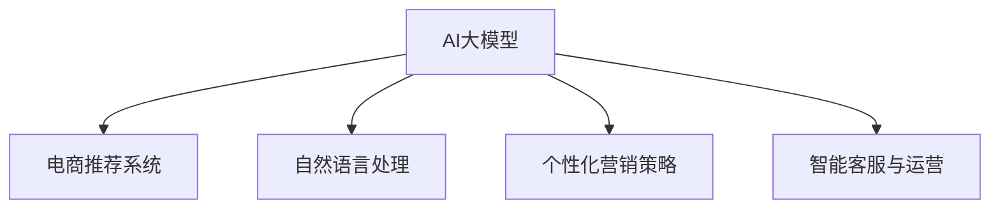

                 

# AI大模型在电商个性化营销中的应用与挑战

> 关键词：AI大模型,电商个性化营销,深度学习,自然语言处理,NLP,推荐系统,模型优化,电商推荐算法,电商智能客服,电商智能运营,电商用户体验,电商数据分析

## 1. 背景介绍

### 1.1 问题由来
近年来，随着互联网技术的迅猛发展，电商平台已成为人们日常购物的重要渠道。据统计，全球电商市场的规模已经超过了4万亿美元，并继续以每年30%左右的速度增长。在电商竞争日益激烈的市场环境下，如何提升用户体验、增加用户粘性、提高交易转化率，成为平台运营的核心课题。

其中，个性化推荐系统作为电商营销的核心工具之一，通过精准的用户画像和商品匹配，帮助用户快速找到感兴趣的商品，从而提升购物体验和销售额。然而，传统推荐系统往往基于用户历史行为和物品属性构建推荐模型，难以充分挖掘用户深层次需求，导致推荐效果不佳。为此，基于深度学习和自然语言处理(NLP)的AI大模型在电商个性化推荐领域中应运而生，成为提升电商用户购物体验和业绩增长的重要手段。

### 1.2 问题核心关键点
AI大模型在电商个性化营销中的关键应用包括：

1. **深度学习推荐系统**：通过学习用户行为和商品特征，实现精准推荐。
2. **自然语言处理(NLP)**：利用文本数据挖掘用户情感、偏好和需求。
3. **个性化营销策略**：基于用户画像和消费习惯，制定差异化的营销活动。
4. **智能客服与运营**：通过自然语言处理和机器学习，提升客服和运营效率，提升用户满意度。

## 2. 核心概念与联系

### 2.1 核心概念概述

为了更好地理解AI大模型在电商个性化营销中的应用，本节将介绍几个密切相关的核心概念：

- **AI大模型**：以深度学习为核心技术，基于大规模语料库预训练的模型。如BERT、GPT-3等，能够理解复杂的语言结构和语义信息。
- **电商推荐系统**：通过分析用户行为数据和商品属性，为用户推荐感兴趣的商品。
- **自然语言处理(NLP)**：涉及文本分析、语言理解、情感分析等，有助于理解用户需求和行为。
- **个性化营销策略**：针对不同用户群体，制定差异化的营销方案。
- **智能客服与运营**：利用自然语言处理和机器学习技术，提升电商客服和运营效率。

这些核心概念之间的逻辑关系可以通过以下Mermaid流程图来展示：



这个流程图展示了大模型在电商营销中的关键应用方向，通过理解这些概念，可以更好地把握AI大模型在电商个性化营销中的工作原理和优化方向。

## 3. 核心算法原理 & 具体操作步骤
### 3.1 算法原理概述

基于AI大模型的电商个性化推荐系统，主要包含以下几个关键步骤：

1. **预训练语言模型**：通过大规模无标签文本数据进行预训练，学习语言的通用表示。
2. **任务适配**：根据电商推荐任务的特点，添加任务适配层，修改输出格式。
3. **微调优化**：在电商推荐数据集上进行有监督的微调，提升推荐效果。
4. **推荐决策**：结合用户画像、商品特征和历史行为，利用模型生成推荐结果。
5. **效果评估与迭代优化**：通过A/B测试等手段，评估推荐效果，不断迭代优化模型。

### 3.2 算法步骤详解

下面以基于自然语言处理的电商推荐系统为例，详细说明其操作步骤：

**Step 1: 数据准备与预处理**

- 收集电商平台的用户行为数据，包括浏览记录、购买历史、评价信息等。
- 提取商品标题、描述、标签等文本信息。
- 对文本进行分词、去停用词、词向量化等预处理操作。

**Step 2: 构建任务适配层**

- 定义电商推荐任务，如点击率预测、转化率预测等。
- 将预训练语言模型的输出格式化为任务适配层的输入。
- 添加任务特定的输出层，如回归层、分类层等。

**Step 3: 选择预训练模型与任务数据**

- 选择合适的预训练语言模型，如BERT、GPT-3等。
- 将任务数据划分为训练集、验证集和测试集。

**Step 4: 微调模型**

- 在训练集上，使用监督学习算法如AdamW、SGD等优化模型参数。
- 设置合适的学习率、批大小、迭代轮数等超参数。
- 在验证集上评估模型性能，通过早停法避免过拟合。

**Step 5: 推荐决策**

- 将用户行为数据和商品特征作为输入，输入到微调后的语言模型中。
- 模型生成推荐结果，结合用户画像和消费习惯进行决策。

**Step 6: 效果评估与迭代优化**

- 在测试集上评估推荐效果，如精确率、召回率等指标。
- 根据评估结果，进行模型优化和迭代。

### 3.3 算法优缺点

基于AI大模型的电商推荐系统具有以下优点：

1. **高效性**：利用大规模预训练模型，可以在较短时间内训练出高质量推荐模型。
2. **泛化能力**：通过微调，模型能更好地适应电商推荐任务的特征，提升推荐效果。
3. **灵活性**：模型可以处理不同领域的电商数据，适用于多种推荐场景。
4. **可解释性**：利用自然语言处理技术，可以理解用户情感和行为，提供更加人性化的推荐服务。

同时，该方法也存在以下局限性：

1. **依赖标注数据**：推荐系统效果很大程度上取决于标注数据的质量和数量。
2. **过拟合风险**：当训练数据较少时，模型容易出现过拟合，泛化能力有限。
3. **计算资源消耗大**：大规模预训练和微调模型需要大量的计算资源。
4. **模型复杂性高**：模型结构复杂，难以直观理解。

尽管存在这些局限性，但就目前而言，基于大模型的电商推荐系统仍然是大数据驱动的个性化推荐的重要手段，广泛应用在各大电商平台中。

### 3.4 算法应用领域

基于AI大模型的电商个性化推荐系统，在以下领域得到了广泛应用：

- **用户行为分析**：通过分析用户历史行为，预测用户未来需求，提供个性化推荐。
- **商品搜索优化**：利用自然语言处理技术，提升商品搜索的准确性和效率。
- **广告投放**：根据用户画像和行为，精准投放广告，提升广告点击率和转化率。
- **客户服务**：通过智能客服系统，解答用户疑问，提升用户满意度。
- **库存管理**：根据预测需求，优化库存配置，避免缺货或库存积压。

## 4. 数学模型和公式 & 详细讲解 & 举例说明

### 4.1 数学模型构建

基于深度学习的电商推荐系统，其核心数学模型可以表示为：

$$
\hat{y} = f_{\theta}(x)
$$

其中，$x$ 为输入的电商数据，$y$ 为推荐的商品，$f_{\theta}$ 为模型函数，$\theta$ 为模型参数。电商推荐系统的目标是最大化预测准确度，即最小化损失函数 $L$：

$$
L = \sum_{i=1}^N \mathbb{E}_{x_i}[(f_{\theta}(x_i)-y_i)^2]
$$

其中 $N$ 为样本数量。电商推荐系统的目标是通过最小化损失函数，训练出能够预测商品推荐结果的模型 $f_{\theta}$。

### 4.2 公式推导过程

假设用户输入为 $x_i=(w_i,v_i,s_i)$，其中 $w_i$ 为用户历史行为数据，$v_i$ 为商品属性数据，$s_i$ 为当前时间戳。商品 $j$ 的评分向量为 $f_j = \sum_{k=1}^M v_j^{(k)}$，其中 $M$ 为商品特征数量。假设模型为线性回归模型：

$$
\hat{y}_i = \theta^T f_i
$$

其中 $\theta$ 为模型参数。损失函数 $L$ 可以表示为：

$$
L = \frac{1}{2} \sum_{i=1}^N (y_i - \hat{y}_i)^2
$$

利用梯度下降算法，求解最优参数 $\theta$：

$$
\theta \leftarrow \theta - \eta \nabla_{\theta}L(\theta)
$$

其中 $\eta$ 为学习率，$\nabla_{\theta}L(\theta)$ 为损失函数对参数 $\theta$ 的梯度，可以通过反向传播算法高效计算。

### 4.3 案例分析与讲解

以下以基于BERT的电商推荐系统为例，详细分析其模型构建和优化过程：

**Step 1: 数据准备与预处理**

- 收集电商平台的用户行为数据，包括浏览记录、购买历史、评价信息等。
- 提取商品标题、描述、标签等文本信息。
- 对文本进行分词、去停用词、词向量化等预处理操作。

**Step 2: 构建任务适配层**

- 定义电商推荐任务，如点击率预测、转化率预测等。
- 将预训练语言模型的输出格式化为任务适配层的输入。
- 添加任务特定的输出层，如回归层、分类层等。

**Step 3: 选择预训练模型与任务数据**

- 选择BERT模型作为预训练语言模型。
- 将任务数据划分为训练集、验证集和测试集。

**Step 4: 微调模型**

- 在训练集上，使用监督学习算法如AdamW、SGD等优化模型参数。
- 设置合适的学习率、批大小、迭代轮数等超参数。
- 在验证集上评估模型性能，通过早停法避免过拟合。

**Step 5: 推荐决策**

- 将用户行为数据和商品特征作为输入，输入到微调后的BERT模型中。
- 模型生成推荐结果，结合用户画像和消费习惯进行决策。

**Step 6: 效果评估与迭代优化**

- 在测试集上评估推荐效果，如精确率、召回率等指标。
- 根据评估结果，进行模型优化和迭代。

通过以上步骤，可以实现一个基于BERT的电商推荐系统。其中，预训练BERT模型可以学习到丰富的语言表示，通过微调，模型可以更好地适应电商推荐任务的特征，提升推荐效果。

## 5. 项目实践：代码实例和详细解释说明
### 5.1 开发环境搭建

在进行电商推荐系统开发前，我们需要准备好开发环境。以下是使用Python进行PyTorch开发的环境配置流程：

1. 安装Anaconda：从官网下载并安装Anaconda，用于创建独立的Python环境。

2. 创建并激活虚拟环境：
```bash
conda create -n pytorch-env python=3.8 
conda activate pytorch-env
```

3. 安装PyTorch：根据CUDA版本，从官网获取对应的安装命令。例如：
```bash
conda install pytorch torchvision torchaudio cudatoolkit=11.1 -c pytorch -c conda-forge
```

4. 安装Transformers库：
```bash
pip install transformers
```

5. 安装各类工具包：
```bash
pip install numpy pandas scikit-learn matplotlib tqdm jupyter notebook ipython
```

完成上述步骤后，即可在`pytorch-env`环境中开始电商推荐系统的开发。

### 5.2 源代码详细实现

下面我们以基于BERT的电商推荐系统为例，给出使用PyTorch和Transformers库的代码实现。

首先，定义电商推荐系统的输入数据格式：

```python
class Item:
    def __init__(self, title, description, category):
        self.title = title
        self.description = description
        self.category = category
```

然后，定义推荐模型的输入和输出：

```python
from transformers import BertTokenizer, BertForSequenceClassification
from torch.utils.data import DataLoader, Dataset

class RecommendationDataset(Dataset):
    def __init__(self, items, users, user_behaviors, tokenizer, max_len=128):
        self.items = items
        self.users = users
        self.user_behaviors = user_behaviors
        self.tokenizer = tokenizer
        self.max_len = max_len
        
    def __len__(self):
        return len(self.items)
    
    def __getitem__(self, item):
        item = self.items[item]
        user = self.users[item]
        behaviors = self.user_behaviors[item]
        
        item_title = item.title
        item_description = item.description
        user_name = user.name
        user_age = user.age
        user_gender = user.gender
        item_title = tokenizer(item_title, return_tensors='pt', max_length=self.max_len, padding='max_length', truncation=True)
        item_description = tokenizer(item_description, return_tensors='pt', max_length=self.max_len, padding='max_length', truncation=True)
        user_name = tokenizer(user_name, return_tensors='pt', max_length=self.max_len, padding='max_length', truncation=True)
        user_age = tokenizer(str(user_age), return_tensors='pt', max_length=self.max_len, padding='max_length', truncation=True)
        user_gender = tokenizer(user_gender, return_tensors='pt', max_length=self.max_len, padding='max_length', truncation=True)
        item_title = item_title['input_ids'][0]
        item_description = item_description['input_ids'][0]
        user_name = user_name['input_ids'][0]
        user_age = user_age['input_ids'][0]
        user_gender = user_gender['input_ids'][0]
        
        return {'item_title': item_title,
                'item_description': item_description,
                'user_name': user_name,
                'user_age': user_age,
                'user_gender': user_gender,
                'behaviors': behaviors}
```

接着，定义模型和优化器：

```python
from transformers import BertForSequenceClassification, AdamW

model = BertForSequenceClassification.from_pretrained('bert-base-cased', num_labels=2)

optimizer = AdamW(model.parameters(), lr=2e-5)
```

然后，定义训练和评估函数：

```python
from torch.utils.data import DataLoader
from tqdm import tqdm
from sklearn.metrics import classification_report

device = torch.device('cuda') if torch.cuda.is_available() else torch.device('cpu')
model.to(device)

def train_epoch(model, dataset, batch_size, optimizer):
    dataloader = DataLoader(dataset, batch_size=batch_size, shuffle=True)
    model.train()
    epoch_loss = 0
    for batch in tqdm(dataloader, desc='Training'):
        item_title = batch['item_title'].to(device)
        item_description = batch['item_description'].to(device)
        user_name = batch['user_name'].to(device)
        user_age = batch['user_age'].to(device)
        user_gender = batch['user_gender'].to(device)
        behaviors = batch['behaviors'].to(device)
        model.zero_grad()
        outputs = model(item_title, item_description, user_name, user_age, user_gender, behaviors)
        loss = outputs.loss
        epoch_loss += loss.item()
        loss.backward()
        optimizer.step()
    return epoch_loss / len(dataloader)

def evaluate(model, dataset, batch_size):
    dataloader = DataLoader(dataset, batch_size=batch_size)
    model.eval()
    preds, labels = [], []
    with torch.no_grad():
        for batch in tqdm(dataloader, desc='Evaluating'):
            item_title = batch['item_title'].to(device)
            item_description = batch['item_description'].to(device)
            user_name = batch['user_name'].to(device)
            user_age = batch['user_age'].to(device)
            user_gender = batch['user_gender'].to(device)
            behaviors = batch['behaviors'].to(device)
            batch_preds = model(item_title, item_description, user_name, user_age, user_gender, behaviors).logits.argmax(dim=2).to('cpu').tolist()
            batch_labels = batch['labels'].to('cpu').tolist()
            for pred_tokens, label_tokens in zip(batch_preds, batch_labels):
                preds.append(pred_tokens[:len(label_tokens)])
                labels.append(label_tokens)
                
    print(classification_report(labels, preds))
```

最后，启动训练流程并在测试集上评估：

```python
epochs = 5
batch_size = 16

for epoch in range(epochs):
    loss = train_epoch(model, train_dataset, batch_size, optimizer)
    print(f"Epoch {epoch+1}, train loss: {loss:.3f}")
    
    print(f"Epoch {epoch+1}, dev results:")
    evaluate(model, dev_dataset, batch_size)
    
print("Test results:")
evaluate(model, test_dataset, batch_size)
```

以上就是使用PyTorch和Transformers库对基于BERT的电商推荐系统进行微调的完整代码实现。可以看到，得益于Transformers库的强大封装，我们可以用相对简洁的代码完成BERT模型的加载和微调。

### 5.3 代码解读与分析

让我们再详细解读一下关键代码的实现细节：

**RecommendationDataset类**：
- `__init__`方法：初始化用户、商品、用户行为等关键组件。
- `__len__`方法：返回数据集的样本数量。
- `__getitem__`方法：对单个样本进行处理，将用户行为数据、商品信息等输入编码为token ids，并对其进行定长padding，最终返回模型所需的输入。

**训练和评估函数**：
- 使用PyTorch的DataLoader对数据集进行批次化加载，供模型训练和推理使用。
- 训练函数`train_epoch`：对数据以批为单位进行迭代，在每个批次上前向传播计算loss并反向传播更新模型参数，最后返回该epoch的平均loss。
- 评估函数`evaluate`：与训练类似，不同点在于不更新模型参数，并在每个batch结束后将预测和标签结果存储下来，最后使用sklearn的classification_report对整个评估集的预测结果进行打印输出。

**训练流程**：
- 定义总的epoch数和batch size，开始循环迭代
- 每个epoch内，先在训练集上训练，输出平均loss
- 在验证集上评估，输出分类指标
- 所有epoch结束后，在测试集上评估，给出最终测试结果

可以看到，PyTorch配合Transformers库使得BERT微调的代码实现变得简洁高效。开发者可以将更多精力放在数据处理、模型改进等高层逻辑上，而不必过多关注底层的实现细节。

当然，工业级的系统实现还需考虑更多因素，如模型的保存和部署、超参数的自动搜索、更灵活的任务适配层等。但核心的微调范式基本与此类似。

## 6. 实际应用场景

### 6.1 电商推荐系统

基于AI大模型的电商推荐系统，能够利用用户历史行为数据和商品属性信息，为用户推荐个性化的商品。在实际应用中，常见的电商推荐系统包括：

- **基于搜索的推荐系统**：利用用户搜索历史和商品标题，进行相似性匹配推荐。
- **基于浏览的推荐系统**：通过用户浏览记录，分析用户兴趣，推荐相关商品。
- **基于转化的推荐系统**：根据用户购买历史，推荐用户可能感兴趣的商品。

这些推荐系统通过分析用户行为数据和商品特征，利用大模型学习用户和商品的潜在语义关系，实现精准推荐。在用户点击、购买等关键行为上进行A/B测试，不断优化模型参数，提升推荐效果。

### 6.2 智能客服与运营

智能客服与运营系统利用自然语言处理和机器学习技术，提升电商平台的客服效率和运营效果。常见的应用场景包括：

- **智能客服聊天机器人**：通过自然语言处理技术，解答用户咨询，提升用户体验。
- **运营决策辅助系统**：利用数据分析和机器学习技术，辅助运营决策，优化库存管理、广告投放等环节。

通过智能客服与运营系统，电商平台能够快速响应用户需求，提升客户满意度，降低运营成本。

### 6.3 个性化营销策略

个性化营销策略利用用户画像和消费习惯，制定差异化的营销活动，提升用户购买意愿和转化率。常见的应用场景包括：

- **个性化广告投放**：根据用户兴趣和行为，精准投放广告，提升广告点击率和转化率。
- **个性化推荐内容**：根据用户需求，推荐相关内容，如商品信息、品牌资讯等。
- **个性化营销活动**：根据用户画像，制定个性化的营销活动，提升用户粘性和忠诚度。

通过个性化营销策略，电商平台能够提升用户体验，增加用户粘性，促进用户消费。

### 6.4 未来应用展望

随着AI大模型技术的不断发展，基于大模型的电商个性化营销将呈现以下趋势：

1. **多模态融合**：结合文本、图像、视频等多种模态数据，提升推荐系统的准确性和效率。
2. **知识图谱**：利用知识图谱中的实体关系，提升推荐系统对复杂知识的理解。
3. **动态优化**：利用实时数据和机器学习技术，动态调整推荐策略，提升推荐效果。
4. **隐私保护**：在推荐过程中，保护用户隐私，避免数据泄露。
5. **模型压缩**：通过模型压缩技术，优化模型结构和计算效率，提升实时推荐能力。

这些趋势将进一步推动电商个性化营销的发展，提升用户体验和电商平台的竞争力。

## 7. 工具和资源推荐
### 7.1 学习资源推荐

为了帮助开发者系统掌握基于AI大模型的电商推荐系统，这里推荐一些优质的学习资源：

1. 《深度学习》课程：由吴恩达教授主讲的Coursera课程，全面介绍深度学习的基本概念和应用。
2. 《自然语言处理》课程：斯坦福大学的NLP课程，涵盖自然语言处理的基础理论和经典模型。
3. 《Python深度学习》书籍：深度学习领域经典教材，涵盖深度学习的基础理论和实践。
4. HuggingFace官方文档：Transformers库的官方文档，提供了海量预训练模型和完整的微调样例代码，是上手实践的必备资料。
5. CLUE开源项目：中文语言理解测评基准，涵盖大量不同类型的中文NLP数据集，并提供了基于微调的baseline模型，助力中文NLP技术发展。

通过对这些资源的学习实践，相信你一定能够快速掌握基于AI大模型的电商推荐系统的精髓，并用于解决实际的电商推荐问题。

### 7.2 开发工具推荐

高效的开发离不开优秀的工具支持。以下是几款用于电商推荐系统开发的常用工具：

1. PyTorch：基于Python的开源深度学习框架，灵活动态的计算图，适合快速迭代研究。大部分预训练语言模型都有PyTorch版本的实现。
2. TensorFlow：由Google主导开发的开源深度学习框架，生产部署方便，适合大规模工程应用。同样有丰富的预训练语言模型资源。
3. Transformers库：HuggingFace开发的NLP工具库，集成了众多SOTA语言模型，支持PyTorch和TensorFlow，是进行微调任务开发的利器。
4. Weights & Biases：模型训练的实验跟踪工具，可以记录和可视化模型训练过程中的各项指标，方便对比和调优。与主流深度学习框架无缝集成。
5. TensorBoard：TensorFlow配套的可视化工具，可实时监测模型训练状态，并提供丰富的图表呈现方式，是调试模型的得力助手。
6. Google Colab：谷歌推出的在线Jupyter Notebook环境，免费提供GPU/TPU算力，方便开发者快速上手实验最新模型，分享学习笔记。

合理利用这些工具，可以显著提升电商推荐系统的开发效率，加快创新迭代的步伐。

### 7.3 相关论文推荐

基于AI大模型的电商推荐系统研究涉及诸多领域，以下推荐几篇经典论文，供读者深入阅读：

1. "Deep and Cross Deep Learning for Recommender Systems"：提出Deep & Cross算法，利用深度学习提升推荐系统效果。
2. "Attention-Based Recommender Systems"：提出基于注意力机制的推荐系统，提升推荐效果。
3. "Neural Collaborative Filtering"：提出神经协同过滤算法，利用神经网络提升推荐系统效果。
4. "Natural Language Processing in Recommendation Engines: A Review"：全面综述自然语言处理在推荐系统中的应用。
5. "Leveraging Deep Learning for Recommender Systems"：提出利用深度学习提升推荐系统效果的最新方法。

这些论文代表了电商推荐系统领域的研究进展，阅读这些论文可以帮助开发者深入理解电商推荐系统的原理和应用。

## 8. 总结：未来发展趋势与挑战

### 8.1 总结

本文对基于AI大模型的电商个性化营销进行了全面系统的介绍。首先阐述了电商推荐系统和大模型的背景和意义，明确了基于大模型的电商推荐系统在提升用户体验和业绩增长方面的独特价值。其次，从原理到实践，详细讲解了电商推荐系统的构建和优化过程，给出了微调任务开发的完整代码实例。同时，本文还广泛探讨了电商推荐系统在用户行为分析、商品搜索优化、广告投放、客户服务、库存管理等多个领域的应用前景，展示了电商推荐系统的广阔应用场景。此外，本文精选了电商推荐系统的各类学习资源，力求为读者提供全方位的技术指引。

通过本文的系统梳理，可以看到，基于AI大模型的电商推荐系统正在成为电商个性化营销的重要手段，极大地提升了电商平台的竞争力和用户体验。未来，伴随预训练语言模型和微调方法的持续演进，基于大模型的电商推荐系统必将在电商领域进一步推广应用，成为推动电商产业升级的重要引擎。

### 8.2 未来发展趋势

展望未来，基于AI大模型的电商推荐系统将呈现以下几个发展趋势：

1. **技术集成化**：大模型与电商推荐系统深度融合，结合自然语言处理、图像处理、音频处理等多模态数据，提升推荐系统的准确性和效率。
2. **个性化程度提升**：利用用户画像和消费习惯，制定更加精准的个性化推荐策略，提升用户满意度和忠诚度。
3. **模型实时化**：通过动态优化和实时数据学习，不断调整推荐策略，提升推荐效果。
4. **隐私保护加强**：在推荐过程中，保护用户隐私，避免数据泄露和滥用。
5. **模型压缩优化**：通过模型压缩技术，优化模型结构和计算效率，提升实时推荐能力。

这些趋势将进一步推动电商个性化营销的发展，提升用户体验和电商平台的竞争力。

### 8.3 面临的挑战

尽管基于AI大模型的电商推荐系统取得了显著成效，但在落地应用过程中，仍面临诸多挑战：

1. **标注成本高**：电商推荐系统对标注数据的依赖较高，标注成本较高，导致数据获取难度较大。
2. **数据隐私问题**：电商平台需要处理大量用户隐私数据，如何保护用户隐私，防止数据滥用，是一个重要挑战。
3. **模型过拟合**：当训练数据较少时，模型容易出现过拟合现象，泛化能力有限。
4. **计算资源消耗大**：大规模预训练和微调模型需要大量的计算资源，如何优化计算效率，是一个关键问题。
5. **模型可解释性不足**：电商推荐系统中的模型较为复杂，难以直观理解其内部工作机制，如何提高模型可解释性，是一个亟待解决的问题。

这些挑战需要技术界和产业界共同努力，才能实现基于AI大模型的电商推荐系统的更好应用。

### 8.4 研究展望

面对电商推荐系统面临的挑战，未来的研究方向包括：

1. **无监督和半监督学习**：探索利用无监督和半监督学习，降低对标注数据的依赖，提升推荐系统效果。
2. **多任务学习**：利用多任务学习技术，提升推荐系统对多种任务的处理能力。
3. **模型压缩与优化**：通过模型压缩和优化技术，提升推荐系统的实时处理能力。
4. **隐私保护技术**：利用隐私保护技术，保护用户隐私，防止数据滥用。
5. **模型可解释性提升**：通过可解释性技术，提升电商推荐系统的透明性和可解释性。

这些研究方向的探索，必将引领基于AI大模型的电商推荐系统迈向更高的台阶，为电商个性化营销带来更多创新和突破。

## 9. 附录：常见问题与解答

**Q1：电商推荐系统为何需要基于AI大模型？**

A: 传统电商推荐系统基于用户历史行为和商品属性构建推荐模型，难以充分挖掘用户深层次需求。而基于AI大模型的推荐系统，可以利用自然语言处理技术，理解用户情感和行为，结合预训练知识，实现更加精准的推荐。

**Q2：基于AI大模型的电商推荐系统是否适合所有电商平台？**

A: 基于AI大模型的电商推荐系统在大规模电商平台的推荐效果显著，但对于小型电商平台，由于数据量较少，模型容易出现过拟合现象，需要进一步优化模型和数据集。

**Q3：如何降低电商推荐系统的标注成本？**

A: 利用无监督和半监督学习技术，如自监督学习、主动学习等，可以降低标注数据的依赖，提升推荐系统的效果。

**Q4：电商推荐系统的计算资源消耗大，如何优化？**

A: 通过模型压缩和优化技术，如知识蒸馏、剪枝、量化等，可以提升电商推荐系统的实时处理能力，减少计算资源消耗。

**Q5：如何提升电商推荐系统的可解释性？**

A: 通过可解释性技术，如模型可视化、因果推断等，可以提升电商推荐系统的透明性和可解释性，帮助用户理解推荐逻辑。

这些问题的解答，展示了基于AI大模型的电商推荐系统的应用场景和挑战，并为相关研究指明了方向。相信通过不断探索和创新，电商推荐系统将迎来更加智能、高效、可解释的未来。

---

作者：禅与计算机程序设计艺术 / Zen and the Art of Computer Programming

