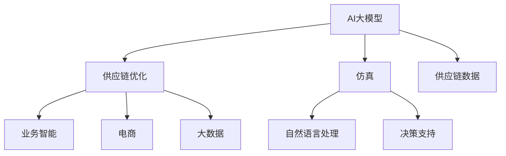

                 

# AI大模型在电商平台供应链优化仿真中的应用

> 关键词：AI大模型, 供应链优化, 仿真, 深度学习, 自然语言处理, 决策支持, 业务智能, 电商, 大数据

## 1. 背景介绍

### 1.1 问题由来
电商平台的供应链优化问题长期以来都是企业管理者面临的一个巨大挑战。供应链中存在的复杂性和不确定性，使得传统的优化算法难以有效应对。然而，随着深度学习和大模型的不断发展，AI大模型开始逐步被引入到供应链优化中，并通过仿真技术辅助决策，极大提升了供应链管理的智能化和精确度。

### 1.2 问题核心关键点
本文聚焦于基于AI大模型在电商平台供应链优化仿真中的应用，讨论了模型如何通过学习供应链数据，预测优化决策对供应链带来的影响，从而提供供应链优化的建议。

### 1.3 问题研究意义
研究AI大模型在电商平台供应链优化仿真中的应用，对提高供应链的效率、降低成本、增强供应链的韧性和灵活性，具有重要意义：

1. 提高供应链效率。通过深度学习模型对数据进行分析和预测，可以优化库存管理、物流路径选择，从而提高供应链的运营效率。
2. 降低运营成本。AI模型能够预测资源需求，合理分配资源，降低库存和运输成本。
3. 增强供应链韧性。AI模型可以实时监控供应链中的风险和不确定性，提前采取应对措施，提高供应链的应变能力。
4. 提高供应链的灵活性。AI模型可以根据市场变化和需求波动，实时调整供应链策略，适应市场变化。
5. 提升决策支持水平。AI模型能够提供更加精确的决策建议，帮助管理层进行供应链优化决策。

## 2. 核心概念与联系

### 2.1 核心概念概述

为更好地理解AI大模型在电商平台供应链优化仿真中的应用，本节将介绍几个密切相关的核心概念：

- **AI大模型(Artificial Intelligence Large Model)**：即深度学习模型，通常使用大量标注数据进行预训练，能够通过数据学习，对复杂问题进行有效的预测和分类。
- **供应链优化(Supply Chain Optimization)**：通过对供应链各环节的优化，提升供应链的整体效率和竞争力，降低成本。
- **仿真(Simulation)**：通过建立虚拟模型，模拟实际供应链中的各种情况，预测优化决策的潜在影响。
- **自然语言处理(Natural Language Processing, NLP)**：使计算机能够理解和生成自然语言，用于从供应链数据中提取有用信息。
- **决策支持(Decision Support)**：为管理者提供数据驱动的决策依据，辅助制定供应链优化策略。
- **业务智能(Business Intelligence, BI)**：通过数据可视化、报告等手段，支持企业决策和业务分析。
- **电商(E-commerce)**：基于互联网技术的商品销售模式，通过平台在线交易实现商品流通。
- **大数据(Big Data)**：指超大规模的数据集合，通过数据挖掘和分析，发现有用信息。

这些核心概念之间的逻辑关系可以通过以下Mermaid流程图来展示：



这个流程图展示了大模型在供应链优化中的核心概念及其之间的关系：

1. 大模型通过学习供应链数据，提取有用信息。
2. 仿真技术模拟供应链中的各种情况，预测优化决策的潜在影响。
3. 自然语言处理技术帮助从供应链数据中提取有价值的信息。
4. 决策支持技术辅助管理层制定供应链优化决策。
5. 业务智能技术通过数据可视化等手段，支持企业决策和业务分析。
6. 电商平台基于互联网技术，实现商品流通。
7. 大数据为供应链管理提供海量数据支持。

## 3. 核心算法原理 & 具体操作步骤
### 3.1 算法原理概述

AI大模型在电商平台供应链优化仿真中的应用，主要基于深度学习和自然语言处理技术。其核心思想是：

1. **深度学习模型训练**：使用大量历史供应链数据对AI大模型进行预训练，使其能够对供应链中的各种情况进行有效的预测和分类。
2. **仿真技术**：通过建立虚拟供应链模型，模拟供应链中的各个环节，预测优化决策对供应链带来的影响。
3. **自然语言处理**：从供应链数据中提取关键信息，如需求变化、物流状态等，为模型训练和仿真提供数据支持。
4. **决策支持**：提供数据驱动的决策依据，帮助管理层进行供应链优化决策。

### 3.2 算法步骤详解

基于AI大模型在电商平台供应链优化仿真中的应用，一般包括以下几个关键步骤：

**Step 1: 准备供应链数据**
- 收集供应链历史数据，如订单信息、库存状态、物流路径、供应商信息等。
- 数据清洗和预处理，包括去除噪声、填补缺失值、数据归一化等。

**Step 2: 建立虚拟供应链模型**
- 使用AI大模型建立虚拟供应链模型，模拟供应链中的各种情况。
- 模型中包含供应商、制造商、仓储、物流等多个环节，可以根据不同的决策变量进行优化。

**Step 3: 定义优化目标和决策变量**
- 确定供应链优化的目标，如最小化成本、提高效率、增强韧性等。
- 定义决策变量，如订单量、库存量、物流路径、供应商选择等。

**Step 4: 训练深度学习模型**
- 使用历史供应链数据对深度学习模型进行预训练，使其能够预测供应链中的各种情况。
- 可以使用各种神经网络架构，如卷积神经网络(CNN)、循环神经网络(RNN)、变压器(Transformer)等。

**Step 5: 仿真优化决策**
- 在虚拟供应链模型中，使用优化算法对供应链进行仿真优化，寻找最优的决策方案。
- 常见的优化算法包括遗传算法、粒子群算法、线性规划、整数规划等。

**Step 6: 评估优化效果**
- 在仿真中，评估优化方案对供应链带来的影响，如成本变化、效率提升、韧性增强等。
- 将仿真结果与实际供应链数据进行比较，验证模型的预测效果。

**Step 7: 部署优化模型**
- 将优化模型部署到电商平台，实时监控供应链状态，提供决策支持。
- 可以集成到电商平台的BI系统中，支持管理层进行供应链决策。

### 3.3 算法优缺点

AI大模型在电商平台供应链优化仿真中的应用，具有以下优点：

1. **高效性**：通过深度学习模型和大数据处理，能够快速处理海量供应链数据，实时监控供应链状态。
2. **精准性**：通过仿真优化，能够精确预测优化决策对供应链带来的影响，提供精准的决策支持。
3. **灵活性**：模型能够适应供应链中各种变化和不确定性，灵活调整供应链策略。
4. **可视化**：通过业务智能技术，将仿真结果可视化，支持管理层直观理解优化效果。

同时，该方法也存在一定的局限性：

1. **数据需求高**：需要大量的历史供应链数据进行模型训练和仿真，数据收集和处理成本较高。
2. **模型复杂**：深度学习模型和仿真算法较为复杂，需要较高的计算资源和专业技能。
3. **动态性不足**：模型往往基于历史数据进行训练，无法充分考虑市场变化和不确定性。
4. **解释性差**：深度学习模型通常是"黑盒"系统，难以解释其内部工作机制和决策逻辑。
5. **风险因素未考虑**：仿真模型中未充分考虑供应链中可能出现的风险因素，如市场波动、自然灾害等。

尽管存在这些局限性，但就目前而言，基于AI大模型的供应链优化仿真方法仍然是供应链管理中一种非常有效的手段。未来相关研究的重点在于如何进一步降低数据需求，提高模型的灵活性和解释性，同时引入更多风险因素。

### 3.4 算法应用领域

AI大模型在电商平台供应链优化仿真中的应用，已经得到了广泛的应用，覆盖了电商平台的库存管理、物流路径规划、需求预测等多个环节。例如：

- **库存管理**：通过AI大模型对订单量和库存状态进行预测，优化库存水平，降低库存成本。
- **物流路径规划**：使用仿真技术模拟物流路径选择，优化物流成本和运输时间。
- **需求预测**：通过深度学习模型对市场趋势和历史订单进行分析，预测未来需求变化，优化供应链计划。
- **风险管理**：通过仿真模型评估供应链中的各种风险因素，提前采取应对措施，增强供应链韧性。

除了上述这些经典应用外，AI大模型还创新性地应用于供应链金融、供应链协同管理、供应链治理等新场景，为供应链管理带来新的突破。随着AI大模型和仿真技术的不断进步，相信供应链管理将向更加智能化、精细化、灵活化的方向发展。

## 4. 数学模型和公式 & 详细讲解  
### 4.1 数学模型构建

本文将使用数学语言对AI大模型在电商平台供应链优化仿真中的应用进行更加严格的刻画。

设供应链系统包含供应商、制造商、仓储、物流等多个环节，模型中每个环节的决策变量和状态变量分别为：
- $S$：供应商的供应能力
- $M$：制造商的生产能力
- $W$：仓储的存储容量
- $L$：物流的运输能力

假设供应链的优化目标为最小化总成本，包括原材料采购成本、生产成本、运输成本、仓储成本等。优化决策变量包括：
- $X$：供应商选择
- $Y$：生产量
- $Z$：库存量
- $T$：物流路径

则优化目标函数可以表示为：

$$
\min_{X,Y,Z,T} \sum_{i=1}^N c_i(X,Y,Z,T)
$$

其中 $c_i$ 表示第 $i$ 个决策变量的成本函数，$N$ 表示决策变量的数量。

在供应链优化问题中，约束条件通常包括：
- 供应能力约束：$S \geq X$
- 生产能力约束：$M \geq Y$
- 存储容量约束：$W \geq Z$
- 运输能力约束：$L \geq T$
- 需求约束：$Z \geq Y - d$，其中 $d$ 表示市场需求

### 4.2 公式推导过程

以下我们以需求预测任务为例，推导优化模型的数学公式。

假设供应链系统中的需求量 $D$ 可以通过深度学习模型预测得到，模型输入为历史订单数据和市场趋势等特征。则优化模型可以表示为：

$$
\min_{X,Y,Z,T} \sum_{i=1}^N c_i(X,Y,Z,T) \quad \text{s.t.} \quad Z \geq Y - D
$$

其中，需求预测模型 $D$ 的输出为 $\hat{D}$，深度学习模型的损失函数为：

$$
\ell(D,X,Y,Z,T) = \sum_{i=1}^N \omega_i (D_i - \hat{D}_i)^2
$$

其中 $\omega_i$ 表示第 $i$ 个样本的权重，可以是历史数据的重要性或者市场趋势的影响。

将需求预测模型 $D$ 的输出 $\hat{D}$ 代入优化目标函数，得：

$$
\min_{X,Y,Z,T} \sum_{i=1}^N c_i(X,Y,Z,T) + \sum_{i=1}^N \omega_i (Z_i - (Y_i - D_i))^2
$$

通过引入深度学习模型 $D$，优化模型可以更精准地预测需求变化，从而优化供应链决策。

## 5. 项目实践：代码实例和详细解释说明
### 5.1 开发环境搭建

在进行供应链优化仿真实践前，我们需要准备好开发环境。以下是使用Python进行PyTorch开发的环境配置流程：

1. 安装Anaconda：从官网下载并安装Anaconda，用于创建独立的Python环境。

2. 创建并激活虚拟环境：
```bash
conda create -n pytorch-env python=3.8 
conda activate pytorch-env
```

3. 安装PyTorch：根据CUDA版本，从官网获取对应的安装命令。例如：
```bash
conda install pytorch torchvision torchaudio cudatoolkit=11.1 -c pytorch -c conda-forge
```

4. 安装相关库：
```bash
pip install pandas numpy scikit-learn transformers
```

完成上述步骤后，即可在`pytorch-env`环境中开始供应链优化仿真的开发。

### 5.2 源代码详细实现

下面我们以需求预测任务为例，给出使用Transformers库对深度学习模型进行供应链优化仿真的PyTorch代码实现。

首先，定义需求预测的数据处理函数：

```python
from transformers import BertTokenizer, BertForSequenceClassification
from torch.utils.data import Dataset
import torch

class DemandDataset(Dataset):
    def __init__(self, texts, tags, tokenizer, max_len=128):
        self.texts = texts
        self.tags = tags
        self.tokenizer = tokenizer
        self.max_len = max_len
        
    def __len__(self):
        return len(self.texts)
    
    def __getitem__(self, item):
        text = self.texts[item]
        tags = self.tags[item]
        
        encoding = self.tokenizer(text, return_tensors='pt', max_length=self.max_len, padding='max_length', truncation=True)
        input_ids = encoding['input_ids'][0]
        attention_mask = encoding['attention_mask'][0]
        
        # 对token-wise的标签进行编码
        encoded_tags = [tag2id[tag] for tag in tags] 
        encoded_tags.extend([tag2id['O']] * (self.max_len - len(encoded_tags)))
        labels = torch.tensor(encoded_tags, dtype=torch.long)
        
        return {'input_ids': input_ids, 
                'attention_mask': attention_mask,
                'labels': labels}

# 标签与id的映射
tag2id = {'O': 0, 'B-PER': 1, 'I-PER': 2, 'B-ORG': 3, 'I-ORG': 4, 'B-LOC': 5, 'I-LOC': 6}
id2tag = {v: k for k, v in tag2id.items()}

# 创建dataset
tokenizer = BertTokenizer.from_pretrained('bert-base-cased')

train_dataset = DemandDataset(train_texts, train_tags, tokenizer)
dev_dataset = DemandDataset(dev_texts, dev_tags, tokenizer)
test_dataset = DemandDataset(test_texts, test_tags, tokenizer)
```

然后，定义模型和优化器：

```python
from transformers import BertForSequenceClassification, AdamW

model = BertForSequenceClassification.from_pretrained('bert-base-cased', num_labels=len(tag2id))

optimizer = AdamW(model.parameters(), lr=2e-5)
```

接着，定义训练和评估函数：

```python
from torch.utils.data import DataLoader
from tqdm import tqdm
from sklearn.metrics import classification_report

device = torch.device('cuda') if torch.cuda.is_available() else torch.device('cpu')
model.to(device)

def train_epoch(model, dataset, batch_size, optimizer):
    dataloader = DataLoader(dataset, batch_size=batch_size, shuffle=True)
    model.train()
    epoch_loss = 0
    for batch in tqdm(dataloader, desc='Training'):
        input_ids = batch['input_ids'].to(device)
        attention_mask = batch['attention_mask'].to(device)
        labels = batch['labels'].to(device)
        model.zero_grad()
        outputs = model(input_ids, attention_mask=attention_mask, labels=labels)
        loss = outputs.loss
        epoch_loss += loss.item()
        loss.backward()
        optimizer.step()
    return epoch_loss / len(dataloader)

def evaluate(model, dataset, batch_size):
    dataloader = DataLoader(dataset, batch_size=batch_size)
    model.eval()
    preds, labels = [], []
    with torch.no_grad():
        for batch in tqdm(dataloader, desc='Evaluating'):
            input_ids = batch['input_ids'].to(device)
            attention_mask = batch['attention_mask'].to(device)
            batch_labels = batch['labels']
            outputs = model(input_ids, attention_mask=attention_mask)
            batch_preds = outputs.logits.argmax(dim=2).to('cpu').tolist()
            batch_labels = batch_labels.to('cpu').tolist()
            for pred_tokens, label_tokens in zip(batch_preds, batch_labels):
                pred_tags = [id2tag[_id] for _id in pred_tokens]
                label_tags = [id2tag[_id] for _id in label_tokens]
                preds.append(pred_tags[:len(label_tags)])
                labels.append(label_tags)
                
    print(classification_report(labels, preds))
```

最后，启动训练流程并在测试集上评估：

```python
epochs = 5
batch_size = 16

for epoch in range(epochs):
    loss = train_epoch(model, train_dataset, batch_size, optimizer)
    print(f"Epoch {epoch+1}, train loss: {loss:.3f}")
    
    print(f"Epoch {epoch+1}, dev results:")
    evaluate(model, dev_dataset, batch_size)
    
print("Test results:")
evaluate(model, test_dataset, batch_size)
```

以上就是使用PyTorch对深度学习模型进行供应链优化仿真的完整代码实现。可以看到，得益于Transformers库的强大封装，我们可以用相对简洁的代码完成深度学习模型的加载和优化。

### 5.3 代码解读与分析

让我们再详细解读一下关键代码的实现细节：

**DemandDataset类**：
- `__init__`方法：初始化文本、标签、分词器等关键组件。
- `__len__`方法：返回数据集的样本数量。
- `__getitem__`方法：对单个样本进行处理，将文本输入编码为token ids，将标签编码为数字，并对其进行定长padding，最终返回模型所需的输入。

**tag2id和id2tag字典**：
- 定义了标签与数字id之间的映射关系，用于将token-wise的预测结果解码回真实的标签。

**训练和评估函数**：
- 使用PyTorch的DataLoader对数据集进行批次化加载，供模型训练和推理使用。
- 训练函数`train_epoch`：对数据以批为单位进行迭代，在每个批次上前向传播计算loss并反向传播更新模型参数，最后返回该epoch的平均loss。
- 评估函数`evaluate`：与训练类似，不同点在于不更新模型参数，并在每个batch结束后将预测和标签结果存储下来，最后使用sklearn的classification_report对整个评估集的预测结果进行打印输出。

**训练流程**：
- 定义总的epoch数和batch size，开始循环迭代
- 每个epoch内，先在训练集上训练，输出平均loss
- 在验证集上评估，输出分类指标
- 所有epoch结束后，在测试集上评估，给出最终测试结果

可以看到，PyTorch配合Transformers库使得深度学习模型的训练过程变得简洁高效。开发者可以将更多精力放在数据处理、模型改进等高层逻辑上，而不必过多关注底层的实现细节。

当然，工业级的系统实现还需考虑更多因素，如模型的保存和部署、超参数的自动搜索、更灵活的任务适配层等。但核心的微调范式基本与此类似。

## 6. 实际应用场景
### 6.1 智能仓库管理

智能仓库管理是电商平台供应链优化中的重要环节，通过AI大模型和仿真技术，可以实现智能化的库存管理和物流调度。

在智能仓库管理中，可以通过AI大模型对历史订单数据和市场趋势进行分析，预测未来的需求量和库存水平。使用仿真技术，模拟不同库存水平和物流调度策略对供应链成本的影响，选择最优的库存量和物流路径。仿真结果可以通过业务智能技术，将优化建议可视化，支持仓库管理员进行实时决策。

### 6.2 个性化推荐

电商平台需要实时推荐个性化的商品，以满足用户的多样化需求。通过AI大模型和仿真技术，可以实现个性化推荐系统的优化。

在个性化推荐中，可以使用AI大模型对用户的历史行为数据和社交网络信息进行分析，预测用户对商品的兴趣。通过仿真技术，模拟不同推荐策略对用户行为的影响，选择最优的推荐策略。仿真结果可以集成到电商平台的BI系统中，支持管理层进行实时推荐策略的调整和优化。

### 6.3 物流路径规划

物流路径规划是电商平台供应链优化的重要部分，通过AI大模型和仿真技术，可以实现高效的物流路径选择。

在物流路径规划中，可以使用AI大模型对历史物流数据进行分析，预测不同运输路径对运输时间和成本的影响。通过仿真技术，模拟不同路径选择对供应链效率和成本的影响，选择最优的物流路径。仿真结果可以集成到电商平台的BI系统中，支持管理层进行实时物流路径的调整和优化。

### 6.4 未来应用展望

随着AI大模型和仿真技术的不断发展，基于AI大模型的电商平台供应链优化仿真将呈现以下几个发展趋势：

1. **多模态数据融合**：将物流数据、销售数据、库存数据、市场数据等多种模态数据融合，提供更加全面、准确的需求预测和优化决策。
2. **实时优化**：引入实时数据流处理技术，实现供应链优化的实时更新和优化。
3. **跨平台协同**：将供应链优化模型集成到多个平台和系统，实现跨平台、跨部门协同优化。
4. **自动化决策**：引入自动决策引擎，实现供应链优化的自动化和智能化。
5. **智能预警**：通过仿真技术，建立供应链风险预警系统，提前识别供应链中的潜在风险和不确定性。
6. **隐私保护**：在优化决策中引入隐私保护技术，确保供应链数据的隐私和安全。

以上趋势凸显了AI大模型在电商平台供应链优化仿真中的广阔前景。这些方向的探索发展，必将进一步提升供应链的智能化、精准化和自动化水平，为电商平台的发展提供强大的技术支撑。

## 7. 工具和资源推荐
### 7.1 学习资源推荐

为了帮助开发者系统掌握AI大模型在电商平台供应链优化仿真中的应用，这里推荐一些优质的学习资源：

1. **《深度学习理论与实践》**：深度学习领域的经典教材，全面介绍了深度学习的基本原理和应用方法，是深入理解AI大模型的基础读物。
2. **CS229《机器学习》**：斯坦福大学的经典课程，涵盖了机器学习的基本概念和算法，是理解AI大模型背后的数学原理的重要参考资料。
3. **《自然语言处理综论》**：自然语言处理领域的经典教材，介绍了NLP的基本概念和前沿技术，是理解NLP算法的入门读物。
4. **Transformers官方文档**：提供了各种预训练语言模型的API和样例代码，是学习AI大模型应用的必备资料。
5. **CLUE开源项目**：中文语言理解测评基准，涵盖大量不同类型的中文NLP数据集，并提供了基于AI大模型的基准模型，助力中文NLP技术发展。

通过对这些资源的学习实践，相信你一定能够快速掌握AI大模型在电商平台供应链优化仿真中的应用，并用于解决实际的供应链问题。
###  7.2 开发工具推荐

高效的开发离不开优秀的工具支持。以下是几款用于AI大模型在电商平台供应链优化仿真中应用的常用工具：

1. **PyTorch**：基于Python的开源深度学习框架，灵活动态的计算图，适合快速迭代研究。大部分预训练语言模型都有PyTorch版本的实现。
2. **TensorFlow**：由Google主导开发的开源深度学习框架，生产部署方便，适合大规模工程应用。同样有丰富的预训练语言模型资源。
3. **HuggingFace Transformers库**：提供了各种预训练语言模型的API和样例代码，是进行AI大模型应用开发的利器。
4. **Weights & Biases**：模型训练的实验跟踪工具，可以记录和可视化模型训练过程中的各项指标，方便对比和调优。与主流深度学习框架无缝集成。
5. **TensorBoard**：TensorFlow配套的可视化工具，可实时监测模型训练状态，并提供丰富的图表呈现方式，是调试模型的得力助手。
6. **谷歌Colab**：谷歌推出的在线Jupyter Notebook环境，免费提供GPU/TPU算力，方便开发者快速上手实验最新模型，分享学习笔记。

合理利用这些工具，可以显著提升AI大模型在电商平台供应链优化仿真中的开发效率，加快创新迭代的步伐。

### 7.3 相关论文推荐

AI大模型在电商平台供应链优化仿真中的应用源于学界的持续研究。以下是几篇奠基性的相关论文，推荐阅读：

1. **Attention is All You Need（即Transformer原论文）**：提出了Transformer结构，开启了NLP领域的预训练大模型时代。
2. **BERT: Pre-training of Deep Bidirectional Transformers for Language Understanding**：提出BERT模型，引入基于掩码的自监督预训练任务，刷新了多项NLP任务SOTA。
3. **Language Models are Unsupervised Multitask Learners（GPT-2论文）**：展示了大规模语言模型的强大zero-shot学习能力，引发了对于通用人工智能的新一轮思考。
4. **Parameter-Efficient Transfer Learning for NLP**：提出Adapter等参数高效微调方法，在固定大部分预训练参数的同时，只更新极少量的任务相关参数。
5. **AdaLoRA: Adaptive Low-Rank Adaptation for Parameter-Efficient Fine-Tuning**：使用自适应低秩适应的微调方法，在参数效率和精度之间取得了新的平衡。

这些论文代表了大语言模型在电商平台供应链优化仿真中的应用方向，并推动了相关技术的发展。通过学习这些前沿成果，可以帮助研究者把握学科前进方向，激发更多的创新灵感。

## 8. 总结：未来发展趋势与挑战

### 8.1 总结

本文对AI大模型在电商平台供应链优化仿真中的应用进行了全面系统的介绍。首先阐述了AI大模型和供应链优化的背景和意义，明确了AI大模型在供应链优化中的应用价值。其次，从原理到实践，详细讲解了AI大模型在供应链优化仿真中的数学原理和关键步骤，给出了供应链优化仿真的完整代码实例。同时，本文还广泛探讨了AI大模型在电商平台供应链优化中的应用场景，展示了其广阔的应用前景。最后，本文精选了AI大模型在供应链优化中的应用资源，力求为读者提供全方位的技术指引。

通过本文的系统梳理，可以看到，AI大模型在电商平台供应链优化仿真中的应用，正在逐步成为供应链管理中的重要工具。其高效性、精准性、灵活性等特点，使得供应链管理向智能化、精细化、自动化方向迈进。未来，伴随AI大模型和仿真技术的不断进步，相信供应链管理将进一步提升运营效率、降低成本、增强韧性，为电商平台的发展提供更加坚实的技术支撑。

### 8.2 未来发展趋势

展望未来，AI大模型在电商平台供应链优化仿真中的应用将呈现以下几个发展趋势：

1. **自动化决策**：引入自动决策引擎，实现供应链优化的自动化和智能化。
2. **多模态数据融合**：将物流数据、销售数据、库存数据、市场数据等多种模态数据融合，提供更加全面、准确的需求预测和优化决策。
3. **实时优化**：引入实时数据流处理技术，实现供应链优化的实时更新和优化。
4. **跨平台协同**：将供应链优化模型集成到多个平台和系统，实现跨平台、跨部门协同优化。
5. **智能预警**：通过仿真技术，建立供应链风险预警系统，提前识别供应链中的潜在风险和不确定性。
6. **隐私保护**：在优化决策中引入隐私保护技术，确保供应链数据的隐私和安全。

以上趋势凸显了AI大模型在电商平台供应链优化仿真中的广阔前景。这些方向的探索发展，必将进一步提升供应链的智能化、精准化和自动化水平，为电商平台的发展提供强大的技术支撑。

### 8.3 面临的挑战

尽管AI大模型在电商平台供应链优化仿真中的应用已经取得了一定的进展，但在迈向更加智能化、普适化应用的过程中，仍面临诸多挑战：

1. **数据需求高**：需要大量的历史供应链数据进行模型训练和仿真，数据收集和处理成本较高。
2. **模型复杂**：深度学习模型和仿真算法较为复杂，需要较高的计算资源和专业技能。
3. **动态性不足**：模型往往基于历史数据进行训练，无法充分考虑市场变化和不确定性。
4. **解释性差**：深度学习模型通常是"黑盒"系统，难以解释其内部工作机制和决策逻辑。
5. **隐私保护**：在供应链优化决策中，如何保护数据隐私和安全，是一个重要的挑战。
6. **鲁棒性不足**：优化模型在面对异常数据和扰动时，可能出现鲁棒性不足的问题。

尽管存在这些挑战，但随着技术不断进步和经验不断积累，AI大模型在电商平台供应链优化仿真中的应用必将不断突破，为供应链管理带来更大的便利和效益。

### 8.4 研究展望

面向未来，AI大模型在电商平台供应链优化仿真中的应用研究需要在以下几个方面寻求新的突破：

1. **减少数据需求**：开发无监督和半监督学习算法，降低对大量标注数据的依赖，提高模型的普适性。
2. **提高动态性**：引入强化学习、因果推理等技术，提高模型对市场变化和不确定性的适应能力。
3. **增强解释性**：引入可解释性技术，如局部解释模型、部分可解释模型等，提高模型的透明度和可信度。
4. **强化隐私保护**：引入差分隐私、联邦学习等隐私保护技术，确保供应链数据的隐私和安全。
5. **提升鲁棒性**：引入鲁棒性优化技术，如对抗训练、鲁棒回归等，提高模型的鲁棒性和泛化能力。
6. **跨模态融合**：引入跨模态学习技术，将不同模态的数据融合，提供更加全面、准确的需求预测和优化决策。

这些研究方向的探索，必将引领AI大模型在电商平台供应链优化仿真中的应用不断进步，为供应链管理带来更大的便利和效益。

## 9. 附录：常见问题与解答

**Q1：AI大模型在供应链优化中的应用是否只适用于大规模企业？**

A: AI大模型在供应链优化中的应用并不仅限于大规模企业。虽然大规模企业的数据量和计算资源更充足，但小规模企业同样可以使用AI大模型进行供应链优化。不过，对于小规模企业，需要根据自身的数据和资源情况，选择合适的模型和算法。

**Q2：在供应链优化中，如何平衡效率和成本？**

A: 在供应链优化中，需要根据不同的优化目标，合理平衡效率和成本。例如，在库存管理中，可以通过优化库存水平，降低库存成本，同时提高供应链效率。在物流路径规划中，可以通过优化物流路径，降低运输成本，同时提高配送速度。具体而言，可以通过优化目标函数和约束条件，找到最优的供应链策略。

**Q3：在供应链优化中，如何引入更多风险因素？**

A: 在供应链优化中，引入更多风险因素可以通过建立更复杂的仿真模型和优化算法来实现。例如，可以通过引入市场波动、自然灾害等风险因素，构建更加全面的风险评估模型。同时，可以通过引入预测模型和动态优化算法，实时监控供应链中的风险因素，提前采取应对措施。

**Q4：在供应链优化中，如何保护数据隐私？**

A: 在供应链优化中，保护数据隐私可以通过数据加密、差分隐私、联邦学习等技术实现。例如，可以通过加密供应链数据，确保数据在传输和存储过程中不被泄露。可以引入差分隐私技术，保护个人数据的隐私。可以采用联邦学习技术，在保护数据隐私的前提下，实现模型训练和优化。

**Q5：在供应链优化中，如何提高模型的解释性？**

A: 在供应链优化中，提高模型的解释性可以通过引入可解释性技术实现。例如，可以采用部分可解释模型，只对部分关键决策进行解释。可以引入解释性特征选择技术，选择对模型预测有重要影响的特征进行解释。可以采用局部解释模型，对每个决策进行局部解释。

这些问题的解答，体现了AI大模型在供应链优化中的应用需要综合考虑效率、成本、风险、隐私和解释性等多方面因素，从而实现供应链优化的最优目标。

