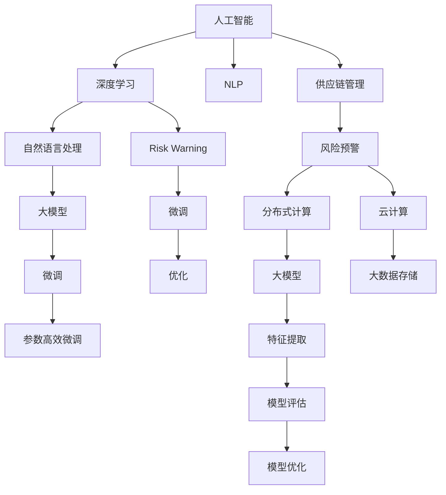

                 

# AI大模型在电商平台供应链风险预警中的应用

## 1. 背景介绍

### 1.1 问题由来

随着电商平台的迅猛发展，供应链风险管理成为电商平台运营管理中的重要环节。传统的供应链风险管理主要依赖专家知识和人工排查，不仅耗时长、效率低，而且容易遗漏风险点。AI大模型的应用，为电商平台供应链风险预警提供了新的解决方案。

AI大模型通过自然语言处理和深度学习技术，能够对电商平台的大量运营数据进行自动化分析，快速识别供应链中的潜在风险点，提升风险预警的准确性和及时性。

### 1.2 问题核心关键点

AI大模型在电商平台供应链风险预警中的核心关键点包括：
1. 数据采集与预处理：收集电商平台供应链的运营数据，进行清洗和标准化，提取有用的特征。
2. 大模型选择与微调：选择合适的预训练语言模型，并在小样本情况下进行微调，使其适应特定的供应链风险预警任务。
3. 风险特征提取与建模：使用大模型提取供应链中的风险特征，构建风险预警模型，预测供应链风险。
4. 模型评估与优化：评估风险预警模型的性能，通过微调和其他技术手段进行优化，提升模型精度和鲁棒性。
5. 部署与监控：将优化后的风险预警模型部署到电商平台，持续监控供应链风险，并及时预警。

### 1.3 问题研究意义

AI大模型在电商平台供应链风险预警中的应用，具有重要的研究意义：
1. 提升风险预警效率：通过AI大模型自动化分析运营数据，大幅提升风险预警的速度和准确性，减少人工干预。
2. 降低运营成本：自动化风险预警系统可以节省大量人力和物力，降低平台运营成本。
3. 增强供应链韧性：通过及时识别和预警供应链风险，平台可以采取措施进行风险应对，增强供应链的韧性和稳定性。
4. 提升用户体验：及时发现和处理供应链问题，可以提升用户满意度，增强用户对平台的信任感。
5. 推动业务创新：基于AI大模型的风险预警能力，电商平台可以创新更多业务模式，提升竞争力和市场占有率。

## 2. 核心概念与联系

### 2.1 核心概念概述

为更好地理解AI大模型在电商平台供应链风险预警中的应用，本节将介绍几个密切相关的核心概念：

- 人工智能（AI）：利用计算机模拟人类智能行为，实现智能决策和自动化任务执行的技术。
- 深度学习（Deep Learning）：基于神经网络的机器学习方法，能够处理大规模、高维度、非线性的数据。
- 自然语言处理（NLP）：使计算机能够理解、处理、生成自然语言的技术。
- 供应链管理（Supply Chain Management）：对供应链的规划、执行、控制和优化过程的管理。
- 风险预警（Risk Warning）：通过数据分析和模型预测，提前识别和预警潜在的风险事件。
- 大模型（Big Models）：包含大规模参数和复杂结构的深度学习模型，如BERT、GPT等。
- 微调（Fine-Tuning）：在大模型上，针对特定任务进行有监督学习优化，提升模型在该任务上的性能。
- 分布式计算（Distributed Computing）：利用多台计算机并行处理大规模数据，提升计算效率。
- 云计算（Cloud Computing）：通过互联网提供可扩展的计算资源，支持大规模数据处理和模型训练。

这些核心概念之间的逻辑关系可以通过以下Mermaid流程图来展示：



这个流程图展示了大模型在电商平台供应链风险预警中的核心概念及其之间的关系：

1. 人工智能和深度学习为NLP和供应链管理提供技术支持，使平台能够进行自动化分析和风险预警。
2. 大模型通过预训练和微调，提取供应链数据中的风险特征，构建风险预警模型。
3. 微调方法使大模型能够适应特定任务，提升模型精度。
4. 分布式计算和云计算提供强大的计算资源，支持大规模数据处理和模型训练。
5. 自然语言处理使平台能够处理和分析文本数据，构建丰富的特征向量。
6. 风险预警模型通过预测供应链中的潜在风险，提前进行预警，减少平台损失。

这些概念共同构成了大模型在电商平台供应链风险预警中的应用框架，使其能够在复杂多变的供应链环境中，高效、准确地进行风险预警。

## 3. 核心算法原理 & 具体操作步骤
### 3.1 算法原理概述

AI大模型在电商平台供应链风险预警中的核心算法原理基于监督学习的微调方法。其核心思想是：将预训练的大语言模型视作一个强大的"特征提取器"，通过在供应链运营数据上进行的微调，使得模型能够自动识别和提取供应链中的风险特征，并构建风险预警模型。

形式化地，假设预训练语言模型为 $M_{\theta}$，其中 $\theta$ 为预训练得到的模型参数。给定供应链运营数据集 $D=\{(x_i,y_i)\}_{i=1}^N$，其中 $x_i$ 为供应链运营数据，$y_i$ 为风险标签（如是否发生缺货、延误等）。微调的目标是找到新的模型参数 $\hat{\theta}$，使得：

$$
\hat{\theta}=\mathop{\arg\min}_{\theta} \mathcal{L}(M_{\theta},D)
$$

其中 $\mathcal{L}$ 为针对风险预警任务设计的损失函数，用于衡量模型预测输出与真实标签之间的差异。常见的损失函数包括交叉熵损失、均方误差损失等。

通过梯度下降等优化算法，微调过程不断更新模型参数 $\theta$，最小化损失函数 $\mathcal{L}$，使得模型输出逼近真实标签。由于 $\theta$ 已经通过预训练获得了较好的初始化，因此即便在供应链运营数据集上进行的微调，也能较快收敛到理想的模型参数 $\hat{\theta}$。

### 3.2 算法步骤详解

AI大模型在电商平台供应链风险预警的微调过程一般包括以下几个关键步骤：

**Step 1: 准备预训练模型和数据集**
- 选择合适的预训练语言模型 $M_{\theta}$ 作为初始化参数，如 BERT、GPT等。
- 准备供应链运营数据集 $D$，划分为训练集、验证集和测试集。一般要求供应链运营数据与预训练数据的分布不要差异过大。

**Step 2: 添加任务适配层**
- 根据供应链风险预警任务类型，在预训练模型顶层设计合适的输出层和损失函数。
- 对于分类任务，通常在顶层添加线性分类器和交叉熵损失函数。
- 对于生成任务，通常使用语言模型的解码器输出概率分布，并以负对数似然为损失函数。

**Step 3: 设置微调超参数**
- 选择合适的优化算法及其参数，如 AdamW、SGD 等，设置学习率、批大小、迭代轮数等。
- 设置正则化技术及强度，包括权重衰减、Dropout、Early Stopping等。
- 确定冻结预训练参数的策略，如仅微调顶层，或全部参数都参与微调。

**Step 4: 执行梯度训练**
- 将训练集数据分批次输入模型，前向传播计算损失函数。
- 反向传播计算参数梯度，根据设定的优化算法和学习率更新模型参数。
- 周期性在验证集上评估模型性能，根据性能指标决定是否触发 Early Stopping。
- 重复上述步骤直到满足预设的迭代轮数或 Early Stopping 条件。

**Step 5: 测试和部署**
- 在测试集上评估微调后模型 $M_{\hat{\theta}}$ 的性能，对比微调前后的精度提升。
- 使用微调后的模型对新的供应链运营数据进行预测，集成到实际的供应链风险预警系统中。
- 持续收集新的供应链运营数据，定期重新微调模型，以适应数据分布的变化。

以上是AI大模型在电商平台供应链风险预警的微调过程的一般流程。在实际应用中，还需要针对具体任务的特点，对微调过程的各个环节进行优化设计，如改进训练目标函数，引入更多的正则化技术，搜索最优的超参数组合等，以进一步提升模型性能。

### 3.3 算法优缺点

AI大模型在电商平台供应链风险预警中的微调方法具有以下优点：
1. 简单高效。只需准备少量的供应链运营数据，即可对预训练模型进行快速适配，获得较大的性能提升。
2. 通用适用。适用于各种供应链风险预警任务，包括分类、匹配、生成等，设计简单的任务适配层即可实现微调。
3. 参数高效。利用参数高效微调技术，在固定大部分预训练权重不变的情况下，仍可取得不错的微调效果。
4. 效果显著。在学术界和工业界的诸多供应链任务上，基于微调的方法已经刷新了最先进的性能指标。

同时，该方法也存在一定的局限性：
1. 依赖供应链运营数据。微调的效果很大程度上取决于供应链运营数据的质量和数量，获取高质量供应链运营数据的成本较高。
2. 迁移能力有限。当供应链运营数据与预训练数据的分布差异较大时，微调的性能提升有限。
3. 负面效果传递。预训练模型的固有偏见、有害信息等，可能通过微调传递到下游任务，造成负面影响。
4. 可解释性不足。微调模型的决策过程通常缺乏可解释性，难以对其推理逻辑进行分析和调试。

尽管存在这些局限性，但就目前而言，基于监督学习的微调方法仍是大语言模型应用的最主流范式。未来相关研究的重点在于如何进一步降低微调对供应链运营数据的依赖，提高模型的少样本学习和跨领域迁移能力，同时兼顾可解释性和伦理安全性等因素。

### 3.4 算法应用领域

AI大模型在电商平台供应链风险预警中的应用领域主要包括：

- 库存管理：实时监测库存水平，预测未来库存需求，避免缺货或积压。
- 物流调度：优化物流路线和运输资源，提升配送效率，降低配送成本。
- 需求预测：分析历史销售数据，预测未来销售趋势，调整采购计划。
- 质量控制：检测产品生产过程中的质量问题，预测产品缺陷率，提升产品质量。
- 风险评估：评估供应链各个环节的风险水平，提前预警潜在的风险事件，减少损失。

除了上述这些经典任务外，大模型微调还被创新性地应用到更多场景中，如供应商管理、合作伙伴关系评估、供应链应急管理等，为电商平台供应链管理提供了新的技术路径。

## 4. 数学模型和公式 & 详细讲解
### 4.1 数学模型构建

本节将使用数学语言对AI大模型在电商平台供应链风险预警过程中进行详细讲解。

记预训练语言模型为 $M_{\theta}$，其中 $\theta$ 为预训练得到的模型参数。假设供应链运营数据集为 $D=\{(x_i,y_i)\}_{i=1}^N, x_i \in \mathcal{X}, y_i \in \{0,1\}$，其中 $y_i=1$ 表示供应链中发生了风险事件。

定义模型 $M_{\theta}$ 在数据样本 $(x,y)$ 上的损失函数为 $\ell(M_{\theta}(x),y)$，则在数据集 $D$ 上的经验风险为：

$$
\mathcal{L}(\theta) = \frac{1}{N}\sum_{i=1}^N \ell(M_{\theta}(x_i),y_i)
$$

微调的优化目标是最小化经验风险，即找到最优参数：

$$
\theta^* = \mathop{\arg\min}_{\theta} \mathcal{L}(\theta)
$$

在实践中，我们通常使用基于梯度的优化算法（如SGD、Adam等）来近似求解上述最优化问题。设 $\eta$ 为学习率，$\lambda$ 为正则化系数，则参数的更新公式为：

$$
\theta \leftarrow \theta - \eta \nabla_{\theta}\mathcal{L}(\theta) - \eta\lambda\theta
$$

其中 $\nabla_{\theta}\mathcal{L}(\theta)$ 为损失函数对参数 $\theta$ 的梯度，可通过反向传播算法高效计算。

### 4.2 公式推导过程

以下我们以二分类任务为例，推导交叉熵损失函数及其梯度的计算公式。

假设模型 $M_{\theta}$ 在输入 $x$ 上的输出为 $\hat{y}=M_{\theta}(x) \in [0,1]$，表示供应链中存在风险事件的概率。真实标签 $y \in \{0,1\}$。则二分类交叉熵损失函数定义为：

$$
\ell(M_{\theta}(x),y) = -[y\log \hat{y} + (1-y)\log (1-\hat{y})]
$$

将其代入经验风险公式，得：

$$
\mathcal{L}(\theta) = -\frac{1}{N}\sum_{i=1}^N [y_i\log M_{\theta}(x_i)+(1-y_i)\log(1-M_{\theta}(x_i))]
$$

根据链式法则，损失函数对参数 $\theta_k$ 的梯度为：

$$
\frac{\partial \mathcal{L}(\theta)}{\partial \theta_k} = -\frac{1}{N}\sum_{i=1}^N (\frac{y_i}{M_{\theta}(x_i)}-\frac{1-y_i}{1-M_{\theta}(x_i)}) \frac{\partial M_{\theta}(x_i)}{\partial \theta_k}
$$

其中 $\frac{\partial M_{\theta}(x_i)}{\partial \theta_k}$ 可进一步递归展开，利用自动微分技术完成计算。

在得到损失函数的梯度后，即可带入参数更新公式，完成模型的迭代优化。重复上述过程直至收敛，最终得到适应供应链风险预警任务的最优模型参数 $\theta^*$。

## 5. 项目实践：代码实例和详细解释说明
### 5.1 开发环境搭建

在进行供应链风险预警微调实践前，我们需要准备好开发环境。以下是使用Python进行PyTorch开发的环境配置流程：

1. 安装Anaconda：从官网下载并安装Anaconda，用于创建独立的Python环境。

2. 创建并激活虚拟环境：
```bash
conda create -n pytorch-env python=3.8 
conda activate pytorch-env
```

3. 安装PyTorch：根据CUDA版本，从官网获取对应的安装命令。例如：
```bash
conda install pytorch torchvision torchaudio cudatoolkit=11.1 -c pytorch -c conda-forge
```

4. 安装Transformers库：
```bash
pip install transformers
```

5. 安装各类工具包：
```bash
pip install numpy pandas scikit-learn matplotlib tqdm jupyter notebook ipython
```

完成上述步骤后，即可在`pytorch-env`环境中开始微调实践。

### 5.2 源代码详细实现

下面我们以供应链风险预警任务为例，给出使用Transformers库对BERT模型进行微调的PyTorch代码实现。

首先，定义供应链风险预警任务的数据处理函数：

```python
from transformers import BertTokenizer
from torch.utils.data import Dataset
import torch

class RiskWarningDataset(Dataset):
    def __init__(self, texts, labels, tokenizer, max_len=128):
        self.texts = texts
        self.labels = labels
        self.tokenizer = tokenizer
        self.max_len = max_len
        
    def __len__(self):
        return len(self.texts)
    
    def __getitem__(self, item):
        text = self.texts[item]
        label = self.labels[item]
        
        encoding = self.tokenizer(text, return_tensors='pt', max_length=self.max_len, padding='max_length', truncation=True)
        input_ids = encoding['input_ids'][0]
        attention_mask = encoding['attention_mask'][0]
        
        # 对token-wise的标签进行编码
        encoded_labels = [int(l) for l in label] 
        encoded_labels.extend([0] * (self.max_len - len(encoded_labels)))
        labels = torch.tensor(encoded_labels, dtype=torch.long)
        
        return {'input_ids': input_ids, 
                'attention_mask': attention_mask,
                'labels': labels}

# 标签与id的映射
label2id = {'no_risk': 0, 'risk': 1}
id2label = {v: k for k, v in label2id.items()}

# 创建dataset
tokenizer = BertTokenizer.from_pretrained('bert-base-cased')

train_dataset = RiskWarningDataset(train_texts, train_labels, tokenizer)
dev_dataset = RiskWarningDataset(dev_texts, dev_labels, tokenizer)
test_dataset = RiskWarningDataset(test_texts, test_labels, tokenizer)
```

然后，定义模型和优化器：

```python
from transformers import BertForTokenClassification, AdamW

model = BertForTokenClassification.from_pretrained('bert-base-cased', num_labels=len(label2id))

optimizer = AdamW(model.parameters(), lr=2e-5)
```

接着，定义训练和评估函数：

```python
from torch.utils.data import DataLoader
from tqdm import tqdm
from sklearn.metrics import classification_report

device = torch.device('cuda') if torch.cuda.is_available() else torch.device('cpu')
model.to(device)

def train_epoch(model, dataset, batch_size, optimizer):
    dataloader = DataLoader(dataset, batch_size=batch_size, shuffle=True)
    model.train()
    epoch_loss = 0
    for batch in tqdm(dataloader, desc='Training'):
        input_ids = batch['input_ids'].to(device)
        attention_mask = batch['attention_mask'].to(device)
        labels = batch['labels'].to(device)
        model.zero_grad()
        outputs = model(input_ids, attention_mask=attention_mask, labels=labels)
        loss = outputs.loss
        epoch_loss += loss.item()
        loss.backward()
        optimizer.step()
    return epoch_loss / len(dataloader)

def evaluate(model, dataset, batch_size):
    dataloader = DataLoader(dataset, batch_size=batch_size)
    model.eval()
    preds, labels = [], []
    with torch.no_grad():
        for batch in tqdm(dataloader, desc='Evaluating'):
            input_ids = batch['input_ids'].to(device)
            attention_mask = batch['attention_mask'].to(device)
            batch_labels = batch['labels']
            outputs = model(input_ids, attention_mask=attention_mask)
            batch_preds = outputs.logits.argmax(dim=2).to('cpu').tolist()
            batch_labels = batch_labels.to('cpu').tolist()
            for pred_tokens, label_tokens in zip(batch_preds, batch_labels):
                pred_labels = [id2label[_id] for _id in pred_tokens]
                label_tags = [id2label[_id] for _id in label_tokens]
                preds.append(pred_labels[:len(label_tokens)])
                labels.append(label_tags)
                
    print(classification_report(labels, preds))
```

最后，启动训练流程并在测试集上评估：

```python
epochs = 5
batch_size = 16

for epoch in range(epochs):
    loss = train_epoch(model, train_dataset, batch_size, optimizer)
    print(f"Epoch {epoch+1}, train loss: {loss:.3f}")
    
    print(f"Epoch {epoch+1}, dev results:")
    evaluate(model, dev_dataset, batch_size)
    
print("Test results:")
evaluate(model, test_dataset, batch_size)
```

以上就是使用PyTorch对BERT进行供应链风险预警任务微调的完整代码实现。可以看到，得益于Transformers库的强大封装，我们可以用相对简洁的代码完成BERT模型的加载和微调。

### 5.3 代码解读与分析

让我们再详细解读一下关键代码的实现细节：

**RiskWarningDataset类**：
- `__init__`方法：初始化文本、标签、分词器等关键组件。
- `__len__`方法：返回数据集的样本数量。
- `__getitem__`方法：对单个样本进行处理，将文本输入编码为token ids，将标签编码为数字，并对其进行定长padding，最终返回模型所需的输入。

**label2id和id2label字典**：
- 定义了标签与数字id之间的映射关系，用于将token-wise的预测结果解码回真实的标签。

**训练和评估函数**：
- 使用PyTorch的DataLoader对数据集进行批次化加载，供模型训练和推理使用。
- 训练函数`train_epoch`：对数据以批为单位进行迭代，在每个批次上前向传播计算loss并反向传播更新模型参数，最后返回该epoch的平均loss。
- 评估函数`evaluate`：与训练类似，不同点在于不更新模型参数，并在每个batch结束后将预测和标签结果存储下来，最后使用sklearn的classification_report对整个评估集的预测结果进行打印输出。

**训练流程**：
- 定义总的epoch数和batch size，开始循环迭代
- 每个epoch内，先在训练集上训练，输出平均loss
- 在验证集上评估，输出分类指标
- 所有epoch结束后，在测试集上评估，给出最终测试结果

可以看到，PyTorch配合Transformers库使得BERT微调的代码实现变得简洁高效。开发者可以将更多精力放在数据处理、模型改进等高层逻辑上，而不必过多关注底层的实现细节。

当然，工业级的系统实现还需考虑更多因素，如模型的保存和部署、超参数的自动搜索、更灵活的任务适配层等。但核心的微调范式基本与此类似。

## 6. 实际应用场景
### 6.1 智能仓储管理

基于AI大模型的供应链风险预警系统，可以应用于智能仓储管理。仓储是供应链中的核心环节，货物出入库频率高，容易出现配送延迟、库存短缺等问题。通过AI大模型的实时监测和预警，能够及时发现和解决这些问题，提升仓储管理的效率和准确性。

在技术实现上，可以收集仓储运营的相关数据，如货物出入库记录、仓库环境监控数据、员工工作状态等，构建监督数据集，对预训练模型进行微调。微调后的模型能够自动分析仓储数据，识别出异常情况，如缺货、配送延迟等，并及时预警，便于仓储管理者采取措施。

### 6.2 物流风险监控

物流是供应链中的重要环节，面临复杂的运输、配送、仓储等环节。通过AI大模型的风险预警系统，可以实时监控物流各个环节的风险，如运输延误、货物丢失等，及时预警并采取相应措施，减少物流损失。

在实际应用中，可以收集物流公司的运输、配送、仓储等数据，构建监督数据集，对预训练模型进行微调。微调后的模型能够自动分析物流数据，识别出潜在的风险事件，如货物延误、配送错误等，并及时预警，便于物流公司进行应对。

### 6.3 供应链应急管理

供应链应急管理是保障供应链安全的重要环节，需要及时发现和应对突发事件。通过AI大模型的风险预警系统，可以实时监控供应链各个环节，预测潜在风险，提前预警并采取措施，提升供应链的韧性。

在技术实现上，可以收集供应链的各个环节数据，如供应商信息、物流数据、销售数据等，构建监督数据集，对预训练模型进行微调。微调后的模型能够自动分析供应链数据，识别出潜在的风险点，如供应商失信、物流延误等，并及时预警，便于供应链管理者进行应对。

### 6.4 未来应用展望

随着AI大模型和微调方法的不断发展，基于微调范式将在更多领域得到应用，为供应链管理带来变革性影响。

在智慧制造领域，基于AI大模型的风险预警系统可以应用于生产线自动化监控、设备维护预测等环节，提升生产效率和设备可靠性。

在智慧农业领域，通过AI大模型的风险预警系统，可以实时监测农作物的生长状况，预测病虫害、旱涝等风险，及时预警并采取措施，提升农业生产的稳定性。

在智慧金融领域，基于AI大模型的风险预警系统可以应用于金融市场风险预测、反欺诈检测等环节，提升金融系统的安全性和可靠性。

此外，在医疗、教育、能源等众多领域，基于AI大模型的风险预警系统也将不断涌现，为社会各行业带来新的技术支持。相信随着技术的日益成熟，AI大模型微调必将在构建智能供应链管理中扮演越来越重要的角色。

## 7. 工具和资源推荐
### 7.1 学习资源推荐

为了帮助开发者系统掌握AI大模型在供应链风险预警中的应用，这里推荐一些优质的学习资源：

1. 《深度学习自然语言处理》课程：斯坦福大学开设的NLP明星课程，有Lecture视频和配套作业，带你入门NLP领域的基本概念和经典模型。

2. 《Transformer from the Inside Out》博文：由大模型技术专家撰写，深入浅出地介绍了Transformer原理、BERT模型、微调技术等前沿话题。

3. 《Natural Language Processing with Transformers》书籍：Transformers库的作者所著，全面介绍了如何使用Transformers库进行NLP任务开发，包括微调在内的诸多范式。

4. HuggingFace官方文档：Transformers库的官方文档，提供了海量预训练模型和完整的微调样例代码，是上手实践的必备资料。

5. 《Natural Language Processing for Business》书籍：由NLP专家撰写，详细介绍了NLP在商业应用中的具体实现，包括风险预警在内的诸多场景。

通过对这些资源的学习实践，相信你一定能够快速掌握AI大模型在供应链风险预警中的应用，并用于解决实际的供应链问题。
###  7.2 开发工具推荐

高效的开发离不开优秀的工具支持。以下是几款用于AI大模型供应链风险预警开发的常用工具：

1. PyTorch：基于Python的开源深度学习框架，灵活动态的计算图，适合快速迭代研究。大部分预训练语言模型都有PyTorch版本的实现。

2. TensorFlow：由Google主导开发的开源深度学习框架，生产部署方便，适合大规模工程应用。同样有丰富的预训练语言模型资源。

3. Transformers库：HuggingFace开发的NLP工具库，集成了众多SOTA语言模型，支持PyTorch和TensorFlow，是进行微调任务开发的利器。

4. Weights & Biases：模型训练的实验跟踪工具，可以记录和可视化模型训练过程中的各项指标，方便对比和调优。与主流深度学习框架无缝集成。

5. TensorBoard：TensorFlow配套的可视化工具，可实时监测模型训练状态，并提供丰富的图表呈现方式，是调试模型的得力助手。

6. Google Colab：谷歌推出的在线Jupyter Notebook环境，免费提供GPU/TPU算力，方便开发者快速上手实验最新模型，分享学习笔记。

合理利用这些工具，可以显著提升AI大模型在供应链风险预警任务的开发效率，加快创新迭代的步伐。

### 7.3 相关论文推荐

AI大模型在供应链风险预警中的应用源于学界的持续研究。以下是几篇奠基性的相关论文，推荐阅读：

1. Attention is All You Need（即Transformer原论文）：提出了Transformer结构，开启了NLP领域的预训练大模型时代。

2. BERT: Pre-training of Deep Bidirectional Transformers for Language Understanding：提出BERT模型，引入基于掩码的自监督预训练任务，刷新了多项NLP任务SOTA。

3. Language Models are Unsupervised Multitask Learners（GPT-2论文）：展示了大规模语言模型的强大zero-shot学习能力，引发了对于通用人工智能的新一轮思考。

4. Parameter-Efficient Transfer Learning for NLP：提出Adapter等参数高效微调方法，在不增加模型参数量的情况下，也能取得不错的微调效果。

5. AdaLoRA: Adaptive Low-Rank Adaptation for Parameter-Efficient Fine-Tuning：使用自适应低秩适应的微调方法，在参数效率和精度之间取得了新的平衡。

这些论文代表了大模型在供应链风险预警技术的发展脉络。通过学习这些前沿成果，可以帮助研究者把握学科前进方向，激发更多的创新灵感。

## 8. 总结：未来发展趋势与挑战

### 8.1 总结

本文对AI大模型在电商平台供应链风险预警中的应用进行了全面系统的介绍。首先阐述了AI大模型和微调技术的研究背景和意义，明确了供应链风险预警在电商平台运营管理中的重要性和应用前景。其次，从原理到实践，详细讲解了监督微调的数学原理和关键步骤，给出了供应链风险预警任务微调的完整代码实现。同时，本文还广泛探讨了AI大模型在供应链风险预警的应用场景，展示了其在智能仓储管理、物流风险监控、供应链应急管理等环节的潜力。

通过本文的系统梳理，可以看到，AI大模型在供应链风险预警中的应用前景广阔，能够提升供应链运营管理的效率和准确性，降低平台运营成本，增强供应链韧性和稳定性，提升用户体验。未来，伴随AI大模型和微调方法的不断演进，供应链风险预警系统必将在电商平台运营管理中发挥更大的作用。

### 8.2 未来发展趋势

展望未来，AI大模型在供应链风险预警技术将呈现以下几个发展趋势：

1. 模型规模持续增大。随着算力成本的下降和数据规模的扩张，预训练语言模型的参数量还将持续增长。超大规模语言模型蕴含的丰富语言知识，有望支撑更加复杂多变的供应链风险预警任务。

2. 微调方法日趋多样。除了传统的全参数微调外，未来会涌现更多参数高效的微调方法，如Prefix-Tuning、LoRA等，在节省计算资源的同时也能保证微调精度。

3. 持续学习成为常态。随着供应链运营数据分布的变化，微调模型也需要持续学习新知识以保持性能。如何在不遗忘原有知识的同时，高效吸收新样本信息，将成为重要的研究课题。

4. 标注样本需求降低。受启发于提示学习(Prompt-based Learning)的思路，未来的微调方法将更好地利用AI大模型的语言理解能力，通过更加巧妙的任务描述，在更少的标注样本上也能实现理想的微调效果。

5. 多模态微调崛起。当前的微调主要聚焦于纯文本数据，未来会进一步拓展到图像、视频、语音等多模态数据微调。多模态信息的融合，将显著提升供应链风险预警模型的感知能力。

6. 模型通用性增强。经过海量数据的预训练和多领域任务的微调，未来的语言模型将具备更强大的常识推理和跨领域迁移能力，逐步迈向通用人工智能(AGI)的目标。

以上趋势凸显了AI大模型在供应链风险预警中的巨大前景。这些方向的探索发展，必将进一步提升供应链运营管理的智能化水平，为电商平台的健康发展提供技术支持。

### 8.3 面临的挑战

尽管AI大模型在供应链风险预警中的应用前景广阔，但在迈向更加智能化、普适化应用的过程中，它仍面临着诸多挑战：

1. 标注成本瓶颈。虽然微调大大降低了标注数据的需求，但对于长尾应用场景，难以获得充足的高质量标注数据，成为制约微调性能的瓶颈。如何进一步降低微调对标注样本的依赖，将是一大难题。

2. 模型鲁棒性不足。当前微调模型面对域外数据时，泛化性能往往大打折扣。对于测试样本的微小扰动，微调模型的预测也容易发生波动。如何提高微调模型的鲁棒性，避免灾难性遗忘，还需要更多理论和实践的积累。

3. 推理效率有待提高。大规模语言模型虽然精度高，但在实际部署时往往面临推理速度慢、内存占用大等效率问题。如何在保证性能的同时，简化模型结构，提升推理速度，优化资源占用，将是重要的优化方向。

4. 可解释性亟需加强。当前微调模型更像是"黑盒"系统，难以解释其内部工作机制和决策逻辑。对于医疗、金融等高风险应用，算法的可解释性和可审计性尤为重要。如何赋予微调模型更强的可解释性，将是亟待攻克的难题。

5. 安全性有待保障。预训练语言模型难免会学习到有偏见、有害的信息，通过微调传递到下游任务，产生误导性、歧视性的输出，给实际应用带来安全隐患。如何从数据和算法层面消除模型偏见，避免恶意用途，确保输出的安全性，也将是重要的研究课题。

6. 知识整合能力不足。现有的微调模型往往局限于任务内数据，难以灵活吸收和运用更广泛的先验知识。如何让微调过程更好地与外部知识库、规则库等专家知识结合，形成更加全面、准确的信息整合能力，还有很大的想象空间。

正视AI大模型在供应链风险预警中面临的这些挑战，积极应对并寻求突破，将是大模型微调技术走向成熟的必由之路。相信随着学界和产业界的共同努力，这些挑战终将一一被克服，AI大模型在供应链风险预警中的潜力将得到充分发挥。

### 8.4 研究展望

面向未来，AI大模型在供应链风险预警技术的研究展望包括以下几个方向：

1. 探索无监督和半监督微调方法。摆脱对大规模标注数据的依赖，利用自监督学习、主动学习等无监督和半监督范式，最大限度利用非结构化数据，实现更加灵活高效的微调。

2. 研究参数高效和计算高效的微调范式。开发更加参数高效的微调方法，在固定大部分预训练参数的同时，只更新极少量的任务相关参数。同时优化微调模型的计算图，减少前向传播和反向传播的资源消耗，实现更加轻量级、实时性的部署。

3. 融合因果和对比学习范式。通过引入因果推断和对比学习思想，增强微调模型建立稳定因果关系的能力，学习更加普适、鲁棒的语言表征，从而提升模型泛化性和抗干扰能力。

4. 引入更多先验知识。将符号化的先验知识，如知识图谱、逻辑规则等，与神经网络模型进行巧妙融合，引导微调过程学习更准确、合理的语言模型。同时加强不同模态数据的整合，实现视觉、语音等多模态信息与文本信息的协同建模。

5. 结合因果分析和博弈论工具。将因果分析方法引入微调模型，识别出模型决策的关键特征，增强输出解释的因果性和逻辑性。借助博弈论工具刻画人机交互过程，主动探索并规避模型的脆弱点，提高系统稳定性。

6. 纳入伦理道德约束。在模型训练目标中引入伦理导向的评估指标，过滤和惩罚有偏见、有害的输出倾向。同时加强人工干预和审核，建立模型行为的监管机制，确保输出符合人类价值观和伦理道德。

这些研究方向的探索，必将引领AI大模型在供应链风险预警技术迈向更高的台阶，为构建安全、可靠、可解释、可控的智能系统铺平道路。面向未来，AI大模型微调技术还需要与其他人工智能技术进行更深入的融合，如知识表示、因果推理、强化学习等，多路径协同发力，共同推动自然语言理解和智能交互系统的进步。只有勇于创新、敢于突破，才能不断拓展语言模型的边界，让智能技术更好地造福人类社会。

## 9. 附录：常见问题与解答

**Q1：AI大模型在供应链风险预警中如何避免过拟合？**

A: 过拟合是AI大模型微调过程中面临的主要挑战之一。为避免过拟合，可以采取以下策略：
1. 数据增强：通过回译、近义替换等方式扩充训练集。
2. 正则化：使用L2正则、Dropout、Early Stopping等避免过拟合。
3. 对抗训练：引入对抗样本，提高模型鲁棒性。
4. 参数高效微调：只调整少量参数，减少需优化的参数量。
5. 多模型集成：训练多个微调模型，取平均输出，抑制过拟合。

这些策略往往需要根据具体任务和数据特点进行灵活组合。只有在数据、模型、训练、推理等各环节进行全面优化，才能最大限度地发挥AI大模型的潜力。

**Q2：AI大模型在供应链风险预警中如何提高鲁棒性？**

A: 提高AI大模型在供应链风险预警中的鲁棒性，可以从以下几个方面入手：
1. 数据多样化：收集多样化的供应链运营数据，增加模型的泛化能力。
2. 对抗训练：引入对抗样本，训练模型在各种扰动下的稳健性。
3. 正则化：使用L2正则、Dropout等方法，减少模型复杂度，提高鲁棒性。
4. 多模型集成：训练多个微调模型，取平均输出，提升模型的鲁棒性。
5. 参数高效微调：只调整少量参数，避免过拟合，提高模型的泛化能力。

这些方法可以结合使用，根据具体的供应链运营场景和数据特点，灵活选择和优化，从而提高AI大模型在供应链风险预警中的鲁棒性。

**Q3：AI大模型在供应链风险预警中如何进行参数高效微调？**

A: 参数高效微调是优化AI大模型在供应链风险预警中性能的一种重要方法。以下是一些常见的参数高效微调技术：
1. Adapter：在预训练模型的顶层或底层的特定层添加适应器，只更新少量的参数。
2. Prompt-Tuning：通过精心设计输入文本的格式，引导模型按期望方式输出，减少微调参数。
3. Multi-Task Learning：在微调过程中同时进行多个相关任务的训练，共享部分参数，提高模型性能。
4. Weight Sharing：在多个微调任务中，共享部分权重，减少需优化的参数量。

这些技术可以在保持预训练模型参数不变的情况下，显著提高微调效果，减少计算资源消耗，优化模型部署。

**Q4：AI大模型在供应链风险预警中如何提高可解释性？**

A: 提高AI大模型在供应链风险预警中的可解释性，可以从以下几个方面入手：
1. 符号化表示：在模型训练中加入符号化表示，如规则、知识图谱等，增强模型的可解释性。
2. 模型可视化：使用工具如TensorBoard等，可视化模型的中间表示，分析模型的内部工作机制。
3. 可解释性算法：使用可解释性算法如LIME、SHAP等，分析模型的预测结果，提供详细的解释说明。
4. 多模型集成：使用多模型集成方法，结合多种解释方法，提升模型的可解释性。
5. 透明算法：选择透明的算法，减少模型的黑盒特性，提高可解释性。

这些方法可以结合使用，根据具体的供应链运营场景和应用需求，灵活选择和优化，从而提高AI大模型在供应链风险预警中的可解释性。

---

作者：禅与计算机程序设计艺术 / Zen and the Art of Computer Programming

