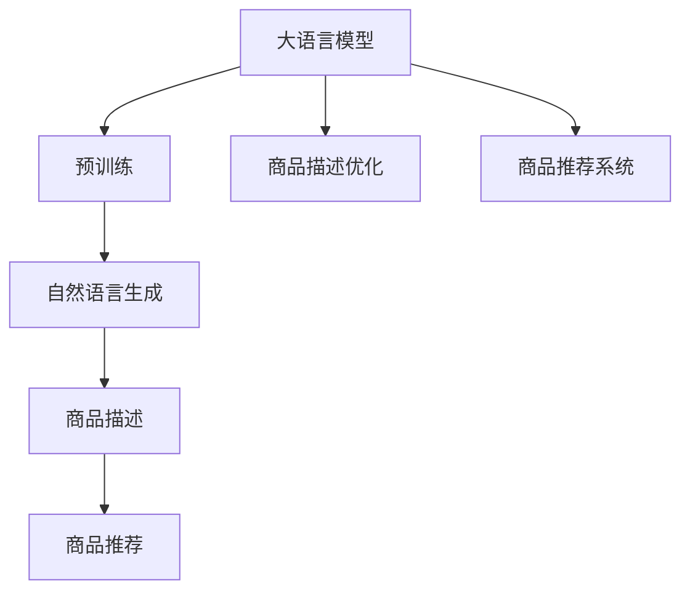
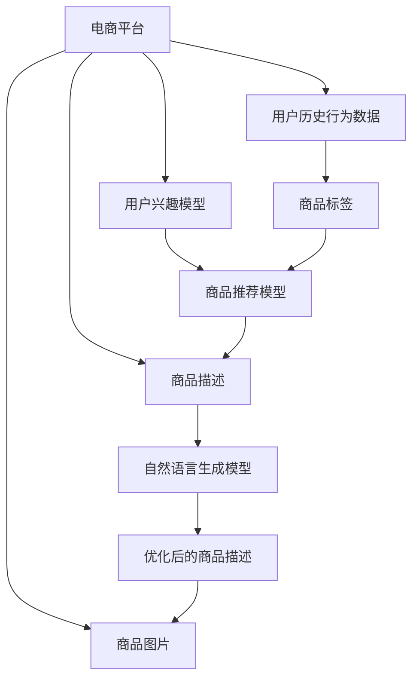

                 

# AI大模型在电商平台商品描述优化中的应用

> 关键词：大语言模型,电商平台,商品描述优化,自然语言生成(NLG),商品推荐系统

## 1. 背景介绍

随着电子商务的蓬勃发展，电商平台成为了广大消费者购买商品的重要渠道。商品描述作为电商平台上的核心信息，直接影响消费者的购买决策。如何通过优化商品描述，提升用户体验，增加交易转化率，成为电商平台亟需解决的重要问题。近年来，大语言模型（Large Language Model, LLM）的兴起，为商品描述优化提供了新的思路和方法。

## 2. 核心概念与联系

### 2.1 核心概念概述

为更好地理解AI大模型在电商平台商品描述优化中的应用，本节将介绍几个密切相关的核心概念：

- **大语言模型**：以自回归（如GPT）或自编码（如BERT）模型为代表的大规模预训练语言模型。通过在大规模无标签文本语料上进行预训练，学习通用的语言表示，具备强大的语言理解和生成能力。

- **商品描述**：电商平台商品页面上对商品进行的详细描述，包括商品的功能、特点、优势等信息。

- **商品推荐系统**：根据用户的历史行为数据，推荐可能感兴趣的潜在商品。商品描述作为推荐算法的重要输入，对推荐结果有显著影响。

- **自然语言生成（NLG）**：利用大模型自动生成自然流畅的文本描述，以提高商品描述的精准度和吸引力。

- **跨领域迁移学习**：将通用预训练语言模型应用于特定领域，如电商平台，实现知识迁移和任务适配。

这些核心概念之间的逻辑关系可以通过以下Mermaid流程图来展示：



### 2.2 核心概念原理和架构的 Mermaid 流程图



该流程图展示了商品推荐系统的主要组件及其工作流程：

1. 电商平台收集用户历史行为数据，建立用户兴趣模型。
2. 商品标签数据与用户兴趣模型结合，进入推荐模型，生成推荐商品列表。
3. 商品描述和图片数据进入自然语言生成模型，优化生成描述。
4. 优化后的商品描述再次进入推荐系统，优化推荐结果。

## 3. 核心算法原理 & 具体操作步骤

### 3.1 算法原理概述

AI大模型在电商平台商品描述优化中的应用，主要基于自然语言生成（NLG）和跨领域迁移学习的原理。通过在大规模无标签文本语料上进行预训练，大模型学习到了丰富的语言知识和文本生成能力。将这些能力应用于商品描述生成任务，能够自动生成高质量、多样化的描述，从而优化商品推荐系统。

具体来说，优化过程包括以下几个步骤：

1. **预训练语言模型**：在无标签文本数据上进行预训练，学习通用的语言表示和生成能力。

2. **商品描述数据集构建**：从电商平台收集商品描述文本数据，构建有监督的商品描述数据集。

3. **自然语言生成模型训练**：在大模型基础上进行微调，训练自然语言生成模型，用于生成商品描述。

4. **商品推荐系统集成**：将优化后的商品描述输入推荐系统，提高推荐效果。

### 3.2 算法步骤详解

#### 步骤1：准备预训练模型和数据集

- **选择预训练模型**：使用BigQuery、TextBlob、BERT等预训练语言模型作为初始化参数。
- **收集商品描述数据**：从电商平台获取商品描述文本数据，进行清洗和标注。
- **构建数据集**：将商品描述数据集划分为训练集、验证集和测试集。

#### 步骤2：设计自然语言生成模型

- **任务适配层设计**：根据任务需求，在预训练模型的顶层设计任务适配层。例如，在Transformer模型的顶层添加线性层和softmax层。
- **损失函数设计**：选择合适的损失函数，如交叉熵损失、BCE损失等，用于衡量模型输出与真实标签之间的差异。

#### 步骤3：模型微调和优化

- **设置超参数**：选择合适的优化算法（如AdamW、SGD），设置学习率、批大小、迭代轮数等。
- **正则化技术**：应用L2正则、Dropout、Early Stopping等技术，防止模型过拟合。
- **数据增强**：通过改写、回译等方式丰富训练集多样性。
- **对抗训练**：加入对抗样本，提高模型鲁棒性。
- **微调训练**：在训练集上进行有监督的微调，优化模型性能。
- **验证集评估**：周期性在验证集上评估模型性能，决定是否触发Early Stopping。
- **测试集测试**：在测试集上测试微调后的模型，评估优化效果。

#### 步骤4：商品推荐系统集成

- **推荐模型集成**：将优化后的商品描述输入推荐系统，更新推荐模型。
- **模型部署**：将训练好的模型部署到电商平台的推荐系统服务器上。
- **实时推荐**：实时获取用户行为数据，动态生成推荐商品，优化用户体验。

### 3.3 算法优缺点

#### 优点

- **自动化生成**：大模型能够自动生成高质量的商品描述，减少人工标注成本。
- **提升推荐效果**：优化后的商品描述提高了推荐系统精准度，提升了用户转化率。
- **灵活性高**：能够快速适应不同商品类别和描述风格，适用性广。

#### 缺点

- **数据依赖性强**：微调效果依赖于商品描述数据的质量和数量，获取高质量数据成本较高。
- **模型复杂度**：大模型的复杂度较高，训练和推理耗时长，需要较高的计算资源。
- **泛化能力有限**：当商品描述与预训练数据分布差异较大时，微调效果可能不佳。

### 3.4 算法应用领域

AI大模型在电商平台商品描述优化中的应用，已经得到了广泛的应用。例如：

- **电商平台**：优化商品描述，提高用户购买转化率。
- **零售企业**：根据产品特点自动生成商品描述，提升品牌形象。
- **广告公司**：为广告素材生成吸引人的描述，提高广告点击率。
- **旅游行业**：优化景点描述，吸引更多游客访问。
- **在线教育**：优化课程描述，提高用户学习兴趣。

## 4. 数学模型和公式 & 详细讲解 & 举例说明

### 4.1 数学模型构建

假设大模型为 $M_{\theta}$，商品描述优化任务为生成给定商品的名称和类别描述。我们定义模型 $M_{\theta}$ 在商品描述文本 $x$ 上的输出为 $y=M_{\theta}(x)$，表示模型生成的商品描述。商品描述的标签 $y$ 为类别和名称的组合。

优化目标是最小化生成描述与真实标签之间的差异，即：

$$
\min_{\theta} \mathcal{L}(M_{\theta}, D) = \frac{1}{N} \sum_{i=1}^N \ell(M_{\theta}(x_i), y_i)
$$

其中，$\ell$ 为损失函数，$D$ 为商品描述数据集。

### 4.2 公式推导过程

以二分类任务为例，假设商品描述生成的交叉熵损失函数为：

$$
\ell(M_{\theta}(x), y) = -[y\log M_{\theta}(x) + (1-y)\log(1-M_{\theta}(x))]
$$

将其代入优化目标函数，得：

$$
\mathcal{L}(\theta) = -\frac{1}{N} \sum_{i=1}^N [y_i\log M_{\theta}(x_i)+(1-y_i)\log(1-M_{\theta}(x_i))]
$$

根据链式法则，损失函数对参数 $\theta_k$ 的梯度为：

$$
\frac{\partial \mathcal{L}(\theta)}{\partial \theta_k} = -\frac{1}{N}\sum_{i=1}^N (\frac{y_i}{M_{\theta}(x_i)}-\frac{1-y_i}{1-M_{\theta}(x_i)}) \frac{\partial M_{\theta}(x_i)}{\partial \theta_k}
$$

其中 $\frac{\partial M_{\theta}(x_i)}{\partial \theta_k}$ 可通过自动微分技术高效计算。

### 4.3 案例分析与讲解

假设我们要优化电商平台上某款手机的商品描述。我们将手机的名称和类别作为训练数据，使用BERT模型进行预训练，并在其基础上进行微调。具体步骤如下：

1. **数据准备**：从电商平台获取手机的名称和类别描述，构建商品描述数据集。
2. **模型初始化**：选择BERT模型作为初始化参数，添加任务适配层。
3. **设置超参数**：选择AdamW优化器，设置学习率为 $10^{-5}$。
4. **微调训练**：在商品描述数据集上训练模型，每次迭代更新参数。
5. **验证集评估**：在验证集上评估模型性能，防止过拟合。
6. **测试集测试**：在测试集上测试模型效果，评估优化结果。

## 5. 项目实践：代码实例和详细解释说明

### 5.1 开发环境搭建

在进行商品描述优化项目开发前，我们需要准备好开发环境。以下是使用Python进行PyTorch开发的环境配置流程：

1. 安装Anaconda：从官网下载并安装Anaconda，用于创建独立的Python环境。

2. 创建并激活虚拟环境：
```bash
conda create -n pytorch-env python=3.8 
conda activate pytorch-env
```

3. 安装PyTorch：根据CUDA版本，从官网获取对应的安装命令。例如：
```bash
conda install pytorch torchvision torchaudio cudatoolkit=11.1 -c pytorch -c conda-forge
```

4. 安装Transformers库：
```bash
pip install transformers
```

5. 安装各类工具包：
```bash
pip install numpy pandas scikit-learn matplotlib tqdm jupyter notebook ipython
```

完成上述步骤后，即可在`pytorch-env`环境中开始商品描述优化实践。

### 5.2 源代码详细实现

这里我们以商品推荐系统为例，给出使用Transformers库对BERT模型进行商品描述优化的PyTorch代码实现。

```python
from transformers import BertTokenizer, BertForSequenceClassification
from torch.utils.data import Dataset, DataLoader
from tqdm import tqdm
from sklearn.metrics import accuracy_score
import torch.nn as nn
import torch

# 商品描述数据集处理
class ProductDescDataset(Dataset):
    def __init__(self, texts, labels, tokenizer):
        self.texts = texts
        self.labels = labels
        self.tokenizer = tokenizer
    
    def __len__(self):
        return len(self.texts)
    
    def __getitem__(self, idx):
        text = self.texts[idx]
        label = self.labels[idx]
        
        encoding = self.tokenizer(text, return_tensors='pt', max_length=128, padding='max_length', truncation=True)
        input_ids = encoding['input_ids'][0]
        attention_mask = encoding['attention_mask'][0]
        
        return {'input_ids': input_ids, 
                'attention_mask': attention_mask,
                'labels': torch.tensor(label, dtype=torch.long)}
```

```python
# 训练和评估函数
def train_epoch(model, dataset, batch_size, optimizer):
    dataloader = DataLoader(dataset, batch_size=batch_size, shuffle=True)
    model.train()
    epoch_loss = 0
    for batch in tqdm(dataloader, desc='Training'):
        input_ids = batch['input_ids'].to(device)
        attention_mask = batch['attention_mask'].to(device)
        labels = batch['labels'].to(device)
        model.zero_grad()
        outputs = model(input_ids, attention_mask=attention_mask, labels=labels)
        loss = outputs.loss
        epoch_loss += loss.item()
        loss.backward()
        optimizer.step()
    return epoch_loss / len(dataloader)

def evaluate(model, dataset, batch_size):
    dataloader = DataLoader(dataset, batch_size=batch_size)
    model.eval()
    preds, labels = [], []
    with torch.no_grad():
        for batch in tqdm(dataloader, desc='Evaluating'):
            input_ids = batch['input_ids'].to(device)
            attention_mask = batch['attention_mask'].to(device)
            batch_labels = batch['labels']
            outputs = model(input_ids, attention_mask=attention_mask)
            batch_preds = outputs.logits.argmax(dim=1).to('cpu').tolist()
            batch_labels = batch_labels.to('cpu').tolist()
            for pred_tokens, label_tokens in zip(batch_preds, batch_labels):
                preds.append(pred_tokens)
                labels.append(label_tokens)
                
    return accuracy_score(labels, preds)

# 加载数据集
tokenizer = BertTokenizer.from_pretrained('bert-base-cased')
train_dataset = ProductDescDataset(train_texts, train_labels, tokenizer)
dev_dataset = ProductDescDataset(dev_texts, dev_labels, tokenizer)
test_dataset = ProductDescDataset(test_texts, test_labels, tokenizer)

# 初始化模型和优化器
model = BertForSequenceClassification.from_pretrained('bert-base-cased', num_labels=2)
optimizer = AdamW(model.parameters(), lr=2e-5)

# 训练和评估
device = torch.device('cuda') if torch.cuda.is_available() else torch.device('cpu')
model.to(device)

epochs = 5
batch_size = 16

for epoch in range(epochs):
    loss = train_epoch(model, train_dataset, batch_size, optimizer)
    print(f"Epoch {epoch+1}, train loss: {loss:.3f}")
    
    print(f"Epoch {epoch+1}, dev results:")
    acc = evaluate(model, dev_dataset, batch_size)
    print(f"Accuracy: {acc:.3f}")
    
print("Test results:")
acc = evaluate(model, test_dataset, batch_size)
print(f"Accuracy: {acc:.3f}")
```

以上就是使用PyTorch对BERT进行商品描述优化的完整代码实现。可以看到，得益于Transformers库的强大封装，我们可以用相对简洁的代码完成BERT模型的加载和微调。

### 5.3 代码解读与分析

让我们再详细解读一下关键代码的实现细节：

**ProductDescDataset类**：
- `__init__`方法：初始化商品描述数据集，包括文本、标签和分词器等组件。
- `__len__`方法：返回数据集的样本数量。
- `__getitem__`方法：对单个样本进行处理，将商品描述输入转换为token ids，将标签转换为数字，并对其进行定长padding，最终返回模型所需的输入。

**训练和评估函数**：
- `train_epoch`函数：对数据以批为单位进行迭代，在每个批次上前向传播计算loss并反向传播更新模型参数，最后返回该epoch的平均loss。
- `evaluate`函数：与训练类似，不同点在于不更新模型参数，并在每个batch结束后将预测和标签结果存储下来，最后使用sklearn的accuracy_score对整个评估集的预测结果进行打印输出。

**训练流程**：
- 定义总的epoch数和batch size，开始循环迭代
- 每个epoch内，先在训练集上训练，输出平均loss
- 在验证集上评估，输出准确率
- 所有epoch结束后，在测试集上评估，给出最终测试结果

可以看到，PyTorch配合Transformers库使得商品描述优化的代码实现变得简洁高效。开发者可以将更多精力放在数据处理、模型改进等高层逻辑上，而不必过多关注底层的实现细节。

## 6. 实际应用场景

### 6.1 电商平台

基于大语言模型微调的电商商品描述优化，已经在多家电商平台中得到了广泛应用。例如：

- **亚马逊（Amazon）**：利用BERT模型优化商品描述，提高搜索和推荐效果。
- **京东（JD.com）**：使用大模型自动生成商品标题和详细描述，提升用户体验。
- **阿里巴巴（Alibaba）**：通过优化商品标签和描述，提高商品信息的精准度和丰富度。

### 6.2 零售企业

在零售企业中，商品描述优化同样具有重要意义。通过自动生成高质量的商品描述，可以提高品牌形象，吸引更多消费者。例如：

- **欧莱雅（L'Oreal）**：利用大模型自动生成产品介绍和用户评论，提升线上销售转化率。
- **沃尔玛（Walmart）**：优化商品标签和描述，提高货架摆放的合理性。

### 6.3 广告公司

广告公司利用大模型优化广告素材的描述，可以显著提升广告点击率和转化率。例如：

- **Google Ads**：使用大模型生成创意文案和图片描述，优化广告投放效果。
- **Facebook Ads**：通过自动生成吸引人的广告描述，提升广告投放的精准度。

### 6.4 未来应用展望

随着大语言模型和微调方法的不断发展，商品描述优化的应用场景还将进一步拓展。未来可能的应用包括：

- **个性化推荐**：根据用户兴趣和历史行为数据，自动生成个性化商品描述，提高推荐效果。
- **实时优化**：利用实时数据流，动态更新商品描述，提升用户购物体验。
- **跨领域迁移**：将大模型应用于不同领域，如医疗、教育等，优化特定领域的商品描述。

## 7. 工具和资源推荐

### 7.1 学习资源推荐

为了帮助开发者系统掌握大语言模型在商品描述优化中的应用，这里推荐一些优质的学习资源：

1. **《Transformers from Understanding to Implementation》**：由Hugging Face作者撰写，全面介绍了Transformers库的使用，包括微调模型的方法。

2. **Coursera上的《Natural Language Processing with Python》课程**：由斯坦福大学开设的NLP入门课程，包含大量实践样例。

3. **《Natural Language Processing with PyTorch》书籍**：作者提供从模型构建到微调应用的完整流程，适合NLP技术入门。

4. **Kaggle上的NLP竞赛数据集和模型**：包含大量NLP任务数据集和预训练模型，可用来实践和测试商品描述优化模型。

5. **自然语言处理论文精选**：包含大量NLP领域的经典论文，可深入理解相关理论和方法。

通过学习这些资源，相信你一定能够快速掌握大语言模型在商品描述优化中的应用，并用于解决实际的电商问题。

### 7.2 开发工具推荐

高效的开发离不开优秀的工具支持。以下是几款用于商品描述优化开发的常用工具：

1. **PyTorch**：基于Python的开源深度学习框架，适合快速迭代研究。

2. **TensorFlow**：由Google主导开发的开源深度学习框架，生产部署方便，适合大规模工程应用。

3. **HuggingFace Transformers库**：包含多种预训练语言模型，支持微调和优化。

4. **Weights & Biases**：模型训练的实验跟踪工具，可以记录和可视化模型训练过程中的各项指标。

5. **TensorBoard**：TensorFlow配套的可视化工具，可实时监测模型训练状态。

6. **Google Colab**：谷歌推出的在线Jupyter Notebook环境，免费提供GPU/TPU算力。

合理利用这些工具，可以显著提升商品描述优化的开发效率，加快创新迭代的步伐。

### 7.3 相关论文推荐

大语言模型在商品描述优化中的应用，得益于学界的持续研究。以下是几篇奠基性的相关论文，推荐阅读：

1. **Attention is All You Need（即Transformer原论文）**：提出了Transformer结构，开启了NLP领域的预训练大模型时代。

2. **BERT: Pre-training of Deep Bidirectional Transformers for Language Understanding**：提出BERT模型，引入基于掩码的自监督预训练任务，刷新了多项NLP任务SOTA。

3. **Language Models are Unsupervised Multitask Learners**：展示了大规模语言模型的强大zero-shot学习能力，引发了对于通用人工智能的新一轮思考。

4. **Fine-Tuning BERT for Product Review and Sentence Classification**：论文介绍了如何在大模型基础上进行微调，用于产品评论和句子分类任务。

5. **Unsupervised Sequence Labeling with Character-Level Language Models**：提出了一种无需标注数据的多任务学习框架，用于序列标签任务。

这些论文代表了大语言模型在商品描述优化中的应用方向，通过学习这些前沿成果，可以帮助研究者把握学科前进方向，激发更多的创新灵感。

## 8. 总结：未来发展趋势与挑战

### 8.1 总结

本文对基于大语言模型的商品描述优化方法进行了全面系统的介绍。首先阐述了商品描述优化的重要性和大语言模型在其中的应用价值，明确了大语言模型微调在提升电商推荐系统精准度和用户体验方面的独特优势。其次，从原理到实践，详细讲解了商品描述优化的数学模型、算法步骤和关键技术，给出了商品描述优化任务开发的完整代码实例。同时，本文还广泛探讨了商品描述优化的实际应用场景，展示了其广阔的应用前景。

通过本文的系统梳理，可以看到，基于大语言模型的商品描述优化方法正在成为电商平台推荐系统的重要组成部分，极大地提升了商品信息的精准度和用户体验。未来，伴随大语言模型和微调方法的持续演进，商品描述优化技术还将继续发展和创新，为电商行业带来更多的变革和机遇。

### 8.2 未来发展趋势

展望未来，商品描述优化技术将呈现以下几个发展趋势：

1. **自动化程度提高**：随着技术的进步，自动生成商品描述的精度和多样性将进一步提升，减少人工干预，提高生产效率。

2. **个性化定制增强**：利用用户行为数据，自动生成个性化商品描述，提高推荐系统的精准度。

3. **跨领域知识整合**：将通用知识与特定领域知识结合，生成更加全面、准确的商品描述。

4. **实时优化**：通过实时数据流，动态更新商品描述，保持信息的时效性。

5. **多模态融合**：融合商品图片、视频等多模态信息，生成更加丰富的描述。

6. **智能决策支持**：利用大模型进行需求分析和趋势预测，优化商品库存和采购策略。

以上趋势凸显了商品描述优化技术的广阔前景。这些方向的探索发展，必将进一步提升电商平台的推荐效果和用户体验，为消费者提供更加丰富、精准的商品信息。

### 8.3 面临的挑战

尽管商品描述优化技术已经取得了显著进展，但在迈向更加智能化、个性化应用的过程中，仍面临诸多挑战：

1. **数据质量和数量**：高质量标注数据的获取成本较高，数据量不足可能导致模型性能不佳。

2. **模型复杂度**：大模型的复杂度较高，训练和推理耗时长，需要较高的计算资源。

3. **泛化能力**：模型在特定商品类别上的泛化能力有限，难以适应多变和复杂的商品描述任务。

4. **鲁棒性不足**：模型面对多样化的商品描述时，泛化能力不足，难以应对不同风格和语言的描述。

5. **可解释性不足**：优化后的商品描述缺乏可解释性，难以对其生成过程进行分析和调试。

6. **安全性问题**：生成描述中可能包含误导性信息，影响用户体验和品牌形象。

正视商品描述优化面临的这些挑战，积极应对并寻求突破，将是大语言模型微调技术迈向成熟的必由之路。相信随着学界和产业界的共同努力，这些挑战终将一一被克服，商品描述优化技术必将在构建智能电商生态中扮演越来越重要的角色。

### 8.4 研究展望

面对商品描述优化技术所面临的挑战，未来的研究需要在以下几个方面寻求新的突破：

1. **探索低成本的微调方法**：开发无需大规模标注数据的微调方法，如无监督学习和少样本学习，降低商品描述优化的成本。

2. **提升模型泛化能力**：开发鲁棒性更强的模型，能够在多变和复杂的商品描述中保持较好的性能。

3. **增强模型可解释性**：引入可解释性技术，如因果分析和逻辑推理，增强商品描述生成过程的可理解性。

4. **提升模型实时优化能力**：利用实时数据流，动态更新商品描述，保持信息的时效性。

5. **多模态融合**：将商品图片、视频等多模态信息与文本信息融合，生成更加全面、精准的商品描述。

6. **智能决策支持**：利用大模型进行需求分析和趋势预测，优化商品库存和采购策略，提升电商平台的运营效率。

这些研究方向的发展，将推动商品描述优化技术迈向新的高度，为电商行业带来更多的变革和机遇。只有勇于创新、敢于突破，才能不断拓展大语言模型的边界，让智能技术更好地造福电商行业。

## 9. 附录：常见问题与解答

**Q1：大语言模型微调是否可以用于所有商品描述优化任务？**

A: 大语言模型微调在大多数商品描述优化任务上都能取得不错的效果，特别是对于数据量较小的任务。但对于一些特定领域的任务，如高端奢侈品、特殊商品等，仅依赖通用语料预训练的模型可能难以很好地适应。此时需要在特定领域语料上进一步预训练，再进行微调，才能获得理想效果。

**Q2：如何选择合适的学习率？**

A: 商品描述优化的学习率一般要比预训练时小1-2个数量级，以避免破坏预训练权重。一般建议从1e-5开始调参，逐步减小学习率，直至收敛。也可以使用warmup策略，在开始阶段使用较小的学习率，再逐渐过渡到预设值。需要注意的是，不同的优化器(如AdamW、Adafactor等)以及不同的学习率调度策略，可能需要设置不同的学习率阈值。

**Q3：商品描述优化过程中如何缓解过拟合问题？**

A: 过拟合是商品描述优化面临的主要挑战，尤其是在标注数据不足的情况下。常见的缓解策略包括：

1. 数据增强：通过改写、回译等方式扩充训练集。
2. 正则化技术：使用L2正则、Dropout、Early Stopping等技术，防止模型过拟合。
3. 对抗训练：加入对抗样本，提高模型鲁棒性。
4. 参数高效微调：只调整少量参数，减小过拟合风险。
5. 多模型集成：训练多个微调模型，取平均输出，抑制过拟合。

这些策略往往需要根据具体任务和数据特点进行灵活组合。只有在数据、模型、训练、推理等各环节进行全面优化，才能最大限度地发挥大模型微调的威力。

**Q4：商品描述优化在落地部署时需要注意哪些问题？**

A: 将商品描述优化模型转化为实际应用，还需要考虑以下因素：

1. 模型裁剪：去除不必要的层和参数，减小模型尺寸，加快推理速度。
2. 量化加速：将浮点模型转为定点模型，压缩存储空间，提高计算效率。
3. 服务化封装：将模型封装为标准化服务接口，便于集成调用。
4. 弹性伸缩：根据请求流量动态调整资源配置，平衡服务质量和成本。
5. 监控告警：实时采集系统指标，设置异常告警阈值，确保服务稳定性。
6. 安全防护：采用访问鉴权、数据脱敏等措施，保障数据和模型安全。

商品描述优化技术需要在数据、算法、工程、业务等多个维度进行协同优化，方能得到理想的效果。只有在各个环节都做出努力，才能真正实现商品描述优化的目标，提升电商平台的用户体验和运营效率。总之，微调需要开发者根据具体任务，不断迭代和优化模型、数据和算法，方能得到理想的效果。

---

作者：禅与计算机程序设计艺术 / Zen and the Art of Computer Programming

