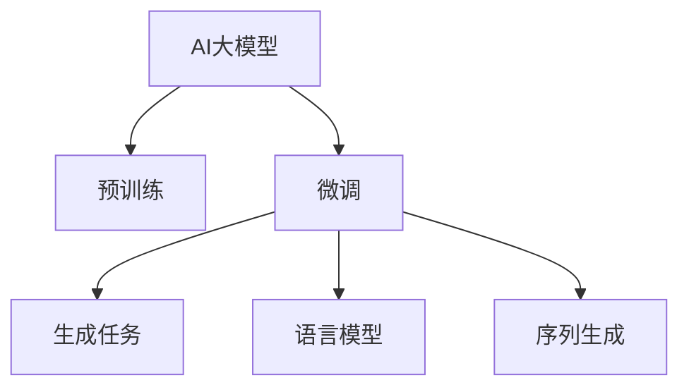

                 

# AI大模型在电商平台商品描述自动生成中的应用

## 1. 背景介绍

### 1.1 问题由来

随着电商平台的崛起，商品描述自动生成成为了一个极具挑战性但需求紧迫的任务。平台需要自动生成高质量的商品描述，以提高点击率、转化率，增加销售额。但人工编写商品描述不仅耗时耗力，还容易出错，难以满足大规模、高频率的运营需求。

自然语言处理（NLP）技术为商品描述自动生成提供了新的可能。通过AI大模型的预训练和微调，可以自动化生成符合平台风格、消费者期望的商品描述，大幅提高电商平台的运营效率。

### 1.2 问题核心关键点

商品描述自动生成的核心在于利用AI大模型强大的语言生成能力，从商品属性和文本描述中生成自然流畅、信息丰富的商品描述。该问题包含以下几个核心关键点：

- 预训练模型选择：选择合适的预训练模型作为初始化参数。
- 数据集构建：构建商品属性、文本描述与商品描述之间的对应关系数据集。
- 微调目标设计：设计合理的微调目标函数和损失函数。
- 训练与优化：使用合适的训练策略和优化算法对模型进行训练和优化。
- 输出评估：设计有效的评估指标对模型输出进行评估和反馈。

## 2. 核心概念与联系

### 2.1 核心概念概述

为了更好地理解商品描述自动生成，我们将介绍几个关键概念及其联系：

- AI大模型（Large Pre-trained Language Models, PLMs）：指通过大规模无标签数据预训练学习语言知识的大型语言模型，如GPT-3、BERT等。
- 预训练（Pre-training）：指在大规模无标签数据上，通过自监督任务训练语言模型，学习通用的语言表示。
- 微调（Fine-tuning）：指在预训练模型的基础上，使用任务特定的标注数据，通过有监督学习优化模型在特定任务上的性能。
- 生成任务（Generative Tasks）：指AI大模型需要生成新的文本内容的任务，如商品描述自动生成。
- 语言模型（Language Models）：指利用上下文预测下一个单词或字符的模型，是商品描述自动生成的核心。
- 序列生成（Sequence Generation）：指语言模型生成连贯的文本序列，适用于商品描述自动生成任务。

这些核心概念之间的逻辑关系可以通过以下Mermaid流程图来展示：



这个流程图展示了大模型在商品描述自动生成中的核心概念及其之间的关系：

1. AI大模型通过预训练获得基础能力。
2. 微调是大模型适应特定任务的过程，通过使用标注数据优化模型的性能。
3. 生成任务是大模型需要执行的最终目标，即生成符合要求的商品描述。
4. 语言模型是生成任务的基础，通过上下文预测生成文本序列。
5. 序列生成是语言模型的应用场景，通过模型生成连贯的文本描述。

## 3. 核心算法原理 & 具体操作步骤

### 3.1 算法原理概述

商品描述自动生成是一个典型的生成任务，其核心在于使用AI大模型生成符合要求的文本描述。假设一个商品描述自动生成系统由预训练模型 $M_{\theta}$ 和微调任务 $T$ 组成，其中 $\theta$ 为模型参数。微调的目标是在训练集 $D=\{(x_i, y_i)\}_{i=1}^N$ 上最小化损失函数 $\mathcal{L}(M_{\theta},D)$，使得模型能够准确生成商品描述。

数学上，假设商品描述自动生成的任务为序列生成，模型在输入 $x$ 上的输出为 $\hat{y}$。微调的目标函数通常包括交叉熵损失：

$$
\mathcal{L}(M_{\theta},D) = -\frac{1}{N}\sum_{i=1}^N \ell(\hat{y}_i,y_i)
$$

其中 $\ell(\hat{y}_i,y_i)$ 为交叉熵损失函数。

### 3.2 算法步骤详解

商品描述自动生成的微调过程一般包括以下几个关键步骤：

**Step 1: 准备预训练模型和数据集**
- 选择合适的预训练语言模型 $M_{\theta}$ 作为初始化参数，如GPT-2、BERT等。
- 准备商品属性、文本描述与商品描述之间的对应关系数据集 $D$，一般通过人工标注或数据挖掘获取。

**Step 2: 添加任务适配层**
- 在预训练模型顶层设计合适的输出层和损失函数，对于生成任务，通常使用语言模型的解码器输出概率分布，并以负对数似然为损失函数。

**Step 3: 设置微调超参数**
- 选择合适的优化算法及其参数，如 AdamW、SGD 等，设置学习率、批大小、迭代轮数等。
- 设置正则化技术及强度，包括权重衰减、Dropout、Early Stopping 等。
- 确定冻结预训练参数的策略，如仅微调顶层，或全部参数都参与微调。

**Step 4: 执行梯度训练**
- 将训练集数据分批次输入模型，前向传播计算损失函数。
- 反向传播计算参数梯度，根据设定的优化算法和学习率更新模型参数。
- 周期性在验证集上评估模型性能，根据性能指标决定是否触发 Early Stopping。
- 重复上述步骤直到满足预设的迭代轮数或 Early Stopping 条件。

**Step 5: 测试和部署**
- 在测试集上评估微调后模型 $M_{\hat{\theta}}$ 的性能，对比微调前后的精度提升。
- 使用微调后的模型对新商品进行描述生成，集成到电商平台的商品信息系统中。
- 持续收集新的商品数据，定期重新微调模型，以适应数据分布的变化。

以上是商品描述自动生成的一般流程。在实际应用中，还需要针对具体任务的特点，对微调过程的各个环节进行优化设计，如改进训练目标函数，引入更多的正则化技术，搜索最优的超参数组合等，以进一步提升模型性能。

### 3.3 算法优缺点

商品描述自动生成基于AI大模型的微调方法具有以下优点：

1. 生成效果好。AI大模型通过预训练和微调，能够生成自然流畅、信息丰富的商品描述。
2. 数据需求低。预训练模型已经学习到了丰富的语言知识，微调所需数据量相对较少。
3. 可扩展性强。微调过程可以很好地应用于不同规模的电商平台，快速适应新商品和新场景。
4. 效果可控。通过调整微调参数，可以很容易地控制生成的商品描述质量。

但该方法也存在一些局限性：

1. 初始化依赖预训练模型。商品描述自动生成依赖于预训练模型的性能，对模型选择和预训练数据集的质量要求较高。
2. 模型资源消耗大。生成任务需要较大计算资源和存储空间，对于小规模企业可能带来成本压力。
3. 效果稳定性差。生成的商品描述可能存在不规范、不通顺、信息不全面等问题，需要人工审核。
4. 存在歧义。不同消费者对商品描述的期望不同，生成模型可能难以满足所有消费者的需求。

尽管存在这些局限性，但商品描述自动生成基于AI大模型的微调方法仍然是大规模电商平台商品信息生成的重要手段。未来相关研究的重点在于如何进一步降低对标注数据的依赖，提高模型的生成效果和稳定性，同时兼顾可解释性和伦理安全性等因素。

### 3.4 算法应用领域

商品描述自动生成作为AI大模型微调技术的一个重要应用领域，已经在电商、旅游、房地产等多个行业得到了广泛应用，为这些行业带来了显著的提升和效益。

- 电商：电商平台可以利用微调的商品描述自动生成技术，提升商品展示效果，吸引用户点击和购买。
- 旅游：旅游网站可以利用微调的商品描述自动生成技术，自动生成景点介绍、酒店评价等，提高用户浏览体验。
- 房地产：房地产平台可以利用微调的商品描述自动生成技术，自动生成房屋描述、小区评价等，增加销售渠道。

此外，在金融、教育、医疗等众多领域，商品描述自动生成技术也展现了其广泛的应用前景。相信伴随预训练语言模型和微调方法的持续演进，商品描述自动生成技术必将在更多领域得到应用，为各行各业带来新的变革和机遇。

## 4. 数学模型和公式 & 详细讲解  
### 4.1 数学模型构建

本节将使用数学语言对商品描述自动生成任务的微调过程进行更加严格的刻画。

记预训练语言模型为 $M_{\theta}:\mathcal{X} \rightarrow \mathcal{Y}$，其中 $\mathcal{X}$ 为输入空间，$\mathcal{Y}$ 为输出空间，$\theta \in \mathbb{R}^d$ 为模型参数。假设微调任务的训练集为 $D=\{(x_i,y_i)\}_{i=1}^N$，其中 $x_i$ 为商品属性和文本描述，$y_i$ 为商品描述。

定义模型 $M_{\theta}$ 在输入 $x$ 上的输出为 $\hat{y}$。微调的目标是最小化交叉熵损失函数：

$$
\mathcal{L}(\theta) = -\frac{1}{N}\sum_{i=1}^N \ell(\hat{y}_i,y_i)
$$

其中 $\ell(\hat{y}_i,y_i)$ 为交叉熵损失函数。

在实践中，我们通常使用基于梯度的优化算法（如SGD、Adam等）来近似求解上述最优化问题。设 $\eta$ 为学习率，$\lambda$ 为正则化系数，则参数的更新公式为：

$$
\theta \leftarrow \theta - \eta \nabla_{\theta}\mathcal{L}(\theta) - \eta\lambda\theta
$$

其中 $\nabla_{\theta}\mathcal{L}(\theta)$ 为损失函数对参数 $\theta$ 的梯度，可通过反向传播算法高效计算。

### 4.2 公式推导过程

以下我们以文本生成任务为例，推导交叉熵损失函数及其梯度的计算公式。

假设模型 $M_{\theta}$ 在输入 $x$ 上的输出为 $\hat{y}=M_{\theta}(x) \in [0,1]$，表示样本属于第 $i$ 类的概率。真实标签 $y \in \{1,2,...,K\}$。则交叉熵损失函数定义为：

$$
\ell(M_{\theta}(x),y) = -\log M_{\theta}(x)[y] = -y_i\log \hat{y}_i - (1-y_i)\log (1-\hat{y}_i)
$$

将其代入经验风险公式，得：

$$
\mathcal{L}(\theta) = -\frac{1}{N}\sum_{i=1}^N \ell(\hat{y}_i,y_i)
$$

根据链式法则，损失函数对参数 $\theta_k$ 的梯度为：

$$
\frac{\partial \mathcal{L}(\theta)}{\partial \theta_k} = -\frac{1}{N}\sum_{i=1}^N \frac{\partial \ell(\hat{y}_i,y_i)}{\partial \theta_k}
$$

其中 $\frac{\partial \ell(\hat{y}_i,y_i)}{\partial \theta_k}$ 可进一步递归展开，利用自动微分技术完成计算。

在得到损失函数的梯度后，即可带入参数更新公式，完成模型的迭代优化。重复上述过程直至收敛，最终得到适应下游任务的最优模型参数 $\theta^*$。

## 5. 项目实践：代码实例和详细解释说明
### 5.1 开发环境搭建

在进行商品描述自动生成实践前，我们需要准备好开发环境。以下是使用Python进行PyTorch开发的环境配置流程：

1. 安装Anaconda：从官网下载并安装Anaconda，用于创建独立的Python环境。

2. 创建并激活虚拟环境：
```bash
conda create -n pytorch-env python=3.8 
conda activate pytorch-env
```

3. 安装PyTorch：根据CUDA版本，从官网获取对应的安装命令。例如：
```bash
conda install pytorch torchvision torchaudio cudatoolkit=11.1 -c pytorch -c conda-forge
```

4. 安装Transformers库：
```bash
pip install transformers
```

5. 安装各类工具包：
```bash
pip install numpy pandas scikit-learn matplotlib tqdm jupyter notebook ipython
```

完成上述步骤后，即可在`pytorch-env`环境中开始商品描述自动生成的开发实践。

### 5.2 源代码详细实现

这里我们以商品描述自动生成任务为例，给出使用Transformers库对GPT-2模型进行微调的PyTorch代码实现。

首先，定义数据处理函数：

```python
from transformers import GPT2Tokenizer
from torch.utils.data import Dataset
import torch

class ProductDataset(Dataset):
    def __init__(self, products, descriptions, tokenizer, max_len=128):
        self.products = products
        self.descriptions = descriptions
        self.tokenizer = tokenizer
        self.max_len = max_len
        
    def __len__(self):
        return len(self.products)
    
    def __getitem__(self, item):
        product = self.products[item]
        description = self.descriptions[item]
        
        encoding = self.tokenizer(product, return_tensors='pt', max_length=self.max_len, padding='max_length', truncation=True)
        input_ids = encoding['input_ids'][0]
        attention_mask = encoding['attention_mask'][0]
        
        # 将商品描述转换为token ids
        description_ids = self.tokenizer(description, return_tensors='pt', max_length=self.max_len, padding='max_length', truncation=True)['input_ids'][0]
        
        return {'input_ids': input_ids, 
                'attention_mask': attention_mask,
                'target_ids': description_ids}
```

然后，定义模型和优化器：

```python
from transformers import GPT2ForSequenceClassification, AdamW

model = GPT2ForSequenceClassification.from_pretrained('gpt2', num_labels=1)

optimizer = AdamW(model.parameters(), lr=2e-5)
```

接着，定义训练和评估函数：

```python
from torch.utils.data import DataLoader
from tqdm import tqdm
from sklearn.metrics import accuracy_score

device = torch.device('cuda') if torch.cuda.is_available() else torch.device('cpu')
model.to(device)

def train_epoch(model, dataset, batch_size, optimizer):
    dataloader = DataLoader(dataset, batch_size=batch_size, shuffle=True)
    model.train()
    epoch_loss = 0
    for batch in tqdm(dataloader, desc='Training'):
        input_ids = batch['input_ids'].to(device)
        attention_mask = batch['attention_mask'].to(device)
        targets = batch['target_ids'].to(device)
        model.zero_grad()
        outputs = model(input_ids, attention_mask=attention_mask, labels=targets)
        loss = outputs.loss
        epoch_loss += loss.item()
        loss.backward()
        optimizer.step()
    return epoch_loss / len(dataloader)

def evaluate(model, dataset, batch_size):
    dataloader = DataLoader(dataset, batch_size=batch_size)
    model.eval()
    preds, labels = [], []
    with torch.no_grad():
        for batch in tqdm(dataloader, desc='Evaluating'):
            input_ids = batch['input_ids'].to(device)
            attention_mask = batch['attention_mask'].to(device)
            batch_labels = batch['target_ids']
            outputs = model(input_ids, attention_mask=attention_mask)
            batch_preds = outputs.logits.argmax(dim=2).to('cpu').tolist()
            batch_labels = batch_labels.to('cpu').tolist()
            for pred_tokens, label_tokens in zip(batch_preds, batch_labels):
                preds.append(pred_tokens)
                labels.append(label_tokens)
                
    print(accuracy_score(labels, preds))
```

最后，启动训练流程并在测试集上评估：

```python
epochs = 5
batch_size = 16

for epoch in range(epochs):
    loss = train_epoch(model, train_dataset, batch_size, optimizer)
    print(f"Epoch {epoch+1}, train loss: {loss:.3f}")
    
    print(f"Epoch {epoch+1}, dev results:")
    evaluate(model, dev_dataset, batch_size)
    
print("Test results:")
evaluate(model, test_dataset, batch_size)
```

以上就是使用PyTorch对GPT-2进行商品描述自动生成的完整代码实现。可以看到，得益于Transformers库的强大封装，我们可以用相对简洁的代码完成GPT-2模型的加载和微调。

### 5.3 代码解读与分析

让我们再详细解读一下关键代码的实现细节：

**ProductDataset类**：
- `__init__`方法：初始化商品、描述、分词器等关键组件。
- `__len__`方法：返回数据集的样本数量。
- `__getitem__`方法：对单个样本进行处理，将商品输入编码为token ids，将描述转换为token ids，并进行定长padding，最终返回模型所需的输入。

**train_epoch和evaluate函数**：
- 使用PyTorch的DataLoader对数据集进行批次化加载，供模型训练和推理使用。
- 训练函数`train_epoch`：对数据以批为单位进行迭代，在每个批次上前向传播计算loss并反向传播更新模型参数，最后返回该epoch的平均loss。
- 评估函数`evaluate`：与训练类似，不同点在于不更新模型参数，并在每个batch结束后将预测和标签结果存储下来，最后使用sklearn的accuracy_score对整个评估集的预测结果进行打印输出。

**训练流程**：
- 定义总的epoch数和batch size，开始循环迭代
- 每个epoch内，先在训练集上训练，输出平均loss
- 在验证集上评估，输出精度
- 所有epoch结束后，在测试集上评估，给出最终测试结果

可以看到，PyTorch配合Transformers库使得商品描述自动生成的代码实现变得简洁高效。开发者可以将更多精力放在数据处理、模型改进等高层逻辑上，而不必过多关注底层的实现细节。

当然，工业级的系统实现还需考虑更多因素，如模型的保存和部署、超参数的自动搜索、更灵活的任务适配层等。但核心的微调范式基本与此类似。

## 6. 实际应用场景
### 6.1 智能客服系统

商品描述自动生成技术可以与智能客服系统结合，提升客户体验和满意度。在智能客服中，商品描述自动生成技术可以自动生成针对用户问题的描述，帮助客服快速理解客户需求，提供更精准的回答。

具体而言，系统可以记录客户的历史查询记录，结合用户当前输入的问题，自动生成描述并反馈给客服。客服人员根据生成的描述，提供更准确的解答，提高客户满意度。此外，系统还可以根据客服与客户对话的记录，进一步优化自动生成的描述，提高系统生成质量。

### 6.2 电商平台搜索推荐

电商平台可以利用商品描述自动生成技术，提升搜索推荐效果，增强用户购物体验。通过商品描述自动生成技术，系统可以自动生成符合用户搜索请求的商品描述，提高搜索召回率和点击率，增强用户的购物意愿。

具体而言，系统可以记录用户的搜索历史，结合搜索请求和用户行为，自动生成商品描述并反馈给用户。用户可以根据生成的描述，了解商品详细信息，增强购买决策。此外，系统还可以根据用户的反馈和点击记录，进一步优化商品描述的生成效果，提高推荐效果。

### 6.3 旅游网站信息展示

旅游网站可以利用商品描述自动生成技术，自动生成景点介绍、酒店评价等信息，提升用户浏览体验。通过商品描述自动生成技术，系统可以自动生成符合用户需求的景点介绍、酒店评价等信息，提升用户的旅游体验。

具体而言，系统可以记录用户的浏览历史，结合浏览行为和用户评价，自动生成景点介绍、酒店评价等信息。用户可以根据生成的信息，了解景点和酒店详情，增强旅游决策。此外，系统还可以根据用户的反馈和点击记录，进一步优化信息生成的质量，提高用户满意度。

### 6.4 未来应用展望

随着商品描述自动生成技术的不断发展，未来将在更多领域得到应用，为各行各业带来新的突破。

在智慧医疗领域，商品描述自动生成技术可以用于自动生成医学报告、病历信息等，提高医疗服务的智能化水平，辅助医生诊疗。

在智能教育领域，商品描述自动生成技术可以用于自动生成教材、讲义、答案等，提高教育服务的智能化水平，辅助教师教学。

在智慧城市治理中，商品描述自动生成技术可以用于自动生成城市事件描述、舆情分析等，提高城市管理的自动化水平，构建更安全、高效的未来城市。

此外，在企业生产、社会治理、文娱传媒等众多领域，商品描述自动生成技术也展现了其广泛的应用前景。相信伴随预训练语言模型和微调方法的持续演进，商品描述自动生成技术必将在更多领域得到应用，为各行各业带来新的变革和机遇。

## 7. 工具和资源推荐
### 7.1 学习资源推荐

为了帮助开发者系统掌握商品描述自动生成技术的理论基础和实践技巧，这里推荐一些优质的学习资源：

1. 《Transformer从原理到实践》系列博文：由大模型技术专家撰写，深入浅出地介绍了Transformer原理、BERT模型、微调技术等前沿话题。

2. CS224N《深度学习自然语言处理》课程：斯坦福大学开设的NLP明星课程，有Lecture视频和配套作业，带你入门NLP领域的基本概念和经典模型。

3. 《Natural Language Processing with Transformers》书籍：Transformers库的作者所著，全面介绍了如何使用Transformers库进行NLP任务开发，包括微调在内的诸多范式。

4. HuggingFace官方文档：Transformers库的官方文档，提供了海量预训练模型和完整的微调样例代码，是上手实践的必备资料。

5. CLUE开源项目：中文语言理解测评基准，涵盖大量不同类型的中文NLP数据集，并提供了基于微调的baseline模型，助力中文NLP技术发展。

通过对这些资源的学习实践，相信你一定能够快速掌握商品描述自动生成技术的精髓，并用于解决实际的NLP问题。
###  7.2 开发工具推荐

高效的开发离不开优秀的工具支持。以下是几款用于商品描述自动生成开发的常用工具：

1. PyTorch：基于Python的开源深度学习框架，灵活动态的计算图，适合快速迭代研究。大部分预训练语言模型都有PyTorch版本的实现。

2. TensorFlow：由Google主导开发的开源深度学习框架，生产部署方便，适合大规模工程应用。同样有丰富的预训练语言模型资源。

3. Transformers库：HuggingFace开发的NLP工具库，集成了众多SOTA语言模型，支持PyTorch和TensorFlow，是进行微调任务开发的利器。

4. Weights & Biases：模型训练的实验跟踪工具，可以记录和可视化模型训练过程中的各项指标，方便对比和调优。与主流深度学习框架无缝集成。

5. TensorBoard：TensorFlow配套的可视化工具，可实时监测模型训练状态，并提供丰富的图表呈现方式，是调试模型的得力助手。

6. Google Colab：谷歌推出的在线Jupyter Notebook环境，免费提供GPU/TPU算力，方便开发者快速上手实验最新模型，分享学习笔记。

合理利用这些工具，可以显著提升商品描述自动生成任务的开发效率，加快创新迭代的步伐。

### 7.3 相关论文推荐

商品描述自动生成作为AI大模型微调技术的一个重要应用领域，已经在电商、旅游、房地产等多个行业得到了广泛应用，为这些行业带来了显著的提升和效益。

1. Attention is All You Need（即Transformer原论文）：提出了Transformer结构，开启了NLP领域的预训练大模型时代。

2. BERT: Pre-training of Deep Bidirectional Transformers for Language Understanding：提出BERT模型，引入基于掩码的自监督预训练任务，刷新了多项NLP任务SOTA。

3. Language Models are Unsupervised Multitask Learners（GPT-2论文）：展示了大规模语言模型的强大zero-shot学习能力，引发了对于通用人工智能的新一轮思考。

4. Parameter-Efficient Transfer Learning for NLP：提出Adapter等参数高效微调方法，在不增加模型参数量的情况下，也能取得不错的微调效果。

5. Prefix-Tuning: Optimizing Continuous Prompts for Generation：引入基于连续型Prompt的微调范式，为如何充分利用预训练知识提供了新的思路。

6. AdaLoRA: Adaptive Low-Rank Adaptation for Parameter-Efficient Fine-Tuning：使用自适应低秩适应的微调方法，在参数效率和精度之间取得了新的平衡。

这些论文代表了大语言模型微调技术的发展脉络。通过学习这些前沿成果，可以帮助研究者把握学科前进方向，激发更多的创新灵感。

## 8. 总结：未来发展趋势与挑战

### 8.1 总结

本文对商品描述自动生成技术进行了全面系统的介绍。首先阐述了商品描述自动生成的背景和意义，明确了微调在拓展预训练模型应用、提升电商运营效率方面的独特价值。其次，从原理到实践，详细讲解了微调的目标函数、优化算法和操作步骤。最后，本文还广泛探讨了微调技术在电商、旅游、房地产等多个行业领域的应用前景，展示了微调范式的巨大潜力。

通过本文的系统梳理，可以看到，基于AI大模型的商品描述自动生成技术正在成为电商平台商品信息生成的重要手段，极大地提升了电商平台的运营效率和用户体验。未来相关研究的重点在于如何进一步降低对标注数据的依赖，提高模型的生成效果和稳定性，同时兼顾可解释性和伦理安全性等因素。

### 8.2 未来发展趋势

展望未来，商品描述自动生成技术将呈现以下几个发展趋势：

1. 模型规模持续增大。随着算力成本的下降和数据规模的扩张，预训练语言模型的参数量还将持续增长。超大规模语言模型蕴含的丰富语言知识，有望支撑更加复杂多变的生成任务。

2. 生成效果不断提升。未来的生成模型将通过更多的训练数据和更精细的训练策略，生成更加自然流畅、信息丰富的商品描述。

3. 模型结构不断优化。未来的模型将采用更高效的参数共享、自适应、自监督等策略，减小计算资源消耗，提高生成速度。

4. 应用场景不断扩展。商品描述自动生成技术将逐步应用于更多行业，如智慧医疗、智能教育、智慧城市等，为各行各业带来新的变革和机遇。

5. 结合其他技术发展。未来的模型将与知识图谱、逻辑规则、因果推理等技术结合，生成更具可信度和解释性的商品描述。

以上趋势凸显了商品描述自动生成技术的广阔前景。这些方向的探索发展，必将进一步提升商品描述自动生成技术的生成效果和应用价值，为各行业带来新的突破。

### 8.3 面临的挑战

尽管商品描述自动生成技术已经取得了显著进展，但在迈向更加智能化、普适化应用的过程中，它仍面临诸多挑战：

1. 初始化依赖预训练模型。商品描述自动生成依赖于预训练模型的性能，对模型选择和预训练数据集的质量要求较高。

2. 数据需求量较大。商品描述自动生成需要较大的标注数据集，标注成本较高。

3. 生成效果不稳定。不同用户对商品描述的期望不同，生成模型可能难以满足所有用户的需求。

4. 可解释性不足。当前商品描述自动生成模型多为黑盒系统，难以解释其内部工作机制和决策逻辑。

5. 模型资源消耗大。生成任务需要较大计算资源和存储空间，对于小规模企业可能带来成本压力。

6. 存在歧义。自动生成的商品描述可能存在不规范、不通顺、信息不全面等问题，需要人工审核。

尽管存在这些挑战，但商品描述自动生成基于AI大模型的微调方法仍然是大规模电商平台商品信息生成的重要手段。未来相关研究的重点在于如何进一步降低对标注数据的依赖，提高模型的生成效果和稳定性，同时兼顾可解释性和伦理安全性等因素。

### 8.4 研究展望

面向未来，商品描述自动生成技术的研究需要从以下几个方面进行新的突破：

1. 探索无监督和半监督生成方法。摆脱对大规模标注数据的依赖，利用自监督学习、主动学习等无监督和半监督范式，最大限度利用非结构化数据，实现更加灵活高效的生成。

2. 研究生成模型的可解释性。引入因果分析、生成对抗网络等技术，增强生成模型的可解释性和可信度。

3. 结合多模态信息融合。将图像、视频等多模态信息与文本信息结合，生成更具视觉、听觉、情感等多维度的商品描述。

4. 引入伦理和安全性约束。在生成模型中加入伦理导向的评估指标，过滤和惩罚有害、歧视性的输出，确保生成的商品描述符合人类价值观和伦理道德。

这些研究方向的探索，必将引领商品描述自动生成技术迈向更高的台阶，为构建安全、可靠、可解释、可控的智能系统铺平道路。面向未来，商品描述自动生成技术还需要与其他人工智能技术进行更深入的融合，如知识表示、因果推理、强化学习等，多路径协同发力，共同推动自然语言理解和智能交互系统的进步。只有勇于创新、敢于突破，才能不断拓展商品描述自动生成技术的边界，让智能技术更好地造福人类社会。

## 9. 附录：常见问题与解答

**Q1：商品描述自动生成是否适用于所有商品类别？**

A: 商品描述自动生成技术可以应用于大多数商品类别，但对于一些特殊商品（如服装、电子产品），由于其属性描述复杂多样，生成效果可能不如其他商品类别。

**Q2：微调过程中如何选择合适的学习率？**

A: 微调的学习率一般要比预训练时小1-2个数量级，如果使用过大的学习率，容易破坏预训练权重，导致过拟合。一般建议从1e-5开始调参，逐步减小学习率，直至收敛。也可以使用warmup策略，在开始阶段使用较小的学习率，再逐渐过渡到预设值。需要注意的是，不同的优化器(如AdamW、Adafactor等)以及不同的学习率调度策略，可能需要设置不同的学习率阈值。

**Q3：自动生成的商品描述质量如何保证？**

A: 自动生成的商品描述质量主要依赖于模型的训练数据和优化策略。通过选择合适的预训练模型和微调数据集，使用合适的正则化和训练策略，可以提高商品描述的生成质量。

**Q4：商品描述自动生成需要多少标注数据？**

A: 商品描述自动生成的效果很大程度上取决于标注数据的质量和数量。通常需要数千条标注数据进行微调，以确保模型能够准确捕捉商品的特征和属性。

**Q5：自动生成的商品描述如何保证时效性？**

A: 自动生成的商品描述通常采用在线微调技术，即在每次生成时对模型进行微调，从而保证生成的描述具有时效性。同时，可以通过缓存已生成的描述，减少重复计算。

**Q6：自动生成的商品描述如何保证安全性？**

A: 自动生成的商品描述需要遵循伦理和安全性原则，避免生成有害、歧视性的描述。可以通过设置伦理导向的评估指标，对生成的描述进行过滤和审核，确保描述内容符合人类价值观和伦理道德。

这些常见问题的解答，希望能帮助你更好地理解商品描述自动生成技术的实现原理和应用场景，为实际开发和应用提供参考。

