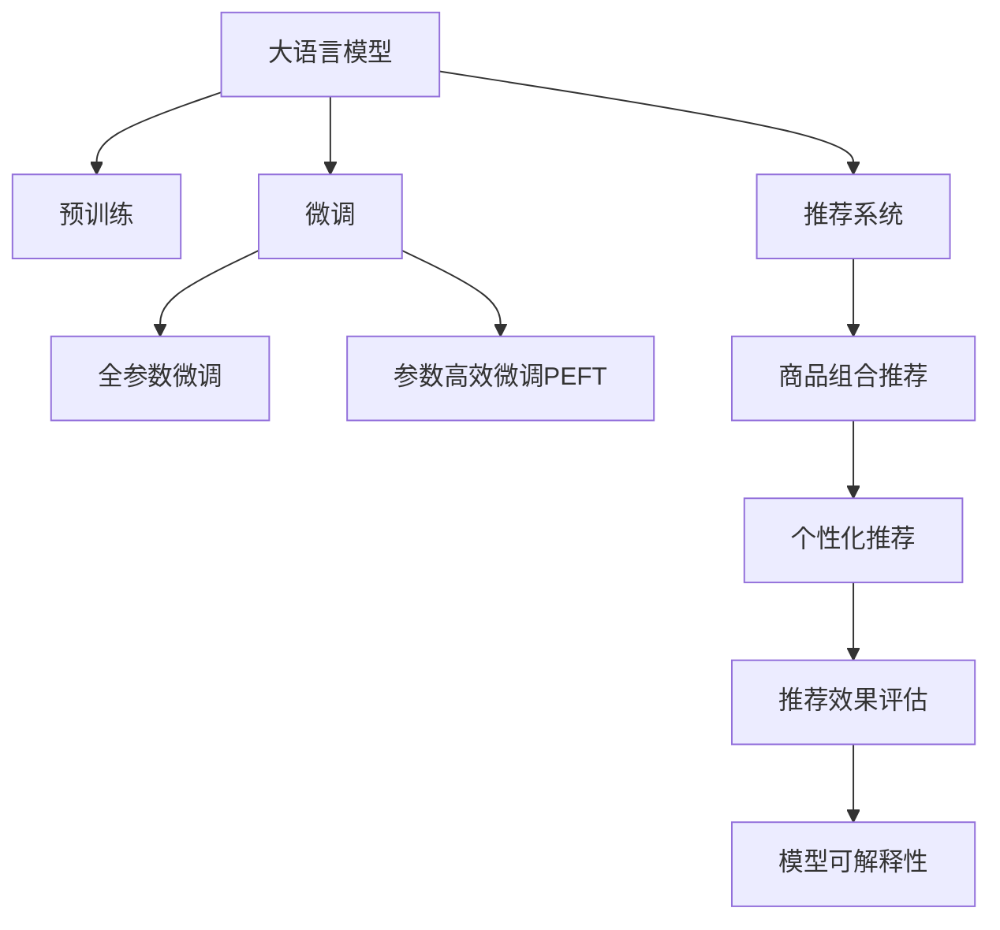

                 

# AI大模型在电商平台商品组合推荐中的应用

> 关键词：大语言模型, 推荐系统, 商品组合推荐, AI, 电商

## 1. 背景介绍

### 1.1 问题由来
随着电子商务市场的快速发展和消费者购物行为的多样化，电商平台面临着如何为消费者推荐更加个性化、多样化的商品组合这一重要挑战。传统的推荐系统往往以单商品为单位进行推荐，忽略了商品间的相关性和搭配关系，无法满足用户复杂多变的购物需求。

近年来，随着人工智能技术在电商领域的广泛应用，大语言模型开始被引入商品推荐中，并逐渐成为解决这一问题的新范式。借助预训练语言模型强大的语言理解和生成能力，大模型可以在文本语料中挖掘出商品之间的搭配关系，生成个性化的商品组合推荐，极大地提升了推荐效果和用户满意度。

### 1.2 问题核心关键点
大语言模型在电商平台商品组合推荐中的应用主要集中在以下几个方面：

1. **语义理解与分析**：通过大模型理解商品描述和用户评论中的语义信息，学习商品之间的搭配关系和用户偏好。

2. **推荐内容生成**：利用大模型生成多种商品组合方案，考虑商品间的互补性和协调性，推荐符合用户偏好的商品组合。

3. **个性化推荐**：根据用户的历史行为和个性化特征，生成定制化的商品组合推荐，提升用户体验和购买转化率。

4. **推荐效果评估**：利用大模型对推荐效果进行评估，通过自动化测试和用户反馈调整推荐策略，优化推荐系统性能。

5. **模型可解释性**：提供推荐内容生成过程的透明度，解释商品组合推荐的依据，增强用户信任。

### 1.3 问题研究意义
大语言模型在电商平台商品组合推荐中的应用，对于电商平台提升用户体验、增加用户粘性和销售额具有重要意义：

1. **提升推荐效果**：通过理解商品语义和用户偏好，生成更加个性化和多样化的商品组合推荐，满足用户复杂多变的购物需求。

2. **优化用户体验**：提供匹配度高的商品组合推荐，减少用户的决策时间和心理负担，提升购物体验。

3. **增加用户粘性**：通过精准的商品组合推荐，吸引用户重复访问电商平台，增加用户黏性。

4. **提升销售额**：匹配度高的商品组合推荐，有助于提升用户购买转化率，增加电商平台的销售额。

## 2. 核心概念与联系

### 2.1 核心概念概述

为更好地理解大语言模型在电商平台商品组合推荐中的应用，本节将介绍几个密切相关的核心概念：

- **大语言模型(Large Language Model, LLM)**：以自回归(如GPT)或自编码(如BERT)模型为代表的大规模预训练语言模型。通过在大规模无标签文本语料上进行预训练，学习通用的语言表示，具备强大的语言理解和生成能力。

- **推荐系统(Recommender System)**：基于用户行为数据和物品特征，推荐符合用户兴趣的候选物品的系统。推荐系统广泛应用于电商、社交、视频等平台，是互联网时代的重要组成部分。

- **商品组合推荐(Combination Recommendation)**：推荐系统的一种高级形式，旨在为用户推荐匹配度高、搭配合理的商品组合，而不仅仅是单个商品。

- **预训练(Pre-training)**：指在大规模无标签文本语料上，通过自监督学习任务训练通用语言模型的过程。常见的预训练任务包括言语建模、遮挡语言模型等。预训练使得模型学习到语言的通用表示。

- **微调(Fine-tuning)**：指在预训练模型的基础上，使用下游任务的少量标注数据，通过有监督学习优化模型在特定任务上的性能。通常只需要调整顶层分类器或解码器，并以较小的学习率更新全部或部分的模型参数。

- **交叉语言模型(Cross-Language Model)**：一种基于多语言预训练的模型，能够理解和生成多种语言，适用于多语言电商平台的商品推荐。

这些核心概念之间的逻辑关系可以通过以下Mermaid流程图来展示：



这个流程图展示了大语言模型在电商平台商品组合推荐中的核心概念及其之间的关系：

1. 大语言模型通过预训练获得基础能力。
2. 微调对预训练模型进行任务特定的优化，可以选择全参数微调或参数高效微调。
3. 推荐系统利用微调后的模型进行商品推荐。
4. 商品组合推荐在推荐系统的基础上，进一步结合商品搭配关系进行优化。
5. 个性化推荐针对用户行为特征进行定制化推荐。
6. 推荐效果评估对推荐系统性能进行评估和优化。
7. 模型可解释性增强推荐过程的透明度，提升用户信任。

## 3. 核心算法原理 & 具体操作步骤
### 3.1 算法原理概述

基于大语言模型在电商平台商品组合推荐的应用，本质上是一个有监督的推荐系统优化过程。其核心思想是：将预训练的大语言模型视作一个强大的"特征提取器"，通过商品描述和用户评论文本，提取商品间的搭配关系和用户偏好，进而生成个性化的商品组合推荐。

形式化地，假设预训练模型为 $M_{\theta}$，其中 $\theta$ 为预训练得到的模型参数。给定电商平台上的商品集合 $S=\{s_i\}_{i=1}^N$ 和用户评论语料 $C=\{c_j\}_{j=1}^M$，推荐系统需要找到最佳的组合推荐策略 $P$，使得模型预测的组合评分 $M_{\theta}(S \times P)$ 最大化。

### 3.2 算法步骤详解

基于大语言模型在电商平台商品组合推荐的应用，一般包括以下几个关键步骤：

**Step 1: 准备预训练模型和数据集**
- 选择合适的预训练语言模型 $M_{\theta}$ 作为初始化参数，如 BERT、GPT等。
- 准备电商平台的商品描述和用户评论语料，划分为训练集、验证集和测试集。商品描述通常包含商品的类别、品牌、功能等属性信息，用户评论则包含用户对商品的使用体验、满意度等反馈信息。

**Step 2: 添加任务适配层**
- 根据推荐任务，在预训练模型顶层设计合适的输出层和损失函数。
- 对于商品组合推荐任务，通常使用多分类交叉熵损失函数，用于衡量模型对不同组合的评分预测。
- 对于个性化推荐任务，可以使用序列生成任务，通过预测用户对商品组合的评分序列进行优化。

**Step 3: 设置微调超参数**
- 选择合适的优化算法及其参数，如 AdamW、SGD 等，设置学习率、批大小、迭代轮数等。
- 设置正则化技术及强度，包括权重衰减、Dropout、Early Stopping 等。
- 确定冻结预训练参数的策略，如仅微调顶层，或全部参数都参与微调。

**Step 4: 执行梯度训练**
- 将训练集数据分批次输入模型，前向传播计算损失函数。
- 反向传播计算参数梯度，根据设定的优化算法和学习率更新模型参数。
- 周期性在验证集上评估模型性能，根据性能指标决定是否触发 Early Stopping。
- 重复上述步骤直到满足预设的迭代轮数或 Early Stopping 条件。

**Step 5: 测试和部署**
- 在测试集上评估微调后模型 $M_{\hat{\theta}}$ 的性能，对比微调前后的精度提升。
- 使用微调后的模型对新样本进行推理预测，集成到实际的应用系统中。
- 持续收集新的数据，定期重新微调模型，以适应数据分布的变化。

以上是基于大语言模型在电商平台商品组合推荐中的应用的一般流程。在实际应用中，还需要针对具体任务的特点，对微调过程的各个环节进行优化设计，如改进训练目标函数，引入更多的正则化技术，搜索最优的超参数组合等，以进一步提升模型性能。

### 3.3 算法优缺点

基于大语言模型在电商平台商品组合推荐中的应用方法具有以下优点：
1. 简单高效。只需准备少量标注数据，即可对预训练模型进行快速适配，获得较大的性能提升。
2. 通用适用。适用于各种电商平台的商品推荐，设计简单的任务适配层即可实现推荐。
3. 参数高效。利用参数高效微调技术，在固定大部分预训练权重不变的情况下，仍可取得不错的提升。
4. 效果显著。在学术界和工业界的诸多任务上，基于微调的方法已经刷新了最先进的性能指标。

同时，该方法也存在一定的局限性：
1. 依赖标注数据。微调的效果很大程度上取决于标注数据的质量和数量，获取高质量标注数据的成本较高。
2. 迁移能力有限。当目标任务与预训练数据的分布差异较大时，微调的性能提升有限。
3. 负面效果传递。预训练模型的固有偏见、有害信息等，可能通过微调传递到下游任务，造成负面影响。
4. 可解释性不足。微调模型的决策过程通常缺乏可解释性，难以对其推理逻辑进行分析和调试。

尽管存在这些局限性，但就目前而言，基于大语言模型的微调方法仍是在电商平台商品组合推荐中应用的主流范式。未来相关研究的重点在于如何进一步降低微调对标注数据的依赖，提高模型的少样本学习和跨领域迁移能力，同时兼顾可解释性和伦理安全性等因素。

### 3.4 算法应用领域

基于大语言模型在电商平台商品组合推荐中的应用方法，已经在商品推荐、广告投放、用户行为分析等多个电商领域得到了广泛的应用，成为电商推荐系统的核心技术之一。

除了上述这些经典应用外，大语言模型在电商平台的应用还在不断扩展，如可控文本生成、内容推荐、个性化营销等，为电商平台带来了新的商业机会和用户体验提升。

## 4. 数学模型和公式 & 详细讲解
### 4.1 数学模型构建

本节将使用数学语言对基于大语言模型在电商平台商品组合推荐中的应用进行更加严格的刻画。

记预训练语言模型为 $M_{\theta}$，其中 $\theta$ 为预训练得到的模型参数。假设电商平台上的商品集合为 $S=\{s_i\}_{i=1}^N$，用户评论语料为 $C=\{c_j\}_{j=1}^M$。

定义模型 $M_{\theta}$ 在商品组合 $(s_1,s_2,\dots,s_k)$ 上的评分函数为 $f_{\theta}(s_1,s_2,\dots,s_k)$，则在商品组合推荐任务中，模型的损失函数为：

$$
\mathcal{L}(\theta) = -\frac{1}{N}\sum_{i=1}^N \sum_{j=1}^M \log p_{\theta}(s_i|c_j)
$$

其中 $p_{\theta}(s_i|c_j)$ 表示在用户评论 $c_j$ 的条件下，商品 $s_i$ 被选中的概率。

在个性化推荐任务中，目标函数为：

$$
\mathcal{L}(\theta) = -\frac{1}{N}\sum_{i=1}^N \sum_{j=1}^M \sum_{k=1}^K \log p_{\theta}(a_i,a_2,\dots,a_k|c_j)
$$

其中 $a_1,a_2,\dots,a_k$ 表示用户对商品组合 $(a_1,a_2,\dots,a_k)$ 的评分，$K$ 表示评分序列的长度。

### 4.2 公式推导过程

以下我们以商品组合推荐任务为例，推导交叉熵损失函数及其梯度的计算公式。

假设模型 $M_{\theta}$ 在输入 $c$ 上的输出为 $\hat{y}=M_{\theta}(c) \in [0,1]$，表示商品被选中的概率。真实标签 $y \in \{0,1\}$。则二分类交叉熵损失函数定义为：

$$
\ell(M_{\theta}(c),y) = -[y\log \hat{y} + (1-y)\log (1-\hat{y})]
$$

将其代入经验风险公式，得：

$$
\mathcal{L}(\theta) = -\frac{1}{N}\sum_{i=1}^N \sum_{j=1}^M [y_i\log M_{\theta}(c_i) + (1-y_i)\log(1-M_{\theta}(c_i))]
$$

根据链式法则，损失函数对参数 $\theta_k$ 的梯度为：

$$
\frac{\partial \mathcal{L}(\theta)}{\partial \theta_k} = -\frac{1}{N}\sum_{i=1}^N \sum_{j=1}^M (\frac{y_i}{M_{\theta}(c_i)}-\frac{1-y_i}{1-M_{\theta}(c_i)}) \frac{\partial M_{\theta}(c_i)}{\partial \theta_k}
$$

其中 $\frac{\partial M_{\theta}(c_i)}{\partial \theta_k}$ 可进一步递归展开，利用自动微分技术完成计算。

在得到损失函数的梯度后，即可带入参数更新公式，完成模型的迭代优化。重复上述过程直至收敛，最终得到适应商品组合推荐任务的最优模型参数 $\theta^*$。

## 5. 项目实践：代码实例和详细解释说明
### 5.1 开发环境搭建

在进行商品组合推荐任务开发前，我们需要准备好开发环境。以下是使用Python进行PyTorch开发的环境配置流程：

1. 安装Anaconda：从官网下载并安装Anaconda，用于创建独立的Python环境。

2. 创建并激活虚拟环境：
```bash
conda create -n pytorch-env python=3.8 
conda activate pytorch-env
```

3. 安装PyTorch：根据CUDA版本，从官网获取对应的安装命令。例如：
```bash
conda install pytorch torchvision torchaudio cudatoolkit=11.1 -c pytorch -c conda-forge
```

4. 安装TensorFlow：从官网下载并按照官方文档进行安装。

5. 安装各类工具包：
```bash
pip install numpy pandas scikit-learn matplotlib tqdm jupyter notebook ipython
```

完成上述步骤后，即可在`pytorch-env`环境中开始商品组合推荐任务的开发。

### 5.2 源代码详细实现

下面我们以商品组合推荐任务为例，给出使用Transformers库对BERT模型进行微调的PyTorch代码实现。

首先，定义推荐任务的数据处理函数：

```python
from transformers import BertTokenizer
from torch.utils.data import Dataset
import torch

class RecommendationDataset(Dataset):
    def __init__(self, reviews, targets, tokenizer, max_len=128):
        self.reviews = reviews
        self.targets = targets
        self.tokenizer = tokenizer
        self.max_len = max_len
        
    def __len__(self):
        return len(self.reviews)
    
    def __getitem__(self, item):
        review = self.reviews[item]
        target = self.targets[item]
        
        encoding = self.tokenizer(review, return_tensors='pt', max_length=self.max_len, padding='max_length', truncation=True)
        input_ids = encoding['input_ids'][0]
        attention_mask = encoding['attention_mask'][0]
        
        # 对target进行处理，使其符合模型输出格式
        encoded_target = [0] * (self.max_len - 1)
        encoded_target.insert(0, target)
        labels = torch.tensor(encoded_target, dtype=torch.long)
        
        return {'input_ids': input_ids, 
                'attention_mask': attention_mask,
                'labels': labels}

# 标签与id的映射
id2label = {0: 'NOT推荐的商品', 1: '推荐的商品'}

# 创建dataset
tokenizer = BertTokenizer.from_pretrained('bert-base-cased')

train_dataset = RecommendationDataset(train_reviews, train_targets, tokenizer)
dev_dataset = RecommendationDataset(dev_reviews, dev_targets, tokenizer)
test_dataset = RecommendationDataset(test_reviews, test_targets, tokenizer)
```

然后，定义模型和优化器：

```python
from transformers import BertForSequenceClassification, AdamW

model = BertForSequenceClassification.from_pretrained('bert-base-cased', num_labels=2)

optimizer = AdamW(model.parameters(), lr=2e-5)
```

接着，定义训练和评估函数：

```python
from torch.utils.data import DataLoader
from tqdm import tqdm
from sklearn.metrics import classification_report

device = torch.device('cuda') if torch.cuda.is_available() else torch.device('cpu')
model.to(device)

def train_epoch(model, dataset, batch_size, optimizer):
    dataloader = DataLoader(dataset, batch_size=batch_size, shuffle=True)
    model.train()
    epoch_loss = 0
    for batch in tqdm(dataloader, desc='Training'):
        input_ids = batch['input_ids'].to(device)
        attention_mask = batch['attention_mask'].to(device)
        labels = batch['labels'].to(device)
        model.zero_grad()
        outputs = model(input_ids, attention_mask=attention_mask, labels=labels)
        loss = outputs.loss
        epoch_loss += loss.item()
        loss.backward()
        optimizer.step()
    return epoch_loss / len(dataloader)

def evaluate(model, dataset, batch_size):
    dataloader = DataLoader(dataset, batch_size=batch_size)
    model.eval()
    preds, labels = [], []
    with torch.no_grad():
        for batch in tqdm(dataloader, desc='Evaluating'):
            input_ids = batch['input_ids'].to(device)
            attention_mask = batch['attention_mask'].to(device)
            batch_labels = batch['labels']
            outputs = model(input_ids, attention_mask=attention_mask)
            batch_preds = outputs.logits.argmax(dim=2).to('cpu').tolist()
            batch_labels = batch_labels.to('cpu').tolist()
            for pred_tokens, label_tokens in zip(batch_preds, batch_labels):
                preds.append(pred_tokens[:len(label_tokens)])
                labels.append(label_tokens)
                
    print(classification_report(labels, preds))
```

最后，启动训练流程并在测试集上评估：

```python
epochs = 5
batch_size = 16

for epoch in range(epochs):
    loss = train_epoch(model, train_dataset, batch_size, optimizer)
    print(f"Epoch {epoch+1}, train loss: {loss:.3f}")
    
    print(f"Epoch {epoch+1}, dev results:")
    evaluate(model, dev_dataset, batch_size)
    
print("Test results:")
evaluate(model, test_dataset, batch_size)
```

以上就是使用PyTorch对BERT进行商品组合推荐任务微调的完整代码实现。可以看到，得益于Transformers库的强大封装，我们可以用相对简洁的代码完成BERT模型的加载和微调。

### 5.3 代码解读与分析

让我们再详细解读一下关键代码的实现细节：

**RecommendationDataset类**：
- `__init__`方法：初始化评论、标签、分词器等关键组件。
- `__len__`方法：返回数据集的样本数量。
- `__getitem__`方法：对单个样本进行处理，将评论输入编码为token ids，将标签编码为数字，并对其进行定长padding，最终返回模型所需的输入。

**id2label字典**：
- 定义了标签与数字id之间的映射关系，用于将token-wise的预测结果解码回真实的标签。

**训练和评估函数**：
- 使用PyTorch的DataLoader对数据集进行批次化加载，供模型训练和推理使用。
- 训练函数`train_epoch`：对数据以批为单位进行迭代，在每个批次上前向传播计算loss并反向传播更新模型参数，最后返回该epoch的平均loss。
- 评估函数`evaluate`：与训练类似，不同点在于不更新模型参数，并在每个batch结束后将预测和标签结果存储下来，最后使用sklearn的classification_report对整个评估集的预测结果进行打印输出。

**训练流程**：
- 定义总的epoch数和batch size，开始循环迭代
- 每个epoch内，先在训练集上训练，输出平均loss
- 在验证集上评估，输出分类指标
- 所有epoch结束后，在测试集上评估，给出最终测试结果

可以看到，PyTorch配合Transformers库使得BERT微调的代码实现变得简洁高效。开发者可以将更多精力放在数据处理、模型改进等高层逻辑上，而不必过多关注底层的实现细节。

当然，工业级的系统实现还需考虑更多因素，如模型的保存和部署、超参数的自动搜索、更灵活的任务适配层等。但核心的微调范式基本与此类似。

## 6. 实际应用场景
### 6.1 智能客服系统

基于大语言模型在电商平台商品组合推荐中的应用，智能客服系统可以更精准地理解和推荐商品组合。传统的客服系统通常根据用户提问推荐单商品，无法满足用户对搭配商品的需求。利用大模型，客服系统可以理解用户提出的组合需求，生成多种搭配方案，推荐符合用户偏好的商品组合。

在技术实现上，可以收集用户历史咨询记录，将用户询问与商品信息进行关联，利用大模型学习用户对商品组合的偏好。当用户再次咨询时，系统可以根据历史数据生成多种搭配方案，推荐给用户选择。若用户仍不满意，系统还可以实时获取用户反馈，进一步优化推荐模型。

### 6.2 个性化推荐系统

基于大语言模型在电商平台商品组合推荐中的应用，个性化推荐系统可以更全面地考虑商品间的搭配关系，生成更符合用户偏好的商品组合。传统的推荐系统往往只考虑单个商品，无法满足用户对搭配商品的需求。利用大模型，推荐系统可以从商品语义和用户评论中学习商品间的搭配关系，生成个性化的商品组合推荐，提升用户满意度。

在技术实现上，可以收集用户浏览、点击、评论、分享等行为数据，提取和用户交互的商品标题、描述、标签等文本内容。将文本内容作为模型输入，利用大模型学习商品间的搭配关系和用户偏好，生成个性化的商品组合推荐。对于新用户，系统还可以根据其浏览记录和互动行为，实时生成个性化推荐。

### 6.3 内容推荐系统

基于大语言模型在电商平台商品组合推荐中的应用，内容推荐系统可以更精准地为用户推荐搭配商品的内容。传统的推荐系统往往只关注单个内容，无法满足用户对搭配内容的需求。利用大模型，内容推荐系统可以从商品语义和用户评论中学习内容间的搭配关系，生成个性化的商品组合推荐，同时推荐匹配度高的商品内容。

在技术实现上，可以收集用户浏览、点击、评论、分享等行为数据，提取和内容交互的商品标题、描述、标签等文本内容。将文本内容作为模型输入，利用大模型学习内容间的搭配关系和用户偏好，生成个性化的商品组合推荐，并推荐匹配度高的商品内容。对于新用户，系统还可以根据其浏览记录和互动行为，实时生成个性化推荐。

### 6.4 未来应用展望

随着大语言模型和推荐技术的不断发展，基于大语言模型的推荐方法将得到更广泛的应用，为电商平台推荐系统带来新的突破。

在智慧零售领域，基于大语言模型的推荐系统可以提升用户购物体验，增加用户粘性，提升销售额。通过推荐系统，电商平台可以为用户提供个性化的商品组合推荐，同时提供搭配建议，增强用户购物体验。

在智慧旅游领域，基于大语言模型的推荐系统可以帮助用户发现最佳的旅游商品组合，提升旅游体验。利用大模型，推荐系统可以生成个性化的旅游商品组合，同时提供相关的内容推荐，提升用户满意度和旅游体验。

此外，在智能家居、在线教育、智能物流等多个领域，基于大语言模型的推荐系统也将不断涌现，为各行业带来变革性影响。相信随着技术的日益成熟，大语言模型推荐方法必将在更广泛的领域得到应用，为各行各业带来新的机遇和挑战。

## 7. 工具和资源推荐
### 7.1 学习资源推荐

为了帮助开发者系统掌握大语言模型在电商平台商品组合推荐中的理论基础和实践技巧，这里推荐一些优质的学习资源：

1. 《深度学习在推荐系统中的应用》系列博文：由大模型技术专家撰写，介绍了深度学习在推荐系统中的应用，包括基于大语言模型的推荐系统。

2. 《推荐系统实战》书籍：介绍推荐系统的发展历程和实际应用，提供了大量案例分析和实践指导。

3. CS202《机器学习与推荐系统》课程：斯坦福大学开设的推荐系统经典课程，有Lecture视频和配套作业，带你入门推荐系统的基础知识。

4. 《推荐系统: Adaptive Collaborative Filtering》书籍：介绍推荐系统的高级算法，包括基于大语言模型的推荐方法。

5. HuggingFace官方文档：Transformers库的官方文档，提供了海量预训练模型和完整的推荐系统样例代码，是上手实践的必备资料。

通过对这些资源的学习实践，相信你一定能够快速掌握大语言模型在电商平台商品组合推荐中的应用精髓，并用于解决实际的推荐问题。
###  7.2 开发工具推荐

高效的开发离不开优秀的工具支持。以下是几款用于大语言模型在电商平台商品组合推荐中开发的常用工具：

1. PyTorch：基于Python的开源深度学习框架，灵活动态的计算图，适合快速迭代研究。大部分预训练语言模型都有PyTorch版本的实现。

2. TensorFlow：由Google主导开发的开源深度学习框架，生产部署方便，适合大规模工程应用。同样有丰富的预训练语言模型资源。

3. Transformers库：HuggingFace开发的NLP工具库，集成了众多SOTA语言模型，支持PyTorch和TensorFlow，是进行商品推荐系统开发的利器。

4. Weights & Biases：模型训练的实验跟踪工具，可以记录和可视化模型训练过程中的各项指标，方便对比和调优。与主流深度学习框架无缝集成。

5. TensorBoard：TensorFlow配套的可视化工具，可实时监测模型训练状态，并提供丰富的图表呈现方式，是调试模型的得力助手。

6. Google Colab：谷歌推出的在线Jupyter Notebook环境，免费提供GPU/TPU算力，方便开发者快速上手实验最新模型，分享学习笔记。

合理利用这些工具，可以显著提升大语言模型在电商平台商品组合推荐任务中的开发效率，加快创新迭代的步伐。

### 7.3 相关论文推荐

大语言模型和推荐技术的发展源于学界的持续研究。以下是几篇奠基性的相关论文，推荐阅读：

1. Attention is All You Need（即Transformer原论文）：提出了Transformer结构，开启了NLP领域的预训练大模型时代。

2. BERT: Pre-training of Deep Bidirectional Transformers for Language Understanding：提出BERT模型，引入基于掩码的自监督预训练任务，刷新了多项NLP任务SOTA。

3. Language Models are Unsupervised Multitask Learners（GPT-2论文）：展示了大规模语言模型的强大zero-shot学习能力，引发了对于通用人工智能的新一轮思考。

4. Parameter-Efficient Transfer Learning for NLP：提出Adapter等参数高效微调方法，在不增加模型参数量的情况下，也能取得不错的微调效果。

5. Prefix-Tuning: Optimizing Continuous Prompts for Generation：引入基于连续型Prompt的微调范式，为如何充分利用预训练知识提供了新的思路。

6. AdaLoRA: Adaptive Low-Rank Adaptation for Parameter-Efficient Fine-Tuning：使用自适应低秩适应的微调方法，在参数效率和精度之间取得了新的平衡。

这些论文代表了大语言模型推荐技术的发展脉络。通过学习这些前沿成果，可以帮助研究者把握学科前进方向，激发更多的创新灵感。

## 8. 总结：未来发展趋势与挑战

### 8.1 总结

本文对基于大语言模型在电商平台商品组合推荐中的应用进行了全面系统的介绍。首先阐述了大语言模型和推荐系统的发展背景和意义，明确了商品组合推荐在电商平台中的重要性和应用前景。其次，从原理到实践，详细讲解了基于大语言模型的推荐模型构建和微调过程，给出了商品组合推荐任务的代码实现。同时，本文还广泛探讨了大语言模型在电商领域的多种应用场景，展示了其强大的潜力。此外，本文精选了商品组合推荐任务的各类学习资源，力求为读者提供全方位的技术指引。

通过本文的系统梳理，可以看到，基于大语言模型的推荐方法正在成为电商推荐系统的核心技术之一，极大地提升了推荐效果和用户满意度。未来，伴随大语言模型和推荐技术的持续演进，基于大语言模型的推荐方法必将在更广泛的领域得到应用，为电商推荐系统带来新的突破。

### 8.2 未来发展趋势

展望未来，基于大语言模型的推荐方法将呈现以下几个发展趋势：

1. 模型规模持续增大。随着算力成本的下降和数据规模的扩张，预训练语言模型的参数量还将持续增长。超大批次的训练和推理也可能遇到显存不足的问题。如何优化模型结构，提升推理速度和资源利用效率，将是重要的研究方向。

2. 推荐方法多样化。除了传统的交叉熵损失，未来的推荐方法将更加多样化，如对抗训练、生成对抗网络等。这些方法有望进一步提升推荐系统的性能。

3. 个性化推荐系统优化。传统的推荐系统往往采用单一的推荐策略，未来将引入更多多臂乐队策略，如上下文感知、协同过滤等，以提升个性化推荐的效果。

4. 推荐系统智能化。未来的推荐系统将更加智能化，能够动态地调整推荐策略，根据用户行为实时更新推荐模型。利用大语言模型，推荐系统可以更好地理解用户意图，提供更加精准的推荐内容。

5. 推荐系统可解释性。未来的推荐系统将更加注重推荐过程的可解释性，增强用户信任和满意度。利用大语言模型，推荐系统可以提供推荐理由，解释推荐的依据和逻辑。

6. 推荐系统跨领域迁移。传统的推荐系统往往局限于单一领域，未来的推荐系统将能够跨领域迁移，利用不同领域的知识提升推荐效果。

以上趋势凸显了大语言模型在电商平台商品组合推荐中的广阔前景。这些方向的探索发展，必将进一步提升推荐系统的性能和用户体验，推动电商平台的智能化进程。

### 8.3 面临的挑战

尽管基于大语言模型的推荐方法已经取得了显著效果，但在迈向更加智能化、普适化应用的过程中，它仍面临着诸多挑战：

1. 标注成本瓶颈。尽管商品组合推荐任务的数据量相对较少，但仍需大量标注数据进行模型微调。如何降低标注成本，提高数据标注效率，将是未来研究的重要方向。

2. 推荐系统鲁棒性不足。当前推荐系统面对域外数据时，泛化性能往往大打折扣。如何提高推荐系统的鲁棒性，避免灾难性遗忘，还需要更多理论和实践的积累。

3. 推荐内容多样性。当前推荐系统往往侧重于推荐高点击率商品，但用户对商品的多样性需求也逐渐增强。如何提高推荐内容的丰富性和多样性，满足用户对不同商品的需求，将是重要的挑战。

4. 推荐系统冷启动问题。新用户的推荐效果往往较差，如何利用大语言模型从用户行为中学习推荐模型，提升新用户的推荐效果，也是亟待解决的问题。

5. 推荐系统公平性。推荐系统往往会因为固有的偏见，导致对某些群体的推荐不公平。如何从算法和数据层面消除偏见，提升推荐系统的公平性，也是重要的研究方向。

6. 推荐系统实时性。推荐系统需要实时响应用户需求，如何提高推荐系统的实时性和响应速度，满足用户实时查询的需求，将是未来研究的重点。

7. 推荐系统安全性。推荐系统可能会被恶意用户利用，发布虚假商品信息，损害其他用户的利益。如何保证推荐系统的安全性，保护用户利益，将是重要的挑战。

面对这些挑战，未来的研究需要在数据采集、算法优化、模型训练等方面进行更深入的探索，推动推荐系统的持续进步和优化。

### 8.4 研究展望

面对基于大语言模型的推荐方法所面临的挑战，未来的研究可以在以下几个方面寻求新的突破：

1. 探索无监督和半监督推荐方法。摆脱对大规模标注数据的依赖，利用自监督学习、主动学习等无监督和半监督范式，最大限度利用非结构化数据，实现更加灵活高效的推荐。

2. 研究推荐系统公平性。从算法和数据层面消除偏见，提升推荐系统的公平性，保护用户利益。

3. 引入更多先验知识。将符号化的先验知识，如知识图谱、逻辑规则等，与神经网络模型进行巧妙融合，引导推荐过程学习更准确、合理的商品搭配关系。

4. 结合因果分析和博弈论工具。将因果分析方法引入推荐模型，识别出推荐内容的关键特征，增强推荐内容的多样性和丰富性。借助博弈论工具刻画人机交互过程，主动探索并规避推荐的脆弱点，提高系统稳定性。

5. 纳入伦理道德约束。在推荐目标中引入伦理导向的评估指标，过滤和惩罚有偏见、有害的推荐内容，确保推荐系统的安全性。

这些研究方向的探索，必将引领大语言模型在电商平台商品组合推荐中的应用走向更高的台阶，为构建安全、可靠、可解释、可控的推荐系统铺平道路。面向未来，大语言模型推荐方法还需要与其他人工智能技术进行更深入的融合，如知识表示、因果推理、强化学习等，多路径协同发力，共同推动电商平台的智能化进程。只有勇于创新、敢于突破，才能不断拓展大语言模型的应用边界，让推荐系统更好地服务于电商行业的数字化转型。

## 9. 附录：常见问题与解答

**Q1：大语言模型在电商平台商品组合推荐中面临的主要问题有哪些？**

A: 大语言模型在电商平台商品组合推荐中面临的主要问题包括：

1. 数据标注成本高：推荐模型需要大量的标注数据进行微调，而电商平台商品组合的数据量相对较少，标注成本较高。

2. 推荐内容多样性不足：传统推荐系统往往侧重于推荐高点击率商品，用户对商品的多样性需求逐渐增强，如何提高推荐内容的丰富性和多样性，满足用户对不同商品的需求，是未来研究的重要方向。

3. 推荐系统鲁棒性不足：当前推荐系统面对域外数据时，泛化性能往往大打折扣。如何提高推荐系统的鲁棒性，避免灾难性遗忘，还需要更多理论和实践的积累。

4. 推荐系统实时性不高：推荐系统需要实时响应用户需求，如何提高推荐系统的实时性和响应速度，满足用户实时查询的需求，将是未来研究的重点。

5. 推荐系统安全性问题：推荐系统可能会被恶意用户利用，发布虚假商品信息，损害其他用户的利益。如何保证推荐系统的安全性，保护用户利益，将是重要的挑战。

**Q2：大语言模型在电商平台商品组合推荐中的应用有哪些优势？**

A: 大语言模型在电商平台商品组合推荐中的应用有以下优势：

1. 简单高效：只需准备少量标注数据，即可对预训练模型进行快速适配，获得较大的性能提升。

2. 通用适用：适用于各种电商平台推荐，设计简单的任务适配层即可实现推荐。

3. 参数高效：利用参数高效微调技术，在固定大部分预训练权重不变的情况下，仍可取得不错的提升。

4. 效果显著：在学术界和工业界的诸多任务上，基于微调的方法已经刷新了最先进的性能指标。

5. 推荐内容多样化：利用大语言模型，可以从商品语义和用户评论中学习商品间的搭配关系，生成个性化的商品组合推荐，提升用户满意度。

6. 推荐系统智能化：未来的推荐系统将更加智能化，能够动态地调整推荐策略，根据用户行为实时更新推荐模型。

7. 推荐系统可解释性：利用大语言模型，推荐系统可以提供推荐理由，解释推荐的依据和逻辑，增强用户信任。

8. 推荐系统跨领域迁移：传统的推荐系统往往局限于单一领域，未来的推荐系统将能够跨领域迁移，利用不同领域的知识提升推荐效果。

**Q3：大语言模型在电商平台商品组合推荐中的微调方法有哪些？**

A: 大语言模型在电商平台商品组合推荐中的微调方法主要包括：

1. 全参数微调：对模型所有参数进行微调，适用于数据量较大的推荐任务。

2. 参数高效微调：只更新极少量的任务相关参数，保留大部分预训练参数不变，适用于数据量较小、标签噪声较少的推荐任务。

3. 交叉语言微调：利用多语言预训练语言模型，提升推荐系统在不同语言环境下的性能。

4. 对抗训练：引入对抗样本，提高推荐系统的鲁棒性，避免推荐内容过于单一。

5. 正则化技术：使用L2正则、Dropout、Early Stopping等，防止模型过度适应小规模训练集。

6. 数据增强：通过对训练样本改写、回译等方式丰富训练集多样性，提升推荐效果。

7. 模型裁剪和量化：优化模型结构，减少内存占用，提升推理速度。

**Q4：大语言模型在电商平台商品组合推荐中的数据处理流程是怎样的？**

A: 大语言模型在电商平台商品组合推荐中的数据处理流程包括：

1. 数据收集：收集电商平台上的商品描述和用户评论语料，划分为训练集、验证集和测试集。

2. 数据预处理：对商品描述和用户评论进行清洗、去噪、分词等预处理，使其符合模型的输入格式。

3. 数据标注：将商品描述和用户评论转化为模型可以理解的输入格式，如序列、标签等。

4. 数据增强：通过对训练样本改写、回译等方式丰富训练集多样性，提升推荐效果。

5. 数据分割：将标注好的数据划分为训练集、验证集和测试集，供模型训练、调参和测试使用。

**Q5：大语言模型在电商平台商品组合推荐中的推荐策略有哪些？**

A: 大语言模型在电商平台商品组合推荐中的推荐策略主要包括：

1. 基于评分预测的推荐策略：利用大语言模型对商品组合进行评分预测，选择评分最高的商品组合进行推荐。

2. 基于序列生成的推荐策略：利用大语言模型生成商品组合的评分序列，选择评分最高的商品组合进行推荐。

3. 基于多臂乐队策略的推荐策略：根据用户的历史行为和个性化特征，动态调整推荐策略，提升个性化推荐的效果。

4. 基于协同过滤的推荐策略：利用用户和商品之间的相似度，推荐与用户历史行为相似的组合商品。

5. 基于上下文感知的推荐策略：利用用户当前的上下文信息，推荐符合当前场景的商品组合。

6. 基于多样性约束的推荐策略：在推荐商品组合时，考虑商品的多样性和丰富性，避免过度推荐相似商品。

**Q6：大语言模型在电商平台商品组合推荐中的评价指标有哪些？**

A: 大语言模型在电商平台商品组合推荐中的评价指标主要包括：

1. 准确率（Accuracy）：衡量推荐系统推荐商品组合的正确率。

2. 召回率（Recall）：衡量推荐系统推荐的商品组合中包含实际购买商品的比例。

3. F1分数（F1 Score）：综合考虑准确率和召回率，衡量推荐系统的综合性能。

4. NDCG（Normalized Discounted Cumulative Gain）：衡量推荐系统推荐的商品组合与用户实际购买商品序列的匹配度。

5. HR（Hit Rate）：衡量推荐系统推荐的前N个商品组合中包含实际购买商品的比例。

6. RMSD（Root Mean Squared Error）：衡量推荐系统预测评分与实际评分之间的均方根误差。

这些评价指标能够全面评估推荐系统的性能，指导模型训练和优化。

**Q7：大语言模型在电商平台商品组合推荐中的推荐效果评估方法有哪些？**

A: 大语言模型在电商平台商品组合推荐中的推荐效果评估方法主要包括：

1. 离线评估：在测试集上评估推荐系统的性能，统计各项评价指标。

2. 在线评估：在实时推荐系统中，通过A/B测试等方法评估推荐系统的实际效果。

3. 多指标评估：综合考虑准确率、召回率、F1分数等多个指标，全面评估推荐系统的性能。

4. 用户满意度调查：通过用户反馈和行为数据，评估推荐系统的用户体验和满意度。

5. 自动化测试：利用自动化测试工具，定期评估推荐系统的性能变化。

这些评估方法能够帮助评估推荐系统的实际效果，指导模型训练和优化。

---

作者：禅与计算机程序设计艺术 / Zen and the Art of Computer Programming

