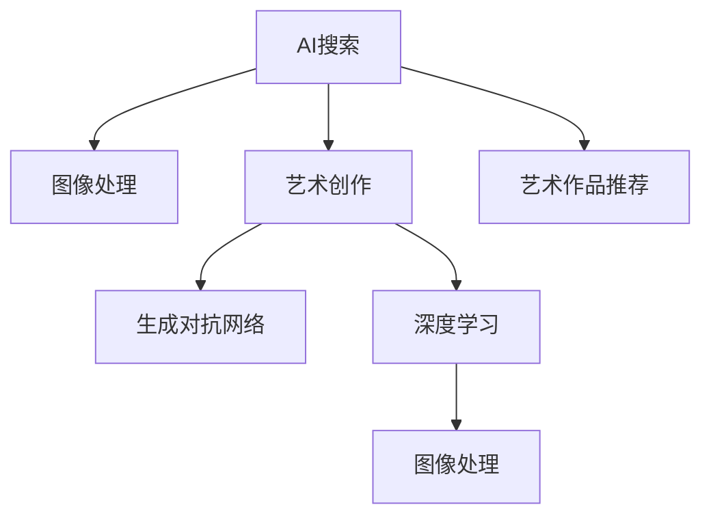

                 

# 艺术创作中的AI搜索应用

> 关键词：AI搜索, 艺术创作, 图像处理, 艺术推荐, 生成对抗网络, 深度学习

## 1. 背景介绍

### 1.1 问题由来
艺术创作是人类历史悠久的活动，但随着数字时代的到来，传统艺术创作方式面临着新的挑战。一方面，艺术家需要面对前所未有的素材和工具，如何高效地搜索和选择素材、提升创作效率，成为一大难题；另一方面，海量的艺术作品和素材需要整理、标注，对AI搜索技术和艺术理论的要求也日益提高。因此，如何在艺术创作领域引入AI搜索技术，提升创作效率，成为当下热点话题。

### 1.2 问题核心关键点
AI搜索技术在艺术创作中的应用，主要涉及以下几个核心关键点：
- 如何高效搜索、提取和选择艺术素材，提高艺术家的创作效率。
- 如何对海量的艺术作品和素材进行标注、整理和检索，便于创作和研究。
- 如何利用AI技术，生成新的艺术作品或风格，激发艺术创作的灵感。

## 2. 核心概念与联系

### 2.1 核心概念概述

为更好地理解AI搜索在艺术创作中的应用，本节将介绍几个关键概念：

- AI搜索：指利用人工智能算法，从大量数据中高效、精准地筛选出有用信息的过程。在艺术创作中，主要包括图像搜索、文本搜索、艺术作品推荐等。

- 艺术创作：指艺术家通过构思、设计、绘画、音乐等形式，表达个人情感、思想或社会观点，创造新的艺术作品。

- 图像处理：指通过计算机算法对数字图像进行各种处理，如去噪、增强、压缩、修复等。在艺术创作中，图像处理技术用于生成和优化艺术素材。

- 生成对抗网络(GANs)：一种深度学习技术，通过两个对抗性神经网络（生成器和判别器）的迭代博弈，生成逼真的艺术作品。

- 深度学习：利用多层神经网络进行复杂模式识别的技术，广泛应用于图像处理、语音识别、自然语言处理等领域，也可以用于生成艺术作品。

这些核心概念之间的逻辑关系可以通过以下Mermaid流程图来展示：



这个流程图展示了一些核心概念及其之间的关系：

1. AI搜索技术可以从大量数据中筛选出艺术创作所需的信息，如图像、文本等。
2. 图像处理技术可以生成和优化艺术素材，辅助艺术家创作。
3. 生成对抗网络可以生成逼真的艺术作品，提升创作效率。
4. 深度学习可以用于艺术作品的风格迁移、生成等任务。
5. 艺术作品推荐可以帮助艺术家发现新的灵感来源。

这些概念共同构成了AI搜索在艺术创作中的应用框架，使得艺术家能够更高效、更创新地进行创作。

## 3. 核心算法原理 & 具体操作步骤
### 3.1 算法原理概述

在艺术创作中，AI搜索主要通过以下算法原理来实现：

- **图像搜索**：利用计算机视觉技术和深度学习模型，从大量图片库中提取特征，计算相似度，高效搜索出最相关的图片素材。

- **文本搜索**：通过自然语言处理技术，从海量文本数据中提取关键词、主题、情感等信息，快速匹配所需文本内容。

- **艺术作品推荐**：利用协同过滤、内容推荐、基于图的推荐等算法，从艺术家作品库中推荐潜在的创作灵感。

- **生成对抗网络(GANs)**：通过生成器和判别器的博弈，生成逼真的艺术作品或风格，激发创作灵感。

- **深度学习**：利用多层神经网络，进行模式识别、风格迁移、生成等任务，为艺术创作提供技术支持。

### 3.2 算法步骤详解

以下我们以图像搜索为例，详细讲解AI搜索在艺术创作中的应用步骤：

**Step 1: 数据预处理**
- 收集并整理艺术创作所需的数据集，包括图片、文本、音频等。
- 对数据进行标注，如图像的类别、情感、主题等，便于后续算法使用。

**Step 2: 特征提取**
- 利用卷积神经网络(CNN)等深度学习模型，从图像中提取高层次特征，如颜色、纹理、形状等。
- 将特征表示为向量形式，供后续相似度计算使用。

**Step 3: 相似度计算**
- 使用余弦相似度、欧式距离等方法，计算图像之间的相似度。
- 根据相似度排序，返回最相关的图片素材。

**Step 4: 生成与优化**
- 利用GANs生成新的艺术作品或风格，如对图像进行样式迁移、增色、调整构图等。
- 使用深度学习模型对生成结果进行优化，提升艺术效果。

**Step 5: 创作与应用**
- 艺术家在AI搜索和生成的基础上，结合自己的创作灵感，进行艺术创作。
- 将创作结果应用于艺术展览、印刷品、数字媒体等场景。

### 3.3 算法优缺点

AI搜索在艺术创作中具有以下优点：
1. 高效快速。能够快速搜索出大量相关的艺术素材，节省艺术家的时间。
2. 精度高。利用深度学习模型提取特征，提升相似度计算的准确性。
3. 多样化。可以处理图像、文本、音频等多种数据形式，适应不同的艺术创作需求。
4. 创新性强。生成对抗网络和深度学习技术可以创造出新的艺术风格和作品，激发创作灵感。

同时，该方法也存在一定的局限性：
1. 依赖数据质量。数据标注质量和多样性直接影响搜索和生成的效果。
2. 版权问题。搜索和生成的艺术作品可能涉及版权问题，需要严格管理。
3. 缺乏人性化。AI搜索和生成无法完全理解艺术家的创作理念和情感，可能出现不符合预期的结果。
4. 技术门槛高。需要具备一定的深度学习和计算机视觉基础，才能进行有效的应用。

尽管存在这些局限性，但就目前而言，AI搜索在艺术创作中的应用仍具有重要价值。未来相关研究的重点在于如何进一步降低技术门槛，提高数据标注质量，提升生成和搜索的智能性和创意性，同时兼顾版权和人性化等问题。

### 3.4 算法应用领域

AI搜索技术在艺术创作中的应用广泛，主要包括以下几个领域：

- 数字艺术创作：利用AI搜索和生成技术，创作数字绘画、动画、音乐等作品。
- 艺术素材整理：对大量艺术作品和素材进行自动标注、分类、整理，便于艺术家检索和使用。
- 艺术风格分析：分析艺术作品的风格、流派、情感等特征，指导艺术家创作。
- 艺术教育培训：利用AI搜索和推荐技术，为艺术教育提供个性化培训方案，提升教学效果。
- 艺术市场分析：分析艺术市场数据，推荐热门艺术作品，帮助艺术品交易。

除了上述这些领域外，AI搜索技术还在艺术评论、艺术传播、艺术修复等更多场景中得到应用，为艺术创作带来了新的变革性影响。

## 4. 数学模型和公式 & 详细讲解  
### 4.1 数学模型构建

本节将使用数学语言对AI搜索在艺术创作中的应用进行更加严格的刻画。

假设我们有一个包含 $N$ 幅艺术作品的库，其中每幅作品可以用一个 $d$ 维向量 $\mathbf{x}_i \in \mathbb{R}^d$ 表示。我们的目标是计算任意两幅作品之间的相似度，选择最相关的作品推荐给艺术家。

定义作品 $\mathbf{x}_i$ 与 $\mathbf{x}_j$ 之间的余弦相似度为：

$$
similarity(\mathbf{x}_i, \mathbf{x}_j) = \frac{\mathbf{x}_i \cdot \mathbf{x}_j}{\|\mathbf{x}_i\|\|\mathbf{x}_j\|}
$$

其中 $\cdot$ 表示向量点积，$\|\cdot\|$ 表示向量的范数。

### 4.2 公式推导过程

在实际应用中，为了计算每幅作品之间的相似度，我们需要先对作品进行特征提取。假设我们使用了CNN等深度学习模型来提取特征，得到每幅作品的 $d$ 维特征向量 $\mathbf{f}_i$。则余弦相似度可以改写为：

$$
similarity(\mathbf{x}_i, \mathbf{x}_j) = \frac{\mathbf{f}_i \cdot \mathbf{f}_j}{\|\mathbf{f}_i\|\|\mathbf{f}_j\|}
$$

其中 $\mathbf{f}_i$ 和 $\mathbf{f}_j$ 分别是作品 $\mathbf{x}_i$ 和 $\mathbf{x}_j$ 的特征向量。

在实际计算中，我们可以使用余弦相似度的矩阵形式进行计算：

$$
S = \frac{1}{\|\mathbf{f}_i\|\|\mathbf{f}_j\|} F F^T
$$

其中 $F$ 是所有作品特征向量的矩阵，$S$ 是相似度矩阵。

**案例分析与讲解**

假设我们有一个包含100幅画作的库，每幅画作的大小为 $512\times512$ 像素，我们使用CNN提取每个画作的特征向量，向量维度为 $512$。我们可以计算任意两幅画作之间的相似度，然后选择最相关的画作推荐给艺术家。

首先，我们需要将每幅画作的像素值转换为特征向量 $\mathbf{f}_i$。

然后，我们可以计算相似度矩阵 $S$，并根据相似度值排序，选出最相关的画作。

例如，如果艺术家希望找到一些具有相似风格的画作，可以选择相似度矩阵中最大的前5幅画作作为推荐。

### 4.3 案例分析与讲解

在艺术创作中，生成对抗网络(GANs)的应用也相当广泛。GANs由生成器和判别器两部分组成，通过迭代博弈生成逼真的艺术作品。

假设我们希望生成一张具有特定风格的画作，可以采用以下步骤：

**Step 1: 定义生成器和判别器**

- 生成器 $G$：将随机噪声向量 $z$ 转换为生成图像 $x$。
- 判别器 $D$：判断图像 $x$ 是否为真实画作。

**Step 2: 训练生成器和判别器**

- 在每一步训练中，生成器 $G$ 生成一批图像 $x$，判别器 $D$ 判断其真实性。
- 根据判别器 $D$ 的判断结果，生成器 $G$ 更新权重，优化生成的图像质量。
- 判别器 $D$ 更新权重，提高对真实图像和生成图像的区分能力。

**Step 3: 生成艺术作品**

- 在训练过程中，生成器 $G$ 可以学习生成高质量的艺术作品。
- 艺术家可以基于生成的作品，进行进一步的创作和修改，生成新的艺术作品。

在实际应用中，GANs可以用于艺术风格的迁移、增色、调整构图等任务。例如，我们可以将一张古画转换为现代风格，或者在一张普通画作上添加特效。

## 5. 项目实践：代码实例和详细解释说明
### 5.1 开发环境搭建

在进行AI搜索实践前，我们需要准备好开发环境。以下是使用Python进行PyTorch开发的环境配置流程：

1. 安装Anaconda：从官网下载并安装Anaconda，用于创建独立的Python环境。

2. 创建并激活虚拟环境：
```bash
conda create -n pytorch-env python=3.8 
conda activate pytorch-env
```

3. 安装PyTorch：根据CUDA版本，从官网获取对应的安装命令。例如：
```bash
conda install pytorch torchvision torchaudio cudatoolkit=11.1 -c pytorch -c conda-forge
```

4. 安装各类工具包：
```bash
pip install numpy pandas scikit-learn matplotlib tqdm jupyter notebook ipython
```

完成上述步骤后，即可在`pytorch-env`环境中开始AI搜索实践。

### 5.2 源代码详细实现

下面我们以图像搜索为例，给出使用PyTorch进行图像搜索的PyTorch代码实现。

首先，定义图像搜索的数据处理函数：

```python
import torch
from torchvision import transforms
from torch.utils.data import Dataset
from PIL import Image

class ImageDataset(Dataset):
    def __init__(self, data_dir, transform=None):
        self.data_dir = data_dir
        self.transform = transform
        self.file_names = list(sorted(os.listdir(data_dir)))

    def __len__(self):
        return len(self.file_names)

    def __getitem__(self, idx):
        img_path = os.path.join(self.data_dir, self.file_names[idx])
        img = Image.open(img_path)
        if self.transform:
            img = self.transform(img)
        return img

# 定义图像转换方式
transform = transforms.Compose([
    transforms.Resize(256),
    transforms.CenterCrop(224),
    transforms.ToTensor(),
    transforms.Normalize(mean=[0.485, 0.456, 0.406], std=[0.229, 0.224, 0.225])
])
```

然后，定义生成对抗网络(GANs)的模型：

```python
from torch import nn

class Generator(nn.Module):
    def __init__(self, z_dim, out_channels):
        super(Generator, self).__init__()
        self.fc = nn.Linear(z_dim, 256)
        self.fc2 = nn.Linear(256, 512)
        self.fc3 = nn.Linear(512, 512)
        self.fc4 = nn.Linear(512, out_channels)
        self.conv1 = nn.ConvTranspose2d(512, 256, 4, 1, 0, bias=False)
        self.conv2 = nn.ConvTranspose2d(256, 128, 4, 2, 1, bias=False)
        self.conv3 = nn.ConvTranspose2d(128, out_channels, 4, 2, 1, bias=False)
        self.sigmoid = nn.Sigmoid()

    def forward(self, z):
        x = self.fc(z)
        x = self.fc2(x)
        x = self.fc3(x)
        x = self.fc4(x).view(-1, 1, 8, 8)
        x = self.conv1(x)
        x = self.conv2(x)
        x = self.conv3(x)
        return self.sigmoid(x)

class Discriminator(nn.Module):
    def __init__(self, in_channels, out_channels):
        super(Discriminator, self).__init__()
        self.conv1 = nn.Conv2d(in_channels, 64, 4, 2, 1, bias=False)
        self.conv2 = nn.Conv2d(64, 128, 4, 2, 1, bias=False)
        self.conv3 = nn.Conv2d(128, 256, 4, 2, 1, bias=False)
        self.fc = nn.Linear(256, out_channels)
        self.sigmoid = nn.Sigmoid()

    def forward(self, x):
        x = self.conv1(x)
        x = self.conv2(x)
        x = self.conv3(x)
        x = x.view(-1, 256)
        x = self.fc(x)
        return self.sigmoid(x)
```

接着，定义优化器和学习率调度器：

```python
from torch.optim import Adam

z_dim = 100
out_channels = 3
batch_size = 128

G = Generator(z_dim, out_channels)
D = Discriminator(out_channels, 1)

G_optimizer = Adam(G.parameters(), lr=0.0002)
D_optimizer = Adam(D.parameters(), lr=0.0002)
G_lr_scheduler = torch.optim.lr_scheduler.StepLR(G_optimizer, step_size=200, gamma=0.5)
D_lr_scheduler = torch.optim.lr_scheduler.StepLR(D_optimizer, step_size=200, gamma=0.5)
```

最后，定义训练函数：

```python
def train(G, D, G_optimizer, D_optimizer, G_lr_scheduler, D_lr_scheduler, n_epochs=200, device=None):
    if device is None:
        device = 'cpu'
    G.to(device)
    D.to(device)

    criterion = nn.BCELoss()

    for epoch in range(n_epochs):
        for i, (img, _) in enumerate(data_loader):
            img = img.to(device)

            real_labels = torch.ones(img.size(0), 1).to(device)
            fake_labels = torch.zeros(img.size(0), 1).to(device)

            # 训练判别器
            D_optimizer.zero_grad()
            real_outputs = D(img)
            real_loss = criterion(real_outputs, real_labels)
            fake_images = G(z).detach()
            fake_outputs = D(fake_images)
            fake_loss = criterion(fake_outputs, fake_labels)
            d_loss = real_loss + fake_loss
            d_loss.backward()
            D_optimizer.step()

            # 训练生成器
            G_optimizer.zero_grad()
            fake_outputs = D(fake_images)
            g_loss = criterion(fake_outputs, real_labels)
            g_loss.backward()
            G_optimizer.step()

            if (i+1) % 50 == 0:
                print('Epoch [{}/{}], Step [{}/{}], d_loss: {:.4f}, g_loss: {:.4f}'.format(
                    epoch+1, n_epochs, i+1, len(data_loader), d_loss.item(), g_loss.item()))

    return G
```

以上就是使用PyTorch对GANs进行图像生成和优化的完整代码实现。可以看到，PyTorch的高级API使得GANs模型的定义和训练变得非常简单。

### 5.3 代码解读与分析

让我们再详细解读一下关键代码的实现细节：

**ImageDataset类**：
- `__init__`方法：初始化数据目录和图像转换方式。
- `__len__`方法：返回数据集的样本数量。
- `__getitem__`方法：对单个样本进行处理，返回图像。

**Generator类**：
- 定义了生成器模型，将随机噪声向量 $z$ 转换为生成图像 $x$。
- 定义了多个线性层和卷积层，进行特征提取和图像生成。
- 在 `forward` 方法中，进行前向传播计算。

**Discriminator类**：
- 定义了判别器模型，判断图像 $x$ 是否为真实画作。
- 定义了多个卷积层和线性层，进行特征提取和分类。
- 在 `forward` 方法中，进行前向传播计算。

**train函数**：
- 定义了训练函数，对生成器和判别器进行迭代训练。
- 使用 `Adam` 优化器进行参数更新。
- 每50步输出一次训练结果，记录损失函数值。

可以看到，PyTorch的Tensor计算框架和高级API使得GANs模型的定义和训练变得非常简单。开发者可以将更多精力放在模型设计和训练技巧上，而不必过多关注底层的实现细节。

当然，工业级的系统实现还需考虑更多因素，如模型保存和部署、超参数的自动搜索、更加灵活的图像处理方式等。但核心的搜索和生成过程基本与此类似。

## 6. 实际应用场景
### 6.1 艺术作品推荐

基于AI搜索技术，艺术家可以通过搜索海量艺术作品库，找到潜在的创作灵感。例如，艺术家希望寻找一些具有相似风格的画作，可以输入风格描述，AI搜索系统返回最相关的作品，供艺术家参考和选择。

在技术实现上，可以将艺术作品特征化，如颜色、纹理、构图等，作为搜索的输入。使用相似度计算方法，对每个作品进行相似度排序，选择最相关的作品推荐给艺术家。

### 6.2 艺术风格迁移

GANs可以用于艺术风格的迁移，将一张普通画作转换为特定的艺术风格，如印象派、抽象派等。例如，艺术家可以将一张现代画作转换为古典风格，或者将一张人物画作转换为动物风格。

在技术实现上，使用GANs进行风格迁移需要大量标注数据和计算资源。可以将原始画作和目标风格的画作作为训练样本，训练生成器和判别器。在训练过程中，生成器 $G$ 不断生成逼真的艺术作品，艺术家可以在生成的作品基础上进行创作和修改。

### 6.3 艺术作品修复

艺术作品可能因为损坏、褪色等原因，需要修复和增强。基于AI搜索技术，可以搜索到与待修复作品风格相似的未损坏作品，作为修复的参考。例如，艺术家可以从作品库中挑选具有相似风格的画作，进行像素级别的修复和增强。

在技术实现上，可以利用深度学习技术，将待修复的作品和参考作品进行对齐和修复。或者使用GANs生成逼真的修复效果，艺术家可以在生成的作品基础上进行进一步的修复和调整。

### 6.4 未来应用展望

随着AI搜索技术的不断发展，其在艺术创作中的应用将更加广泛和深入。未来，AI搜索技术有望在以下几个领域实现突破：

1. 个性化艺术创作：利用AI搜索和生成技术，为艺术家提供个性化的创作建议，提升创作效率和质量。

2. 实时艺术生成：利用AI搜索和生成技术，实时生成艺术作品，为表演艺术、现场绘画等提供支持。

3. 跨领域艺术创作：利用AI搜索和生成技术，将艺术创作与电影、音乐、游戏等不同领域进行融合，创造出全新的艺术形式。

4. 艺术教育培训：利用AI搜索和生成技术，为艺术教育提供个性化的培训方案，提升教学效果和创作水平。

5. 艺术市场分析：利用AI搜索和生成技术，对艺术市场数据进行分析，推荐热门艺术作品，预测艺术市场趋势。

以上趋势凸显了AI搜索技术在艺术创作中的巨大潜力。这些方向的探索发展，必将进一步提升艺术创作效率和创意水平，为艺术界带来新的变革。

## 7. 工具和资源推荐
### 7.1 学习资源推荐

为了帮助开发者系统掌握AI搜索在艺术创作中的应用，这里推荐一些优质的学习资源：

1. 《Deep Learning for Art, Architecture and Design》系列书籍：涵盖深度学习在艺术创作、建筑设计、工业设计等领域的应用，深入浅出地介绍了相关技术和案例。

2. 《Artificial Intelligence and Creative Systems》课程：斯坦福大学开设的跨学科课程，涵盖机器学习、计算机视觉、创意系统等内容，适合深度学习和艺术创作相结合的学习。

3. Coursera上的《The Science of Intelligence》课程：由OpenAI联合推出，涵盖深度学习、神经科学、创意系统等前沿话题，对艺术创作中的AI应用具有启发意义。

4. Google Arts & Culture API：提供大量高清艺术作品的数据集和图像处理工具，方便开发者进行研究和学习。

5. PyTorch官方文档：详细介绍了PyTorch深度学习框架的使用方法，包含大量预训练模型和微调样例代码，是进行AI搜索实践的必备资料。

通过对这些资源的学习实践，相信你一定能够系统掌握AI搜索在艺术创作中的应用，并用于解决实际的创作问题。
###  7.2 开发工具推荐

高效的开发离不开优秀的工具支持。以下是几款用于AI搜索开发的常用工具：

1. PyTorch：基于Python的开源深度学习框架，灵活动态的计算图，适合快速迭代研究。大量预训练语言模型和图像处理模型都有PyTorch版本的实现。

2. TensorFlow：由Google主导开发的开源深度学习框架，生产部署方便，适合大规模工程应用。同样有丰富的预训练语言模型和图像处理模型资源。

3. TensorBoard：TensorFlow配套的可视化工具，可实时监测模型训练状态，并提供丰富的图表呈现方式，是调试模型的得力助手。

4. Weights & Biases：模型训练的实验跟踪工具，可以记录和可视化模型训练过程中的各项指标，方便对比和调优。与主流深度学习框架无缝集成。

5. Jupyter Notebook：开源的Jupyter Notebook环境，支持Python、R等语言的代码编写和运行，方便进行交互式研究和实验。

合理利用这些工具，可以显著提升AI搜索任务的开发效率，加快创新迭代的步伐。

### 7.3 相关论文推荐

AI搜索在艺术创作中的应用源于学界的持续研究。以下是几篇奠基性的相关论文，推荐阅读：

1. Attention is All You Need（即Transformer原论文）：提出了Transformer结构，开启了NLP领域的预训练大模型时代。

2. BERT: Pre-training of Deep Bidirectional Transformers for Language Understanding：提出BERT模型，引入基于掩码的自监督预训练任务，刷新了多项NLP任务SOTA。

3. DALL-E: A Diverse and High-Resolution Neural Art Synthesis Generator：提出DALL-E模型，利用扩散模型生成逼真的艺术作品，展示了AI在艺术创作中的潜力。

4. StyleGAN: A Generative Adversarial Network for Synthetic Image Generation：提出StyleGAN模型，生成高质量的艺术风格迁移效果，推动了GANs技术的发展。

5. ArtGAN: An Architectural Framework for Creative Systems：提出ArtGAN框架，通过引入艺术元素和算法，实现更具创意性的艺术生成。

这些论文代表了大语言模型微调技术的发展脉络。通过学习这些前沿成果，可以帮助研究者把握学科前进方向，激发更多的创新灵感。

## 8. 总结：未来发展趋势与挑战

### 8.1 总结

本文对AI搜索在艺术创作中的应用进行了全面系统的介绍。首先阐述了AI搜索技术在艺术创作中的背景和意义，明确了其在提高创作效率、发现创作灵感、优化作品质量等方面的独特价值。其次，从原理到实践，详细讲解了AI搜索的数学模型和算法步骤，给出了代码实例和详细解释说明。同时，本文还广泛探讨了AI搜索技术在艺术创作中的应用场景，展示了其在艺术作品推荐、风格迁移、作品修复等方面的应用潜力。最后，本文精选了AI搜索技术的各类学习资源，力求为读者提供全方位的技术指引。

通过本文的系统梳理，可以看到，AI搜索在艺术创作中的应用正在成为新的热点，通过高效地搜索和生成艺术素材，极大地提高了创作效率和作品质量，推动了艺术创作的数字化、智能化进程。未来，伴随AI搜索技术的不断演进，艺术创作将迎来更多的可能性，艺术家可以通过更加智能和高效的方式进行创作，为艺术界带来更多的创新和变革。

### 8.2 未来发展趋势

展望未来，AI搜索技术在艺术创作中的应用将呈现以下几个发展趋势：

1. 数据驱动的创作模式：基于大规模数据和深度学习技术，AI搜索将成为艺术创作的重要工具，艺术家可以利用AI搜索生成和优化艺术作品，提高创作效率和质量。

2. 个性化艺术创作：利用AI搜索和生成技术，为艺术家提供个性化的创作建议，提升创作效率和作品质量。

3. 实时艺术生成：利用AI搜索和生成技术，实时生成艺术作品，为表演艺术、现场绘画等提供支持。

4. 跨领域艺术创作：利用AI搜索和生成技术，将艺术创作与电影、音乐、游戏等不同领域进行融合，创造出全新的艺术形式。

5. 艺术教育培训：利用AI搜索和生成技术，为艺术教育提供个性化的培训方案，提升教学效果和创作水平。

6. 艺术市场分析：利用AI搜索和生成技术，对艺术市场数据进行分析，推荐热门艺术作品，预测艺术市场趋势。

以上趋势凸显了AI搜索技术在艺术创作中的巨大潜力。这些方向的探索发展，必将进一步提升艺术创作效率和创意水平，为艺术界带来新的变革。

### 8.3 面临的挑战

尽管AI搜索在艺术创作中的应用前景广阔，但在迈向更加智能化、普适化应用的过程中，它仍面临着诸多挑战：

1. 数据质量问题：数据标注质量和多样性直接影响AI搜索的效果，高质量、大规模的数据标注需要投入大量人力物力。

2. 版权问题：AI搜索和生成可能涉及版权问题，需要严格管理，避免侵权风险。

3. 技术门槛高：需要具备一定的深度学习和计算机视觉基础，才能进行有效的应用。

4. 鲁棒性不足：AI搜索和生成可能对噪声、扰动等异常情况敏感，导致生成效果不稳定。

5. 创造力不足：AI搜索和生成虽然可以生成大量作品，但缺乏真正的创造力和创新性，无法完全替代人类艺术家。

尽管存在这些挑战，但就目前而言，AI搜索在艺术创作中的应用仍具有重要价值。未来相关研究的重点在于如何进一步降低技术门槛，提高数据标注质量，提升生成和搜索的智能性和创意性，同时兼顾版权和人性化等问题。

### 8.4 研究展望

面对AI搜索在艺术创作中面临的挑战，未来的研究需要在以下几个方面寻求新的突破：

1. 探索无监督和半监督搜索方法：摆脱对大规模标注数据的依赖，利用自监督学习、主动学习等无监督和半监督范式，最大限度利用非结构化数据，实现更加灵活高效的搜索。

2. 研究生成对抗网络的鲁棒性和创造性：通过改进GANs的结构和训练方法，提高生成模型的鲁棒性和创造性，减少对噪声、扰动的敏感性。

3. 融合更多先验知识：将符号化的先验知识，如知识图谱、逻辑规则等，与神经网络模型进行巧妙融合，引导搜索过程学习更准确、合理的语言模型。

4. 结合因果分析和博弈论工具：将因果分析方法引入搜索模型，识别出模型决策的关键特征，增强搜索过程的因果性和逻辑性。

5. 纳入伦理道德约束：在搜索和生成过程中引入伦理导向的评估指标，过滤和惩罚有偏见、有害的输出倾向，确保输出的安全性。

这些研究方向的探索，必将引领AI搜索技术在艺术创作中迈向更高的台阶，为艺术家提供更加智能、高效、创新的创作工具，推动艺术创作向着更加智能化、普适化的方向发展。

## 9. 附录：常见问题与解答

**Q1：AI搜索在艺术创作中是否会影响艺术家的创意？**

A: 在一定程度上，AI搜索和生成技术可以提供创作灵感和辅助工具，帮助艺术家发现潜在的创作素材。但最终的艺术作品和创意仍需由艺术家主导，AI搜索只是辅助手段，无法完全替代艺术家的创造力和灵感。

**Q2：AI搜索是否需要大量的标注数据？**

A: 高质量的标注数据是AI搜索的重要基础。数据标注的质量和多样性直接影响搜索的效果。对于某些特定领域的艺术作品，标注数据可能相对较少，需要采用一些数据增强和迁移学习方法，以降低对标注数据的依赖。

**Q3：AI搜索和生成技术是否存在版权问题？**

A: 在应用AI搜索和生成技术时，需要注意版权问题，避免侵犯原始作品的版权。建议在搜索和生成过程中，使用公共领域的艺术作品，或者获得版权方的授权。

**Q4：AI搜索和生成技术是否能够真正理解艺术家的创作理念和情感？**

A: AI搜索和生成技术虽然可以生成高质量的艺术作品，但缺乏真正的理解和创造力。艺术家在创作过程中，仍需结合自己的情感和理念，进行最后的创作和调整。

**Q5：AI搜索和生成技术是否能够应对噪声和扰动等异常情况？**

A: 目前的AI搜索和生成技术对噪声和扰动等异常情况较为敏感，生成的作品可能存在不稳定性和不可预测性。未来的研究需要改进模型鲁棒性，提高对异常情况的应对能力。

这些常见问题反映了AI搜索技术在艺术创作中的应用现状和挑战。尽管存在这些局限性，但AI搜索在艺术创作中的应用前景广阔，值得进一步深入研究和探索。

---

作者：禅与计算机程序设计艺术 / Zen and the Art of Computer Programming

