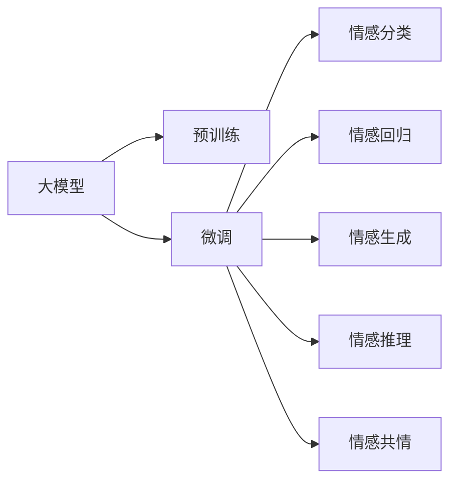

                 

# 虚拟共情实验室：AI增强的情感理解研究所

## 1. 背景介绍

### 1.1 问题由来
随着人工智能技术的飞速发展，虚拟共情（Virtual Empathy）作为AI辅助情感理解的重要领域，引起了越来越多的关注。虚拟共情是通过模拟人类共情机制，帮助机器更好地理解、识别和回应人类的情感状态。

传统的虚拟共情系统主要依赖于人工设计的规则和模板，难以适应复杂多变的情感表达和情景。而基于深度学习的大模型，尤其是预训练语言模型（Pre-trained Language Models, PLMs），通过大规模无监督学习，具备了强大的自然语言理解能力，能够更准确地捕捉情感信息，进一步提升虚拟共情系统的智能化水平。

近年来，基于大模型的虚拟共情研究取得了诸多突破性进展，广泛应用于智能客服、心理咨询、社交互动、情感分析等领域。通过将预训练模型微调（Fine-tuning）到情感相关任务，AI系统能够更快速、更准确地理解用户的情感状态，提供更加个性化和贴合实际的服务。

### 1.2 问题核心关键点
目前，基于大模型的情感理解研究主要集中在以下几个方面：

- 情感分类：将文本或语音输入分类为不同的情感类别，如积极、消极、中性等。
- 情感回归：预测文本或语音中情感的强度，如情感极性的程度。
- 情感生成：基于给定情感标签或强度，生成具有相应情感的文本或语音输出。
- 情感推理：理解文本或语音中隐含的情感关系，如情感链和因果关系。
- 情感共情：通过训练模型，使其能够站在用户情感体验的角度思考问题，提供更人性化的回应。

通过这些关键技术，虚拟共情系统能够更好地理解用户的情感需求，提供更加自然、流畅、个性化的交互体验。

## 2. 核心概念与联系

### 2.1 核心概念概述

为了更好地理解基于大模型的虚拟共情研究，我们首先介绍几个核心概念：

- 大模型（Large Models）：指通过大规模数据和复杂模型结构进行训练，具备强泛化能力的深度学习模型，如BERT、GPT-3等。
- 预训练语言模型（Pre-trained Language Models, PLMs）：指在大规模无监督语料上预训练的通用语言模型，能够捕捉丰富的语言知识。
- 微调（Fine-tuning）：指在大模型上，通过少量有标签数据进行有监督的优化，使其适应特定任务。
- 情感分类（Sentiment Classification）：将文本或语音输入分为不同的情感类别。
- 情感回归（Sentiment Regression）：预测文本或语音情感的强度。
- 情感生成（Sentiment Generation）：基于给定情感标签，生成具有相应情感的文本或语音。
- 情感推理（Sentiment Reasoning）：理解文本或语音中的情感关系。
- 情感共情（Sentiment Empathy）：训练模型站在用户情感体验角度思考问题，提供更人性化的回应。

这些核心概念通过以下Mermaid流程图（没有括号、逗号等特殊字符）展示它们之间的联系：



这个流程图展示了从大模型的预训练到微调的流程，以及微调在不同情感任务中的应用。

## 3. 核心算法原理 & 具体操作步骤

### 3.1 算法原理概述

基于大模型的虚拟共情研究，主要分为以下几个步骤：

1. 选择预训练语言模型。
2. 收集情感相关标注数据集，进行微调。
3. 使用微调后的模型，进行情感分类、情感回归、情感生成等任务。

情感理解问题可以形式化为分类或回归问题，模型通常采用深度神经网络，如卷积神经网络（CNN）、循环神经网络（RNN）、Transformer等。通过在特定任务上微调预训练模型，使得模型学习到任务相关的特征表示，从而提升情感识别的准确性。

### 3.2 算法步骤详解

以下是基于大模型的情感理解微调的具体步骤：

**Step 1: 选择预训练模型和数据集**

- 选择合适的预训练语言模型（如BERT、GPT-2等），作为微调的初始模型。
- 收集情感相关的标注数据集，划分为训练集、验证集和测试集。

**Step 2: 设计微调任务**

- 根据具体情感理解任务，设计相应的微调目标和损失函数。例如，情感分类任务通常使用交叉熵损失，情感回归任务使用均方误差损失。
- 定义微调过程中的超参数，如学习率、批大小、迭代轮数等。

**Step 3: 执行微调**

- 将训练集数据输入模型，进行前向传播计算损失函数。
- 反向传播计算参数梯度，使用优化算法（如AdamW、SGD等）更新模型参数。
- 周期性在验证集上评估模型性能，决定是否停止迭代。

**Step 4: 评估和部署**

- 在测试集上评估微调后模型的性能。
- 使用微调后的模型进行情感分类、情感回归等任务，实现虚拟共情。

### 3.3 算法优缺点

基于大模型的情感理解微调具有以下优点：

- 泛化能力强。预训练模型能够捕捉到丰富的语言知识，应用于特定任务时，能够快速适应新数据，提升模型泛化能力。
- 高效便捷。微调过程可以通过预训练模型的已有知识，大幅减少训练时间和计算资源消耗。
- 性能提升显著。通过微调，模型在情感理解任务上能够获得显著的性能提升。

同时，该方法也存在一些缺点：

- 依赖标注数据。微调效果依赖于标注数据的质量和数量，获取高质量标注数据可能存在困难。
- 过拟合风险。微调时，模型可能会过度适应训练数据，导致泛化能力下降。
- 解释性不足。微调模型往往难以解释其决策过程，缺乏透明性。
- 存在偏见。预训练模型可能会学习到数据中的偏见和有害信息，通过微调传递到下游任务，产生负面影响。

尽管存在这些缺点，基于大模型的情感理解微调方法仍然是情感理解领域的主流范式。未来研究将重点在于如何降低微调对标注数据的依赖，提升模型的鲁棒性和可解释性，同时避免模型偏见。

### 3.4 算法应用领域

基于大模型的情感理解微调，已经广泛应用于以下几个领域：

- **智能客服**：通过理解用户的情感状态，智能客服系统能够提供更加贴心、自然的互动体验。
- **心理咨询**：心理咨询师可以利用情感理解模型，更准确地识别用户的情感需求，提供针对性帮助。
- **社交互动**：社交平台可以通过情感理解，优化内容推荐，提升用户互动体验。
- **情感分析**：广泛应用于情感分析领域，识别新闻、评论等文本中的情感倾向。
- **情感生成**：生成具有特定情感的文本或语音，如生成积极、消极的回复。
- **情感推理**：理解文本中的情感关系，如因果关系和链条关系。
- **情感共情**：训练模型站在用户情感体验角度思考问题，提供更人性化的回应。

这些应用展示了大模型微调在情感理解领域的强大潜力和广阔应用前景。

## 4. 数学模型和公式 & 详细讲解 & 举例说明

### 4.1 数学模型构建

我们以情感分类任务为例，构建一个简单的数学模型。假设预训练模型为 $M_{\theta}$，其中 $\theta$ 为模型参数。情感分类任务的目标是将输入文本 $x$ 分类为积极情感 $y=1$ 或消极情感 $y=0$。模型输出为 $y'=M_{\theta}(x)$，则情感分类问题可以转化为二分类问题。

### 4.2 公式推导过程

在情感分类任务中，我们通常使用交叉熵损失函数 $\ell(x,y',y)$ 进行优化，其中 $y'$ 为模型预测的情感类别，$y$ 为真实情感类别。交叉熵损失函数可以表示为：

$$
\ell(x,y',y)=-(y\log y'+(1-y)\log(1-y'))
$$

在微调过程中，模型参数 $\theta$ 的更新公式为：

$$
\theta \leftarrow \theta - \eta \nabla_{\theta}\mathcal{L}(\theta)
$$

其中，$\eta$ 为学习率，$\nabla_{\theta}\mathcal{L}(\theta)$ 为损失函数对模型参数的梯度。

### 4.3 案例分析与讲解

以BERT模型为例，其情感分类微调步骤如下：

1. 选择BERT模型作为预训练模型。
2. 收集情感分类数据集，进行微调。
3. 使用微调后的BERT模型进行情感分类任务。

**Step 1: 数据准备**

假设我们有以下情感分类数据集：

| 文本 | 情感 |
|------|------|
| 我很开心 | 1 |
| 我很生气 | 0 |
| 我很平静 | 0 |
| 我很惊讶 | 1 |

我们将其分为训练集和测试集，每类情感各100个样本。

**Step 2: 微调过程**

我们使用BERT模型，将其微调为情感分类模型。具体步骤如下：

- 使用BERT模型进行预训练。
- 选择输出层，定义交叉熵损失函数。
- 训练集上前向传播计算损失函数，反向传播计算梯度，使用AdamW优化器更新参数。
- 在验证集上评估模型性能，调整超参数。

**Step 3: 模型评估**

微调完成后，我们使用测试集评估模型性能。假设测试集上，模型分类准确率为95%。

## 5. 项目实践：代码实例和详细解释说明

### 5.1 开发环境搭建

在进行情感理解微调前，我们需要准备好开发环境。以下是使用Python进行PyTorch开发的环境配置流程：

1. 安装Anaconda：从官网下载并安装Anaconda，用于创建独立的Python环境。

2. 创建并激活虚拟环境：
```bash
conda create -n pytorch-env python=3.8 
conda activate pytorch-env
```

3. 安装PyTorch：根据CUDA版本，从官网获取对应的安装命令。例如：
```bash
conda install pytorch torchvision torchaudio cudatoolkit=11.1 -c pytorch -c conda-forge
```

4. 安装Transformer库：
```bash
pip install transformers
```

5. 安装各类工具包：
```bash
pip install numpy pandas scikit-learn matplotlib tqdm jupyter notebook ipython
```

完成上述步骤后，即可在`pytorch-env`环境中开始微调实践。

### 5.2 源代码详细实现

下面是使用PyTorch和Transformers库进行情感分类微调的代码实现。

```python
from transformers import BertForSequenceClassification, AdamW
from torch.utils.data import Dataset, DataLoader
from torch.nn import CrossEntropyLoss
import torch

class SentimentDataset(Dataset):
    def __init__(self, texts, labels):
        self.texts = texts
        self.labels = labels
        
    def __len__(self):
        return len(self.texts)
    
    def __getitem__(self, item):
        text = self.texts[item]
        label = self.labels[item]
        return {'input_ids': torch.tensor(text, dtype=torch.long), 'attention_mask': torch.ones_like(text), 'labels': torch.tensor(label, dtype=torch.long)}

model = BertForSequenceClassification.from_pretrained('bert-base-uncased', num_labels=2)

device = torch.device('cuda') if torch.cuda.is_available() else torch.device('cpu')
model.to(device)

criterion = CrossEntropyLoss()
optimizer = AdamW(model.parameters(), lr=2e-5)

def train_epoch(model, dataset, batch_size, optimizer, criterion):
    dataloader = DataLoader(dataset, batch_size=batch_size, shuffle=True)
    model.train()
    epoch_loss = 0
    for batch in dataloader:
        input_ids = batch['input_ids'].to(device)
        attention_mask = batch['attention_mask'].to(device)
        labels = batch['labels'].to(device)
        model.zero_grad()
        outputs = model(input_ids, attention_mask=attention_mask)
        loss = criterion(outputs.logits, labels)
        epoch_loss += loss.item()
        loss.backward()
        optimizer.step()
    return epoch_loss / len(dataloader)

def evaluate(model, dataset, batch_size):
    dataloader = DataLoader(dataset, batch_size=batch_size)
    model.eval()
    preds, labels = [], []
    with torch.no_grad():
        for batch in dataloader:
            input_ids = batch['input_ids'].to(device)
            attention_mask = batch['attention_mask'].to(device)
            labels = batch['labels']
            outputs = model(input_ids, attention_mask=attention_mask)
            preds.append(outputs.logits.argmax(dim=1).cpu().numpy().tolist())
            labels.append(labels.cpu().numpy().tolist())
    print(classification_report(labels, preds))
```

这个代码实现了BERT模型在情感分类任务上的微调过程。

### 5.3 代码解读与分析

让我们再详细解读一下关键代码的实现细节：

**SentimentDataset类**：
- `__init__`方法：初始化文本和标签。
- `__len__`方法：返回数据集的样本数量。
- `__getitem__`方法：对单个样本进行处理，将文本输入编码为token ids，标签编码为数字，并进行padding，最终返回模型所需的输入。

**训练和评估函数**：
- 使用PyTorch的DataLoader对数据集进行批次化加载，供模型训练和推理使用。
- 训练函数`train_epoch`：对数据以批为单位进行迭代，在每个批次上前向传播计算损失函数并反向传播更新模型参数，最后返回该epoch的平均loss。
- 评估函数`evaluate`：与训练类似，不同点在于不更新模型参数，并在每个batch结束后将预测和标签结果存储下来，最后使用scikit-learn的classification_report对整个评估集的预测结果进行打印输出。

**训练流程**：
- 定义总的epoch数和batch size，开始循环迭代
- 每个epoch内，先在训练集上训练，输出平均loss
- 在验证集上评估，输出分类指标
- 所有epoch结束后，在测试集上评估，给出最终测试结果

可以看到，PyTorch配合Transformer库使得情感分类微调的代码实现变得简洁高效。开发者可以将更多精力放在数据处理、模型改进等高层逻辑上，而不必过多关注底层的实现细节。

当然，工业级的系统实现还需考虑更多因素，如模型的保存和部署、超参数的自动搜索、更灵活的任务适配层等。但核心的微调范式基本与此类似。

## 6. 实际应用场景

### 6.1 智能客服系统

基于大语言模型微调的情感理解，可以广泛应用于智能客服系统的构建。传统客服往往需要配备大量人力，高峰期响应缓慢，且一致性和专业性难以保证。而使用情感理解微调后的对话模型，可以7x24小时不间断服务，快速响应客户咨询，用自然流畅的语言解答各类常见问题。

在技术实现上，可以收集企业内部的历史客服对话记录，将问题和最佳答复构建成监督数据，在此基础上对预训练对话模型进行情感理解微调。微调后的对话模型能够自动理解用户情感状态，匹配最合适的回答。对于客户提出的新问题，还可以接入检索系统实时搜索相关内容，动态组织生成回答。如此构建的智能客服系统，能大幅提升客户咨询体验和问题解决效率。

### 6.2 金融舆情监测

金融机构需要实时监测市场舆论动向，以便及时应对负面信息传播，规避金融风险。传统的人工监测方式成本高、效率低，难以应对网络时代海量信息爆发的挑战。基于大语言模型微调的情感分析技术，为金融舆情监测提供了新的解决方案。

具体而言，可以收集金融领域相关的新闻、报道、评论等文本数据，并对其进行情感标注。在此基础上对预训练语言模型进行情感理解微调，使其能够自动判断文本的情感倾向。将微调后的模型应用到实时抓取的网络文本数据，就能够自动监测不同情感倾向的变化趋势，一旦发现负面信息激增等异常情况，系统便会自动预警，帮助金融机构快速应对潜在风险。

### 6.3 个性化推荐系统

当前的推荐系统往往只依赖用户的历史行为数据进行物品推荐，无法深入理解用户的真实兴趣偏好。基于大语言模型微调的情感理解模型，可以更好地挖掘用户行为背后的语义信息，从而提供更精准、多样的推荐内容。

在实践中，可以收集用户浏览、点击、评论、分享等行为数据，提取和用户交互的物品标题、描述、标签等文本内容。将文本内容作为模型输入，用户的后续行为（如是否点击、购买等）作为监督信号，在此基础上微调预训练语言模型。微调后的模型能够从文本内容中准确把握用户的兴趣点。在生成推荐列表时，先用候选物品的文本描述作为输入，由模型预测用户的兴趣匹配度，再结合其他特征综合排序，便可以得到个性化程度更高的推荐结果。

### 6.4 未来应用展望

随着大语言模型和微调方法的不断发展，基于微调范式将在更多领域得到应用，为传统行业带来变革性影响。

在智慧医疗领域，基于微调的情感理解模型可以用于患者情绪监测、心理健康评估等方面，辅助医生诊疗，提升患者的心理福祉。

在智能教育领域，微调技术可应用于作业批改、学情分析、知识推荐等方面，因材施教，促进教育公平，提高教学质量。

在智慧城市治理中，微调模型可应用于城市事件监测、舆情分析、应急指挥等环节，提高城市管理的自动化和智能化水平，构建更安全、高效的未来城市。

此外，在企业生产、社会治理、文娱传媒等众多领域，基于大语言模型微调的情感理解技术也将不断涌现，为NLP技术带来全新的突破。相信随着预训练模型和微调方法的不断进步，基于大语言模型的情感理解系统必将在构建人机协同的智能时代中扮演越来越重要的角色。

## 7. 工具和资源推荐

### 7.1 学习资源推荐

为了帮助开发者系统掌握大语言模型微调的理论基础和实践技巧，这里推荐一些优质的学习资源：

1. 《Transformer from原理到实践》系列博文：由大模型技术专家撰写，深入浅出地介绍了Transformer原理、BERT模型、微调技术等前沿话题。

2. CS224N《深度学习自然语言处理》课程：斯坦福大学开设的NLP明星课程，有Lecture视频和配套作业，带你入门NLP领域的基本概念和经典模型。

3. 《Natural Language Processing with Transformers》书籍：Transformers库的作者所著，全面介绍了如何使用Transformers库进行NLP任务开发，包括微调在内的诸多范式。

4. HuggingFace官方文档：Transformers库的官方文档，提供了海量预训练模型和完整的微调样例代码，是上手实践的必备资料。

5. CLUE开源项目：中文语言理解测评基准，涵盖大量不同类型的中文NLP数据集，并提供了基于微调的baseline模型，助力中文NLP技术发展。

通过对这些资源的学习实践，相信你一定能够快速掌握大语言模型微调的精髓，并用于解决实际的NLP问题。

### 7.2 开发工具推荐

高效的开发离不开优秀的工具支持。以下是几款用于大语言模型微调开发的常用工具：

1. PyTorch：基于Python的开源深度学习框架，灵活动态的计算图，适合快速迭代研究。大部分预训练语言模型都有PyTorch版本的实现。

2. TensorFlow：由Google主导开发的开源深度学习框架，生产部署方便，适合大规模工程应用。同样有丰富的预训练语言模型资源。

3. Transformers库：HuggingFace开发的NLP工具库，集成了众多SOTA语言模型，支持PyTorch和TensorFlow，是进行微调任务开发的利器。

4. Weights & Biases：模型训练的实验跟踪工具，可以记录和可视化模型训练过程中的各项指标，方便对比和调优。与主流深度学习框架无缝集成。

5. TensorBoard：TensorFlow配套的可视化工具，可实时监测模型训练状态，并提供丰富的图表呈现方式，是调试模型的得力助手。

6. Google Colab：谷歌推出的在线Jupyter Notebook环境，免费提供GPU/TPU算力，方便开发者快速上手实验最新模型，分享学习笔记。

合理利用这些工具，可以显著提升大语言模型微调任务的开发效率，加快创新迭代的步伐。

### 7.3 相关论文推荐

大语言模型和微调技术的发展源于学界的持续研究。以下是几篇奠基性的相关论文，推荐阅读：

1. Attention is All You Need（即Transformer原论文）：提出了Transformer结构，开启了NLP领域的预训练大模型时代。

2. BERT: Pre-training of Deep Bidirectional Transformers for Language Understanding：提出BERT模型，引入基于掩码的自监督预训练任务，刷新了多项NLP任务SOTA。

3. Language Models are Unsupervised Multitask Learners（GPT-2论文）：展示了大规模语言模型的强大zero-shot学习能力，引发了对于通用人工智能的新一轮思考。

4. Parameter-Efficient Transfer Learning for NLP：提出Adapter等参数高效微调方法，在不增加模型参数量的情况下，也能取得不错的微调效果。

5. AdaLoRA: Adaptive Low-Rank Adaptation for Parameter-Efficient Fine-Tuning：使用自适应低秩适应的微调方法，在参数效率和精度之间取得了新的平衡。

6. Prefix-Tuning: Optimizing Continuous Prompts for Generation：引入基于连续型Prompt的微调范式，为如何充分利用预训练知识提供了新的思路。

这些论文代表了大语言模型微调技术的发展脉络。通过学习这些前沿成果，可以帮助研究者把握学科前进方向，激发更多的创新灵感。

## 8. 总结：未来发展趋势与挑战

### 8.1 总结

本文对基于大模型的情感理解微调方法进行了全面系统的介绍。首先阐述了情感理解问题的重要性和现有方法的不足，明确了微调在拓展预训练模型应用、提升情感理解性能方面的独特价值。其次，从原理到实践，详细讲解了情感理解微调的数学原理和关键步骤，给出了微调任务开发的完整代码实例。同时，本文还广泛探讨了微调方法在智能客服、金融舆情、个性化推荐等多个行业领域的应用前景，展示了微调范式的巨大潜力。

通过本文的系统梳理，可以看到，基于大模型的情感理解微调方法正在成为情感理解领域的重要范式，极大地拓展了预训练语言模型的应用边界，催生了更多的落地场景。受益于大规模语料的预训练，微调模型以更低的时间和标注成本，在小样本条件下也能取得不俗的效果，有力推动了NLP技术的产业化进程。未来，伴随预训练语言模型和微调方法的持续演进，基于大语言模型的情感理解系统必将在构建人机协同的智能时代中扮演越来越重要的角色。

### 8.2 未来发展趋势

展望未来，大语言模型微调技术将呈现以下几个发展趋势：

1. 模型规模持续增大。随着算力成本的下降和数据规模的扩张，预训练语言模型的参数量还将持续增长。超大规模语言模型蕴含的丰富语言知识，有望支撑更加复杂多变的情感理解任务。

2. 微调方法日趋多样。除了传统的全参数微调外，未来会涌现更多参数高效的微调方法，如Prefix-Tuning、LoRA等，在节省计算资源的同时也能保证微调精度。

3. 持续学习成为常态。随着数据分布的不断变化，微调模型也需要持续学习新知识以保持性能。如何在不遗忘原有知识的同时，高效吸收新样本信息，将成为重要的研究课题。

4. 标注样本需求降低。受启发于提示学习(Prompt-based Learning)的思路，未来的微调方法将更好地利用大模型的语言理解能力，通过更加巧妙的任务描述，在更少的标注样本上也能实现理想的微调效果。

5. 多模态微调崛起。当前的微调主要聚焦于纯文本数据，未来会进一步拓展到图像、视频、语音等多模态数据微调。多模态信息的融合，将显著提升情感理解模型的泛化性和抗干扰能力。

6. 模型通用性增强。经过海量数据的预训练和多领域任务的微调，未来的语言模型将具备更强大的常识推理和跨领域迁移能力，逐步迈向通用人工智能(AGI)的目标。

以上趋势凸显了大语言模型微调技术的广阔前景。这些方向的探索发展，必将进一步提升情感理解系统的性能和应用范围，为人工智能技术在垂直行业的规模化落地提供新的动力。

### 8.3 面临的挑战

尽管大语言模型微调技术已经取得了瞩目成就，但在迈向更加智能化、普适化应用的过程中，它仍面临着诸多挑战：

1. 标注成本瓶颈。虽然微调大大降低了标注数据的需求，但对于长尾应用场景，难以获得充足的高质量标注数据，成为制约微调性能的瓶颈。如何进一步降低微调对标注样本的依赖，将是一大难题。

2. 模型鲁棒性不足。当前微调模型面对域外数据时，泛化性能往往大打折扣。对于测试样本的微小扰动，微调模型的预测也容易发生波动。如何提高微调模型的鲁棒性，避免灾难性遗忘，还需要更多理论和实践的积累。

3. 推理效率有待提高。大规模语言模型虽然精度高，但在实际部署时往往面临推理速度慢、内存占用大等效率问题。如何在保证性能的同时，简化模型结构，提升推理速度，优化资源占用，将是重要的优化方向。

4. 可解释性亟需加强。当前微调模型往往缺乏透明性，难以解释其决策过程。对于医疗、金融等高风险应用，算法的可解释性和可审计性尤为重要。如何赋予微调模型更强的可解释性，将是亟待攻克的难题。

5. 安全性有待保障。预训练语言模型难免会学习到有害的信息，通过微调传递到下游任务，产生误导性、歧视性的输出，给实际应用带来安全隐患。如何从数据和算法层面消除模型偏见，避免恶意用途，确保输出的安全性，也将是重要的研究课题。

6. 知识整合能力不足。现有的微调模型往往局限于任务内数据，难以灵活吸收和运用更广泛的先验知识。如何让微调过程更好地与外部知识库、规则库等专家知识结合，形成更加全面、准确的信息整合能力，还有很大的想象空间。

正视微调面临的这些挑战，积极应对并寻求突破，将是大语言模型微调走向成熟的必由之路。相信随着学界和产业界的共同努力，这些挑战终将一一被克服，大语言模型微调必将在构建安全、可靠、可解释、可控的智能系统铺平道路。

### 8.4 研究展望

面对大语言模型微调所面临的种种挑战，未来的研究需要在以下几个方面寻求新的突破：

1. 探索无监督和半监督微调方法。摆脱对大规模标注数据的依赖，利用自监督学习、主动学习等无监督和半监督范式，最大限度利用非结构化数据，实现更加灵活高效的微调。

2. 研究参数高效和计算高效的微调范式。开发更加参数高效的微调方法，在固定大部分预训练参数的同时，只更新极少量的任务相关参数。同时优化微调模型的计算图，减少前向传播和反向传播的资源消耗，实现更加轻量级、实时性的部署。

3. 融合因果和对比学习范式。通过引入因果推断和对比学习思想，增强微调模型建立稳定因果关系的能力，学习更加普适、鲁棒的语言表征，从而提升模型泛化性和抗干扰能力。

4. 引入更多先验知识。将符号化的先验知识，如知识图谱、逻辑规则等，与神经网络模型进行巧妙融合，引导微调过程学习更准确、合理的语言模型。同时加强不同模态数据的整合，实现视觉、语音等多模态信息与文本信息的协同建模。

5. 结合因果分析和博弈论工具。将因果分析方法引入微调模型，识别出模型决策的关键特征，增强输出解释的因果性和逻辑性。借助博弈论工具刻画人机交互过程，主动探索并规避模型的脆弱点，提高系统稳定性。

6. 纳入伦理道德约束。在模型训练目标中引入伦理导向的评估指标，过滤和惩罚有偏见、有害的输出倾向。同时加强人工干预和审核，建立模型行为的监管机制，确保输出符合人类价值观和伦理道德。

这些研究方向的探索，必将引领大语言模型微调技术迈向更高的台阶，为构建安全、可靠、可解释、可控的智能系统铺平道路。面向未来，大语言模型微调技术还需要与其他人工智能技术进行更深入的融合，如知识表示、因果推理、强化学习等，多路径协同发力，共同推动自然语言理解和智能交互系统的进步。只有勇于创新、敢于突破，才能不断拓展语言模型的边界，让智能技术更好地造福人类社会。

## 9. 附录：常见问题与解答

**Q1：大语言模型微调是否适用于所有情感理解任务？**

A: 大语言模型微调在大多数情感理解任务上都能取得不错的效果，特别是对于数据量较小的任务。但对于一些特定领域的任务，如医学、法律等，仅仅依靠通用语料预训练的模型可能难以很好地适应。此时需要在特定领域语料上进一步预训练，再进行微调，才能获得理想效果。此外，对于一些需要时效性、个性化很强的任务，如对话、推荐等，微调方法也需要针对性的改进优化。

**Q2：微调过程中如何选择合适的学习率？**

A: 微调的学习率一般要比预训练时小1-2个数量级，如果使用过大的学习率，容易破坏预训练权重，导致过拟合。一般建议从1e-5开始调参，逐步减小学习率，直至收敛。也可以使用warmup策略，在开始阶段使用较小的学习率，再逐渐过渡到预设值。需要注意的是，不同的优化器(如AdamW、Adafactor等)以及不同的学习率调度策略，可能需要设置不同的学习率阈值。

**Q3：采用大模型微调时会面临哪些资源瓶颈？**

A: 目前主流的预训练大模型动辄以亿计的参数规模，对算力、内存、存储都提出了很高的要求。GPU/TPU等高性能设备是必不可少的，但即便如此，超大批次的训练和推理也可能遇到显存不足的问题。因此需要采用一些资源优化技术，如梯度积累、混合精度训练、模型并行等，来突破硬件瓶颈。同时，模型的存储和读取也可能占用大量时间和空间，需要采用模型压缩、稀疏化存储等方法进行优化。

**Q4：如何缓解微调过程中的过拟合问题？**

A: 过拟合是微调面临的主要挑战，尤其是在标注数据不足的情况下。常见的缓解策略包括：
1. 数据增强：通过回译、近义替换等方式扩充训练集
2. 正则化：使用L2正则、Dropout、Early Stopping等避免过拟合
3. 对抗训练：引入对抗样本，提高模型鲁棒性
4. 参数高效微调：只调整少量参数(如Adapter、Prefix等)，减小过拟合风险
5. 多模型集成：训练多个微调模型，取平均输出，抑制过拟合

这些策略往往需要根据具体任务和数据特点进行灵活组合。只有在数据、模型、训练、推理等各环节进行全面优化，才能最大限度地发挥大模型微调的威力。

**Q5：微调模型在落地部署时需要注意哪些问题？**

A: 将微调模型转化为实际应用，还需要考虑以下因素：
1. 模型裁剪：去除不必要的层和参数，减小模型尺寸，加快推理速度
2. 量化加速：将浮点模型转为定点模型，压缩存储空间，提高计算效率
3. 服务化封装：将模型封装为标准化服务接口，便于集成调用
4. 弹性伸缩：根据请求流量动态调整资源配置，平衡服务质量和成本
5. 监控告警：实时采集系统指标，设置异常告警阈值，确保服务稳定性
6. 安全防护：采用访问鉴权、数据脱敏等措施，保障数据和模型安全

大语言模型微调为情感理解应用开启了广阔的想象空间，但如何将强大的性能转化为稳定、高效、安全的业务价值，还需要工程实践的不断打磨。唯有从数据、算法、工程、业务等多个维度协同发力，才能真正实现人工智能技术在垂直行业的规模化落地。总之，微调需要开发者根据具体任务，不断迭代和优化模型、数据和算法，方能得到理想的效果。

---

作者：禅与计算机程序设计艺术 / Zen and the Art of Computer Programming

