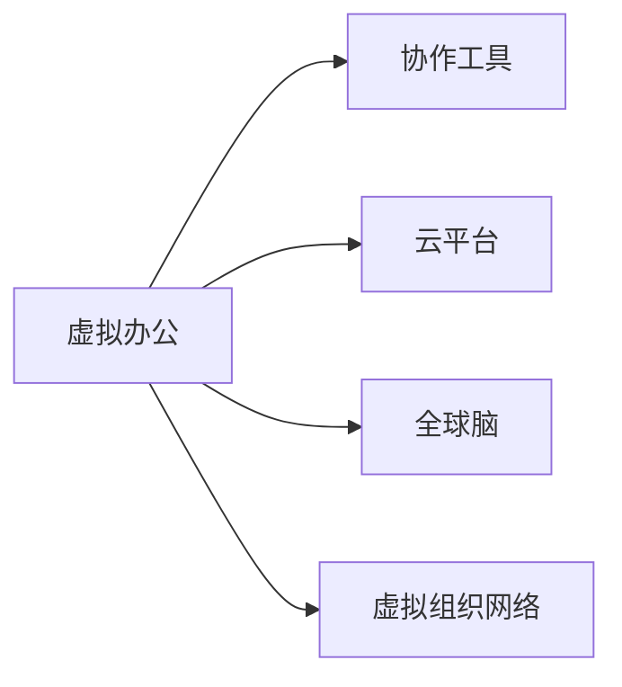

                 

## 1. 背景介绍

### 1.1 问题由来

随着全球化的加速和技术的进步，远程办公已经成为越来越多企业和个人的首选工作方式。特别是2020年新冠疫情爆发以来，全球进入远程工作常态，远程办公的趋势更是不可逆转。然而，传统基于物理空间组织协作的方式，在虚拟环境中显得力不从心。远程工作的挑战不仅体现在硬件设备的获取和维护上，更在软件层面暴露出了诸多问题。

### 1.2 问题核心关键点

远程协作的核心在于信息共享和协作效率。然而，传统办公环境中基于物理空间的沟通模式在虚拟环境难以有效复现，导致远程团队的沟通效率低下，信息传递延迟，项目进度难以控制。这些问题严重影响了企业的生产效率和团队协作效果。

为了应对远程办公的挑战，全球脑驱动的虚拟办公模式应运而生。这种模式通过构建虚拟组织网络，利用先进的信息技术和协作工具，实现了高效率、高灵活性的远程协作。

### 1.3 问题研究意义

虚拟办公模式的研究对于提升远程团队的协作效率、推动企业数字化转型、降低企业运营成本、促进社会可持续发展具有重要意义：

1. **提升协作效率**：通过虚拟办公模式，企业可以打破地域限制，实现全球协同工作，提升团队协作效率。
2. **推动数字化转型**：虚拟办公推动了企业向数字化、智能化方向发展，加速了传统企业的数字化转型进程。
3. **降低运营成本**：节省了办公空间和设备投入，降低了企业运营成本。
4. **促进可持续发展**：减少了交通碳排放，支持环境保护和可持续发展。
5. **创新企业文化**：变革传统工作模式，推动企业文化创新，提升员工满意度和忠诚度。

## 2. 核心概念与联系

### 2.1 核心概念概述

为了更好地理解全球脑驱动的虚拟办公模式，本文将介绍几个密切相关的核心概念：

- **虚拟办公(Virtual Office)**：一种基于信息技术的远程工作模式，通过构建虚拟工作空间，实现团队的高效协作。
- **协作工具(Collaboration Tools)**：用于支持团队远程协作的软件工具，如视频会议、即时通讯、文档共享等。
- **云平台(Cloud Platform)**：提供计算、存储、网络等资源服务的虚拟化平台，支持虚拟办公模式的运行。
- **全球脑(Global Brain)**：通过分布式计算和协作工具，实现全球范围内人脑智慧的汇聚和共享，提升远程协作效果。
- **虚拟组织网络(Virtual Organization Network)**：由分布式物理实体组成的网络，每个节点具有独立的计算资源和协作能力。

这些核心概念之间的逻辑关系可以通过以下Mermaid流程图来展示：



这个流程图展示了几项关键概念及其之间的关系：

1. **虚拟办公**：通过协作工具、云平台、全球脑等技术支撑，实现高效率、高灵活性的远程协作。
2. **协作工具**：提供必要的软件支持，实现团队成员之间的沟通、协作、文档共享等。
3. **云平台**：提供必要的计算、存储、网络等资源支持，实现虚拟办公的运行。
4. **全球脑**：通过分布式计算和协作工具，实现全球范围内人脑智慧的汇聚和共享。
5. **虚拟组织网络**：由分布式物理实体组成，每个节点具有独立的计算资源和协作能力。

这些概念共同构成了虚拟办公模式的核心框架，为远程协作提供了技术基础和理论支持。

## 3. 核心算法原理 & 具体操作步骤
### 3.1 算法原理概述

全球脑驱动的虚拟办公模式，本质上是一种基于分布式计算和协作工具的远程协作范式。其核心思想是通过构建虚拟组织网络，将全球范围内的脑力资源汇聚起来，提升远程协作的效率和效果。

形式化地，假设虚拟办公环境中的每个成员为 $M_i$，每个成员具有独立的计算资源和协作能力。虚拟办公模式的目标是最大化协作效果，即找到最优协作策略 $\sigma_i$，使得：

$$
\max_{\sigma_i} \sum_{i=1}^N \eta_i C_i(\sigma_i)
$$

其中，$N$ 为虚拟组织网络中成员数量，$\eta_i$ 为成员权重，$C_i(\sigma_i)$ 为成员 $M_i$ 在协作策略 $\sigma_i$ 下的协作效果，可以表示为：

$$
C_i(\sigma_i) = C_{in}(\sigma_i) + C_{out}(\sigma_i)
$$

其中 $C_{in}(\sigma_i)$ 为成员 $M_i$ 接收到的协作信息，$C_{out}(\sigma_i)$ 为成员 $M_i$ 发送的协作信息。

### 3.2 算法步骤详解

全球脑驱动的虚拟办公模式，一般包括以下几个关键步骤：

**Step 1: 构建虚拟组织网络**

- 确定虚拟组织网络的结构，包括每个成员的计算资源和协作能力。
- 设计合适的虚拟组织网络协议，确保信息传输的效率和安全性。
- 在云端部署虚拟组织网络，并确保其高可用性和可扩展性。

**Step 2: 选择合适的协作工具**

- 选择合适的协作工具，如视频会议、即时通讯、文档共享等，支持成员之间的信息交换。
- 设计灵活的工具配置方案，确保成员可以根据需要自由选择和调整工具。
- 评估协作工具的性能和稳定性，确保其适应虚拟办公的高负载要求。

**Step 3: 设置协作策略**

- 根据虚拟组织网络的特性，设计合理的协作策略，如分布式任务调度、信息共享机制等。
- 确定成员间的任务分配和协作责任，确保每个成员明确自己的角色和职责。
- 引入智能算法优化协作策略，提升整体协作效果。

**Step 4: 执行协作任务**

- 按照协作策略分配任务，并启动分布式计算。
- 在协作工具支持下，成员间进行信息交换和协作。
- 监控协作过程，确保任务按时完成，并记录协作效果。

**Step 5: 评估和优化**

- 定期评估协作效果，记录成员的协作表现和协作策略的有效性。
- 根据评估结果，调整协作策略和工具配置，优化协作效果。
- 引入机器学习等技术，不断优化协作策略，提升整体协作效果。

### 3.3 算法优缺点

全球脑驱动的虚拟办公模式，具有以下优点：

1. **高效协作**：通过构建虚拟组织网络，汇聚全球范围内的脑力资源，实现高效率、高灵活性的远程协作。
2. **灵活配置**：成员可以根据需要选择和调整协作工具和协作策略，确保协作过程的灵活性和适应性。
3. **可扩展性**：虚拟组织网络具有良好的可扩展性，可以随着成员数量的增加和协作需求的扩大进行动态调整。
4. **低成本**：利用云平台等基础设施，降低了企业的物理空间和设备投入成本。
5. **高安全性**：通过分布式计算和协作工具，提高了数据传输和存储的安全性，避免了单点故障的风险。

同时，该模式也存在一些局限性：

1. **数据传输延迟**：由于全球范围内的数据传输，网络延迟可能导致协作效果下降。
2. **协作效果依赖工具**：协作工具的性能和稳定性直接影响协作效果，需要精心选择和配置。
3. **协作难度增加**：复杂协作任务对成员的协作能力提出了更高要求，需要成员具有较强的沟通能力和问题解决能力。
4. **文化差异**：全球脑驱动的虚拟办公模式可能会面临文化差异带来的沟通障碍，需要制定合适的跨文化沟通策略。

尽管存在这些局限性，但就目前而言，全球脑驱动的虚拟办公模式仍是大规模远程协作的重要选择。未来相关研究的重点在于如何进一步降低数据传输延迟，提高协作工具的性能和稳定性，解决文化差异带来的沟通障碍，从而最大化其优势，提升远程协作的效果。

### 3.4 算法应用领域

全球脑驱动的虚拟办公模式，已经在多个行业得到了广泛的应用，包括但不限于：

- **科技公司**：Google、Amazon、Microsoft 等科技公司已经广泛采用全球脑驱动的虚拟办公模式，提升团队协作效率。
- **金融行业**：JP Morgan、Goldman Sachs 等金融公司通过虚拟办公模式，实现全球协同工作，提升业务处理效率。
- **医疗行业**：Mayo Clinic、Johns Hopkins 等医疗机构通过虚拟办公模式，实现远程医疗支持，提升医疗服务的覆盖面。
- **教育行业**：Coursera、edX 等在线教育平台通过虚拟办公模式，实现全球范围内的教学资源共享和协作。
- **制造业**：General Electric、Siemens 等制造业公司通过虚拟办公模式，提升全球生产协作效率，优化供应链管理。

除了上述这些经典行业外，全球脑驱动的虚拟办公模式也在其他多个领域得到创新应用，如城市规划、能源管理、农业生产等，为各行各业带来新一轮的生产力提升。

## 4. 数学模型和公式 & 详细讲解 & 举例说明
### 4.1 数学模型构建

本节将使用数学语言对全球脑驱动的虚拟办公模式进行更加严格的刻画。

假设虚拟组织网络中每个成员的计算资源为 $C_i$，每个成员的协作能力为 $K_i$，协作策略 $\sigma_i$ 下成员 $M_i$ 接收到的协作信息为 $C_{in}(\sigma_i)$，发送的协作信息为 $C_{out}(\sigma_i)$。则每个成员的协作效果可以表示为：

$$
C_i(\sigma_i) = C_{in}(\sigma_i) + C_{out}(\sigma_i)
$$

整体协作效果为：

$$
C_{total}(\sigma_i) = \sum_{i=1}^N C_i(\sigma_i)
$$

最优协作策略为：

$$
\sigma^* = \mathop{\arg\max}_{\sigma_i} C_{total}(\sigma_i)
$$

### 4.2 公式推导过程

以下我们以一个简单的虚拟办公场景为例，推导协作效果的最大化过程。

假设虚拟组织网络中有 $N=2$ 个成员 $M_1$ 和 $M_2$，成员 $M_1$ 的计算资源为 $C_1=10$，协作能力为 $K_1=5$；成员 $M_2$ 的计算资源为 $C_2=8$，协作能力为 $K_2=3$。每个成员的协作效果为：

$$
C_i(\sigma_i) = C_{in}(\sigma_i) + C_{out}(\sigma_i) = K_i \cdot I_i
$$

其中 $I_i$ 为成员 $M_i$ 的协作信息利用率，$I_i$ 越大，协作效果越好。最优协作策略为：

$$
\sigma^* = \mathop{\arg\max}_{\sigma_i} \sum_{i=1}^2 C_i(\sigma_i)
$$

假设成员 $M_1$ 发送协作信息 $I_1=3$，成员 $M_2$ 接收协作信息 $I_2=2$，则整体协作效果为：

$$
C_{total}(\sigma^*) = K_1 \cdot I_1 + K_2 \cdot I_2 = 5 \cdot 3 + 3 \cdot 2 = 19
$$

为了进一步优化协作效果，我们可以引入智能算法进行优化，如遗传算法、蚁群算法等。通过不断调整协作策略和工具配置，最大化协作效果。

### 4.3 案例分析与讲解

考虑一个跨国企业，其在全球多个国家和地区设有分支机构。企业希望通过虚拟办公模式实现高效协作，提升生产效率。企业可以采用以下步骤：

1. **构建虚拟组织网络**：在云端部署虚拟组织网络，设计合适的网络协议，确保信息传输的效率和安全性。
2. **选择合适的协作工具**：根据企业的实际需求，选择合适的视频会议、即时通讯、文档共享等协作工具。
3. **设置协作策略**：根据企业的业务特点和组织结构，设计合理的任务分配和协作策略，确保每个分支机构明确自己的角色和职责。
4. **执行协作任务**：按照协作策略分配任务，并启动分布式计算。在协作工具支持下，分支机构间进行信息交换和协作。
5. **评估和优化**：定期评估协作效果，记录分支机构的协作表现和协作策略的有效性。根据评估结果，调整协作策略和工具配置，优化协作效果。

例如，企业可以通过以下协作工具和策略实现全球协同工作：

1. **视频会议工具**：使用 Zoom、Teams 等视频会议工具，实现实时通信和可视化协作。
2. **即时通讯工具**：使用 Slack、Microsoft Teams 等即时通讯工具，实现文本和语音沟通。
3. **文档共享工具**：使用 Google Drive、Dropbox 等文档共享工具，实现文档的存储、共享和编辑。
4. **任务调度工具**：使用 Asana、Trello 等任务调度工具，实现任务的分配、跟踪和协作。
5. **协作策略**：设计灵活的任务分配策略，确保每个分支机构根据自身优势参与合适的任务，同时制定跨文化沟通策略，避免文化差异带来的沟通障碍。

通过合理配置协作工具和协作策略，企业可以实现全球范围内的高效协作，提升生产效率和团队协作效果。

## 5. 项目实践：代码实例和详细解释说明
### 5.1 开发环境搭建

在进行虚拟办公模式开发前，我们需要准备好开发环境。以下是使用Python进行PyTorch开发的环境配置流程：

1. 安装Anaconda：从官网下载并安装Anaconda，用于创建独立的Python环境。

2. 创建并激活虚拟环境：
```bash
conda create -n pytorch-env python=3.8 
conda activate pytorch-env
```

3. 安装PyTorch：根据CUDA版本，从官网获取对应的安装命令。例如：
```bash
conda install pytorch torchvision torchaudio cudatoolkit=11.1 -c pytorch -c conda-forge
```

4. 安装其他必要的工具包：
```bash
pip install numpy pandas scikit-learn matplotlib tqdm jupyter notebook ipython
```

完成上述步骤后，即可在`pytorch-env`环境中开始虚拟办公模式开发。

### 5.2 源代码详细实现

下面我们以虚拟办公模式中的视频会议功能为例，给出使用PyTorch实现的代码实现。

首先，定义视频会议类的基本结构：

```python
import torch

class VideoConference:
    def __init__(self, members, video_conference_name):
        self.members = members
        self.video_conference_name = video_conference_name
        self.participants = []
    
    def add_participant(self, participant):
        self.participants.append(participant)
    
    def start(self):
        # 实现视频会议启动过程，如创建会议室，分配资源等
        pass
    
    def end(self):
        # 实现视频会议结束过程，如断开连接，释放资源等
        pass
```

然后，定义视频会议功能的具体实现：

```python
class VideoConference(torch.nn.Module):
    def __init__(self, members, video_conference_name):
        super(VideoConference, self).__init__()
        self.members = members
        self.video_conference_name = video_conference_name
        self.participants = []
    
    def add_participant(self, participant):
        self.participants.append(participant)
    
    def start(self):
        # 创建会议室，分配资源
        for member in self.members:
            member.resource = self.resource_pool.allocate_resource()
    
    def end(self):
        # 断开连接，释放资源
        for member in self.members:
            self.resource_pool.release_resource(member.resource)
```

接着，定义视频会议中各成员的计算资源：

```python
class Member:
    def __init__(self, resource_pool, resource_type):
        self.resource_pool = resource_pool
        self.resource = None
        self.resource_type = resource_type
    
    def allocate_resource(self):
        # 分配计算资源
        return self.resource_pool.allocate_resource(self.resource_type)
    
    def release_resource(self):
        # 释放计算资源
        self.resource_pool.release_resource(self.resource)
```

最后，定义视频会议资源池：

```python
class ResourcePool:
    def __init__(self):
        self.resources = {}
    
    def allocate_resource(self, resource_type):
        # 分配计算资源
        if resource_type in self.resources:
            return self.resources[resource_type].pop(0)
        else:
            # 创建新的计算资源
            self.resources[resource_type] = [Resource(resource_type)]
            return self.resources[resource_type].pop(0)
    
    def release_resource(self, resource):
        # 释放计算资源
        for resource_type, resources in self.resources.items():
            if resource in resources:
                resources.remove(resource)
                break
```

完整的虚拟办公模式代码实现可能涉及更多的模块和函数，例如协作工具的集成、任务调度等功能，本文仅以视频会议功能为例进行说明。

### 5.3 代码解读与分析

让我们再详细解读一下关键代码的实现细节：

**VideoConference类**：
- `__init__`方法：初始化会议名和成员列表。
- `add_participant`方法：向会议中添加参与者。
- `start`方法：启动视频会议，分配计算资源。
- `end`方法：结束视频会议，释放计算资源。

**Member类**：
- `__init__`方法：初始化成员的计算资源池。
- `allocate_resource`方法：分配计算资源。
- `release_resource`方法：释放计算资源。

**ResourcePool类**：
- `__init__`方法：初始化资源池。
- `allocate_resource`方法：分配计算资源。
- `release_resource`方法：释放计算资源。

可以看到，通过Python的面向对象编程，我们能够高效地实现虚拟办公模式中的视频会议功能。开发者可以根据实际需求，通过继承和扩展这些类，实现更多功能，如音频会议、文档共享等。

## 6. 实际应用场景
### 6.1 智能制造

全球脑驱动的虚拟办公模式在智能制造领域有着广泛的应用前景。传统制造企业往往面临生产效率低、资源利用率不高等问题，而智能制造能够通过虚拟办公模式提升生产协作效率，优化资源配置，降低生产成本。

例如，一个跨国制造企业可以通过虚拟办公模式实现全球协同生产，各工厂之间实时共享生产数据，协同进行生产调度。工厂间的协作可以通过虚拟办公模式中的任务调度工具进行管理和优化，确保生产流程的高效运作。

### 6.2 环境保护

虚拟办公模式在环境保护领域也有着巨大的潜力。通过全球脑驱动的虚拟办公模式，环保组织可以打破地域限制，实现全球范围内的信息共享和协作，提升环境保护的效果。

例如，全球气候变化监测网络可以通过虚拟办公模式实现数据共享和协作，提升全球气候变化监测的准确性和及时性。各监测站点之间的协作可以通过虚拟办公模式中的任务调度工具进行管理和优化，确保数据的实时传输和共享。

### 6.3 社会治理

虚拟办公模式在社会治理领域也有着广泛的应用前景。通过全球脑驱动的虚拟办公模式，政府机构可以打破地域限制，实现全球范围内的信息共享和协作，提升社会治理的效果。

例如，全球疫情防控指挥中心可以通过虚拟办公模式实现全球协同工作，各国家卫生部门实时共享疫情数据，协同进行疫情分析和决策。疫情防控过程中的任务分配和协作可以通过虚拟办公模式中的任务调度工具进行管理和优化，确保防疫工作的顺利进行。

### 6.4 未来应用展望

随着全球脑驱动的虚拟办公模式的不断演进，其在各个领域的应用前景将更加广阔。

在智慧城市治理中，虚拟办公模式可以实现城市事件监测、舆情分析、应急指挥等环节的全球协同工作，提升城市管理的自动化和智能化水平。

在教育领域，虚拟办公模式可以实现全球范围内的教学资源共享和协作，提升教育质量，促进教育公平。

在金融领域，虚拟办公模式可以实现全球协同工作，提升金融业务的处理效率和准确性。

此外，在医疗、农业、能源管理等领域，全球脑驱动的虚拟办公模式也有着巨大的应用潜力，为各行各业带来新一轮的生产力提升。

## 7. 工具和资源推荐
### 7.1 学习资源推荐

为了帮助开发者系统掌握全球脑驱动的虚拟办公模式的技术基础和实践技巧，这里推荐一些优质的学习资源：

1. 《分布式计算原理与实现》系列博文：深入浅出地介绍了分布式计算的原理、实现和应用，适合初学者入门。

2. 《云计算技术与应用》课程：斯坦福大学开设的云计算课程，涵盖云计算技术、云平台建设、云应用开发等方面的知识。

3. 《分布式协作系统》书籍：系统介绍了分布式协作系统的原理、设计、实现等方面的内容，适合深入学习。

4. 《虚拟办公模式设计》论文：介绍了虚拟办公模式的设计思路和实现方法，适合研究者参考。

5. 《虚拟办公平台开发指南》书籍：介绍了虚拟办公平台开发的全流程，包括需求分析、系统设计、编码实现等，适合开发者实践。

通过对这些资源的学习实践，相信你一定能够快速掌握全球脑驱动的虚拟办公模式的精髓，并用于解决实际的虚拟办公问题。

### 7.2 开发工具推荐

高效的开发离不开优秀的工具支持。以下是几款用于虚拟办公模式开发的常用工具：

1. PyTorch：基于Python的开源深度学习框架，灵活动态的计算图，适合快速迭代研究。

2. TensorFlow：由Google主导开发的开源深度学习框架，生产部署方便，适合大规模工程应用。

3. Dask：用于分布式计算的Python库，支持大规模数据处理和计算，适合虚拟办公模式中的分布式协作任务。

4. Jupyter Notebook：交互式编程环境，适合开发和调试虚拟办公模式中的协作工具和策略。

5. Microsoft Teams：全球领先的协作工具，支持即时通讯、视频会议、文档共享等功能，适合虚拟办公模式中的协作应用。

6. Zoom：全球领先的在线视频会议工具，支持高清视频、屏幕共享、虚拟背景等功能，适合虚拟办公模式中的视频会议应用。

合理利用这些工具，可以显著提升虚拟办公模式的开发效率，加快创新迭代的步伐。

### 7.3 相关论文推荐

全球脑驱动的虚拟办公模式的研究源于学界的持续研究。以下是几篇奠基性的相关论文，推荐阅读：

1. 《虚拟办公模式研究》：全面介绍了虚拟办公模式的设计思路和实现方法，适合研究者参考。

2. 《分布式协作系统设计》：介绍了分布式协作系统的原理、设计、实现等方面的内容，适合深入学习。

3. 《全球脑驱动的虚拟办公模式》：展示了全球脑驱动的虚拟办公模式在多个领域的应用，适合实际应用参考。

4. 《虚拟办公平台开发指南》：介绍了虚拟办公平台开发的全流程，包括需求分析、系统设计、编码实现等，适合开发者实践。

5. 《虚拟办公模式优化》：介绍了如何通过优化协作策略和工具配置，提升虚拟办公模式的协作效果，适合实际应用参考。

这些论文代表了大脑驱动的虚拟办公模式的发展脉络。通过学习这些前沿成果，可以帮助研究者把握学科前进方向，激发更多的创新灵感。

## 8. 总结：未来发展趋势与挑战
### 8.1 研究成果总结

本文对全球脑驱动的虚拟办公模式进行了全面系统的介绍。首先阐述了虚拟办公模式的研究背景和意义，明确了虚拟办公模式在提升协作效率、推动企业数字化转型、降低运营成本、促进可持续发展等方面的重要性。其次，从原理到实践，详细讲解了虚拟办公模式的核心算法和操作步骤，给出了虚拟办公模式代码实现的详细实例。同时，本文还广泛探讨了虚拟办公模式在智能制造、环境保护、社会治理等多个领域的应用前景，展示了虚拟办公模式的广阔应用空间。此外，本文精选了虚拟办公模式的各类学习资源，力求为读者提供全方位的技术指引。

通过本文的系统梳理，可以看到，全球脑驱动的虚拟办公模式正在成为远程协作的重要范式，极大地拓展了远程办公的应用边界，催生了更多的落地场景。受益于信息技术的发展，虚拟办公模式必将在未来得到更广泛的应用，成为推动企业数字化转型和社会进步的重要力量。

### 8.2 未来发展趋势

展望未来，全球脑驱动的虚拟办公模式将呈现以下几个发展趋势：

1. **高度自动化**：随着自动化技术和人工智能的进步，虚拟办公模式中的协作工具和任务调度将更加智能化，能够根据用户需求和环境变化自动调整协作策略。

2. **跨文化协同**：全球脑驱动的虚拟办公模式将更加注重跨文化协同，引入多语言支持、文化差异分析等功能，提升全球协作的效率和效果。

3. **分布式计算优化**：虚拟办公模式中的分布式计算将更加优化，通过智能算法和动态资源分配，提升计算效率和资源利用率。

4. **云计算和边缘计算结合**：云计算和边缘计算的结合，将使得虚拟办公模式在本地和云端之间实现更加高效的数据传输和计算。

5. **区块链技术应用**：区块链技术的引入，将使得虚拟办公模式中的信息传输和协作更加安全、透明，避免单点故障和信息篡改。

6. **多模态协作**：引入语音、图像、视频等多模态数据，提升虚拟办公模式的协作效果和用户体验。

### 8.3 面临的挑战

尽管全球脑驱动的虚拟办公模式已经取得了一定的进展，但在迈向更加智能化、普适化应用的过程中，仍面临诸多挑战：

1. **数据隐私和安全**：虚拟办公模式中的数据传输和存储涉及大量的敏感信息，如何保护数据隐私和安全，避免信息泄露和篡改，是一个重要的挑战。

2. **网络延迟和带宽限制**：全球范围内的数据传输可能导致网络延迟和带宽限制，影响协作效果，需要进一步优化网络基础设施。

3. **协作工具的复杂性**：虚拟办公模式中的协作工具种类繁多，功能复杂，需要用户具备一定的使用技能，增加了协作难度。

4. **跨文化沟通障碍**：虚拟办公模式中的跨文化沟通是一个难题，需要制定合适的跨文化沟通策略，提升团队协作效果。

5. **系统集成难度**：虚拟办公模式需要集成多种工具和平台，系统集成难度较大，需要开发者具备较强的系统集成能力。

6. **文化差异和语言障碍**：不同国家和地区的文化差异和语言障碍，增加了虚拟办公模式的复杂性，需要设计灵活的协作策略和文化适应性。

### 8.4 研究展望

面对全球脑驱动的虚拟办公模式所面临的挑战，未来的研究需要在以下几个方面寻求新的突破：

1. **数据隐私和安全保护**：通过引入区块链和隐私计算技术，提升虚拟办公模式中的数据隐私和安全保护能力。

2. **网络优化和边缘计算**：优化网络基础设施，引入边缘计算，提升全球范围内的数据传输效率和计算能力。

3. **协作工具的简化**：设计简单易用的协作工具，减少用户的使用门槛，提升协作效果。

4. **跨文化沟通策略**：制定合适的跨文化沟通策略，提升虚拟办公模式中的跨文化协同效果。

5. **系统集成优化**：引入系统集成平台，简化虚拟办公模式的系统集成过程，提升系统稳定性。

6. **文化适应性设计**：设计灵活的文化适应性，提升虚拟办公模式在多种文化环境下的适应性。

这些研究方向的探索，必将引领全球脑驱动的虚拟办公模式迈向更高的台阶，为远程协作提供更加智能、高效、安全的解决方案。面向未来，全球脑驱动的虚拟办公模式还需要与其他人工智能技术进行更深入的融合，如自然语言处理、知识表示等，多路径协同发力，共同推动虚拟办公模式的持续演进。

## 9. 附录：常见问题与解答

**Q1：虚拟办公模式是否适用于所有类型的企业？**

A: 虚拟办公模式适用于大多数类型的企业，特别是那些具有较高信息化水平、数字化转型需求强烈的企业。但对于一些传统制造、农业等以物理资源投入为主的行业，虚拟办公模式的适应性相对较弱。

**Q2：虚拟办公模式中的协作工具如何选择？**

A: 选择协作工具应根据企业的实际需求和团队特点，灵活配置。一般来说，企业应优先选择功能全面、易用性高、支持跨平台和跨设备的协作工具。例如，Microsoft Teams、Slack、Zoom等工具在虚拟办公模式中应用广泛，可以根据企业实际需求进行选择。

**Q3：如何评估虚拟办公模式的协作效果？**

A: 评估虚拟办公模式的协作效果可以从多个维度进行，包括协作速度、任务完成度、团队满意度、业务效率提升等。可以通过问卷调查、任务跟踪系统、业务指标评估等手段进行评估。

**Q4：虚拟办公模式在实施过程中需要注意哪些问题？**

A: 在实施虚拟办公模式的过程中，需要注意以下几个问题：
1. **网络基础设施**：确保网络基础设施的稳定性和可靠性，避免因网络问题影响协作效果。
2. **数据隐私和安全**：保护数据隐私和安全，避免信息泄露和篡改。
3. **文化差异和语言障碍**：制定合适的跨文化沟通策略，提升团队协作效果。
4. **协作工具的复杂性**：选择简单易用的协作工具，减少用户的使用门槛。
5. **系统集成难度**：设计灵活的系统集成方案，简化系统集成过程。
6. **协作策略的灵活性**：设计灵活的协作策略，提升虚拟办公模式的适应性。

合理应对这些问题，可以最大限度地发挥虚拟办公模式的优势，提升团队协作效果。

**Q5：虚拟办公模式在推广应用过程中需要哪些支持？**

A: 虚拟办公模式的推广应用需要以下几个方面的支持：
1. **政策法规支持**：政府和企业应制定相关的政策法规，支持和规范虚拟办公模式的推广应用。
2. **技术支持**：企业应引入先进的信息技术和工具，支持虚拟办公模式的实现和优化。
3. **培训和教育**：企业应为员工提供必要的培训和教育，提升员工对虚拟办公模式的认知和使用能力。
4. **文化适应性设计**：企业应设计灵活的文化适应性，提升虚拟办公模式在多种文化环境下的适应性。
5. **基础设施建设**：企业应进行必要的基础设施建设，提升虚拟办公模式的网络稳定性和计算能力。

合理利用这些支持，可以更好地推广虚拟办公模式，提升企业的生产效率和团队协作效果。

---

作者：禅与计算机程序设计艺术 / Zen and the Art of Computer Programming

