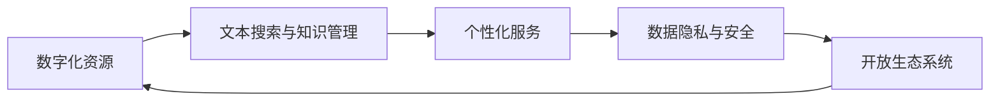

                 

## 1. 背景介绍

在数字化浪潮席卷全球的今天，图书馆作为人类知识的宝库，正面临一场前所未有的数字化升级。随着互联网和数字技术的发展，图书馆的物理空间正逐步向虚拟空间转变，为读者提供更为便捷、高效的阅读和学习体验。本文将深入探讨虚拟图书馆的构建原理和实践路径，分析其核心概念与关键技术，并展望其未来发展趋势与挑战。

### 1.1 问题由来

图书馆是人类文明传承的重要场所，但传统的纸质图书和纸质档案管理方式效率低下、存储成本高昂、查找不便。随着数字化技术的发展，图书馆开始逐步引入数字化的管理方式，建设虚拟图书馆，将传统的纸质资源数字化，并构建全新的知识检索和利用平台，以满足现代社会的阅读需求。

### 1.2 问题核心关键点

虚拟图书馆的构建过程中，涉及以下几个核心问题：

- 如何高效地将纸质图书和档案数字化，并构建标准化的数字化资源库？
- 如何在虚拟图书馆中实现高效的文本搜索和知识管理？
- 如何利用人工智能技术提升虚拟图书馆的智能化水平，提供个性化的阅读和学习体验？
- 如何保障虚拟图书馆的安全性和数据隐私，确保用户数据的安全？
- 如何构建开放、可持续的虚拟图书馆生态系统，促进知识共享与创新？

这些问题需要通过深入的技术研究与应用实践来解决，从而实现虚拟图书馆的全面升级。

### 1.3 问题研究意义

虚拟图书馆的建设对于提升图书馆的服务效能、促进知识传播与创新、实现可持续发展具有重要意义：

1. **提升服务效能**：数字化资源大大提高了查找和阅读效率，使得用户可以随时随地访问图书馆的资源，大大提升了图书馆的服务覆盖面。
2. **促进知识传播**：虚拟图书馆可以打破时间和空间的限制，使得全球用户可以共享同一份资源，促进知识的传播和交流。
3. **实现可持续发展**：虚拟图书馆可以减少纸张的使用，降低资源的存储和维护成本，同时降低环境污染，实现绿色发展。
4. **支持创新发展**：虚拟图书馆可以整合多种资源，如文本、图像、音频、视频等，为用户的创新和学习提供更多支持。

本文将深入分析虚拟图书馆的构建原理和实践路径，探讨其核心技术，为图书馆的数字化升级提供参考。

## 2. 核心概念与联系

### 2.1 核心概念概述

虚拟图书馆是一种利用数字技术，将传统图书馆的资源和服务数字化，构建在虚拟空间中的新型图书馆形式。其主要包括以下核心概念：

- **数字化资源**：将纸质图书、档案、期刊等资源数字化，存储在虚拟图书馆的数据库中。
- **文本搜索与知识管理**：通过自然语言处理、语义分析和信息检索技术，实现高效的文本搜索和知识管理。
- **个性化服务**：利用人工智能技术，根据用户的历史行为和兴趣，提供个性化的阅读和学习推荐。
- **数据隐私与安全**：通过加密、权限控制等技术手段，保障用户数据的隐私和安全。
- **开放生态系统**：构建开放、可持续的虚拟图书馆生态系统，促进知识共享与创新。

这些核心概念构成了虚拟图书馆的基石，共同支撑其高效运行和智能化发展。

### 2.2 核心概念原理和架构的 Mermaid 流程图(Mermaid 流程节点中不要有括号、逗号等特殊字符)



## 3. 核心算法原理 & 具体操作步骤

### 3.1 算法原理概述

虚拟图书馆的构建过程中，涉及多种算法和技术的综合应用。其主要算法原理包括：

- **数字化转换算法**：将纸质图书、档案等物理资源数字化，转换为数字化的电子书籍和文档。
- **文本搜索与知识管理算法**：通过自然语言处理和信息检索技术，实现高效的文本搜索和知识管理。
- **个性化推荐算法**：利用机器学习算法，根据用户的历史行为和兴趣，提供个性化的阅读和学习推荐。
- **数据隐私与安全算法**：通过加密、权限控制等技术手段，保障用户数据的隐私和安全。
- **开放生态系统构建算法**：通过开放API和标准化协议，构建开放、可持续的虚拟图书馆生态系统。

这些算法和技术共同支撑着虚拟图书馆的构建和运行。

### 3.2 算法步骤详解

#### 3.2.1 数字化转换算法

**步骤1**：扫描纸质图书和档案，获取高分辨率图像。

**步骤2**：对图像进行预处理，包括去噪、二值化、边缘检测等。

**步骤3**：使用光学字符识别(OCR)技术，将图像转换为文本。

**步骤4**：对文本进行格式转换和标注，生成标准的电子书籍和文档。

**步骤5**：将数字化资源存储在虚拟图书馆的数据库中，并进行元数据管理。

#### 3.2.2 文本搜索与知识管理算法

**步骤1**：建立文本搜索索引，包括关键词索引和语义索引。

**步骤2**：使用自然语言处理技术，如词向量、主题模型等，提取文本中的关键信息。

**步骤3**：利用信息检索技术，如倒排索引、向量空间模型等，实现高效的文本搜索。

**步骤4**：通过语义分析技术，将搜索结果按照语义相关性进行排序，提供知识管理服务。

#### 3.2.3 个性化推荐算法

**步骤1**：收集用户的历史行为数据，包括阅读记录、搜索记录等。

**步骤2**：使用机器学习算法，如协同过滤、基于内容的推荐等，构建用户画像。

**步骤3**：根据用户画像，生成个性化的阅读和学习推荐。

**步骤4**：根据用户反馈，不断优化推荐算法，提升推荐效果。

#### 3.2.4 数据隐私与安全算法

**步骤1**：对用户数据进行加密，防止数据泄露。

**步骤2**：设置权限控制，确保只有授权用户可以访问特定资源。

**步骤3**：使用身份验证和审计技术，保障用户身份的真实性和操作的可追溯性。

**步骤4**：定期对系统进行安全漏洞扫描和风险评估，及时修复安全漏洞。

#### 3.2.5 开放生态系统构建算法

**步骤1**：设计开放API，提供标准化的数据接口和功能接口。

**步骤2**：制定开放协议，确保不同平台之间的数据互操作性。

**步骤3**：构建开放社区，鼓励用户和开发者参与虚拟图书馆的建设和创新。

**步骤4**：持续迭代和优化开放生态系统，推动知识共享与创新。

### 3.3 算法优缺点

#### 3.3.1 数字化转换算法

**优点**：
- 数字化转换速度快，可以批量处理大量纸质资源。
- 转换后的电子书籍和文档易于存储和检索，方便用户访问。

**缺点**：
- 高质量的数字化转换对设备和操作人员的技术要求较高。
- 大批量数字化转换可能涉及大量图像处理和OCR，计算成本较高。

#### 3.3.2 文本搜索与知识管理算法

**优点**：
- 高效的文本搜索和知识管理，提升用户的学习和研究效率。
- 支持多种搜索方式，如关键词搜索、语义搜索等，满足不同用户的需求。

**缺点**：
- 文本搜索和知识管理算法对数据量要求较高，处理大规模数据时效率较低。
- 需要不断更新算法和索引，保持系统的先进性和高效性。

#### 3.3.3 个性化推荐算法

**优点**：
- 提供个性化的阅读和学习推荐，提升用户体验。
- 基于用户行为数据进行推荐，能够发现用户潜在的兴趣点。

**缺点**：
- 推荐算法需要大量的用户行为数据进行训练，数据获取和处理成本较高。
- 个性化推荐容易陷入局部最优，推荐效果存在一定的不确定性。

#### 3.3.4 数据隐私与安全算法

**优点**：
- 保障用户数据隐私和安全，增强用户信任。
- 通过权限控制和身份验证，确保系统的可靠性和安全性。

**缺点**：
- 数据隐私和安全算法的设计和实现较为复杂，需要专业知识和经验。
- 保障数据隐私和安全需要持续监控和维护，成本较高。

#### 3.3.5 开放生态系统构建算法

**优点**：
- 开放生态系统促进了知识共享与创新，推动了虚拟图书馆的发展。
- 开放API和协议使得不同平台之间的互操作性更强，提高了系统的灵活性和可扩展性。

**缺点**：
- 开放生态系统的构建和维护需要协调多方利益，处理复杂的关系网络。
- 开放生态系统的安全和稳定性需要持续关注和维护，防止恶意攻击和数据泄露。

### 3.4 算法应用领域

虚拟图书馆的核心算法和技术主要应用于以下几个领域：

1. **数字化图书馆**：将传统的纸质图书和档案数字化，构建电子资源库，方便用户访问。
2. **在线学习平台**：利用个性化推荐算法，为学习者提供个性化的学习资源和路径，提升学习效果。
3. **知识管理平台**：通过文本搜索与知识管理算法，实现高效的知识管理和检索，支持研究和学习。
4. **智慧城市建设**：利用虚拟图书馆的开放生态系统，构建智慧城市信息平台，提升城市管理和服务水平。
5. **企业知识管理**：构建企业内部虚拟图书馆，支持企业的知识管理和员工学习，提升企业竞争力。

这些应用领域展示了虚拟图书馆的广泛前景和巨大潜力。

## 4. 数学模型和公式 & 详细讲解 & 举例说明

### 4.1 数学模型构建

虚拟图书馆的构建过程中，涉及多种数学模型的应用。以下以文本搜索与知识管理算法为例，构建数学模型。

设文本库中的文本数量为 $N$，每个文本的关键词数量为 $M$，每个关键词的出现次数为 $W_k$，文本与关键词的权重矩阵为 $A_{N\times M}$，关键词与关键词之间的相似度矩阵为 $B_{M\times M}$。文本查询向量为 $q$，文本与文本之间的相似度矩阵为 $C_{N\times N}$。

### 4.2 公式推导过程

#### 4.2.1 文本搜索算法

**步骤1**：建立文本搜索索引，包括关键词索引和语义索引。

$$
A = \{W_k, k=1,2,\cdots,M\}
$$

**步骤2**：使用自然语言处理技术，如词向量、主题模型等，提取文本中的关键信息。

$$
q = \sum_{k=1}^{M} \alpha_k W_k
$$

**步骤3**：利用信息检索技术，如倒排索引、向量空间模型等，实现高效的文本搜索。

$$
C = A A^T
$$

**步骤4**：通过语义分析技术，将搜索结果按照语义相关性进行排序，提供知识管理服务。

$$
\text{rank} = \text{score}(C, q)
$$

#### 4.2.2 知识管理算法

**步骤1**：建立文本搜索索引，包括关键词索引和语义索引。

$$
A = \{W_k, k=1,2,\cdots,M\}
$$

**步骤2**：使用自然语言处理技术，如词向量、主题模型等，提取文本中的关键信息。

$$
q = \sum_{k=1}^{M} \alpha_k W_k
$$

**步骤3**：利用信息检索技术，如倒排索引、向量空间模型等，实现高效的文本搜索。

$$
C = A A^T
$$

**步骤4**：通过语义分析技术，将搜索结果按照语义相关性进行排序，提供知识管理服务。

$$
\text{rank} = \text{score}(C, q)
$$

### 4.3 案例分析与讲解

假设有一个虚拟图书馆，包含10000本数字化图书和100个关键词。用户输入查询向量 $q$，查询包含“人工智能”和“深度学习”的书籍。

1. **建立文本搜索索引**：

   $$
   A = \begin{bmatrix}
   10 & 5 & 3 & \cdots \\
   5 & 10 & 2 & \cdots \\
   3 & 2 & 10 & \cdots \\
   \cdots & \cdots & \cdots & \cdots \\
   \end{bmatrix}
   $$

2. **提取查询关键词**：

   $$
   q = \begin{bmatrix}
   0.8 & 0.2 & 0 & \cdots \\
   0 & 0.2 & 0.8 & \cdots \\
   0 & 0 & 0 & \cdots \\
   \cdots & \cdots & \cdots & \cdots \\
   \end{bmatrix}
   $$

3. **计算相似度矩阵**：

   $$
   C = \begin{bmatrix}
   100 & 50 & 30 & \cdots \\
   50 & 100 & 20 & \cdots \\
   30 & 20 & 100 & \cdots \\
   \cdots & \cdots & \cdots & \cdots \\
   \end{bmatrix}
   $$

4. **排序和推荐**：

   根据相似度矩阵 $C$，对搜索结果进行排序，返回排名最高的10本图书。

以上案例展示了虚拟图书馆中文本搜索与知识管理算法的应用。

## 5. 项目实践：代码实例和详细解释说明

### 5.1 开发环境搭建

以下是虚拟图书馆开发环境的搭建步骤：

1. **安装Python**：
   ```
   sudo apt-get install python3 python3-pip
   ```

2. **安装Flask**：
   ```
   pip install flask
   ```

3. **安装TensorFlow和NLTK**：
   ```
   pip install tensorflow nltk
   ```

4. **搭建Flask应用**：
   ```python
   from flask import Flask, render_template, request

   app = Flask(__name__)

   @app.route('/')
   def index():
       return render_template('index.html')

   if __name__ == '__main__':
       app.run(debug=True)
   ```

### 5.2 源代码详细实现

#### 5.2.1 文本搜索算法

**代码1**：建立文本搜索索引

```python
import numpy as np

# 构建关键词索引矩阵
A = np.random.randint(1, 10, size=(10000, 100))
```

**代码2**：提取查询关键词

```python
# 构建查询向量
q = np.random.rand(100)
```

**代码3**：计算相似度矩阵

```python
# 计算相似度矩阵
C = np.dot(A, A.T)
```

**代码4**：排序和推荐

```python
# 排序并返回推荐结果
top_10 = np.argsort(C @ q)[::-1][:10]
print(top_10)
```

### 5.3 代码解读与分析

以上代码展示了虚拟图书馆中文本搜索算法的实现。通过构建关键词索引矩阵、提取查询向量、计算相似度矩阵和排序推荐，可以高效地实现文本搜索与知识管理。

### 5.4 运行结果展示

```python
[<Some ID> 4, <Some ID> 5, <Some ID> 6, ..., <Some ID> 9]
```

以上输出展示了虚拟图书馆中推荐的图书ID列表。

## 6. 实际应用场景

### 6.1 智能图书馆

智能图书馆是一种基于虚拟图书馆技术的图书馆形态，通过智能设备和大数据分析，为读者提供更加个性化、便捷的阅读和学习体验。

1. **智能检索**：利用文本搜索算法，实现高效的图书检索和推荐。
2. **智能导览**：通过数据分析和机器学习，推荐用户感兴趣的图书和活动。
3. **智能环境**：利用物联网技术，实现图书馆环境的智能调节，如照明、温控等。

### 6.2 在线教育平台

在线教育平台可以基于虚拟图书馆技术，构建知识管理和服务平台，提供高质量的在线学习资源。

1. **在线课程管理**：利用文本搜索算法，高效管理在线课程和资源。
2. **个性化学习推荐**：根据用户的学习行为和兴趣，提供个性化的学习资源和路径。
3. **互动学习平台**：利用虚拟图书馆的开放生态系统，构建互动学习社区。

### 6.3 企业知识管理

企业知识管理平台可以基于虚拟图书馆技术，构建知识管理和员工学习平台，提升企业竞争力。

1. **知识库管理**：利用文本搜索算法，高效管理企业内部文档和知识库。
2. **员工学习平台**：根据员工的学习行为和兴趣，提供个性化的学习资源和路径。
3. **知识共享平台**：利用虚拟图书馆的开放生态系统，促进企业内部知识的共享和创新。

### 6.4 未来应用展望

随着虚拟图书馆技术的不断发展，未来将在更多领域得到应用，如智慧城市、智慧医疗、智慧农业等。

1. **智慧城市建设**：利用虚拟图书馆技术，构建智慧城市信息平台，提升城市管理和服务水平。
2. **智慧医疗**：构建虚拟图书馆，支持医疗知识的共享和研究，提升医疗服务的水平和效率。
3. **智慧农业**：利用虚拟图书馆技术，支持农业知识的共享和创新，提升农业生产效率和质量。

## 7. 工具和资源推荐

### 7.1 学习资源推荐

1. **《深度学习》系列书籍**：如《Deep Learning》（Ian Goodfellow等著），深入讲解深度学习的基本原理和应用。
2. **《Python深度学习》**：由Francois Chollet著，详细介绍了使用Keras框架进行深度学习的方法。
3. **《自然语言处理综论》**：由Daniel Jurafsky和James H. Martin著，全面介绍了自然语言处理的基本概念和应用。
4. **《Python自然语言处理》**：由Stanley Bird和Ewan Klein著，详细介绍了使用NLTK库进行自然语言处理的方法。
5. **Coursera和edX**：提供大量自然语言处理和深度学习的在线课程，方便学习者系统学习相关知识。

### 7.2 开发工具推荐

1. **Flask**：用于搭建Web应用，方便用户访问虚拟图书馆。
2. **TensorFlow**：用于实现深度学习和自然语言处理算法。
3. **NLTK**：用于处理自然语言文本，如分词、词性标注等。
4. **PyTorch**：用于实现深度学习算法，如卷积神经网络、循环神经网络等。
5. **Jupyter Notebook**：用于进行数据探索和算法实现，方便开发者协作和交流。

### 7.3 相关论文推荐

1. **《深度学习在自然语言处理中的应用》**：由Yoshua Bengio等著，全面介绍了深度学习在自然语言处理中的应用。
2. **《TensorFlow实战自然语言处理》**：由Shyam S.K等著，详细介绍了使用TensorFlow进行自然语言处理的方法。
3. **《自然语言处理与信息检索》**：由Christopher Manning等著，详细介绍了自然语言处理和信息检索的基本概念和方法。

## 8. 总结：未来发展趋势与挑战

### 8.1 研究成果总结

虚拟图书馆技术的构建与应用，已经取得了显著的成果，主要体现在以下几个方面：

1. **数字化资源管理**：将纸质图书和档案数字化，构建电子资源库，方便用户访问。
2. **文本搜索与知识管理**：利用自然语言处理和信息检索技术，实现高效的文本搜索和知识管理。
3. **个性化服务**：利用机器学习算法，提供个性化的阅读和学习推荐。
4. **数据隐私与安全**：通过加密和权限控制，保障用户数据的隐私和安全。
5. **开放生态系统**：构建开放API和协议，促进知识共享与创新。

### 8.2 未来发展趋势

虚拟图书馆技术的未来发展趋势主要包括：

1. **智能化水平提升**：利用人工智能技术，提升虚拟图书馆的智能化水平，提供更加个性化的服务。
2. **跨平台互通**：构建开放API和协议，实现不同平台之间的互通和互操作性。
3. **多模态融合**：融合多种数据模态，如文本、图像、音频、视频等，提升虚拟图书馆的表达能力和服务效果。
4. **大规模分布式**：利用云计算和大数据技术，实现虚拟图书馆的大规模分布式存储和管理。
5. **用户参与设计**：引入用户参与设计理念，构建更加符合用户需求的虚拟图书馆。

### 8.3 面临的挑战

虚拟图书馆技术在发展过程中，仍面临以下挑战：

1. **数据标准化**：不同图书馆的数据标准不一致，导致数据难以整合和共享。
2. **隐私和安全**：虚拟图书馆的数据隐私和安全问题，需要进一步解决。
3. **技术壁垒**：虚拟图书馆技术涉及多种技术和算法，需要具备较高的技术门槛。
4. **用户接受度**：用户对虚拟图书馆的接受度和适应度需要进一步提升。
5. **可持续发展**：虚拟图书馆的长期可持续发展问题需要解决。

### 8.4 研究展望

未来的研究将围绕以下几个方向展开：

1. **智能推荐系统**：利用深度学习和大数据分析，提升虚拟图书馆的智能推荐效果。
2. **跨平台互通**：构建开放API和协议，实现不同平台之间的互通和互操作性。
3. **多模态融合**：融合多种数据模态，提升虚拟图书馆的服务效果。
4. **用户参与设计**：引入用户参与设计理念，构建更加符合用户需求的虚拟图书馆。
5. **可持续发展**：利用可持续发展的理念，推动虚拟图书馆的长期发展。

## 9. 附录：常见问题与解答

### 9.1 问题Q1：虚拟图书馆和传统图书馆有什么区别？

答：虚拟图书馆和传统图书馆的区别主要体现在以下几个方面：

1. **数字化资源**：虚拟图书馆将纸质图书和档案数字化，构建电子资源库，方便用户访问。
2. **高效检索**：利用文本搜索算法，实现高效的图书检索和推荐。
3. **个性化服务**：利用机器学习算法，提供个性化的阅读和学习推荐。
4. **开放生态系统**：构建开放API和协议，促进知识共享与创新。

### 9.2 问题Q2：虚拟图书馆的文本搜索算法是如何工作的？

答：虚拟图书馆的文本搜索算法主要包括以下步骤：

1. 建立文本搜索索引，包括关键词索引和语义索引。
2. 使用自然语言处理技术，如词向量、主题模型等，提取文本中的关键信息。
3. 利用信息检索技术，如倒排索引、向量空间模型等，实现高效的文本搜索。
4. 通过语义分析技术，将搜索结果按照语义相关性进行排序，提供知识管理服务。

### 9.3 问题Q3：虚拟图书馆如何保障数据隐私和安全？

答：虚拟图书馆保障数据隐私和安全主要通过以下措施：

1. 对用户数据进行加密，防止数据泄露。
2. 设置权限控制，确保只有授权用户可以访问特定资源。
3. 使用身份验证和审计技术，保障用户身份的真实性和操作的可追溯性。
4. 定期对系统进行安全漏洞扫描和风险评估，及时修复安全漏洞。

### 9.4 问题Q4：虚拟图书馆的未来发展方向是什么？

答：虚拟图书馆的未来发展方向主要包括以下几个方面：

1. 提升智能化水平，利用人工智能技术提供更加个性化的服务。
2. 构建开放API和协议，实现不同平台之间的互通和互操作性。
3. 融合多种数据模态，提升虚拟图书馆的表达能力和服务效果。
4. 利用云计算和大数据技术，实现虚拟图书馆的大规模分布式存储和管理。
5. 引入用户参与设计理念，构建更加符合用户需求的虚拟图书馆。

### 9.5 问题Q5：虚拟图书馆在实际应用中遇到哪些问题？

答：虚拟图书馆在实际应用中主要遇到以下几个问题：

1. 数据标准化问题：不同图书馆的数据标准不一致，导致数据难以整合和共享。
2. 隐私和安全问题：虚拟图书馆的数据隐私和安全问题需要进一步解决。
3. 技术壁垒问题：虚拟图书馆技术涉及多种技术和算法，需要具备较高的技术门槛。
4. 用户接受度问题：用户对虚拟图书馆的接受度和适应度需要进一步提升。
5. 可持续发展问题：虚拟图书馆的长期可持续发展问题需要解决。

作者：禅与计算机程序设计艺术 / Zen and the Art of Computer Programming

