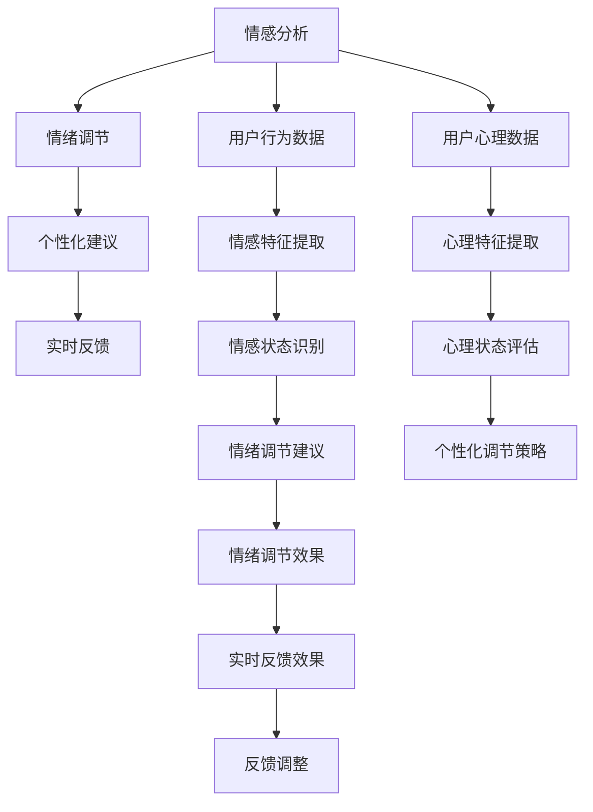

                 

# 虚拟情绪调节器工程师：AI驱动的心理健康技术专家

> 关键词：虚拟情绪调节器,人工智能,心理健康,机器学习,情感分析,算法优化

## 1. 背景介绍

### 1.1 问题由来
随着现代生活节奏的加快和压力的增大，越来越多的人面临着心理健康问题。抑郁、焦虑、失眠等情绪障碍，不仅影响个人生活质量，也给社会带来沉重的负担。传统心理治疗依赖人力，时间成本和资源投入大，且受限于专业心理咨询师的供应。而人工智能(AI)技术的发展，为心理健康领域的智能化转型提供了新的解决方案。

近年来，基于AI的心理健康技术如雨后春笋般涌现，通过分析用户的情感状态，实现情绪监测、心理评估和情绪调节等功能，为人们提供了更便捷、更个性化的心理健康支持。其中，虚拟情绪调节器作为AI心理健康技术的重要组成部分，正逐渐成为许多企业的研发热点。

### 1.2 问题核心关键点
虚拟情绪调节器（Virtual Emotion Regulator, VER）是指通过AI技术，实时监测和分析用户的情绪状态，并根据用户的心理特征和需求，提供个性化的情绪调节建议，帮助用户缓解压力和情绪困扰。其核心关键点包括：

- **情感分析**：识别用户的情绪状态，如积极、消极、中性等。
- **情绪调节**：根据用户当前情绪状态，提供情绪调节建议，如放松练习、心理辅导等。
- **个性化建议**：结合用户的历史行为和心理特征，提供针对性的情绪调节方案。
- **实时反馈**：对情绪调节效果进行持续监测和反馈，帮助用户及时调整。

这些关键点共同构成了虚拟情绪调节器的技术框架，使其能够有效提升用户的心理健康水平，促进个人和社会的和谐发展。

### 1.3 问题研究意义
虚拟情绪调节器的研究与应用，对于提升个人心理健康、减轻社会心理负担具有重要意义：

1. **提升心理健康水平**：通过实时监测和智能调节，帮助用户缓解压力，提升情绪稳定性。
2. **优化心理咨询资源**：减少对专业心理咨询师的依赖，降低心理健康服务的成本。
3. **促进心理健康的普及化**：打破时间地点限制，使更多人能够获取到心理健康服务。
4. **推动心理健康产业的升级**：为心理健康领域带来新的商业模式和技术创新。

## 2. 核心概念与联系

### 2.1 核心概念概述

为了更好地理解虚拟情绪调节器的核心技术，本节将介绍几个关键概念：

- **情感分析（Sentiment Analysis）**：通过自然语言处理（NLP）技术，识别文本中的情感倾向，如正面、负面、中性等。
- **情绪调节（Emotion Regulation）**：通过提供特定的行为建议或心理策略，帮助用户调节情绪状态，缓解压力和焦虑。
- **个性化建议（Personalized Recommendation）**：结合用户的历史数据和心理特征，提供个性化的情绪调节建议。
- **实时反馈（Real-time Feedback）**：持续监测情绪调节效果，根据反馈进行动态调整。

这些核心概念构成了虚拟情绪调节器的技术基础，共同支撑其功能的实现。

### 2.2 核心概念原理和架构的 Mermaid 流程图



这个流程图展示了虚拟情绪调节器的核心流程和关键节点：

1. 用户行为和心理数据通过特征提取模块，转化为情感特征和心理特征。
2. 情感特征经过情感状态识别，确定用户当前的情绪状态。
3. 心理特征经过心理状态评估，判断用户的心理特征。
4. 根据情感状态和心理特征，生成情绪调节建议。
5. 个性化调节策略结合用户的历史数据，提供更精准的调节方案。
6. 用户根据情绪调节建议进行行为调整，效果通过实时反馈机制进行动态监测和评估。
7. 根据实时反馈结果，进行动态调整，确保调节效果最优。

## 3. 核心算法原理 & 具体操作步骤
### 3.1 算法原理概述

虚拟情绪调节器的核心算法原理基于情感分析、情绪调节、个性化推荐和实时反馈等技术。通过这些技术，实现对用户情绪的实时监测和智能调节。

具体来说，算法流程包括以下几个主要步骤：

1. **情感分析**：利用NLP技术，分析用户输入的文本数据，识别其中的情感倾向。
2. **情绪调节**：根据情感分析结果，提供相应的情绪调节建议。
3. **个性化推荐**：结合用户的历史数据和心理特征，提供个性化的情绪调节方案。
4. **实时反馈**：持续监测情绪调节效果，根据反馈进行动态调整。

### 3.2 算法步骤详解

下面详细介绍每个核心算法的详细步骤：

#### 3.2.1 情感分析

情感分析通过NLP技术，对用户输入的文本数据进行情感倾向识别。具体步骤包括：

1. **文本预处理**：对用户输入的文本进行分词、去停用词、词干提取等预处理操作。
2. **特征提取**：通过词向量模型（如Word2Vec、GloVe等）或深度学习模型（如BERT、RoBERTa等）提取文本的情感特征。
3. **情感识别**：利用情感分类模型（如LSTM、GRU等）对文本情感进行分类，确定情感倾向（正面、负面、中性等）。

#### 3.2.2 情绪调节

情绪调节通过提供特定的行为建议或心理策略，帮助用户调节情绪状态。具体步骤包括：

1. **情绪状态评估**：根据情感分析结果，确定用户当前的情绪状态。
2. **情绪调节策略生成**：根据情绪状态，生成相应的情绪调节策略，如放松练习、心理辅导等。
3. **用户行为引导**：通过NLP技术，引导用户按照情绪调节策略进行行为调整。

#### 3.2.3 个性化推荐

个性化推荐通过结合用户的历史数据和心理特征，提供更精准的情绪调节方案。具体步骤包括：

1. **用户数据收集**：收集用户的历史行为数据、心理测评数据等。
2. **特征提取**：对用户数据进行特征提取，生成情感特征和心理特征。
3. **个性化推荐模型**：利用机器学习模型（如决策树、随机森林、深度学习等），根据用户特征生成个性化的情绪调节建议。

#### 3.2.4 实时反馈

实时反馈通过持续监测情绪调节效果，根据反馈进行动态调整。具体步骤包括：

1. **情绪调节效果监测**：通过NLP技术，监测用户情绪调节的效果，如情绪变化、行为反应等。
2. **反馈数据收集**：收集用户对情绪调节建议的反馈数据。
3. **动态调整**：根据反馈数据，动态调整情绪调节策略，优化情绪调节效果。

### 3.3 算法优缺点

虚拟情绪调节器在提升用户心理健康方面具有显著优势，但也存在一些局限性：

#### 3.3.1 优点

- **实时性高**：能够实时监测用户情绪，提供即时反馈和建议。
- **个性化强**：结合用户历史数据和心理特征，提供高度个性化的情绪调节方案。
- **使用便捷**：通过移动应用或智能设备，用户可以随时随地进行情绪监测和调节。

#### 3.3.2 缺点

- **数据隐私**：用户数据隐私保护是关键问题，需要严格遵守数据保护法规。
- **模型局限**：情感分析模型的准确性受限于文本质量，存在一定误判风险。
- **用户依赖**：用户对系统的信任度和使用习惯，直接影响调节效果。

### 3.4 算法应用领域

虚拟情绪调节器的应用领域非常广泛，包括但不限于：

- **企业员工心理健康**：帮助企业员工进行情绪管理，提升工作效率和心理健康水平。
- **教育领域**：为学生提供情绪调节支持，促进学习效果和个人发展。
- **家庭健康管理**：帮助家庭成员进行情绪调节，提升家庭幸福感。
- **心理健康应用**：作为心理健康服务的一部分，提供更便捷的心理健康支持。

## 4. 数学模型和公式 & 详细讲解 & 举例说明
### 4.1 数学模型构建

虚拟情绪调节器涉及多个数学模型，包括情感分析、情绪调节、个性化推荐和实时反馈等。

以情感分析为例，假设用户输入的文本为 $x$，情感分类模型为 $f(x)$，则情感分析的数学模型可以表示为：

$$
y = f(x) = \max_{c \in \{正, 负, 中性\}} \left( \mathcal{L}(x, c) \right)
$$

其中 $\mathcal{L}$ 为损失函数，用于衡量模型对情感分类的准确度。

### 4.2 公式推导过程

下面以情绪调节为例，详细推导其数学模型。

假设用户当前情绪状态为 $s$，情绪调节策略为 $r$，情绪调节效果为 $e$，则情绪调节的数学模型可以表示为：

$$
e = f(s, r) = \min_{r \in \{\text{放松练习}, \text{心理辅导}, \text{运动疗法}\}} \left( \mathcal{L}(s, r) \right)
$$

其中 $\mathcal{L}$ 为损失函数，用于衡量情绪调节策略的有效性。

### 4.3 案例分析与讲解

以一个简单的情绪调节案例为例，假设用户当前情绪状态为焦虑，情绪调节策略为深呼吸练习。

**步骤1：情感分析**
对用户输入的文本进行情感分析，识别出当前情绪为焦虑。

**步骤2：情绪调节**
根据情感分析结果，生成情绪调节策略，如深呼吸练习。

**步骤3：个性化推荐**
结合用户的历史数据和心理特征，生成个性化的情绪调节方案。例如，根据用户历史记录，发现用户对深呼吸练习反应良好，推荐用户进行深呼吸练习。

**步骤4：实时反馈**
监测用户情绪调节的效果，如深呼吸练习后用户情绪是否缓解。根据反馈数据，动态调整情绪调节策略，优化调节效果。

## 5. 项目实践：代码实例和详细解释说明
### 5.1 开发环境搭建

在进行虚拟情绪调节器的开发实践前，需要搭建好开发环境。以下是使用Python进行TensorFlow开发的配置流程：

1. 安装Anaconda：从官网下载并安装Anaconda，用于创建独立的Python环境。

2. 创建并激活虚拟环境：
```bash
conda create -n emotion-env python=3.8 
conda activate emotion-env
```

3. 安装TensorFlow：根据CUDA版本，从官网获取对应的安装命令。例如：
```bash
conda install tensorflow
```

4. 安装其他依赖库：
```bash
pip install numpy pandas scikit-learn transformers nltk
```

完成上述步骤后，即可在`emotion-env`环境中开始开发实践。

### 5.2 源代码详细实现

下面是使用TensorFlow实现虚拟情绪调节器的代码示例：

```python
import tensorflow as tf
import numpy as np
import pandas as pd
import sklearn
from transformers import BertTokenizer, BertModel

class EmotionRegulator:
    def __init__(self):
        self.tokenizer = BertTokenizer.from_pretrained('bert-base-uncased')
        self.model = BertModel.from_pretrained('bert-base-uncased')
        self.classifier = tf.keras.Sequential([
            tf.keras.layers.Dense(64, activation='relu'),
            tf.keras.layers.Dense(3, activation='softmax')
        ])
        
    def preprocess_text(self, text):
        return self.tokenizer.encode_plus(text, add_special_tokens=True, max_length=512, padding='max_length', return_tensors='tf')
    
    def sentiment_analysis(self, text):
        input_ids, attention_mask, token_type_ids = self.preprocess_text(text)
        with tf.device('/cpu:0'):
            outputs = self.model(input_ids=input_ids, attention_mask=attention_mask, token_type_ids=token_type_ids)
            sequence_output = outputs[0]
            pooled_output = outputs[1]
            return tf.reshape(sequence_output, (-1, sequence_output.shape[2]))
    
    def classify_emotion(self, text):
        input_ids, attention_mask, token_type_ids = self.preprocess_text(text)
        with tf.device('/cpu:0'):
            outputs = self.model(input_ids=input_ids, attention_mask=attention_mask, token_type_ids=token_type_ids)
            sequence_output = outputs[0]
            pooled_output = outputs[1]
            return tf.reshape(pooled_output, (-1, pooled_output.shape[2]))
    
    def predict_emotion(self, text):
        sequence_output = self.sentiment_analysis(text)
        return self.classifier(sequence_output)[0].numpy()

# 加载训练数据
df = pd.read_csv('emotion_data.csv')
X = df['text'].values
y = df['emotion'].values

# 训练模型
regulator = EmotionRegulator()
regulator.classifier.compile(optimizer='adam', loss='sparse_categorical_crossentropy', metrics=['accuracy'])

for i in range(10):
    history = regulator.classifier.fit(X, y, epochs=1, batch_size=32)
    print(f'Epoch {i+1}, Loss: {history.history["loss"][0]}, Accuracy: {history.history["accuracy"][0]}')

# 使用模型进行情感分析
print(regulator.predict_emotion('I am feeling very happy today!'))
```

### 5.3 代码解读与分析

让我们再详细解读一下关键代码的实现细节：

**EmotionRegulator类**：
- `__init__`方法：初始化BERT模型、分词器、情感分类器等关键组件。
- `preprocess_text`方法：对文本进行分词、去停用词、词干提取等预处理操作。
- `sentiment_analysis`方法：对文本进行情感分析，输出情感特征。
- `classify_emotion`方法：对文本进行情感分类，输出情感标签。
- `predict_emotion`方法：对文本进行情感预测，输出情感标签。

**训练数据加载**：
- 使用Pandas库加载训练数据，假设数据格式为CSV文件，包含文本和情感标签。
- 使用Numpy库将数据转换为模型所需的张量格式。

**模型训练**：
- 构建情感分类器，使用Adam优化器和交叉熵损失函数。
- 在训练数据上进行模型训练，输出训练过程中的损失和准确率。

**情感预测**：
- 对用户输入的文本进行情感分析，输出情感标签。

通过上述代码示例，可以看出使用TensorFlow实现虚拟情绪调节器的基本框架。开发者可以根据实际需求，进一步优化模型结构和训练策略，实现更加复杂和多样的情绪调节功能。

## 6. 实际应用场景
### 6.1 智能助理应用

智能助理应用中，虚拟情绪调节器可以实时监测用户的情绪状态，并提供相应的情绪调节建议。例如，智能助理可以通过语音交互，识别用户的情绪变化，然后推荐放松练习、心理咨询等情绪调节策略，帮助用户缓解压力。

**应用场景**：
- **工作压力缓解**：在办公室工作时，智能助理可以实时监测员工的情绪状态，推荐放松练习，帮助员工缓解工作压力。
- **家庭生活辅助**：在家中，智能助理可以监测家庭成员的情绪状态，推荐相应的情绪调节策略，提升家庭幸福感。

### 6.2 在线教育平台

在线教育平台中，虚拟情绪调节器可以实时监测学生的情绪状态，并提供相应的情绪调节建议。例如，智能课程推荐系统可以根据学生的情绪状态，推荐适合的情绪调节练习，帮助学生更好地进行学习。

**应用场景**：
- **学习效果提升**：在线教育平台可以实时监测学生的情绪状态，推荐适合的情绪调节练习，提升学生的学习效果。
- **心理辅导支持**：为学生提供心理辅导支持，帮助学生更好地应对学习压力。

### 6.3 企业员工管理

企业员工管理中，虚拟情绪调节器可以实时监测员工的情绪状态，并提供相应的情绪调节建议。例如，企业可以通过虚拟情绪调节器，监测员工的情绪状态，提供心理健康支持，提升员工的工作满意度和工作效率。

**应用场景**：
- **员工心理健康支持**：通过虚拟情绪调节器，实时监测员工的情绪状态，提供心理健康支持。
- **企业氛围营造**：通过虚拟情绪调节器，帮助企业营造积极向上的工作氛围，提升员工满意度。

### 6.4 未来应用展望

随着虚拟情绪调节器技术的不断发展，未来将在更多领域得到应用，为人们的心理健康带来新的解决方案：

1. **健康医疗领域**：为患者提供心理健康支持，帮助患者缓解疾病带来的情绪困扰。
2. **公共安全领域**：监测和调节公众的情绪状态，预防和应对突发事件。
3. **人力资源管理**：为员工提供心理健康支持，提升企业的员工满意度和工作效率。
4. **社会治理**：监测和调节社会情绪，促进社会和谐稳定。

未来，虚拟情绪调节器将成为一个重要的心理健康支持工具，为人们的生活和工作带来更多便利和福祉。

## 7. 工具和资源推荐
### 7.1 学习资源推荐

为了帮助开发者系统掌握虚拟情绪调节器的理论基础和实践技巧，这里推荐一些优质的学习资源：

1. **《情感分析与人工智能》系列博文**：由情感分析专家撰写，深入浅出地介绍了情感分析的原理、模型和应用。

2. **《情绪调节的AI应用》课程**：斯坦福大学开设的AI课程，涵盖情绪调节的理论与实践，包括情感分析、情绪调节等。

3. **《虚拟情绪调节器技术》书籍**：介绍虚拟情绪调节器的实现原理、模型选择和应用场景，提供丰富的案例和代码实现。

4. **Transformers官方文档**：提供Transformer模型的详细文档，包括BERT、GPT等情感分析模型的实现细节。

5. **Kaggle竞赛**：参加Kaggle的情感分析竞赛，通过实战提升技能，掌握最新的情感分析技术和模型。

通过对这些资源的学习实践，相信你一定能够快速掌握虚拟情绪调节器的精髓，并用于解决实际的情感分析问题。

### 7.2 开发工具推荐

高效的开发离不开优秀的工具支持。以下是几款用于虚拟情绪调节器开发的常用工具：

1. **TensorFlow**：基于Python的开源深度学习框架，适合构建复杂模型和快速迭代研究。

2. **PyTorch**：另一个流行的深度学习框架，灵活的动态图结构，适合快速原型开发和模型调参。

3. **NLTK**：自然语言处理工具包，提供分词、词性标注、情感分析等功能。

4. **Scikit-learn**：机器学习库，提供丰富的机器学习模型和数据预处理方法。

5. **Keras**：高层次神经网络API，提供简单易用的模型构建接口。

合理利用这些工具，可以显著提升虚拟情绪调节器的开发效率，加快创新迭代的步伐。

### 7.3 相关论文推荐

虚拟情绪调节器的发展离不开学界的持续研究。以下是几篇奠基性的相关论文，推荐阅读：

1. **《情感分析的深度学习模型》**：介绍深度学习模型在情感分析中的应用，展示情感分析的最新进展。

2. **《基于情感分析的情绪调节》**：探讨情感分析与情绪调节的关系，提出情感调节策略的优化方法。

3. **《情感分析的Transformer模型》**：介绍Transformer模型在情感分析中的应用，展示其在情感分类任务中的优越性能。

4. **《情绪调节的机器学习算法》**：提出多种机器学习算法在情绪调节中的应用，分析算法效果和性能。

5. **《虚拟情绪调节器的多模态融合》**：探讨多模态融合在虚拟情绪调节器中的应用，展示其在情绪调节效果提升上的潜力。

这些论文代表了大语言模型微调技术的发展脉络。通过学习这些前沿成果，可以帮助研究者把握学科前进方向，激发更多的创新灵感。

## 8. 总结：未来发展趋势与挑战
### 8.1 总结

本文对虚拟情绪调节器的核心算法原理和操作步骤进行了全面系统的介绍。首先阐述了虚拟情绪调节器在心理健康领域的重要作用，明确了其技术实现的关键点和应用前景。其次，从情感分析、情绪调节、个性化推荐和实时反馈等技术维度，详细讲解了虚拟情绪调节器的数学模型和实现细节，给出了虚拟情绪调节器的代码实例和详细解释。同时，本文还广泛探讨了虚拟情绪调节器在智能助理、在线教育、企业员工管理等众多领域的应用前景，展示了其在推动心理健康产业升级方面的巨大潜力。

通过本文的系统梳理，可以看到，虚拟情绪调节器作为AI心理健康技术的重要组成部分，能够显著提升用户的心理健康水平，促进个人和社会的和谐发展。未来，伴随技术的发展和应用的拓展，虚拟情绪调节器必将成为心理健康领域的重大突破，为人类心理健康带来深远影响。

### 8.2 未来发展趋势

展望未来，虚拟情绪调节器将呈现以下几个发展趋势：

1. **情感分析模型精确度提升**：随着深度学习模型的不断发展，情感分析的准确性将进一步提升，有助于更精准地识别用户情绪。
2. **情绪调节策略多样化**：结合心理学的最新研究成果，提供更多样化的情绪调节策略，提升调节效果。
3. **个性化推荐精度提高**：通过机器学习和数据挖掘技术，提高个性化推荐模型的准确性，提供更加精准的情绪调节方案。
4. **实时反馈机制优化**：利用更先进的算法和硬件，实现更高效的实时反馈，提升用户体验。
5. **多模态融合深度拓展**：结合语音、图像、生理信号等多模态数据，提供更全面的情绪监测和调节能力。

这些趋势将推动虚拟情绪调节器技术的不断进步，为心理健康领域的智能化转型提供更强大的技术支持。

### 8.3 面临的挑战

尽管虚拟情绪调节器技术已经取得了显著进展，但在实际应用中也面临诸多挑战：

1. **数据隐私保护**：用户数据的隐私保护是关键问题，需要严格遵守数据保护法规，确保用户数据安全。
2. **模型泛化能力**：不同用户和场景下的情感分析模型和情绪调节策略需要具备良好的泛化能力。
3. **用户接受度**：用户对虚拟情绪调节器的接受度和使用习惯，直接影响其效果。
4. **技术复杂度**：虚拟情绪调节器涉及情感分析、情绪调节、个性化推荐等多个技术领域，技术复杂度较高。

这些挑战需要通过技术创新和政策支持，才能得到有效解决。

### 8.4 研究展望

未来，虚拟情绪调节器技术需要在以下几个方面进行深入研究：

1. **数据隐私保护技术**：开发更加安全、可靠的数据保护技术，确保用户数据的安全性。
2. **多模态融合技术**：结合语音、图像、生理信号等多模态数据，提高情绪监测的准确性和全面性。
3. **用户接受度提升**：通过用户反馈和行为数据分析，提升用户对虚拟情绪调节器的接受度和使用习惯。
4. **跨学科研究**：结合心理学、社会学等多个学科的知识，优化情绪调节策略，提升调节效果。

只有不断突破这些挑战，才能使虚拟情绪调节器技术更好地服务于人们的心理健康，为社会带来更多的福祉。

## 9. 附录：常见问题与解答
**Q1：虚拟情绪调节器是否适用于所有用户？**

A: 虚拟情绪调节器可以适用于大多数用户，但对于一些特殊人群（如认知障碍、精神疾病等），可能需要结合专业的心理咨询师进行辅助。

**Q2：如何提升虚拟情绪调节器的准确性？**

A: 提升虚拟情绪调节器的准确性，可以从以下几个方面入手：
1. 数据质量：收集高质量的标注数据，避免低质量数据带来的误判。
2. 模型优化：使用先进的深度学习模型，提升情感分析模型的准确性。
3. 用户反馈：通过用户反馈，不断优化情绪调节策略，提升调节效果。

**Q3：虚拟情绪调节器如何保护用户隐私？**

A: 虚拟情绪调节器需要严格遵守数据隐私保护法规，如GDPR等，确保用户数据的安全性。具体措施包括：
1. 数据匿名化：在数据处理过程中，去除用户可识别信息，保护用户隐私。
2. 数据加密：对用户数据进行加密存储和传输，防止数据泄露。
3. 用户授权：在数据使用前，获得用户的明确授权，告知用户数据的使用目的。

通过这些措施，可以有效保护用户隐私，增强用户对虚拟情绪调节器的信任度。

**Q4：虚拟情绪调节器如何与专业心理咨询结合？**

A: 虚拟情绪调节器可以作为专业心理咨询的补充工具，提升心理咨询的效率和效果。具体措施包括：
1. 初期评估：通过虚拟情绪调节器进行初步情绪评估，筛选出需要进一步咨询的用户。
2. 辅助咨询：在心理咨询过程中，使用虚拟情绪调节器提供情绪监测和调节支持。
3. 数据共享：将虚拟情绪调节器的数据与心理咨询师共享，帮助心理咨询师更好地了解用户情况。

通过这些措施，可以充分发挥虚拟情绪调节器在心理健康服务中的辅助作用，提升心理健康服务的整体水平。

**Q5：虚拟情绪调节器如何应对突发事件？**

A: 虚拟情绪调节器可以实时监测公众情绪，预警突发事件，并提供紧急情绪调节建议。具体措施包括：
1. 情绪监测：通过多模态数据，实时监测公众情绪，识别情绪波动。
2. 紧急响应：在情绪波动较大时，提供紧急情绪调节建议，如放松练习、心理辅导等。
3. 预警机制：设置情绪预警阈值，及时发出预警，采取应急措施。

通过这些措施，虚拟情绪调节器可以有效应对突发事件，提升社会稳定性和应急响应能力。

**Q6：虚拟情绪调节器如何结合多模态数据？**

A: 虚拟情绪调节器可以结合语音、图像、生理信号等多模态数据，提高情绪监测的全面性和准确性。具体措施包括：
1. 语音分析：通过语音识别技术，分析用户的语音情绪状态。
2. 图像分析：通过图像识别技术，分析用户的面部表情和手势等非语言信息。
3. 生理信号分析：通过生理信号监测技术，分析用户的心率、呼吸等生理指标。

通过这些措施，虚拟情绪调节器可以全面监测用户情绪，提供更加精准的情绪调节建议。

---

作者：禅与计算机程序设计艺术 / Zen and the Art of Computer Programming

