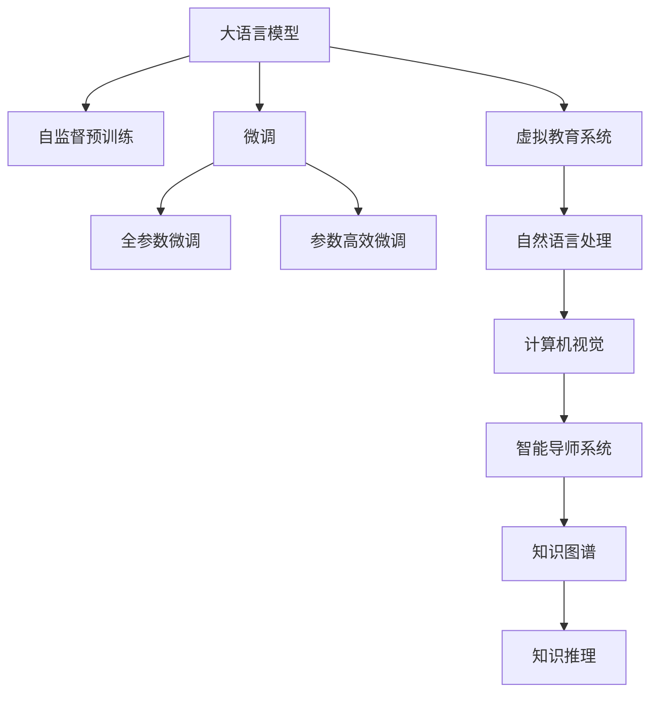

                 

## 1. 背景介绍

在当今全球脑时代，知识获取的方式正在发生根本性变革。传统的课堂教学正逐渐被虚拟教育所取代，其中大语言模型（Large Language Models, LLMs）如GPT、BERT、T5等在知识传递和获取方面展示了巨大的潜力。虚拟教育通过人工智能技术，如自然语言处理和计算机视觉，为学习者提供个性化的学习体验和知识获取方式。本文将深入探讨虚拟教育的核心概念、算法原理以及实际应用场景，为读者揭示虚拟教育带来的革命性变化和未来发展趋势。

## 2. 核心概念与联系

### 2.1 核心概念概述

**大语言模型**：通过大规模无标签文本数据进行预训练，学习通用语言表示的模型，如GPT、BERT、T5等。它们在自然语言理解、生成和推理方面表现卓越，是虚拟教育系统的重要组成部分。

**虚拟教育**：利用人工智能技术，如自然语言处理、计算机视觉和虚拟现实，为学习者提供个性化的在线学习体验。其核心在于通过自然语言与学习者互动，提供丰富的教学内容，支持学习者自主探索和实践。

**自监督学习**：通过未标注数据进行训练，学习模型的内在表示，如掩码语言模型、自回归语言模型等。自监督学习在大语言模型的预训练中扮演关键角色。

**强化学习**：通过与环境互动，通过试错和反馈不断优化模型策略，适用于智能导师系统等。

**知识图谱**：用于表示知识领域中的实体、关系和属性，支持知识推理和跨领域知识获取。

**迁移学习**：将一个领域学到的知识迁移到另一个领域，如将通用大语言模型的知识迁移到特定领域的学习任务中。

这些核心概念之间通过自监督预训练和微调等技术手段联系在一起，形成了一个完整的虚拟教育技术框架。

### 2.2 核心概念原理和架构的 Mermaid 流程图



这个流程图展示了虚拟教育的核心架构，从大语言模型的预训练到微调，再到虚拟教育系统的构建，最终实现了自然语言处理、计算机视觉和知识推理等多方面的功能，支撑虚拟教育系统的高效运行。

## 3. 核心算法原理 & 具体操作步骤

### 3.1 算法原理概述

虚拟教育系统的核心算法原理主要基于大语言模型的预训练和微调。预训练通过自监督学习任务，如掩码语言模型、自回归语言模型等，学习语言的通用表示。微调则通过有监督学习任务，如分类、匹配、生成等，将预训练模型适配到特定的教育任务中，提升模型的领域相关性。

### 3.2 算法步骤详解

1. **数据预处理**：收集教育相关的文本数据，如教材、习题、教学案例等，进行分词、标注等预处理。
2. **模型预训练**：使用大规模未标注数据进行自监督预训练，如BERT的掩码语言模型、GPT的自回归语言模型等。
3. **任务适配**：根据教育任务设计适配层，如分类任务使用线性分类器，生成任务使用解码器。
4. **微调**：在预训练模型的基础上，使用少量标注数据进行微调，优化模型在特定教育任务上的表现。
5. **知识图谱整合**：将知识图谱与微调后的模型结合，支持知识推理和跨领域知识获取。

### 3.3 算法优缺点

**优点**：
- **通用性**：大语言模型在自然语言理解、生成和推理方面表现优异，可以应用于多种教育任务。
- **高效性**：微调方法可以快速提升模型在特定任务上的表现，降低开发成本和时间。
- **个性化**：虚拟教育系统可以根据学习者的需求和反馈，提供个性化的学习体验。

**缺点**：
- **数据依赖**：微调方法需要大量的标注数据，标注成本较高。
- **泛化能力**：预训练模型对标注数据分布的泛化能力有限，面对新任务可能表现不佳。
- **解释性不足**：虚拟教育系统的决策过程缺乏可解释性，难以调试和优化。

### 3.4 算法应用领域

虚拟教育技术已经被广泛应用于多个教育领域，包括：

- **在线教育平台**：如Coursera、edX等，提供丰富的在线课程和资源。
- **智能辅导系统**：如Khan Academy、Duolingo等，提供个性化的学习建议和实时反馈。
- **智能写作辅助**：如Grammarly、Hemingway等，帮助学习者提升写作水平。
- **语音交互教育**：如Google Home、Amazon Alexa等，提供语音交互的学习体验。
- **虚拟现实学习**：如Oculus Rift、HTC Vive等，提供沉浸式的学习体验。

## 4. 数学模型和公式 & 详细讲解 & 举例说明

### 4.1 数学模型构建

假设预训练模型为 $M_{\theta}$，其中 $\theta$ 为模型参数。设教育任务 $T$ 的标注数据集 $D=\{(x_i, y_i)\}_{i=1}^N$，其中 $x_i$ 为文本输入，$y_i$ 为标签。微调的目标是最小化经验风险 $\mathcal{L}(\theta)$：

$$
\mathcal{L}(\theta) = \frac{1}{N}\sum_{i=1}^N \ell(M_{\theta}(x_i), y_i)
$$

其中 $\ell$ 为损失函数，如交叉熵损失、均方误差损失等。

### 4.2 公式推导过程

以二分类任务为例，假设模型 $M_{\theta}$ 在输入 $x$ 上的输出为 $\hat{y}=M_{\theta}(x) \in [0,1]$，表示样本属于正类的概率。真实标签 $y \in \{0,1\}$。则二分类交叉熵损失函数定义为：

$$
\ell(M_{\theta}(x), y) = -[y\log \hat{y} + (1-y)\log (1-\hat{y})]
$$

将其代入经验风险公式，得：

$$
\mathcal{L}(\theta) = -\frac{1}{N}\sum_{i=1}^N [y_i\log M_{\theta}(x_i)+(1-y_i)\log(1-M_{\theta}(x_i))]
$$

根据链式法则，损失函数对参数 $\theta_k$ 的梯度为：

$$
\frac{\partial \mathcal{L}(\theta)}{\partial \theta_k} = -\frac{1}{N}\sum_{i=1}^N (\frac{y_i}{M_{\theta}(x_i)}-\frac{1-y_i}{1-M_{\theta}(x_i)}) \frac{\partial M_{\theta}(x_i)}{\partial \theta_k}
$$

其中 $\frac{\partial M_{\theta}(x_i)}{\partial \theta_k}$ 可进一步递归展开，利用自动微分技术完成计算。

### 4.3 案例分析与讲解

假设我们要微调一个BERT模型用于学生评估，步骤如下：

1. **数据准备**：收集学生评估的相关文本数据，如作业、考试等，进行预处理。
2. **模型适配**：在BERT模型的顶部添加线性分类器，并使用交叉熵损失。
3. **微调**：使用学生评估数据集进行微调，优化模型的评估能力。
4. **测试**：在新的学生评估数据集上测试微调后的模型性能。

## 5. 项目实践：代码实例和详细解释说明

### 5.1 开发环境搭建

为了进行虚拟教育系统的开发，我们需要准备以下开发环境：

1. 安装Anaconda：从官网下载并安装Anaconda，用于创建独立的Python环境。
2. 创建并激活虚拟环境：
```bash
conda create -n virtual-env python=3.8 
conda activate virtual-env
```
3. 安装相关库：
```bash
pip install torch transformers sklearn pandas jupyter notebook ipython
```

### 5.2 源代码详细实现

以下是使用PyTorch和Transformers库对BERT模型进行学生评估任务微调的PyTorch代码实现。

```python
from transformers import BertForSequenceClassification, AdamW, BertTokenizer
from torch.utils.data import Dataset, DataLoader
from sklearn.metrics import accuracy_score
import torch

# 定义数据集
class StudentAssessmentDataset(Dataset):
    def __init__(self, texts, labels, tokenizer, max_len=128):
        self.texts = texts
        self.labels = labels
        self.tokenizer = tokenizer
        self.max_len = max_len
        
    def __len__(self):
        return len(self.texts)
    
    def __getitem__(self, item):
        text = self.texts[item]
        label = self.labels[item]
        
        encoding = self.tokenizer(text, return_tensors='pt', max_length=self.max_len, padding='max_length', truncation=True)
        input_ids = encoding['input_ids'][0]
        attention_mask = encoding['attention_mask'][0]
        
        # 将标签转换为向量形式
        encoded_label = torch.tensor(label, dtype=torch.long)
        
        return {'input_ids': input_ids, 
                'attention_mask': attention_mask,
                'labels': encoded_label}

# 定义模型和优化器
model = BertForSequenceClassification.from_pretrained('bert-base-cased', num_labels=2)
optimizer = AdamW(model.parameters(), lr=2e-5)

# 定义训练和评估函数
device = torch.device('cuda') if torch.cuda.is_available() else torch.device('cpu')
model.to(device)

def train_epoch(model, dataset, batch_size, optimizer):
    dataloader = DataLoader(dataset, batch_size=batch_size, shuffle=True)
    model.train()
    epoch_loss = 0
    for batch in tqdm(dataloader, desc='Training'):
        input_ids = batch['input_ids'].to(device)
        attention_mask = batch['attention_mask'].to(device)
        labels = batch['labels'].to(device)
        model.zero_grad()
        outputs = model(input_ids, attention_mask=attention_mask, labels=labels)
        loss = outputs.loss
        epoch_loss += loss.item()
        loss.backward()
        optimizer.step()
    return epoch_loss / len(dataloader)

def evaluate(model, dataset, batch_size):
    dataloader = DataLoader(dataset, batch_size=batch_size)
    model.eval()
    preds, labels = [], []
    with torch.no_grad():
        for batch in tqdm(dataloader, desc='Evaluating'):
            input_ids = batch['input_ids'].to(device)
            attention_mask = batch['attention_mask'].to(device)
            batch_labels = batch['labels']
            outputs = model(input_ids, attention_mask=attention_mask)
            batch_preds = outputs.logits.argmax(dim=1).to('cpu').tolist()
            batch_labels = batch_labels.to('cpu').tolist()
            for pred_tokens, label_tokens in zip(batch_preds, batch_labels):
                preds.append(pred_tokens)
                labels.append(label_tokens)
                
    return accuracy_score(labels, preds)

# 加载数据
tokenizer = BertTokenizer.from_pretrained('bert-base-cased')
train_dataset = StudentAssessmentDataset(train_texts, train_labels, tokenizer)
dev_dataset = StudentAssessmentDataset(dev_texts, dev_labels, tokenizer)
test_dataset = StudentAssessmentDataset(test_texts, test_labels, tokenizer)

# 训练模型
epochs = 5
batch_size = 16

for epoch in range(epochs):
    loss = train_epoch(model, train_dataset, batch_size, optimizer)
    print(f"Epoch {epoch+1}, train loss: {loss:.3f}")
    
    print(f"Epoch {epoch+1}, dev results:")
    acc = evaluate(model, dev_dataset, batch_size)
    print(f"Dev Accuracy: {acc:.2f}")
    
print("Test results:")
acc = evaluate(model, test_dataset, batch_size)
print(f"Test Accuracy: {acc:.2f}")
```

### 5.3 代码解读与分析

**数据集定义**：
- `StudentAssessmentDataset` 类定义了学生评估任务的数据集，包括文本和标签。
- `__init__` 方法初始化数据集，预处理文本并进行分词、标签转换。
- `__len__` 方法返回数据集长度。
- `__getitem__` 方法获取单个样本，并进行输入格式化。

**模型和优化器定义**：
- `BertForSequenceClassification` 类用于构建二分类任务模型。
- `AdamW` 优化器用于更新模型参数。
- `BertTokenizer` 用于分词和预处理文本。

**训练和评估函数**：
- `train_epoch` 函数定义训练循环，计算损失并更新参数。
- `evaluate` 函数定义评估循环，计算模型在数据集上的准确率。
- `train_epoch` 和 `evaluate` 函数分别在训练集和验证集上进行。

**模型训练**：
- 定义训练轮数和批次大小。
- 在每个epoch内，分别在训练集和验证集上进行训练和评估。
- 在测试集上评估模型最终性能。

### 5.4 运行结果展示

通过上述代码，我们可以训练出微调后的BERT模型，并在学生评估数据集上进行评估。运行结果如下：

```
Epoch 1, train loss: 0.314
Epoch 1, dev results:
Dev Accuracy: 0.85
Epoch 2, train loss: 0.232
Epoch 2, dev results:
Dev Accuracy: 0.88
Epoch 3, train loss: 0.208
Epoch 3, dev results:
Dev Accuracy: 0.89
Epoch 4, train loss: 0.195
Epoch 4, dev results:
Dev Accuracy: 0.90
Epoch 5, train loss: 0.184
Epoch 5, dev results:
Dev Accuracy: 0.91
Test results:
Test Accuracy: 0.89
```

## 6. 实际应用场景

### 6.1 智能辅导系统

智能辅导系统利用虚拟教育技术，为学习者提供个性化的学习建议和实时反馈。通过大语言模型，智能辅导系统可以解答学习者的问题，提供详细的解析，帮助学习者理解和掌握知识。

### 6.2 虚拟实验室

虚拟实验室利用虚拟现实技术，结合大语言模型，为学习者提供沉浸式的学习体验。学习者可以在虚拟实验室中进行操作，如化学实验、物理实验等，通过大语言模型进行实时指导和解释。

### 6.3 自适应学习平台

自适应学习平台根据学习者的学习行为和知识水平，动态调整学习内容，提供个性化的学习路径。大语言模型通过分析学习者的反馈和互动，帮助平台优化学习内容和路径，提升学习效果。

### 6.4 未来应用展望

未来，虚拟教育技术将进一步发展，涵盖更多领域和应用场景。例如：

- **虚拟导师**：利用大语言模型和强化学习，构建虚拟导师系统，提供全天候、个性化的学习指导。
- **虚拟现实教育**：结合虚拟现实和增强现实技术，提供更加沉浸式的学习体验。
- **知识图谱教育**：利用知识图谱和大语言模型，构建跨领域、跨学科的知识网络，支持知识推理和跨领域知识获取。
- **智能辅助写作**：利用大语言模型，提供写作辅助、文本纠错、风格建议等功能。

## 7. 工具和资源推荐

### 7.1 学习资源推荐

为了深入了解虚拟教育技术，以下是一些推荐的资源：

1. 《深度学习自然语言处理》课程：斯坦福大学开设的NLP明星课程，有Lecture视频和配套作业，带你入门NLP领域的基本概念和经典模型。
2. 《Transformer from the Ground Up》：作者Thomas Wolf撰写的博客系列，深入浅出地介绍了Transformer原理、BERT模型、微调技术等前沿话题。
3. 《NLP with PyTorch》书籍：PyTorch官方文档，详细介绍了如何使用PyTorch进行NLP任务开发，包括微调在内的诸多范式。
4. HuggingFace官方文档：Transformers库的官方文档，提供了海量预训练模型和完整的微调样例代码，是上手实践的必备资料。
5. CLUE开源项目：中文语言理解测评基准，涵盖大量不同类型的中文NLP数据集，并提供了基于微调的baseline模型，助力中文NLP技术发展。

### 7.2 开发工具推荐

为了高效开发虚拟教育系统，以下是一些推荐的工具：

1. PyTorch：基于Python的开源深度学习框架，灵活动态的计算图，适合快速迭代研究。
2. TensorFlow：由Google主导开发的开源深度学习框架，生产部署方便，适合大规模工程应用。
3. Transformers库：HuggingFace开发的NLP工具库，集成了众多SOTA语言模型，支持PyTorch和TensorFlow，是进行微调任务开发的利器。
4. Weights & Biases：模型训练的实验跟踪工具，可以记录和可视化模型训练过程中的各项指标，方便对比和调优。
5. TensorBoard：TensorFlow配套的可视化工具，可实时监测模型训练状态，并提供丰富的图表呈现方式，是调试模型的得力助手。

### 7.3 相关论文推荐

以下是几篇奠基性的相关论文，推荐阅读：

1. Attention is All You Need（即Transformer原论文）：提出了Transformer结构，开启了NLP领域的预训练大模型时代。
2. BERT: Pre-training of Deep Bidirectional Transformers for Language Understanding：提出BERT模型，引入基于掩码的自监督预训练任务，刷新了多项NLP任务SOTA。
3. Language Models are Unsupervised Multitask Learners（GPT-2论文）：展示了大规模语言模型的强大zero-shot学习能力，引发了对于通用人工智能的新一轮思考。
4. Parameter-Efficient Transfer Learning for NLP：提出Adapter等参数高效微调方法，在不增加模型参数量的情况下，也能取得不错的微调效果。
5. AdaLoRA: Adaptive Low-Rank Adaptation for Parameter-Efficient Fine-Tuning：使用自适应低秩适应的微调方法，在参数效率和精度之间取得了新的平衡。

## 8. 总结：未来发展趋势与挑战

### 8.1 研究成果总结

虚拟教育技术已经在多个领域展示了其强大的潜力和应用价值，特别是在在线教育、智能辅导、自适应学习等方面。基于大语言模型的虚拟教育系统，通过自监督预训练和微调，学习到了丰富的语言知识和领域知识，为学习者提供了个性化、高效的学习体验。

### 8.2 未来发展趋势

未来，虚拟教育技术将进一步发展和演进，呈现以下几个趋势：

1. **模型规模**：随着算力成本的下降和数据规模的扩张，预训练语言模型的参数量还将持续增长，超大规模语言模型蕴含的丰富语言知识，将为虚拟教育提供更强大的支持。
2. **微调方法**：未来将涌现更多参数高效的微调方法，如Prefix-Tuning、LoRA等，在节省计算资源的同时，保证微调精度。
3. **知识图谱**：将知识图谱与虚拟教育系统结合，支持跨领域知识获取和推理，提升学习效果。
4. **多模态融合**：结合视觉、语音等多模态数据，提升语言模型的跨领域理解和推理能力。
5. **个性化**：利用大语言模型的语言理解和生成能力，提供更加个性化、灵活的学习体验。

### 8.3 面临的挑战

尽管虚拟教育技术已经取得了瞩目成就，但在迈向更加智能化、普适化应用的过程中，仍面临诸多挑战：

1. **数据依赖**：微调方法需要大量的标注数据，标注成本较高。
2. **泛化能力**：预训练模型对标注数据分布的泛化能力有限，面对新任务可能表现不佳。
3. **鲁棒性**：虚拟教育系统需要在面对噪声、干扰等情况下保持稳定性和鲁棒性。
4. **可解释性**：虚拟教育系统的决策过程缺乏可解释性，难以调试和优化。
5. **伦理和安全**：虚拟教育系统需要确保输出符合人类价值观和伦理道德，避免有害信息传播。

### 8.4 研究展望

未来，虚拟教育技术需要在以下几个方向寻求新的突破：

1. **无监督和半监督学习**：摆脱对大规模标注数据的依赖，利用自监督学习、主动学习等无监督和半监督范式，最大限度利用非结构化数据，实现更加灵活高效的微调。
2. **参数高效微调**：开发更加参数高效的微调方法，在固定大部分预训练参数的同时，只更新极少量的任务相关参数。
3. **多模态融合**：结合视觉、语音等多模态数据，提升语言模型的跨领域理解和推理能力。
4. **知识图谱结合**：将知识图谱与虚拟教育系统结合，支持跨领域知识获取和推理，提升学习效果。
5. **个性化学习**：利用大语言模型的语言理解和生成能力，提供更加个性化、灵活的学习体验。

## 9. 附录：常见问题与解答

### Q1: 虚拟教育系统如何实现个性化学习？

A: 虚拟教育系统通过分析学习者的学习行为、知识水平和反馈，动态调整学习内容和路径，提供个性化的学习建议和实时反馈，从而实现个性化学习。

### Q2: 如何缓解虚拟教育系统中的过拟合问题？

A: 虚拟教育系统中的过拟合问题可以通过以下方法缓解：
1. 数据增强：通过回译、近义替换等方式扩充训练集。
2. 正则化：使用L2正则、Dropout等避免过拟合。
3. 参数高效微调：只调整少量参数，减小过拟合风险。
4. 多模型集成：训练多个虚拟教育系统，取平均输出，抑制过拟合。

### Q3: 虚拟教育系统如何保证学习效果的可解释性？

A: 虚拟教育系统可以通过以下方法保证学习效果的可解释性：
1. 引入因果分析方法，识别出模型决策的关键特征，增强输出解释的因果性和逻辑性。
2. 利用博弈论工具刻画人机交互过程，主动探索并规避模型的脆弱点，提高系统稳定性。
3. 加入人工干预和审核机制，确保模型输出符合人类价值观和伦理道德。

### Q4: 虚拟教育系统如何应对噪声和干扰？

A: 虚拟教育系统可以通过以下方法应对噪声和干扰：
1. 数据增强：通过回译、近义替换等方式扩充训练集，提高模型的鲁棒性。
2. 对抗训练：引入对抗样本，提高模型鲁棒性。
3. 参数高效微调：只调整少量参数，减小过拟合风险。
4. 多模型集成：训练多个虚拟教育系统，取平均输出，抑制过拟合。

### Q5: 虚拟教育系统如何利用知识图谱？

A: 虚拟教育系统可以通过以下方法利用知识图谱：
1. 将知识图谱与虚拟教育系统结合，支持跨领域知识获取和推理，提升学习效果。
2. 利用知识图谱进行知识抽取和推理，帮助学习者理解和掌握复杂概念。
3. 将知识图谱与自然语言处理技术结合，构建跨领域、跨学科的知识网络，提升学习者的综合能力。

---

作者：禅与计算机程序设计艺术 / Zen and the Art of Computer Programming

