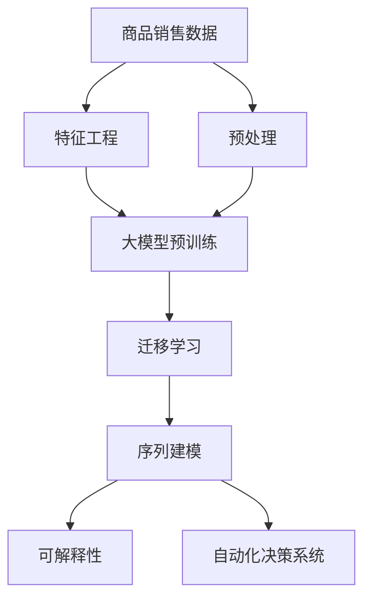

                 

# AI大模型在电商平台商品趋势预测中的应用

> 关键词：AI大模型,商品趋势预测,电商平台,深度学习,序列建模,迁移学习,可解释性,自动化决策系统

## 1. 背景介绍

### 1.1 问题由来

随着电商市场的迅猛发展，电商平台如何准确预测商品趋势、及时调整库存、优化营销策略，成为业界关注的焦点。传统的统计分析方法往往难以应对海量数据和多维度特征的挑战，亟需更先进、更智能的预测手段。

近年来，深度学习技术在电商领域的应用日益广泛，成为推动电商平台智能化的重要引擎。大模型在电商数据上的应用，如基于大模型进行商品趋势预测，极大地提升了预测的准确性和灵活性。通过大模型学习到的海量知识和规律，可以在更少的标注数据下，实现精确的商品趋势预测，满足电商平台的实际需求。

### 1.2 问题核心关键点

商品趋势预测的核心问题在于：在有限的标注数据下，利用大模型的知识，高效准确地预测商品未来的销售趋势和市场变化。这一过程中，大模型的预训练和迁移学习机制至关重要。

主要关键点包括：
1. 数据标注：获取高质量的商品销售数据，标注销售趋势（如销量上升、下降、平稳等），为模型训练提供基础。
2. 模型选择：选择合适的预训练大模型（如BERT、GPT-3等），作为商品趋势预测的基底模型。
3. 迁移学习：通过迁移学习机制，利用大模型在不同任务上的泛化能力，提升预测精度。
4. 序列建模：考虑商品销售数据的序列特性，构建时间序列预测模型。
5. 可解释性：提升模型预测的可解释性，帮助电商运营人员理解预测结果背后的逻辑和依据。
6. 自动化决策系统：结合实际业务场景，构建自动化决策系统，实现预测结果的落地应用。

## 2. 核心概念与联系

### 2.1 核心概念概述

为更好地理解AI大模型在商品趋势预测中的应用，本节将介绍几个密切相关的核心概念：

- **大模型（Large Model）**：指大规模预训练的深度学习模型，如BERT、GPT-3、T5等。通过在大规模无标签数据上进行自监督学习，这些模型可以学习到丰富的语言和知识表示。

- **序列建模（Sequence Modeling）**：针对时间序列数据，如商品销售数据，利用深度学习模型对数据进行建模和预测。序列建模考虑数据的连续性，可以更好地捕捉时间上的规律和趋势。

- **迁移学习（Transfer Learning）**：指将在大模型预训练阶段学到的知识，迁移到特定任务（如商品趋势预测）上进行微调，提升模型在新任务上的表现。

- **可解释性（Explainability）**：指模型预测过程的可解释性，即模型能够提供透明的预测依据，帮助用户理解模型如何做出决策。

- **自动化决策系统（Automated Decision System）**：指将AI模型与业务流程结合，构建自动化决策机制，实现预测结果的落地应用，如库存管理、广告投放等。

这些核心概念之间的逻辑关系可以通过以下Mermaid流程图来展示：



这个流程图展示了大模型在商品趋势预测中的应用框架：

1. 从原始商品销售数据开始，进行预处理和特征工程，得到可用于模型训练的数据。
2. 利用大模型进行预训练，学习到通用的语言和知识表示。
3. 通过迁移学习机制，将预训练模型迁移到商品趋势预测任务上，进行微调。
4. 构建序列建模模型，利用时间序列数据预测未来趋势。
5. 提升模型预测的可解释性，帮助电商运营人员理解预测结果。
6. 构建自动化决策系统，实现预测结果的实际应用。

这些概念共同构成了大模型在商品趋势预测中的应用框架，使得电商平台能够更智能、更高效地进行商品趋势预测和决策。

## 3. 核心算法原理 & 具体操作步骤

### 3.1 算法原理概述

商品趋势预测的本质是一个序列建模任务，其核心在于预测未来商品销售数据的分布。通过大模型，可以高效地从历史销售数据中学习到丰富的知识，用于预测未来的趋势。

具体地，我们将商品销售数据看作一个时间序列数据，每条数据点代表商品在特定时间点的销量。通过序列建模，模型可以捕捉到销售数据中的周期性、季节性等规律，从而对未来的销售趋势进行预测。

常用的序列建模方法包括循环神经网络（RNN）、长短期记忆网络（LSTM）、门控循环单元（GRU）等，这些方法均基于时间序列数据的特点，可以学习到时间上的动态关系。大模型通过预训练，学习到更加通用的语言和知识表示，可以作为序列建模任务的基底模型，进行微调。

### 3.2 算法步骤详解

基于大模型在电商平台商品趋势预测的应用，其核心算法步骤主要包括以下几个环节：

**Step 1: 数据准备和预处理**

- **收集数据**：收集电商平台的商品销售数据，包括时间、销量、价格、用户行为等信息。
- **数据清洗**：处理缺失值、异常值，进行归一化处理，保证数据质量。
- **数据划分**：将数据划分为训练集、验证集和测试集，用于模型训练、调参和评估。

**Step 2: 特征工程**

- **特征提取**：从原始销售数据中提取有意义的特征，如销量、价格、时间、季节等。
- **特征编码**：将提取的特征进行编码，如将销量转化为数值形式，将时间转化为日期特征等。

**Step 3: 大模型预训练**

- **选择预训练模型**：选择适合的预训练大模型，如BERT、GPT-3等，作为序列建模的基底模型。
- **加载模型**：使用相应的深度学习框架（如PyTorch、TensorFlow等）加载预训练模型，作为初始化权重。

**Step 4: 迁移学习**

- **微调模型**：在预训练模型的基础上，使用电商平台商品销售数据进行微调，调整顶层分类器或解码器，适应商品趋势预测任务。
- **参数设置**：设置适当的学习率、优化器、批大小等参数，进行模型训练。

**Step 5: 序列建模**

- **构建模型**：构建基于RNN、LSTM、GRU等序列建模模型，用于预测商品未来销售趋势。
- **训练模型**：使用微调后的模型和电商平台销售数据进行训练，调整模型参数。
- **评估模型**：在验证集和测试集上评估模型性能，选择最优模型。

**Step 6: 可解释性提升**

- **可解释性分析**：使用可解释性工具（如LIME、SHAP等）对模型预测结果进行解释，帮助电商运营人员理解预测依据。
- **特征重要性排序**：分析模型特征对预测结果的影响，帮助识别关键特征。

**Step 7: 自动化决策系统**

- **系统集成**：将模型集成到电商平台业务系统中，实现自动化决策。
- **实时预测**：根据实时销售数据，实时进行预测，更新库存和广告投放策略。
- **反馈机制**：将预测结果与实际结果对比，进行反馈和迭代优化。

### 3.3 算法优缺点

基于大模型的商品趋势预测方法具有以下优点：
1. 高效性：大模型预训练可以在大规模无标签数据上学习到丰富的知识，提升模型预测的准确性。
2. 泛化能力：通过迁移学习机制，大模型可以在特定任务上快速适应，提升预测效果。
3. 可解释性：通过可解释性工具，模型预测过程透明，便于业务理解和决策。
4. 自动化决策：结合电商平台实际业务，构建自动化决策系统，提高运营效率。

同时，该方法也存在一定的局限性：
1. 数据质量要求高：高质量的标注数据是模型训练的基础，获取大量标注数据成本较高。
2. 模型复杂度：大模型参数量巨大，训练和推理速度较慢，硬件资源要求高。
3. 模型过拟合风险：在数据量有限的情况下，大模型容易过拟合，泛化能力受限。
4. 业务适应性：模型需要根据实际业务需求进行适配，对电商运营人员的要求较高。

尽管存在这些局限性，但就目前而言，基于大模型的商品趋势预测方法仍是大数据时代电商平台预测商品趋势的重要手段。未来相关研究的重点在于如何进一步降低数据标注成本，提高模型泛化能力，同时兼顾可解释性和自动化决策系统的构建。

### 3.4 算法应用领域

基于大模型的商品趋势预测技术，在电商平台领域具有广泛的应用前景，可以用于：

- **库存管理**：根据预测的销售趋势，调整商品库存，避免缺货或过剩。
- **营销策略优化**：预测热门商品，制定针对性的广告和促销策略，提升销售额。
- **个性化推荐**：基于预测结果，推荐相关商品，提升用户满意度和购物体验。
- **供应链优化**：预测供应商商品供货情况，优化采购和物流策略，降低成本。

此外，大模型在商品趋势预测中的应用，还可以拓展到其他领域，如金融、医疗等，为这些领域提供更智能、高效的预测工具。

## 4. 数学模型和公式 & 详细讲解  

### 4.1 数学模型构建

假设商品销售数据为一个时间序列 $X=\{X_t\}_{t=1}^T$，其中 $X_t$ 代表第 $t$ 天的销量。我们的目标是从该时间序列数据中预测未来的销量 $Y=\{Y_t\}_{t=T+1}^{T+N}$。

定义预测模型为 $Y_t = f(X_t; \theta)$，其中 $\theta$ 为模型参数。通过最小化预测误差，模型可以学习到时间序列数据中的规律和趋势。常用的预测误差包括均方误差（Mean Squared Error, MSE）和平均绝对误差（Mean Absolute Error, MAE）。

模型训练的目标函数为：

$$
\min_{\theta} \frac{1}{N} \sum_{t=T+1}^{T+N} (Y_t - f(X_t; \theta))^2
$$

通过求解该优化问题，可以训练得到最优模型参数 $\theta^*$，用于未来的销量预测。

### 4.2 公式推导过程

以下是使用RNN模型进行序列建模的数学推导过程。

**RNN模型定义**：
设 $h_t = RNN(X_t; \theta_{rnn})$，其中 $h_t$ 表示在第 $t$ 天的隐藏状态，$\theta_{rnn}$ 为RNN模型的参数。

**预测函数**：
设 $Y_t = MLP(h_t; \theta_{mlp})$，其中 $MLP$ 为多层次感知机，$\theta_{mlp}$ 为MLP的参数。

将RNN和MLP模型结合起来，得到预测模型 $Y_t = f(X_t; \theta)$。

**优化目标函数**：
设训练样本数量为 $N$，预测误差为 $e_t = Y_t - f(X_t; \theta)$，则优化目标函数为：

$$
\min_{\theta} \frac{1}{N} \sum_{t=T+1}^{T+N} e_t^2
$$

**梯度下降算法**：
采用梯度下降算法进行优化，更新模型参数 $\theta$：

$$
\theta \leftarrow \theta - \eta \nabla_{\theta} \mathcal{L}(\theta)
$$

其中，$\eta$ 为学习率，$\nabla_{\theta} \mathcal{L}(\theta)$ 为损失函数对参数 $\theta$ 的梯度。

**LSTM模型**：
对于长短期记忆网络（LSTM）模型，可以将预测函数 $Y_t = MLP(h_t; \theta_{mlp})$ 扩展为：

$$
Y_t = MLP(LSTM(X_t; \theta_{lstm}); \theta_{mlp})
$$

其中 $LSTM$ 为LSTM层，$\theta_{lstm}$ 为LSTM的参数。

**优化目标函数**：
设LSTM和MLP模型的参数分别为 $\theta_{lstm}$ 和 $\theta_{mlp}$，则优化目标函数为：

$$
\min_{\theta_{lstm}, \theta_{mlp}} \frac{1}{N} \sum_{t=T+1}^{T+N} e_t^2
$$

通过求解该优化问题，可以训练得到最优模型参数 $\theta_{lstm}^*$ 和 $\theta_{mlp}^*$。

### 4.3 案例分析与讲解

以电商平台商品销量预测为例，分析基于大模型的序列建模过程。

假设我们有一个电商平台的历史商品销售数据集，包括时间 $t$ 和销量 $X_t$。我们的目标是预测未来一个月内每天的销量 $Y_t$。

**数据预处理**：
- 将销售数据划分为训练集和测试集，每条数据包含时间 $t$ 和销量 $X_t$。
- 对时间 $t$ 进行归一化处理，将时间转化为日期特征。
- 对销量 $X_t$ 进行标准化处理，将其转化为数值形式。

**模型构建**：
- 选择一个预训练大模型，如BERT或GPT-3，作为初始化权重。
- 加载大模型，作为序列建模的基底模型。
- 构建RNN或LSTM模型，将大模型与时间序列数据结合，进行序列建模。

**模型训练**：
- 使用训练集数据，对序列建模模型进行训练，调整模型参数。
- 使用验证集数据，进行调参和模型选择。
- 使用测试集数据，评估模型性能，选择最优模型。

**预测结果**：
- 对新的一天的销量数据 $X_{T+1}$，输入模型进行预测，得到未来销量的预测值 $Y_{T+1}$。
- 将预测结果与实际销量数据进行对比，评估预测准确度。

通过上述过程，我们利用大模型在电商平台商品趋势预测中的应用，实现了对未来商品销量的预测。这一过程展示了大模型在序列建模和迁移学习中的强大能力，为电商平台提供了智能化的预测工具。

## 5. 项目实践：代码实例和详细解释说明

### 5.1 开发环境搭建

在进行商品趋势预测项目实践前，我们需要准备好开发环境。以下是使用Python进行TensorFlow开发的环境配置流程：

1. 安装Anaconda：从官网下载并安装Anaconda，用于创建独立的Python环境。

2. 创建并激活虚拟环境：
```bash
conda create -n tensorflow-env python=3.8 
conda activate tensorflow-env
```

3. 安装TensorFlow：根据CUDA版本，从官网获取对应的安装命令。例如：
```bash
conda install tensorflow -c tf
```

4. 安装PyTorch和其他必要的工具包：
```bash
pip install numpy pandas scikit-learn matplotlib tqdm jupyter notebook ipython
```

完成上述步骤后，即可在`tensorflow-env`环境中开始项目实践。

### 5.2 源代码详细实现

这里我们以LSTM模型进行商品销量预测为例，给出使用TensorFlow进行序列建模的PyTorch代码实现。

首先，定义模型和损失函数：

```python
import tensorflow as tf
from tensorflow.keras import layers

class SalesPredictor(tf.keras.Model):
    def __init__(self, input_shape, output_size):
        super(SalesPredictor, self).__init__()
        self.lstm_layer = layers.LSTM(128, return_sequences=True)
        self.dense_layer = layers.Dense(output_size)
        
    def call(self, inputs):
        x = self.lstm_layer(inputs)
        x = self.dense_layer(x)
        return x

loss_fn = tf.keras.losses.MeanSquaredError()
```

然后，定义训练和评估函数：

```python
def train_epoch(model, dataset, batch_size, optimizer):
    model.train()
    epoch_loss = 0
    for batch in dataset:
        inputs, targets = batch
        with tf.GradientTape() as tape:
            predictions = model(inputs)
            loss = loss_fn(targets, predictions)
        grads = tape.gradient(loss, model.trainable_variables)
        optimizer.apply_gradients(zip(grads, model.trainable_variables))
        epoch_loss += loss.numpy()
    return epoch_loss / len(dataset)

def evaluate(model, dataset, batch_size):
    model.eval()
    total_loss = 0
    with tf.GradientTape() as tape:
        for batch in dataset:
            inputs, targets = batch
            predictions = model(inputs)
            loss = loss_fn(targets, predictions)
            total_loss += loss.numpy()
    return total_loss / len(dataset)
```

接着，定义训练和评估过程：

```python
epochs = 100
batch_size = 32

# 加载数据集
dataset = ...

# 定义模型和优化器
model = SalesPredictor(input_shape=...
optimizer = tf.keras.optimizers.Adam()

# 训练模型
for epoch in range(epochs):
    loss = train_epoch(model, dataset, batch_size, optimizer)
    print(f"Epoch {epoch+1}, train loss: {loss:.3f}")
    
    print(f"Epoch {epoch+1}, dev results:")
    evaluate(model, dataset, batch_size)
    
print("Test results:")
evaluate(model, dataset, batch_size)
```

以上就是使用TensorFlow对LSTM模型进行商品销量预测的完整代码实现。可以看到，TensorFlow提供了丰富的API，使得序列建模模型的开发和训练变得简洁高效。

### 5.3 代码解读与分析

让我们再详细解读一下关键代码的实现细节：

**SalesPredictor类**：
- `__init__`方法：初始化LSTM层和密集层，定义模型结构。
- `call`方法：前向传播计算预测结果。

**损失函数**：
- 使用均方误差（MSE）作为损失函数，衡量预测值与真实值之间的差异。

**训练和评估函数**：
- `train_epoch`函数：对数据以批为单位进行迭代，在每个批次上前向传播计算损失，反向传播更新模型参数，最后返回该epoch的平均loss。
- `evaluate`函数：与训练类似，不同点在于不更新模型参数，在每个batch结束后将预测和标签结果存储下来，最后使用MSE评估整个评估集的预测结果。

**训练流程**：
- 定义总的epoch数和batch size，开始循环迭代
- 每个epoch内，先在训练集上训练，输出平均loss
- 在验证集上评估，输出MSE评估结果
- 所有epoch结束后，在测试集上评估，给出最终测试结果

可以看到，TensorFlow框架使得LSTM模型的开发和训练过程非常直观和高效，开发者可以更专注于模型的设计和优化。

当然，实际应用中还需要考虑更多因素，如模型的保存和部署、超参数的自动搜索、更灵活的任务适配层等。但核心的序列建模过程基本与此类似。

## 6. 实际应用场景

### 6.1 智能库存管理

基于大模型的商品趋势预测技术，可以广泛应用于电商平台的智能库存管理。传统的库存管理依赖于历史销售数据的统计分析，难以应对市场变化和突发事件。而使用预测模型，可以提前预判商品销量的变化趋势，动态调整库存水平，避免缺货和过剩。

具体而言，可以将商品销量预测结果输入到库存管理系统，实时监控库存状态，自动调整采购和补货策略，优化库存结构。预测结果也可以用于供应链管理，帮助电商平台降低库存成本，提升运营效率。

### 6.2 营销策略优化

电商平台的营销策略依赖于对商品销量的准确预测。基于大模型的商品趋势预测技术，可以为电商平台提供精准的销售预测，制定更有针对性的广告和促销策略，提升广告投入的ROI。

具体而言，可以利用预测结果，实时调整广告投放计划，优化广告素材和投放时间。对于预测销量上升的商品，可以加大广告投放力度，提升销售效果。对于预测销量下降的商品，可以提前调整广告策略，避免资源浪费。

### 6.3 个性化推荐

电商平台的核心竞争力之一是个性化推荐。基于大模型的商品趋势预测技术，可以为推荐系统提供更准确的商品未来销量预测，从而优化推荐策略，提升用户体验。

具体而言，可以将预测结果作为推荐系统的输入，调整推荐算法中的权重和阈值，优先推荐销量上升的商品。对于预测销量下降的商品，可以降低推荐权重，避免对用户造成误导。

### 6.4 未来应用展望

随着大模型在商品趋势预测中的广泛应用，其未来发展前景广阔。未来，大模型将进一步融合更多业务场景，为电商平台提供更智能、更灵活的预测工具。

1. **实时预测**：将预测模型与电商平台的实时数据系统结合，实现实时预测，及时调整策略。
2. **多维度预测**：结合用户行为、市场趋势等多维度数据，提升预测的准确性。
3. **跨平台集成**：将预测模型与多平台（如PC、移动端、社交媒体等）业务系统集成，实现跨平台预测和决策。
4. **自动优化**：引入自动化优化算法，如强化学习、进化算法等，提升预测模型的自适应能力。
5. **可解释性提升**：采用可解释性技术，如LIME、SHAP等，提升预测结果的可解释性，帮助电商运营人员理解预测依据。

总之，大模型在电商平台商品趋势预测中的应用前景广阔，未来将有更多创新和突破，为电商平台提供更智能、更高效的预测工具，助力电商行业的数字化转型。

## 7. 工具和资源推荐

### 7.1 学习资源推荐

为了帮助开发者系统掌握大模型在电商平台商品趋势预测中的应用，这里推荐一些优质的学习资源：

1. 《深度学习》（周志华著）：全面介绍深度学习理论和实践，涵盖神经网络、优化算法、序列建模等基本概念。
2. 《TensorFlow实战》（王海峰等著）：详细讲解TensorFlow框架的使用方法和技巧，涵盖模型构建、训练和优化等环节。
3. 《Python深度学习》（Francois Chollet著）：由Keras作者撰写，全面介绍深度学习模型的开发和优化，涵盖序列建模、迁移学习等高级主题。
4. 《PyTorch实战》（李沐等著）：详细讲解PyTorch框架的使用方法和技巧，涵盖模型构建、训练和优化等环节。
5. CS231n《深度学习计算机视觉》课程：斯坦福大学开设的计算机视觉明星课程，涵盖深度学习模型的开发和应用。

通过对这些资源的学习实践，相信你一定能够快速掌握大模型在电商平台商品趋势预测中的应用，并用于解决实际的电商问题。

### 7.2 开发工具推荐

高效的开发离不开优秀的工具支持。以下是几款用于大模型在电商平台商品趋势预测开发的常用工具：

1. TensorFlow：由Google主导开发的开源深度学习框架，生产部署方便，适合大规模工程应用。
2. PyTorch：基于Python的开源深度学习框架，灵活动态的计算图，适合快速迭代研究。
3. Weights & Biases：模型训练的实验跟踪工具，可以记录和可视化模型训练过程中的各项指标，方便对比和调优。
4. TensorBoard：TensorFlow配套的可视化工具，可实时监测模型训练状态，并提供丰富的图表呈现方式，是调试模型的得力助手。

合理利用这些工具，可以显著提升大模型在电商平台商品趋势预测任务的开发效率，加快创新迭代的步伐。

### 7.3 相关论文推荐

大模型在电商平台商品趋势预测技术的发展源于学界的持续研究。以下是几篇奠基性的相关论文，推荐阅读：

1. Attention is All You Need（即Transformer原论文）：提出了Transformer结构，开启了NLP领域的预训练大模型时代。
2. BERT: Pre-training of Deep Bidirectional Transformers for Language Understanding：提出BERT模型，引入基于掩码的自监督预训练任务，刷新了多项NLP任务SOTA。
3. Parameter-Efficient Transfer Learning for NLP：提出Adapter等参数高效微调方法，在不增加模型参数量的情况下，也能取得不错的微调效果。
4. Sequence-to-Sequence Learning with Neural Networks：提出Seq2Seq模型，用于机器翻译等序列建模任务，为商品趋势预测提供了基础框架。
5. Explaining the Predictions of Deep Learning Models（LIME论文）：提出LIME方法，用于解释深度学习模型的预测过程，提升模型可解释性。
6. Sequence to Sequence Learning with Neural Networks：提出Seq2Seq模型，用于机器翻译等序列建模任务，为商品趋势预测提供了基础框架。

这些论文代表了大模型在电商平台商品趋势预测技术的发展脉络。通过学习这些前沿成果，可以帮助研究者把握学科前进方向，激发更多的创新灵感。

## 8. 总结：未来发展趋势与挑战

### 8.1 总结

本文对基于大模型在电商平台商品趋势预测中的应用进行了全面系统的介绍。首先阐述了商品趋势预测的背景和核心问题，明确了模型预训练和迁移学习机制的重要性。其次，从原理到实践，详细讲解了序列建模模型的数学原理和关键步骤，给出了基于LSTM的序列建模代码实现。同时，本文还广泛探讨了商品趋势预测在大模型应用中的实际应用场景，展示了大模型的强大预测能力。

通过本文的系统梳理，可以看到，基于大模型的商品趋势预测技术正在成为电商平台预测商品趋势的重要手段，极大地提升了电商平台的预测准确性和运营效率。未来，伴随大模型和预测技术的发展，电商平台将能够更智能、更高效地进行商品趋势预测和决策。

### 8.2 未来发展趋势

展望未来，大模型在电商平台商品趋势预测技术将呈现以下几个发展趋势：

1. **实时预测**：将预测模型与电商平台的实时数据系统结合，实现实时预测，及时调整策略。
2. **多维度预测**：结合用户行为、市场趋势等多维度数据，提升预测的准确性。
3. **跨平台集成**：将预测模型与多平台（如PC、移动端、社交媒体等）业务系统集成，实现跨平台预测和决策。
4. **自动优化**：引入自动化优化算法，如强化学习、进化算法等，提升预测模型的自适应能力。
5. **可解释性提升**：采用可解释性技术，如LIME、SHAP等，提升预测结果的可解释性，帮助电商运营人员理解预测依据。

以上趋势凸显了大模型在电商平台商品趋势预测技术的广阔前景。这些方向的探索发展，必将进一步提升电商平台预测的智能化水平，为电商行业的数字化转型提供新的动力。

### 8.3 面临的挑战

尽管大模型在电商平台商品趋势预测中取得了显著成效，但在实现广泛应用的过程中，仍面临诸多挑战：

1. **数据质量要求高**：高质量的标注数据是模型训练的基础，获取大量标注数据成本较高。
2. **模型复杂度**：大模型参数量巨大，训练和推理速度较慢，硬件资源要求高。
3. **模型过拟合风险**：在数据量有限的情况下，大模型容易过拟合，泛化能力受限。
4. **业务适应性**：模型需要根据实际业务需求进行适配，对电商运营人员的要求较高。

尽管存在这些挑战，但就目前而言，基于大模型的商品趋势预测方法仍是大数据时代电商平台预测商品趋势的重要手段。未来相关研究的重点在于如何进一步降低数据标注成本，提高模型泛化能力，同时兼顾可解释性和自动化决策系统的构建。

### 8.4 研究展望

面对大模型在电商平台商品趋势预测中面临的挑战，未来的研究需要在以下几个方面寻求新的突破：

1. **探索无监督和半监督微调方法**：摆脱对大规模标注数据的依赖，利用自监督学习、主动学习等无监督和半监督范式，最大限度利用非结构化数据，实现更加灵活高效的预测。
2. **研究参数高效和计算高效的微调范式**：开发更加参数高效的微调方法，在固定大部分预训练参数的同时，只更新极少量的任务相关参数。同时优化微调模型的计算图，减少前向传播和反向传播的资源消耗，实现更加轻量级、实时性的部署。
3. **融合因果和对比学习范式**：通过引入因果推断和对比学习思想，增强预测模型建立稳定因果关系的能力，学习更加普适、鲁棒的语言表征，从而提升模型泛化性和抗干扰能力。
4. **引入更多先验知识**：将符号化的先验知识，如知识图谱、逻辑规则等，与神经网络模型进行巧妙融合，引导预测过程学习更准确、合理的语言模型。同时加强不同模态数据的整合，实现视觉、语音等多模态信息与文本信息的协同建模。
5. **结合因果分析和博弈论工具**：将因果分析方法引入预测模型，识别出模型决策的关键特征，增强预测结果的因果性和逻辑性。借助博弈论工具刻画人机交互过程，主动探索并规避模型的脆弱点，提高系统稳定性。
6. **纳入伦理道德约束**：在模型训练目标中引入伦理导向的评估指标，过滤和惩罚有偏见、有害的输出倾向。同时加强人工干预和审核，建立模型行为的监管机制，确保输出符合人类价值观和伦理道德。

这些研究方向的探索，必将引领大模型在电商平台商品趋势预测技术迈向更高的台阶，为电商平台提供更智能、更高效的预测工具，助力电商行业的数字化转型。总之，大模型在电商平台商品趋势预测中的应用前景广阔，未来将有更多创新和突破，为电商平台提供更智能、更高效的预测工具，助力电商行业的数字化转型。

## 9. 附录：常见问题与解答

**Q1：电商平台商品销量预测中，数据标注难度大，如何提高数据质量？**

A: 电商平台商品销量预测的数据标注难度较大，可以通过以下方法提高数据质量：
1. **自动化标注**：使用自动化标注工具，对历史销售数据进行标注，减少人工标注工作量。
2. **众包标注**：通过众包平台，招募大量标注员对数据进行标注，提高数据标注的覆盖面和准确性。
3. **半监督学习**：利用少量标注数据和大量未标注数据进行半监督学习，提高模型泛化能力。
4. **数据清洗**：对标注数据进行清洗，去除异常值、缺失值等，保证数据质量。

**Q2：大模型在电商平台商品销量预测中，如何避免过拟合？**

A: 大模型在电商平台商品销量预测中，容易过拟合，可以通过以下方法避免：
1. **数据增强**：通过数据增强技术，如回译、近义替换等方式扩充训练集，防止过拟合。
2. **正则化**：使用L2正则、Dropout、Early Stopping等正则化技术，防止模型过度适应训练集。
3. **参数高效微调**：采用参数高效微调方法，如Adapter、Prefix等，减少需优化的参数量，提高泛化能力。
4. **多模型集成**：训练多个预测模型，取平均输出，抑制过拟合。

**Q3：电商平台商品销量预测中，模型预测结果的可解释性如何提升？**

A: 电商平台商品销量预测中，模型预测结果的可解释性可以通过以下方法提升：
1. **LIME方法**：使用LIME方法对模型预测结果进行解释，帮助电商运营人员理解预测依据。
2. **SHAP方法**：使用SHAP方法对模型预测结果进行解释，帮助电商运营人员理解模型决策过程。
3. **特征重要性排序**：分析模型特征对预测结果的影响，帮助识别关键特征。
4. **可解释性模型**：选择可解释性较好的模型，如决策树、线性模型等，提升预测结果的可解释性。

**Q4：电商平台商品销量预测中，如何优化预测模型的推理效率？**

A: 电商平台商品销量预测中，模型推理效率可以通过以下方法优化：
1. **模型裁剪**：去除不必要的层和参数，减小模型尺寸，加快推理速度。
2. **量化加速**：将浮点模型转为定点模型，压缩存储空间，提高计算效率。
3. **模型并行**：使用模型并行技术，如数据并行、模型并行等，加速推理计算。
4. **推理优化**：使用TensorRT等推理优化工具，提升推理速度。

**Q5：电商平台商品销量预测中，如何构建自动化决策系统？**

A: 电商平台商品销量预测中，构建自动化决策系统可以通过以下方法：
1. **系统集成**：将预测模型与电商平台业务系统集成，实现预测结果的落地应用。
2. **实时预测**：根据实时销售数据，实时进行预测，更新库存和广告投放策略。
3. **反馈机制**：将预测结果与实际结果对比，进行反馈和迭代优化。
4. **自动化调参**：使用自动化调参工具，如Hyperopt、Bayesian优化等，优化模型参数，提升预测效果。

通过以上方法，电商平台可以构建更加智能、高效的预测和决策系统，提升运营效率，实现数字化转型。

---

作者：禅与计算机程序设计艺术 / Zen and the Art of Computer Programming

