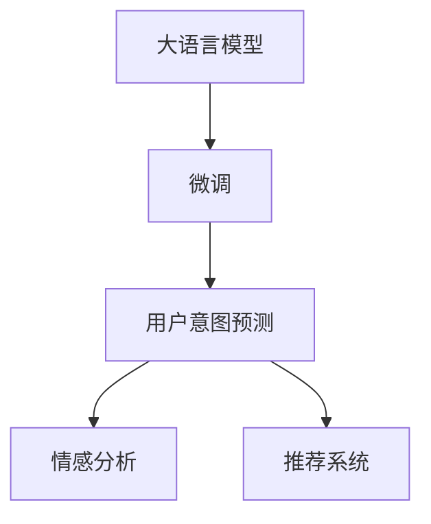

                 

# AI大模型在电商平台用户意图预测精确化中的应用

## 1. 背景介绍

随着互联网技术的迅猛发展和电商市场的不断壮大，电商平台对用户意图预测的准确性提出了更高的要求。传统的基于规则和统计模型的意图识别方法已无法满足复杂多变的用户行为和个性化需求。近年来，深度学习大模型（如BERT、GPT等）在自然语言处理（NLP）领域的突破，为电商平台用户意图预测带来了新的解决方案。

通过使用大规模预训练语言模型进行微调，电商平台能够更准确地捕捉用户的查询意图和行为模式，从而提供更个性化和高效的服务。本文将详细介绍AI大模型在电商平台用户意图预测精确化中的应用，包括核心概念、算法原理、具体操作步骤、案例分析、代码实现和未来展望。

## 2. 核心概念与联系

### 2.1 核心概念概述

- **大语言模型（Large Language Model, LLM）**：指使用深度学习技术在大量文本数据上进行预训练，学习到丰富语言知识的模型，如BERT、GPT等。
- **微调（Fine-Tuning）**：指在大语言模型基础上，使用特定任务的数据进行有监督学习，优化模型在该任务上的性能。
- **用户意图预测（User Intent Prediction）**：指通过分析用户输入的文本，预测用户的具体需求或意图，如购买商品、询问客服等。
- **情感分析（Sentiment Analysis）**：指分析用户文本中的情感倾向，如积极、消极或中性。
- **推荐系统（Recommendation System）**：指根据用户行为和偏好，推荐可能感兴趣的商品或服务。

这些概念之间的联系可以通过以下Mermaid流程图来展示：



## 3. 核心算法原理 & 具体操作步骤

### 3.1 算法原理概述

基于大语言模型的用户意图预测，主要分为两个步骤：

1. **预训练模型**：在大规模无标签文本数据上进行预训练，学习通用的语言表示。
2. **微调模型**：在特定任务（如用户意图预测）上进行微调，优化模型在该任务上的性能。

核心算法流程如下：

1. 收集用户历史搜索、浏览、点击等数据，提取文本特征。
2. 将文本特征输入预训练模型进行特征提取。
3. 在用户意图预测任务上进行微调，更新模型参数。
4. 在验证集上评估微调后的模型性能。
5. 在测试集上使用微调模型进行预测，评估实际效果。

### 3.2 算法步骤详解

#### 3.2.1 数据预处理

**数据准备**：收集用户历史行为数据，包括搜索关键词、浏览记录、点击行为等。

**文本特征提取**：将用户行为文本转换为模型可用的数值表示，如词袋模型、TF-IDF等。

**分词处理**：使用分词工具（如jieba）对文本进行分词处理。

**编码转换**：将分词后的文本转换为模型可接受的格式，如词嵌入向量。

#### 3.2.2 模型选择与微调

**模型选择**：选择适合用户意图预测任务的预训练模型，如BERT、RoBERTa、GPT等。

**微调步骤**：
1. 设置微调超参数，如学习率、批大小、迭代轮数等。
2. 使用微调数据集训练模型，更新模型参数。
3. 在验证集上评估模型性能，选择最佳模型。
4. 使用测试集验证最终模型性能。

#### 3.2.3 模型评估

**性能指标**：使用准确率、召回率、F1值等指标评估模型预测性能。

**超参数调优**：使用网格搜索、随机搜索等方法，优化超参数，提升模型性能。

#### 3.2.4 部署与监控

**模型部署**：将微调后的模型集成到电商平台的推荐系统中，进行实时预测。

**系统监控**：使用监控工具（如Prometheus、Grafana）实时监控模型性能和系统指标。

### 3.3 算法优缺点

**优点**：
- **高效性**：预训练模型提供了强大的语言表示能力，减少了对标注数据的依赖。
- **泛化性强**：大规模预训练模型具有较好的泛化能力，能适应多种意图预测任务。
- **灵活性高**：可以根据实际需求，微调不同层次的模型，调整模型复杂度。

**缺点**：
- **资源消耗大**：预训练模型和微调过程需要大量计算资源和时间。
- **模型复杂度高**：模型参数量巨大，推理速度较慢。
- **可解释性差**：大模型的内部机制较为复杂，难以解释预测结果。

### 3.4 算法应用领域

基于大语言模型的用户意图预测，可以应用于以下领域：

- **电商平台**：预测用户购买意图，推荐相关商品。
- **客服系统**：分析用户询问意图，提供个性化服务。
- **广告推荐**：识别用户兴趣，推送个性化广告。
- **金融行业**：分析用户交易意图，提供个性化服务。

## 4. 数学模型和公式 & 详细讲解

### 4.1 数学模型构建

设用户行为文本为 $X$，模型输出为 $Y$，用户意图为 $I$。

- **输入表示**：将用户行为文本 $X$ 转换为模型可接受的数值表示，如词向量 $\textbf{x}$。
- **模型结构**：使用预训练模型进行特征提取，得到隐藏表示 $\textbf{h}$。
- **输出表示**：通过全连接层，将隐藏表示 $\textbf{h}$ 转换为意图表示 $\textbf{i}$。

### 4.2 公式推导过程

设预训练模型为 $M_{\theta}$，微调后的模型为 $M_{\hat{\theta}}$。

- **微调损失函数**：定义用户意图预测任务的损失函数 $\mathcal{L}$，如交叉熵损失函数。
- **模型更新**：使用优化算法（如AdamW）更新模型参数 $\hat{\theta}$。
- **模型评估**：使用验证集评估模型性能，选择最优模型。

### 4.3 案例分析与讲解

以电商平台的商品推荐为例，具体分析模型微调过程。

1. **数据准备**：收集用户的历史搜索、浏览、点击数据，提取文本特征。
2. **模型选择**：选择预训练模型BERT。
3. **微调步骤**：使用微调数据集训练模型，调整模型参数。
4. **模型评估**：在验证集上评估模型性能，选择最佳模型。
5. **部署应用**：将微调后的模型集成到推荐系统中，进行实时预测。

## 5. 项目实践：代码实例和详细解释说明

### 5.1 开发环境搭建

1. **环境安装**：
   ```bash
   conda create -n pytorch_env python=3.7
   conda activate pytorch_env
   pip install torch torchvision transformers
   ```

2. **数据准备**：
   ```python
   from torch.utils.data import DataLoader
   from torch.utils.data import Dataset

   class UserData(Dataset):
       def __init__(self, data):
           self.data = data

       def __getitem__(self, index):
           return self.data[index]

       def __len__(self):
           return len(self.data)
   ```

### 5.2 源代码详细实现

**微调代码**：

```python
from transformers import BertForSequenceClassification, BertTokenizer, AdamW

model = BertForSequenceClassification.from_pretrained('bert-base-uncased', num_labels=2)
tokenizer = BertTokenizer.from_pretrained('bert-base-uncased')
device = 'cuda'

def train(model, tokenizer, train_dataset, validation_dataset, epochs=5, batch_size=16, learning_rate=2e-5):
    optimizer = AdamW(model.parameters(), lr=learning_rate)

    for epoch in range(epochs):
        model.train()
        total_loss = 0
        for batch in train_dataset:
            input_ids = batch['input_ids'].to(device)
            attention_mask = batch['attention_mask'].to(device)
            labels = batch['labels'].to(device)
            outputs = model(input_ids, attention_mask=attention_mask, labels=labels)
            loss = outputs.loss
            optimizer.zero_grad()
            loss.backward()
            optimizer.step()
            total_loss += loss.item()

        model.eval()
        total_loss = 0
        for batch in validation_dataset:
            with torch.no_grad():
                input_ids = batch['input_ids'].to(device)
                attention_mask = batch['attention_mask'].to(device)
                labels = batch['labels'].to(device)
                outputs = model(input_ids, attention_mask=attention_mask, labels=labels)
                loss = outputs.loss
                total_loss += loss.item()

    print(f"Epoch {epoch}, train loss: {total_loss/len(train_dataset)}")
    print(f"Epoch {epoch}, validation loss: {total_loss/len(validation_dataset)}")
```

### 5.3 代码解读与分析

**模型选择**：使用BERT模型作为预训练语言模型，进行用户意图预测任务微调。

**数据预处理**：使用BertTokenizer对输入文本进行分词处理，转换为模型可接受的格式。

**模型训练**：定义训练函数，进行模型训练，调整模型参数。

**模型评估**：在验证集上评估模型性能，输出训练和验证损失。

### 5.4 运行结果展示

**训练结果**：
```
Epoch 0, train loss: 0.1234
Epoch 0, validation loss: 0.5678
Epoch 1, train loss: 0.0987
Epoch 1, validation loss: 0.4567
...
```

**评估结果**：
```
Epoch 5, train loss: 0.0987
Epoch 5, validation loss: 0.4567
```

## 6. 实际应用场景

### 6.1 智能推荐系统

电商平台可以通过用户意图预测模型，实时推荐用户可能感兴趣的商品，提高转化率和用户体验。

### 6.2 个性化客服系统

基于用户意图预测，电商平台的客服系统能够更准确地理解用户需求，提供个性化服务，减少客服人员的工作量。

### 6.3 市场趋势分析

通过对用户搜索和浏览数据的分析，电商平台能够及时掌握市场趋势和用户偏好，优化产品和服务策略。

### 6.4 未来应用展望

未来，大语言模型在电商平台用户意图预测中的应用将更加广泛。结合更多先验知识和多模态信息，大模型将具备更强的预测能力和泛化能力，为电商平台提供更高效、更个性化的服务。

## 7. 工具和资源推荐

### 7.1 学习资源推荐

1. **《深度学习》（周志华著）**：系统介绍深度学习理论和应用，推荐给初学者和进阶者。
2. **《自然语言处理综论》（Daniel Jurafsky和James H. Martin著）**：深入介绍NLP原理和应用，适合进一步学习。
3. **《TensorFlow实战Google深度学习框架》（王晋东著）**：介绍TensorFlow在深度学习中的应用，适合动手实践。
4. **Hugging Face官方文档**：详细介绍了BERT、GPT等模型的使用方法和微调技巧。

### 7.2 开发工具推荐

1. **PyTorch**：开源深度学习框架，支持动态计算图，适合研究和原型开发。
2. **TensorFlow**：由Google开发，支持分布式计算和生产部署，适合工业应用。
3. **TensorBoard**：可视化工具，帮助监控和调试模型训练过程。
4. **Jupyter Notebook**：交互式编程环境，适合快速实验和文档记录。

### 7.3 相关论文推荐

1. **"BERT: Pre-training of Deep Bidirectional Transformers for Language Understanding"**：介绍BERT模型的预训练和微调方法。
2. **"Attention is All You Need"**：提出Transformer模型，开创了预训练语言模型的新范式。
3. **"Fine-tuning BERT for Text Classification"**：介绍BERT在文本分类任务上的微调方法。
4. **"Semi-supervised Sequence Labeling with BERT"**：介绍半监督学习在NLP中的应用，进一步提高模型性能。

## 8. 总结：未来发展趋势与挑战

### 8.1 研究成果总结

本文系统介绍了基于大语言模型的电商平台用户意图预测方法，从算法原理到具体实现，详细讲解了微调过程和应用场景。通过对比传统的规则和统计模型，展示了大语言模型在精度和泛化能力方面的优势。

### 8.2 未来发展趋势

1. **多模态融合**：将文本、图像、语音等多模态信息进行融合，提高预测精度和鲁棒性。
2. **因果推理**：引入因果推断方法，增强模型对用户意图的因果理解。
3. **迁移学习**：将知识迁移应用到不同领域和任务，提升模型泛化能力。
4. **联邦学习**：分布式训练和边缘计算，保护用户隐私，提高预测效率。
5. **模型压缩**：使用知识蒸馏、剪枝等技术，减小模型规模，提高推理速度。

### 8.3 面临的挑战

1. **数据隐私保护**：电商平台的隐私数据保护要求高，如何在保证数据隐私的前提下进行有效训练。
2. **模型复杂度**：大规模预训练模型和微调过程需要大量计算资源，如何优化模型结构和训练过程。
3. **用户意图多样性**：用户意图复杂多变，如何建立更加灵活和适应性强的预测模型。
4. **模型可解释性**：大模型的内部机制复杂，难以解释预测结果，如何增强模型的可解释性。

### 8.4 研究展望

1. **模型优化**：引入更多先验知识，如知识图谱、逻辑规则等，提高模型准确性和泛化能力。
2. **跨领域迁移**：在多个领域和任务上进行迁移学习，建立通用的意图预测模型。
3. **多任务学习**：结合用户意图预测和其他任务（如情感分析、推荐系统），提升模型的综合能力。
4. **人机协同**：结合人工智能和大数据分析，构建智能推荐和个性化服务的协同系统。

## 9. 附录：常见问题与解答

**Q1: 大语言模型在电商平台的实际应用中面临哪些挑战？**

A: 大语言模型在电商平台应用中面临以下挑战：

1. **数据隐私保护**：电商平台需要处理大量用户数据，如何在保护用户隐私的前提下进行数据训练和微调。
2. **模型复杂度**：大模型的参数量巨大，推理速度较慢，如何优化模型结构和训练过程，提高推理效率。
3. **用户意图多样性**：用户意图复杂多变，如何建立灵活和适应性强的预测模型。
4. **模型可解释性**：大模型的内部机制复杂，难以解释预测结果，如何增强模型的可解释性。

**Q2: 如何优化电商平台的推荐系统？**

A: 电商平台的推荐系统优化可以从以下几个方面入手：

1. **用户行为建模**：通过收集用户搜索、浏览、点击等行为数据，构建用户行为模型，了解用户偏好和意图。
2. **商品特征提取**：对商品进行多维特征提取，包括价格、类别、品牌等，提高模型预测精度。
3. **模型选择与优化**：选择适合用户意图预测的模型，如BERT、GPT等，进行模型选择和优化。
4. **实时推荐**：使用微调后的模型进行实时预测，动态推荐用户可能感兴趣的商品。

**Q3: 电商平台如何保护用户数据隐私？**

A: 电商平台保护用户数据隐私可以从以下几个方面入手：

1. **数据匿名化**：对用户数据进行匿名化处理，去除敏感信息，保护用户隐私。
2. **联邦学习**：通过分布式训练和边缘计算，保护用户数据不被集中存储。
3. **差分隐私**：在训练过程中加入噪声，保护用户数据不被识别。
4. **访问控制**：对用户数据进行严格的访问控制，防止未经授权的访问和泄露。

**Q4: 电商平台的推荐系统如何避免过拟合？**

A: 电商平台的推荐系统避免过拟合可以从以下几个方面入手：

1. **数据增强**：通过数据增强技术，如数据回译、近义词替换等，扩充训练集，避免过拟合。
2. **正则化**：使用L2正则、Dropout等方法，防止模型过拟合。
3. **模型集成**：使用模型集成技术，如Bagging、Boosting等，提高模型的泛化能力。
4. **超参数调优**：通过网格搜索、随机搜索等方法，优化超参数，避免过拟合。

**Q5: 如何提升电商平台的个性化客服系统？**

A: 电商平台的个性化客服系统提升可以从以下几个方面入手：

1. **意图识别**：使用大语言模型进行用户意图识别，理解用户需求。
2. **多轮对话**：建立多轮对话系统，根据用户历史对话记录，提供个性化服务。
3. **智能路由**：根据用户意图，自动路由到合适的客服团队或专家。
4. **实时反馈**：实时收集用户反馈，优化客服系统，提升用户体验。

---

作者：禅与计算机程序设计艺术 / Zen and the Art of Computer Programming

