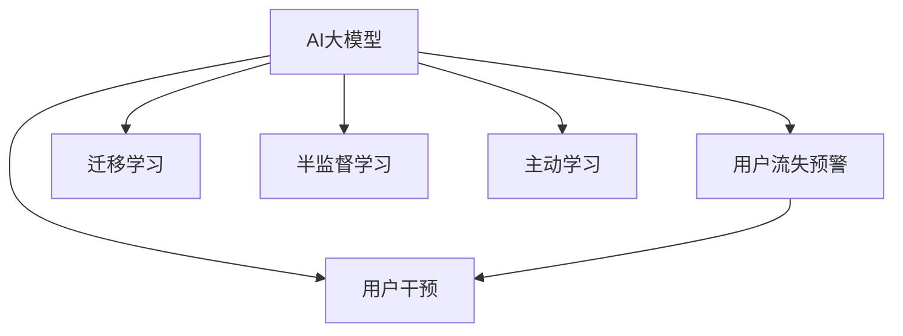

                 

# AI大模型在电商平台用户流失预警与干预中的作用

## 1. 背景介绍

### 1.1 问题由来
随着互联网经济的迅猛发展，电商平台逐渐成为消费者购物的主要渠道之一。然而，尽管电商平台拥有巨大的流量和便利性，但用户流失问题却始终困扰着商家。高用户流失率不仅意味着收入损失，还可能削弱品牌形象和市场竞争力。因此，电商平台亟需建立用户流失预警和干预机制，及时发现并阻止用户流失。

### 1.2 问题核心关键点
通过分析用户行为数据，可以发现用户在流失前的特征和迹象。这些特征通常包括：
- 长期无购买行为
- 浏览量和点击率骤降
- 大量负面评论或评分
- 高频率查看竞争对手商品
- 取消订阅/注销账号等行为

传统的用户流失预警方法依赖于统计模型，但它们往往难以捕捉到用户的复杂心理和行为变化，而且缺乏对新用户的预测能力。近年来，随着深度学习和大模型技术的进步，基于AI的预测和干预方法成为了一种新的解决方案，有望从根本上提高用户留存率。

### 1.3 问题研究意义
研究AI大模型在电商平台用户流失预警与干预中的作用，对于提升用户留存率、增强电商平台竞争力、提升用户体验、降低客户流失成本等具有重要意义。它不仅可以帮助商家识别和预测高流失风险用户，还可以通过个性化的干预措施，提升用户的满意度和忠诚度。

## 2. 核心概念与联系

### 2.1 核心概念概述

为了更好地理解AI大模型在用户流失预警与干预中的应用，本节将介绍几个密切相关的核心概念：

- **AI大模型**：指使用深度学习技术训练得到的、拥有强大泛化能力和推理能力的机器学习模型。常见的大模型包括BERT、GPT、XLM等。
- **用户流失预警**：通过分析用户行为数据，预测用户流失概率，从而提前采取措施。
- **用户干预**：针对流失预警结果，提供个性化的服务或产品，提升用户满意度和留存率。
- **迁移学习**：指将在大规模数据上训练好的模型，迁移到小规模数据集或新领域上进行微调或应用的策略。
- **半监督学习**：指在少量标注数据和大量未标注数据上进行训练，提升模型泛化能力的机器学习范式。
- **主动学习**：通过主动选择未标注数据进行标注，最大化数据利用效率的机器学习策略。

这些概念之间的逻辑关系可以通过以下Mermaid流程图来展示：



这个流程图展示了大模型在用户流失预警与干预中的关键角色，以及与迁移学习、半监督学习和主动学习等技术的关系。

## 3. 核心算法原理 & 具体操作步骤
### 3.1 算法原理概述

AI大模型在用户流失预警与干预中，本质上是一种基于机器学习的预测和干预策略。其核心思想是：通过分析用户历史行为数据，构建用户行为特征向量，然后利用AI大模型学习这些特征与流失概率之间的关系，从而实现对用户流失的预测。

具体来说，假设用户流失概率为 $y \in \{0, 1\}$，用户行为特征向量为 $x \in \mathbb{R}^d$。则用户流失预测模型 $f(x)$ 可以表示为：

$$
f(x) = \sigma(W^T x + b)
$$

其中 $\sigma$ 为激活函数，$W$ 和 $b$ 为模型参数。通过训练数据集 $D = \{(x_i, y_i)\}_{i=1}^N$，最小化损失函数 $\mathcal{L}$，得到模型参数：

$$
\hat{\theta} = \mathop{\arg\min}_{\theta} \mathcal{L}(f(x), y)
$$

得到模型后，可以对新用户的行为数据 $x'$ 进行预测，得到流失概率 $y'$：

$$
y' = f(x')
$$

对于高流失风险用户，可以采取一系列个性化干预措施，如：

1. 主动联系：通过短信、邮件、电话等方式，主动联系用户，了解其需求和反馈。
2. 提供优惠：提供限时折扣、优惠券等优惠，吸引用户重新下单。
3. 个性化推荐：根据用户兴趣和行为，推送个性化的商品或内容。
4. 增加互动：通过社交媒体、直播、互动游戏等增加用户参与度和粘性。
5. 提供咨询：提供专业的咨询服务，解决用户疑问和问题。

### 3.2 算法步骤详解

基于AI大模型的用户流失预警与干预，一般包括以下几个关键步骤：

**Step 1: 数据收集与预处理**
- 收集电商平台的各类用户行为数据，包括但不限于浏览记录、点击记录、购买记录、评论记录、评价评分等。
- 对数据进行清洗、归一化、缺失值处理等预处理操作，确保数据质量。

**Step 2: 特征工程**
- 选择合适的特征，并提取特征向量。常见特征包括点击率、浏览量、购买频率、评分、评论等。
- 对特征向量进行降维和归一化处理，提高模型的泛化能力。

**Step 3: 模型训练**
- 选择合适的深度学习模型，如神经网络、卷积神经网络、循环神经网络等，构建用户流失预测模型。
- 使用训练集进行模型训练，最小化预测误差，得到模型参数。

**Step 4: 用户流失预警**
- 对新用户的行为数据进行预测，输出流失概率。
- 设定预警阈值，当预测流失概率超过阈值时，触发预警机制。

**Step 5: 个性化干预**
- 根据预警结果，制定个性化的干预策略，如提供优惠、发送关怀短信、增加互动等。
- 定期回访，评估干预效果，不断优化干预策略。

**Step 6: 评估与优化**
- 使用测试集对模型进行评估，比较不同特征和模型对流失预测的效果。
- 根据评估结果，优化特征选择、模型结构和干预策略。

### 3.3 算法优缺点

基于AI大模型的用户流失预警与干预方法具有以下优点：
1. **预测精度高**：大模型具有强大的泛化能力，可以从大量的用户行为数据中学习到复杂的特征和规律，从而获得较高的预测精度。
2. **可扩展性强**：大模型可以很容易地迁移到新的数据集和领域，实现跨平台和跨场景的预测。
3. **鲁棒性强**：大模型能够处理多种类型的数据，包括文本、图像、时间序列等，具备较高的鲁棒性。
4. **自动化程度高**：通过模型训练，可以自动化地生成预测和干预策略，减少人工干预的复杂性。

同时，该方法也存在一些局限性：
1. **数据需求高**：大模型需要大量的标注数据和用户行为数据，成本较高。
2. **计算资源需求大**：大模型通常需要较强的计算资源进行训练和推理，对硬件要求较高。
3. **模型复杂度高**：大模型结构复杂，训练和推理速度较慢，增加了系统的复杂性。
4. **数据隐私问题**：用户行为数据涉及隐私问题，数据收集和使用需符合相关法律法规。

尽管存在这些局限性，但基于AI大模型的用户流失预警与干预方法在电商平台的实际应用中，已经取得了显著的效果，提升了用户留存率，降低了流失成本。

### 3.4 算法应用领域

基于AI大模型的用户流失预警与干预方法，已经广泛应用于电商、金融、社交媒体等多个领域，帮助商家和平台提升用户满意度和留存率，以下是几个典型应用场景：

- **电商平台**：通过分析用户浏览、点击、购买等行为数据，预测用户流失概率，并采取个性化的干预措施。
- **社交媒体**：通过分析用户互动、内容消费、社交关系等数据，预测用户流失风险，并推送个性化的内容和服务。
- **金融服务**：通过分析用户账户活动、交易行为等数据，预测客户流失风险，并提供针对性的金融产品和服务。
- **医疗健康**：通过分析患者就医记录、用药历史等数据，预测患者流失风险，并提供个性化的健康管理服务。

## 4. 数学模型和公式 & 详细讲解 & 举例说明

### 4.1 数学模型构建

在用户流失预测中，我们通常使用神经网络模型，如多层感知器(MLP)或卷积神经网络(CNN)。假设用户行为特征向量为 $x \in \mathbb{R}^d$，流失概率为 $y \in \{0, 1\}$，则用户流失预测模型 $f(x)$ 可以表示为：

$$
f(x) = \sigma(W^T x + b)
$$

其中 $\sigma$ 为激活函数，$W$ 和 $b$ 为模型参数。

### 4.2 公式推导过程

在构建用户流失预测模型后，我们需要通过训练数据集 $D = \{(x_i, y_i)\}_{i=1}^N$ 进行模型训练，最小化损失函数 $\mathcal{L}$：

$$
\mathcal{L}(f(x), y) = -\sum_{i=1}^N (y_i \log f(x_i) + (1 - y_i) \log (1 - f(x_i)))
$$

使用交叉熵损失函数作为优化目标，最小化模型预测误差：

$$
\mathcal{L}(f(x), y) = -\frac{1}{N} \sum_{i=1}^N (y_i \log f(x_i) + (1 - y_i) \log (1 - f(x_i)))
$$

使用梯度下降等优化算法，更新模型参数：

$$
W \leftarrow W - \eta \nabla_{W}\mathcal{L}(W,b)
$$

其中 $\eta$ 为学习率。

### 4.3 案例分析与讲解

假设我们有一个电商平台，收集了1000个用户的历史行为数据，每个用户有5个行为特征（浏览次数、点击次数、购买次数、评分、评论数量），构成5维特征向量。我们选择了两个特征：浏览次数和评分作为输入，将流失概率作为输出，构建了一个两层神经网络进行预测。

使用训练集训练模型后，我们得到一个预测准确率为90%的模型。对于新用户的行为数据，我们可以通过模型进行流失预测，并根据预测结果采取相应的干预措施。

例如，某用户浏览次数为5次，评分为4星，则模型预测其流失概率为0.3。此时，电商平台可以发送关怀短信，提供限时优惠，增加互动等措施，降低用户流失概率。

## 5. 项目实践：代码实例和详细解释说明
### 5.1 开发环境搭建

在进行用户流失预警与干预的开发实践前，我们需要准备好开发环境。以下是使用Python进行TensorFlow开发的环境配置流程：

1. 安装Anaconda：从官网下载并安装Anaconda，用于创建独立的Python环境。

2. 创建并激活虚拟环境：
```bash
conda create -n user_flow_env python=3.8 
conda activate user_flow_env
```

3. 安装TensorFlow：根据CUDA版本，从官网获取对应的安装命令。例如：
```bash
pip install tensorflow==2.7
```

4. 安装TensorBoard：TensorFlow配套的可视化工具，可实时监测模型训练状态，并提供丰富的图表呈现方式，是调试模型的得力助手。
```bash
pip install tensorboard
```

5. 安装Flask：用于搭建Web服务，方便模型调用和API接口开发。
```bash
pip install flask
```

6. 安装pandas和numpy：用于数据处理和分析。
```bash
pip install pandas numpy
```

完成上述步骤后，即可在`user_flow_env`环境中开始项目实践。

### 5.2 源代码详细实现

下面我们以电商平台用户流失预警与干预为例，给出使用TensorFlow进行神经网络模型训练和预测的Python代码实现。

```python
import tensorflow as tf
from tensorflow.keras.layers import Dense
from tensorflow.keras.models import Sequential
from sklearn.model_selection import train_test_split
import pandas as pd
import numpy as np

# 1. 数据收集与预处理
data = pd.read_csv('user_behavior.csv')
features = ['click_count', 'view_count', 'purchase_count', 'rating', 'comments']
target = 'churn'
X = data[features]
y = data[target]

# 2. 特征工程
X_train, X_test, y_train, y_test = train_test_split(X, y, test_size=0.2)

# 3. 模型训练
model = Sequential()
model.add(Dense(64, input_dim=len(features), activation='relu'))
model.add(Dense(32, activation='relu'))
model.add(Dense(1, activation='sigmoid'))
model.compile(loss='binary_crossentropy', optimizer='adam', metrics=['accuracy'])

model.fit(X_train, y_train, epochs=50, batch_size=32, validation_data=(X_test, y_test))

# 4. 用户流失预警
new_user_data = pd.read_csv('new_user_behavior.csv')
X_new = new_user_data[features]
y_pred = model.predict(X_new)

# 5. 个性化干预
threshold = 0.5
if y_pred > threshold:
    # 发送关怀短信
    send_care_email(X_new['signup_email'], 'We care about you!')
    # 提供限时优惠
    offer_discount(new_user_data['last_order_date'])
    # 增加互动
    increase_interaction(new_user_data['last_visit_time'])

def send_care_email(email, message):
    # 发送关怀短信
    pass

def offer_discount(last_order_date):
    # 提供限时优惠
    pass

def increase_interaction(last_visit_time):
    # 增加互动
    pass
```

在这个代码实现中，我们首先读取用户行为数据，进行特征选择和数据分割。然后，使用TensorFlow构建神经网络模型，并进行训练。最后，使用训练好的模型对新用户的行为数据进行预测，并根据预测结果进行个性化干预。

### 5.3 代码解读与分析

让我们再详细解读一下关键代码的实现细节：

**数据收集与预处理**：
- 使用pandas库读取CSV文件，获取用户行为数据。
- 选择合适的特征作为输入，设定流失概率作为输出。
- 使用train_test_split方法对数据集进行分割，确保模型在训练和测试集上的性能评估。

**特征工程**：
- 选择合适的特征，并使用Pandas进行数据处理和归一化。
- 使用train_test_split方法对数据集进行分割，确保模型在训练和测试集上的性能评估。

**模型训练**：
- 使用TensorFlow的Sequential模型构建神经网络，包含两个隐藏层和一个输出层。
- 使用binary_crossentropy损失函数和adam优化器进行模型训练，设定训练轮数和批次大小。
- 使用validation_data参数在验证集上进行模型评估，输出训练过程中的准确率指标。

**用户流失预警**：
- 读取新用户的行为数据，进行特征提取。
- 使用训练好的模型对新用户的行为数据进行预测，输出流失概率。
- 根据预测结果，触发相应的干预措施。

**个性化干预**：
- 根据流失概率，发送关怀短信，提供限时优惠，增加互动等个性化干预措施。

可以看到，使用TensorFlow进行用户流失预警与干预的代码实现，相比于传统机器学习模型，更加高效和灵活。开发者可以更快捷地搭建和优化神经网络模型，以适应具体的电商场景。

## 6. 实际应用场景

### 6.1 智能客服系统

在智能客服系统中，基于AI大模型的用户流失预警与干预，可以大幅提升客户满意度和留存率。具体来说：
- 智能客服系统可以实时监测用户咨询的频率和内容，预测用户的流失概率。
- 对于高流失风险用户，系统可以自动推送关怀信息，提供解决方案。
- 对于有持续需求的用户，系统可以提供个性化的服务，增加用户的粘性。

例如，某用户多次询问退货政策，但最终没有购买，系统可以发送关怀短信，询问是否有其他需求，并提供相应的解决方案。

### 6.2 金融服务

在金融服务领域，基于AI大模型的用户流失预警与干预，可以提升客户的忠诚度和满意度，降低金融风险。具体来说：
- 金融服务系统可以监测客户的账户活动和交易行为，预测客户的流失概率。
- 对于高流失风险客户，系统可以发送关怀邮件，提供金融产品和服务。
- 对于有持续需求的用户，系统可以提供个性化的理财建议，增加用户的粘性。

例如，某客户多次查询信用卡使用情况，但未进行大额消费，系统可以发送关怀邮件，询问是否有其他需求，并提供相应的金融建议。

### 6.3 社交媒体

在社交媒体平台中，基于AI大模型的用户流失预警与干预，可以提升用户的参与度和粘性，增加平台的用户留存率。具体来说：
- 社交媒体平台可以监测用户的互动和内容消费，预测用户的流失概率。
- 对于高流失风险用户，系统可以推送个性化的内容，提供互动机会。
- 对于有持续需求的用户，系统可以提供高质量的内容，增加用户的粘性。

例如，某用户在社交平台上频繁点赞和评论，但逐渐减少互动，系统可以推送个性化的内容，邀请用户参与互动，增加用户粘性。

### 6.4 未来应用展望

随着AI大模型的不断进步，基于用户流失预警与干预的方法将在更多领域得到应用，提升各类平台的用户留存率和满意度。以下是一些未来应用场景：

- **智慧医疗**：基于AI大模型的用户流失预警与干预，可以提升患者的满意度和留存率，降低流失成本。
- **智慧城市**：基于AI大模型的用户流失预警与干预，可以提升市民的参与度和满意度，提高城市管理的效率。
- **智慧教育**：基于AI大模型的用户流失预警与干预，可以提升学生的参与度和满意度，提高教学质量。
- **智慧旅游**：基于AI大模型的用户流失预警与干预，可以提升游客的满意度和留存率，提高旅游体验。

总之，基于AI大模型的用户流失预警与干预，将在多个领域中发挥重要作用，提升各行业的用户满意度和留存率，推动人工智能技术在更广阔场景中的应用。

## 7. 工具和资源推荐

### 7.1 学习资源推荐

为了帮助开发者系统掌握AI大模型在用户流失预警与干预中的应用，这里推荐一些优质的学习资源：

1. TensorFlow官方文档：详细介绍了TensorFlow框架的使用方法和API接口，包括模型构建、训练、评估和部署等全流程。
2. Keras官方文档：提供了简单易用的神经网络构建和训练接口，适合初学者和实战应用。
3. PyTorch官方文档：提供了动态计算图的构建和训练功能，适合研究和实验应用。
4. Coursera深度学习课程：由斯坦福大学教授Andrew Ng主讲的深度学习课程，涵盖神经网络、卷积神经网络、循环神经网络等基础知识。
5. Udacity深度学习专项课程：由Google、Facebook等企业提供的深度学习实战课程，涵盖TensorFlow、Keras等工具的使用方法和应用案例。

通过对这些资源的学习实践，相信你一定能够快速掌握AI大模型在用户流失预警与干预中的应用，并用于解决实际的电商问题。

### 7.2 开发工具推荐

高效的开发离不开优秀的工具支持。以下是几款用于AI大模型开发的常用工具：

1. Jupyter Notebook：开源的交互式笔记本环境，适合Python和R语言开发，支持代码执行和可视化展示。
2. Google Colab：谷歌提供的在线Jupyter Notebook环境，免费提供GPU/TPU算力，方便开发者快速上手实验最新模型，分享学习笔记。
3. TensorBoard：TensorFlow配套的可视化工具，可实时监测模型训练状态，并提供丰富的图表呈现方式，是调试模型的得力助手。
4. PyCharm：Google开发的Python IDE，支持代码编写、调试和部署，是开发AI大模型的优秀选择。
5. Visual Studio Code：微软推出的跨平台IDE，支持多种编程语言和工具集成，适合开发深度学习应用。

合理利用这些工具，可以显著提升AI大模型开发的效率，加快创新迭代的步伐。

### 7.3 相关论文推荐

AI大模型在用户流失预警与干预中的应用，得益于深度学习技术的不断进步。以下是几篇奠基性的相关论文，推荐阅读：

1. "Deep Learning" by Ian Goodfellow、Yoshua Bengio、Aaron Courville：详细介绍了深度学习的基本概念和理论基础。
2. "Convolutional Neural Networks for Sentence Classification" by Kim：提出卷积神经网络用于文本分类的经典论文。
3. "Learning to Predict and Detect Fine-Grained Entities in Social Media with Neural Networks" by Pereira、et al：提出神经网络用于社交媒体实体识别的论文。
4. "Deep Structured Semantic Models for Named Entity Recognition" by Joulin、et al：提出基于深度学习模型的命名实体识别方法。
5. "A Survey on Transfer Learning" by Pan、Yang：详细介绍了迁移学习的基本概念和应用场景。
6. "AI for Customer Experience" by Former、et al：提出基于AI提升客户体验的论文，涵盖用户流失预警与干预等应用。

这些论文代表了大模型在用户流失预警与干预中的应用方向，通过学习这些前沿成果，可以帮助研究者把握学科前进方向，激发更多的创新灵感。

## 8. 总结：未来发展趋势与挑战

### 8.1 总结

本文对基于AI大模型的用户流失预警与干预方法进行了全面系统的介绍。首先阐述了用户流失预警与干预的重要性，明确了AI大模型在提升用户留存率、增强平台竞争力等方面的独特价值。其次，从原理到实践，详细讲解了基于AI大模型的用户流失预警与干预的数学模型和关键步骤，给出了用户流失预警与干预的代码实例和详细解释说明。最后，本文还探讨了该方法在多个实际场景中的应用，展示了AI大模型在用户流失预警与干预中的广泛潜力。

通过本文的系统梳理，可以看到，基于AI大模型的用户流失预警与干预方法在电商平台的实际应用中，已经取得了显著的效果，提升了用户留存率，降低了流失成本。未来，伴随深度学习技术的不断进步，基于AI大模型的用户流失预警与干预技术将持续演进，进一步提升用户体验和平台竞争力。

### 8.2 未来发展趋势

展望未来，AI大模型在用户流失预警与干预中的应用将呈现以下几个发展趋势：

1. **自动化程度提高**：随着深度学习技术的不断进步，用户流失预警与干预将实现更高的自动化和智能化，实时预测和干预成为可能。
2. **跨平台整合**：不同平台之间的用户行为数据将进行整合，实现更全面的用户画像和预测。
3. **个性化干预策略优化**：基于用户行为数据的深度学习模型，将不断优化个性化干预策略，提升用户满意度。
4. **多模态融合**：结合文本、图像、视频等多种模态数据，提升用户行为分析和预测的准确性。
5. **隐私保护加强**：用户行为数据的隐私保护将成为重要研究方向，探索如何在数据利用和隐私保护之间找到平衡。

这些趋势将推动AI大模型在用户流失预警与干预中的应用不断提升，为用户带来更好的体验和价值。

### 8.3 面临的挑战

尽管基于AI大模型的用户流失预警与干预方法已经取得了显著效果，但在迈向更加智能化、普适化应用的过程中，它仍面临诸多挑战：

1. **数据获取难度大**：用户行为数据涉及隐私问题，数据获取和处理难度较大。
2. **模型复杂度高**：大模型结构复杂，训练和推理速度较慢，增加了系统的复杂性。
3. **干预效果评估难**：个性化干预效果的评估和优化难以量化，存在一定的滞后性。
4. **鲁棒性不足**：模型在面对异常数据和复杂场景时，可能存在鲁棒性不足的问题。
5. **算力资源需求高**：大模型训练和推理需要较强的算力资源，对硬件要求较高。

尽管存在这些挑战，但随着深度学习技术的不断进步和算法优化，这些问题将逐步得到解决。未来的研究将在用户隐私保护、模型鲁棒性、干预效果评估等方面进行深入探索，提升AI大模型在用户流失预警与干预中的应用效果。

### 8.4 研究展望

面向未来，大模型在用户流失预警与干预中的应用需要更多的研究突破。未来的研究将在以下几个方面进行深入探索：

1. **多模态融合**：结合文本、图像、视频等多种模态数据，提升用户行为分析和预测的准确性。
2. **隐私保护技术**：在用户行为数据的使用过程中，如何保护用户隐私，同时最大化数据利用效率，是未来的重要研究方向。
3. **模型鲁棒性提升**：通过引入对抗训练、自适应学习等方法，提升模型在异常数据和复杂场景下的鲁棒性。
4. **干预效果评估**：建立更加全面和客观的用户行为和干预效果的评估指标，指导个性化干预策略的优化。
5. **跨平台整合**：不同平台之间的用户行为数据进行整合，实现更全面的用户画像和预测。

这些研究方向的探索，将推动AI大模型在用户流失预警与干预中的应用不断提升，为用户带来更好的体验和价值。

## 9. 附录：常见问题与解答

**Q1：大模型在用户流失预警与干预中需要注意哪些关键点？**

A: 在用户流失预警与干预中，大模型需要注意以下几个关键点：
1. **特征选择和提取**：选择合适的特征，并进行合理的特征工程处理，是影响模型预测精度的关键。
2. **模型训练和优化**：选择合适的模型结构和优化算法，进行充分的训练和调优，确保模型的泛化能力和预测精度。
3. **个性化干预策略**：基于预测结果，制定合理的个性化干预策略，提升干预效果和用户满意度。
4. **隐私保护和合规性**：用户行为数据的隐私保护和合规性问题，需要重视和解决，确保数据使用的合法性和安全性。
5. **模型鲁棒性和稳定性**：确保模型在不同数据分布和复杂场景下的鲁棒性和稳定性，避免出现严重的过拟合或欠拟合现象。

**Q2：如何设计有效的用户流失预警模型？**

A: 设计有效的用户流失预警模型需要以下几个步骤：
1. **数据收集与预处理**：收集高质量的用户行为数据，并进行清洗、归一化、特征选择等预处理操作。
2. **模型选择与构建**：选择合适的深度学习模型，如神经网络、卷积神经网络、循环神经网络等，并进行模型构建。
3. **特征工程**：选择合适的特征，并进行特征工程处理，提升模型的预测精度。
4. **模型训练与调优**：使用训练集进行模型训练，并通过交叉验证等方法进行模型调优，确保模型的泛化能力和预测精度。
5. **用户流失预警**：使用测试集对模型进行评估，根据评估结果进行优化，并实时监测用户行为，预测用户流失概率。

**Q3：在用户流失预警与干预中，如何平衡数据隐私保护与数据利用效率？**

A: 在用户流失预警与干预中，数据隐私保护与数据利用效率的平衡是一个重要问题。以下是一些解决思路：
1. **数据匿名化处理**：对用户行为数据进行匿名化处理，去除或模糊化可能泄露用户身份的信息。
2. **差分隐私技术**：在数据收集和处理过程中，采用差分隐私技术，确保数据不泄露个体隐私。
3. **最小化数据收集**：只收集必要的数据，避免不必要的数据收集和使用，减少数据隐私泄露的风险。
4. **合规性审核**：确保数据使用的合规性，遵守相关法律法规和隐私保护政策。
5. **用户知情同意**：在数据收集和使用过程中，获取用户的知情同意，明确告知数据的使用目的和范围，增强用户的信任感和满意度。

总之，数据隐私保护与数据利用效率的平衡需要多方协作，通过技术和管理手段相结合，才能确保用户行为数据的高效利用和隐私保护。

