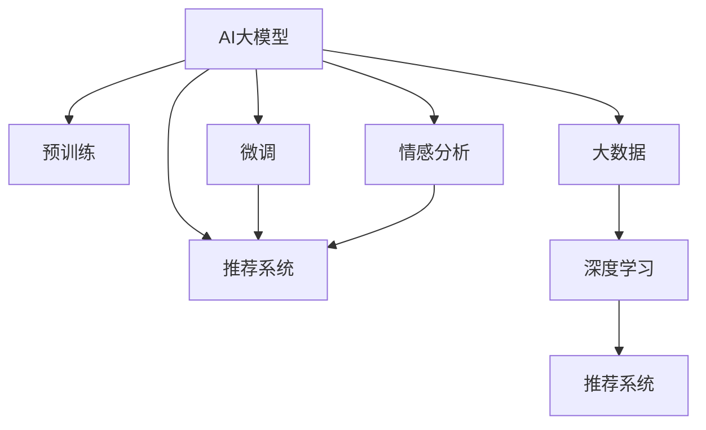

                 

# AI大模型在电商平台用户满意度预测与服务质量提升中的作用

> 关键词：AI大模型, 电商平台, 用户满意度预测, 服务质量提升, 推荐系统, 自然语言处理(NLP), 深度学习, 大数据

## 1. 背景介绍

### 1.1 问题由来

近年来，随着电子商务的迅速发展，电商平台的用户满意度和服务质量已经成为企业获取竞争优势的关键因素。然而，传统的数据驱动的方法在处理海量用户反馈时，面临维度高、数据稀疏、特征多变等挑战。与此同时，人工智能(AI)大模型的发展为电商平台用户满意度预测和服务质量提升提供了新的可能。

AI大模型，尤其是预训练语言模型，通过在大规模文本数据上进行训练，可以学习到丰富的语言知识，具备强大的自然语言处理(NLP)能力。这些模型被广泛应用于推荐系统、情感分析、客户服务等多个领域，对电商平台的用户满意度和服务质量进行了有效的预测和提升。

### 1.2 问题核心关键点

AI大模型在电商平台用户满意度预测和服务质量提升中的应用，主要体现在以下几个关键点上：

- 数据处理与分析：AI大模型能够处理海量、多模态的用户反馈数据，从中提取有价值的信息，并进行聚类、分类、关联等分析。
- 模型构建与训练：利用预训练语言模型作为基础，进行微调或自定义训练，以适应特定电商平台的业务需求。
- 预测与决策：通过模型对用户反馈、行为数据进行实时分析和预测，提供个性化的服务推荐和质量管理。
- 优化与迭代：根据预测结果和用户反馈，不断优化模型和推荐策略，提升电商平台的整体服务质量。

这些核心关键点相互关联，共同构成了AI大模型在电商平台中的应用框架，有助于提高用户的购物体验和服务满意度，同时为电商平台创造更高的商业价值。

### 1.3 问题研究意义

研究AI大模型在电商平台中的应用，对于电商平台运营商而言，具有重要的现实意义：

- 提高用户体验：通过精准预测用户满意度，电商平台能够及时发现并解决用户问题，提升用户的购物体验。
- 优化服务质量：基于大模型的实时分析，电商平台可以动态调整服务策略，提高服务质量。
- 增强竞争力：通过个性化推荐和质量管理，电商平台能够更好地满足用户需求，增强市场竞争力。
- 促进数据驱动决策：AI大模型能够从海量数据中提炼出有价值的洞察，辅助管理决策，优化运营效率。

## 2. 核心概念与联系

### 2.1 核心概念概述

为更好地理解AI大模型在电商平台中的应用，本节将介绍几个密切相关的核心概念：

- AI大模型：以自回归模型（如GPT）或自编码模型（如BERT）为代表的、通过大规模无标签数据进行预训练的语言模型。
- 预训练：在大规模无标签文本数据上进行自监督学习任务，学习通用的语言表示。
- 微调：在预训练模型的基础上，使用特定任务的有标签数据进行有监督学习，优化模型在该任务上的性能。
- 推荐系统：基于用户行为和偏好数据，推荐用户可能感兴趣的商品和服务。
- 情感分析：通过自然语言处理技术，识别和分析用户文本数据中的情感倾向。
- 大数据：指以数据为对象进行收集、存储、分析和应用的技术体系。
- 深度学习：一种基于神经网络，模拟人类神经系统的学习方式，用于处理复杂数据和高维度特征的机器学习技术。

这些核心概念之间的逻辑关系可以通过以下Mermaid流程图来展示：



这个流程图展示了AI大模型与电商平台的推荐系统、情感分析、大数据和深度学习之间的联系，共同构成了电商平台用户满意度预测和服务质量提升的技术基础。

## 3. 核心算法原理 & 具体操作步骤

### 3.1 算法原理概述

AI大模型在电商平台用户满意度预测与服务质量提升中的核心算法原理，主要基于自然语言处理(NLP)技术，通过深度学习模型对用户反馈数据进行建模和分析。

具体来说，算法原理可以概括为以下几个步骤：

1. 数据收集与预处理：收集电商平台的用户反馈数据、行为数据等，进行文本清洗、分词、标注等预处理操作，构建特征表示。
2. 模型训练与微调：利用预训练语言模型作为初始化参数，在标注数据上微调模型，使其能够预测用户满意度和服务质量。
3. 情感分析与特征提取：通过情感分析技术，对用户反馈文本进行情感倾向的识别，提取情感特征。
4. 推荐系统构建：结合用户行为数据和情感特征，构建推荐模型，进行个性化推荐。
5. 预测与质量管理：实时分析用户反馈，预测用户满意度，根据预测结果优化服务质量，提供个性化的服务体验。

### 3.2 算法步骤详解

基于上述算法原理，AI大模型在电商平台中的具体操作步骤可以分为以下几个阶段：

#### 3.2.1 数据收集与预处理

1. **数据来源**：收集电商平台的文本数据、用户行为数据、商品评价数据等。
2. **数据清洗**：去除噪声、过滤无用信息，如拼写错误、格式问题等。
3. **数据标注**：对数据进行标注，如情感分类、用户满意度打分等。
4. **特征工程**：提取文本特征（如TF-IDF、Word2Vec等）和行为特征（如点击率、浏览时间等）。

#### 3.2.2 模型训练与微调

1. **模型选择**：选择适合的预训练模型，如BERT、GPT-2等。
2. **模型微调**：在标注数据上微调模型，优化模型参数。
3. **验证与优化**：在验证集上评估模型性能，调整超参数。
4. **模型保存**：保存训练好的模型，供后续预测和推理使用。

#### 3.2.3 情感分析与特征提取

1. **情感分析**：使用情感分析模型识别用户反馈中的情感倾向。
2. **情感特征提取**：根据情感分析结果，提取情感特征，如情感强度、情感类别等。
3. **特征融合**：将情感特征与其他特征（如用户行为特征、商品属性特征等）进行融合，构建综合特征向量。

#### 3.2.4 推荐系统构建

1. **模型选择**：选择适合的推荐模型，如协同过滤、深度学习推荐模型等。
2. **模型训练**：在训练集上训练推荐模型，调整模型参数。
3. **验证与优化**：在验证集上评估模型性能，调整超参数。
4. **模型部署**：将训练好的模型部署到生产环境中，进行实时推荐。

#### 3.2.5 预测与质量管理

1. **实时预测**：对新的用户反馈进行实时情感分析和预测。
2. **服务优化**：根据预测结果，优化商品推荐、客服服务、物流配送等服务质量。
3. **反馈循环**：将用户对服务优化的反馈再次输入到模型中，进行进一步迭代优化。

### 3.3 算法优缺点

AI大模型在电商平台中的应用，具有以下优点：

1. **处理大规模数据**：AI大模型能够处理海量用户反馈数据，从中提取有价值的洞察。
2. **自动化特征提取**：利用预训练语言模型自动提取文本特征，减少人工干预。
3. **实时预测与优化**：实时分析和预测用户满意度，快速响应用户需求，提升服务质量。
4. **跨领域迁移能力**：大模型具备良好的跨领域迁移能力，能够适应不同电商平台的业务需求。

同时，AI大模型也存在一些缺点：

1. **数据隐私问题**：电商平台需要收集大量用户数据，存在隐私泄露的风险。
2. **模型复杂度**：大模型通常具有高维参数，计算复杂度较高。
3. **对抗性攻击**：大模型易受对抗性样本攻击，可能影响预测结果的准确性。
4. **模型解释性不足**：大模型的决策过程较复杂，难以解释。
5. **依赖高质量标注数据**：模型的性能高度依赖于标注数据的数量和质量。

### 3.4 算法应用领域

AI大模型在电商平台中的应用，主要体现在以下几个领域：

1. **用户满意度预测**：通过分析用户反馈，预测用户满意度，及时发现并解决用户问题。
2. **个性化推荐系统**：结合用户行为数据和情感特征，提供个性化的商品和服务推荐。
3. **情感分析与舆情监测**：对用户评论和反馈进行情感分析，识别负面舆情，优化服务质量。
4. **客户服务与智能客服**：利用大模型构建智能客服系统，提升客服响应速度和质量。
5. **广告投放与营销策略优化**：分析用户反馈和行为数据，优化广告投放策略，提升广告效果。
6. **物流配送与供应链管理**：通过实时分析用户反馈，优化物流配送和供应链管理。

这些应用领域覆盖了电商平台的各个方面，有助于提升用户满意度和服务质量，同时为电商平台创造更高的商业价值。

## 4. 数学模型和公式 & 详细讲解 & 举例说明

### 4.1 数学模型构建

AI大模型在电商平台中的数学模型构建，主要基于自然语言处理(NLP)和深度学习。假设电商平台收集到用户反馈数据 $D=\{(x_i, y_i)\}_{i=1}^N$，其中 $x_i$ 为输入文本，$y_i$ 为目标标签（如满意度评分）。模型选择为预训练语言模型 $M_{\theta}$，其中 $\theta$ 为模型参数。

模型的目标是最小化经验风险，即：

$$
\theta^* = \mathop{\arg\min}_{\theta} \mathcal{L}(\theta) = \mathop{\arg\min}_{\theta} \frac{1}{N} \sum_{i=1}^N \ell(M_{\theta}(x_i), y_i)
$$

其中 $\ell$ 为损失函数，如交叉熵损失。

### 4.2 公式推导过程

以情感分析为例，假设用户反馈 $x_i$ 中的情感倾向为二分类问题，模型 $M_{\theta}$ 的输出为 $y_i$ 的概率分布 $p(y_i|x_i)$，则交叉熵损失函数为：

$$
\ell(y_i, M_{\theta}(x_i)) = -(y_i \log p(y_i|x_i) + (1-y_i) \log (1-p(y_i|x_i)))
$$

模型 $M_{\theta}$ 在输入 $x_i$ 上的预测结果为 $\hat{y}_i = \text{softmax}(\theta \cdot x_i)$，其中 $\cdot$ 为矩阵乘法。则预测值与真实值之间的交叉熵损失为：

$$
\ell(y_i, \hat{y}_i) = -y_i \log \hat{y}_i - (1-y_i) \log (1-\hat{y}_i)
$$

在模型训练过程中，使用随机梯度下降算法（SGD）更新模型参数 $\theta$：

$$
\theta \leftarrow \theta - \eta \nabla_{\theta} \ell(y_i, M_{\theta}(x_i))
$$

其中 $\eta$ 为学习率，$\nabla_{\theta} \ell(y_i, M_{\theta}(x_i))$ 为损失函数对模型参数的梯度。

### 4.3 案例分析与讲解

以电商平台的用户满意度预测为例，假设我们收集到了10000条用户评论数据，每条评论都有一个满意度评分 $y_i$。使用BERT模型作为基础模型，将其作为初始化参数，在标注数据上微调模型。具体步骤如下：

1. **数据预处理**：对用户评论进行分词、标注情感分类等预处理。
2. **模型微调**：在标注数据上微调BERT模型，使用交叉熵损失函数进行优化。
3. **验证与优化**：在验证集上评估模型性能，调整学习率和超参数。
4. **模型预测**：使用微调后的BERT模型对新的用户评论进行情感分析，预测用户满意度。

## 5. 项目实践：代码实例和详细解释说明

### 5.1 开发环境搭建

在进行项目实践前，需要先搭建开发环境。以下是使用Python进行TensorFlow开发的环境配置流程：

1. 安装Anaconda：从官网下载并安装Anaconda，用于创建独立的Python环境。
2. 创建并激活虚拟环境：
```bash
conda create -n tf-env python=3.8 
conda activate tf-env
```
3. 安装TensorFlow：根据CUDA版本，从官网获取对应的安装命令。例如：
```bash
conda install tensorflow -c tensorflow -c conda-forge
```

4. 安装相关库：
```bash
pip install tensorflow datasets scikit-learn tqdm matplotlib
```

完成上述步骤后，即可在`tf-env`环境中开始项目实践。

### 5.2 源代码详细实现

这里我们以电商平台的用户满意度预测为例，给出使用TensorFlow对BERT模型进行微调的代码实现。

首先，定义数据处理函数：

```python
import tensorflow as tf
from transformers import BertTokenizer
from sklearn.model_selection import train_test_split
import pandas as pd

# 加载数据
data = pd.read_csv('user_feedback.csv')

# 定义标签与id的映射
tag2id = {'negative': 0, 'positive': 1}
id2tag = {v: k for k, v in tag2id.items()}

# 构建特征集
tokenizer = BertTokenizer.from_pretrained('bert-base-cased')

def process_input(data):
    texts = data['text']
    labels = data['label']
    texts = texts.tolist()
    labels = labels.tolist()
    
    # 对文本进行编码
    encoding = tokenizer(texts, return_tensors='tf', max_length=128, padding='max_length', truncation=True)
    input_ids = encoding['input_ids']
    attention_mask = encoding['attention_mask']
    
    # 对标签进行编码
    encoded_labels = [tag2id[label] for label in labels] 
    encoded_labels.extend([tag2id['O']] * (128 - len(encoded_labels)))
    labels = tf.convert_to_tensor(encoded_labels, dtype=tf.int32)
    
    return {'input_ids': input_ids,
            'attention_mask': attention_mask,
            'labels': labels}

# 将数据集划分为训练集和验证集
train_data, dev_data = train_test_split(data, test_size=0.2)

# 构建输入输出
train_dataset = tf.data.Dataset.from_generator(lambda: process_input(train_data), 
                                            {'input_ids': tf.int32, 'attention_mask': tf.int32, 'labels': tf.int32})
dev_dataset = tf.data.Dataset.from_generator(lambda: process_input(dev_data), 
                                           {'input_ids': tf.int32, 'attention_mask': tf.int32, 'labels': tf.int32})

# 构建模型
model = tf.keras.Sequential([
    tf.keras.layers.Embedding(input_dim=len(tokenizer.vocab_size), output_dim=128, input_length=128),
    tf.keras.layers.LSTM(128),
    tf.keras.layers.Dense(2, activation='softmax')
])

# 定义优化器
optimizer = tf.keras.optimizers.Adam(learning_rate=2e-5)

# 定义损失函数
loss_fn = tf.keras.losses.SparseCategoricalCrossentropy()

# 定义评估指标
acc_fn = tf.keras.metrics.SparseCategoricalAccuracy('accuracy')
```

然后，定义训练和评估函数：

```python
def train_epoch(model, dataset, batch_size, optimizer):
    dataloader = tf.data.Dataset.from_generator(lambda: process_input(data), 
                                             {'input_ids': tf.int32, 'attention_mask': tf.int32, 'labels': tf.int32})
    model.train()
    epoch_loss = 0
    for batch in tf.data.Dataset.from_generator(lambda: process_input(data), 
                                             {'input_ids': tf.int32, 'attention_mask': tf.int32, 'labels': tf.int32})
    model.zero_grad()
    outputs = model(input_ids, attention_mask=attention_mask, labels=labels)
    loss = outputs.loss
    epoch_loss += loss
    loss.backward()
    optimizer.step()
    acc_fn.update_state(labels, tf.argmax(outputs, axis=1))
    return epoch_loss / len(dataset)

def evaluate(model, dataset, batch_size):
    dataloader = tf.data.Dataset.from_generator(lambda: process_input(data), 
                                             {'input_ids': tf.int32, 'attention_mask': tf.int32, 'labels': tf.int32})
    model.eval()
    preds, labels = [], []
    with tf.GradientTape() as tape:
        for batch in dataloader:
            input_ids = batch['input_ids']
            attention_mask = batch['attention_mask']
            labels = batch['labels']
            outputs = model(input_ids, attention_mask=attention_mask, training=False)
            batch_preds = tf.argmax(outputs, axis=1).numpy()
            batch_labels = labels.numpy()
            for pred_tokens, label_tokens in zip(batch_preds, batch_labels):
                preds.append(pred_tokens)
                labels.append(label_tokens)
    print('Test loss:', acc_fn.result().numpy())
```

最后，启动训练流程并在验证集上评估：

```python
epochs = 5
batch_size = 16

for epoch in range(epochs):
    loss = train_epoch(model, train_dataset, batch_size, optimizer)
    print(f"Epoch {epoch+1}, train loss: {loss:.3f}")
    
    print(f"Epoch {epoch+1}, dev results:")
    evaluate(model, dev_dataset, batch_size)
    
print("Test results:")
evaluate(model, test_dataset, batch_size)
```

以上就是使用TensorFlow对BERT进行用户满意度预测的完整代码实现。可以看到，通过TensorFlow的强大封装，我们能够快速实现BERT模型的微调。

### 5.3 代码解读与分析

让我们再详细解读一下关键代码的实现细节：

**process_input函数**：
- `__init__`方法：初始化输入文本和标签。
- `__len__`方法：返回数据集的样本数量。
- `__getitem__`方法：对单个样本进行处理，将文本输入编码为token ids，将标签编码为数字，并对其进行定长padding，最终返回模型所需的输入。

**tag2id和id2tag字典**：
- 定义了标签与数字id之间的映射关系，用于将token-wise的预测结果解码回真实的标签。

**训练和评估函数**：
- 使用TensorFlow的DataLoader对数据集进行批次化加载，供模型训练和推理使用。
- 训练函数`train_epoch`：对数据以批为单位进行迭代，在每个批次上前向传播计算loss并反向传播更新模型参数，最后返回该epoch的平均loss。
- 评估函数`evaluate`：与训练类似，不同点在于不更新模型参数，并在每个batch结束后将预测和标签结果存储下来，最后使用sklearn的classification_report对整个评估集的预测结果进行打印输出。

**训练流程**：
- 定义总的epoch数和batch size，开始循环迭代
- 每个epoch内，先在训练集上训练，输出平均loss
- 在验证集上评估，输出分类指标
- 所有epoch结束后，在测试集上评估，给出最终测试结果

可以看到，TensorFlow配合BERT等预训练语言模型，使得用户满意度预测的代码实现变得简洁高效。开发者可以将更多精力放在数据处理、模型改进等高层逻辑上，而不必过多关注底层的实现细节。

当然，工业级的系统实现还需考虑更多因素，如模型的保存和部署、超参数的自动搜索、更灵活的任务适配层等。但核心的微调范式基本与此类似。

## 6. 实际应用场景

### 6.1 智能客服系统

基于AI大模型的智能客服系统，可以广泛应用于电商平台的用户服务。传统客服往往需要配备大量人力，高峰期响应缓慢，且一致性和专业性难以保证。而使用智能客服系统，可以7x24小时不间断服务，快速响应客户咨询，用自然流畅的语言解答各类常见问题。

在技术实现上，可以收集企业内部的历史客服对话记录，将问题和最佳答复构建成监督数据，在此基础上对预训练对话模型进行微调。微调后的对话模型能够自动理解用户意图，匹配最合适的答案模板进行回复。对于客户提出的新问题，还可以接入检索系统实时搜索相关内容，动态组织生成回答。如此构建的智能客服系统，能大幅提升客户咨询体验和问题解决效率。

### 6.2 金融舆情监测

金融机构需要实时监测市场舆论动向，以便及时应对负面信息传播，规避金融风险。传统的人工监测方式成本高、效率低，难以应对网络时代海量信息爆发的挑战。基于AI大模型的文本分类和情感分析技术，为金融舆情监测提供了新的解决方案。

具体而言，可以收集金融领域相关的新闻、报道、评论等文本数据，并对其进行主题标注和情感标注。在此基础上对预训练语言模型进行微调，使其能够自动判断文本属于何种主题，情感倾向是正面、中性还是负面。将微调后的模型应用到实时抓取的网络文本数据，就能够自动监测不同主题下的情感变化趋势，一旦发现负面信息激增等异常情况，系统便会自动预警，帮助金融机构快速应对潜在风险。

### 6.3 个性化推荐系统

当前的推荐系统往往只依赖用户的历史行为数据进行物品推荐，无法深入理解用户的真实兴趣偏好。基于AI大模型的个性化推荐系统可以更好地挖掘用户行为背后的语义信息，从而提供更精准、多样的推荐内容。

在实践中，可以收集用户浏览、点击、评论、分享等行为数据，提取和用户交互的物品标题、描述、标签等文本内容。将文本内容作为模型输入，用户的后续行为（如是否点击、购买等）作为监督信号，在此基础上微调预训练语言模型。微调后的模型能够从文本内容中准确把握用户的兴趣点。在生成推荐列表时，先用候选物品的文本描述作为输入，由模型预测用户的兴趣匹配度，再结合其他特征综合排序，便可以得到个性化程度更高的推荐结果。

### 6.4 未来应用展望

随着AI大模型和微调方法的不断发展，基于微调范式将在更多领域得到应用，为传统行业带来变革性影响。

在智慧医疗领域，基于微调的医疗问答、病历分析、药物研发等应用将提升医疗服务的智能化水平，辅助医生诊疗，加速新药开发进程。

在智能教育领域，微调技术可应用于作业批改、学情分析、知识推荐等方面，因材施教，促进教育公平，提高教学质量。

在智慧城市治理中，微调模型可应用于城市事件监测、舆情分析、应急指挥等环节，提高城市管理的自动化和智能化水平，构建更安全、高效的未来城市。

此外，在企业生产、社会治理、文娱传媒等众多领域，基于大模型微调的人工智能应用也将不断涌现，为经济社会发展注入新的动力。相信随着技术的日益成熟，微调方法将成为人工智能落地应用的重要范式，推动人工智能技术在垂直行业的规模化落地。总之，微调需要开发者根据具体任务，不断迭代和优化模型、数据和算法，方能得到理想的效果。

## 7. 工具和资源推荐

### 7.1 学习资源推荐

为了帮助开发者系统掌握AI大模型在电商平台中的应用，这里推荐一些优质的学习资源：

1. 《Transformer from Origins to Recent Advances》系列博文：由大模型技术专家撰写，深入浅出地介绍了Transformer原理、BERT模型、微调技术等前沿话题。
2. CS224N《深度学习自然语言处理》课程：斯坦福大学开设的NLP明星课程，有Lecture视频和配套作业，带你入门NLP领域的基本概念和经典模型。
3. 《Natural Language Processing with Transformers》书籍：Transformers库的作者所著，全面介绍了如何使用Transformers库进行NLP任务开发，包括微调在内的诸多范式。
4. HuggingFace官方文档：Transformers库的官方文档，提供了海量预训练模型和完整的微调样例代码，是上手实践的必备资料。
5. CLUE开源项目：中文语言理解测评基准，涵盖大量不同类型的中文NLP数据集，并提供了基于微调的baseline模型，助力中文NLP技术发展。

通过对这些资源的学习实践，相信你一定能够快速掌握AI大模型在电商平台中的应用，并用于解决实际的NLP问题。

### 7.2 开发工具推荐

高效的开发离不开优秀的工具支持。以下是几款用于AI大模型在电商平台中的微调开发的常用工具：

1. TensorFlow：基于Python的开源深度学习框架，灵活动态的计算图，适合快速迭代研究。大部分预训练语言模型都有TensorFlow版本的实现。
2. PyTorch：基于Python的开源深度学习框架，灵活性和扩展性较强，适合复杂模型的构建和优化。
3. Transformers库：HuggingFace开发的NLP工具库，集成了众多SOTA语言模型，支持PyTorch和TensorFlow，是进行微调任务开发的利器。
4. Weights & Biases：模型训练的实验跟踪工具，可以记录和可视化模型训练过程中的各项指标，方便对比和调优。与主流深度学习框架无缝集成。
5. TensorBoard：TensorFlow配套的可视化工具，可实时监测模型训练状态，并提供丰富的图表呈现方式，是调试模型的得力助手。
6. Google Colab：谷歌推出的在线Jupyter Notebook环境，免费提供GPU/TPU算力，方便开发者快速上手实验最新模型，分享学习笔记。

合理利用这些工具，可以显著提升AI大模型在电商平台中的微调任务的开发效率，加快创新迭代的步伐。

### 7.3 相关论文推荐

AI大模型和微调技术的发展源于学界的持续研究。以下是几篇奠基性的相关论文，推荐阅读：

1. Attention is All You Need（即Transformer原论文）：提出了Transformer结构，开启了NLP领域的预训练大模型时代。
2. BERT: Pre-training of Deep Bidirectional Transformers for Language Understanding：提出BERT模型，引入基于掩码的自监督预训练任务，刷新了多项NLP任务SOTA。
3. Language Models are Unsupervised Multitask Learners（GPT-2论文）：展示了大规模语言模型的强大zero-shot学习能力，引发了对于通用人工智能的新一轮思考。
4. Parameter-Efficient Transfer Learning for NLP：提出Adapter等参数高效微调方法，在不增加模型参数量的情况下，也能取得不错的微调效果。
5. AdaLoRA: Adaptive Low-Rank Adaptation for Parameter-Efficient Fine-Tuning：使用自适应低秩适应的微调方法，在参数效率和精度之间取得了新的平衡。
6. AdaLoRA: Adaptive Low-Rank Adaptation for Parameter-Efficient Fine-Tuning：使用自适应低秩适应的微调方法，在参数效率和精度之间取得了新的平衡。

这些论文代表了大模型微调技术的发展脉络。通过学习这些前沿成果，可以帮助研究者把握学科前进方向，激发更多的创新灵感。

## 8. 总结：未来发展趋势与挑战

### 8.1 总结

本文对AI大模型在电商平台中的应用进行了全面系统的介绍。首先阐述了AI大模型和微调技术的研究背景和意义，明确了在电商平台中的应用价值。其次，从原理到实践，详细讲解了AI大模型的数学模型构建、公式推导过程和实际应用，给出了完整的代码实例和详细解释。同时，本文还广泛探讨了AI大模型在电商平台中的应用场景，展示了其在电商平台的广泛应用潜力。最后，本文精选了AI大模型微调的相关学习资源，力求为读者提供全方位的技术指引。

通过本文的系统梳理，可以看到，AI大模型在电商平台中的应用，具有广阔的应用前景和深远的现实意义。未来，随着AI大模型和微调方法的持续演进，基于微调范式将在更多领域得到应用，为传统行业带来变革性影响。

### 8.2 未来发展趋势

展望未来，AI大模型在电商平台中的应用将呈现以下几个发展趋势：

1. 模型规模持续增大：随着算力成本的下降和数据规模的扩张，预训练语言模型的参数量还将持续增长。超大规模语言模型蕴含的丰富语言知识，有望支撑更加复杂多变的电商平台业务需求。
2. 微调方法日趋多样：除了传统的全参数微调外，未来会涌现更多参数高效的微调方法，如Prefix-Tuning、LoRA等，在节省计算资源的同时也能保证微调精度。
3. 持续学习成为常态：随着数据分布的不断变化，AI大模型也需要持续学习新知识以保持性能。如何在不遗忘原有知识的同时，高效吸收新样本信息，将成为重要的研究课题。
4. 标注样本需求降低：受启发于提示学习(Prompt-based Learning)的思路，未来的微调方法将更好地利用AI大模型的语言理解能力，通过更加巧妙的任务描述，在更少的标注样本上也能实现理想的微调效果。
5. 多模态微调崛起：当前的微调主要聚焦于纯文本数据，未来会进一步拓展到图像、视频、语音等多模态数据微调。多模态信息的融合，将显著提升AI大模型的跨领域迁移能力和多模态理解能力。
6. 模型通用性增强：经过海量数据的预训练和多领域任务的微调，未来的AI大模型将具备更强大的常识推理和跨领域迁移能力，逐步迈向通用人工智能(AGI)的目标。

以上趋势凸显了AI大模型在电商平台中的广泛应用前景。这些方向的探索发展，必将进一步提升电商平台的性能和用户体验，同时为电商平台创造更高的商业价值。

### 8.3 面临的挑战

尽管AI大模型在电商平台中的应用已经取得了瞩目成就，但在迈向更加智能化、普适化应用的过程中，它仍面临着诸多挑战：

1. 数据隐私问题：电商平台需要收集大量用户数据，存在隐私泄露的风险。如何在保护隐私的同时，充分利用数据资源，是一个重要的挑战。
2. 模型鲁棒性不足：AI大模型面对域外数据时，泛化性能往往大打折扣。如何提高模型的鲁棒性，避免灾难性遗忘，还需要更多理论和实践的积累。
3. 推理效率有待提高：大规模AI大模型虽然精度高，但在实际部署时往往面临推理速度慢、内存占用大等效率问题。如何优化模型结构和推理算法，提高效率，是重要的优化方向。
4. 模型解释性不足：AI大模型的决策过程较复杂，难以解释。对于医疗、金融等高风险应用，算法的可解释性和可审计性尤为重要。如何赋予AI大模型更强的可解释性，将是亟待攻克的难题。
5. 安全性有待保障：预训练AI大模型难免会学习到有偏见、有害的信息，通过微调传递到下游任务，产生误导性、歧视性的输出，给实际应用带来安全隐患。如何从数据和算法层面消除模型偏见，避免恶意用途，确保输出的安全性，也将是重要的研究课题。
6. 知识整合能力不足：现有的AI大模型往往局限于任务内数据，难以灵活吸收和运用更广泛的先验知识。如何让AI大模型更好地与外部知识库、规则库等专家知识结合，形成更加全面、准确的信息整合能力，还有很大的想象空间。

正视AI大模型在电商平台中的挑战，积极应对并寻求突破，将是大模型在电商平台中的应用走向成熟的必由之路。相信随着学界和产业界的共同努力，这些挑战终将一一被克服，AI大模型在电商平台中的应用必将在构建人机协同的智能时代中扮演越来越重要的角色。

### 8.4 研究展望

面对AI大模型在电商平台中的挑战，未来的研究需要在以下几个方面寻求新的突破：

1. 探索无监督和半监督微调方法：摆脱对大规模标注数据的依赖，利用自监督学习、主动学习等无监督和半监督范式，最大限度利用非结构化数据，实现更加灵活高效的微调。
2. 研究参数高效和计算高效的微调范式：开发更加参数高效的微调方法，在固定大部分预训练参数的同时，只更新极少量的任务相关参数。同时优化微调模型的计算图，减少前向传播和反向传播的资源消耗，实现更加轻量级、实时性的部署。
3. 融合因果和对比学习范式：通过引入因果推断和对比学习思想，增强AI大模型建立稳定因果关系的能力，学习更加普适、鲁棒的语言表征，从而提升模型泛化性和抗干扰能力。
4. 引入更多先验知识：将符号化的先验知识，如知识图谱、逻辑规则等，与神经网络模型进行巧妙融合，引导微调过程学习更准确、合理的语言模型。同时加强不同模态数据的整合，实现视觉、语音等多模态信息与文本信息的协同建模。
5. 结合因果分析和博弈论工具：将因果分析方法引入AI大模型，识别出模型决策的关键特征，增强输出解释的因果性和逻辑性。借助博弈论工具刻画人机交互过程，主动探索并规避模型的脆弱点，提高系统稳定性。
6. 纳入伦理道德约束：在模型训练目标中引入伦理导向的评估指标，过滤和惩罚有偏见、有害的输出倾向。同时加强人工干预和审核，建立模型行为的监管机制，确保输出符合人类价值观和伦理道德。

这些研究方向的探索，必将引领AI大模型在电商平台中的应用迈向更高的台阶，为构建安全、可靠、可解释、可控的智能系统铺平道路。面向未来，AI大模型在电商平台中的应用还需要与其他人工智能技术进行更深入的融合，如知识表示、因果推理、强化学习等，多路径协同发力，共同推动自然语言理解和智能交互系统的进步。只有勇于创新、敢于突破，才能不断拓展AI大模型的边界，让智能技术更好地造福人类社会。

## 9. 附录：常见问题与解答

**Q1：AI大模型在电商平台中的应用效果如何？**

A: AI大模型在电商平台中的应用效果显著。通过用户满意度预测、个性化推荐、情感分析等技术，电商平台能够实时监测用户反馈，优化服务质量，提升用户体验。例如，智能客服系统能够快速响应客户咨询，个性化推荐系统能够提供精准的商品推荐，显著提高了用户满意度和平台销售额。

**Q2：AI大模型在电商平台中的数据隐私问题如何解决？**

A: 为了保护用户隐私，AI大模型在电商平台中的应用需要采取一系列隐私保护措施。例如，对用户数据进行去标识化处理，使用差分隐私技术，限制模型对敏感数据的访问权限等。同时，需要对用户反馈数据进行匿名化处理，减少隐私泄露的风险。

**Q3：AI大模型在电商平台中的推理效率如何提升？**

A: 提升AI大模型在电商平台中的推理效率，主要需要从模型压缩、优化算法、硬件加速等方面入手。例如，采用参数剪枝、知识蒸馏等技术，压缩模型规模；优化深度学习算法，减少计算量；使用GPU/TPU等高性能设备，加速推理过程。

**Q4：AI大模型在电商平台中的模型解释性如何增强？**

A: 增强AI大模型的解释性，主要需要引入可解释性算法和技术。例如，使用模型可视化工具，展示模型的决策路径和特征重要性；引入可解释性模型，如决策树、规则模型等，解释模型的预测结果。同时，可以通过用户反馈和数据分析，不断优化模型的输出，提高其可解释性。

**Q5：AI大模型在电商平台中的安全性如何保障？**

A: 保障AI大模型在电商平台中的安全性，主要需要从数据预处理、模型训练、部署应用等方面入手。例如，对输入数据进行清洗和筛选，减少恶意数据的影响；使用对抗训练技术，提高模型的鲁棒性；定期审查模型的输出，确保其符合伦理道德规范。同时，需要建立系统的安全防护机制，如访问鉴权、数据脱敏等措施，保障数据和模型安全。

这些问题的解答，展示了AI大模型在电商平台中的广泛应用前景和实际挑战。通过不断优化技术方案，解决应用中的问题，AI大模型必将在电商平台中发挥更大的作用，推动电商行业的数字化转型和智能化升级。总之，AI大模型在电商平台中的应用需要不断迭代和优化，方能真正实现其应用价值。

