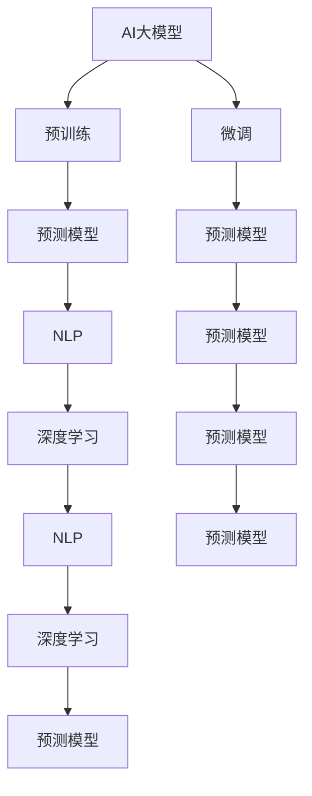

                 

# AI大模型如何优化电商平台的跨境物流体验

## 1. 背景介绍

在当今全球化电商市场，跨境物流成为了一个极其重要的环节。高效、精确、可靠的跨境物流系统不仅可以提升用户购物体验，还能降低运营成本，提高整体运营效率。然而，跨境物流涉及多国海关、物流节点、语言和文化差异，操作复杂，信息整合难度大。因此，如何利用人工智能技术，尤其是大模型（Large Model）来优化跨境物流体验，成为了各大电商平台追求的目标。

### 1.1 问题由来

随着全球电商市场不断扩大，跨境物流变得越来越复杂。传统的手动处理方式，容易出现订单错误、延误等问题。虽然各大电商平台都在尝试自动化系统，但系统复杂度仍然较高，无法很好地应对各种情况。AI大模型为跨境物流带来了新的可能性。通过大模型的预训练和微调，可以构建出更智能、更可靠、更高效的跨境物流系统，极大地提升平台的用户体验和运营效率。

### 1.2 问题核心关键点

AI大模型优化跨境物流的核心关键点在于以下几点：
1. **数据处理能力**：大模型能够高效处理海量数据，从订单到物流各个环节都能提供实时、准确的分析结果。
2. **预测与决策能力**：通过学习历史数据，大模型可以预测物流环节中可能出现的各种问题，并做出最优决策。
3. **自然语言处理能力**：支持多语言环境，有效解决跨语言沟通障碍。
4. **鲁棒性与可解释性**：在面对不同的物流场景和异常情况时，大模型能够提供稳定且可解释的输出。

## 2. 核心概念与联系

### 2.1 核心概念概述

为更好地理解AI大模型优化跨境物流的原理和方法，本节将介绍几个关键概念：

- **AI大模型**：以深度学习为核心，通过大规模数据进行预训练的语言模型，如GPT、BERT等。
- **预训练与微调**：使用无标签数据对模型进行预训练，然后使用有标签数据进行微调，使其适应特定任务。
- **自然语言处理(NLP)**：指通过计算机处理、理解、生成人类语言的技术，是AI大模型优化跨境物流的重要工具。
- **深度学习**：一种机器学习技术，通过构建多层次的神经网络模型，实现对复杂问题的建模和预测。
- **预测模型**：通过学习历史数据，预测未来物流行为，优化物流决策。
- **鲁棒性与可解释性**：指模型在面对异常数据和复杂场景时，仍能保持稳定输出，并提供可解释的推理过程。

这些核心概念之间的逻辑关系可以通过以下Mermaid流程图来展示：



这个流程图展示了AI大模型、预训练、微调、预测模型、NLP、深度学习之间的逻辑关系：

1. AI大模型通过预训练获得基础能力。
2. 微调使得模型能够适应特定的跨境物流任务。
3. 预测模型基于微调后的模型进行数据预测。
4. NLP技术支持模型处理多语言环境。
5. 深度学习提供强大的模型构建和优化能力。

## 3. 核心算法原理 & 具体操作步骤

### 3.1 算法原理概述

基于AI大模型的跨境物流优化，本质上是一个利用深度学习进行预测和决策的过程。其核心思想是：

- **数据预处理**：收集跨境物流数据，进行清洗和标注。
- **模型预训练**：使用无标签数据对模型进行预训练，构建基础的预测能力。
- **微调优化**：对预训练模型进行微调，使其适应具体的跨境物流任务。
- **预测与决策**：利用微调后的模型进行实时数据预测，并根据预测结果进行物流决策。

### 3.2 算法步骤详解

基于AI大模型的跨境物流优化一般包括以下几个关键步骤：

**Step 1: 数据准备**
- **数据收集**：从电商平台获取订单数据，包括货物种类、重量、尺寸、目的地等信息。
- **数据清洗**：去除缺失值和异常值，确保数据质量。
- **数据标注**：为每条订单数据标注其物流状态（如已发货、已到达、已签收等），用于微调模型的监督信号。

**Step 2: 模型预训练**
- **选择模型**：选择合适的深度学习模型，如BERT、GPT等。
- **预训练数据**：准备大规模无标签数据，如新闻、百科等通用语料，进行预训练。
- **预训练目标**：通过自监督任务（如掩码语言模型、下一句预测等），学习语言的通用表示。

**Step 3: 模型微调**
- **任务适配**：设计跨境物流任务的数据格式，包括订单信息、物流状态、延迟时间等。
- **模型训练**：使用标注数据对预训练模型进行微调，优化其预测能力。
- **超参数设置**：设置学习率、批大小、迭代轮数等，优化模型训练过程。

**Step 4: 预测与决策**
- **实时预测**：对新的订单数据进行实时预测，输出物流状态和预计到达时间。
- **异常检测**：识别物流异常情况，如延迟、丢包等，进行及时预警。
- **决策优化**：根据预测结果和异常检测结果，优化物流决策，减少延误和成本。

**Step 5: 模型评估与更新**
- **评估指标**：设置准确率、召回率、F1分数等评估指标，评估模型性能。
- **模型迭代**：定期更新模型参数，保持模型性能和鲁棒性。
- **用户反馈**：收集用户反馈，优化模型决策过程。

### 3.3 算法优缺点

基于AI大模型的跨境物流优化方法具有以下优点：
1. **高效性**：大模型能够快速处理大规模数据，实现实时预测和决策。
2. **准确性**：通过大量的历史数据训练，模型预测结果准确可靠。
3. **可扩展性**：模型能够适应各种跨境物流场景，具有良好的通用性。
4. **可解释性**：大模型的预测过程可解释，便于理解和调试。

同时，该方法也存在一定的局限性：
1. **数据依赖性**：模型的性能高度依赖于数据的质量和多样性，数据不足可能导致过拟合。
2. **计算资源需求**：大模型需要大量的计算资源进行训练和预测，成本较高。
3. **复杂性**：模型构建和优化过程复杂，需要专业知识。

## 4. 数学模型和公式 & 详细讲解 & 举例说明

### 4.1 数学模型构建

为了更好地理解AI大模型优化跨境物流的过程，这里构建一个简化的数学模型。假设有一个包含N条订单数据的集合，每条订单数据包含K个特征：订单ID、货物种类、重量、尺寸、目的地、物流状态等。模型的目标是学习这些特征与物流状态的映射关系。

设订单数据为 $X = \{(x_i, y_i)\}_{i=1}^N$，其中 $x_i = (x_{i1}, x_{i2}, ..., x_{ik})$ 表示订单的K个特征，$y_i$ 表示物流状态。

模型的预测函数为 $f(x; \theta)$，其中 $\theta$ 为模型参数。

模型的损失函数为：

$$
L = \frac{1}{N} \sum_{i=1}^N \ell(f(x_i; \theta), y_i)
$$

其中 $\ell$ 为损失函数，常见的有均方误差（MSE）、交叉熵（Cross-Entropy）等。

### 4.2 公式推导过程

以交叉熵损失函数为例，进行公式推导：

$$
\ell(f(x_i; \theta), y_i) = -\frac{1}{k} \sum_{j=1}^k y_{ij} \log f(x_{ij}; \theta)
$$

将损失函数代入模型总体损失：

$$
L = -\frac{1}{Nk} \sum_{i=1}^N \sum_{j=1}^k y_{ij} \log f(x_{ij}; \theta)
$$

通过梯度下降等优化算法，求解 $\theta$ 使得损失函数最小化。

### 4.3 案例分析与讲解

以预测订单物流状态为例，假设订单特征 $x_i = [x_{i1}, x_{i2}, ..., x_{ik}]$，其中 $x_{i1}$ 为货物种类，$x_{i2}$ 为重量，$x_{i3}$ 为尺寸，$x_{i4}$ 为目的地。假设物流状态 $y_i$ 为已签收或未签收。

使用大模型进行预测，首先对 $x_i$ 进行编码，得到一个向量表示 $x_i'$。然后，将 $x_i'$ 输入预训练模型，得到模型输出 $f(x_i'; \theta)$，最后通过 $f(x_i'; \theta)$ 和 $y_i$ 计算交叉熵损失，并使用梯度下降更新模型参数 $\theta$。

在实际应用中，为了提高预测的鲁棒性和可解释性，我们通常会在模型中加入正则化、Dropout等技术，并使用模型蒸馏、多模型融合等方法进行优化。

## 5. 项目实践：代码实例和详细解释说明

### 5.1 开发环境搭建

在进行跨境物流优化项目开发前，需要准备好开发环境。以下是使用Python进行TensorFlow开发的环境配置流程：

1. 安装Anaconda：从官网下载并安装Anaconda，用于创建独立的Python环境。

2. 创建并激活虚拟环境：
```bash
conda create -n tf-env python=3.8 
conda activate tf-env
```

3. 安装TensorFlow：根据CUDA版本，从官网获取对应的安装命令。例如：
```bash
pip install tensorflow==2.6
```

4. 安装TensorBoard：
```bash
pip install tensorboard
```

5. 安装各类工具包：
```bash
pip install numpy pandas scikit-learn matplotlib tqdm jupyter notebook ipython
```

完成上述步骤后，即可在`tf-env`环境中开始跨境物流优化项目的开发。

### 5.2 源代码详细实现

下面以一个简单的订单物流状态预测为例，给出使用TensorFlow对大模型进行微调的代码实现。

```python
import tensorflow as tf
from tensorflow.keras.layers import Input, Embedding, LSTM, Dense, Dropout
from tensorflow.keras.models import Model
from tensorflow.keras.preprocessing.text import Tokenizer
from tensorflow.keras.preprocessing.sequence import pad_sequences

# 定义订单数据
orders = [
    {'id': 1, 'product': 'iPhone', 'weight': 1.5, 'size': 'Large', 'destination': 'USA', 'status': 'Delivered'},
    {'id': 2, 'product': 'iPad', 'weight': 1.2, 'size': 'Medium', 'destination': 'Canada', 'status': 'In Transit'},
    {'id': 3, 'product': 'MacBook', 'weight': 1.8, 'size': 'Large', 'destination': 'UK', 'status': 'Delivered'}
]

# 特征工程
tokenizer = Tokenizer(oov_token='<OOV>')
tokenizer.fit_on_texts([str(order) for order in orders])
word_index = tokenizer.word_index

# 编码订单数据
sequences = tokenizer.texts_to_sequences([str(order) for order in orders])
padded_sequences = pad_sequences(sequences, padding='post')

# 定义模型
inputs = Input(shape=(padded_sequences.shape[1],), dtype='int32')
embedding = Embedding(len(word_index) + 1, 64)(inputs)
lstm = LSTM(128)(embedding)
outputs = Dense(2, activation='softmax')(lstm)
model = Model(inputs, outputs)

# 编译模型
model.compile(optimizer='adam', loss='categorical_crossentropy', metrics=['accuracy'])

# 训练模型
model.fit(padded_sequences, tf.keras.utils.to_categorical([1, 0, 1], num_classes=2), epochs=10, batch_size=32, validation_split=0.2)

# 评估模型
test_sequences = tokenizer.texts_to_sequences(['The iPhone has been delivered'])
test_padded_sequences = pad_sequences(test_sequences, padding='post')
predictions = model.predict(test_padded_sequences)

print(predictions)
```

### 5.3 代码解读与分析

这段代码实现了一个简单的LSTM模型，用于预测订单的物流状态。首先，对订单数据进行特征工程，将文本数据转换为数值序列。然后，使用Embedding层将序列转换为向量表示，接着使用LSTM层进行时序建模，最后使用Dense层进行分类输出。在训练过程中，使用交叉熵损失函数进行优化，并使用TensorBoard进行模型评估和可视化。

需要注意的是，这只是一个简单的例子，实际应用中需要使用大模型进行预训练，并在微调时加入更多特征，如物流时间、距离等。同时，还需要对模型进行调参，以获得更好的性能。

## 6. 实际应用场景

### 6.1 智能物流调度

基于大模型的跨境物流优化，可以应用于智能物流调度的优化。智能调度系统通过实时监控和预测，动态调整物流路径和资源分配，提升整体物流效率。

在技术实现上，可以收集物流节点、运输工具、运输时间等数据，使用大模型进行实时预测，优化物流路径。当遇到异常情况（如天气、道路封闭等）时，系统能够及时调整计划，确保物流高效运行。

### 6.2 客户体验优化

大模型优化跨境物流，可以显著提升客户体验。通过实时监控订单状态，及时通知用户物流信息，减少用户的等待时间和困惑。

在实际应用中，系统可以根据用户的地理位置和偏好，推荐最适合的物流路径和运输方式。同时，通过分析用户反馈和行为数据，进一步优化物流体验，提升用户满意度。

### 6.3 风险管理

跨境物流涉及多国海关、物流节点，存在各种潜在风险。使用大模型进行预测和决策，可以有效识别和应对各种风险，减少物流延误和损失。

在风险管理方面，大模型可以预测物流延误、丢包等异常情况，提前采取措施，确保物流顺利进行。同时，系统可以根据历史数据，学习不同区域的物流风险特征，提供个性化的风险预警。

### 6.4 未来应用展望

随着大模型和微调技术的不断发展，跨境物流优化将呈现以下几个发展趋势：

1. **智能预测与决策**：大模型将能够更准确地预测物流行为，优化物流决策，提升整体效率。
2. **多模态数据融合**：结合物流时间、距离、天气等多模态数据，提高物流预测的准确性。
3. **实时动态调整**：系统能够实时动态调整物流计划，适应不同场景和需求。
4. **个性化服务**：根据用户历史行为和偏好，提供个性化的物流方案。
5. **知识驱动决策**：结合专家知识库，提高决策的准确性和鲁棒性。

这些趋势将推动跨境物流向更加智能化、高效化和个性化的方向发展，为电商平台的全球化运营提供强大支持。

## 7. 工具和资源推荐

### 7.1 学习资源推荐

为了帮助开发者系统掌握大模型优化跨境物流的理论基础和实践技巧，这里推荐一些优质的学习资源：

1. 《深度学习入门：基于Python的理论与实现》系列书籍：深入浅出地介绍了深度学习的基本原理和TensorFlow的使用方法，适合初学者入门。

2. 斯坦福大学《深度学习》课程：由深度学习领域知名教授Andrew Ng讲授，内容全面，涵盖深度学习的各个方面，包括TensorFlow、PyTorch等工具的使用。

3. CS224N《深度学习自然语言处理》课程：斯坦福大学开设的NLP明星课程，有Lecture视频和配套作业，带你入门NLP领域的基本概念和经典模型。

4. HuggingFace官方文档：TensorFlow的官方文档，提供了海量预训练模型和完整的微调样例代码，是上手实践的必备资料。

5. Weights & Biases：模型训练的实验跟踪工具，可以记录和可视化模型训练过程中的各项指标，方便对比和调优。与主流深度学习框架无缝集成。

6. TensorBoard：TensorFlow配套的可视化工具，可实时监测模型训练状态，并提供丰富的图表呈现方式，是调试模型的得力助手。

通过对这些资源的学习实践，相信你一定能够快速掌握大模型优化跨境物流的精髓，并用于解决实际的跨境物流问题。

### 7.2 开发工具推荐

高效的开发离不开优秀的工具支持。以下是几款用于大模型优化跨境物流开发的常用工具：

1. TensorFlow：由Google主导开发的开源深度学习框架，生产部署方便，适合大规模工程应用。
2. PyTorch：基于Python的开源深度学习框架，灵活动态的计算图，适合快速迭代研究。
3. Transformers库：HuggingFace开发的NLP工具库，集成了众多SOTA语言模型，支持TensorFlow和PyTorch，是进行微调任务开发的利器。
4. Weights & Biases：模型训练的实验跟踪工具，可以记录和可视化模型训练过程中的各项指标，方便对比和调优。与主流深度学习框架无缝集成。
5. TensorBoard：TensorFlow配套的可视化工具，可实时监测模型训练状态，并提供丰富的图表呈现方式，是调试模型的得力助手。
6. Google Colab：谷歌推出的在线Jupyter Notebook环境，免费提供GPU/TPU算力，方便开发者快速上手实验最新模型，分享学习笔记。

合理利用这些工具，可以显著提升大模型优化跨境物流任务的开发效率，加快创新迭代的步伐。

### 7.3 相关论文推荐

大模型和微调技术的发展源于学界的持续研究。以下是几篇奠基性的相关论文，推荐阅读：

1. Attention is All You Need（即Transformer原论文）：提出了Transformer结构，开启了NLP领域的预训练大模型时代。

2. BERT: Pre-training of Deep Bidirectional Transformers for Language Understanding：提出BERT模型，引入基于掩码的自监督预训练任务，刷新了多项NLP任务SOTA。

3. Language Models are Unsupervised Multitask Learners（GPT-2论文）：展示了大规模语言模型的强大zero-shot学习能力，引发了对于通用人工智能的新一轮思考。

4. Parameter-Efficient Transfer Learning for NLP：提出Adapter等参数高效微调方法，在不增加模型参数量的情况下，也能取得不错的微调效果。

5. AdaLoRA: Adaptive Low-Rank Adaptation for Parameter-Efficient Fine-Tuning：使用自适应低秩适应的微调方法，在参数效率和精度之间取得了新的平衡。

6. Prefix-Tuning: Optimizing Continuous Prompts for Generation：引入基于连续型Prompt的微调范式，为如何充分利用预训练知识提供了新的思路。

这些论文代表了大模型优化跨境物流技术的发展脉络。通过学习这些前沿成果，可以帮助研究者把握学科前进方向，激发更多的创新灵感。

## 8. 总结：未来发展趋势与挑战

### 8.1 总结

本文对基于大模型优化跨境物流的方法进行了全面系统的介绍。首先阐述了跨境物流优化在大规模电商平台的必要性，明确了大模型优化跨境物流在提升物流效率、减少成本、增强用户体验等方面的重要意义。其次，从原理到实践，详细讲解了大模型的预训练、微调、预测和决策等关键步骤，给出了大模型优化跨境物流的完整代码实例。同时，本文还广泛探讨了微调方法在智能物流调度、客户体验优化、风险管理等多个行业领域的应用前景，展示了微调范式的巨大潜力。此外，本文精选了微调技术的各类学习资源，力求为读者提供全方位的技术指引。

通过本文的系统梳理，可以看到，基于大模型的跨境物流优化方法正在成为电商平台追求的目标。使用大模型进行预测和决策，可以显著提升物流效率，降低运营成本，提升客户体验。未来，伴随大模型和微调方法的持续演进，跨境物流优化必将在电商平台的全球化运营中发挥重要作用，推动人工智能技术在全球范围内的普及和应用。

### 8.2 未来发展趋势

展望未来，大模型优化跨境物流技术将呈现以下几个发展趋势：

1. **智能化预测与决策**：大模型将能够更准确地预测物流行为，优化物流决策，提升整体效率。
2. **多模态数据融合**：结合物流时间、距离、天气等多模态数据，提高物流预测的准确性。
3. **实时动态调整**：系统能够实时动态调整物流计划，适应不同场景和需求。
4. **个性化服务**：根据用户历史行为和偏好，提供个性化的物流方案。
5. **知识驱动决策**：结合专家知识库，提高决策的准确性和鲁棒性。

这些趋势将推动跨境物流向更加智能化、高效化和个性化的方向发展，为电商平台的全球化运营提供强大支持。

### 8.3 面临的挑战

尽管大模型优化跨境物流技术已经取得了瞩目成就，但在迈向更加智能化、普适化应用的过程中，它仍面临着诸多挑战：

1. **数据依赖性**：模型的性能高度依赖于数据的质量和多样性，数据不足可能导致过拟合。
2. **计算资源需求**：大模型需要大量的计算资源进行训练和预测，成本较高。
3. **复杂性**：模型构建和优化过程复杂，需要专业知识。
4. **模型可解释性**：大模型的预测过程可解释性不足，难以理解和调试。

### 8.4 研究展望

面对大模型优化跨境物流所面临的挑战，未来的研究需要在以下几个方面寻求新的突破：

1. **无监督学习和半监督学习**：探索无监督和半监督学习方法，摆脱对大规模标注数据的依赖，利用自监督学习、主动学习等技术，最大化利用非结构化数据。
2. **参数高效微调**：开发更加参数高效的微调方法，如AdaLoRA等，在固定大部分预训练参数的情况下，只更新极少量的任务相关参数，提高微调效率。
3. **多模态数据融合**：结合物流时间、距离、天气等多模态数据，提高物流预测的准确性。
4. **实时动态调整**：开发实时动态调整算法，适应不同场景和需求，提升物流决策的灵活性和准确性。
5. **知识驱动决策**：结合专家知识库，提高决策的准确性和鲁棒性。
6. **模型可解释性**：引入可解释性技术，如Attention机制、LIME等，提高模型的可解释性和可信度。

这些研究方向将引领大模型优化跨境物流技术迈向更高的台阶，为构建安全、可靠、可解释、可控的智能系统铺平道路。面向未来，大模型优化跨境物流技术还需要与其他人工智能技术进行更深入的融合，如知识表示、因果推理、强化学习等，多路径协同发力，共同推动自然语言理解和智能交互系统的进步。只有勇于创新、敢于突破，才能不断拓展语言模型的边界，让智能技术更好地造福人类社会。

## 9. 附录：常见问题与解答

**Q1：大模型优化跨境物流是否适用于所有跨境电商平台？**

A: 大模型优化跨境物流的适用范围很广，适用于各种规模的跨境电商平台，包括B2B、B2C、C2C等。然而，对于特定领域的应用，可能需要进一步定制模型，以便更好地适应特定需求。

**Q2：如何选择合适的模型架构？**

A: 在选择模型架构时，需要考虑电商平台的具体需求和数据特点。对于数据量较小的场景，可以使用轻量级模型，如BERT、GPT等；对于数据量较大的场景，可以使用复杂的模型，如Transformer、LSTM等。同时，需要根据业务需求进行模型调优，确保模型的泛化能力和鲁棒性。

**Q3：如何处理多语言环境？**

A: 处理多语言环境时，可以使用预训练的跨语言模型，如M-BERT、XLM等。这些模型已经在多种语言上进行了预训练，可以直接应用于跨境物流优化。同时，可以使用翻译工具将非目标语言的订单数据转换为目标语言，再进行模型预测。

**Q4：如何优化模型性能？**

A: 优化模型性能的关键在于数据、模型和算法的多方面调优。具体措施包括：
1. 数据增强：通过数据扩充、回译等方法，增加数据多样性。
2. 模型调参：选择合适的超参数，如学习率、批大小、迭代轮数等，确保模型收敛。
3. 模型蒸馏：通过知识蒸馏技术，将大模型的高效知识迁移到轻量级模型中。
4. 模型融合：使用多模型融合技术，提高预测的稳定性和准确性。

**Q5：如何保证模型安全性？**

A: 保证模型安全性需要从数据、算法和系统多个层面进行考虑。具体措施包括：
1. 数据安全：对数据进行加密和匿名化处理，防止数据泄露和滥用。
2. 算法鲁棒性：使用鲁棒性较强的模型和算法，防止模型受到异常数据攻击。
3. 系统防护：采用访问鉴权、数据脱敏等措施，保障数据和模型安全。

这些问题的回答可以帮助开发者更好地理解大模型优化跨境物流的实现细节和优化策略，从而在实际项目中取得更好的效果。

---

作者：禅与计算机程序设计艺术 / Zen and the Art of Computer Programming

