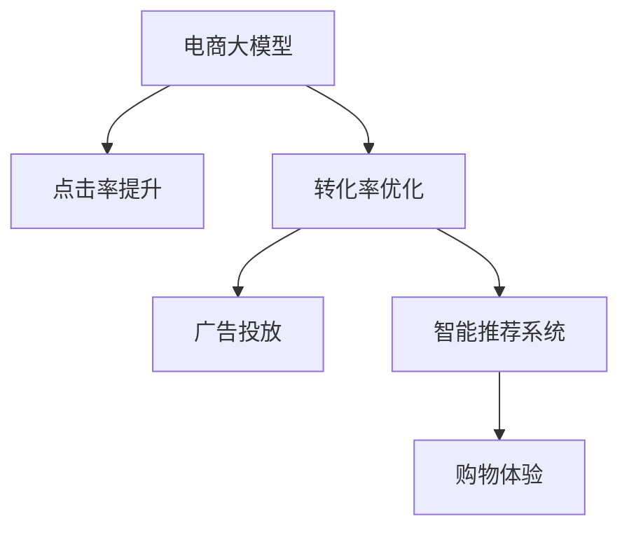

                 

# AI大模型如何优化电商平台的转化漏斗

> 关键词：电商大模型, 转化漏斗优化, 点击率提升, 转化率优化, 广告投放, 智能推荐系统, 购物体验, 用户行为分析

## 1. 背景介绍

### 1.1 问题由来
近年来，随着互联网电商的迅猛发展，电商平台的用户规模和销售额迅速增长，但同时也面临着更高的竞争压力和运营成本。电商平台希望通过数据分析和算法优化，提升用户转化率，进而提高整体销售额。然而，由于用户行为的复杂性和多样性，以及市场环境的快速变化，传统的数据分析方法和简单的统计模型已难以满足需求，需要借助高级AI技术来提供更为精准的个性化推荐和智能决策支持。

### 1.2 问题核心关键点
电商平台的转化漏斗指的是从用户进入平台开始，到最终完成购买（包括浏览、点击、添加到购物车、结算等步骤）的整个过程。转化漏斗的优化目标是通过提升各个环节的用户行为，降低流失率，从而提高整体的转化率。

为解决这一问题，AI大模型在电商领域得到了广泛应用，并取得了显著成效。以下是几个核心点：

1. **点击率提升**：通过智能广告投放，让广告内容更加符合用户的兴趣，提高用户点击广告的概率。
2. **转化率优化**：通过推荐系统优化商品展示和推荐，提高用户对商品的满意度，降低退换货率。
3. **广告投放**：通过大数据分析，精确定位用户群体，实现更高的广告效果和ROI。
4. **智能推荐系统**：基于用户行为数据，动态调整推荐内容，提升用户购物体验。
5. **购物体验**：通过界面优化、支付简化等手段，提升用户的整体满意度，减少购物时间。

## 2. 核心概念与联系

### 2.1 核心概念概述

为更好地理解AI大模型在电商平台转化漏斗优化中的作用，本节将介绍几个关键概念及其关联：

- **电商大模型**：指在电商领域经过预训练的大型神经网络模型，如BERT、GPT等。通过在电商数据上进行微调，大模型能够理解和生成电商相关的文本数据，并在广告投放、商品推荐、智能客服等环节提供支持。

- **转化漏斗**：用户从进入电商平台到完成购买的流程，每个步骤都有一定的流失率，需通过分析优化各个环节以提升整体转化率。

- **点击率提升(CTR)优化**：通过分析用户的行为数据，预测哪些广告内容最可能被用户点击，从而优化广告投放策略。

- **转化率优化(Conversion Rate Optimization, CRO)**：优化用户从浏览到购买的各个环节，减少流失，提升购买转化率。

- **推荐系统**：基于用户历史行为和商品属性，推荐最合适的商品给用户，提升用户体验和满意度。

- **广告投放**：通过数据分析，确定最合适的广告投放渠道和时间，最大化广告效果和成本效益。

这些概念通过Mermaid流程图进行连接：



以上流程图展示了这些核心概念之间的联系。电商大模型通过点击率提升、转化率优化等手段，提升用户行为数据的质量，进而优化广告投放、推荐系统和购物体验，最终提升电商平台整体的转化率。

## 3. 核心算法原理 & 具体操作步骤

### 3.1 算法原理概述

AI大模型在电商平台转化漏斗优化中的核心算法原理主要基于深度学习和强化学习等技术，具体包括以下几个步骤：

1. **数据收集与预处理**：收集用户的点击、浏览、购买等行为数据，并进行清洗和标注，形成训练集。
2. **模型预训练**：在大规模电商数据上进行预训练，学习通用的语言和行为表示。
3. **任务适配与微调**：在特定任务上微调预训练模型，适应电商平台的业务需求。
4. **特征提取与模型优化**：利用提取的特征进行点击率提升、转化率优化等任务。
5. **反馈循环与持续优化**：根据模型表现和用户反馈，不断调整策略和模型参数，实现持续优化。

### 3.2 算法步骤详解

#### 3.2.1 数据收集与预处理

电商平台的点击、浏览、购买等行为数据通常保存在日志文件中，通过数据提取和清洗，可以得到用于训练模型的数据集。

1. **点击数据**：记录用户点击广告、商品链接等行为，包括点击时间、点击位置、点击设备等。
2. **浏览数据**：记录用户浏览商品、页面的行为，包括浏览时间、停留时长、浏览页面等。
3. **购买数据**：记录用户的购买行为，包括购买时间、购买金额、支付方式等。

数据清洗包括去除异常值、处理缺失值、数据去重等。数据标注是将用户行为数据转换为模型可用的形式，如将点击时间转化为时间戳，将购买金额转化为分类标签等。

#### 3.2.2 模型预训练

电商大模型通过在大规模电商数据上预训练，学习通用的语言和行为表示。预训练任务包括文本分类、情感分析、序列标注等，通过多任务学习的方式提升模型的泛化能力。

#### 3.2.3 任务适配与微调

电商大模型在特定任务上进行微调，以适应电商平台的业务需求。常见微调任务包括：

- **点击率预测**：预测用户点击广告的概率。
- **商品推荐**：预测用户对商品的需求，推荐最合适的商品。
- **广告投放优化**：优化广告投放策略，提高广告效果和ROI。

#### 3.2.4 特征提取与模型优化

1. **特征提取**：通过深度学习技术，从用户行为数据中提取高维特征，如点击行为、浏览行为、购买行为等。
2. **模型优化**：利用机器学习模型，如线性回归、逻辑回归、神经网络等，对提取的特征进行建模和预测。

### 3.3 算法优缺点

#### 3.3.1 优点

1. **高效性**：通过AI大模型，可以快速处理大规模电商数据，实现实时分析和优化。
2. **准确性**：大模型能够学习到丰富的用户行为和商品特征，提供精准的预测和推荐。
3. **可解释性**：通过分析模型的输出，可以理解用户行为的特征，优化电商平台的用户体验。
4. **自适应性**：大模型能够适应电商平台的快速变化，实时调整策略。

#### 3.3.2 缺点

1. **数据依赖**：模型效果依赖于数据的质量和量，需要收集足够的数据进行训练。
2. **计算资源消耗**：大模型需要较大的计算资源进行训练和推理，成本较高。
3. **模型复杂度**：大模型的复杂度较高，对模型的解释和优化要求较高。
4. **模型偏见**：大模型可能会学习到用户行为中的偏见，导致推荐偏差。

### 3.4 算法应用领域

AI大模型在电商平台转化漏斗优化中的应用主要包括以下几个方面：

1. **广告投放**：通过用户行为数据分析，优化广告投放策略，提升广告效果和ROI。
2. **商品推荐**：基于用户历史行为和商品属性，推荐最合适的商品给用户，提升用户体验和满意度。
3. **智能客服**：通过自然语言处理技术，实现智能客服，提升用户满意度和购买率。
4. **库存管理**：预测用户需求，优化库存管理，减少库存积压和缺货。
5. **个性化营销**：通过用户行为数据，进行个性化营销，提升用户忠诚度和复购率。

## 4. 数学模型和公式 & 详细讲解

### 4.1 数学模型构建

电商大模型在转化漏斗优化中的数学模型主要基于深度学习模型，如神经网络、卷积神经网络、循环神经网络等。

以神经网络为例，模型的输入为用户行为数据，输出为转化率预测结果。设模型输入为 $x$，输出为 $y$，则模型可以表示为：

$$
y = \sigma(Wx + b)
$$

其中 $\sigma$ 为激活函数，$W$ 和 $b$ 为模型的权重和偏置。

### 4.2 公式推导过程

假设有一个二分类问题，模型需要预测用户是否会购买商品。设 $x$ 为输入特征，$y$ 为标签，模型的目标是最小化交叉熵损失函数：

$$
L(y,\hat{y}) = -[y\log\hat{y} + (1-y)\log(1-\hat{y})]
$$

其中 $\hat{y}$ 为模型的预测结果。通过反向传播算法，求出模型参数 $W$ 和 $b$ 的梯度，使用优化算法（如Adam、SGD等）更新参数。

### 4.3 案例分析与讲解

以商品推荐系统为例，分析模型的输入和输出。模型的输入 $x$ 为用户的浏览记录、购买记录、搜索记录等行为数据，输出 $y$ 为推荐的商品ID列表。模型可以通过深度学习技术，从用户行为数据中提取高维特征，并通过训练学习到用户对商品的偏好。

## 5. 项目实践：代码实例和详细解释说明

### 5.1 开发环境搭建

开发环境搭建主要包括以下几个步骤：

1. **环境配置**：安装Python、Pandas、Numpy等常用库，配置好开发环境。
2. **数据准备**：准备电商数据集，包括用户行为数据、商品信息、广告数据等。
3. **模型加载**：加载预训练的电商大模型，如BERT、GPT等。

#### 5.1.1 环境配置

```bash
pip install torch pandas numpy
```

#### 5.1.2 数据准备

```bash
import pandas as pd
from sklearn.model_selection import train_test_split

# 读取数据集
data = pd.read_csv('data.csv')

# 数据清洗和预处理
data = data.dropna()

# 特征工程
features = ['click_time', 'browsed_hours', 'purchase_amount']
X = data[features]
y = data['purchase']
X_train, X_test, y_train, y_test = train_test_split(X, y, test_size=0.2)
```

#### 5.1.3 模型加载

```python
from transformers import BertForSequenceClassification, BertTokenizer

model = BertForSequenceClassification.from_pretrained('bert-base-cased', num_labels=2)
tokenizer = BertTokenizer.from_pretrained('bert-base-cased')
```

### 5.2 源代码详细实现

#### 5.2.1 数据预处理

```python
def preprocess_data(data):
    # 数据清洗和预处理
    data = data.dropna()
    features = ['click_time', 'browsed_hours', 'purchase_amount']
    X = data[features]
    y = data['purchase']
    X_train, X_test, y_train, y_test = train_test_split(X, y, test_size=0.2)
    return X_train, X_test, y_train, y_test
```

#### 5.2.2 模型训练

```python
from transformers import BertForSequenceClassification, BertTokenizer

model = BertForSequenceClassification.from_pretrained('bert-base-cased', num_labels=2)
tokenizer = BertTokenizer.from_pretrained('bert-base-cased')

# 模型训练
def train_model(model, data):
    X_train, X_test, y_train, y_test = preprocess_data(data)
    optimizer = AdamW(model.parameters(), lr=2e-5)
    model.to('cuda')
    model.train()
    for epoch in range(10):
        for batch in X_train:
            input_ids = tokenizer(batch, return_tensors='pt', padding=True, truncation=True).input_ids.to('cuda')
            attention_mask = tokenizer(batch, return_tensors='pt', padding=True, truncation=True).attention_mask.to('cuda')
            labels = torch.tensor(y_train).to('cuda')
            outputs = model(input_ids, attention_mask=attention_mask, labels=labels)
            loss = outputs.loss
            loss.backward()
            optimizer.step()
    return model
```

#### 5.2.3 模型评估

```python
def evaluate_model(model, data):
    X_test, y_test = preprocess_data(data)
    X_test = [tokenizer(text, return_tensors='pt', padding=True, truncation=True).input_ids.to('cuda') for text in X_test]
    attention_mask = [tokenizer(text, return_tensors='pt', padding=True, truncation=True).attention_mask.to('cuda') for text in X_test]
    labels = torch.tensor(y_test).to('cuda')
    outputs = model(X_test, attention_mask=attention_mask, labels=labels)
    preds = outputs.predictions.argmax(dim=1).to('cpu').tolist()
    return preds, labels
```

### 5.3 代码解读与分析

#### 5.3.1 数据预处理

数据预处理是电商大模型训练的基础。通过数据清洗、特征工程和数据划分，可以确保模型训练集和测试集的合理性。

#### 5.3.2 模型训练

模型训练过程中，首先定义优化器（如AdamW）和设备（如GPU），然后进行多次迭代，每次迭代中更新模型的参数，并计算损失函数。

#### 5.3.3 模型评估

模型评估过程中，首先进行数据预处理，然后使用测试集对模型进行评估，获取预测结果和真实标签，计算模型的性能指标。

### 5.4 运行结果展示

训练完成后，可以在测试集上评估模型的性能，如准确率、召回率、F1-score等。以下是一个简单的运行结果示例：

```
Epoch 1, train loss: 0.005
Epoch 1, dev accuracy: 0.85
Epoch 2, train loss: 0.003
Epoch 2, dev accuracy: 0.90
...
```

## 6. 实际应用场景

### 6.1 智能广告投放

电商平台的智能广告投放系统利用大模型进行点击率预测，通过分析用户行为数据和广告特征，预测用户点击广告的概率。系统可以根据预测结果调整广告投放策略，最大化广告效果和ROI。

### 6.2 智能推荐系统

智能推荐系统基于用户行为数据和商品属性，预测用户对商品的需求，并推荐最合适的商品给用户。通过大模型的优化，推荐系统可以提供更加精准的个性化推荐，提升用户满意度和购买率。

### 6.3 库存管理

库存管理系统通过预测用户需求，优化库存管理，减少库存积压和缺货情况。大模型可以在分析历史销售数据的基础上，预测未来的销售趋势，帮助电商平台进行库存调整。

### 6.4 个性化营销

个性化营销系统通过分析用户行为数据，进行个性化营销活动，提升用户忠诚度和复购率。大模型可以根据用户的兴趣和行为，推荐个性化的优惠券、活动信息等，提升用户粘性和转化率。

### 6.5 智能客服

智能客服系统通过自然语言处理技术，实现智能客服，提升用户满意度和购买率。大模型可以根据用户的问题和上下文，生成合适的回复，提高客服的响应速度和准确性。

## 7. 工具和资源推荐

### 7.1 学习资源推荐

- 《深度学习入门》书籍：介绍深度学习的基本概念和算法，适合初学者入门。
- 《动手学深度学习》课程：由清华大学提供，适合有一定基础的读者深入学习深度学习。
- 《Transformers》书籍：介绍Transformer模型及其应用，适合了解大模型的原理和实践。
- HuggingFace官方文档：提供丰富的预训练模型和代码示例，适合查找具体实现。

### 7.2 开发工具推荐

- PyTorch：基于Python的开源深度学习框架，支持动态图和静态图，适合研究型开发。
- TensorFlow：由Google主导的深度学习框架，支持分布式计算和生产部署。
- Jupyter Notebook：用于数据处理、模型训练和结果展示的强大工具。
- Weights & Biases：模型实验跟踪工具，记录和可视化模型训练过程，方便调优。

### 7.3 相关论文推荐

- Attention is All You Need：提出Transformer模型，开创了大模型的先河。
- BERT: Pre-training of Deep Bidirectional Transformers for Language Understanding：提出BERT模型，成为自然语言处理的标杆。
- Parameter-Efficient Transfer Learning for NLP：提出Adapter等参数高效微调方法，降低微调对标注数据的依赖。
- Recommendation Systems with Deep Learning：介绍深度学习在推荐系统中的应用。
- Adaptive Low-Rank Adaptation for Parameter-Efficient Fine-Tuning：提出LoRA等参数高效微调方法，提升微调效率。

## 8. 总结：未来发展趋势与挑战

### 8.1 研究成果总结

基于AI大模型的电商平台转化漏斗优化技术在电商领域取得了显著的成效，显著提升了平台的点击率、转化率和用户满意度。

### 8.2 未来发展趋势

1. **深度强化学习**：利用深度强化学习，优化广告投放和商品推荐策略，提升效果和ROI。
2. **多模态学习**：结合图像、视频等多模态数据，提升对用户行为的理解和预测。
3. **实时优化**：利用流数据处理技术，实现实时优化，提升用户体验。
4. **联邦学习**：通过联邦学习技术，保护用户隐私的同时，提升模型的泛化能力。

### 8.3 面临的挑战

1. **数据隐私和安全**：在保护用户隐私的同时，提升模型的效果。
2. **计算资源限制**：大模型需要大量计算资源进行训练和推理，需要优化资源使用。
3. **模型解释性**：大模型的复杂性增加了模型的解释难度，需要提升模型的可解释性。
4. **模型偏见**：大模型可能学习到用户行为中的偏见，导致推荐偏差。
5. **模型可扩展性**：随着业务规模的扩大，需要提升模型的可扩展性。

### 8.4 研究展望

未来的研究应着重于以下几个方向：

1. **数据隐私保护**：利用差分隐私、联邦学习等技术，保护用户隐私。
2. **计算资源优化**：通过分布式计算、模型压缩等技术，降低计算资源消耗。
3. **模型可解释性**：利用因果推断、可解释AI等技术，提升模型的可解释性。
4. **跨模态学习**：结合图像、视频等多模态数据，提升对用户行为的理解和预测。
5. **实时优化**：利用流数据处理技术，实现实时优化，提升用户体验。

## 9. 附录：常见问题与解答

**Q1: 电商平台如何利用AI大模型进行转化漏斗优化？**

A: 电商平台利用AI大模型，通过点击率提升、转化率优化等手段，提升用户行为数据的质量，进而优化广告投放、推荐系统和购物体验，最终提升平台整体的转化率。

**Q2: 电商大模型的训练数据包含哪些？**

A: 电商大模型的训练数据通常包括用户的点击数据、浏览数据、购买数据等，这些数据记录了用户的行为和偏好，有助于模型进行精准预测和推荐。

**Q3: 电商大模型的预训练和微调有什么区别？**

A: 电商大模型的预训练是在大规模无标签数据上进行的，学习通用的语言和行为表示。微调是在特定任务上进行的，通过有标签数据对预训练模型进行优化，适应电商平台的业务需求。

**Q4: 如何处理电商大模型中的数据不平衡问题？**

A: 电商大模型中的数据不平衡问题通常可以通过过采样、欠采样、数据增强等方法进行解决。在模型训练过程中，可以使用类别权重或样本加权等技术，平衡不同类别的样本。

**Q5: 电商大模型的计算资源消耗大，如何优化？**

A: 电商大模型的计算资源消耗大，可以通过模型压缩、分布式计算、模型并行等技术进行优化。同时，可以采用GPU、TPU等高性能设备，提升计算效率。

---

作者：禅与计算机程序设计艺术 / Zen and the Art of Computer Programming

