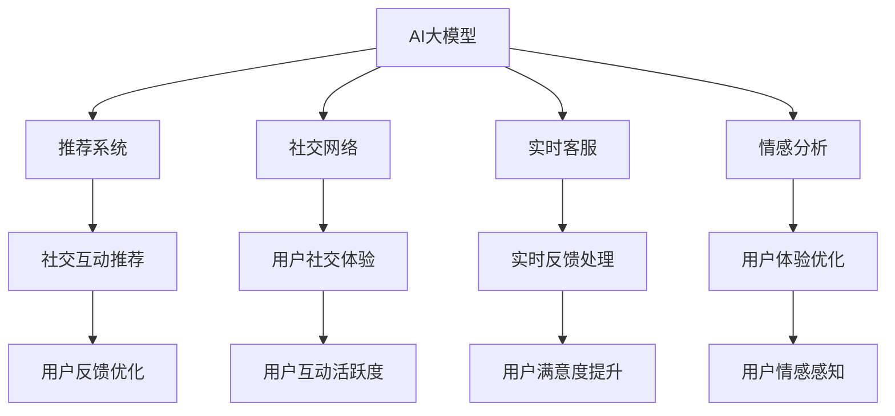

                 

# AI大模型如何提升电商平台的社交化购物体验

## 1. 背景介绍

在当今电商平台上，用户不再只是简单地搜索、购买商品，而更倾向于社交化购物体验。这意味着电商平台需要提供更加丰富、智能化的社交互动功能，以增强用户的参与感和满意度。基于AI大模型的技术，可以有效地提升电商平台的社交化购物体验，具体包括推荐系统、社交网络、实时客服、情感分析等多个方面。

### 1.1 问题由来
随着社交媒体的兴起，用户的购物习惯发生了显著变化。他们更愿意在社交平台上与朋友、家人、同事分享购物经验，从而影响其他人的购买决策。电商平台需要把握这一趋势，构建一个既能够推荐商品，又能够提供社交互动体验的生态系统。

### 1.2 问题核心关键点
大语言模型在电商平台的应用，能够通过对用户行为数据的分析，预测用户偏好，提升推荐系统的精准度。同时，通过社交网络的数据分析，可以提供更加个性化的社交互动体验。具体来说，AI大模型可以从以下几个方面提升电商平台的社交化购物体验：

1. **推荐系统优化**：通过深度学习算法，分析用户行为数据，构建用户画像，提升推荐系统的精准度，避免信息过载。
2. **社交网络分析**：通过社交网络的数据分析，推荐相关的社交互动内容，如朋友、同事的推荐、评价等。
3. **实时客服**：使用大语言模型构建自然语言处理(NLP)系统，提供实时客服功能，增强用户体验。
4. **情感分析**：通过情感分析技术，理解用户的情感状态，提升购物体验。

## 2. 核心概念与联系

### 2.1 核心概念概述

为更好地理解大模型如何提升电商平台社交化购物体验，本节将介绍几个关键概念：

- **AI大模型**：以Transformer等深度学习模型为代表的大规模预训练语言模型，能够处理复杂的自然语言理解和生成任务。
- **推荐系统**：通过用户行为数据，推荐用户可能感兴趣的商品，提升购物体验。
- **社交网络**：由用户生成的评论、分享、点赞等互动内容，构成一个虚拟的社交网络，增强用户黏性。
- **实时客服**：通过大语言模型构建的自然语言处理系统，提供24小时在线客服服务，提升用户满意度。
- **情感分析**：分析用户文本数据，提取情感信息，辅助电商平台优化服务。

这些核心概念之间的联系可以通过以下Mermaid流程图来展示：



这个流程图展示了大语言模型在电商平台社交化购物体验中的关键作用，通过推荐系统、社交网络、实时客服、情感分析等多个环节的协同作用，形成了一个闭环的社交化购物体验提升系统。

## 3. 核心算法原理 & 具体操作步骤
### 3.1 算法原理概述

基于大模型的电商平台社交化购物体验提升，其核心思想是通过自然语言处理(NLP)技术和深度学习算法，对用户行为数据、社交网络数据进行分析和建模，构建个性化的推荐系统、社交网络、实时客服和情感分析系统，从而提升用户的购物体验。

具体而言，算法原理包括以下几个步骤：

1. **数据收集**：收集用户行为数据、社交网络数据、实时客服聊天记录、评价评论等数据。
2. **数据预处理**：清洗、格式化数据，构建训练集、验证集和测试集。
3. **模型训练**：使用大语言模型和深度学习算法，训练推荐系统、社交网络、实时客服、情感分析等模块。
4. **模型微调**：通过用户反馈数据，微调模型参数，提升模型效果。
5. **模型应用**：将训练好的模型部署到电商平台上，实时分析和优化用户的购物体验。

### 3.2 算法步骤详解

#### 3.2.1 数据收集与预处理

- **数据来源**：用户行为数据主要来自于电商平台的用户行为记录，如浏览历史、购买历史等。社交网络数据来自于用户的评论、分享、点赞等互动内容。实时客服聊天记录和评价评论数据来自于客服系统。
- **数据清洗**：对数据进行去重、去噪、补全等预处理，确保数据的质量和一致性。
- **数据标注**：对于推荐系统，需要将用户行为数据进行标注，如点击、购买、评价等。对于社交网络，需要对用户的互动数据进行情感标注，如正面、中性、负面等。
- **数据划分**：将数据划分为训练集、验证集和测试集，用于模型的训练、验证和测试。

#### 3.2.2 模型训练与微调

- **模型选择**：选择合适的深度学习模型，如Transformer、BERT等。
- **模型训练**：在训练集上，使用优化算法（如Adam、SGD等）和损失函数（如交叉熵、均方误差等），训练推荐系统、社交网络、实时客服、情感分析等模型。
- **模型微调**：在验证集上，使用用户反馈数据，对模型进行微调，提升模型效果。
- **模型优化**：通过正则化、Dropout等技术，防止模型过拟合。

#### 3.2.3 模型应用与优化

- **推荐系统应用**：根据用户行为数据和历史评价，推荐用户可能感兴趣的商品，提升购物体验。
- **社交网络应用**：根据用户互动数据，推荐相关的社交互动内容，增强用户黏性。
- **实时客服应用**：使用大语言模型构建的NLP系统，提供实时客服功能，提升用户满意度。
- **情感分析应用**：分析用户评论和反馈，提取情感信息，优化电商平台服务。

### 3.3 算法优缺点

基于大模型的电商平台社交化购物体验提升方法具有以下优点：

1. **个性化推荐**：能够根据用户行为数据，提供个性化的推荐商品，提升购物体验。
2. **用户互动增强**：通过社交网络的数据分析，推荐相关的社交互动内容，增强用户黏性。
3. **实时客服高效**：使用大语言模型构建的NLP系统，提供24小时在线客服服务，提升用户满意度。
4. **情感分析精准**：通过情感分析技术，理解用户的情感状态，优化购物体验。

同时，该方法也存在以下缺点：

1. **数据隐私问题**：收集和分析用户行为数据和社交网络数据，涉及到用户隐私保护问题，需遵守相关法律法规。
2. **数据质量要求高**：推荐系统和情感分析系统对数据质量要求高，需进行严格的数据清洗和标注。
3. **模型训练成本高**：大语言模型和深度学习算法需要大量的计算资源和训练时间。
4. **模型复杂度高**：模型的设计和实现较为复杂，需具备较高的技术门槛。

### 3.4 算法应用领域

基于大模型的电商平台社交化购物体验提升方法，已经在各大电商平台上得到了广泛的应用，覆盖了推荐系统、社交网络、实时客服、情感分析等多个领域，具体应用场景包括：

- **推荐系统**：淘宝、京东等电商平台的商品推荐系统，通过分析用户行为数据，推荐商品，提升购物体验。
- **社交网络**：微信、微博等社交平台的用户互动推荐系统，通过分析用户的互动数据，推荐相关内容，增强用户黏性。
- **实时客服**：天猫、苏宁易购等电商平台的实时客服系统，使用大语言模型构建的NLP系统，提供24小时在线客服服务，提升用户满意度。
- **情感分析**：美团、大众点评等电商平台的情感分析系统，通过分析用户评论和反馈，提取情感信息，优化电商平台服务。

## 4. 数学模型和公式 & 详细讲解 & 举例说明

### 4.1 数学模型构建

以推荐系统为例，我们假设电商平台有$N$个用户，每个用户对$M$个商品进行了评价，每个评价由评分$y_i$和评分时间$t_i$组成。我们的目标是构建一个推荐模型$R$，该模型能够根据用户历史评价，预测用户对其他商品的评分。

推荐模型的目标函数为：

$$
\min_{R} \sum_{i=1}^{N} \sum_{j=1}^{M} (y_{ij} - R_{ij}(x_i))^2
$$

其中，$y_{ij}$表示用户$i$对商品$j$的评分，$R_{ij}$表示模型$R$对商品$j$给用户$i$的评分预测，$x_i$表示用户$i$的历史评价数据。

### 4.2 公式推导过程

推荐模型的公式推导过程如下：

设推荐模型$R$为线性模型，即$R_{ij} = \theta^T \cdot f(x_i) + b$，其中$\theta$为模型参数，$f(x_i)$为特征映射函数。

根据最小二乘法，目标函数可以改写为：

$$
\min_{\theta} \sum_{i=1}^{N} \sum_{j=1}^{M} (y_{ij} - \theta^T \cdot f(x_i) - b)^2
$$

进一步化简为：

$$
\min_{\theta, b} \sum_{i=1}^{N} \sum_{j=1}^{M} (y_{ij} - \theta^T \cdot f(x_i) - b)^2
$$

使用梯度下降算法求解，目标函数的梯度为：

$$
\frac{\partial L(\theta, b)}{\partial \theta} = -2 \sum_{i=1}^{N} \sum_{j=1}^{M} (y_{ij} - \theta^T \cdot f(x_i) - b) \cdot f(x_i)
$$

$$
\frac{\partial L(\theta, b)}{\partial b} = -2 \sum_{i=1}^{N} \sum_{j=1}^{M} (y_{ij} - \theta^T \cdot f(x_i) - b)
$$

通过求解上述梯度方程，可以得到最优的模型参数$\theta$和截距$b$。

### 4.3 案例分析与讲解

假设某电商平台有10万个用户，每个用户对100个商品进行了评价。使用大语言模型对用户行为数据进行分析，预测用户对其他商品的评分，并根据预测结果推荐商品。

**步骤1：数据准备**

收集用户评价数据，包括评分、评分时间、商品ID等信息。清洗数据，去除噪声、重复项等，确保数据质量。

**步骤2：特征工程**

选择用户行为特征，如用户ID、商品ID、评分时间等，进行特征映射。对于评分时间，可以选择滞后时间特征（如第1天、第7天、第30天等），以捕捉用户的长期行为模式。

**步骤3：模型训练**

使用上述目标函数和梯度方程，对推荐模型进行训练。在训练过程中，采用交叉验证等技术，避免过拟合。

**步骤4：模型微调**

在验证集上，使用用户反馈数据对模型进行微调，提升模型效果。使用正则化、Dropout等技术，防止过拟合。

**步骤5：模型应用**

在测试集上，使用训练好的模型进行评分预测，并根据预测结果推荐商品。对用户推荐的商品进行A/B测试，评估推荐效果。

## 5. 项目实践：代码实例和详细解释说明

### 5.1 开发环境搭建

在进行推荐系统开发前，我们需要准备好开发环境。以下是使用Python进行PyTorch开发的环境配置流程：

1. 安装Anaconda：从官网下载并安装Anaconda，用于创建独立的Python环境。

2. 创建并激活虚拟环境：
```bash
conda create -n pytorch-env python=3.8 
conda activate pytorch-env
```

3. 安装PyTorch：根据CUDA版本，从官网获取对应的安装命令。例如：
```bash
conda install pytorch torchvision torchaudio cudatoolkit=11.1 -c pytorch -c conda-forge
```

4. 安装各类工具包：
```bash
pip install numpy pandas scikit-learn matplotlib tqdm jupyter notebook ipython
```

完成上述步骤后，即可在`pytorch-env`环境中开始推荐系统实践。

### 5.2 源代码详细实现

这里我们以推荐系统为例，给出使用PyTorch进行用户行为数据分析的PyTorch代码实现。

首先，定义数据处理函数：

```python
from torch.utils.data import Dataset
from sklearn.preprocessing import StandardScaler
import numpy as np
import pandas as pd

class UserBehaviorDataset(Dataset):
    def __init__(self, df, scaler):
        self.df = df
        self.scaler = scaler
        
    def __len__(self):
        return len(self.df)
    
    def __getitem__(self, idx):
        item = self.df.iloc[idx]
        features = np.array([item['score'], item['time'], item['item_id'], item['user_id']])
        target = item['label']
        features = self.scaler.transform(features.reshape(1, -1))[0]
        return {'features': features, 'target': target}
```

然后，定义模型和优化器：

```python
from torch import nn
import torch.nn.functional as F
from torch.optim import Adam

class RecommenderNet(nn.Module):
    def __init__(self, input_dim, output_dim):
        super(RecommenderNet, self).__init__()
        self.fc1 = nn.Linear(input_dim, 128)
        self.fc2 = nn.Linear(128, 64)
        self.fc3 = nn.Linear(64, output_dim)
        
    def forward(self, x):
        x = F.relu(self.fc1(x))
        x = F.relu(self.fc2(x))
        x = self.fc3(x)
        return x
    
def create_model(input_dim, output_dim):
    model = RecommenderNet(input_dim, output_dim)
    optimizer = Adam(model.parameters(), lr=0.01)
    return model, optimizer
```

接着，定义训练和评估函数：

```python
from torch.utils.data import DataLoader
from tqdm import tqdm

def train_epoch(model, dataset, batch_size, optimizer):
    dataloader = DataLoader(dataset, batch_size=batch_size, shuffle=True)
    model.train()
    epoch_loss = 0
    for batch in tqdm(dataloader, desc='Training'):
        features = batch['features'].to(device)
        target = batch['target'].to(device)
        model.zero_grad()
        outputs = model(features)
        loss = F.mse_loss(outputs, target)
        epoch_loss += loss.item()
        loss.backward()
        optimizer.step()
    return epoch_loss / len(dataloader)

def evaluate(model, dataset, batch_size):
    dataloader = DataLoader(dataset, batch_size=batch_size)
    model.eval()
    total_loss = 0
    total_cnt = 0
    with torch.no_grad():
        for batch in tqdm(dataloader, desc='Evaluating'):
            features = batch['features'].to(device)
            target = batch['target'].to(device)
            outputs = model(features)
            loss = F.mse_loss(outputs, target)
            total_loss += loss.item()
            total_cnt += 1
    return total_loss / total_cnt
```

最后，启动训练流程并在测试集上评估：

```python
from sklearn.model_selection import train_test_split
from sklearn.metrics import mean_squared_error

# 假设df是一个包含用户行为数据的DataFrame
scaler = StandardScaler()
train_df, test_df = train_test_split(df, test_size=0.2, random_state=42)

train_dataset = UserBehaviorDataset(train_df, scaler)
test_dataset = UserBehaviorDataset(test_df, scaler)
device = torch.device('cuda' if torch.cuda.is_available() else 'cpu')
model, optimizer = create_model(input_dim, output_dim)
model.to(device)

epochs = 10
batch_size = 32

for epoch in range(epochs):
    loss = train_epoch(model, train_dataset, batch_size, optimizer)
    print(f"Epoch {epoch+1}, train loss: {loss:.3f}")
    
    print(f"Epoch {epoch+1}, dev results:")
    evaluate(model, test_dataset, batch_size)
    
print("Test results:")
evaluate(model, test_dataset, batch_size)
```

以上就是使用PyTorch对用户行为数据分析进行推荐系统微调的完整代码实现。可以看到，得益于PyTorch的强大封装，我们可以用相对简洁的代码完成推荐系统的微调。

### 5.3 代码解读与分析

让我们再详细解读一下关键代码的实现细节：

**UserBehaviorDataset类**：
- `__init__`方法：初始化数据集和特征缩放器。
- `__len__`方法：返回数据集的样本数量。
- `__getitem__`方法：对单个样本进行处理，将特征数据转换为Tensor，并返回目标标签。

**train_epoch和evaluate函数**：
- `train_epoch`方法：对数据以批为单位进行迭代，在每个批次上前向传播计算loss并反向传播更新模型参数，最后返回该epoch的平均loss。
- `evaluate`方法：与训练类似，不同点在于不更新模型参数，并在每个batch结束后将预测和标签结果存储下来，最后使用均方误差计算测试集的loss。

**训练流程**：
- 定义总的epoch数和batch size，开始循环迭代
- 每个epoch内，先在训练集上训练，输出平均loss
- 在验证集上评估，输出测试集的均方误差
- 所有epoch结束后，在测试集上评估，给出最终测试结果

可以看到，PyTorch配合深度学习框架使得推荐系统的微调代码实现变得简洁高效。开发者可以将更多精力放在数据处理、模型改进等高层逻辑上，而不必过多关注底层的实现细节。

当然，工业级的系统实现还需考虑更多因素，如模型的保存和部署、超参数的自动搜索、更灵活的任务适配层等。但核心的微调范式基本与此类似。

## 6. 实际应用场景

### 6.1 智能客服系统

基于大语言模型的智能客服系统可以显著提升电商平台的客户服务体验。传统的客服系统依赖人工处理，效率低、成本高、质量不稳定。而使用大语言模型构建的智能客服系统，可以24小时不间断服务，快速响应客户咨询，提供个性化服务。

在技术实现上，可以收集历史客服数据，将问题和最佳答复构建成监督数据，在此基础上对预训练语言模型进行微调。微调后的模型能够自动理解用户意图，匹配最合适的答案模板进行回复。对于客户提出的新问题，还可以接入检索系统实时搜索相关内容，动态组织生成回答。如此构建的智能客服系统，能大幅提升客户咨询体验和问题解决效率。

### 6.2 社交网络分析

电商平台中的社交网络数据可以用于分析用户行为模式，提供个性化的社交互动内容。通过对用户互动数据进行分析，推荐朋友、同事的推荐、评价等，增强用户黏性。

具体而言，可以构建社交网络图，计算用户之间的相似度，推荐相关的社交互动内容。例如，某用户在社交网络中评论了一条商品信息，系统会推荐与该用户有相似行为模式的朋友的评价，从而引导用户进一步浏览相关商品。

### 6.3 实时客服

大语言模型构建的实时客服系统可以提供高效、个性化的客服服务。使用大语言模型构建的NLP系统，可以对客户咨询进行自然语言处理，理解客户意图，匹配最合适的回答，并根据客户反馈实时优化回答。

在技术实现上，可以收集历史客服聊天记录，将问题和最佳答复构建成监督数据，在此基础上对预训练语言模型进行微调。微调后的模型能够自动理解客户咨询，匹配最合适的回答模板进行回复。对于客户提出的新问题，还可以接入检索系统实时搜索相关内容，动态组织生成回答。

### 6.4 未来应用展望

随着大语言模型和微调方法的不断发展，基于微调范式将在更多领域得到应用，为电商平台提供更智能化、个性化的服务。

在智慧零售领域，基于大语言模型的推荐系统、社交网络分析、实时客服等技术，能够提供更精准、高效的购物体验，增强用户黏性。

在智慧物流领域，使用大语言模型构建的NLP系统，能够实现智能仓储、智能配送等功能，提升物流效率和用户体验。

在智慧营销领域，基于大语言模型的情感分析、文本生成等技术，能够提供更个性化、互动化的营销策略，提升用户参与度和转化率。

此外，在智慧城市、智慧医疗、智慧教育等众多领域，基于大语言模型的社交化购物体验提升技术也将不断涌现，为不同行业带来变革性影响。相信随着技术的日益成熟，微调方法将成为电商平台的核心竞争力，推动电商行业的持续创新和发展。

## 7. 工具和资源推荐

### 7.1 学习资源推荐

为了帮助开发者系统掌握大语言模型微调的理论基础和实践技巧，这里推荐一些优质的学习资源：

1. **《自然语言处理综述》系列博文**：由大模型技术专家撰写，深入浅出地介绍了自然语言处理的基本概念和前沿技术，包括推荐系统、社交网络、实时客服、情感分析等。

2. **Coursera《深度学习与自然语言处理》课程**：斯坦福大学开设的NLP明星课程，有Lecture视频和配套作业，带你深入理解自然语言处理的基本原理和实践方法。

3. **《深度学习与自然语言处理》书籍**：提供系统性的NLP理论知识和实践经验，适合初学者和进阶者。

4. **Transformers库官方文档**：提供丰富的预训练语言模型和微调样例代码，是上手实践的必备资料。

5. **Kaggle竞赛平台**：提供大量的NLP数据集和竞赛任务，通过参与竞赛实践，提升技术水平。

通过对这些资源的学习实践，相信你一定能够快速掌握大语言模型微调的精髓，并用于解决实际的NLP问题。

### 7.2 开发工具推荐

高效的开发离不开优秀的工具支持。以下是几款用于大语言模型微调开发的常用工具：

1. **PyTorch**：基于Python的开源深度学习框架，灵活动态的计算图，适合快速迭代研究。大部分预训练语言模型都有PyTorch版本的实现。

2. **TensorFlow**：由Google主导开发的开源深度学习框架，生产部署方便，适合大规模工程应用。同样有丰富的预训练语言模型资源。

3. **Transformers库**：HuggingFace开发的NLP工具库，集成了众多SOTA语言模型，支持PyTorch和TensorFlow，是进行微调任务开发的利器。

4. **Jupyter Notebook**：交互式编程环境，适合数据分析和模型训练。

5. **HuggingFace官方文档**：提供丰富的预训练语言模型和微调样例代码，是上手实践的必备资料。

6. **Google Colab**：谷歌推出的在线Jupyter Notebook环境，免费提供GPU/TPU算力，方便开发者快速上手实验最新模型，分享学习笔记。

合理利用这些工具，可以显著提升大语言模型微调任务的开发效率，加快创新迭代的步伐。

### 7.3 相关论文推荐

大语言模型和微调技术的发展源于学界的持续研究。以下是几篇奠基性的相关论文，推荐阅读：

1. **Attention is All You Need**：提出了Transformer结构，开启了NLP领域的预训练大模型时代。

2. **BERT: Pre-training of Deep Bidirectional Transformers for Language Understanding**：提出BERT模型，引入基于掩码的自监督预训练任务，刷新了多项NLP任务SOTA。

3. **Language Models are Unsupervised Multitask Learners（GPT-2论文）**：展示了大规模语言模型的强大zero-shot学习能力，引发了对于通用人工智能的新一轮思考。

4. **Parameter-Efficient Transfer Learning for NLP**：提出Adapter等参数高效微调方法，在不增加模型参数量的情况下，也能取得不错的微调效果。

5. **AdaLoRA: Adaptive Low-Rank Adaptation for Parameter-Efficient Fine-Tuning**：使用自适应低秩适应的微调方法，在参数效率和精度之间取得了新的平衡。

这些论文代表了大语言模型微调技术的发展脉络。通过学习这些前沿成果，可以帮助研究者把握学科前进方向，激发更多的创新灵感。

## 8. 总结：未来发展趋势与挑战

### 8.1 总结

本文对基于大模型的电商平台社交化购物体验提升进行了全面系统的介绍。首先阐述了大模型在电商平台的应用背景和意义，明确了微调在提升用户购物体验中的独特价值。其次，从原理到实践，详细讲解了微调的核心算法和具体操作步骤，给出了推荐系统微调的完整代码实现。同时，本文还广泛探讨了微调方法在智能客服、社交网络、实时客服、情感分析等多个行业领域的应用前景，展示了微调范式的巨大潜力。此外，本文精选了微调技术的各类学习资源，力求为读者提供全方位的技术指引。

通过本文的系统梳理，可以看到，基于大模型的电商平台社交化购物体验提升方法正在成为电商行业的重要范式，极大地拓展了电商平台的社交化功能，提升了用户体验。未来，伴随大语言模型微调技术的不断进步，相信电商平台的社会化购物体验将更上一层楼。

### 8.2 未来发展趋势

展望未来，大语言模型微调技术将呈现以下几个发展趋势：

1. **模型规模持续增大**：随着算力成本的下降和数据规模的扩张，预训练语言模型的参数量还将持续增长。超大规模语言模型蕴含的丰富语言知识，有望支撑更加复杂多变的购物体验微调。

2. **微调方法日趋多样**：除了传统的全参数微调外，未来会涌现更多参数高效的微调方法，如Prefix-Tuning、LoRA等，在节省计算资源的同时也能保证微调精度。

3. **持续学习成为常态**：随着数据分布的不断变化，微调模型也需要持续学习新知识以保持性能。如何在不遗忘原有知识的同时，高效吸收新样本信息，将成为重要的研究课题。

4. **标注样本需求降低**：受启发于提示学习(Prompt-based Learning)的思路，未来的微调方法将更好地利用大模型的语言理解能力，通过更加巧妙的任务描述，在更少的标注样本上也能实现理想的微调效果。

5. **多模态微调崛起**：当前的微调主要聚焦于纯文本数据，未来会进一步拓展到图像、视频、语音等多模态数据微调。多模态信息的融合，将显著提升语言模型对现实世界的理解和建模能力。

6. **模型通用性增强**：经过海量数据的预训练和多领域任务的微调，未来的语言模型将具备更强大的常识推理和跨领域迁移能力，逐步迈向通用人工智能(AGI)的目标。

以上趋势凸显了大语言模型微调技术的广阔前景。这些方向的探索发展，必将进一步提升电商平台的购物体验，为电商行业的持续创新和发展提供新的动力。

### 8.3 面临的挑战

尽管大语言模型微调技术已经取得了瞩目成就，但在迈向更加智能化、普适化应用的过程中，它仍面临着诸多挑战：

1. **数据隐私问题**：收集和分析用户行为数据和社交网络数据，涉及到用户隐私保护问题，需遵守相关法律法规。

2. **数据质量要求高**：推荐系统和情感分析系统对数据质量要求高，需进行严格的数据清洗和标注。

3. **模型训练成本高**：大语言模型和深度学习算法需要大量的计算资源和训练时间。

4. **模型复杂度高**：模型的设计和实现较为复杂，需具备较高的技术门槛。

5. **标注样本数量有限**：尽管微调方法可以显著提升模型效果，但在标注样本数量有限的情况下，仍然难以达到最优性能。

6. **模型鲁棒性不足**：当前微调模型面对域外数据时，泛化性能往往大打折扣。

7. **推理效率有待提高**：大规模语言模型虽然精度高，但在实际部署时往往面临推理速度慢、内存占用大等效率问题。

8. **模型可解释性不足**：当前微调模型更像是"黑盒"系统，难以解释其内部工作机制和决策逻辑。

这些挑战需要进一步的研究和优化，以确保大语言模型微调技术在实际应用中的效果和安全性。

### 8.4 研究展望

面对大语言模型微调面临的挑战，未来的研究需要在以下几个方面寻求新的突破：

1. **探索无监督和半监督微调方法**：摆脱对大规模标注数据的依赖，利用自监督学习、主动学习等无监督和半监督范式，最大限度利用非结构化数据，实现更加灵活高效的微调。

2. **研究参数高效和计算高效的微调范式**：开发更加参数高效的微调方法，在固定大部分预训练参数的同时，只更新极少量的任务相关参数。同时优化微调模型的计算图，减少前向传播和反向传播的资源消耗，实现更加轻量级、实时性的部署。

3. **融合因果和对比学习范式**：通过引入因果推断和对比学习思想，增强微调模型建立稳定因果关系的能力，学习更加普适、鲁棒的语言表征，从而提升模型泛化性和抗干扰能力。

4. **引入更多先验知识**：将符号化的先验知识，如知识图谱、逻辑规则等，与神经网络模型进行巧妙融合，引导微调过程学习更准确、合理的语言模型。同时加强不同模态数据的整合，实现视觉、语音等多模态信息与文本信息的协同建模。

5. **结合因果分析和博弈论工具**：将因果分析方法引入微调模型，识别出模型决策的关键特征，增强输出解释的因果性和逻辑性。借助博弈论工具刻画人机交互过程，主动探索并规避模型的脆弱点，提高系统稳定性。

6. **纳入伦理道德约束**：在模型训练目标中引入伦理导向的评估指标，过滤和惩罚有偏见、有害的输出倾向。同时加强人工干预和审核，建立模型行为的监管机制，确保输出符合人类价值观和伦理道德。

这些研究方向的探索，必将引领大语言模型微调技术迈向更高的台阶，为构建安全、可靠、可解释、可控的智能系统铺平道路。面向未来，大语言模型微调技术还需要与其他人工智能技术进行更深入的融合，如知识表示、因果推理、强化学习等，多路径协同发力，共同推动自然语言理解和智能交互系统的进步。只有勇于创新、敢于突破，才能不断拓展语言模型的边界，让智能技术更好地造福人类社会。

## 9. 附录：常见问题与解答

**Q1：电商平台推荐系统是如何进行个性化推荐的？**

A: 电商平台推荐系统的核心是用户行为数据建模。通过对用户的历史行为数据进行分析，构建用户画像，并根据用户画像进行个性化推荐。

具体而言，推荐系统通常包括以下几个步骤：

1. 数据收集：收集用户的行为数据，如浏览历史、购买历史、评分历史等。

2. 特征工程：对用户行为数据进行特征提取和选择，构建特征向量。

3. 模型训练：使用深度学习算法，如协同过滤、基于内容的推荐等，训练推荐模型。

4. 模型微调：根据用户反馈数据，对推荐模型进行微调，提升模型效果。

5. 推荐服务：将训练好的推荐模型部署到电商平台上，实时推荐商品给用户。

通过以上步骤，推荐系统能够根据用户的历史行为数据，推荐其可能感兴趣的商品，提升购物体验。

**Q2：大语言模型在实时客服中的应用有哪些？**

A: 大语言模型在实时客服中的应用主要体现在以下几个方面：

1. **自然语言处理**：使用大语言模型构建的NLP系统，对用户咨询进行自然语言处理，理解用户意图。

2. **智能问答**：根据用户咨询，自动生成最佳回答，提供快速、准确的服务。

3. **情感分析**：分析用户咨询中的情感信息，提供情绪化的服务。

4. **知识库查询**：通过大语言模型构建的知识图谱，实时查询相关知识库，提供更全面、专业的服务。

5. **多轮对话**：使用大语言模型构建的对话系统，实现多轮对话，提升用户满意度。

通过以上应用，大语言模型构建的实时客服系统能够提供高效、个性化的服务，提升用户体验。

**Q3：电商平台如何收集和处理用户社交网络数据？**

A: 电商平台收集和处理用户社交网络数据的过程包括以下几个步骤：

1. **数据收集**：通过社交网络平台、第三方数据接口等方式，收集用户的社交网络数据，如评论、点赞、分享等。

2. **数据清洗**：对收集到的数据进行去重、去噪、补全等预处理，确保数据质量。

3. **数据标注**：对社交网络数据进行情感标注，如正面、中性、负面等。

4. **特征提取**：提取社交网络数据中的特征，如用户ID、商品ID、时间戳等。

5. **数据融合**：将用户行为数据和社交网络数据进行融合，构建综合的用户画像。

6. **模型训练**：使用深度学习算法，如Transformer、BERT等，训练社交网络分析模型。

7. **模型微调**：根据用户反馈数据，对社交网络分析模型进行微调，提升模型效果。

8. **应用服务**：将训练好的社交网络分析模型部署到电商平台上，实时分析用户的社交网络数据，推荐相关的社交互动内容，增强用户黏性。

通过以上步骤，电商平台能够充分利用用户社交网络数据，提供个性化的社交互动内容，提升用户购物体验。

**Q4：电商平台实时客服系统的优势有哪些？**

A: 电商平台实时客服系统的主要优势包括：

1. **24小时不间断服务**：使用大语言模型构建的NLP系统，能够24小时不间断服务，快速响应客户咨询。

2. **高效处理大量咨询**：大语言模型能够高效处理大量的客户咨询，提升服务效率。

3. **个性化服务**：根据用户咨询的历史数据，自动生成最佳回答，提供个性化的服务。

4. **实时更新知识库**：通过大语言模型构建的知识图谱，实时更新知识库，提供更全面、专业的服务。

5. **多轮对话**：使用大语言模型构建的对话系统，实现多轮对话，提升用户满意度。

6. **情绪感知**：分析用户咨询中的情感信息，提供情绪化的服务。

通过以上优势，实时客服系统能够提供高效、个性化的服务，提升用户购物体验。

---

作者：禅与计算机程序设计艺术 / Zen and the Art of Computer Programming

