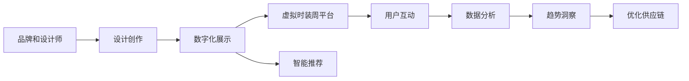

                 

# 虚拟时装周:全球时尚产业的数字化革新展示

## 1. 背景介绍

在数字化浪潮的推动下，全球时尚产业正在经历一场前所未有的变革。传统依赖实体空间和物理展示的时装周，正在向虚拟化、数字化转型，形成了一个全新的展示舞台。数字化时装周不仅为品牌和设计师提供了更加广阔的展示平台，也为用户带来了全新的购物体验。本文将详细介绍虚拟时装周背后的技术和应用，以及其带来的创新和挑战。

## 2. 核心概念与联系

### 2.1 核心概念概述

在探讨虚拟时装周的数字化展示前，我们先来了解几个核心概念：

- **虚拟时装周 (Virtual Fashion Week)**：通过虚拟现实 (VR)、增强现实 (AR) 和混合现实 (MR) 等技术，将时装展示从实体空间转移到虚拟世界，使用户能够沉浸式地体验时装发布。

- **数字化展示**：通过计算机图形学、人工智能、互联网和移动技术等手段，构建虚拟场景和互动体验，实现品牌、设计师和用户之间更加紧密的连接。

- **智能推荐**：利用大数据分析和机器学习技术，根据用户的兴趣和行为，提供个性化的时装推荐和购物体验。

- **实时互动**：借助互联网和社交媒体，品牌和设计师能够实时与全球用户互动，提升品牌影响力和用户参与度。

- **数据驱动**：通过收集、分析和应用用户数据，洞察时尚趋势，优化商品设计和供应链管理。

### 2.2 核心概念原理和架构的 Mermaid 流程图



这个流程图展示了从品牌和设计师的设计创作，到数字化展示，再到智能推荐、用户互动、数据分析和供应链优化的整个数字化时装周生态链。通过虚拟时装周平台，品牌和设计师能够将创意与用户实时连接，实现创意变现的数字化转型。

## 3. 核心算法原理 & 具体操作步骤

### 3.1 算法原理概述

虚拟时装周的数字化展示和智能推荐，主要依赖于计算机视觉、自然语言处理和推荐系统等算法。这些算法通过处理海量的用户数据和视觉数据，为用户提供个性化的体验。

- **计算机视觉**：用于图像识别、物体跟踪和姿态估计等，帮助用户在虚拟环境中识别和定位衣服和配饰。

- **自然语言处理**：用于文本分析、情感识别和语义理解等，帮助品牌和设计师更好地理解用户需求和反馈。

- **推荐系统**：基于用户行为数据和商品信息，利用协同过滤、矩阵分解和深度学习等技术，为用户推荐最符合其兴趣的时装。

### 3.2 算法步骤详解

#### 步骤1: 数据采集与预处理

1. **用户数据采集**：通过社交媒体、电商平台和线下活动等渠道，收集用户的购买记录、评论、评分和互动行为数据。

2. **图像数据采集**：从时装发布、拍摄和电商网站等渠道，获取高精度的时装图片和视频，并进行预处理，如裁剪、旋转和标准化。

3. **数据清洗与标注**：对采集到的数据进行清洗和标注，去除噪音和异常值，确保数据的准确性和完整性。

#### 步骤2: 模型训练与优化

1. **图像识别模型**：使用卷积神经网络（CNN）对时装图片进行分类和标注，如颜色、款式、材质等。

2. **情感分析模型**：使用循环神经网络（RNN）或长短期记忆网络（LSTM）对用户评论和反馈进行情感分析，提取用户情感倾向。

3. **推荐系统模型**：使用协同过滤、矩阵分解或深度学习算法，如CNN、RNN或神经网络推荐系统（NRS），训练推荐模型。

#### 步骤3: 模型评估与部署

1. **模型评估**：使用交叉验证和A/B测试等方法，评估模型的性能和准确度，调整模型参数和算法。

2. **模型部署**：将训练好的模型部署到虚拟时装周平台，实现实时展示和推荐。

### 3.3 算法优缺点

#### 优点

- **成本低**：相比传统的时装周，数字化展示能够大幅度降低场地租赁、物流和人工成本。

- **覆盖广**：虚拟时装周能够覆盖全球用户，提高品牌和设计师的国际影响力。

- **互动强**：通过虚拟现实和增强现实技术，用户能够沉浸式地体验时装发布，增强参与感和体验感。

- **数据驱动**：通过收集和分析用户数据，品牌和设计师能够洞察时尚趋势和用户需求，优化设计和供应链。

#### 缺点

- **技术门槛高**：虚拟时装周的实现需要高级的计算机视觉和自然语言处理技术，对技术和资源要求较高。

- **用户体验有限**：虽然虚拟展示提供了沉浸式的体验，但与实体展示相比，用户互动性和即时反馈仍然存在差距。

- **隐私问题**：在数据采集和分析过程中，用户隐私保护是一个重要的挑战。品牌和设计师需要采取严格的隐私保护措施，避免数据泄露和滥用。

### 3.4 算法应用领域

虚拟时装周的数字化展示和智能推荐，不仅适用于时装品牌和设计师，还广泛应用于以下几个领域：

- **电商购物**：通过虚拟展示和智能推荐，提升电商平台的商品展示和用户购物体验。

- **文化娱乐**：虚拟时装周可以拓展到音乐、艺术和游戏等领域，提供丰富的虚拟体验和文化娱乐内容。

- **旅游推广**：结合虚拟现实技术，展示旅游地的风土人情和文化特色，吸引游客和投资者。

- **教育培训**：虚拟时装周可以用于时尚教育培训和虚拟实习，让学生和员工更好地理解时尚产业和商业运营。

## 4. 数学模型和公式 & 详细讲解 & 举例说明

### 4.1 数学模型构建

在虚拟时装周的数字化展示和智能推荐中，主要涉及到以下几种数学模型：

- **图像识别模型**：基于CNN的图像分类模型，可以表示为 $f(x; \theta) = Wx + b$，其中 $x$ 为输入图像，$\theta$ 为模型参数，$W$ 和 $b$ 分别为权重和偏置。

- **情感分析模型**：基于RNN或LSTM的文本分类模型，可以表示为 $g(x; \theta) = \sum_i w_i \cdot x_i$，其中 $x_i$ 为输入文本中的每个单词，$w_i$ 为每个单词的权重。

- **推荐系统模型**：基于矩阵分解的协同过滤模型，可以表示为 $\hat{y} = \theta^T \Phi(x)$，其中 $y$ 为预测评分，$x$ 为用户和商品的特征向量，$\theta$ 为模型参数，$\Phi$ 为特征映射函数。

### 4.2 公式推导过程

#### 图像分类模型推导

以卷积神经网络（CNN）为例，其核心公式为：

$$
f(x; \theta) = \sum_{i=1}^{n} \sum_{j=1}^{m} w_{i,j}x_{i,j} + b
$$

其中 $x_{i,j}$ 为输入图像的第 $i$ 行、第 $j$ 列的像素值，$w_{i,j}$ 为卷积核的权重参数，$b$ 为偏置参数。

#### 情感分析模型推导

以循环神经网络（RNN）为例，其核心公式为：

$$
g(x; \theta) = \sum_{i=1}^{n} w_i \cdot \text{tanh}(a_{i-1}) \cdot x_i + b
$$

其中 $x_i$ 为输入文本中的第 $i$ 个单词，$a_{i-1}$ 为前一个时间步的状态，$\text{tanh}$ 为激活函数，$w_i$ 和 $b$ 分别为权重和偏置参数。

#### 推荐系统模型推导

以基于矩阵分解的协同过滤模型为例，其核心公式为：

$$
\hat{y} = \theta^T \Phi(x)
$$

其中 $x$ 为用户和商品的特征向量，$\theta$ 为模型参数，$\Phi$ 为特征映射函数。

### 4.3 案例分析与讲解

#### 案例1: 图像识别模型

某品牌希望通过虚拟时装周展示其最新系列，需要对时装图片进行自动分类。选择使用CNN模型进行图像识别，模型参数 $\theta$ 的初始值为预训练好的权重。在虚拟时装周上展示时，将时装图片输入模型，输出分类结果，如款式、颜色和材质等。

#### 案例2: 情感分析模型

某设计师希望了解用户对其设计的反馈，使用RNN模型进行情感分析。将用户评论输入模型，输出情感倾向，如正面、负面或中性。通过分析情感反馈，设计师可以优化设计，提高用户满意度。

#### 案例3: 推荐系统模型

某电商平台希望提升用户购物体验，使用协同过滤模型进行推荐。根据用户浏览和购买记录，生成个性化推荐列表，提升用户留存率和转化率。

## 5. 项目实践：代码实例和详细解释说明

### 5.1 开发环境搭建

在进行虚拟时装周的数字化展示和智能推荐开发前，我们需要准备好开发环境。以下是使用Python进行开发的环境配置流程：

1. **安装Anaconda**：从官网下载并安装Anaconda，用于创建独立的Python环境。

2. **创建虚拟环境**：
```bash
conda create -n fashion-env python=3.8 
conda activate fashion-env
```

3. **安装相关库**：
```bash
conda install torch torchvision torchaudio cudatoolkit=11.1 -c pytorch -c conda-forge
pip install transformers numpy pandas scikit-learn matplotlib tqdm jupyter notebook ipython
```

4. **安装虚拟现实库**：
```bash
pip install pyvr pyopenvr
```

### 5.2 源代码详细实现

以下是一个基于CNN的图像分类模型的Python代码实现，用于虚拟时装周的图像展示和分类。

```python
import torch
import torchvision
import torchvision.transforms as transforms
import torch.nn as nn
import torch.nn.functional as F

class CNNModel(nn.Module):
    def __init__(self):
        super(CNNModel, self).__init__()
        self.conv1 = nn.Conv2d(3, 64, kernel_size=3, stride=1, padding=1)
        self.relu1 = nn.ReLU()
        self.maxpool1 = nn.MaxPool2d(kernel_size=2, stride=2)
        self.conv2 = nn.Conv2d(64, 128, kernel_size=3, stride=1, padding=1)
        self.relu2 = nn.ReLU()
        self.maxpool2 = nn.MaxPool2d(kernel_size=2, stride=2)
        self.fc1 = nn.Linear(128 * 8 * 8, 256)
        self.relu3 = nn.ReLU()
        self.fc2 = nn.Linear(256, 10)
        self.softmax = nn.Softmax(dim=1)
        
    def forward(self, x):
        x = self.conv1(x)
        x = self.relu1(x)
        x = self.maxpool1(x)
        x = self.conv2(x)
        x = self.relu2(x)
        x = self.maxpool2(x)
        x = x.view(x.size(0), -1)
        x = self.fc1(x)
        x = self.relu3(x)
        x = self.fc2(x)
        x = self.softmax(x)
        return x

model = CNNModel()
model.load_state_dict(torch.load('pretrained_model.pth'))

# 加载图像数据并进行预处理
transform = transforms.Compose([
    transforms.Resize((224, 224)),
    transforms.ToTensor(),
    transforms.Normalize(mean=[0.485, 0.456, 0.406], std=[0.229, 0.224, 0.225])
])

# 加载数据集
train_data = torchvision.datasets.CIFAR10(root='./data', train=True, download=True, transform=transform)
train_loader = torch.utils.data.DataLoader(train_data, batch_size=32, shuffle=True)

# 定义损失函数和优化器
criterion = nn.CrossEntropyLoss()
optimizer = torch.optim.Adam(model.parameters(), lr=0.001)

# 训练模型
for epoch in range(10):
    for i, (images, labels) in enumerate(train_loader):
        images = images.to(device)
        labels = labels.to(device)
        optimizer.zero_grad()
        outputs = model(images)
        loss = criterion(outputs, labels)
        loss.backward()
        optimizer.step()
        if i % 100 == 0:
            print(f'Epoch {epoch+1}, step {i}, loss: {loss.item():.4f}')

# 保存模型
torch.save(model.state_dict(), 'fashion_model.pth')
```

### 5.3 代码解读与分析

**CNNModel类**：
- `__init__`方法：初始化卷积、池化、全连接层和激活函数等组件。
- `forward`方法：定义前向传播流程，输入图片经过卷积、池化和全连接层，最终输出分类结果。

**数据加载与预处理**：
- `transforms`模块：用于图像数据的增强和预处理，包括大小调整、归一化和张量转换等。
- `train_data`：加载CIFAR-10数据集，进行预处理和归一化。
- `train_loader`：使用`DataLoader`加载数据集，进行批次化和随机打乱。

**模型训练**：
- `criterion`：定义交叉熵损失函数。
- `optimizer`：定义Adam优化器，学习率为0.001。
- `for`循环：迭代训练10个epoch，每个epoch内对每批数据进行前向传播和反向传播，更新模型参数。

**模型保存**：
- `torch.save`：保存模型参数，供虚拟时装周使用。

通过以上代码，可以构建一个基于CNN的图像分类模型，用于虚拟时装周的图像展示和分类。

## 6. 实际应用场景

### 6.1 智能推荐系统

虚拟时装周的数字化展示不仅仅是展示品牌和设计师的创意，还可以通过智能推荐系统，为全球用户提供个性化的时装推荐和购物体验。

以某电商平台为例，该平台通过虚拟时装周展示最新系列，同时使用推荐系统为用户推荐相关商品。推荐系统利用用户历史行为数据和商品特征信息，通过协同过滤、矩阵分解或深度学习算法，生成个性化推荐列表。用户可以通过虚拟时装周平台浏览和选购商品，提升购物体验和满意度。

### 6.2 实时互动平台

虚拟时装周通过虚拟现实和增强现实技术，为品牌和设计师提供了与全球用户实时互动的平台。用户可以通过虚拟现实头盔或AR眼镜，沉浸式地体验时装发布，与设计师互动，了解时装背后的故事和设计理念。

以某虚拟时装周平台为例，平台通过构建虚拟会议室和互动空间，让用户能够与品牌和设计师进行实时交流。设计师可以实时展示设计草图和样衣，用户可以提出意见和建议，双方可以实时沟通和协作。这种实时互动的方式，不仅提升了用户体验，还增强了品牌和设计师的影响力。

### 6.3 线上互动体验

虚拟时装周不仅限于时装展示和互动，还可以拓展到线上互动体验。用户可以通过虚拟时装周平台，参与时尚赛事、挑战和比赛，展示自己的创意和设计。

以某虚拟时装周平台为例，平台组织线上时尚比赛，邀请用户上传自己的时装设计，参与评审和投票。用户可以展示自己的创意和设计，与其他用户互动和交流，提升创作能力和参与感。这种线上互动体验，不仅丰富了用户的时尚生活，还激发了用户的创作热情。

## 7. 工具和资源推荐

### 7.1 学习资源推荐

为了帮助开发者系统掌握虚拟时装周的数字化展示和智能推荐技术，这里推荐一些优质的学习资源：

1. **《深度学习》课程**：斯坦福大学开设的深度学习课程，由吴恩达教授主讲，系统介绍了深度学习的基础理论和应用实践。

2. **《计算机视觉：基础与实践》书籍**：李飞飞和戴博思合著，全面介绍了计算机视觉的基础知识和应用案例，涵盖图像分类、目标检测和语义分割等。

3. **《自然语言处理》课程**：李航教授的《自然语言处理综论》，系统介绍了自然语言处理的基础理论和应用实践，涵盖文本分类、情感分析和文本生成等。

4. **《推荐系统》课程**：斯坦福大学开设的推荐系统课程，由John Platt主讲，系统介绍了推荐系统的基础理论和应用实践，涵盖协同过滤、矩阵分解和深度学习推荐等。

5. **Kaggle竞赛平台**：Kaggle是一个数据科学竞赛平台，提供大量时尚数据集和推荐系统竞赛，开发者可以通过参与竞赛，提升自己的技术水平。

通过对这些资源的学习实践，相信你一定能够快速掌握虚拟时装周的数字化展示和智能推荐技术的精髓，并用于解决实际的时尚问题。

### 7.2 开发工具推荐

高效的开发离不开优秀的工具支持。以下是几款用于虚拟时装周开发的常用工具：

1. **PyTorch**：基于Python的开源深度学习框架，灵活动态的计算图，适合快速迭代研究。支持GPU加速，适合大规模深度学习任务。

2. **TensorFlow**：由Google主导开发的开源深度学习框架，生产部署方便，适合大规模工程应用。支持分布式训练和多种硬件平台。

3. **PaddlePaddle**：百度开源的深度学习框架，具有高性能、易用性和灵活性等特点，适合大规模商业应用。

4. **OpenXR**：开源增强现实平台，支持跨平台开发和部署，提供丰富的工具和API，适合AR应用的开发。

5. **Unreal Engine**：一款强大的游戏引擎，支持虚拟现实和增强现实的开发，提供丰富的工具和资源，适合虚拟时装周平台的制作。

6. **Unity 3D**：一款流行的游戏引擎，支持虚拟现实和增强现实的开发，提供丰富的工具和资源，适合虚拟时装周平台的制作。

合理利用这些工具，可以显著提升虚拟时装周开发的效率和质量，加快创新迭代的步伐。

### 7.3 相关论文推荐

虚拟时装周的数字化展示和智能推荐技术，涉及计算机视觉、自然语言处理和推荐系统等多个领域。以下是几篇奠基性的相关论文，推荐阅读：

1. **《ImageNet Classification with Deep Convolutional Neural Networks》**：AlexNet论文，提出了基于卷积神经网络的图像分类模型，开创了深度学习在计算机视觉中的应用。

2. **《Long Short-Term Memory》**：LSTM论文，提出了长短期记忆网络，在自然语言处理中的应用效果显著。

3. **《An Efficient Subspace Clustering Algorithm》**：ALS算法，提出了基于矩阵分解的协同过滤模型，广泛应用于推荐系统领域。

4. **《Deep Neural Networks for Large-Scale Image Recognition》**：Inception论文，提出了Inception网络结构，提升了深度学习模型的效率和性能。

5. **《Neural Collaborative Filtering》**：提出基于深度神经网络的协同过滤模型，在推荐系统中的应用效果显著。

这些论文代表了大规模数字化展示和智能推荐技术的发展脉络。通过学习这些前沿成果，可以帮助研究者把握学科前进方向，激发更多的创新灵感。

## 8. 总结：未来发展趋势与挑战

### 8.1 总结

本文对虚拟时装周的数字化展示和智能推荐方法进行了全面系统的介绍。首先阐述了虚拟时装周的背景和意义，明确了数字化展示在时尚产业中的独特价值。其次，从原理到实践，详细讲解了虚拟时装周的图像识别、情感分析和推荐系统等核心算法，并给出了微调范式的代码实现。同时，本文还广泛探讨了虚拟时装周在智能推荐、实时互动和线上体验等领域的实际应用，展示了其带来的创新和挑战。

通过本文的系统梳理，可以看到，虚拟时装周的数字化展示和智能推荐技术正在成为时尚产业的重要范式，极大地拓展了时尚产业的应用边界，催生了更多的落地场景。得益于深度学习、计算机视觉和推荐系统等技术的突破，虚拟时装周能够提供更加个性化、沉浸式的体验，为时尚产业带来革命性的变化。未来，伴随技术的持续演进，虚拟时装周必将在全球时尚产业中扮演越来越重要的角色。

### 8.2 未来发展趋势

展望未来，虚拟时装周的数字化展示和智能推荐技术将呈现以下几个发展趋势：

1. **技术融合**：虚拟时装周将更加深入地融合计算机视觉、自然语言处理和推荐系统等技术，提供更加全面、丰富的数字化展示和互动体验。

2. **用户定制**：通过深度学习和个性化推荐算法，虚拟时装周能够更好地理解用户需求和偏好，提供更加个性化的推荐和体验。

3. **跨平台互动**：虚拟时装周将不仅仅局限于虚拟现实和增强现实，还将拓展到虚拟现实、增强现实和混合现实等多个平台，提供更加广泛、多样的互动体验。

4. **数据驱动**：通过大数据分析和人工智能技术，虚拟时装周能够更好地洞察时尚趋势和用户需求，优化设计和供应链管理。

5. **元宇宙趋势**：虚拟时装周将与元宇宙概念相结合，构建更加丰富、沉浸的虚拟体验，带来全新的时尚生活方式。

以上趋势凸显了虚拟时装周数字化展示和智能推荐技术的广阔前景。这些方向的探索发展，必将进一步提升时尚产业的智能化水平，推动时尚产业的数字化转型和升级。

### 8.3 面临的挑战

尽管虚拟时装周的数字化展示和智能推荐技术已经取得了瞩目成就，但在迈向更加智能化、普适化应用的过程中，它仍面临着诸多挑战：

1. **技术门槛高**：虚拟时装周的数字化展示和智能推荐需要高级的计算机视觉和自然语言处理技术，对技术和资源要求较高。

2. **用户体验有限**：虽然虚拟展示提供了沉浸式的体验，但与实体展示相比，用户互动性和即时反馈仍然存在差距。

3. **隐私问题**：在数据采集和分析过程中，用户隐私保护是一个重要的挑战。品牌和设计师需要采取严格的隐私保护措施，避免数据泄露和滥用。

4. **设备成本高**：虚拟时装周的数字化展示和互动体验需要高性能的硬件设备，如VR头盔和AR眼镜，这对设备的普及和成本控制提出了挑战。

5. **内容审核**：虚拟时装周的内容审核和管理需要更加严格和规范，确保内容的合法性和健康性。

正视虚拟时装周面临的这些挑战，积极应对并寻求突破，将是实现时尚产业数字化转型和升级的关键。

### 8.4 研究展望

面对虚拟时装周数字化展示和智能推荐所面临的挑战，未来的研究需要在以下几个方面寻求新的突破：

1. **多模态融合**：将视觉、听觉和触觉等多模态信息融合到虚拟时装周中，提供更加全面、丰富的用户体验。

2. **实时渲染**：提升虚拟时装周的实时渲染和互动性能，减少用户等待时间和提升互动体验。

3. **智能推荐**：进一步优化推荐算法，结合用户行为数据和时尚趋势，提供更加精准、个性化的推荐服务。

4. **用户交互**：引入自然语言处理和智能对话技术，实现更加自然、流畅的用户交互，提升用户体验。

5. **伦理和安全**：研究虚拟时装周的伦理和安全问题，确保技术的健康发展和用户权益的保护。

这些研究方向的探索，必将引领虚拟时装周的数字化展示和智能推荐技术迈向更高的台阶，为时尚产业带来革命性的变化。

## 9. 附录：常见问题与解答

**Q1: 虚拟时装周的数字化展示和智能推荐技术是否适用于所有时尚品牌和设计师？**

A: 虚拟时装周的数字化展示和智能推荐技术适用于大多数时尚品牌和设计师，但需要根据具体的品牌定位和设计风格进行适应和优化。虚拟时装周需要高质量的图像和视频数据，以及先进的深度学习和计算机视觉技术，品牌和设计师需要具备相应的技术和资源。

**Q2: 虚拟时装周的数字化展示和智能推荐技术如何降低用户隐私风险？**

A: 虚拟时装周的数字化展示和智能推荐技术需要在数据采集和分析过程中，采取严格的隐私保护措施，避免数据泄露和滥用。品牌和设计师可以采用匿名化处理、数据脱敏和加密传输等技术，保护用户隐私。此外，还需要建立明确的数据使用协议和隐私政策，确保用户的知情权和选择权。

**Q3: 虚拟时装周的数字化展示和智能推荐技术需要哪些硬件设备支持？**

A: 虚拟时装周的数字化展示和智能推荐技术需要高性能的硬件设备支持，如VR头盔、AR眼镜和高清显示设备。这些设备需要支持高分辨率、低延迟和实时渲染等功能，以保证用户的沉浸式体验。此外，还需要高性能的计算平台，如GPU和TPU等，以支持深度学习模型的训练和推理。

**Q4: 虚拟时装周的数字化展示和智能推荐技术如何提升用户的时尚体验？**

A: 虚拟时装周的数字化展示和智能推荐技术通过计算机视觉、自然语言处理和推荐系统等技术，为用户提供更加个性化、沉浸式的时尚体验。通过智能推荐系统，用户可以获取个性化的时尚商品推荐和购物体验；通过虚拟现实和增强现实技术，用户可以沉浸式地体验时装发布和互动；通过线上互动体验，用户可以参与时尚赛事和挑战，展示自己的创意和设计。这些技术手段极大地提升了用户的时尚体验和参与感。

---

作者：禅与计算机程序设计艺术 / Zen and the Art of Computer Programming

