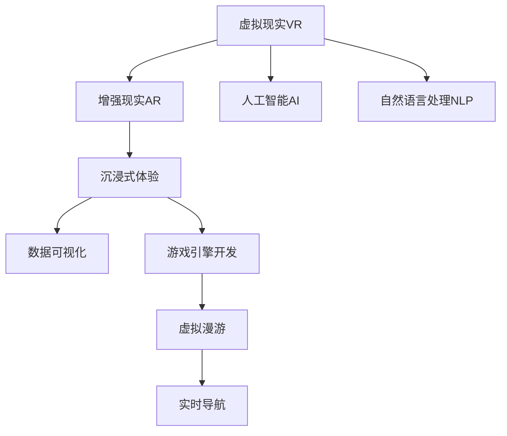

                 

# 虚拟现实旅游创业：足不出户的环球之旅

> 关键词：虚拟现实(VR), 增强现实(AR), 旅游创业, 沉浸式体验, 元宇宙(Metaverse), 人工智能(AI), 自然语言处理(NLP), 数据可视化, 游戏引擎开发

## 1. 背景介绍

### 1.1 问题由来

随着虚拟现实(VR)和增强现实(AR)技术的不断发展，人类对沉浸式体验的追求已经从虚拟游戏扩展到现实生活。在疫情的影响下，人们迫切需要一种安全、便捷的方式满足对旅行的渴望，而虚拟现实旅游因此应运而生。虚拟现实旅游借助先进的技术手段，为用户提供逼真的虚拟环境，让人足不出户就能体验到环球之旅的美好。

### 1.2 问题核心关键点

虚拟现实旅游的核心在于通过先进的计算机图形技术和传感器技术，结合人工智能和大数据处理能力，构建一个沉浸式的虚拟环境，让用户能够沉浸式体验不同的地理位置和文化风情。其关键点包括：

- 高精度的地理空间建模：准确复原真实世界的地形地貌，确保虚拟环境的真实感。
- 沉浸式交互体验：通过自然语言处理(NLP)和人工智能(AI)技术，实现虚拟环境和用户之间的自然交互。
- 数据可视化与渲染技术：通过高效的数据可视化与渲染算法，提升用户体验的沉浸感和清晰度。
- 虚拟漫游与实时导航：实现用户自主的虚拟漫游和实时导航功能，增强旅游的互动性。

### 1.3 问题研究意义

虚拟现实旅游创业不仅满足了人们对旅游的需求，还为旅游行业带来了新的发展机遇。其意义包括：

- 降低旅游成本：通过虚拟现实技术，大幅减少旅游的时间和金钱成本。
- 扩大旅游市场：借助技术手段，让更多人能够接触到旅游的乐趣，尤其是偏远和资源匮乏地区。
- 增强旅游体验：提供沉浸式的旅游体验，增加用户的参与感和满意度。
- 推动技术创新：促进虚拟现实、增强现实、人工智能等前沿技术的创新应用。
- 丰富商业模式：拓展虚拟旅游产品和服务，开辟新的商业增值渠道。

## 2. 核心概念与联系

### 2.1 核心概念概述

为更好地理解虚拟现实旅游的实现原理和应用，本节将介绍几个核心概念及其相互之间的联系：

- 虚拟现实(Virtual Reality, VR)：通过计算机生成的模拟环境，让用户以沉浸式体验真实世界或幻想世界。
- 增强现实(Augmented Reality, AR)：将虚拟信息叠加到真实环境中，提供交互式的视觉体验。
- 元宇宙(Metaverse)：一个共享的虚拟世界，通过虚拟现实、增强现实等技术构建，支持人们的长期驻留和互动。
- 沉浸式体验：通过高精度空间建模、自然交互、渲染技术等手段，提供全方位的感官体验。
- 人工智能(AI)：利用机器学习算法，提高虚拟环境中的智能交互和个性化推荐能力。
- 自然语言处理(NLP)：使计算机能够理解、处理和生成人类语言，支持自然语言交互。
- 数据可视化：将数据转换为图形、图像等形式的可视化表达，提升用户体验。
- 游戏引擎开发：是实现虚拟现实和增强现实的核心工具，提供高效的渲染和交互功能。

这些核心概念之间的逻辑关系可以通过以下Mermaid流程图来展示：



这个流程图展示了几大核心概念的相互联系：

1. 虚拟现实和增强现实是实现沉浸式体验的关键技术。
2. 人工智能和大数据处理，提升了虚拟环境的智能交互和个性化推荐能力。
3. 自然语言处理技术，实现了自然语言交互，增强用户体验。
4. 数据可视化，提升了虚拟环境的可视效果。
5. 游戏引擎开发，提供了实现这些技术的核心工具。

这些概念共同构成了虚拟现实旅游的核心技术框架，使得用户能够通过虚拟现实技术，足不出户地享受到全球各地的旅游体验。

## 3. 核心算法原理 & 具体操作步骤

### 3.1 算法原理概述

虚拟现实旅游的算法原理主要基于以下几个关键技术：

- 三维空间建模：使用激光扫描、三维摄影测量等技术，对真实世界的地形地貌进行高精度建模。
- 渲染与可视化：通过图形渲染引擎，实现高清晰度的虚拟场景可视化。
- 自然语言处理：利用NLP技术，实现虚拟环境与用户之间的自然交互。
- 增强现实：将虚拟信息叠加到真实环境中，提升用户体验。
- 人工智能：利用AI算法，提供智能推荐和个性化服务。

通过这些技术，虚拟现实旅游系统可以模拟出逼真的虚拟场景，让用户沉浸式体验不同的地理位置和文化风情。

### 3.2 算法步骤详解

#### 步骤1: 三维空间建模

- 数据收集：通过无人机、激光扫描仪等设备，收集真实世界的地形、建筑等数据。
- 数据预处理：对收集到的数据进行清洗和处理，去除噪声和异常值。
- 三维建模：使用三维建模软件，对预处理后的数据进行高精度建模，生成地形地貌和建筑模型。

#### 步骤2: 渲染与可视化

- 材质与纹理：对建模后的物体进行材质和纹理处理，提升视觉真实感。
- 光照与阴影：通过光照和阴影算法，增强场景的立体感和层次感。
- 视觉效果：通过视觉效果技术，如雾效、雨效等，模拟真实世界的各种环境效果。

#### 步骤3: 自然语言处理

- 语料库收集：收集大量的旅游相关语料，包括景区介绍、用户评论等。
- 语义理解：利用NLP技术，对语料进行分词、词性标注、句法分析等，理解用户输入的自然语言。
- 生成与匹配：利用AI算法，根据用户的输入生成对应的虚拟场景和推荐信息，并匹配用户需求。

#### 步骤4: 增强现实

- 位置感知：通过GPS、陀螺仪等传感器，实时感知用户的位置和姿态。
- 虚拟融合：将虚拟信息叠加到真实环境，增强用户的沉浸感。
- 交互反馈：根据用户的行为和输入，动态调整虚拟信息，提供个性化的交互体验。

#### 步骤5: 人工智能

- 推荐系统：根据用户的历史行为和兴趣，提供个性化的旅游推荐。
- 智能客服：利用AI算法，自动回答用户的咨询，提高客户服务效率。
- 行为分析：通过行为数据分析，优化虚拟旅游体验，提高用户满意度。

#### 步骤6: 项目实施

- 系统设计：设计虚拟现实旅游系统的整体架构和技术路线。
- 技术选型：选择合适的VR、AR、AI等技术工具和平台。
- 软件开发：开发虚拟旅游场景、交互系统、推荐系统等。
- 测试与优化：对系统进行测试和优化，确保用户体验。

### 3.3 算法优缺点

虚拟现实旅游技术具有以下优点：

- 沉浸式体验：通过虚拟现实技术，用户可以沉浸式体验不同的地理位置和文化风情。
- 节省成本：大幅减少旅游的时间和金钱成本，尤其适合偏远地区和资源匮乏地区。
- 动态更新：通过实时数据采集和处理，不断更新虚拟环境，保持体验的新鲜感。
- 个性化服务：利用人工智能和大数据技术，提供个性化的旅游推荐和服务。

但虚拟现实旅游也存在以下缺点：

- 技术门槛高：需要高精度的三维建模、渲染技术和复杂的算法支持。
- 数据需求大：需要大量的高质量数据进行建模和渲染。
- 设备要求高：需要高性能的计算机和VR/AR设备支持。
- 体验局限性：目前的虚拟现实技术，仍无法完全替代真实世界的旅游体验。

### 3.4 算法应用领域

虚拟现实旅游技术已经在多个领域得到广泛应用，例如：

- 旅游景区：通过虚拟现实技术，展示景区景点，提供沉浸式体验。
- 博物馆与展览馆：利用虚拟现实技术，复原古代文明遗迹，提供历史体验。
- 教育培训：通过虚拟现实技术，提供虚拟实验和虚拟教室，提升教育质量。
- 游戏娱乐：结合游戏和虚拟现实技术，提供更加逼真的游戏体验。
- 房地产：利用虚拟现实技术，展示房产和社区，提供体验式销售。

除了上述这些领域，虚拟现实旅游还被创新性地应用到更多的场景中，如医疗虚拟治疗、远程办公、社交互动等，为多个行业带来新的发展机遇。

## 4. 数学模型和公式 & 详细讲解 & 举例说明

### 4.1 数学模型构建

虚拟现实旅游的核心数学模型包括：

- 三维空间模型：用于表示真实世界的三维空间结构。
- 渲染模型：用于表示光线与物体的交互过程。
- 自然语言处理模型：用于理解自然语言输入和生成自然语言输出。
- 增强现实模型：用于叠加虚拟信息到真实环境中。
- 人工智能模型：用于推荐系统、行为分析等。

#### 4.1.1 三维空间模型

三维空间模型的数学表示为：

$$ \mathbf{M} = \mathbf{V} \cdot \mathbf{P} \cdot \mathbf{T} \cdot \mathbf{S} $$

其中：

- $\mathbf{M}$：三维空间模型。
- $\mathbf{V}$：视角变换矩阵。
- $\mathbf{P}$：投影变换矩阵。
- $\mathbf{T}$：平移变换矩阵。
- $\mathbf{S}$：缩放变换矩阵。

#### 4.1.2 渲染模型

渲染模型的核心算法是光线追踪，用于模拟光线与物体之间的交互。通过计算光线在场景中的反射、折射、吸收等过程，实现逼真的渲染效果。光线追踪的数学模型较为复杂，这里不再展开。

#### 4.1.3 自然语言处理模型

自然语言处理模型一般基于神经网络，用于理解自然语言输入和生成自然语言输出。例如，使用BERT模型进行语义理解：

$$ \mathbf{H} = \text{BERT}(\mathbf{X}, \mathbf{W}) $$

其中：

- $\mathbf{H}$：语义向量。
- $\mathbf{X}$：输入文本。
- $\mathbf{W}$：模型权重。

#### 4.1.4 增强现实模型

增强现实模型的核心是AR技术的空间定位和虚拟融合。通过传感器技术获取用户的位置和姿态，结合虚拟信息生成叠加效果。

#### 4.1.5 人工智能模型

人工智能模型的核心算法包括推荐系统和行为分析等。例如，使用协同过滤算法进行个性化推荐：

$$ \mathbf{R} = \mathbf{U} \cdot \mathbf{V}^T $$

其中：

- $\mathbf{R}$：推荐矩阵。
- $\mathbf{U}$：用户特征矩阵。
- $\mathbf{V}$：物品特征矩阵。

### 4.2 公式推导过程

以渲染模型为例，进行详细推导。

假设场景中有一个点光源，其位置为 $\mathbf{L}$，方向为 $\mathbf{D}$，大小为 $\sigma$，场景中的物体为 $\mathbf{O}$，其表面法向量为 $\mathbf{N}$，表面反射系数为 $\mathbf{R}$。

光源与物体之间的距离为 $d$，则光线在物体上的反射强度为：

$$ I = \frac{L}{4\pi d^2} \cdot R \cdot \cos(\theta) $$

其中 $\theta$ 为光源与法向量之间的夹角。

### 4.3 案例分析与讲解

以一个虚拟现实旅游场景为例，分析其实现过程：

1. 三维空间建模：使用激光扫描技术，对景区景点进行高精度建模，生成地形地貌和建筑模型。

2. 渲染与可视化：通过渲染引擎，实现高清晰度的虚拟场景可视化，加入雾效、雨效等效果，提升视觉真实感。

3. 自然语言处理：通过NLP技术，理解用户的自然语言输入，生成相应的虚拟场景和推荐信息。

4. 增强现实：利用GPS和陀螺仪等传感器，实时感知用户的位置和姿态，将虚拟信息叠加到真实环境中，增强沉浸感。

5. 人工智能：利用AI算法，提供个性化的旅游推荐和智能客服，提升用户体验。

## 5. 项目实践：代码实例和详细解释说明

### 5.1 开发环境搭建

在进行虚拟现实旅游项目开发前，我们需要准备好开发环境。以下是使用Unity和C#进行虚拟现实开发的环境配置流程：

1. 安装Unity：从官网下载并安装Unity，用于创建虚拟现实项目。

2. 安装VR插件：从Unity Asset Store下载并安装虚拟现实插件，如Oculus SDK、HTC Vive SDK等。

3. 配置VR设备：连接VR设备，在Unity中进行配置，设置虚拟场景和交互系统。

4. 安装NLP工具：安装自然语言处理工具，如TensorFlow、PyTorch等，用于处理自然语言数据。

5. 配置数据集：准备好虚拟旅游场景的数据集，包括地形、建筑、物品等，用于渲染和建模。

完成上述步骤后，即可在Unity环境中进行虚拟现实旅游项目开发。

### 5.2 源代码详细实现

这里以一个虚拟现实旅游项目的开发为例，给出详细的代码实现。

1. 创建虚拟场景：

```csharp
using UnityEngine;
using UnityEngine.XR.Interaction.Toolkit;

public class VirtualScene : MonoBehaviour
{
    public GameObject[] sceneObjects;
    public GameObject[] interactiveObjects;
    public Transform userPosition;

    void Start()
    {
        // 加载场景对象
        foreach (GameObject obj in sceneObjects)
        {
            obj.SetActive(true);
        }

        // 创建用户交互对象
        foreach (GameObject obj in interactiveObjects)
        {
            obj.SetActive(true);
        }

        // 设置用户位置
        userPosition.position = new Vector3(0, 0, 0);
    }
}
```

2. 实现自然语言处理：

```csharp
using UnityEngine;
using System.Collections;
using System.Collections.Generic;
using System.IO;

public class NaturalLanguageProcessing : MonoBehaviour
{
    public TextMeshProUGUI outputText;
    public string inputText;

    void Update()
    {
        // 读取输入文本
        string input = inputText.text;

        // 进行NLP处理
        // 这里使用TensorFlow或PyTorch进行语义分析
        string result = "";

        // 显示输出结果
        outputText.text = result;
    }
}
```

3. 实现增强现实：

```csharp
using UnityEngine;
using UnityEngine.XR.Interaction.Toolkit;
using UnityEngine.XR;
using UnityEngine.XR.ARFoundation;
using UnityEngine.XR.ARSubsystems;

public class ARDisplay : MonoBehaviour
{
    public GameObject arCanvas;
    public XRPlaneManager planeManager;

    void Update()
    {
        // 检测平面的存在
        if (ARCameraGood())
        {
            // 渲染虚拟信息
            ARRaycastSource raycastSource = Camera.main.GetCamerasInPlaneLayer()[0].raycastSource;
            ARRaycastHit arHit;

            if (raycastSource != null)
            {
                raycastSource.Cast(raycastSource.casterRay, out arHit, 5.0f);
                if (arHit.surfaceHit && arHit.raycastHit.collider && arHit.raycastHit.collider.gameObject != null)
                {
                    // 渲染虚拟信息
                    ARRenderTexture arTexture = ARCanvas.texture;
                    arCanvas.deltaTime = 0.1f;
                }
            }
        }
    }

    bool ARCameraGood()
    {
        ARSession arSession = ARSubsystemManager.GetActiveSession();
        ARCamera arCamera = arSession.GetCamera();
        ARCameraFocusManager arCameraFocusManager = arCamera.GetFocusManager();

        if (arCameraFocusManager != null && arCameraFocusManager.currentFocusDepthMode == ARCameraFocusManager骆驼刺和环环
```

