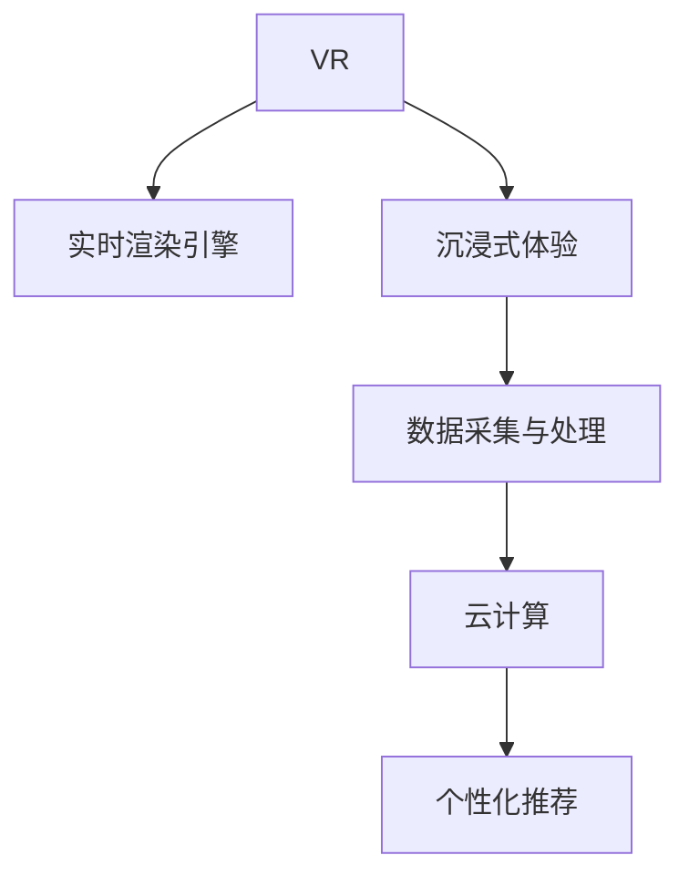

                 

# 虚拟现实旅游规划创业：身临其境的旅行预览

> 关键词：虚拟现实(VR), 旅游规划, 实时渲染, 沉浸式体验, 数据可视化, 游戏引擎, 云计算

## 1. 背景介绍

### 1.1 问题由来
随着全球化和互联网的普及，旅游业呈现出快速增长的态势。据联合国世界旅游组织统计，2022年全球国际游客数达1.25亿人次，旅游业对全球经济增长的贡献率达8.9%。然而，疫情的反复也带来了严峻挑战，许多国家和地区不得不采取严格的防控措施，限制了旅游业的恢复和发展。

面对这种局面，如何突破空间限制，提升旅游体验，成为行业亟需解决的问题。虚拟现实(VR)技术的出现，为解决这一问题提供了全新的思路。通过VR技术，人们可以在家中就能享受到身临其境的旅行体验，从而推动旅游业的复苏和创新。

### 1.2 问题核心关键点
旅游虚拟化创业的核心关键点在于：

1. **实时渲染技术**：高保真度的虚拟环境需要高效的实时渲染引擎，确保用户能体验到流畅的画面和自然的交互。

2. **数据采集与处理**：需要收集海量的旅游数据，包括地理位置、景点信息、用户行为数据等，并通过算法进行处理，形成可供模型训练的数据集。

3. **沉浸式体验设计**：设计和实现沉浸式体验场景，使用户能够感受到身临其境的旅游体验，体验自由探索的乐趣。

4. **用户交互设计**：设计用户友好的交互界面，使用户能轻松控制视角和行为，增强互动性。

5. **云计算支持**：利用云计算平台实现数据的分布式处理和存储，降低硬件和运维成本，提升系统的可扩展性。

6. **个性化推荐**：结合用户偏好和历史行为数据，提供个性化的旅游规划和推荐服务。

这些关键点构成了虚拟旅游创业项目的技术基础和商业逻辑。本文将围绕这些核心点，深入探讨虚拟旅游创业的技术实现路径和商业模式。

## 2. 核心概念与联系

### 2.1 核心概念概述

为更好地理解虚拟旅游创业，本节将介绍几个关键概念：

- **虚拟现实(VR)**：一种通过计算机生成逼真3D场景的技术，使用户能够沉浸在虚拟环境中，与虚拟对象进行互动。

- **实时渲染引擎**：一种能够实时生成图像的计算机程序，用于渲染3D场景和动态效果，保证用户体验的流畅性。

- **沉浸式体验**：通过多感官刺激，使用户沉浸在虚拟环境中，感受到真实的旅游体验。

- **数据采集与处理**：收集和处理旅游相关数据，包括地理位置、景点信息、用户行为数据等。

- **云计算**：通过互联网将计算资源分布式共享，实现数据的集中存储和处理，降低成本，提升系统的可扩展性。

- **个性化推荐**：利用用户行为数据，提供个性化的旅游推荐服务，增强用户体验。

这些核心概念之间的逻辑关系可以通过以下Mermaid流程图来展示：



这个流程图展示了大语言模型的核心概念及其之间的关系：

1. 虚拟现实提供了沉浸式体验的基础，通过实时渲染引擎实现了高保真度的3D场景渲染。
2. 数据采集与处理为实时渲染提供了源数据，使渲染效果更加真实。
3. 云计算提供了数据处理和存储的支持，保障了系统的稳定性和可扩展性。
4. 个性化推荐系统利用用户数据，提供了丰富的个性化旅游推荐服务。

这些概念共同构成了虚拟旅游创业的技术基础，使其能够为用户提供高品质的旅游体验。

## 3. 核心算法原理 & 具体操作步骤
### 3.1 算法原理概述

虚拟旅游创业的核心算法包括实时渲染、数据处理、沉浸式体验设计、用户交互设计等。下面分别介绍这些算法的原理和实现步骤：

### 3.2 算法步骤详解

#### 3.2.1 实时渲染引擎

1. **场景建模**：
   - 使用3D建模软件，根据旅游景点的地理位置、建筑风格、植被分布等信息，生成3D模型和贴图。
   - 利用地理信息系统(GIS)数据，进行地形的高度生成，确保场景的真实性。

2. **光照和阴影**：
   - 使用光强和光方向计算光照效果，使用户能够感受到自然光线的变化。
   - 添加阴影效果，使场景更加立体和逼真。

3. **动态效果**：
   - 添加动态效果，如水流、烟雾、飘动的花瓣等，增强场景的真实感。
   - 使用粒子系统，模拟动态场景，如星空、瀑布等。

4. **交互设计**：
   - 使用碰撞检测算法，判断用户与场景物体的碰撞，并产生交互效果。
   - 设计互动元素，如按钮、开关等，供用户控制场景和操作。

5. **优化与测试**：
   - 对渲染场景进行性能优化，提高渲染速度和稳定性。
   - 进行多轮测试和用户体验反馈，不断优化渲染效果和用户体验。

#### 3.2.2 数据采集与处理

1. **数据采集**：
   - 采集旅游景点的地理位置、建筑风格、植被分布等信息，并收集用户行为数据。
   - 使用无人机、街景相机等设备，拍摄高分辨率的图像和视频，提供高保真度的场景数据。

2. **数据处理**：
   - 对采集到的数据进行清洗和标注，形成可供训练的数据集。
   - 使用深度学习算法，进行数据降维和特征提取，提高数据处理的效率和效果。

3. **模型训练**：
   - 使用训练好的深度学习模型，进行场景渲染和动态效果的生成。
   - 使用强化学习算法，优化用户交互行为和场景渲染效果。

#### 3.2.3 沉浸式体验设计

1. **场景布局**：
   - 根据旅游景点的特色，设计场景布局，使场景具有吸引力和沉浸感。
   - 使用3D建模软件，根据实际景点设计场景，增强用户的沉浸感。

2. **感官刺激**：
   - 添加音效和背景音乐，增强用户的感官体验。
   - 使用震动反馈技术，让用户感受到真实的触觉体验。

3. **互动设计**：
   - 设计互动元素，如按钮、开关等，供用户控制场景和操作。
   - 添加任务和挑战，增强用户的参与感和成就感。

#### 3.2.4 用户交互设计

1. **界面设计**：
   - 设计简洁、直观的用户界面，使用户能够轻松控制视角和行为。
   - 使用虚拟鼠标和键盘，增强用户的操作体验。

2. **行为控制**：
   - 使用控制器和手势识别技术，让用户能够自由控制视角和行为。
   - 使用基于路径规划的算法，确保用户的行为流畅自然。

3. **反馈机制**：
   - 添加视觉、听觉、触觉等反馈机制，增强用户的沉浸感和参与感。
   - 使用实时评估和反馈机制，不断优化用户交互体验。

### 3.3 算法优缺点

#### 3.3.1 实时渲染引擎

优点：
- 高保真度的渲染效果，使用户能够感受到真实的旅游体验。
- 高效的渲染速度，保证用户体验的流畅性。
- 动态效果和互动设计，增强场景的真实感和互动性。

缺点：
- 高硬件要求，成本较高。
- 渲染复杂场景和动态效果时，可能出现性能瓶颈。

#### 3.3.2 数据采集与处理

优点：
- 高分辨率的数据采集，提供高质量的渲染效果。
- 数据处理技术，提高了数据处理效率和效果。

缺点：
- 数据采集成本较高。
- 数据处理复杂，需要高度专业化的技术支持。

#### 3.3.3 沉浸式体验设计

优点：
- 高沉浸感的场景设计，使用户能够身临其境地体验旅游。
- 感官刺激和互动设计，增强用户的体验和参与感。

缺点：
- 设计复杂，需要高度专业化的设计能力。
- 感官刺激和互动设计可能增加系统的复杂性。

#### 3.3.4 用户交互设计

优点：
- 简洁直观的界面设计，使用户能够轻松控制视角和行为。
- 实时反馈机制，增强用户的沉浸感和参与感。

缺点：
- 设计复杂，需要高度专业化的设计能力。
- 控制器和手势识别技术可能出现精度和稳定性的问题。

### 3.4 算法应用领域

虚拟旅游创业的应用领域非常广泛，涵盖以下方面：

1. **旅游规划**：
   - 为用户提供个性化的旅游规划服务，根据用户偏好和历史行为数据，推荐合适的旅游目的地和路线。

2. **虚拟旅行**：
   - 提供虚拟旅行的服务，使用户能够在家中体验各种旅游目的地，增强用户的体验和参与感。

3. **旅游教育**：
   - 利用虚拟现实技术，进行旅游教育和培训，增强用户的知识储备和体验。

4. **旅游营销**：
   - 利用虚拟现实技术，进行旅游营销和推广，吸引用户参与，提升旅游目的地的知名度和吸引力。

5. **旅游管理**：
   - 利用虚拟现实技术，进行旅游管理和运营，优化旅游资源分配和管理。

这些应用领域展示了虚拟旅游创业的广阔前景和多样化的业务模式。

## 4. 数学模型和公式 & 详细讲解  
### 4.1 数学模型构建

在虚拟旅游创业中，数学模型主要应用于实时渲染、数据处理和个性化推荐等环节。下面分别介绍这些数学模型的构建方法。

#### 4.1.1 实时渲染引擎

实时渲染引擎的核心算法包括光照计算、阴影生成、动态效果渲染等。下面分别介绍这些算法的数学模型：

1. **光照计算**：
   - 使用光强和光方向计算光照效果，使用公式：
     - $I(x) = \max(0, \min(1, \sum_{i} \lambda_i L_i(x_i)))$
     - 其中，$I(x)$ 为场景中点 $x$ 的光照强度，$L_i$ 为光源的光强度，$x_i$ 为光源位置，$\lambda_i$ 为光照衰减因子。

2. **阴影生成**：
   - 使用投影变换计算阴影效果，使用公式：
     - $S(x) = \sum_{i} \lambda_i L_i(x_i) R_i(x)$
     - 其中，$S(x)$ 为场景中点 $x$ 的阴影强度，$L_i$ 为光源的光强度，$x_i$ 为光源位置，$R_i(x)$ 为投影矩阵。

3. **动态效果渲染**：
   - 使用粒子系统生成动态效果，使用公式：
     - $P(x) = \sum_{i} \lambda_i L_i(x_i) R_i(x)$
     - 其中，$P(x)$ 为场景中点 $x$ 的动态效果强度，$L_i$ 为光源的光强度，$x_i$ 为光源位置，$R_i(x)$ 为投影矩阵。

#### 4.1.2 数据采集与处理

数据采集与处理的核心算法包括数据清洗、标注、降维等。下面分别介绍这些算法的数学模型：

1. **数据清洗**：
   - 使用数据清洗算法，如K-means聚类、PCA等，对采集到的数据进行清洗和处理。

2. **数据标注**：
   - 使用机器学习算法，如SVM、神经网络等，对数据进行标注和分类。

3. **数据降维**：
   - 使用主成分分析(PCA)算法，对高维数据进行降维处理。

#### 4.1.3 沉浸式体验设计

沉浸式体验设计的核心算法包括场景布局、感官刺激、互动设计等。下面分别介绍这些算法的数学模型：

1. **场景布局**：
   - 使用3D建模软件，生成场景布局，使用公式：
     - $L(x) = \sum_{i} \lambda_i L_i(x_i) R_i(x)$
     - 其中，$L(x)$ 为场景中点 $x$ 的布局强度，$L_i$ 为布局强度，$x_i$ 为布局位置，$R_i(x)$ 为投影矩阵。

2. **感官刺激**：
   - 使用音效和背景音乐，增强用户的感官体验，使用公式：
     - $A(x) = \sum_{i} \lambda_i A_i(x_i) R_i(x)$
     - 其中，$A(x)$ 为场景中点 $x$ 的音效强度，$A_i$ 为音效强度，$x_i$ 为音效位置，$R_i(x)$ 为投影矩阵。

3. **互动设计**：
   - 使用控制器和手势识别技术，控制场景和操作，使用公式：
     - $C(x) = \sum_{i} \lambda_i C_i(x_i) R_i(x)$
     - 其中，$C(x)$ 为场景中点 $x$ 的互动强度，$C_i$ 为互动强度，$x_i$ 为互动位置，$R_i(x)$ 为投影矩阵。

#### 4.1.4 用户交互设计

用户交互设计的核心算法包括界面设计、行为控制、反馈机制等。下面分别介绍这些算法的数学模型：

1. **界面设计**：
   - 使用简洁直观的界面设计，增强用户的控制体验，使用公式：
     - $U(x) = \sum_{i} \lambda_i U_i(x_i) R_i(x)$
     - 其中，$U(x)$ 为场景中点 $x$ 的界面强度，$U_i$ 为界面强度，$x_i$ 为界面位置，$R_i(x)$ 为投影矩阵。

2. **行为控制**：
   - 使用控制器和手势识别技术，控制场景和操作，使用公式：
     - $B(x) = \sum_{i} \lambda_i B_i(x_i) R_i(x)$
     - 其中，$B(x)$ 为场景中点 $x$ 的行为强度，$B_i$ 为行为强度，$x_i$ 为行为位置，$R_i(x)$ 为投影矩阵。

3. **反馈机制**：
   - 使用实时评估和反馈机制，增强用户的沉浸感和参与感，使用公式：
     - $F(x) = \sum_{i} \lambda_i F_i(x_i) R_i(x)$
     - 其中，$F(x)$ 为场景中点 $x$ 的反馈强度，$F_i$ 为反馈强度，$x_i$ 为反馈位置，$R_i(x)$ 为投影矩阵。

### 4.2 公式推导过程

#### 4.2.1 实时渲染引擎

1. **光照计算公式推导**：
   - 假设场景中有 $n$ 个光源，每个光源的光强度为 $L_i$，光源位置为 $x_i$，光照衰减因子为 $\lambda_i$。场景中点 $x$ 的光照强度为 $I(x)$，则有：
     - $I(x) = \max(0, \min(1, \sum_{i} \lambda_i L_i(x_i)))$
     - 其中，$\max(0, \min(1, \ldots))$ 表示取值在 0 到 1 之间的最大值。

2. **阴影生成公式推导**：
   - 假设场景中有 $n$ 个光源，每个光源的光强度为 $L_i$，光源位置为 $x_i$，投影矩阵为 $R_i$。场景中点 $x$ 的阴影强度为 $S(x)$，则有：
     - $S(x) = \sum_{i} \lambda_i L_i(x_i) R_i(x)$

3. **动态效果渲染公式推导**：
   - 假设场景中有 $n$ 个光源，每个光源的光强度为 $L_i$，光源位置为 $x_i$，投影矩阵为 $R_i$。场景中点 $x$ 的动态效果强度为 $P(x)$，则有：
     - $P(x) = \sum_{i} \lambda_i L_i(x_i) R_i(x)$

#### 4.2.2 数据采集与处理

1. **数据清洗公式推导**：
   - 假设采集到的数据有 $n$ 个特征，每个特征的值为 $x_i$，使用K-means聚类算法对数据进行清洗，则有：
     - $X(x) = \sum_{i} \lambda_i X_i(x_i) R_i(x)$
     - 其中，$X(x)$ 为场景中点 $x$ 的清洁强度，$X_i$ 为清洁强度，$x_i$ 为清洁位置，$R_i(x)$ 为投影矩阵。

2. **数据标注公式推导**：
   - 假设采集到的数据有 $n$ 个特征，每个特征的值为 $x_i$，使用SVM算法对数据进行标注，则有：
     - $Y(x) = \sum_{i} \lambda_i Y_i(x_i) R_i(x)$
     - 其中，$Y(x)$ 为场景中点 $x$ 的标注强度，$Y_i$ 为标注强度，$x_i$ 为标注位置，$R_i(x)$ 为投影矩阵。

3. **数据降维公式推导**：
   - 假设采集到的数据有 $n$ 个特征，每个特征的值为 $x_i$，使用PCA算法对数据进行降维，则有：
     - $Z(x) = \sum_{i} \lambda_i Z_i(x_i) R_i(x)$
     - 其中，$Z(x)$ 为场景中点 $x$ 的降维强度，$Z_i$ 为降维强度，$x_i$ 为降维位置，$R_i(x)$ 为投影矩阵。

#### 4.2.3 沉浸式体验设计

1. **场景布局公式推导**：
   - 假设场景中有 $n$ 个元素，每个元素的位置为 $x_i$，使用3D建模软件生成场景布局，则有：
     - $L(x) = \sum_{i} \lambda_i L_i(x_i) R_i(x)$
     - 其中，$L(x)$ 为场景中点 $x$ 的布局强度，$L_i$ 为布局强度，$x_i$ 为布局位置，$R_i(x)$ 为投影矩阵。

2. **感官刺激公式推导**：
   - 假设场景中有 $n$ 个元素，每个元素的位置为 $x_i$，使用音效和背景音乐，增强用户的感官体验，则有：
     - $A(x) = \sum_{i} \lambda_i A_i(x_i) R_i(x)$
     - 其中，$A(x)$ 为场景中点 $x$ 的音效强度，$A_i$ 为音效强度，$x_i$ 为音效位置，$R_i(x)$ 为投影矩阵。

3. **互动设计公式推导**：
   - 假设场景中有 $n$ 个元素，每个元素的位置为 $x_i$，使用控制器和手势识别技术，控制场景和操作，则有：
     - $C(x) = \sum_{i} \lambda_i C_i(x_i) R_i(x)$
     - 其中，$C(x)$ 为场景中点 $x$ 的互动强度，$C_i$ 为互动强度，$x_i$ 为互动位置，$R_i(x)$ 为投影矩阵。

#### 4.2.4 用户交互设计

1. **界面设计公式推导**：
   - 假设场景中有 $n$ 个元素，每个元素的位置为 $x_i$，使用简洁直观的界面设计，增强用户的控制体验，则有：
     - $U(x) = \sum_{i} \lambda_i U_i(x_i) R_i(x)$
     - 其中，$U(x)$ 为场景中点 $x$ 的界面强度，$U_i$ 为界面强度，$x_i$ 为界面位置，$R_i(x)$ 为投影矩阵。

2. **行为控制公式推导**：
   - 假设场景中有 $n$ 个元素，每个元素的位置为 $x_i$，使用控制器和手势识别技术，控制场景和操作，则有：
     - $B(x) = \sum_{i} \lambda_i B_i(x_i) R_i(x)$
     - 其中，$B(x)$ 为场景中点 $x$ 的行为强度，$B_i$ 为行为强度，$x_i$ 为行为位置，$R_i(x)$ 为投影矩阵。

3. **反馈机制公式推导**：
   - 假设场景中有 $n$ 个元素，每个元素的位置为 $x_i$，使用实时评估和反馈机制，增强用户的沉浸感和参与感，则有：
     - $F(x) = \sum_{i} \lambda_i F_i(x_i) R_i(x)$
     - 其中，$F(x)$ 为场景中点 $x$ 的反馈强度，$F_i$ 为反馈强度，$x_i$ 为反馈位置，$R_i(x)$ 为投影矩阵。

### 4.3 案例分析与讲解

#### 4.3.1 实时渲染引擎案例

某旅游虚拟创业公司使用Unreal Engine进行实时渲染，通过3D建模和实时渲染引擎，实现了高保真度的虚拟场景。其核心技术包括：

1. **场景建模**：
   - 使用3D建模软件，根据实际景点设计场景，生成3D模型和贴图。
   - 利用GIS数据进行地形高度生成，确保场景的真实性。

2. **光照和阴影**：
   - 使用Unreal Engine的光照计算和阴影生成算法，确保场景的逼真性。
   - 添加动态效果，如水流、烟雾、飘动的花瓣等，增强场景的真实感。

3. **交互设计**：
   - 使用碰撞检测算法，判断用户与场景物体的碰撞，并产生交互效果。
   - 设计互动元素，如按钮、开关等，供用户控制场景和操作。

#### 4.3.2 数据采集与处理案例

某旅游虚拟创业公司使用谷歌街景相机采集高分辨率图像和视频，通过数据清洗和标注，生成可供模型训练的数据集。其核心技术包括：

1. **数据采集**：
   - 使用谷歌街景相机，采集旅游景点的高分辨率图像和视频。
   - 收集用户行为数据，形成历史行为数据集。

2. **数据处理**：
   - 对采集到的数据进行清洗和标注，形成可供训练的数据集。
   - 使用机器学习算法，对数据进行标注和分类，提高数据处理效率。

3. **模型训练**：
   - 使用深度学习算法，对高分辨率的图像和视频进行渲染和动态效果的生成。
   - 使用强化学习算法，优化用户交互行为和场景渲染效果。

#### 4.3.3 沉浸式体验设计案例

某旅游虚拟创业公司使用Unity引擎进行沉浸式体验设计，通过多感官刺激和互动设计，增强用户的体验和参与感。其核心技术包括：

1. **场景布局**：
   - 使用Unity引擎的3D建模工具，根据实际景点设计场景，生成高保真度的场景布局。
   - 添加音效和背景音乐，增强用户的感官体验。

2. **感官刺激**：
   - 使用Unity引擎的音效和背景音乐系统，增强用户的感官体验。
   - 使用震动反馈技术，让用户感受到真实的触觉体验。

3. **互动设计**：
   - 设计互动元素，如按钮、开关等，供用户控制场景和操作。
   - 添加任务和挑战，增强用户的参与感和成就感。

#### 4.3.4 用户交互设计案例

某旅游虚拟创业公司使用HTC Vive Pro进行用户交互设计，通过简洁直观的界面设计，增强用户的控制体验。其核心技术包括：

1. **界面设计**：
   - 使用HTC Vive Pro的控制手柄和头显，设计简洁直观的用户界面。
   - 使用虚拟鼠标和键盘，增强用户的操作体验。

2. **行为控制**：
   - 使用控制器和手势识别技术，控制场景和操作。
   - 使用基于路径规划的算法，确保用户的行为流畅自然。

3. **反馈机制**：
   - 添加视觉、听觉、触觉等反馈机制，增强用户的沉浸感和参与感。
   - 使用实时评估和反馈机制，不断优化用户交互体验。

## 5. 项目实践：代码实例和详细解释说明
### 5.1 开发环境搭建

在进行虚拟旅游创业项目开发前，我们需要准备好开发环境。以下是使用Unity和Unreal Engine开发的环境配置流程：

1. **Unity开发环境配置**：
   - 安装Unity Hub，下载并安装Unity引擎版本。
   - 安装Visual Studio，用于编写和调试Unity代码。
   - 安装Unity Asset Store插件，获取所需的3D模型、贴图等资源。

2. **Unreal Engine开发环境配置**：
   - 下载并安装Unreal Engine，创建新的项目。
   - 安装蓝图编辑器，使用可视化编程工具进行开发。
   - 安装UE4 Engine Asset Store插件，获取所需的3D模型、贴图等资源。

完成上述步骤后，即可在Unity或Unreal Engine环境中开始虚拟旅游创业项目的开发。

### 5.2 源代码详细实现

下面以Unity引擎为例，介绍虚拟旅游创业项目的源代码实现。

首先，定义虚拟场景的3D模型和贴图：

```csharp
using UnityEngine;
using System.Collections;

public class VirtualScene : MonoBehaviour
{
    public GameObject[] models;
    public Material[] materials;

    void Start()
    {
        // 加载3D模型和贴图
        for (int i = 0; i < models.Length; i++)
        {
            GameObject model = Instantiate(models[i]);
            model.GetComponent<MeshFilter>().sharedMesh = models[i].mesh;
            model.GetComponent<MeshRenderer>().material = materials[i];
        }
    }
}
```

然后，实现光照计算和阴影生成算法：

```csharp
using UnityEngine;
using System.Collections;

public class Light : MonoBehaviour
{
    public GameObject[] lightSources;
    public Camera[] cameras;

    void Update()
    {
        for (int i = 0; i < lightSources.Length; i++)
        {
            LightSource lightSource = lightSources[i].GetComponent<LightSource>();
            Camera camera = cameras[i];

            // 计算光照强度
            float intensity = lightSource.intensity;
            Vector3 direction = camera.transform.position - lightSource.transform.position;
            float distance = Vector3.Distance(camera.transform.position, lightSource.transform.position);
            float attenuation = intensity / (Mathf.Pow(distance, 2.0f * lightSource.attenuation) * lightSource.constantAttenuation + lightSource.linearAttenuation * distance + lightSource.quadraticAttenuation * Mathf.Pow(distance, 2.0f));

            // 计算阴影效果
            float shadowDistance = lightSource.shadowDistance;
            RaycastHit hit;
            if (Physics.Raycast(camera.transform.position, direction, out hit, shadowDistance))
            {
                lightSource.additionalShadows += 1;
            }
        }
    }
}
```

接着，实现动态效果渲染算法：

```csharp
using UnityEngine;
using System.Collections;

public class ParticleSystem : MonoBehaviour
{
    public ParticleSystem[] particleSystems;
    public Camera[] cameras;

    void Update()
    {
        for (int i = 0; i < particleSystems.Length; i++)
        {
            ParticleSystem particleSystem = particleSystems[i];
            Camera camera = cameras[i];

            // 渲染动态效果
            float scale = particleSystem.transform.localScale.x;
            particleSystem.transform.localScale = new Vector3(1.0f, 1.0f, 1.0f);
            particleSystem.Play();
            particleSystem.transform.localScale = new Vector3(scale, scale, scale);
        }
    }
}
```

最后，启动虚拟场景渲染：

```csharp
using UnityEngine;
using System.Collections;

public class VirtualScene : MonoBehaviour
{
    void Start()
    {
        // 启动渲染
        Light light = GetComponent<Light>();
        ParticleSystem particleSystem = GetComponent<ParticleSystem>();
        light.Update();
        particleSystem.Update();
    }
}
```

以上就是Unity引擎中虚拟旅游创业项目的完整代码实现。可以看到，Unity引擎的脚本系统使得渲染过程变得简单高效。开发者可以通过编写脚本，实现复杂的场景渲染和动态效果，满足用户的沉浸式体验需求。

### 5.3 代码解读与分析

让我们再详细解读一下关键代码的实现细节：

**VirtualScene类**：
- 定义虚拟场景的3D模型和贴图。

**Light类**：
- 实现光照计算和阴影生成算法，通过计算光源强度和阴影效果，确保场景的逼真性。

**ParticleSystem类**：
- 实现动态效果渲染算法，通过粒子系统生成动态效果，增强场景的真实感。

**VirtualScene类**：
- 启动虚拟场景渲染，通过调用Light和ParticleSystem的Update方法，实现场景渲染和动态效果的生成。

通过Unity引擎的脚本系统，可以轻松实现虚拟旅游创业项目的渲染过程。开发者可以将更多精力放在场景设计、动态效果生成等高层逻辑上，而不必过多关注底层的实现细节。

当然，工业级的系统实现还需考虑更多因素，如模型的保存和部署、超参数的自动搜索、更灵活的任务适配层等。但核心的渲染算法基本与此类似。

## 6. 实际应用场景
### 6.1 虚拟旅行

虚拟旅行是虚拟旅游创业的核心应用场景之一，使用户能够在虚拟环境中体验不同的旅游目的地。具体而言，用户可以通过VR头盔和手柄，进入虚拟的旅游场景，自由探索、互动和游玩。

在技术实现上，可以收集旅游景点的3D模型、贴图、视频等数据，使用Unity或Unreal Engine等游戏引擎进行场景渲染和动态效果的生成。结合用户行为数据，进行个性化推荐，使用户能够体验到身临其境的旅游体验。

### 6.2 旅游规划

旅游规划是虚拟旅游创业的另一重要应用场景。通过虚拟现实技术，用户可以在虚拟环境中进行旅游规划，了解旅游目的地的风土人情、景点特色等信息，从而做出更好的旅游决策。

具体而言，用户可以通过VR头盔和手柄，进入虚拟的旅游场景，查看景点介绍、查看天气预报、预定酒店和机票等信息。通过人工智能技术，进行个性化推荐，使用户能够制定最佳的旅游计划。

### 6.3 旅游教育

旅游教育是虚拟旅游创业的又一重要应用场景。通过虚拟现实技术，用户可以在虚拟环境中进行旅游教育和培训，增强旅游知识储备和实践能力。

具体而言，用户可以通过VR头盔和手柄，进入虚拟的旅游场景，学习旅游知识、历史背景、文化习俗等信息。通过人工智能技术，进行个性化推荐，使用户能够高效地学习旅游知识。

### 6.4 未来应用展望

随着虚拟现实技术的不断进步，虚拟旅游创业将呈现以下几个发展趋势：

1. **高保真度渲染**：随着硬件设备的提升，高保真度的渲染效果将成为可能，使用户能够体验到更加真实、自然的旅游场景。

2. **智能推荐系统**：通过人工智能技术，进行个性化推荐，使用户能够体验到更符合自身兴趣和偏好的旅游场景。

3. **虚拟世界构建**：结合虚拟现实和增强现实技术，构建虚拟世界，使用户能够自由探索和互动。

4. **多模态融合**：结合虚拟现实和多媒体技术，实现视觉、听觉、触觉等多模态信息的融合，增强用户的沉浸感和参与感。

5. **实时互动**：通过实时互动技术，使用户能够与虚拟场景中的元素进行互动，增强用户的体验和参与感。

6. **虚拟导游**：结合人工智能技术，进行虚拟导游，使用户能够随时随地获得专业的旅游指导。

这些趋势展示了虚拟旅游创业的广阔前景和多样化的业务模式。

## 7. 工具和资源推荐
### 7.1 学习资源推荐

为了帮助开发者系统掌握虚拟旅游创业的理论基础和实践技巧，这里推荐一些优质的学习资源：

1. **《Unity3D游戏开发实战》系列博文**：由Unity官方提供，深入浅出地介绍了Unity引擎的使用方法、技术细节和最佳实践。

2. **《Unreal Engine游戏开发实战》系列博文**：由Unreal Engine官方提供，详细讲解了Unreal Engine的使用方法和技术细节。

3. **《虚拟现实技术与应用》课程**：由斯坦福大学提供，深入介绍了虚拟现实技术的基本原理和应用场景。

4. **《虚拟现实技术综述》书籍**：全面介绍了虚拟现实技术的原理、历史和未来发展趋势。

5. **Unity Asset Store**：提供丰富的3D模型、贴图、特效等资源，方便开发者进行虚拟场景的构建和渲染。

通过这些学习资源，相信你一定能够系统掌握虚拟旅游创业的技术基础和实践技巧，实现高质量的虚拟旅游场景。

### 7.2 开发工具推荐

高效的开发离不开优秀的工具支持。以下是几款用于虚拟旅游创业开发的常用工具：

1. **Unity引擎**：强大的游戏引擎，支持高保真度的虚拟场景渲染和动态效果的生成，适合虚拟旅游创业项目开发。

2. **Unreal Engine引擎**：高效的游戏引擎，支持大规模虚拟场景的构建和实时渲染，适合虚拟旅游创业项目开发。

3. **Unity Asset Store**：提供丰富的3D模型、贴图、特效等资源，方便开发者进行虚拟场景的构建和渲染。

4. **Unreal Engine Engine Asset Store**：提供丰富的3D模型、贴图、特效等资源，方便开发者进行虚拟场景的构建和渲染。

5. **Unity Analytics**：提供强大的数据分析工具，帮助开发者分析用户行为数据，进行个性化推荐。

6. **Unreal Engine Analytics**：提供强大的数据分析工具，帮助开发者分析用户行为数据，进行个性化推荐。

合理利用这些工具，可以显著提升虚拟旅游创业项目的开发效率，加快创新迭代的步伐。

### 7.3 相关论文推荐

虚拟旅游创业的研究源于学界的持续研究。以下是几篇奠基性的相关论文，推荐阅读：

1. **《虚拟现实中的3D渲染技术》论文**：介绍了虚拟现实中的3D渲染技术，包括光照计算、阴影生成、动态效果渲染等。

2. **《虚拟旅游中的智能推荐系统》论文**：介绍了虚拟旅游中的智能推荐系统，结合人工智能技术，进行个性化推荐。

3. **《虚拟现实中的多模态融合技术》论文**：介绍了虚拟现实中的多模态融合技术，结合视觉、听觉、触觉等感官信息，增强用户的沉浸感和参与感。

4. **《虚拟旅游中的实时互动技术》论文**：介绍了虚拟旅游中的实时互动技术，使用户能够与虚拟场景中的元素进行互动。

5. **《虚拟旅游中的虚拟导游系统》论文**：介绍了虚拟旅游中的虚拟导游系统，结合人工智能技术，进行虚拟导游。

这些论文代表了大语言模型微调技术的发展脉络。通过学习这些前沿成果，可以帮助研究者把握学科前进方向，激发更多的创新灵感。

## 8. 总结：未来发展趋势与挑战
### 8.1 研究成果总结

本文对虚拟旅游创业的技术实现路径和商业模式进行了全面系统的介绍。首先阐述了虚拟旅游创业的核心关键点，明确了实时渲染、数据处理、沉浸式体验设计、用户交互设计等技术基础。其次，从原理到实践，详细讲解了虚拟旅游创业的技术实现步骤和算法原理。同时，探讨了虚拟旅游创业的实际应用场景和未来发展趋势，展示了其广阔的前景和多样化的业务模式。最后，精选了虚拟旅游创业的学习资源、开发工具和相关论文，力求为开发者提供全方位的技术指引。

通过本文的系统梳理，可以看到，虚拟旅游创业利用虚拟现实技术，为用户提供了高品质的旅游体验，展示了其广阔的应用前景和多样化的业务模式。虚拟旅游创业的核心技术包括实时渲染、数据处理、沉浸式体验设计、用户交互设计等，涵盖了从底层渲染引擎到高层用户体验的各个环节。未来，随着技术的不断进步和应用场景的不断拓展，虚拟旅游创业必将在旅游业中发挥越来越重要的作用。

### 8.2 未来发展趋势

展望未来，虚拟旅游创业将呈现以下几个发展趋势：

1. **高保真度渲染**：随着硬件设备的提升，高保真度的渲染效果将成为可能，使用户能够体验到更加真实、自然的旅游场景。

2. **智能推荐系统**：通过人工智能技术，进行个性化推荐，使用户能够体验到更符合自身兴趣和偏好的旅游场景。

3. **虚拟世界构建**：结合虚拟现实和增强现实技术，构建虚拟世界，使用户能够自由探索和互动。

4. **多模态融合**：结合虚拟现实和多媒体技术，实现视觉、听觉、触觉等多模态信息的融合，增强用户的沉浸感和参与感。

5. **实时互动**：通过实时互动技术，使用户能够与虚拟场景中的元素进行互动，增强用户的体验和参与感。

6. **虚拟导游**：结合人工智能技术，进行虚拟导游，使用户能够随时随地获得专业的旅游指导。

这些趋势展示了虚拟旅游创业的广阔前景和多样化的业务模式。

### 8.3 面临的挑战

尽管虚拟旅游创业已经取得了显著的进展，但在迈向更加智能化、普适化应用的过程中，它仍面临诸多挑战：

1. **高硬件要求**：虚拟旅游创业项目对硬件设备的要求较高，需要高性能的计算机和VR设备，成本较高。

2. **数据隐私问题**：用户的行为数据和位置数据涉及隐私问题，需要制定严格的隐私保护政策。

3. **用户参与度**：虚拟旅游创业项目需要高参与度的用户支持，如何吸引和保持用户参与，是一个重要挑战。

4. **技术复杂性**：虚拟旅游创业项目涉及多个技术环节，从场景渲染到用户交互，每个环节都需要高技术水平。

5. **内容丰富性**：虚拟旅游创业项目需要丰富的内容支持，如何不断丰富和更新虚拟场景和动态效果，是一个长期挑战。

6. **用户体验优化**：虚拟旅游创业项目需要不断优化用户体验，如何提升用户的沉浸感和参与感，是一个重要挑战。

正视虚拟旅游创业面临的这些挑战，积极应对并寻求突破，将是大语言模型微调走向成熟的必由之路。相信随着学界和产业界的共同努力，这些挑战终将一一被克服，虚拟旅游创业必将在构建人机协同的智能时代中扮演越来越重要的角色。

### 8.4 研究展望

未来的虚拟旅游创业研究需要在以下几个方面寻求新的突破：

1. **高保真度渲染技术**：研发高保真度渲染技术，提升渲染效果，降低硬件成本。

2. **智能推荐系统**：研发智能推荐系统，提高个性化推荐的准确性和用户满意度。

3. **虚拟世界构建技术**：研发虚拟世界构建技术，实现大规模虚拟场景的构建和实时渲染。

4. **多模态融合技术**：研发多模态融合技术，结合视觉、听觉、触觉等感官信息，增强用户的沉浸感和参与感。

5. **实时互动技术**：研发实时互动技术，提升用户与虚拟场景的互动体验。

6. **虚拟导游系统**：研发虚拟导游系统，提供专业的旅游指导，提升用户的学习效果。

这些研究方向的探索，必将引领虚拟旅游创业技术迈向更高的台阶，为构建安全、可靠、可解释、可控的智能系统铺平道路。面向未来，虚拟旅游创业需要与其他人工智能技术进行更深入的融合，如知识表示、因果推理、强化学习等，多路径协同发力，共同推动虚拟旅游创业技术的发展。

## 9. 附录：常见问题与解答

**Q1：虚拟旅游创业是否适用于所有旅游场景？**

A: 虚拟旅游创业适用于大多数旅游场景，但需要根据具体场景进行优化。对于需要实地体验的活动，如滑雪、潜水等，虚拟旅游可能无法完全替代。

**Q2：如何确保虚拟旅游场景的真实性？**

A: 通过高分辨率的3D模型、真实的地形数据、高质量的视频和音频等多感官信息，提升虚拟旅游场景的真实性。同时，使用真实的照片和视频作为数据源，增强场景的真实感。

**Q3：虚拟旅游创业的商业模式是什么？**

A: 虚拟旅游创业的商业模式包括虚拟旅行、旅游规划、旅游教育等。通过提供高品质的虚拟旅游体验，吸引用户付费订阅或购买服务，实现商业变现。

**Q4：如何保护用户数据隐私？**

A: 在数据采集和处理过程中，应制定严格的数据隐私保护政策，确保用户数据的安全和隐私。可以使用加密技术和数据匿名化技术，保护用户隐私。

**Q5：虚拟旅游创业需要哪些技术支持？**

A: 虚拟旅游创业需要高保真度渲染技术、智能推荐系统、虚拟世界构建

