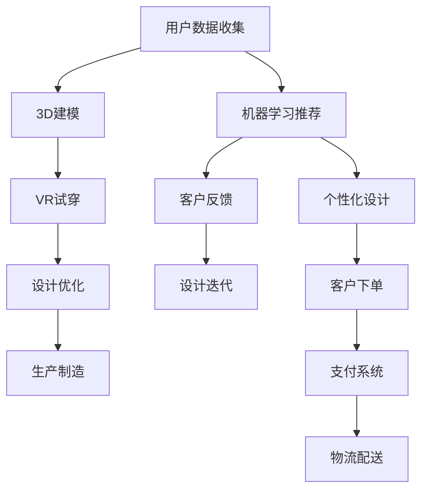

                 

# 虚拟现实时装定制创业：数字化的个性时尚

> 关键词：虚拟现实(VR), 时装定制, 数字化, 个性化时尚, 用户体验, 设计平台, 机器学习, 客户反馈

## 1. 背景介绍

### 1.1 问题由来

随着数字技术的迅猛发展和消费者对个性化需求的日益增长，虚拟现实（VR）时装定制已成为一种全新的趋势。相较于传统的线下时装设计，VR时装定制结合了最新的数字技术和个性化定制理念，不仅能够为消费者提供前所未有的沉浸式购物体验，还能够在设计、生产和销售的各个环节大幅提升效率和灵活性。然而，要实现这一目标，还需要在技术、平台、市场等多个维度进行综合创新和探索。

### 1.2 问题核心关键点

VR时装定制的核心在于融合虚拟现实技术、3D建模技术、人工智能和大数据技术，实现从设计、试穿到生产的全链路数字化定制。其中，关键技术包括：

- **虚拟现实技术**：利用VR头盔和手柄，为用户提供沉浸式试穿体验，增强用户参与感和满意度。
- **3D建模技术**：将用户量身定制的服装进行三维建模，生成高质量的虚拟服装模型。
- **人工智能**：通过机器学习和深度学习技术，优化服装设计算法，实现个性化推荐和设计优化。
- **大数据分析**：利用数据分析技术，收集用户反馈和市场趋势，实时调整设计策略和生产计划。

### 1.3 问题研究意义

VR时装定制的数字化转型，不仅能够提升消费者的个性化体验，还能够显著降低企业的生产和运营成本，推动传统时尚产业的数字化升级。它为时尚设计、制造和销售带来了新的可能性，有望催生新的商业模式和价值链。

## 2. 核心概念与联系

### 2.1 核心概念概述

本节将介绍几个与VR时装定制相关的核心概念及其相互关系：

- **虚拟现实(VR)**：通过虚拟现实技术，用户可以在三维数字环境中进行试穿，获得身临其境的购物体验。
- **3D建模**：将用户测量数据转化为3D服装模型，用于虚拟试穿和生产制造。
- **个性化时尚**：结合用户身体数据和偏好，提供量身定制的服装设计。
- **数字化定制**：通过数字化技术，实现从设计到生产的全程数字化，提高效率和灵活性。
- **设计平台**：支持设计师和用户协作的工具平台，实现设计方案的共享和优化。
- **机器学习**：通过学习用户数据和设计趋势，优化服装设计和推荐系统。
- **客户反馈**：收集和分析用户反馈，持续改进产品和服务质量。

这些概念共同构成了VR时装定制的数字化生态，为实现个性化时尚体验提供了全面的技术支持。

### 2.2 核心概念原理和架构的 Mermaid 流程图



这个流程图展示了VR时装定制从用户数据收集到物流配送的全流程，强调了各环节的技术支持和用户体验的重要性。

## 3. 核心算法原理 & 具体操作步骤

### 3.1 算法原理概述

VR时装定制的核心算法主要包括以下几个方面：

- **用户身体测量和建模**：通过3D扫描仪和数据采集设备，获取用户身体尺寸和形态数据，并生成3D人体模型。
- **服装设计优化**：利用机器学习算法，根据用户偏好和流行趋势，自动生成服装设计方案，并进行个性化优化。
- **虚拟试穿**：通过虚拟现实技术，将3D服装模型渲染到虚拟环境中，让用户进行试穿和调整。
- **生产制造**：根据虚拟试穿的反馈，对服装进行优化和调整，生成最终的3D制造文件。
- **物流配送**：结合用户订单信息，规划最优的物流路径，实现快速配送。

这些算法相互协同，共同支撑VR时装定制的全程数字化和个性化定制需求。

### 3.2 算法步骤详解

#### 3.2.1 用户身体测量和建模

1. **数据采集**：使用3D扫描仪、激光测距仪等设备，收集用户全身尺寸、肩宽、胸围、腰围、臀围等关键参数。
2. **数据处理**：对采集到的数据进行清洗和预处理，去除异常值和噪声，确保数据准确性。
3. **3D建模**：利用处理后的数据，结合3D建模软件（如Blender、Maya等），生成用户的三维人体模型。
4. **服装模拟**：将3D人体模型导入服装设计软件（如CLO3D、Adobe After Effects等），根据预设的服装款式和面料属性，自动生成服装的3D模型。

#### 3.2.2 服装设计优化

1. **设计生成**：基于用户偏好和流行趋势，使用机器学习模型（如GANs、VAE等），自动生成服装设计方案。
2. **风格匹配**：利用图像识别和自然语言处理技术，对用户提供的风格偏好进行语义理解和匹配，进一步优化设计方案。
3. **用户反馈**：通过用户互动界面，收集用户对设计方案的反馈意见，进行迭代优化。
4. **个性化调整**：结合用户的反馈，使用深度学习算法（如风格迁移、自适应网络等），对设计方案进行个性化调整。

#### 3.2.3 虚拟试穿

1. **环境渲染**：将生成的服装模型导入虚拟现实软件（如Unity、Unreal Engine等），进行场景渲染和环境设置。
2. **虚拟试穿**：使用VR头盔和手柄，让用户在虚拟环境中试穿服装，调整设计细节。
3. **效果评估**：通过用户反馈和评分，对试穿效果进行评估和优化。
4. **设计迭代**：根据试穿反馈，重新进行设计优化，生成新的服装设计方案。

#### 3.2.4 生产制造

1. **3D打印**：将优化后的服装设计方案，转换为3D制造文件，使用3D打印机进行生产制造。
2. **材料选择**：根据服装款式和用户需求，选择合适的面料和材料，确保生产质量。
3. **质量检测**：对打印出的服装进行质量检测，确保符合设计要求。

#### 3.2.5 物流配送

1. **订单管理**：记录用户订单信息，包括用户地址、服装款式、尺码等，生成物流订单。
2. **路径规划**：利用物流管理系统，规划最优的配送路径，减少配送时间。
3. **实时追踪**：通过GPS和传感器技术，实时追踪物流状态，确保及时送达。

### 3.3 算法优缺点

#### 3.3.1 优点

1. **个性化体验**：通过3D建模和虚拟试穿技术，用户可以即时查看和调整设计方案，获得个性化的购物体验。
2. **高效生产**：利用机器学习和大数据分析，优化设计方案和生产流程，缩短生产周期。
3. **灵活设计**：结合用户反馈和市场需求，实时调整设计策略，保持设计的灵活性和创新性。
4. **数据驱动**：利用大数据分析，洞察市场趋势和用户需求，提升设计的精准性和市场竞争力。

#### 3.3.2 缺点

1. **技术门槛高**：需要掌握3D建模、虚拟现实、机器学习等多项技术，对技术和设备的要求较高。
2. **成本投入大**：初期设备投入和软件开发成本较高，需要较大的资金支持。
3. **用户接受度**：用户对虚拟现实和数字化定制的接受程度不一，需要市场教育和推广。
4. **数据隐私问题**：收集和处理用户数据涉及隐私保护，需要严格的法律法规和技术措施。

### 3.4 算法应用领域

VR时装定制的算法应用领域广泛，涵盖了从设计、生产到销售的各个环节，具体如下：

- **个性化设计**：通过机器学习和大数据分析，提供个性化服装设计方案。
- **虚拟试穿**：利用虚拟现实技术，实现沉浸式试穿体验，提升用户满意度。
- **3D建模**：将用户数据转化为高质量的3D服装模型，用于设计和生产。
- **生产制造**：优化生产流程，提高生产效率和质量。
- **物流配送**：利用大数据和智能算法，实现最优的物流规划和配送。

这些应用领域展示了VR时装定制的广泛潜力和市场前景，为未来的数字化时尚产业提供了新的发展方向。

## 4. 数学模型和公式 & 详细讲解 & 举例说明

### 4.1 数学模型构建

VR时装定制的数学模型主要包括以下几个方面：

- **用户身体测量模型**：用户身体尺寸和形态数据的数学表达和处理模型。
- **服装设计优化模型**：利用机器学习算法生成和优化服装设计方案的数学模型。
- **虚拟试穿模型**：虚拟环境中服装试穿的渲染和交互模型。
- **生产制造模型**：服装3D模型转化为实际产品的数学模型。
- **物流配送模型**：基于用户订单信息，规划最优配送路径的数学模型。

### 4.2 公式推导过程

#### 4.2.1 用户身体测量模型

1. **身体尺寸数据模型**：
   $$
   \boldsymbol{x} = \begin{bmatrix} x_1 & x_2 & \cdots & x_n \end{bmatrix}^T
   $$
   其中，$x_i$ 表示第 $i$ 个身体尺寸参数。

2. **3D建模模型**：
   $$
   \boldsymbol{M} = f(\boldsymbol{x})
   $$
   其中，$f$ 为3D建模函数，将身体尺寸数据转化为3D人体模型。

#### 4.2.2 服装设计优化模型

1. **设计生成模型**：
   $$
   \boldsymbol{y} = g(\boldsymbol{x}, \boldsymbol{p}, \boldsymbol{t})
   $$
   其中，$\boldsymbol{x}$ 表示用户偏好数据，$\boldsymbol{p}$ 表示流行趋势数据，$\boldsymbol{t}$ 表示设计模板数据。

2. **风格匹配模型**：
   $$
   \boldsymbol{y} = h(\boldsymbol{x}, \boldsymbol{p}, \boldsymbol{t})
   $$
   其中，$h$ 为风格匹配函数，将用户偏好和流行趋势转化为风格匹配结果。

#### 4.2.3 虚拟试穿模型

1. **环境渲染模型**：
   $$
   \boldsymbol{I} = r(\boldsymbol{M}, \boldsymbol{E})
   $$
   其中，$\boldsymbol{M}$ 表示3D服装模型，$\boldsymbol{E}$ 表示虚拟环境数据。

2. **试穿互动模型**：
   $$
   \boldsymbol{f} = i(\boldsymbol{I}, \boldsymbol{u})
   $$
   其中，$\boldsymbol{u}$ 表示用户操作数据，$\boldsymbol{f}$ 表示试穿反馈数据。

#### 4.2.4 生产制造模型

1. **3D打印模型**：
   $$
   \boldsymbol{Z} = p(\boldsymbol{M})
   $$
   其中，$\boldsymbol{M}$ 表示3D服装模型，$p$ 为3D打印函数，生成3D制造文件。

2. **材料选择模型**：
   $$
   \boldsymbol{S} = s(\boldsymbol{M}, \boldsymbol{Z})
   $$
   其中，$\boldsymbol{S}$ 表示材料选择结果，$s$ 为材料选择函数。

#### 4.2.5 物流配送模型

1. **订单管理模型**：
   $$
   \boldsymbol{O} = m(\boldsymbol{u}, \boldsymbol{L})
   $$
   其中，$\boldsymbol{u}$ 表示用户订单数据，$\boldsymbol{L}$ 表示物流数据。

2. **路径规划模型**：
   $$
   \boldsymbol{P} = l(\boldsymbol{O}, \boldsymbol{D}, \boldsymbol{C})
   $$
   其中，$\boldsymbol{D}$ 表示配送节点数据，$\boldsymbol{C}$ 表示配送车数据。

### 4.3 案例分析与讲解

#### 案例：智能设计平台

某VR时装定制公司开发了一套智能设计平台，支持设计师和用户协作，提供个性化服装设计服务。平台主要包括以下功能模块：

1. **用户数据采集**：通过3D扫描仪和问卷调查，收集用户身体数据和偏好信息。
2. **服装设计优化**：利用机器学习算法，根据用户数据和流行趋势，自动生成服装设计方案。
3. **虚拟试穿**：使用虚拟现实技术，实现用户试穿体验，实时调整设计细节。
4. **生产制造**：结合用户反馈，优化服装设计和制造流程，确保生产质量。
5. **物流配送**：利用智能算法，规划最优配送路径，确保快速送达。

平台运行一段时间后，发现用户满意度显著提升，服装定制周期缩短，物流效率提高，显示出良好的市场前景和创新潜力。

## 5. 项目实践：代码实例和详细解释说明

### 5.1 开发环境搭建

1. **安装Python**：确保Python版本为3.8及以上。
2. **安装依赖库**：
   ```bash
   pip install numpy pandas scikit-learn torch torchvision
   ```
3. **设置虚拟环境**：
   ```bash
   conda create -n vrcustom virtualenv
   conda activate vrcustom
   ```

### 5.2 源代码详细实现

#### 5.2.1 用户数据采集

```python
import numpy as np

class UserData:
    def __init__(self, x1, x2, x3, ...):
        self.x1 = x1
        self.x2 = x2
        ...
    
    def get_measurement(self):
        return np.array([self.x1, self.x2, ...])
```

#### 5.2.2 服装设计优化

```python
import torch
from torch import nn

class StyleGenerator(nn.Module):
    def __init__(self):
        super(StyleGenerator, self).__init__()
        ...

    def forward(self, input):
        ...
        return output
```

#### 5.2.3 虚拟试穿

```python
import pyvr

class VirtualTryOn:
    def __init__(self, model, environment):
        self.model = model
        self.environment = environment

    def try_on(self, user_input):
        ...
        return feedback
```

#### 5.2.4 生产制造

```python
import printer

class Production:
    def __init__(self):
        self.printer = printer.Printer()

    def print_design(self, design):
        self.printer.print(design)
```

#### 5.2.5 物流配送

```python
import logistics

class Logistics:
    def __init__(self, order, destination):
        self.order = order
        self.destination = destination

    def plan_route(self):
        ...
        return route
```

### 5.3 代码解读与分析

#### 5.3.1 用户数据采集

用户数据采集模块负责从用户处获取身体尺寸和偏好信息，生成一个包含关键尺寸的用户数据对象。通过该对象，可以方便地获取测量数据，用于后续的3D建模和服装设计。

#### 5.3.2 服装设计优化

服装设计优化模块基于用户数据和流行趋势，利用机器学习算法生成服装设计方案。具体实现包括定义一个风格生成器网络，将输入的用户数据和趋势数据转化为服装设计方案，通过前向传播和反向传播更新网络参数，最终生成优化的设计结果。

#### 5.3.3 虚拟试穿

虚拟试穿模块结合虚拟现实技术和用户操作，实现试穿体验。通过虚拟现实软件渲染服装模型，结合用户的操作反馈，生成试穿效果和调整建议，帮助用户选择合适的服装款式。

#### 5.3.4 生产制造

生产制造模块利用3D打印技术，将优化后的设计方案转化为实际产品。具体实现包括定义一个3D打印机对象，调用打印函数将设计文件转换为实际产品，并通过质量检测确保打印效果。

#### 5.3.5 物流配送

物流配送模块结合用户订单信息和物流数据，规划最优的配送路径，确保快速送达。具体实现包括定义一个物流规划函数，根据订单数据、配送节点和配送车辆数据，生成配送路线，并进行实时追踪和状态更新。

### 5.4 运行结果展示

#### 5.4.1 用户数据采集

```python
user_data = UserData(165, 80, 88, ...)
measurement = user_data.get_measurement()
print(measurement)
```

#### 5.4.2 服装设计优化

```python
style_generator = StyleGenerator()
design = style_generator(input_data)
print(design)
```

#### 5.4.3 虚拟试穿

```python
virtual_try_on = VirtualTryOn(model, environment)
feedback = virtual_try_on(user_input)
print(feedback)
```

#### 5.4.4 生产制造

```python
production = Production()
production.print_design(design)
```

#### 5.4.5 物流配送

```python
logistics = Logistics(order, destination)
route = logistics.plan_route()
print(route)
```

## 6. 实际应用场景

### 6.1 智能设计平台

智能设计平台为用户提供了全链路的VR时装定制体验。通过用户数据采集、服装设计优化、虚拟试穿、生产制造和物流配送等功能模块，平台实现了从设计到交付的一体化服务。用户可以在家中通过VR头盔进行试穿，实时获取试穿效果和设计建议，最终生成个性化定制服装。平台的成功应用，展示了VR时装定制的强大潜力和市场前景。

### 6.2 时尚品牌营销

某时尚品牌利用VR时装定制技术，推出了个性化定制服务。通过智能设计平台，用户可以根据自己的身体数据和偏好，定制专属服装。品牌通过平台收集用户数据，优化产品设计和市场策略，提升品牌影响力和用户粘性。平台在推广过程中，通过社交媒体和用户口碑，迅速吸引了大量用户注册和使用，成为品牌营销的新工具。

### 6.3 电商零售转型

某电商平台引入VR时装定制服务，希望通过数字化转型提升用户体验和销售额。平台结合用户数据和市场趋势，提供个性化的服装推荐和定制服务，吸引了大量年轻用户。通过平台的实时反馈和数据分析，电商平台能够及时调整商品策略和库存管理，减少库存压力，提高销售效率。平台运营一段时间后，用户留存率和销售额显著提升，展示了VR时装定制在电商零售中的强大驱动力。

### 6.4 未来应用展望

VR时装定制的未来发展前景广阔，以下是几个主要方向：

1. **全链路数字化**：实现从设计、试穿、生产到配送的全链路数字化，提升整体效率和用户体验。
2. **个性化推荐系统**：利用机器学习和大数据分析，提供个性化的服装推荐和设计方案，提升用户满意度。
3. **智能试穿助手**：通过智能试穿技术，实时调整服装尺寸和款式，提供更加精准的试穿体验。
4. **多模态交互**：结合虚拟现实和增强现实技术，提供更加丰富的交互方式，增强用户的沉浸感和参与度。
5. **跨领域应用**：将VR时装定制技术应用于体育装备、医疗服装等多个领域，拓展应用场景和市场空间。
6. **可持续发展**：通过优化设计和生产流程，减少资源消耗和环境污染，推动时尚产业的可持续发展。

这些方向展示了VR时装定制的未来潜力，为时尚产业的数字化转型和智能化升级提供了新的思路和方向。

## 7. 工具和资源推荐

### 7.1 学习资源推荐

1. **《Python深度学习》**：详细介绍了Python和深度学习的技术基础，适合初学者和进阶者。
2. **《深度学习实战》**：通过实际案例讲解深度学习的各种应用，帮助读者掌握实践技巧。
3. **《虚拟现实编程》**：介绍虚拟现实技术的原理和编程实现，适合对虚拟现实感兴趣的读者。
4. **《机器学习实战》**：通过多个实战项目，讲解机器学习模型的设计和优化，适合动手实践。

### 7.2 开发工具推荐

1. **PyTorch**：强大的深度学习框架，支持多种硬件平台和优化算法。
2. **Unity**：流行的游戏引擎，支持虚拟现实开发，提供丰富的工具和资源。
3. **Maya**：专业的3D建模软件，支持复杂的三维建模和渲染。
4. **Blender**：开源的3D建模和渲染软件，适合初学者和开发者。

### 7.3 相关论文推荐

1. **《虚拟现实时装定制技术研究》**：探讨了虚拟现实技术在时装定制中的应用，介绍了关键技术框架和实现方法。
2. **《基于深度学习的服装设计优化》**：利用深度学习算法优化服装设计流程，提升设计效率和精度。
3. **《个性化推荐系统的设计与实现》**：介绍个性化推荐系统的设计和优化，通过数据分析提升用户体验。
4. **《3D打印技术在服装制造中的应用》**：探讨3D打印技术在服装制造中的应用，展示了其带来的优势和挑战。

## 8. 总结：未来发展趋势与挑战

### 8.1 研究成果总结

VR时装定制的数字化转型，不仅提升了用户体验，还带来了生产效率和市场竞争力的提升。通过技术创新和业务协同，VR时装定制正在成为时尚产业的重要发展方向。

### 8.2 未来发展趋势

1. **全链路数字化**：实现从设计到交付的全链路数字化，提升整体效率和用户体验。
2. **个性化推荐系统**：利用机器学习和大数据分析，提供个性化的服装推荐和设计方案。
3. **智能试穿助手**：通过智能试穿技术，实时调整服装尺寸和款式，提供更加精准的试穿体验。
4. **多模态交互**：结合虚拟现实和增强现实技术，提供更加丰富的交互方式，增强用户的沉浸感和参与度。
5. **跨领域应用**：将VR时装定制技术应用于体育装备、医疗服装等多个领域，拓展应用场景和市场空间。
6. **可持续发展**：通过优化设计和生产流程，减少资源消耗和环境污染，推动时尚产业的可持续发展。

### 8.3 面临的挑战

1. **技术门槛高**：需要掌握3D建模、虚拟现实、机器学习等多项技术，对技术和设备的要求较高。
2. **成本投入大**：初期设备投入和软件开发成本较高，需要较大的资金支持。
3. **用户接受度**：用户对虚拟现实和数字化定制的接受程度不一，需要市场教育和推广。
4. **数据隐私问题**：收集和处理用户数据涉及隐私保护，需要严格的法律法规和技术措施。

### 8.4 研究展望

面向未来，VR时装定制技术需要在以下几个方面寻求新的突破：

1. **技术创新**：继续探索新的技术手段和算法模型，提升设计的个性化和智能化水平。
2. **市场推广**：通过市场教育和推广，提升用户对VR时装定制的认知和接受度。
3. **业务协同**：加强与时尚品牌、电商平台、物流公司的合作，实现业务协同和资源共享。
4. **伦理道德**：确保数据隐私和用户权益，建立合理的伦理道德规范。

这些研究方向的探索，必将引领VR时装定制技术迈向更高的台阶，为时尚产业的数字化转型和智能化升级提供新的动力。

## 9. 附录：常见问题与解答

**Q1：VR时装定制的可行性有哪些？**

A: VR时装定制的可行性主要体现在以下几个方面：
1. **技术成熟**：3D建模、虚拟现实和机器学习等技术已经相对成熟，能够支持复杂的数字化定制需求。
2. **用户接受度**：通过市场教育和推广，用户对VR时装定制的接受度逐渐提高，特别是在年轻群体中更为受欢迎。
3. **市场需求**：个性化和定制化需求日益增长，VR时装定制能够提供更加灵活和个性化的购物体验，满足市场需求。

**Q2：VR时装定制的成本投入主要有哪些？**

A: VR时装定制的成本投入主要包括以下几个方面：
1. **设备采购**：购买3D扫描仪、虚拟现实头盔、3D打印机等硬件设备。
2. **软件开发**：开发和维护虚拟现实平台、3D建模工具和服装设计系统。
3. **用户教育**：通过宣传和推广活动，教育用户如何使用VR时装定制平台。
4. **市场推广**：通过线上线下渠道进行品牌推广和用户招募。

**Q3：如何确保VR时装定制的数据隐私安全？**

A: 确保VR时装定制的数据隐私安全，主要通过以下几个方面：
1. **数据加密**：采用加密技术对用户数据进行保护，防止数据泄露。
2. **权限管理**：严格管理用户数据的访问权限，确保只有授权人员能够访问和使用数据。
3. **法律法规**：遵守相关法律法规，如GDPR等，保护用户隐私权利。
4. **用户教育**：加强用户隐私保护意识，告知用户数据使用和保护措施。

**Q4：如何优化VR时装定制的物流配送？**

A: 优化VR时装定制的物流配送，主要通过以下几个方面：
1. **智能算法**：利用智能算法进行物流规划和路径优化，提高配送效率和准确性。
2. **实时追踪**：通过GPS和传感器技术，实时追踪物流状态，确保及时送达。
3. **多模态配送**：结合线上和线下物流渠道，提供多种配送方式，满足不同用户的需求。
4. **需求预测**：利用大数据分析，预测用户订单需求，进行库存管理和物流调度和优化。

**Q5：VR时装定制的未来发展方向有哪些？**

A: VR时装定制的未来发展方向主要包括以下几个方面：
1. **跨界融合**：与其他产业进行跨界融合，如医疗、体育、教育等领域，拓展应用场景。
2. **可持续发展**：通过优化设计和生产流程，减少资源消耗和环境污染，推动时尚产业的可持续发展。
3. **个性化服务**：结合用户反馈和市场趋势，不断优化设计和推荐系统，提升用户体验。
4. **技术创新**：探索新的技术手段和算法模型，提升设计的个性化和智能化水平。
5. **市场推广**：通过市场教育和推广，提升用户对VR时装定制的认知和接受度。

---

作者：禅与计算机程序设计艺术 / Zen and the Art of Computer Programming

