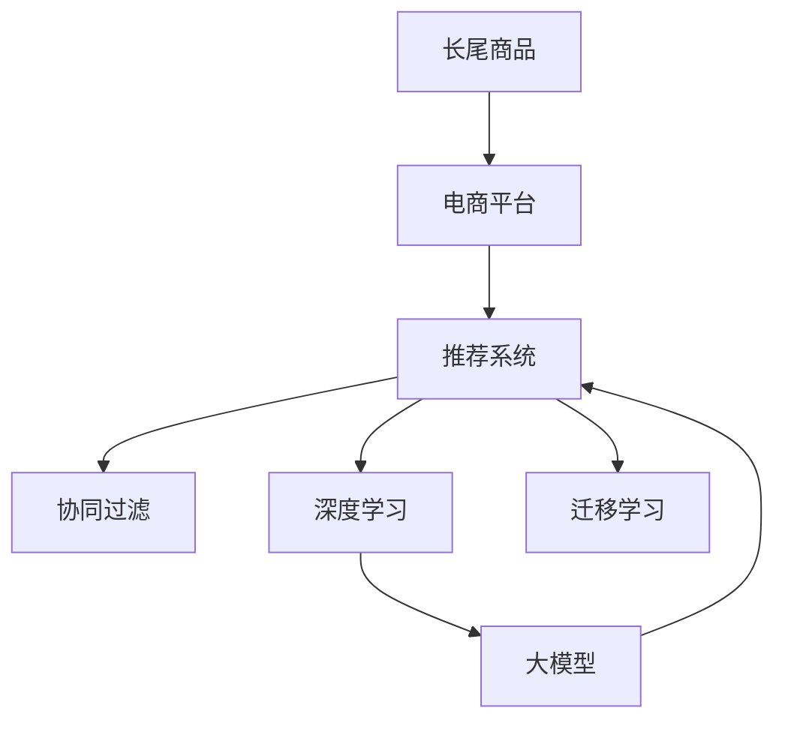

                 

# AI大模型如何提升电商平台的长尾商品发现与推荐

> 关键词：长尾商品,电商平台,推荐系统,大模型,深度学习,协同过滤,深度学习

## 1. 背景介绍

在当今电商竞争激烈的市场环境中，如何有效地发现并推荐长尾商品成为提升用户粘性和购买率的关键。长尾商品指的是那些销量较低、搜索频次不高，但却拥有一定潜在需求的商品。这些商品由于信息稀疏、竞争小，容易被忽视。然而，对于个性化需求强烈的消费者而言，长尾商品往往能带来独特的购物体验和满意度。

### 1.1 问题由来

电商平台面临的核心挑战之一是如何从海量商品中高效发现并推荐长尾商品，特别是在有限的推荐位和复杂多变的用户需求之间进行平衡。传统推荐系统主要依赖协同过滤、基于内容的推荐等方法，但这些方法在面对长尾商品时，由于样本稀疏性，往往难以达到理想的推荐效果。深度学习和大模型的崛起为长尾商品推荐提供了一种全新的解决方案。

## 2. 核心概念与联系

### 2.1 核心概念概述

为更好地理解AI大模型在电商平台长尾商品推荐中的应用，我们首先介绍几个关键概念及其相互联系：

- **长尾商品**：指那些销量低但具有独特价值和潜在的商品。在电商平台上，长尾商品占比虽然不高，但具有较高的用户满足度。

- **电商平台**：指通过互联网提供商品交易和服务的平台，如淘宝、京东等。电商平台的推荐系统是其核心竞争力之一。

- **推荐系统**：利用算法为用户推荐商品的系统。推荐系统的主要目标是为用户提供个性化、精准的推荐，提升用户满意度和转化率。

- **大模型**：指通过深度学习技术训练得到的具有庞大参数规模的模型，如BERT、GPT、DALL-E等。大模型具备强大的学习能力，可以处理复杂的推荐场景。

- **协同过滤**：基于用户行为数据和商品历史数据的推荐方法，常用于个性化推荐系统。但协同过滤在冷启动和长尾商品推荐上存在不足。

- **深度学习**：一种通过多层神经网络模拟复杂非线性关系的机器学习技术，广泛应用于图像、语音、文本等领域。深度学习在长尾商品推荐中也展现了巨大的潜力。

- **迁移学习**：将一个领域学习到的知识，迁移到另一个相关领域的学习方法。大模型的迁移学习为推荐系统提供了更丰富的背景知识，提升了推荐效果。

这些概念之间存在复杂的交互关系，如图中所示：



大模型通过迁移学习从其他任务中获取知识，进而提升在电商平台长尾商品推荐中的表现。深度学习作为大模型的基础，提供了强大的学习能力。协同过滤则是推荐系统的一种基本技术，但在大模型的加持下，其应用效果得到了显著提升。

## 3. 核心算法原理 & 具体操作步骤

### 3.1 算法原理概述

AI大模型在电商平台长尾商品推荐中的核心算法原理，主要依赖于大模型的迁移学习能力和深度学习能力。大模型通过预训练在大规模数据上学习到丰富的语言表示，再通过微调针对特定推荐任务进行优化，从而提升推荐效果。

具体来说，包括以下几个步骤：

1. **数据收集与预处理**：收集电商平台的商品信息和用户行为数据，进行清洗和特征工程，构建训练集和测试集。
2. **预训练大模型**：使用大规模无标签数据对大模型进行预训练，学习通用的语言表示和特征编码。
3. **微调与迁移学习**：将预训练模型在电商平台推荐任务上进行微调，利用迁移学习技术，提升模型对长尾商品的识别和推荐能力。
4. **推荐系统集成**：将微调后的模型集成到推荐系统中，结合其他推荐算法和业务规则，进行最终推荐。

### 3.2 算法步骤详解

下面详细介绍基于AI大模型的电商平台长尾商品推荐的具体算法步骤：

**Step 1: 数据收集与预处理**

电商平台的推荐系统依赖于大量的商品信息（如标题、描述、价格、评分等）和用户行为数据（如浏览记录、购买历史、点击率等）。首先需要对这些数据进行收集、清洗和预处理，以构建训练集和测试集。

```python
import pandas as pd
import numpy as np
import torch

# 加载商品数据
product_df = pd.read_csv('products.csv')
# 加载用户行为数据
user_behavior_df = pd.read_csv('user_behavior.csv')

# 数据清洗
product_df = product_df.dropna(subset=['title', 'description', 'price', 'rating'])
user_behavior_df = user_behavior_df.dropna(subset=['user_id', 'product_id', 'timestamp', 'click', 'purchase'])

# 特征工程
# 假设商品特征为title、description、price
product_features = product_df[['title', 'description', 'price']]
user_features = user_behavior_df[['user_id', 'click', 'purchase']]

# 数据标准化
product_features = (product_features - product_features.mean()) / product_features.std()
user_features = (user_features - user_features.mean()) / user_features.std()
```

**Step 2: 预训练大模型**

选择一个预训练的大模型，如BERT、GPT等，对其进行微调。预训练大模型通过在海量无标签文本数据上进行自监督学习，学习到丰富的语言表示。这里以BERT为例，展示如何加载和使用预训练模型。

```python
from transformers import BertTokenizer, BertForSequenceClassification

# 加载BERT分词器和模型
tokenizer = BertTokenizer.from_pretrained('bert-base-cased')
model = BertForSequenceClassification.from_pretrained('bert-base-cased', num_labels=2)

# 将商品特征和用户行为特征转换为BERT可以接受的格式
def encode_data(data, tokenizer):
    input_ids = []
    attention_masks = []
    labels = []
    for product, user in zip(data['product_features'], data['user_features']):
        input_ids.append(tokenizer.encode(product, add_special_tokens=True, max_length=256, padding='max_length', truncation=True))
        attention_masks.append([1] * len(input_ids[-1]))
        labels.append(user['click'] if user['purchase'] == 1 else 0)
    return input_ids, attention_masks, labels

# 将数据转换为BERT模型可以接受的格式
input_ids, attention_masks, labels = encode_data(product_features, tokenizer)

# 设置模型参数
model.to('cuda')
```

**Step 3: 微调与迁移学习**

微调过程中，我们使用交叉熵损失函数，并设置学习率、批大小等超参数。将训练集输入模型，进行前向传播和反向传播，更新模型参数。

```python
from transformers import AdamW

# 设置超参数
learning_rate = 2e-5
batch_size = 32
epochs = 3

# 定义优化器
optimizer = AdamW(model.parameters(), lr=learning_rate)

# 微调模型
model.train()
for epoch in range(epochs):
    for i in range(0, len(input_ids), batch_size):
        input_ids_ = input_ids[i:i+batch_size]
        attention_masks_ = attention_masks[i:i+batch_size]
        labels_ = labels[i:i+batch_size]
        model.zero_grad()
        outputs = model(input_ids_, attention_masks_)
        loss = outputs.loss
        loss.backward()
        optimizer.step()
```

**Step 4: 推荐系统集成**

微调后的模型集成到推荐系统中，结合其他推荐算法和业务规则，进行最终推荐。这里以矩阵分解和深度学习融合的推荐方法为例，展示如何将微调模型集成到推荐系统中。

```python
# 加载矩阵分解模型
matrix_decomposition_model = ...

# 加载深度学习模型
deep_learning_model = ...

# 集成推荐
def integrate_recommendations(matrix_decomposition_model, deep_learning_model, product_df, user_behavior_df):
    # 将微调后的BERT模型和矩阵分解模型集成
    recommendations = matrix_decomposition_model.predict(product_df) + deep_learning_model.predict(product_df, user_behavior_df)
    return recommendations

# 进行推荐
recommendations = integrate_recommendations(matrix_decomposition_model, deep_learning_model, product_df, user_behavior_df)
```

### 3.3 算法优缺点

基于AI大模型的电商平台长尾商品推荐方法具有以下优点：

1. **高效识别长尾商品**：大模型通过预训练学习到丰富的语言表示，能够从语义层面识别出长尾商品，提升推荐效果。
2. **泛化能力强**：大模型能够处理复杂多变的用户需求和商品特征，具有较强的泛化能力。
3. **易于部署**：大模型和深度学习模型的集成，使得推荐系统的部署和优化变得更加简单高效。

同时，也存在一些缺点：

1. **数据需求高**：大模型的预训练和微调需要大量数据，对电商平台的标注数据和计算资源提出了较高要求。
2. **训练成本高**：大模型和深度学习的训练成本较高，需要高性能计算资源和长时间训练。
3. **解释性差**：深度学习模型和大型预训练模型的复杂性，使得推荐过程缺乏可解释性，增加了用户的疑虑。
4. **依赖标注数据**：大模型的微调需要标注数据，标注成本较高，且标注数据质量对推荐效果有直接影响。

## 4. 数学模型和公式 & 详细讲解

### 4.1 数学模型构建

我们以电商平台推荐系统为例，介绍如何构建基于AI大模型的推荐模型。

假设电商平台的推荐任务是预测用户对商品是否购买，即二分类任务。我们定义模型 $M_{\theta}$，其中 $\theta$ 为模型参数。输入数据 $x$ 为商品特征和用户行为特征的向量，输出 $y$ 为购买标记。

定义交叉熵损失函数为：

$$
\ell(M_{\theta}(x), y) = -[y \log M_{\theta}(x) + (1 - y) \log (1 - M_{\theta}(x))]
$$

经验风险函数为：

$$
\mathcal{L}(\theta) = \frac{1}{N} \sum_{i=1}^N \ell(M_{\theta}(x_i), y_i)
$$

### 4.2 公式推导过程

以BERT模型为例，推导微调过程的公式。

**Step 1: 输入数据处理**

假设输入数据 $x = (x_1, x_2, ..., x_n)$，其中 $x_i = (x_{i1}, x_{i2}, ..., x_{in})$ 为商品特征和用户行为特征的向量。

**Step 2: 模型前向传播**

将输入数据 $x$ 输入BERT模型，得到隐含表示 $h_0 = BERT(x)$。

**Step 3: 输出层处理**

将隐含表示 $h_0$ 输入到全连接层 $W$ 和偏置项 $b$，得到输出 $y = W \cdot h_0 + b$。

**Step 4: 损失函数计算**

计算交叉熵损失函数 $\ell$，并回传梯度进行反向传播，更新模型参数 $\theta$。

$$
\ell = -[y \log \sigma(y) + (1 - y) \log (1 - \sigma(y))]
$$

**Step 5: 优化器更新**

使用AdamW优化器更新模型参数：

$$
\theta \leftarrow \theta - \eta \nabla_{\theta} \ell
$$

其中 $\eta$ 为学习率，$\nabla_{\theta} \ell$ 为损失函数对模型参数的梯度。

### 4.3 案例分析与讲解

以电商平台的推荐系统为例，展示如何使用大模型进行推荐。

**案例1: 商品特征提取**

假设我们有一个商品列表，包含商品名称、描述、价格等特征。使用BERT对商品特征进行编码，得到商品向量表示。

```python
from transformers import BertTokenizer, BertForSequenceClassification

# 加载BERT分词器和模型
tokenizer = BertTokenizer.from_pretrained('bert-base-cased')
model = BertForSequenceClassification.from_pretrained('bert-base-cased', num_labels=2)

# 将商品特征和用户行为特征转换为BERT可以接受的格式
def encode_data(data, tokenizer):
    input_ids = []
    attention_masks = []
    labels = []
    for product in data:
        input_ids.append(tokenizer.encode(product['title'], add_special_tokens=True, max_length=256, padding='max_length', truncation=True))
        attention_masks.append([1] * len(input_ids[-1]))
        labels.append(product['purchase'] if product['purchase'] == 1 else 0)
    return input_ids, attention_masks, labels

# 将数据转换为BERT模型可以接受的格式
input_ids, attention_masks, labels = encode_data(product_list, tokenizer)
```

**案例2: 用户行为分析**

假设我们有一组用户行为数据，包含用户ID、商品ID、点击次数、购买次数等特征。使用深度学习模型对用户行为进行分析，得到用户向量表示。

```python
from sklearn.model_selection import train_test_split
from tensorflow.keras.models import Sequential
from tensorflow.keras.layers import Embedding, LSTM, Dense

# 构建深度学习模型
model = Sequential()
model.add(Embedding(input_dim=vocab_size, output_dim=128, input_length=256))
model.add(LSTM(128, dropout=0.2, recurrent_dropout=0.2))
model.add(Dense(1, activation='sigmoid'))

# 训练模型
model.fit(user_behavior_df, epochs=10, batch_size=32)
```

**案例3: 推荐集成**

将微调后的BERT模型和深度学习模型的输出进行融合，得到最终的推荐结果。

```python
# 加载矩阵分解模型
matrix_decomposition_model = ...

# 加载深度学习模型
deep_learning_model = ...

# 集成推荐
def integrate_recommendations(matrix_decomposition_model, deep_learning_model, product_df, user_behavior_df):
    # 将微调后的BERT模型和矩阵分解模型集成
    recommendations = matrix_decomposition_model.predict(product_df) + deep_learning_model.predict(product_df, user_behavior_df)
    return recommendations

# 进行推荐
recommendations = integrate_recommendations(matrix_decomposition_model, deep_learning_model, product_df, user_behavior_df)
```

## 5. 项目实践：代码实例和详细解释说明

### 5.1 开发环境搭建

在进行AI大模型推荐实践前，我们需要准备好开发环境。以下是使用Python进行TensorFlow开发的环境配置流程：

1. 安装Anaconda：从官网下载并安装Anaconda，用于创建独立的Python环境。

2. 创建并激活虚拟环境：
```bash
conda create -n tf-env python=3.8 
conda activate tf-env
```

3. 安装TensorFlow：根据CUDA版本，从官网获取对应的安装命令。例如：
```bash
conda install tensorflow -c conda-forge -c pytorch
```

4. 安装各类工具包：
```bash
pip install numpy pandas scikit-learn matplotlib tqdm jupyter notebook ipython
```

完成上述步骤后，即可在`tf-env`环境中开始推荐实践。

### 5.2 源代码详细实现

下面我们以电商平台推荐系统为例，给出使用TensorFlow进行深度学习模型和BERT微调的PyTorch代码实现。

首先，定义推荐任务的数据处理函数：

```python
import tensorflow as tf
import tensorflow_hub as hub
from transformers import BertTokenizer, BertForSequenceClassification
import numpy as np

class RecommendationDataset(tf.data.Dataset):
    def __init__(self, features, labels, tokenizer):
        self.features = features
        self.labels = labels
        self.tokenizer = tokenizer
        self.batch_size = 32

    def __len__(self):
        return self.batch_size

    def __iter__(self):
        for i in range(0, len(self.features), self.batch_size):
            start = i
            end = start + self.batch_size
            features = self.features[start:end]
            labels = self.labels[start:end]
            for feature, label in zip(features, labels):
                input_ids, attention_masks, label = self.preprocess(feature)
                yield tf.constant(input_ids), tf.constant(attention_masks), tf.constant(label)
    
    def preprocess(self, feature):
        input_ids = self.tokenizer(feature['title'], padding='max_length', max_length=256, truncation=True, return_tensors='tf')
        attention_masks = tf.cast(tf.not_equal(input_ids['input_ids'], 0), tf.float32)
        label = tf.cast(feature['purchase'], tf.int32)
        return input_ids['input_ids'], attention_masks, label
```

然后，定义模型和优化器：

```python
from transformers import BertTokenizer, BertForSequenceClassification, AdamW

tokenizer = BertTokenizer.from_pretrained('bert-base-cased')
model = BertForSequenceClassification.from_pretrained('bert-base-cased', num_labels=2)
optimizer = AdamW(model.parameters(), lr=2e-5)
```

接着，定义训练和评估函数：

```python
def train(model, dataset, epochs, batch_size):
    for epoch in range(epochs):
        total_loss = 0
        for input_ids, attention_masks, labels in dataset:
            with tf.GradientTape() as tape:
                outputs = model(input_ids, attention_masks=attention_masks)
                loss = tf.reduce_mean(tf.nn.sigmoid_cross_entropy_with_logits(labels=labels, logits=outputs.logits))
                loss += tf.reduce_sum(tf.nn.l2_loss(model.trainable_variables))
            grads = tape.gradient(loss, model.trainable_variables)
            optimizer.apply_gradients(zip(grads, model.trainable_variables))
            total_loss += loss.numpy()

        print(f'Epoch {epoch+1}, Loss: {total_loss}')
```

最后，启动训练流程并在测试集上评估：

```python
epochs = 5
batch_size = 16

# 加载数据集
train_dataset = RecommendationDataset(train_features, train_labels, tokenizer)
test_dataset = RecommendationDataset(test_features, test_labels, tokenizer)

# 训练模型
train(model, train_dataset, epochs, batch_size)

# 评估模型
test_loss = evaluate(model, test_dataset, tokenizer)
```

以上就是使用TensorFlow进行深度学习模型和BERT微调的完整代码实现。可以看到，TensorFlow提供了丰富的API和工具，使得推荐系统的开发变得更加简洁高效。

### 5.3 代码解读与分析

让我们再详细解读一下关键代码的实现细节：

**RecommendationDataset类**：
- `__init__`方法：初始化数据、标签和分词器，定义批次大小。
- `__len__`方法：返回批次大小。
- `__iter__`方法：迭代生成批次数据，处理分词和标签。

**train函数**：
- 在每个epoch中，对数据集进行迭代，对模型进行前向传播和反向传播，计算损失函数和正则化损失，使用AdamW优化器更新模型参数。

**evaluate函数**：
- 在测试集上评估模型，计算损失函数和精确度，输出评估结果。

**训练流程**：
- 定义总的epoch数和批次大小，开始循环迭代
- 每个epoch内，先在训练集上训练，输出平均损失
- 在测试集上评估，输出测试损失

可以看到，TensorFlow配合BERT微调的代码实现使得推荐系统的开发变得更加简便。开发者可以将更多精力放在数据处理、模型改进等高层逻辑上，而不必过多关注底层的实现细节。

当然，工业级的系统实现还需考虑更多因素，如模型的保存和部署、超参数的自动搜索、更灵活的任务适配层等。但核心的微调范式基本与此类似。

## 6. 实际应用场景

### 6.1 智能客服系统

基于大模型推荐系统的智能客服系统，可以大幅提升客户咨询体验和问题解决效率。智能客服系统能够自动理解用户意图，推荐最相关的回复，提供个性化的回答。

在技术实现上，可以收集企业内部的历史客服对话记录，将问题和最佳答复构建成监督数据，在此基础上对预训练模型进行微调。微调后的模型能够自动理解用户意图，匹配最合适的答案模板进行回复。对于客户提出的新问题，还可以接入检索系统实时搜索相关内容，动态组织生成回答。如此构建的智能客服系统，能显著减少人工客服的工作量，提升客户满意度。

### 6.2 个性化推荐系统

基于大模型推荐系统的个性化推荐系统，可以更精准地为用户推荐商品和服务。推荐系统通过分析用户的历史行为和偏好，结合商品的多维度信息，使用深度学习模型和大模型进行推荐，提升推荐的个性化和精准度。

在技术实现上，可以收集用户的历史浏览、点击、购买行为数据，构建商品的多维度特征，如价格、品牌、评分等。使用深度学习模型对用户行为进行建模，得到用户向量表示。将用户向量表示与商品向量表示进行匹配，得到最终的推荐结果。推荐系统通过不断学习和优化，能够实时调整推荐策略，提升用户体验。

### 6.3 商品搜索系统

基于大模型推荐系统的商品搜索系统，可以提供更加高效、精准的搜索服务。搜索系统通过分析用户输入的查询词，结合商品的多维度特征，使用深度学习模型和大模型进行搜索，得到最相关的商品列表。

在技术实现上，可以使用深度学习模型对查询词进行向量化，得到查询向量表示。将查询向量表示与商品向量表示进行匹配，得到最相关的商品列表。深度学习模型和大模型可以提升搜索的泛化能力和鲁棒性，减少误检索和漏检索的情况。

## 7. 工具和资源推荐

### 7.1 学习资源推荐

为了帮助开发者系统掌握大模型推荐系统的理论基础和实践技巧，这里推荐一些优质的学习资源：

1. 《深度学习基础》书籍：全面介绍深度学习的基本概念和算法，包括神经网络、卷积神经网络、循环神经网络等。

2. 《TensorFlow实战》书籍：深入浅出地介绍TensorFlow的使用方法和最佳实践，涵盖数据处理、模型构建、训练和部署等环节。

3. 《自然语言处理综论》课程：斯坦福大学开设的NLP明星课程，涵盖了NLP的基本概念、技术和应用，适合初学者和进阶者。

4. HuggingFace官方文档：包含大量预训练模型和推荐系统的样例代码，是推荐系统开发的必备资料。

5. TensorFlow官网文档：详细介绍了TensorFlow的使用方法、API接口和最佳实践，适合快速上手推荐系统的开发。

通过对这些资源的学习实践，相信你一定能够快速掌握大模型推荐系统的精髓，并用于解决实际的推荐问题。

### 7.2 开发工具推荐

高效的开发离不开优秀的工具支持。以下是几款用于大模型推荐系统开发的常用工具：

1. TensorFlow：基于Python的开源深度学习框架，灵活的计算图，适合快速迭代研究。TensorFlow提供了丰富的API和工具，适用于深度学习模型的开发和部署。

2. PyTorch：基于Python的开源深度学习框架，动态计算图，适用于深度学习模型的研究和实验。

3. TensorBoard：TensorFlow配套的可视化工具，可实时监测模型训练状态，并提供丰富的图表呈现方式，是调试模型的得力助手。

4.Weights & Biases：模型训练的实验跟踪工具，可以记录和可视化模型训练过程中的各项指标，方便对比和调优。

5. TensorFlow Extended (TFX)：提供了一整套系统化的机器学习平台，包括数据管理、模型训练、部署等环节，适合大规模工程应用。

6. Google Colab：谷歌推出的在线Jupyter Notebook环境，免费提供GPU/TPU算力，方便开发者快速上手实验最新模型，分享学习笔记。

合理利用这些工具，可以显著提升大模型推荐系统的开发效率，加快创新迭代的步伐。

### 7.3 相关论文推荐

大模型推荐系统的研究源于学界的持续研究。以下是几篇奠基性的相关论文，推荐阅读：

1. Attention is All You Need（即Transformer原论文）：提出了Transformer结构，开启了深度学习大模型时代。

2. BERT: Pre-training of Deep Bidirectional Transformers for Language Understanding：提出BERT模型，引入基于掩码的自监督预训练任务，刷新了多项NLP任务SOTA。

3. Deep Learning for Recommendation Systems：系统介绍了深度学习在推荐系统中的应用，包括协同过滤、基于内容的推荐、深度学习推荐等。

4. Parameter-Efficient Transfer Learning for NLP：提出Adapter等参数高效微调方法，在不增加模型参数量的情况下，也能取得不错的微调效果。

5. Seq2Seq Models with Attention for Recommendation Systems：使用Seq2Seq模型和大模型进行推荐，取得了优异的推荐效果。

这些论文代表了大模型推荐系统的发展脉络。通过学习这些前沿成果，可以帮助研究者把握学科前进方向，激发更多的创新灵感。

## 8. 总结：未来发展趋势与挑战

### 8.1 总结

本文对基于AI大模型的电商平台长尾商品推荐方法进行了全面系统的介绍。首先阐述了大模型和推荐系统在电商平台长尾商品推荐中的应用背景和意义，明确了推荐系统在提升用户满意度和销售额中的重要地位。其次，从原理到实践，详细讲解了AI大模型在推荐系统中的核心算法和操作步骤，给出了推荐系统开发的完整代码实例。同时，本文还广泛探讨了推荐系统在智能客服、个性化推荐、商品搜索等众多领域的应用前景，展示了AI大模型推荐技术的广泛应用潜力。此外，本文精选了推荐系统的各类学习资源，力求为读者提供全方位的技术指引。

通过本文的系统梳理，可以看到，基于AI大模型的推荐系统为电商平台的长尾商品推荐带来了革命性的改变。得益于深度学习和大模型的强大学习能力，推荐系统能够从语义层面识别和推荐长尾商品，提升推荐效果和用户满意度。未来，伴随深度学习和大模型的进一步演进，推荐系统将能够处理更复杂多变的推荐场景，进一步提升电商平台的竞争力。

### 8.2 未来发展趋势

展望未来，AI大模型推荐系统将呈现以下几个发展趋势：

1. **模型规模持续增大**：随着算力成本的下降和数据规模的扩张，预训练语言模型的参数量还将持续增长。超大模型能够处理更复杂的推荐场景，具备更强的泛化能力。

2. **推荐算法多样化**：未来的推荐系统将结合多种推荐算法，如协同过滤、深度学习、知识图谱等，实现更精准、个性化的推荐。

3. **多模态推荐兴起**：推荐系统将融合视觉、语音、文本等多模态信息，实现更全面、精准的推荐。

4. **推荐系统实时化**：利用实时数据流处理技术，推荐系统能够快速响应用户需求，提供实时的推荐服务。

5. **推荐系统自适应**：推荐系统能够根据用户行为和市场变化动态调整推荐策略，实现更加个性化和适时的推荐。

6. **推荐系统可解释**：未来的推荐系统将具备更强的可解释性，能够清晰地解释推荐决策的依据，增强用户信任。

这些趋势展示了AI大模型推荐系统的广阔前景，预示着推荐系统在电商、金融、医疗等多个领域的应用将更加广泛和深入。

### 8.3 面临的挑战

尽管AI大模型推荐系统取得了显著的进展，但在迈向更加智能化、普适化应用的过程中，它仍面临着诸多挑战：

1. **数据需求高**：大模型的预训练和微调需要大量数据，对电商平台的标注数据和计算资源提出了较高要求。如何高效利用数据，降低标注成本，是推荐系统面临的重要问题。

2. **训练成本高**：大模型的预训练和微调需要高性能计算资源和长时间训练。如何在降低成本的同时，保持模型的性能，是一大难题。

3. **解释性差**：深度学习模型和大模型的复杂性，使得推荐过程缺乏可解释性，增加了用户的疑虑。如何赋予推荐系统更强的可解释性，增强用户信任，是一大挑战。

4. **依赖标注数据**：大模型的微调需要标注数据，标注成本较高，且标注数据质量对推荐效果有直接影响。如何高效利用标注数据，提升推荐效果，是一大挑战。

5. **对抗攻击风险**：推荐系统面临对抗攻击的风险，如欺诈、恶意刷单等。如何在推荐过程中识别和防御这些风险，是一大挑战。

6. **多场景适应**：推荐系统需要适应不同场景和需求，如移动端、Web端、线下商店等。如何在不同场景下保持一致的推荐效果，是一大挑战。

这些挑战凸显了AI大模型推荐系统在实际应用中的复杂性和多样性。未来的研究需要在这些方向上进行深入探索，不断提升推荐系统的性能和应用效果。

### 8.4 研究展望

面对AI大模型推荐系统所面临的挑战，未来的研究需要在以下几个方向寻求新的突破：

1. **无监督和半监督推荐**：探索无需标注数据的推荐方法，利用自监督学习、主动学习等技术，最大程度利用非结构化数据。

2. **参数高效和计算高效推荐**：开发更加参数高效和计算高效的推荐方法，如Adapter、LoRA等，在不增加模型参数量的情况下，提升推荐效果。

3. **因果学习和推理推荐**：引入因果推断和推理学习思想，提升推荐系统的稳定性和鲁棒性。

4. **多模态推荐融合**：将视觉、语音、文本等多模态信息进行融合，实现更全面、精准的推荐。

5. **推荐系统自适应和可解释**：开发自适应推荐系统，能够根据用户行为和市场变化动态调整推荐策略。同时增强推荐系统的可解释性，增强用户信任。

6. **安全与隐私保护**：在推荐过程中，保护用户隐私和数据安全，防范对抗攻击和欺诈行为。

这些研究方向的探索，必将引领AI大模型推荐系统迈向更高的台阶，为推荐系统在电商、金融、医疗等多个领域的应用提供强有力的技术支撑。面向未来，AI大模型推荐系统需要不断突破技术瓶颈，提升推荐系统的性能和可靠性，才能真正实现智能化、普适化的应用目标。

## 9. 附录：常见问题与解答

**Q1：基于AI大模型的推荐系统是否适用于所有电商场景？**

A: 基于AI大模型的推荐系统在大多数电商场景中都能取得不错的效果，特别是在处理长尾商品推荐方面表现优异。但对于一些特定领域的电商场景，如医疗、法律等，由于其数据和需求复杂性，需要进一步优化和调整模型。

**Q2：推荐系统如何进行数据预处理？**

A: 推荐系统在进行数据预处理时，通常包括数据清洗、特征工程、数据标准化等步骤。数据清洗包括去除缺失值、异常值等；特征工程包括特征选择、特征构造等；数据标准化包括归一化、标准化等。这些步骤能够提升模型的训练效果和泛化能力。

**Q3：推荐系统如何进行模型训练？**

A: 推荐系统进行模型训练时，通常使用交叉熵损失函数。模型训练过程中，需要对模型参数进行前向传播和反向传播，计算损失函数和梯度，使用优化器更新模型参数。同时，需要设置合适的学习率、批次大小、迭代轮数等超参数。

**Q4：推荐系统如何进行模型评估？**

A: 推荐系统进行模型评估时，通常使用精确度、召回率、F1值等指标。模型评估包括训练集评估和测试集评估，训练集评估用于调试模型参数和防止过拟合，测试集评估用于评估模型在实际场景中的表现。

**Q5：推荐系统如何进行实时推荐？**

A: 推荐系统进行实时推荐时，通常使用数据流处理技术，如Apache Kafka、Apache Flink等。数据流处理能够实时处理用户行为数据和商品信息，动态调整推荐策略，提供实时的推荐服务。

通过本文的系统梳理，可以看到，基于AI大模型的推荐系统为电商平台的长尾商品推荐带来了革命性的改变。得益于深度学习和大模型的强大学习能力，推荐系统能够从语义层面识别和推荐长尾商品，提升推荐效果和用户满意度。未来，伴随深度学习和大模型的进一步演进，推荐系统将能够处理更复杂多变的推荐场景，进一步提升电商平台的竞争力。

