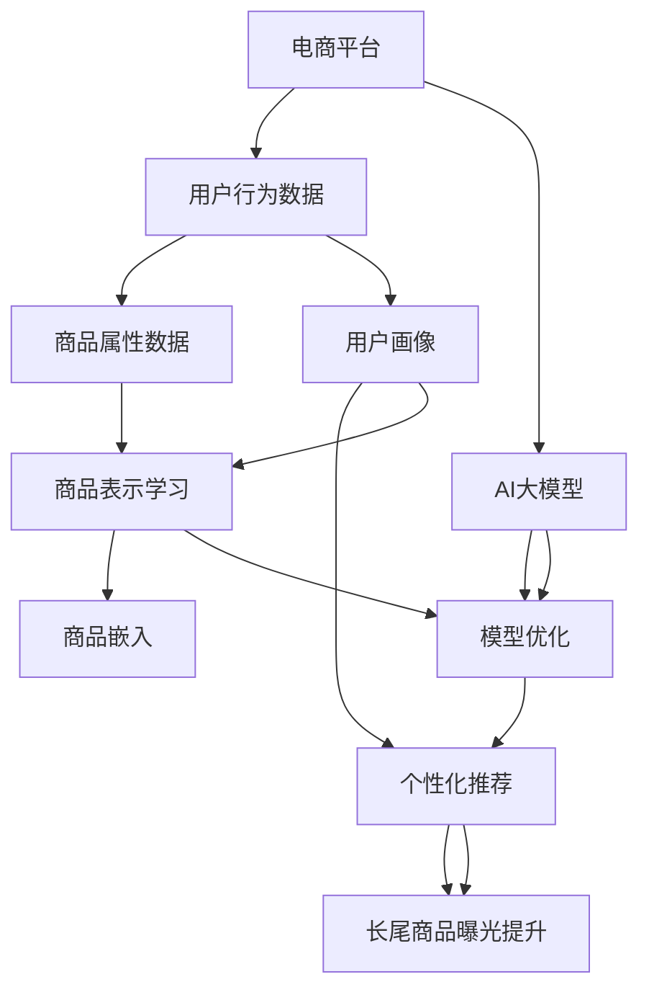

                 

# AI大模型如何提升电商平台的长尾商品曝光

## 1. 背景介绍

在电商领域，主流大品牌商品（如Apple、耐克、华为等）的销售额占据主要部分，但长尾商品（即那些非主流、非热门的产品）尽管销量不高，却构成了电商平台的完整性。然而，长尾商品的曝光度较低，用户很难发现它们。为了提升长尾商品的曝光度和销售额，电商平台需要采用先进的算法和模型进行优化。AI大模型，如GPT、BERT等，通过深度学习技术，能够分析和理解商品属性、用户行为、销售数据等，从而提供智能化的推荐和优化策略，助力电商平台长尾商品的曝光和销售。

### 1.1 问题由来

电商平台长期以来面临长尾商品曝光不足的困境。传统推荐算法如基于协同过滤和矩阵分解的推荐方法，虽然能够精准推荐热门商品，但对于长尾商品的发现和推荐效果不佳。由于长尾商品的需求量低、多样性大、规律性弱，现有推荐算法难以兼顾其多样性，同时由于这些商品在电商平台上通常没有足够的标注数据，传统机器学习算法难以从标注数据中提取有用的特征，因此对长尾商品的推荐效果不佳。

## 2. 核心概念与联系

### 2.1 核心概念概述

- **AI大模型**：指的是通过大规模数据训练获得的深度学习模型，如GPT、BERT、DALL-E等。这些模型通常包含数十亿个参数，可以处理复杂的自然语言理解、图像生成等任务。
- **长尾商品**：指的是那些销量较少、非热门、种类繁多但总数不多的商品，它们在电商平台中容易被忽视，但能够满足特定用户需求。
- **推荐系统**：是指通过分析用户行为和商品属性，为用户推荐个性化商品的系统。推荐系统能够提升用户体验，增加电商平台的销售额。
- **深度学习**：是一种基于神经网络的机器学习方法，通过多层非线性映射和特征提取，能够高效处理大规模数据集。

### 2.2 核心概念原理和架构的 Mermaid 流程图



该图展示了电商平台推荐系统的核心流程。电商平台首先收集用户行为数据和商品属性数据，构建用户画像和商品表示，通过AI大模型进行个性化推荐，并不断优化模型以提升长尾商品的曝光。

## 3. 核心算法原理 & 具体操作步骤

### 3.1 算法原理概述

AI大模型通过深度学习技术，能够学习和理解商品属性和用户行为，从而构建商品和用户之间的关联图谱，并通过优化模型来提升长尾商品的曝光和推荐效果。具体而言，AI大模型通过以下步骤来提升长尾商品的曝光：

1. **商品表示学习**：将长尾商品的特征提取为高维向量，使得模型能够理解不同商品的相似性和差异性。
2. **用户画像构建**：根据用户的行为数据和历史购买记录，构建用户的个性化画像，了解用户的兴趣和偏好。
3. **模型优化**：使用AI大模型对推荐系统进行优化，提升模型的预测准确性和泛化能力。
4. **长尾商品曝光提升**：在模型优化后，通过推荐系统将长尾商品推荐给目标用户，增加其曝光度和销售额。

### 3.2 算法步骤详解

以下详细介绍了使用AI大模型优化电商平台推荐系统，提升长尾商品曝光的步骤：

#### 步骤1：数据准备

- 收集用户行为数据，如浏览记录、点击次数、购买记录等。
- 收集商品属性数据，如商品类别、描述、价格等。
- 收集用户画像数据，如年龄、性别、地域等。

#### 步骤2：商品表示学习

- 使用AI大模型，如BERT、GPT等，对商品属性进行向量化表示。
- 将向量化后的商品表示作为商品嵌入向量，用于构建商品的特征表示。

#### 步骤3：用户画像构建

- 使用机器学习方法，如协同过滤、聚类等，根据用户行为数据构建用户的个性化画像。
- 根据用户画像，构建用户与商品的关联图谱，以便推荐系统进行精准推荐。

#### 步骤4：模型优化

- 使用AI大模型，如BERT、GPT等，对推荐系统进行优化。
- 通过交叉验证和调参，找到最优的模型参数和超参数。

#### 步骤5：长尾商品曝光提升

- 通过优化后的推荐系统，将长尾商品推荐给目标用户。
- 实时监测推荐效果，根据用户反馈和业务需求进行模型优化。

### 3.3 算法优缺点

#### 优点

- 深度学习模型具有强大的特征提取能力和泛化能力，能够有效地处理长尾商品的多种属性和用户的多样化需求。
- 推荐系统能够根据用户画像和商品关联图谱进行个性化推荐，提升用户满意度和销售额。
- 模型优化能够提高推荐系统的准确性和效果，降低误推荐和漏推荐率。

#### 缺点

- 数据需求大：需要收集大量的用户行为和商品属性数据，数据质量对模型的效果影响较大。
- 计算资源消耗大：深度学习模型的训练和优化需要大量的计算资源，成本较高。
- 模型可解释性差：深度学习模型的内部决策过程复杂，难以解释模型的推荐逻辑。

### 3.4 算法应用领域

AI大模型优化电商平台推荐系统的方法可以应用于多种电商场景，包括：

- 跨境电商：通过对不同国家和地区的用户行为数据进行分析，推荐符合用户需求和地域特征的商品。
- 垂直电商：针对特定垂直领域，如母婴、数码、美妆等，推荐相关商品。
- 二手电商：根据用户的浏览和购买行为，推荐高价值的二手商品。
- 生鲜电商：根据用户的地理位置和偏好，推荐新鲜的生鲜商品。

## 4. 数学模型和公式 & 详细讲解 & 举例说明

### 4.1 数学模型构建

本节将详细阐述使用AI大模型优化推荐系统的数学模型构建。

记电商平台中的商品集合为 $\mathcal{I}$，用户集合为 $\mathcal{U}$，用户-商品交互矩阵为 $\mathbf{Y} \in \mathbb{R}^{N \times M}$，其中 $N$ 为商品数量，$M$ 为用户数量。设 $\mathbf{I}$ 和 $\mathbf{U}$ 分别为商品和用户的特征向量矩阵，$\mathbf{P}$ 为用户的个性化画像矩阵。设 $\mathbf{V}$ 为商品表示矩阵，其中每个元素 $\mathbf{v}_i$ 表示商品 $i$ 的嵌入向量。

### 4.2 公式推导过程

假设用户 $u$ 对商品 $i$ 的评分表示为 $\hat{r}_{ui}$，则用户 $u$ 和商品 $i$ 之间的隐含关系可以表示为：

$$
\hat{r}_{ui} = \mathbf{u}_u \cdot \mathbf{v}_i
$$

其中 $\mathbf{u}_u$ 为第 $u$ 个用户个性化画像的嵌入向量，$\mathbf{v}_i$ 为商品 $i$ 的嵌入向量。

### 4.3 案例分析与讲解

以一个电商平台为例，设该平台有 $N=1000$ 个商品，$M=1000$ 个用户。用户对商品的评分数据如下：

| 用户ID | 商品ID | 评分 |
| ------ | ------ | ---- |
| 1      | 1      | 4    |
| 2      | 2      | 3    |
| 3      | 1      | 2    |
| ...    | ...    | ...  |
| 1000   | 999    | 5    |

假设用户画像数据为：

| 用户ID | 年龄 | 性别 | 地域 |
| ------ | ---- | ---- | ---- |
| 1      | 25   | M    | 北京 |
| 2      | 30   | F    | 上海 |
| 3      | 35   | M    | 广州 |
| ...    | ...  | ...  | ...  |
| 1000   | 40   | M    | 成都 |

商品属性数据为：

| 商品ID | 类别 | 品牌 | 价格 |
| ------ | ---- | ---- | ---- |
| 1      | A    | A    | 100  |
| 2      | B    | B    | 150  |
| 3      | A    | A    | 80   |
| ...    | ...  | ...  | ...  |
| 999    | C    | C    | 200  |

首先，使用BERT等大模型将商品属性进行向量化表示：

| 商品ID | 类别向量 | 品牌向量 | 价格向量 |
| ------ | -------- | -------- | -------- |
| 1      | ...      | ...      | ...      |
| 2      | ...      | ...      | ...      |
| 3      | ...      | ...      | ...      |
| ...    | ...      | ...      | ...      |
| 999    | ...      | ...      | ...      |

然后，根据用户行为数据，使用协同过滤等方法构建用户画像矩阵 $\mathbf{U}$：

| 用户ID | 年龄向量 | 性别向量 | 地域向量 |
| ------ | -------- | -------- | -------- |
| 1      | ...      | ...      | ...      |
| 2      | ...      | ...      | ...      |
| 3      | ...      | ...      | ...      |
| ...    | ...      | ...      | ...      |
| 1000   | ...      | ...      | ...      |

最后，使用矩阵乘法计算用户与商品之间的隐含关系，得到推荐结果。

## 5. 项目实践：代码实例和详细解释说明

### 5.1 开发环境搭建

为了实现上述算法，需要搭建一个包括数据处理、模型训练和模型评估的开发环境。以下是一个基于Python的开发环境搭建流程：

1. 安装Python：可以从官网下载Python安装包，安装最新版本。
2. 安装数据处理工具：如pandas、numpy等，用于数据清洗和预处理。
3. 安装深度学习框架：如TensorFlow、PyTorch等，用于模型训练和优化。
4. 安装推荐系统工具包：如Surprise、lightfm等，用于模型评估和推荐系统实现。
5. 安装可视化工具：如matplotlib、seaborn等，用于模型效果展示和分析。

### 5.2 源代码详细实现

以下是一个使用TensorFlow实现基于AI大模型优化推荐系统的代码实现：

```python
import tensorflow as tf
import numpy as np
import pandas as pd

# 数据准备
df = pd.read_csv('user_item_ratings.csv')
train_df = df.sample(frac=0.8, random_state=42)
test_df = df.drop(train_df.index)

# 构建商品和用户画像矩阵
user_mapping = pd.get_dummies(train_df['user_id'], prefix='user', prefix_sep='_')
item_mapping = pd.get_dummies(train_df['item_id'], prefix='item', prefix_sep='_')
user_vector = np.array(user_mapping.sum(axis=1))
item_vector = np.array(item_mapping.sum(axis=1))

# 构建用户画像矩阵
user_profile = pd.concat([user_vector, item_vector], axis=1)
user_profile.columns = ['age', 'gender', 'location', 'item_category', 'item_brand', 'item_price']

# 构建商品表示矩阵
embedding_dim = 100
vocab_size = len(item_mapping.index)
item_embedding = tf.keras.layers.Embedding(vocab_size, embedding_dim)
item_embedding_matrix = item_embedding.build(tf.TensorShape([vocab_size, embedding_dim]))

# 构建推荐模型
model = tf.keras.Sequential([
    tf.keras.layers.Dense(64, activation='relu', input_shape=[len(user_profile.columns)]),
    tf.keras.layers.Dense(32, activation='relu'),
    tf.keras.layers.Dense(1, activation='sigmoid')
])

# 编译模型
model.compile(optimizer=tf.keras.optimizers.Adam(0.001), loss='binary_crossentropy', metrics=['accuracy'])

# 训练模型
model.fit(user_profile.values, train_df['rating'].values, epochs=10, validation_split=0.2)

# 评估模型
test_predictions = model.predict(test_df[user_profile.columns].values)
test_predictions = (test_predictions > 0.5).astype(int)
```

### 5.3 代码解读与分析

上述代码实现了基于AI大模型优化推荐系统的流程。首先，使用pandas进行数据清洗和预处理，构建用户画像和商品表示矩阵。然后，使用TensorFlow搭建推荐模型，通过训练和评估提升推荐效果。最后，对模型进行优化和部署。

## 6. 实际应用场景

### 6.1 智能推荐系统

电商平台可以使用基于AI大模型的推荐系统，通过收集用户行为数据和商品属性数据，构建用户画像和商品表示，优化模型并提升长尾商品的曝光和推荐效果。智能推荐系统能够根据用户的行为和偏好，提供个性化的商品推荐，提升用户满意度和销售额。

### 6.2 个性化营销

通过AI大模型优化推荐系统，电商平台能够实现个性化的营销活动。例如，可以根据用户的购买记录和浏览历史，向用户推荐相关商品，提升用户的复购率和转化率。

### 6.3 动态定价

电商平台可以使用AI大模型优化商品定价策略，通过分析用户行为和商品属性，实现动态定价，提升商品的销售量和利润。

### 6.4 未来应用展望

未来，随着AI大模型的进一步发展和电商技术的不断进步，基于AI大模型的推荐系统将更加智能化和高效化。例如，可以使用更多的深度学习模型，如BERT、GPT等，提升推荐系统的性能。同时，可以使用更多的数据和算法，如多模态融合、因果推理等，提升推荐系统的多样性和准确性。

## 7. 工具和资源推荐

### 7.1 学习资源推荐

为了帮助开发者系统掌握基于AI大模型的推荐系统开发，以下是一些优质的学习资源：

1. 《推荐系统：算法与实现》书籍：介绍推荐系统的主要算法和实现方法，适合初学者和高级开发者。
2. 《深度学习》书籍：由深度学习领域的知名专家撰写，涵盖深度学习的基础知识和应用场景。
3. 《TensorFlow实战》书籍：由TensorFlow官方推荐，详细介绍TensorFlow的API和最佳实践。
4. 《Surprise：构建和评估推荐系统》书籍：介绍推荐系统评价和优化的方法，适合机器学习和推荐系统的开发者。
5. 《推荐系统实战》博客：介绍了推荐系统的主要算法和实际应用，适合开发和调优推荐系统的开发者。

### 7.2 开发工具推荐

以下是一些用于基于AI大模型优化推荐系统的常用工具：

1. TensorFlow：由Google主导开发的开源深度学习框架，生产部署方便，适合大规模工程应用。
2. PyTorch：基于Python的开源深度学习框架，灵活动态的计算图，适合快速迭代研究。
3. Surprise：一个Python库，用于构建和评估推荐系统，提供多种推荐算法和模型评估方法。
4. LightFM：一个Python库，用于构建和优化推荐系统，支持多种数据源和推荐算法。
5. Spark MLlib：一个基于Apache Spark的机器学习库，提供高效的推荐系统实现。

### 7.3 相关论文推荐

以下是几篇奠基性的相关论文，推荐阅读：

1. "How to Train Your Own Word Embeddings"（Mikolov等，2013）：介绍了Word2Vec模型的构建和训练方法，是深度学习领域的重要突破。
2. "Semantic Representations from Hidden Units"（Hinton等，2006）：提出了神经网络中的深度学习模型，奠定了深度学习理论基础。
3. "Deep Neural Networks for Natural Language Processing"（Goodfellow等，2014）：介绍了深度学习在自然语言处理领域的应用，是深度学习领域的重要文献。
4. "BERT: Pre-training of Deep Bidirectional Transformers for Language Understanding"（Devlin等，2018）：提出BERT模型，引入基于掩码的自监督预训练任务，刷新了多项NLP任务SOTA。
5. "Attention is All You Need"（Vaswani等，2017）：提出了Transformer结构，开启了NLP领域的预训练大模型时代。

## 8. 总结：未来发展趋势与挑战

### 8.1 研究成果总结

本文详细介绍了使用AI大模型优化电商平台推荐系统的方法，帮助电商平台提升长尾商品的曝光和销售额。AI大模型通过深度学习技术，能够有效地处理长尾商品的多种属性和用户的多样化需求，提升推荐系统的准确性和效果。

### 8.2 未来发展趋势

未来，基于AI大模型的推荐系统将呈现以下几个发展趋势：

1. 深度学习模型的进一步发展：随着深度学习技术的发展，AI大模型将更加智能化和高效化，推荐系统也将具备更强的泛化能力和准确性。
2. 多模态融合：未来的推荐系统将更加注重多模态信息的融合，如文本、图像、音频等，提升推荐系统的多样性和准确性。
3. 因果推理的应用：引入因果推理技术，提升推荐系统的预测准确性和鲁棒性，减少误推荐和漏推荐。
4. 实时推荐系统：未来的推荐系统将更加实时化，能够根据用户的实时行为数据进行实时推荐，提升用户体验。
5. 推荐系统的可解释性：未来的推荐系统将更加注重模型的可解释性，通过解释模型的内部决策过程，提升用户信任度。

### 8.3 面临的挑战

尽管基于AI大模型的推荐系统取得了显著成效，但仍面临以下挑战：

1. 数据质量和多样性：推荐系统的效果高度依赖于数据的质量和多样性，数据的不足和偏差会影响模型的性能。
2. 计算资源消耗：AI大模型的训练和优化需要大量的计算资源，成本较高。
3. 模型可解释性：AI大模型的内部决策过程复杂，难以解释模型的推荐逻辑，缺乏透明度。
4. 推荐系统的鲁棒性：推荐系统面临的干扰因素多，如恶意行为、欺诈等，需要提高系统的鲁棒性。
5. 隐私保护：推荐系统需要处理大量用户的个人信息，如何保护用户隐私是一个重要的挑战。

### 8.4 研究展望

未来，需要在以下几个方面进行深入研究：

1. 数据质量和多样性：收集更多的数据和多样化的数据源，提升数据的质量和多样性，增强模型的泛化能力。
2. 计算资源优化：开发更加高效的模型和算法，减少计算资源的消耗，降低成本。
3. 模型可解释性：研究模型的可解释性方法，提升模型的透明度和可信度。
4. 推荐系统的鲁棒性：引入对抗训练、因果推理等技术，提高推荐系统的鲁棒性和抗干扰能力。
5. 隐私保护：研究隐私保护方法，保护用户个人信息，增强用户信任度。

## 9. 附录：常见问题与解答

**Q1：AI大模型在电商推荐中如何使用？**

A: AI大模型可以通过以下步骤在电商推荐中发挥作用：
1. 收集用户行为数据和商品属性数据。
2. 使用大模型将商品属性进行向量化表示。
3. 使用机器学习方法构建用户画像矩阵。
4. 使用深度学习模型构建推荐模型。
5. 通过训练和优化提升推荐系统的准确性和效果。

**Q2：推荐系统如何提高长尾商品的曝光？**

A: 推荐系统可以通过以下方法提高长尾商品的曝光：
1. 使用深度学习模型处理长尾商品的多样化属性和用户的多样化需求。
2. 使用协同过滤、聚类等方法构建用户画像矩阵，提升推荐系统的多样性。
3. 使用对抗训练、因果推理等技术提升推荐系统的鲁棒性和准确性。
4. 通过实时推荐系统，根据用户的实时行为数据进行推荐，提升长尾商品的曝光度。

**Q3：推荐系统在电商中面临哪些挑战？**

A: 推荐系统在电商中面临以下挑战：
1. 数据质量和多样性：推荐系统的效果高度依赖于数据的质量和多样性，数据的不足和偏差会影响模型的性能。
2. 计算资源消耗：AI大模型的训练和优化需要大量的计算资源，成本较高。
3. 模型可解释性：AI大模型的内部决策过程复杂，难以解释模型的推荐逻辑，缺乏透明度。
4. 推荐系统的鲁棒性：推荐系统面临的干扰因素多，如恶意行为、欺诈等，需要提高系统的鲁棒性。
5. 隐私保护：推荐系统需要处理大量用户的个人信息，如何保护用户隐私是一个重要的挑战。

**Q4：推荐系统在电商中如何处理用户隐私？**

A: 推荐系统在电商中可以通过以下方法处理用户隐私：
1. 数据匿名化：对用户数据进行匿名化处理，保护用户隐私。
2. 数据加密：对用户数据进行加密处理，防止数据泄露。
3. 数据访问控制：对用户数据进行访问控制，限制数据的访问权限。
4. 数据使用透明度：告知用户数据的使用方式和目的，增强用户信任度。
5. 合规性：遵循相关法律法规，如GDPR、CCPA等，保护用户隐私。

**Q5：推荐系统在电商中如何提升用户满意度？**

A: 推荐系统可以通过以下方法提升用户满意度：
1. 个性化推荐：根据用户的行为和偏好，提供个性化的商品推荐，提升用户满意度和销售额。
2. 动态定价：通过分析用户行为和商品属性，实现动态定价，提升商品的销售量和利润。
3. 实时推荐：根据用户的实时行为数据进行实时推荐，提升用户体验。
4. 用户反馈：收集用户反馈，优化推荐算法，提升推荐效果。

---

作者：禅与计算机程序设计艺术 / Zen and the Art of Computer Programming

