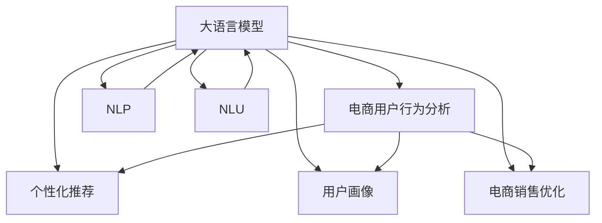

                 

# AI大模型对电商用户行为分析的深度洞察

> 关键词：电商用户行为分析, 大语言模型, 自然语言处理, 自然语言理解, 个性化推荐, 用户画像, 电商销售优化

## 1. 背景介绍

### 1.1 问题由来

随着电商行业的蓬勃发展，各大电商平台已经积累了海量的用户行为数据。这些数据不仅包括用户的购买记录、浏览历史、点击行为等客观数据，还有用户的评论、反馈、评分等主观评价信息。如何利用这些宝贵的用户数据，洞察用户行为，进行精准营销，优化电商销售策略，是各大电商平台普遍面临的挑战。

传统的电商数据分析方法，往往依赖于复杂的统计模型和人工特征工程，难以直接从海量自然语言文本中提取有价值的信息。而近年来，基于深度学习的大语言模型在自然语言处理(NLP)领域取得了突破性进展，通过大规模预训练和微调，使得模型具备了强大的语言理解和生成能力。通过大语言模型对用户行为数据进行深度分析，可以挖掘出更加丰富的用户需求和偏好，辅助电商平台进行个性化推荐，提升用户体验和销售转化率。

### 1.2 问题核心关键点

本文聚焦于基于大语言模型对电商用户行为数据的深度分析，旨在通过模型的自然语言理解能力，挖掘用户的潜在需求和行为模式，辅助电商平台进行精准营销和销售优化。

具体而言，本文将阐述以下关键问题：

1. 如何构建基于大语言模型的电商用户行为分析系统？
2. 如何利用大语言模型理解用户评论、反馈等主观评价信息？
3. 如何结合用户行为客观数据，进行个性化推荐和销售优化？
4. 面临的主要挑战和未来研究方向有哪些？

## 2. 核心概念与联系

### 2.1 核心概念概述

为更好地理解基于大语言模型对电商用户行为分析的系统设计，本节将介绍几个密切相关的核心概念：

- **大语言模型(LLM)**：以自回归(如GPT)或自编码(如BERT)模型为代表的大规模预训练语言模型。通过在大规模无标签文本语料上进行预训练，学习通用的语言表示，具备强大的语言理解和生成能力。

- **电商用户行为分析**：通过分析电商用户的购买记录、浏览历史、评论、评分等数据，挖掘用户需求和行为模式，辅助电商平台进行精准营销和销售优化。

- **自然语言处理(NLP)**：涉及文本数据的处理、分析、生成等技术，旨在实现人机之间通过自然语言进行交互和理解。

- **自然语言理解(NLU)**：使计算机能够理解自然语言文本含义的能力，是电商用户行为分析的重要组成部分。

- **个性化推荐**：通过分析用户行为数据，推荐个性化的商品或服务，提升用户体验和转化率。

- **用户画像**：综合用户的行为数据、历史偏好等，构建用户画像，为精准营销提供支持。

- **电商销售优化**：通过分析用户行为数据，优化商品展示、推荐、促销等策略，提升电商平台的销售转化率。

这些核心概念之间的逻辑关系可以通过以下Mermaid流程图来展示：



这个流程图展示了大语言模型的核心概念及其与电商用户行为分析的联系：

1. 大语言模型通过预训练获得基础能力。
2. 电商用户行为分析基于大语言模型的自然语言理解能力，挖掘用户需求和行为模式。
3. 个性化推荐和用户画像的构建，都离不开对大语言模型的深度应用。
4. 电商销售优化也需要大语言模型提供的用户行为洞察作为支撑。
5. NLP和NLU是大语言模型分析电商用户行为的基础。

## 3. 核心算法原理 & 具体操作步骤
### 3.1 算法原理概述

基于大语言模型对电商用户行为数据的深度分析，本质上是一种将大规模自然语言数据转化为结构化用户行为信息的自然语言理解过程。其核心思想是：通过预训练大语言模型，学习通用的语言表示，将其应用到电商用户行为数据上，提取用户的潜在需求和行为模式。

形式化地，假设电商平台收集到的用户行为数据集为 $D=\{(x_i,y_i)\}_{i=1}^N$，其中 $x_i$ 表示用户行为数据（如评论、评分、浏览记录等），$y_i$ 表示与 $x_i$ 对应的行为标签（如购买、收藏、评论等）。目标是在大语言模型 $M_{\theta}$ 的基础上，通过有监督学习，优化模型参数 $\theta$，使得模型能够准确理解用户行为数据 $x_i$，并预测对应的行为标签 $y_i$。

基于大语言模型的电商用户行为分析模型设计步骤如下：

1. **预训练**：在大规模无标签电商评论数据上，使用自监督学习任务训练通用大语言模型 $M_{\theta}$，学习通用的语言表示。
2. **微调**：在电商用户行为数据集 $D$ 上，使用监督学习任务对 $M_{\theta}$ 进行微调，学习与电商用户行为相关的特定表示。
3. **推理**：将用户行为数据 $x$ 输入微调后的模型 $M_{\hat{\theta}}$，得到用户行为标签 $y$ 的预测。

### 3.2 算法步骤详解

基于大语言模型的电商用户行为分析，主要包括以下几个关键步骤：

**Step 1: 准备数据集**
- 收集电商用户行为数据集 $D=\{(x_i,y_i)\}_{i=1}^N$，其中 $x_i$ 包括用户的评论、评分、浏览历史等文本数据，$y_i$ 表示用户的实际行为标签。
- 将数据集划分为训练集、验证集和测试集，以保证模型在未见过的数据上也有良好的表现。

**Step 2: 预训练大语言模型**
- 选择合适的大语言模型 $M_{\theta}$，如BERT、GPT等，作为初始化参数。
- 在大规模无标签电商评论数据上进行预训练，学习通用的语言表示。

**Step 3: 微调电商用户行为模型**
- 在电商用户行为数据集 $D$ 上，对预训练模型 $M_{\theta}$ 进行微调。
- 设置微调任务的损失函数，如交叉熵损失、均方误差损失等。
- 选择适当的优化器及其参数，如AdamW、SGD等。
- 设置正则化技术，如L2正则、Dropout、Early Stopping等。
- 设置冻结预训练参数的策略，如仅微调顶层，或全部参数都参与微调。

**Step 4: 推理和预测**
- 将用户行为数据 $x$ 输入微调后的模型 $M_{\hat{\theta}}$。
- 使用微调模型的自然语言理解能力，将用户行为数据转化为结构化行为信息。
- 结合用户行为客观数据，进行个性化推荐和销售优化。

**Step 5: 评估和优化**
- 在测试集上评估微调后模型 $M_{\hat{\theta}}$ 的性能，对比微调前后的精度提升。
- 根据评估结果，对模型参数进行进一步优化，或进行超参数调优。

### 3.3 算法优缺点

基于大语言模型的电商用户行为分析方法具有以下优点：
1. 深度理解用户需求：大语言模型能够从文本数据中提取更丰富的用户需求和行为模式。
2. 自动化特征提取：利用自然语言理解能力，自动化地从文本数据中提取有价值的特征。
3. 可扩展性强：支持大规模文本数据的处理，可扩展到多个电商平台的分析需求。
4. 实时性高：模型推理速度快，能够实时响应电商平台的业务需求。
5. 鲁棒性强：能够应对噪声和异常数据，提高模型的稳定性和可靠性。

同时，该方法也存在一定的局限性：
1. 数据依赖性大：模型的表现高度依赖于电商评论数据的质量和数量。
2. 泛化能力有限：在特定领域或特定电商平台上的表现可能不如专有模型。
3. 可解释性差：大语言模型的决策过程难以解释，缺乏透明的推理逻辑。
4. 计算资源需求高：大规模预训练和微调需要高算力支持。
5. 偏见问题：可能继承或放大预训练数据中的偏见，影响模型公平性。

尽管存在这些局限性，但就目前而言，基于大语言模型的电商用户行为分析方法仍然是一种高效、灵活、强大的工具。未来相关研究的重点在于如何进一步降低对电商评论数据的依赖，提高模型的泛化能力，同时兼顾可解释性和伦理安全性等因素。

### 3.4 算法应用领域

基于大语言模型的电商用户行为分析方法，在电商领域已经得到了广泛的应用，例如：

1. **个性化推荐系统**：利用用户评论、评分等主观数据，进行商品推荐和个性化定制。
2. **用户画像构建**：结合用户行为客观数据，构建详尽的用户画像，辅助精准营销。
3. **客户服务**：通过分析用户评论和反馈，进行情感分析，提升客户满意度。
4. **销售优化**：利用用户行为数据，优化商品展示、促销策略，提升销售转化率。
5. **舆情分析**：通过分析用户评论和评分，实时监测电商品牌的市场表现和用户满意度。

除了上述这些经典应用外，大语言模型在电商领域还涌现出许多创新应用，如智能客服、市场洞察、广告投放优化等，为电商业务带来了更多的数字化升级空间。

## 4. 数学模型和公式 & 详细讲解  
### 4.1 数学模型构建

本节将使用数学语言对基于大语言模型对电商用户行为数据的深度分析过程进行更加严格的刻画。

记电商用户行为数据集为 $D=\{(x_i,y_i)\}_{i=1}^N$，其中 $x_i$ 表示用户行为数据（如评论、评分、浏览历史等），$y_i$ 表示与 $x_i$ 对应的行为标签（如购买、收藏、评论等）。

定义模型 $M_{\theta}$ 在输入 $x$ 上的输出为 $\hat{y}=M_{\theta}(x) \in [0,1]$，表示模型预测用户行为标签的概率。则在数据集 $D$ 上的经验风险为：

$$
\mathcal{L}(\theta) = \frac{1}{N}\sum_{i=1}^N \ell(M_{\theta}(x_i),y_i)
$$

其中 $\ell$ 为损失函数，用于衡量模型预测输出与真实标签之间的差异。常见的损失函数包括交叉熵损失、均方误差损失等。

根据链式法则，损失函数对参数 $\theta_k$ 的梯度为：

$$
\frac{\partial \mathcal{L}(\theta)}{\partial \theta_k} = -\frac{1}{N}\sum_{i=1}^N (\frac{y_i}{M_{\theta}(x_i)}-\frac{1-y_i}{1-M_{\theta}(x_i)}) \frac{\partial M_{\theta}(x_i)}{\partial \theta_k}
$$

其中 $\frac{\partial M_{\theta}(x_i)}{\partial \theta_k}$ 可进一步递归展开，利用自动微分技术完成计算。

### 4.2 公式推导过程

以下我们以二分类任务为例，推导交叉熵损失函数及其梯度的计算公式。

假设模型 $M_{\theta}$ 在输入 $x$ 上的输出为 $\hat{y}=M_{\theta}(x) \in [0,1]$，表示样本属于正类的概率。真实标签 $y \in \{0,1\}$。则二分类交叉熵损失函数定义为：

$$
\ell(M_{\theta}(x),y) = -[y\log \hat{y} + (1-y)\log (1-\hat{y})]
$$

将其代入经验风险公式，得：

$$
\mathcal{L}(\theta) = -\frac{1}{N}\sum_{i=1}^N [y_i\log M_{\theta}(x_i)+(1-y_i)\log(1-M_{\theta}(x_i))]
$$

根据链式法则，损失函数对参数 $\theta_k$ 的梯度为：

$$
\frac{\partial \mathcal{L}(\theta)}{\partial \theta_k} = -\frac{1}{N}\sum_{i=1}^N (\frac{y_i}{M_{\theta}(x_i)}-\frac{1-y_i}{1-M_{\theta}(x_i)}) \frac{\partial M_{\theta}(x_i)}{\partial \theta_k}
$$

其中 $\frac{\partial M_{\theta}(x_i)}{\partial \theta_k}$ 可进一步递归展开，利用自动微分技术完成计算。

在得到损失函数的梯度后，即可带入参数更新公式，完成模型的迭代优化。重复上述过程直至收敛，最终得到适应电商用户行为分析任务的最优模型参数 $\theta^*$。

## 5. 项目实践：代码实例和详细解释说明
### 5.1 开发环境搭建

在进行电商用户行为数据分析的实践前，我们需要准备好开发环境。以下是使用Python进行PyTorch开发的环境配置流程：

1. 安装Anaconda：从官网下载并安装Anaconda，用于创建独立的Python环境。

2. 创建并激活虚拟环境：
```bash
conda create -n pytorch-env python=3.8 
conda activate pytorch-env
```

3. 安装PyTorch：根据CUDA版本，从官网获取对应的安装命令。例如：
```bash
conda install pytorch torchvision torchaudio cudatoolkit=11.1 -c pytorch -c conda-forge
```

4. 安装Transformers库：
```bash
pip install transformers
```

5. 安装各类工具包：
```bash
pip install numpy pandas scikit-learn matplotlib tqdm jupyter notebook ipython
```

完成上述步骤后，即可在`pytorch-env`环境中开始电商用户行为分析的实践。

### 5.2 源代码详细实现

下面我以电商评论情感分析任务为例，给出使用Transformers库对BERT模型进行微调的PyTorch代码实现。

首先，定义情感分析任务的数据处理函数：

```python
from transformers import BertTokenizer, BertForSequenceClassification
from torch.utils.data import Dataset
import torch

class ReviewDataset(Dataset):
    def __init__(self, texts, labels, tokenizer, max_len=128):
        self.texts = texts
        self.labels = labels
        self.tokenizer = tokenizer
        self.max_len = max_len
        
    def __len__(self):
        return len(self.texts)
    
    def __getitem__(self, item):
        text = self.texts[item]
        label = self.labels[item]
        
        encoding = self.tokenizer(text, return_tensors='pt', max_length=self.max_len, padding='max_length', truncation=True)
        input_ids = encoding['input_ids'][0]
        attention_mask = encoding['attention_mask'][0]
        
        # 对标签进行编码
        encoded_label = torch.tensor([label], dtype=torch.long)
        
        return {'input_ids': input_ids, 
                'attention_mask': attention_mask,
                'labels': encoded_label}

# 创建dataset
tokenizer = BertTokenizer.from_pretrained('bert-base-cased')

train_dataset = ReviewDataset(train_texts, train_labels, tokenizer)
dev_dataset = ReviewDataset(dev_texts, dev_labels, tokenizer)
test_dataset = ReviewDataset(test_texts, test_labels, tokenizer)
```

然后，定义模型和优化器：

```python
from transformers import AdamW

model = BertForSequenceClassification.from_pretrained('bert-base-cased', num_labels=2)

optimizer = AdamW(model.parameters(), lr=2e-5)
```

接着，定义训练和评估函数：

```python
from torch.utils.data import DataLoader
from tqdm import tqdm
from sklearn.metrics import accuracy_score

device = torch.device('cuda') if torch.cuda.is_available() else torch.device('cpu')
model.to(device)

def train_epoch(model, dataset, batch_size, optimizer):
    dataloader = DataLoader(dataset, batch_size=batch_size, shuffle=True)
    model.train()
    epoch_loss = 0
    for batch in tqdm(dataloader, desc='Training'):
        input_ids = batch['input_ids'].to(device)
        attention_mask = batch['attention_mask'].to(device)
        labels = batch['labels'].to(device)
        model.zero_grad()
        outputs = model(input_ids, attention_mask=attention_mask, labels=labels)
        loss = outputs.loss
        epoch_loss += loss.item()
        loss.backward()
        optimizer.step()
    return epoch_loss / len(dataloader)

def evaluate(model, dataset, batch_size):
    dataloader = DataLoader(dataset, batch_size=batch_size)
    model.eval()
    preds, labels = [], []
    with torch.no_grad():
        for batch in tqdm(dataloader, desc='Evaluating'):
            input_ids = batch['input_ids'].to(device)
            attention_mask = batch['attention_mask'].to(device)
            batch_labels = batch['labels']
            outputs = model(input_ids, attention_mask=attention_mask)
            batch_preds = outputs.logits.argmax(dim=1).to('cpu').tolist()
            batch_labels = batch_labels.to('cpu').tolist()
            for pred, label in zip(batch_preds, batch_labels):
                preds.append(pred)
                labels.append(label)
                
    return accuracy_score(labels, preds)
```

最后，启动训练流程并在测试集上评估：

```python
epochs = 5
batch_size = 16

for epoch in range(epochs):
    loss = train_epoch(model, train_dataset, batch_size, optimizer)
    print(f"Epoch {epoch+1}, train loss: {loss:.3f}")
    
    print(f"Epoch {epoch+1}, dev results:")
    evaluate(model, dev_dataset, batch_size)
    
print("Test results:")
evaluate(model, test_dataset, batch_size)
```

以上就是使用PyTorch对BERT进行电商评论情感分析任务微调的完整代码实现。可以看到，得益于Transformers库的强大封装，我们可以用相对简洁的代码完成BERT模型的加载和微调。

### 5.3 代码解读与分析

让我们再详细解读一下关键代码的实现细节：

**ReviewDataset类**：
- `__init__`方法：初始化文本、标签、分词器等关键组件。
- `__len__`方法：返回数据集的样本数量。
- `__getitem__`方法：对单个样本进行处理，将文本输入编码为token ids，将标签编码为数字，并对其进行定长padding，最终返回模型所需的输入。

**训练和评估函数**：
- 使用PyTorch的DataLoader对数据集进行批次化加载，供模型训练和推理使用。
- 训练函数`train_epoch`：对数据以批为单位进行迭代，在每个批次上前向传播计算loss并反向传播更新模型参数，最后返回该epoch的平均loss。
- 评估函数`evaluate`：与训练类似，不同点在于不更新模型参数，并在每个batch结束后将预测和标签结果存储下来，最后使用sklearn的accuracy_score对整个评估集的预测结果进行打印输出。

**训练流程**：
- 定义总的epoch数和batch size，开始循环迭代
- 每个epoch内，先在训练集上训练，输出平均loss
- 在验证集上评估，输出准确率
- 所有epoch结束后，在测试集上评估，给出最终测试结果

可以看到，PyTorch配合Transformers库使得BERT微调的代码实现变得简洁高效。开发者可以将更多精力放在数据处理、模型改进等高层逻辑上，而不必过多关注底层的实现细节。

当然，工业级的系统实现还需考虑更多因素，如模型的保存和部署、超参数的自动搜索、更灵活的任务适配层等。但核心的微调范式基本与此类似。

## 6. 实际应用场景
### 6.1 电商评论情感分析

通过大语言模型对电商评论数据进行情感分析，可以全面了解用户的购买体验和满意度。具体而言，可以收集电商平台上用户的评论数据，并利用微调后的模型对评论进行情感分类，统计正面、负面、中性的评论数量，从而评估平台的用户满意度。

此外，大语言模型还可以结合评论中的具体情感表达，进行用户画像构建，识别出不同用户群体的情感倾向，辅助电商平台进行精准营销和产品优化。例如，对于情绪负面的评论，可以进一步分析原因，优化商品质量和服务体验，提升用户满意度。

### 6.2 个性化推荐

电商平台的个性化推荐系统，通过分析用户的购买历史、浏览行为、评论情感等数据，推荐用户可能感兴趣的商品，提升用户体验和销售转化率。基于大语言模型的电商用户行为分析，可以挖掘出用户的潜在需求和行为模式，辅助推荐系统生成更加精准和多样化的推荐结果。

例如，通过分析用户的评论，可以识别出用户对某些商品的偏好和不满，进而推荐替代品或进行产品改进。同时，通过情感分析，可以判断用户对不同商品的情感倾向，从而调整推荐策略，避免用户流失。

### 6.3 营销活动优化

电商平台经常开展各种营销活动，如打折促销、满减活动、限时抢购等。通过大语言模型对用户行为数据进行深度分析，可以评估各类活动的效果，优化营销策略。例如，通过分析用户的评论和评分，可以评估某次活动对品牌形象的影响；通过分析用户的购买行为，可以评估活动对销售转化的影响。

大语言模型还可以结合用户画像和行为数据，预测营销活动的潜在效果，帮助电商平台提前规划和优化活动策略，提升活动回报率。

### 6.4 未来应用展望

随着大语言模型和电商用户行为分析技术的不断发展，未来电商业务将迎来更多创新应用：

1. **用户画像动态更新**：结合电商用户行为数据和大语言模型的自然语言理解能力，实时更新用户画像，提供更精准的个性化推荐和营销服务。
2. **智能客服**：利用大语言模型对用户评论和反馈进行情感分析，识别用户情绪，自动回复用户咨询，提升客户服务质量。
3. **风险预警**：通过情感分析识别用户对某些商品或服务的负面情绪，提前进行风险预警，采取应对措施，避免负面事件影响品牌形象。
4. **动态定价**：利用用户行为数据和情感分析结果，动态调整商品价格，提升销售转化率。
5. **市场洞察**：通过分析用户评论和评分，实时监测市场趋势和用户需求变化，辅助电商平台制定市场策略。

未来，随着技术的不断进步，电商业务将更加智能化、个性化和精准化，大语言模型和电商用户行为分析技术将扮演关键角色，推动电商业务的数字化升级。

## 7. 工具和资源推荐
### 7.1 学习资源推荐

为了帮助开发者系统掌握大语言模型对电商用户行为分析的理论基础和实践技巧，这里推荐一些优质的学习资源：

1. 《Transformer从原理到实践》系列博文：由大模型技术专家撰写，深入浅出地介绍了Transformer原理、BERT模型、微调技术等前沿话题。

2. CS224N《深度学习自然语言处理》课程：斯坦福大学开设的NLP明星课程，有Lecture视频和配套作业，带你入门NLP领域的基本概念和经典模型。

3. 《Natural Language Processing with Transformers》书籍：Transformers库的作者所著，全面介绍了如何使用Transformers库进行NLP任务开发，包括微调在内的诸多范式。

4. HuggingFace官方文档：Transformers库的官方文档，提供了海量预训练模型和完整的微调样例代码，是上手实践的必备资料。

5. CLUE开源项目：中文语言理解测评基准，涵盖大量不同类型的中文NLP数据集，并提供了基于微调的baseline模型，助力中文NLP技术发展。

通过对这些资源的学习实践，相信你一定能够快速掌握大语言模型对电商用户行为分析的精髓，并用于解决实际的电商问题。
###  7.2 开发工具推荐

高效的开发离不开优秀的工具支持。以下是几款用于大语言模型对电商用户行为分析开发的常用工具：

1. PyTorch：基于Python的开源深度学习框架，灵活动态的计算图，适合快速迭代研究。大部分预训练语言模型都有PyTorch版本的实现。

2. TensorFlow：由Google主导开发的开源深度学习框架，生产部署方便，适合大规模工程应用。同样有丰富的预训练语言模型资源。

3. Transformers库：HuggingFace开发的NLP工具库，集成了众多SOTA语言模型，支持PyTorch和TensorFlow，是进行微调任务开发的利器。

4. Weights & Biases：模型训练的实验跟踪工具，可以记录和可视化模型训练过程中的各项指标，方便对比和调优。与主流深度学习框架无缝集成。

5. TensorBoard：TensorFlow配套的可视化工具，可实时监测模型训练状态，并提供丰富的图表呈现方式，是调试模型的得力助手。

6. Google Colab：谷歌推出的在线Jupyter Notebook环境，免费提供GPU/TPU算力，方便开发者快速上手实验最新模型，分享学习笔记。

合理利用这些工具，可以显著提升大语言模型对电商用户行为分析的开发效率，加快创新迭代的步伐。

### 7.3 相关论文推荐

大语言模型对电商用户行为分析技术的发展源于学界的持续研究。以下是几篇奠基性的相关论文，推荐阅读：

1. Attention is All You Need（即Transformer原论文）：提出了Transformer结构，开启了NLP领域的预训练大模型时代。

2. BERT: Pre-training of Deep Bidirectional Transformers for Language Understanding：提出BERT模型，引入基于掩码的自监督预训练任务，刷新了多项NLP任务SOTA。

3. Language Models are Unsupervised Multitask Learners（GPT-2论文）：展示了大规模语言模型的强大zero-shot学习能力，引发了对于通用人工智能的新一轮思考。

4. Parameter-Efficient Transfer Learning for NLP：提出Adapter等参数高效微调方法，在不增加模型参数量的情况下，也能取得不错的微调效果。

5. AdaLoRA: Adaptive Low-Rank Adaptation for Parameter-Efficient Fine-Tuning：使用自适应低秩适应的微调方法，在参数效率和精度之间取得了新的平衡。

这些论文代表了大语言模型对电商用户行为分析技术的发展脉络。通过学习这些前沿成果，可以帮助研究者把握学科前进方向，激发更多的创新灵感。

## 8. 总结：未来发展趋势与挑战

### 8.1 总结

本文对基于大语言模型对电商用户行为数据的深度分析方法进行了全面系统的介绍。首先阐述了电商用户行为分析的背景和重要性，明确了通过大语言模型进行用户需求挖掘、行为模式分析的独特价值。其次，从原理到实践，详细讲解了基于大语言模型的电商用户行为分析模型的设计步骤和算法细节，给出了电商评论情感分析任务的完整代码实现。同时，本文还广泛探讨了大语言模型在电商领域的应用前景，展示了其在个性化推荐、营销活动优化、用户画像动态更新等方面的应用潜力。

通过本文的系统梳理，可以看到，基于大语言模型的电商用户行为分析方法正在成为电商业务智能化升级的重要手段，极大地提升了电商平台的精准营销和销售转化率。未来，伴随预训练语言模型和微调方法的持续演进，基于大语言模型的电商用户行为分析技术必将在电商业务中扮演更加重要的角色，推动电商业务的数字化和智能化进程。

### 8.2 未来发展趋势

展望未来，大语言模型对电商用户行为分析技术将呈现以下几个发展趋势：

1. **模型规模持续增大**：随着算力成本的下降和数据规模的扩张，大语言模型的参数量还将持续增长。超大规模语言模型蕴含的丰富语言知识，有望支撑更加复杂多变的电商用户行为分析。

2. **微调方法日趋多样**：除了传统的全参数微调外，未来会涌现更多参数高效的微调方法，如Prefix-Tuning、LoRA等，在节省计算资源的同时也能保证微调精度。

3. **实时性提高**：通过硬件加速和优化模型推理流程，提高电商用户行为分析的实时性，能够更快速地响应电商平台的业务需求。

4. **跨平台应用**：大语言模型对电商用户行为分析技术不仅适用于单一平台，还可以应用于跨平台的电商数据整合和分析，提供更全面和精准的电商业务洞察。

5. **多模态融合**：将电商用户行为分析扩展到图像、视频、语音等多模态数据，结合自然语言理解能力，进行更加全面和深入的用户行为分析。

以上趋势凸显了大语言模型对电商用户行为分析技术的广阔前景。这些方向的探索发展，必将进一步提升电商平台的智能化水平，为电商业务的数字化转型提供更强大的技术支持。

### 8.3 面临的挑战

尽管大语言模型对电商用户行为分析技术已经取得了显著成效，但在迈向更加智能化、普适化应用的过程中，它仍面临着诸多挑战：

1. **数据依赖性大**：模型的表现高度依赖于电商评论数据的质量和数量，数据的获取和处理成本较高。如何降低对标注数据的依赖，提高数据质量，是亟待解决的问题。

2. **泛化能力有限**：模型在特定电商平台的泛化能力可能有限，在跨平台应用时表现不佳。如何提升模型的泛化能力，优化模型迁移学习技术，是未来的研究方向。

3. **计算资源需求高**：大规模预训练和微调需要高算力支持，对于中小型电商平台可能难以负担。如何优化模型计算资源，提升算力利用效率，是技术发展的关键。

4. **可解释性差**：大语言模型的决策过程难以解释，缺乏透明的推理逻辑。如何增强模型的可解释性，提供更直观的用户行为分析结果，是提高用户信任的重要手段。

5. **偏见问题**：大语言模型可能继承或放大预训练数据中的偏见，影响模型的公平性。如何设计公平、无偏见的电商用户行为分析模型，是未来的研究方向。

6. **隐私保护**：电商评论数据涉及用户隐私，如何保护用户数据安全，防止数据泄露，是电商业务发展中不可忽视的重要问题。

尽管存在这些挑战，但随着技术的不断进步，大语言模型对电商用户行为分析技术必将在电商业务中发挥更加重要的作用，推动电商业务的数字化转型和智能化升级。

### 8.4 研究展望

面对大语言模型对电商用户行为分析所面临的种种挑战，未来的研究需要在以下几个方面寻求新的突破：

1. **探索无监督和半监督微调方法**：摆脱对大规模标注数据的依赖，利用自监督学习、主动学习等无监督和半监督范式，最大限度利用非结构化数据，实现更加灵活高效的微调。

2. **研究参数高效和计算高效的微调范式**：开发更加参数高效的微调方法，在固定大部分预训练参数的同时，只更新极少量的任务相关参数。同时优化微调模型的计算图，减少前向传播和反向传播的资源消耗，实现更加轻量级、实时性的部署。

3. **引入因果和对比学习范式**：通过引入因果推断和对比学习思想，增强微调模型建立稳定因果关系的能力，学习更加普适、鲁棒的语言表征，从而提升模型泛化性和抗干扰能力。

4. **结合因果分析和博弈论工具**：将因果分析方法引入微调模型，识别出模型决策的关键特征，增强输出解释的因果性和逻辑性。借助博弈论工具刻画人机交互过程，主动探索并规避模型的脆弱点，提高系统稳定性。

5. **纳入伦理道德约束**：在模型训练目标中引入伦理导向的评估指标，过滤和惩罚有偏见、有害的输出倾向。同时加强人工干预和审核，建立模型行为的监管机制，确保输出符合人类价值观和伦理道德。

这些研究方向的探索，必将引领大语言模型对电商用户行为分析技术迈向更高的台阶，为构建安全、可靠、可解释、可控的智能电商系统铺平道路。面向未来，大语言模型对电商用户行为分析技术还需要与其他人工智能技术进行更深入的融合，如知识表示、因果推理、强化学习等，多路径协同发力，共同推动电商业务的数字化和智能化进程。只有勇于创新、敢于突破，才能不断拓展电商用户行为分析的边界，让智能技术更好地造福电商行业。

## 9. 附录：常见问题与解答

**Q1：大语言模型对电商用户行为分析的效率如何？**

A: 大语言模型对电商用户行为分析的效率相对较高，能够快速处理大规模自然语言数据，提供实时的行为分析结果。但在大规模电商数据集上，仍需较长的预训练和微调时间。为提高效率，可以采用GPU/TPU等高性能设备进行加速，或采用分布式训练技术。

**Q2：大语言模型对电商用户行为分析的准确性如何？**

A: 大语言模型对电商用户行为分析的准确性取决于数据质量和模型训练的精细程度。在理想情况下，通过精心设计的训练任务和合适的模型结构，大语言模型能够达到很高的准确率。但实际应用中，需要根据具体情况进行模型调参和优化，以获得最佳的预测性能。

**Q3：大语言模型对电商用户行为分析的可解释性如何？**

A: 大语言模型的决策过程难以解释，缺乏透明的推理逻辑。但通过引入因果分析和博弈论工具，可以增强模型的可解释性，提供更直观的用户行为分析结果。同时，通过自然语言生成技术，可以详细解释模型的推理过程，增强用户信任。

**Q4：大语言模型对电商用户行为分析的偏见问题如何处理？**

A: 大语言模型可能继承或放大预训练数据中的偏见，影响模型的公平性。解决这一问题的方法包括：
1. 在预训练阶段加入偏见纠正任务，如公平性生成对抗网络等。
2. 在微调阶段设计公平性约束，如对抗训练、公平性惩罚等。
3. 结合外部知识库，引入人工干预和审核，确保模型输出符合伦理道德。

这些方法可以结合使用，逐步提高大语言模型对电商用户行为分析的公平性和鲁棒性。

**Q5：大语言模型对电商用户行为分析的资源需求如何？**

A: 大语言模型对电商用户行为分析的资源需求较高，需要高性能的计算设备和大规模的存储空间。为降低资源消耗，可以采用参数高效微调技术，减少参与微调的模型参数。同时，优化模型结构和推理流程，减少计算资源的占用。

这些方法可以帮助大语言模型在有限的资源条件下，高效地完成电商用户行为分析任务。

总之，大语言模型对电商用户行为分析技术具有广阔的发展前景，但需要在数据、模型、算法等方面进行全面优化，才能充分发挥其潜力，推动电商业务的智能化升级。

