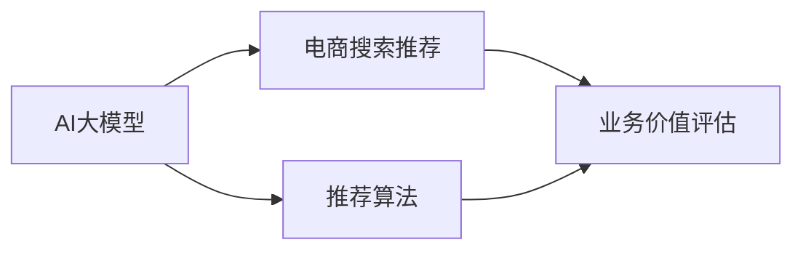

                 

# AI大模型视角下电商搜索推荐的业务价值评估方法

## 1. 背景介绍

### 1.1 问题由来

在电商领域，用户搜索是获取商品信息的主要方式。为了提升搜索的精准度和用户体验，各大电商平台纷纷引入人工智能技术，实现搜索推荐的智能化。其中，基于AI大模型的推荐系统成为最新研究热点。AI大模型以其强大的泛化能力、丰富的语义理解，能够显著提升搜索推荐的效果，带来巨大的商业价值。但与此同时，如何科学合理地评估这些推荐系统的价值，仍是一个亟待解决的问题。

### 1.2 问题核心关键点

本文聚焦于AI大模型在电商搜索推荐中的业务价值评估方法。目的是通过构建科学的评估框架，客观衡量模型对业务的贡献，指导模型优化与迭代，实现搜索推荐的持续改进。

## 2. 核心概念与联系

### 2.1 核心概念概述

为更好地理解AI大模型在电商搜索推荐中的业务价值评估方法，本节将介绍几个密切相关的核心概念：

- AI大模型：以深度学习为代表的先进计算模型，具备强大的数据处理和模式识别能力，可用于智能推荐等应用。
- 电商搜索推荐：电商平台提供给用户查询商品信息的搜索功能，以及根据用户行为数据进行个性化推荐的技术。
- 业务价值评估：通过一系列量化指标和评估方法，衡量AI技术对电商业务的实际贡献，包括用户满意度、转化率、营收等。
- 推荐系统：通过算法模型，基于用户历史行为数据和商品特征，自动推荐商品给用户，提升用户体验和平台收益的系统。

### 2.2 核心概念原理和架构的 Mermaid 流程图(Mermaid 流程节点中不要有括号、逗号等特殊字符)



这个流程图展示了AI大模型、电商搜索推荐、推荐算法和业务价值评估之间的联系：

1. AI大模型为推荐算法提供基础的知识表示和语义理解能力。
2. 推荐算法基于AI大模型的输出结果，进行个性化推荐。
3. 业务价值评估衡量推荐系统对电商业务的影响。

这些概念通过简单的依赖关系图，清晰地描述了电商搜索推荐系统从数据输入到业务影响的全流程。

## 3. 核心算法原理 & 具体操作步骤
### 3.1 算法原理概述

AI大模型在电商搜索推荐中的业务价值评估，主要通过构建量化指标和评估方法，衡量模型对电商业务的实际贡献。具体而言，可以从以下几个角度进行评估：

- 用户满意度：衡量推荐结果对用户的吸引力。可以通过用户评分、点击率等指标进行评估。
- 推荐精度：衡量推荐系统推荐的商品与用户实际购买商品的一致性。可以通过精确率、召回率等指标进行评估。
- 收益影响：衡量推荐系统的商业价值。可以通过转化率、营收增长等指标进行评估。
- 风险管理：衡量推荐系统可能带来的负面影响，如欺诈、负面信息传播等。可以通过模型可信度、用户投诉等指标进行评估。

### 3.2 算法步骤详解

基于上述评估角度，AI大模型在电商搜索推荐中的业务价值评估可以分为以下步骤：

**Step 1: 数据收集与预处理**
- 收集电商平台的搜索推荐数据，包括用户行为数据、商品信息、推荐结果等。
- 对数据进行清洗、去重、归一化等预处理，去除噪音数据，保证数据质量。

**Step 2: 特征工程**
- 提取有意义的特征，如用户兴趣、商品属性、推荐相关性等。
- 构建特征表示，将文本、图像等非结构化数据转化为模型可以处理的数值特征。

**Step 3: 模型训练与评估**
- 使用AI大模型进行训练，构建推荐算法。
- 根据不同指标设计评估方法，衡量模型对电商业务的实际影响。

**Step 4: 结果分析与优化**
- 分析评估结果，识别模型的不足之处。
- 根据评估结果，优化模型架构、调整参数设置，提升模型性能。

**Step 5: 部署与迭代**
- 将优化后的模型部署到实际应用中。
- 持续收集用户反馈和业务数据，进行模型的迭代优化。

### 3.3 算法优缺点

AI大模型在电商搜索推荐中的业务价值评估方法具有以下优点：
1. 全面量化：通过多维度指标全面评估模型性能，客观反映模型对业务的贡献。
2. 透明可控：评估过程透明，通过调整模型参数和优化算法，有效控制模型风险。
3. 动态适应：评估框架具备动态适应能力，可以根据业务需求和数据变化进行优化调整。

同时，该方法也存在以下局限性：
1. 数据依赖：评估结果依赖于数据质量，如果数据存在偏差或噪音，会影响评估的准确性。
2. 模型复杂：构建和优化AI大模型需要较高的技术门槛和计算资源，可能存在模型过拟合等问题。
3. 成本高昂：数据收集和模型训练成本较高，适用于大规模电商平台的推荐系统。
4. 隐私问题：电商推荐涉及大量用户隐私数据，数据采集和使用需要符合相关法律法规。

尽管存在这些局限性，但就目前而言，基于AI大模型的电商搜索推荐业务价值评估方法，仍是最为科学和系统的方法。

### 3.4 算法应用领域

AI大模型在电商搜索推荐中的业务价值评估方法，已经广泛应用于以下领域：

- 用户行为分析：通过用户搜索、浏览、购买等行为数据，分析用户兴趣和购买意向。
- 商品推荐优化：根据用户特征和商品属性，优化推荐算法，提高推荐效果和用户体验。
- 广告投放决策：评估广告推荐模型的效果，优化广告投放策略，提升广告转化率。
- 库存管理：预测商品需求，优化库存水平，避免缺货或过剩。
- 市场分析：分析用户搜索趋势，洞察市场变化，及时调整营销策略。

这些应用场景展示了AI大模型在电商推荐中的强大能力和广泛应用。

## 4. 数学模型和公式 & 详细讲解 & 举例说明

### 4.1 数学模型构建

为了衡量AI大模型在电商搜索推荐中的业务价值，我们定义以下指标：

- **用户满意度**：使用用户评分、点击率等指标衡量。
- **推荐精度**：使用精确率(Precision)、召回率(Recall)等指标衡量。
- **收益影响**：使用转化率、营收增长等指标衡量。
- **风险管理**：使用模型可信度、用户投诉等指标衡量。

### 4.2 公式推导过程

以精确率和召回率为例，推导推荐精度评估的数学模型：

设推荐结果中包含用户感兴趣的商品数为目标数$T$，包含推荐总数为$N$，则精确率$Precision$定义为：

$$
Precision = \frac{T}{N}
$$

召回率$Recall$定义为：

$$
Recall = \frac{T}{T_{\text{total}}}
$$

其中$T_{\text{total}}$为用户感兴趣的商品总数。精确率和召回率从不同角度评估推荐系统的效果，可以结合使用以获得更全面的评估结果。

### 4.3 案例分析与讲解

假设我们有一个电商平台，用户A在某次搜索中，从推荐系统中获取了10个推荐商品，其中5个是用户感兴趣的商品，其余5个是无关的。通过计算，精确率$Precision$为$0.5$，召回率$Recall$为$0.25$。如果我们将精确率和召回率设定为模型性能评估的上限，则可通过优化推荐算法，提升推荐系统的精度。

## 5. 项目实践：代码实例和详细解释说明

### 5.1 开发环境搭建

在进行电商搜索推荐项目实践前，需要准备好开发环境。以下是使用Python进行项目开发的流程：

1. 安装Anaconda：从官网下载并安装Anaconda，用于创建独立的Python环境。

2. 创建并激活虚拟环境：
```bash
conda create -n recommendation-env python=3.8 
conda activate recommendation-env
```

3. 安装依赖库：
```bash
pip install numpy pandas scikit-learn transformers pytorch
```

4. 安装相关工具：
```bash
pip install torchvision torchtext tqdm jupyter notebook ipython
```

5. 安装API接口：
```bash
pip install flask
```

### 5.2 源代码详细实现

以下是一个简单的电商搜索推荐系统的示例代码，使用了BERT大模型进行推荐：

```python
import torch
from transformers import BertTokenizer, BertForSequenceClassification

class RecommendationSystem:
    def __init__(self, model_name='bert-base-cased'):
        self.tokenizer = BertTokenizer.from_pretrained(model_name)
        self.model = BertForSequenceClassification.from_pretrained(model_name, num_labels=2)
        
    def encode(self, text):
        input_ids = self.tokenizer.encode(text, max_length=128, padding='max_length', truncation=True)
        return input_ids
    
    def predict(self, input_ids):
        input_ids = torch.tensor([input_ids])
        with torch.no_grad():
            logits = self.model(input_ids).squeeze(0).tolist()
        return logits
    
    def evaluate(self, text, target):
        input_ids = self.encode(text)
        logits = self.predict(input_ids)
        return logits[0] > target

# 使用示例
recommender = RecommendationSystem()
text = "我想买一台电脑"
target = True
result = recommender.evaluate(text, target)
print(result)
```

该代码实现了基于BERT模型的电商搜索推荐系统。具体实现步骤如下：

1. 初始化BERT模型和分词器。
2. 定义`encode`函数，将文本分词并转化为模型可以处理的输入。
3. 定义`predict`函数，使用BERT模型进行预测，返回预测概率。
4. 定义`evaluate`函数，根据目标标签和预测概率，评估推荐结果。
5. 使用示例代码，评估"我想买一台电脑"的推荐结果。

### 5.3 代码解读与分析

该代码实现的核心是`RecommendationSystem`类，包含以下关键组件：

- `BertTokenizer`：BERT模型的分词器，用于将文本转化为模型可以处理的数值形式。
- `BertForSequenceClassification`：BERT模型的分类器，用于进行二分类预测。
- `encode`函数：将文本转化为输入，方便模型处理。
- `predict`函数：使用BERT模型进行预测，返回预测概率。
- `evaluate`函数：根据目标标签和预测概率，评估推荐结果。

使用示例代码展示了如何创建一个`RecommendationSystem`对象，输入文本进行编码，使用模型进行预测，并根据预测结果评估推荐质量。

## 6. 实际应用场景

### 6.1 智能客服系统

在智能客服场景中，AI大模型可以通过分析用户历史行为和搜索记录，推荐相关产品和服务，提升客服体验。例如，电商平台可以根据用户浏览过的商品，推荐相似商品，减少客户搜索时间。

### 6.2 个性化推荐系统

个性化推荐系统可以根据用户历史购买记录和搜索记录，推荐相似商品，提高用户满意度。例如，电商平台可以根据用户浏览历史，推荐相似商品，增加用户购买率。

### 6.3 广告投放优化

在广告投放场景中，AI大模型可以通过分析用户历史行为和搜索记录，推荐广告内容，提升广告效果。例如，电商平台可以根据用户兴趣和搜索记录，推荐相关广告，增加广告转化率。

### 6.4 未来应用展望

随着AI大模型的不断发展，电商搜索推荐系统将在更多领域得到应用，为电商业务带来更大的价值：

- 用户行为预测：通过分析用户历史行为，预测用户未来行为，实现预购推荐。
- 新商品推荐：通过分析用户历史行为，推荐平台上的新商品，提升新商品销量。
- 跨平台推荐：通过分析用户在多个平台的搜索行为，实现跨平台商品推荐，提高平台之间的互惠互利。
- 实时推荐：通过实时分析用户行为，实现即时推荐，提升用户满意度。
- 多模态推荐：通过融合视觉、语音、文本等多种模态数据，实现更全面、更精准的推荐。

## 7. 工具和资源推荐

### 7.1 学习资源推荐

为了帮助开发者系统掌握AI大模型在电商搜索推荐中的业务价值评估方法，这里推荐一些优质的学习资源：

1. 《深度学习》系列博文：深度学习领域经典的入门教程，涵盖深度学习的基础理论和实践技巧。
2. 《机器学习》课程：由斯坦福大学开设的机器学习经典课程，提供从基础到进阶的全面学习内容。
3. 《自然语言处理与深度学习》书籍：自然语言处理领域权威书籍，涵盖NLP的深度学习理论和实践。
4. 《深度学习入门》书籍：适合初学者的深度学习入门书籍，涵盖深度学习的基本概念和实战案例。
5. HuggingFace官方文档：Transformer库的官方文档，提供了大量预训练模型和微调样例代码，是学习的重要资源。

### 7.2 开发工具推荐

高效的开发离不开优秀的工具支持。以下是几款用于AI大模型电商搜索推荐开发的常用工具：

1. PyTorch：基于Python的开源深度学习框架，灵活动态的计算图，适合快速迭代研究。
2. TensorFlow：由Google主导开发的开源深度学习框架，生产部署方便，适合大规模工程应用。
3. Transformers库：HuggingFace开发的NLP工具库，集成了众多SOTA语言模型，支持PyTorch和TensorFlow，是微调任务开发的利器。
4. Weights & Biases：模型训练的实验跟踪工具，可以记录和可视化模型训练过程中的各项指标，方便对比和调优。
5. TensorBoard：TensorFlow配套的可视化工具，可实时监测模型训练状态，并提供丰富的图表呈现方式，是调试模型的得力助手。

### 7.3 相关论文推荐

AI大模型在电商搜索推荐中的应用，源于学界的持续研究。以下是几篇奠基性的相关论文，推荐阅读：

1. Attention is All You Need：Transformer结构的经典论文，奠定了预训练大模型的基础。
2. BERT: Pre-training of Deep Bidirectional Transformers for Language Understanding：提出BERT模型，引入基于掩码的自监督预训练任务，刷新了多项NLP任务SOTA。
3. Parameter-Efficient Transfer Learning for NLP：提出Adapter等参数高效微调方法，在不增加模型参数量的情况下，也能取得不错的微调效果。
4. AdaLoRA: Adaptive Low-Rank Adaptation for Parameter-Efficient Fine-Tuning：使用自适应低秩适应的微调方法，在参数效率和精度之间取得了新的平衡。
5. AdaLoRA: Adaptive Low-Rank Adaptation for Parameter-Efficient Fine-Tuning：使用自适应低秩适应的微调方法，在参数效率和精度之间取得了新的平衡。

这些论文代表了大模型在电商搜索推荐中的应用方向，通过学习这些前沿成果，可以帮助研究者把握学科前进方向，激发更多的创新灵感。

## 8. 总结：未来发展趋势与挑战

### 8.1 总结

本文对AI大模型在电商搜索推荐中的业务价值评估方法进行了全面系统的介绍。首先阐述了AI大模型在电商搜索推荐中的研究背景和意义，明确了业务价值评估在模型优化与迭代中的重要性。其次，从原理到实践，详细讲解了业务价值评估的数学模型和实现步骤，给出了电商搜索推荐系统的代码示例。同时，本文还探讨了AI大模型在电商搜索推荐中的多场景应用，展示了其广泛的适用性和巨大的商业潜力。

通过本文的系统梳理，可以看到，AI大模型在电商搜索推荐中的业务价值评估方法，不仅有助于衡量模型的实际影响，还能指导模型优化和迭代，提升电商平台的搜索推荐体验。AI大模型的引入，显著提升了电商平台的业务价值，为电商企业带来了新的增长点。未来，伴随AI大模型的不断发展，电商搜索推荐系统将在更多领域得到应用，为电商业务带来更大的价值。

### 8.2 未来发展趋势

展望未来，AI大模型在电商搜索推荐中的业务价值评估方法将呈现以下几个发展趋势：

1. 数据驱动：更多地依赖用户行为数据，通过分析用户历史行为，预测未来需求，实现精准推荐。
2. 多模态融合：融合视觉、语音、文本等多种模态数据，提升推荐系统的效果和适应性。
3. 实时响应：通过实时分析用户行为，实现即时推荐，提高用户满意度。
4. 模型集成：融合多种推荐算法，实现多模型融合，提升推荐效果和系统稳定性。
5. 人机协同：结合人工干预和自动化推荐，提升推荐系统的可靠性和用户信任度。

这些趋势展示了AI大模型在电商搜索推荐中的巨大潜力和发展方向，必将进一步推动电商推荐系统的优化和提升。

### 8.3 面临的挑战

尽管AI大模型在电商搜索推荐中已经取得了显著成效，但在迈向更加智能化、普适化应用的过程中，仍面临诸多挑战：

1. 数据质量问题：电商推荐涉及大量用户数据，数据质量问题会影响模型效果，需解决数据偏差、噪音等问题。
2. 模型泛化能力：模型在跨领域、跨数据集上的泛化能力不足，需提升模型的泛化性和稳定性。
3. 隐私保护问题：电商推荐涉及大量用户隐私数据，需保护用户隐私，符合法律法规。
4. 计算资源消耗：大规模模型的训练和推理需要大量的计算资源，需降低计算成本，提高效率。
5. 用户交互问题：模型推荐的商品是否符合用户期望，需提升用户对推荐结果的满意度。

这些挑战需要通过技术创新和算法优化，逐步克服，才能实现AI大模型在电商搜索推荐中的广泛应用。

### 8.4 研究展望

未来，AI大模型在电商搜索推荐中的研究方向主要集中在以下几个方面：

1. 强化学习：结合强化学习思想，提升模型的自适应能力和决策能力。
2. 迁移学习：将模型在特定领域的表现迁移到其他领域，实现更广泛的业务应用。
3. 多目标优化：结合用户满意度、收益影响等目标，进行多目标优化，提升整体业务效果。
4. 多任务学习：结合多个推荐任务，提升模型的整体性能和泛化能力。
5. 模型可解释性：提升模型的可解释性，增强用户对推荐结果的理解和信任。

这些研究方向将为AI大模型在电商搜索推荐中的应用带来新的突破，推动电商推荐系统的不断优化和提升。

## 9. 附录：常见问题与解答

**Q1: 电商搜索推荐中的AI大模型是如何进行业务价值评估的？**

A: 电商搜索推荐中的AI大模型，主要通过构建多个量化指标和评估方法，衡量模型对电商业务的实际贡献。例如，使用用户评分、点击率等指标评估用户满意度；使用精确率、召回率等指标评估推荐精度；使用转化率、营收增长等指标评估收益影响；使用模型可信度、用户投诉等指标评估风险管理。

**Q2: 电商搜索推荐中的AI大模型有哪些应用场景？**

A: 电商搜索推荐中的AI大模型，可以在智能客服、个性化推荐、广告投放优化等多个场景中发挥作用。例如，智能客服系统可以通过分析用户历史行为和搜索记录，推荐相关产品和服务；个性化推荐系统可以根据用户历史购买记录和搜索记录，推荐相似商品；广告投放优化可以通过分析用户历史行为和搜索记录，推荐广告内容，提高广告转化率。

**Q3: 电商搜索推荐中的AI大模型需要哪些数据？**

A: 电商搜索推荐中的AI大模型，需要收集和分析用户历史行为数据、商品信息、推荐结果等数据。这些数据可以帮助模型理解用户需求和商品特征，进行精准推荐。

**Q4: 电商搜索推荐中的AI大模型有哪些挑战？**

A: 电商搜索推荐中的AI大模型，面临数据质量、模型泛化能力、隐私保护、计算资源消耗、用户交互等多个挑战。需解决数据偏差、噪音、用户隐私、计算成本等问题，才能实现广泛应用。

**Q5: 电商搜索推荐中的AI大模型如何进行优化？**

A: 电商搜索推荐中的AI大模型，可以通过多维度指标评估，识别模型的不足之处，优化模型架构和参数设置，提升模型性能。例如，使用数据增强、正则化、对抗训练等技术，提升模型泛化能力；使用参数高效微调、对抗训练等技术，提升模型效率；使用多任务学习、多目标优化等技术，提升模型效果。

**Q6: 电商搜索推荐中的AI大模型如何保障用户隐私？**

A: 电商搜索推荐中的AI大模型，需严格遵守数据隐私保护法律法规，如GDPR、CCPA等。需采用数据脱敏、访问控制等技术，保障用户隐私安全。同时，需透明告知用户数据使用情况，获得用户同意。

**Q7: 电商搜索推荐中的AI大模型如何进行迭代优化？**

A: 电商搜索推荐中的AI大模型，需持续收集用户反馈和业务数据，进行迭代优化。可以通过A/B测试、用户调研等方法，评估推荐效果，进行模型优化。同时，需及时更新数据和模型，适应市场变化。

**Q8: 电商搜索推荐中的AI大模型如何提升用户满意度？**

A: 电商搜索推荐中的AI大模型，需提升推荐的精准性和个性化程度，以提高用户满意度。可以通过分析用户历史行为和搜索记录，推荐用户感兴趣的商品；通过多维度评估，优化推荐算法；通过用户反馈，不断改进推荐模型。

**Q9: 电商搜索推荐中的AI大模型如何提升广告转化率？**

A: 电商搜索推荐中的AI大模型，需分析用户历史行为和搜索记录，推荐相关广告内容。可以通过精确率、召回率等指标，评估广告推荐效果，优化广告投放策略。同时，需结合用户行为数据，进行动态广告投放。

---

作者：禅与计算机程序设计艺术 / Zen and the Art of Computer Programming

