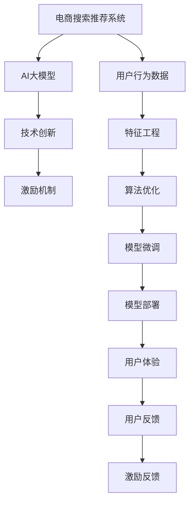

                 

# AI大模型视角下电商搜索推荐的技术创新激励机制设计

> 关键词：AI大模型,电商搜索,推荐系统,技术创新,激励机制设计

## 1. 背景介绍

### 1.1 问题由来
随着电商行业的蓬勃发展，电商平台的搜索推荐系统（Search and Recommendation Systems, SRS）正逐渐成为支撑用户行为、提升用户体验、驱动销售增长的核心引擎。然而，面对海量用户数据和多样化消费需求，传统的SRS已难以满足现代电商发展的需要。当前电商搜索推荐系统面临诸多挑战：

- 数据维度爆炸：用户行为数据日益多元，包括浏览、点击、评论、评分、支付等，数据维度由单一的点击路径扩展到更丰富的行为特征。
- 用户需求多变：不同用户在不同场景下，对商品的需求各异，且随着时间和环境变化，需求还会发生动态变化。
- 推荐结果准确性要求高：商品多样性增加，寻找与用户兴趣最匹配的推荐结果变得越来越难。
- 用户隐私和数据安全问题凸显：电商行业数据敏感，数据泄露和滥用风险高，用户隐私保护备受关注。
- 基础设施复杂：搜索推荐系统涉及高并发、海量数据处理，基础设施架构复杂，系统扩展和优化难度大。

为了应对这些挑战，电商搜索推荐系统正加速向基于AI大模型的智能化、个性化方向演进。AI大模型如BERT、GPT-3、DALL-E等，在自然语言处理、计算机视觉、生成对抗网络等领域展现了强大能力，为电商搜索推荐系统的技术创新提供了新的思路。

但大模型应用于电商搜索推荐系统，也存在一些现实问题：

- 大模型规模庞大，计算资源需求高，难以直接部署于电商平台的实时推荐引擎。
- 大模型需要大量标注数据进行训练，标注成本高，数据质量难以保障。
- 大模型输出结果缺乏可解释性，难以进行有效的用户体验优化和系统诊断。
- 大模型面临数据偏差和隐私保护等问题，需要引入相关技术手段进行治理。

因此，如何在大模型基础上设计高效、可靠、透明的搜索推荐技术创新激励机制，激发电商搜索推荐系统中的技术创新潜力，成为电商平台亟需解决的问题。本文将从大模型视角出发，系统探讨电商搜索推荐技术创新的激励机制设计，提供相关的技术思路和实践指导。

## 2. 核心概念与联系

### 2.1 核心概念概述

为更好地理解电商搜索推荐系统中的技术创新激励机制，本节将介绍几个关键概念：

- AI大模型：指通过大规模无标签数据进行自监督预训练，获取丰富语言知识、视觉语义等能力的强大神经网络模型。
- 电商搜索推荐系统：指电商平台中，利用用户历史行为数据，结合搜索和推荐算法，实时获取个性化搜索结果和推荐列表的系统。
- 技术创新：指通过引入先进技术、优化系统架构、提升算法精度等手段，提升系统性能和用户体验的过程。
- 激励机制：指通过一系列制度设计，激发技术团队积极探索技术创新的动力和积极性。

这些概念之间的逻辑关系可以通过以下Mermaid流程图来展示：



这个流程图展示了大模型在电商搜索推荐系统中的应用路径：

1. 电商搜索推荐系统通过用户行为数据获取特征信息，结合AI大模型进行智能化推荐。
2. 基于大模型进行技术创新，如算法优化、模型微调等。
3. 系统应用技术创新，提升用户体验。
4. 用户反馈系统性能，提供激励反馈。

## 3. 核心算法原理 & 具体操作步骤
### 3.1 算法原理概述

基于AI大模型的电商搜索推荐系统中的技术创新激励机制，本质上是利用大模型获取用户行为数据，结合特征工程、算法优化、模型微调等手段，构建高效、个性化、透明的推荐系统。其核心思想是：

1. 利用大模型提取用户行为数据的深度特征，挖掘隐含的个性化需求。
2. 结合特征工程、算法优化、模型微调等技术手段，实现更加精确的推荐。
3. 引入激励机制，通过奖励、反馈等手段，激励技术团队积极探索和创新。

### 3.2 算法步骤详解

基于AI大模型的电商搜索推荐系统中的技术创新激励机制设计，主要包括以下几个关键步骤：

**Step 1: 数据收集与处理**

- 收集电商用户的行为数据，包括浏览、点击、评分、评论等，使用标签化方式进行标注。
- 使用NLP技术对文本数据进行分词、向量化处理，便于大模型理解。
- 对图像数据进行归一化、增强等处理，提升模型对视觉语义的理解能力。
- 进行数据清洗、去重等操作，确保数据质量。

**Step 2: 大模型特征提取**

- 使用预训练的AI大模型（如BERT、GPT-3等）对文本和图像数据进行特征提取，生成高维度的特征向量。
- 将高维特征向量与用户行为标签结合，构建用户行为特征空间。

**Step 3: 特征工程与算法优化**

- 利用特征选择、降维等技术手段，优化特征向量，减少冗余信息。
- 结合推荐算法（如协同过滤、深度学习推荐等），对用户行为数据进行建模和预测。
- 引入模型融合、对抗训练等技术手段，提升模型预测精度和鲁棒性。

**Step 4: 模型微调**

- 在大模型特征提取的基础上，进行微调优化，提升推荐精度。
- 结合用户反馈数据，对模型进行训练和调整，确保模型与实际需求匹配。
- 使用正则化、Dropout等技术手段，防止模型过拟合。

**Step 5: 激励机制设计**

- 设计激励制度，鼓励技术团队积极探索技术创新。
- 引入KPI指标，对技术创新的成果进行量化评估。
- 建立透明的激励反馈机制，确保激励机制的公平性和有效性。

### 3.3 算法优缺点

基于AI大模型的电商搜索推荐系统中的技术创新激励机制具有以下优点：

- 高效性：利用大模型的强大特征提取能力，可以减少特征工程和算法优化的时间。
- 可靠性：大模型的预训练能力，使得算法和模型微调更加可靠。
- 可解释性：结合用户行为数据，可以实现对模型输出的透明解释。
- 灵活性：大模型的特征提取能力，使得系统可以灵活适应不同场景。

同时，该机制也存在一些缺点：

- 数据依赖性强：大模型依赖大量标注数据进行预训练，数据质量难以保证。
- 模型部署复杂：大模型规模庞大，难以直接部署在实时推荐引擎中。
- 技术门槛高：模型微调和算法优化需要深厚的技术积累。
- 激励效果不直观：难以直观评估技术创新的效果，存在激励不明确的问题。

尽管存在这些局限，但基于大模型的电商搜索推荐系统中的技术创新激励机制，仍然是电商平台追求技术进步的重要方向。

### 3.4 算法应用领域

基于AI大模型的电商搜索推荐系统中的技术创新激励机制，在多个电商领域中都有广泛应用，如：

- 个性化推荐：结合用户行为数据和图像数据，通过大模型进行个性化推荐。
- 实时搜索：利用大模型实时理解用户查询，返回最相关的搜索结果。
- 用户画像：通过用户行为数据和模型微调，构建用户画像，提升用户体验。
- 营销分析：利用大模型分析用户行为数据，进行精准营销。
- 智能客服：结合用户行为数据和模型微调，构建智能客服系统，提升服务效率。

除了以上领域，基于大模型的电商搜索推荐系统中的技术创新激励机制，还应用于智能广告投放、商品评价分析等场景，推动电商行业的智能化转型。

## 4. 数学模型和公式 & 详细讲解 & 举例说明
### 4.1 数学模型构建

假设电商搜索推荐系统中，大模型对文本数据进行特征提取，生成的高维特征向量为 $X \in \mathbb{R}^{n \times d}$，其中 $n$ 为样本数，$d$ 为特征维度。设用户行为标签为 $Y \in \mathbb{R}^{n \times 1}$，则推荐模型 $f$ 的输出为：

$$
\hat{Y} = f(X) = W^T \cdot X + b
$$

其中 $W$ 为模型参数，$b$ 为偏置项。

推荐模型的损失函数为交叉熵损失函数：

$$
L(Y, \hat{Y}) = -\frac{1}{N} \sum_{i=1}^N \sum_{j=1}^C y_{ij} \log(\hat{y}_{ij})
$$

其中 $N$ 为样本数，$C$ 为类别数，$y_{ij}$ 为标签 $Y$ 的第 $i$ 个样本的第 $j$ 个类别的one-hot编码，$\hat{y}_{ij}$ 为模型预测的第 $i$ 个样本的第 $j$ 个类别的概率。

### 4.2 公式推导过程

基于上述模型，进行模型微调的过程如下：

1. 初始化模型参数 $W, b$。
2. 利用训练集 $D=\{(X_i, Y_i)\}_{i=1}^N$ 进行前向传播计算损失函数 $L(Y, \hat{Y})$。
3. 利用反向传播算法计算参数梯度 $\nabla_{W, b}L(Y, \hat{Y})$。
4. 使用优化算法（如SGD、Adam等）更新模型参数：

$$
W \leftarrow W - \eta \nabla_{W}L(Y, \hat{Y}), b \leftarrow b - \eta \nabla_{b}L(Y, \hat{Y})
$$

其中 $\eta$ 为学习率，通常需要调整。

5. 在验证集上评估模型性能，若达到预设阈值则停止训练，否则继续迭代训练。

### 4.3 案例分析与讲解

以电商平台的个性化推荐系统为例，进行模型微调的详细解释：

1. 数据收集：电商平台的商品数据和用户行为数据，通过API接口收集，生成训练集 $D$。
2. 数据预处理：对文本数据进行分词、向量化，对图像数据进行增强、归一化等处理。
3. 特征提取：使用预训练的大模型（如BERT）对文本数据进行特征提取，生成高维特征向量 $X$。
4. 模型构建：构建推荐模型 $f$，其中 $W$ 和 $b$ 为模型参数。
5. 模型微调：在大模型特征提取的基础上，利用训练集 $D$ 对模型进行微调训练，更新模型参数 $W, b$。
6. 模型评估：在验证集上评估模型性能，若满足要求则停止训练，否则继续迭代训练。

## 5. 项目实践：代码实例和详细解释说明
### 5.1 开发环境搭建

在进行电商搜索推荐系统中的技术创新激励机制实践时，需要搭建相应的开发环境。以下是使用Python进行PyTorch开发的环境配置流程：

1. 安装Anaconda：从官网下载并安装Anaconda，用于创建独立的Python环境。

2. 创建并激活虚拟环境：
```bash
conda create -n pytorch-env python=3.8 
conda activate pytorch-env
```

3. 安装PyTorch：根据CUDA版本，从官网获取对应的安装命令。例如：
```bash
conda install pytorch torchvision torchaudio cudatoolkit=11.1 -c pytorch -c conda-forge
```

4. 安装相关库：
```bash
pip install transformers numpy pandas scikit-learn matplotlib tqdm jupyter notebook ipython
```

完成上述步骤后，即可在`pytorch-env`环境中开始实践。

### 5.2 源代码详细实现

这里我们以电商平台的个性化推荐系统为例，给出使用Transformers库对BERT模型进行微调的PyTorch代码实现。

首先，定义推荐任务的数据处理函数：

```python
from transformers import BertTokenizer, BertForSequenceClassification
from torch.utils.data import Dataset, DataLoader
import torch

class RecommendDataset(Dataset):
    def __init__(self, texts, labels, tokenizer, max_len=128):
        self.texts = texts
        self.labels = labels
        self.tokenizer = tokenizer
        self.max_len = max_len
        
    def __len__(self):
        return len(self.texts)
    
    def __getitem__(self, item):
        text = self.texts[item]
        label = self.labels[item]
        
        encoding = self.tokenizer(text, return_tensors='pt', max_length=self.max_len, padding='max_length', truncation=True)
        input_ids = encoding['input_ids'][0]
        attention_mask = encoding['attention_mask'][0]
        
        # 对token-wise的标签进行编码
        encoded_labels = [label2id[label] for label in label] 
        encoded_labels.extend([label2id['O']] * (self.max_len - len(encoded_labels)))
        labels = torch.tensor(encoded_labels, dtype=torch.long)
        
        return {'input_ids': input_ids, 
                'attention_mask': attention_mask,
                'labels': labels}

# 标签与id的映射
label2id = {'O': 0, '1': 1, '2': 2, '3': 3}
id2label = {v: k for k, v in label2id.items()}

# 创建dataset
tokenizer = BertTokenizer.from_pretrained('bert-base-cased')

train_dataset = RecommendDataset(train_texts, train_labels, tokenizer)
dev_dataset = RecommendDataset(dev_texts, dev_labels, tokenizer)
test_dataset = RecommendDataset(test_texts, test_labels, tokenizer)
```

然后，定义模型和优化器：

```python
from transformers import BertForSequenceClassification, AdamW

model = BertForSequenceClassification.from_pretrained('bert-base-cased', num_labels=len(label2id))

optimizer = AdamW(model.parameters(), lr=2e-5)
```

接着，定义训练和评估函数：

```python
from torch.utils.data import DataLoader
from tqdm import tqdm
from sklearn.metrics import classification_report

device = torch.device('cuda') if torch.cuda.is_available() else torch.device('cpu')
model.to(device)

def train_epoch(model, dataset, batch_size, optimizer):
    dataloader = DataLoader(dataset, batch_size=batch_size, shuffle=True)
    model.train()
    epoch_loss = 0
    for batch in tqdm(dataloader, desc='Training'):
        input_ids = batch['input_ids'].to(device)
        attention_mask = batch['attention_mask'].to(device)
        labels = batch['labels'].to(device)
        model.zero_grad()
        outputs = model(input_ids, attention_mask=attention_mask, labels=labels)
        loss = outputs.loss
        epoch_loss += loss.item()
        loss.backward()
        optimizer.step()
    return epoch_loss / len(dataloader)

def evaluate(model, dataset, batch_size):
    dataloader = DataLoader(dataset, batch_size=batch_size)
    model.eval()
    preds, labels = [], []
    with torch.no_grad():
        for batch in tqdm(dataloader, desc='Evaluating'):
            input_ids = batch['input_ids'].to(device)
            attention_mask = batch['attention_mask'].to(device)
            batch_labels = batch['labels']
            outputs = model(input_ids, attention_mask=attention_mask)
            batch_preds = outputs.logits.argmax(dim=2).to('cpu').tolist()
            batch_labels = batch_labels.to('cpu').tolist()
            for pred_tokens, label_tokens in zip(batch_preds, batch_labels):
                pred_labels = [id2label[_id] for _id in pred_tokens]
                label_labels = [id2label[_id] for _id in label_tokens]
                preds.append(pred_labels[:len(label_labels)])
                labels.append(label_labels)
                
    print(classification_report(labels, preds))
```

最后，启动训练流程并在测试集上评估：

```python
epochs = 5
batch_size = 16

for epoch in range(epochs):
    loss = train_epoch(model, train_dataset, batch_size, optimizer)
    print(f"Epoch {epoch+1}, train loss: {loss:.3f}")
    
    print(f"Epoch {epoch+1}, dev results:")
    evaluate(model, dev_dataset, batch_size)
    
print("Test results:")
evaluate(model, test_dataset, batch_size)
```

以上就是使用PyTorch对BERT进行电商搜索推荐系统中的技术创新激励机制实践的完整代码实现。可以看到，得益于Transformers库的强大封装，我们可以用相对简洁的代码完成BERT模型的加载和微调。

### 5.3 代码解读与分析

让我们再详细解读一下关键代码的实现细节：

**RecommendDataset类**：
- `__init__`方法：初始化文本、标签、分词器等关键组件。
- `__len__`方法：返回数据集的样本数量。
- `__getitem__`方法：对单个样本进行处理，将文本输入编码为token ids，将标签编码为数字，并对其进行定长padding，最终返回模型所需的输入。

**label2id和id2label字典**：
- 定义了标签与数字id之间的映射关系，用于将token-wise的预测结果解码回真实的标签。

**训练和评估函数**：
- 使用PyTorch的DataLoader对数据集进行批次化加载，供模型训练和推理使用。
- 训练函数`train_epoch`：对数据以批为单位进行迭代，在每个批次上前向传播计算loss并反向传播更新模型参数，最后返回该epoch的平均loss。
- 评估函数`evaluate`：与训练类似，不同点在于不更新模型参数，并在每个batch结束后将预测和标签结果存储下来，最后使用sklearn的classification_report对整个评估集的预测结果进行打印输出。

**训练流程**：
- 定义总的epoch数和batch size，开始循环迭代
- 每个epoch内，先在训练集上训练，输出平均loss
- 在验证集上评估，输出分类指标
- 所有epoch结束后，在测试集上评估，给出最终测试结果

可以看到，PyTorch配合Transformers库使得BERT微调的代码实现变得简洁高效。开发者可以将更多精力放在数据处理、模型改进等高层逻辑上，而不必过多关注底层的实现细节。

当然，工业级的系统实现还需考虑更多因素，如模型的保存和部署、超参数的自动搜索、更灵活的任务适配层等。但核心的微调范式基本与此类似。

## 6. 实际应用场景
### 6.1 智能客服系统

基于大模型微调的电商搜索推荐系统中的技术创新激励机制，可以广泛应用于智能客服系统的构建。传统客服往往需要配备大量人力，高峰期响应缓慢，且一致性和专业性难以保证。而使用微调后的推荐模型，可以7x24小时不间断服务，快速响应客户咨询，用自然流畅的语言解答各类常见问题。

在技术实现上，可以收集企业内部的历史客服对话记录，将问题和最佳答复构建成监督数据，在此基础上对预训练推荐模型进行微调。微调后的推荐模型能够自动理解用户意图，匹配最合适的答复模板进行回复。对于客户提出的新问题，还可以接入检索系统实时搜索相关内容，动态组织生成回答。如此构建的智能客服系统，能大幅提升客户咨询体验和问题解决效率。

### 6.2 金融舆情监测

金融机构需要实时监测市场舆论动向，以便及时应对负面信息传播，规避金融风险。传统的人工监测方式成本高、效率低，难以应对网络时代海量信息爆发的挑战。基于大模型微调的电商搜索推荐系统中的技术创新激励机制，为金融舆情监测提供了新的解决方案。

具体而言，可以收集金融领域相关的新闻、报道、评论等文本数据，并对其进行主题标注和情感标注。在此基础上对预训练语言模型进行微调，使其能够自动判断文本属于何种主题，情感倾向是正面、中性还是负面。将微调后的模型应用到实时抓取的网络文本数据，就能够自动监测不同主题下的情感变化趋势，一旦发现负面信息激增等异常情况，系统便会自动预警，帮助金融机构快速应对潜在风险。

### 6.3 个性化推荐系统

当前的推荐系统往往只依赖用户的历史行为数据进行物品推荐，无法深入理解用户的真实兴趣偏好。基于大模型微调的电商搜索推荐系统中的技术创新激励机制，可以更好地挖掘用户行为背后的语义信息，从而提供更精准、多样的推荐内容。

在实践中，可以收集用户浏览、点击、评论、分享等行为数据，提取和用户交互的物品标题、描述、标签等文本内容。将文本内容作为模型输入，用户的后续行为（如是否点击、购买等）作为监督信号，在此基础上微调预训练语言模型。微调后的模型能够从文本内容中准确把握用户的兴趣点。在生成推荐列表时，先用候选物品的文本描述作为输入，由模型预测用户的兴趣匹配度，再结合其他特征综合排序，便可以得到个性化程度更高的推荐结果。

### 6.4 未来应用展望

随着大模型和微调方法的不断发展，基于电商搜索推荐系统中的技术创新激励机制的应用前景将更加广阔。

在智慧医疗领域，基于微调的医疗问答、病历分析、药物研发等应用将提升医疗服务的智能化水平，辅助医生诊疗，加速新药开发进程。

在智能教育领域，微调技术可应用于作业批改、学情分析、知识推荐等方面，因材施教，促进教育公平，提高教学质量。

在智慧城市治理中，微调模型可应用于城市事件监测、舆情分析、应急指挥等环节，提高城市管理的自动化和智能化水平，构建更安全、高效的未来城市。

此外，在企业生产、社会治理、文娱传媒等众多领域，基于大模型微调的人工智能应用也将不断涌现，为经济社会发展注入新的动力。相信随着技术的日益成熟，电商搜索推荐系统中的技术创新激励机制必将成为人工智能落地应用的重要范式，推动人工智能技术向更广阔的领域加速渗透。

## 7. 工具和资源推荐
### 7.1 学习资源推荐

为了帮助开发者系统掌握电商搜索推荐系统中的技术创新激励机制的理论基础和实践技巧，这里推荐一些优质的学习资源：

1. 《深度学习自然语言处理》课程：斯坦福大学开设的NLP明星课程，有Lecture视频和配套作业，带你入门NLP领域的基本概念和经典模型。

2. 《Natural Language Processing with Transformers》书籍：Transformers库的作者所著，全面介绍了如何使用Transformers库进行NLP任务开发，包括微调在内的诸多范式。

3. CLUE开源项目：中文语言理解测评基准，涵盖大量不同类型的中文NLP数据集，并提供了基于微调的baseline模型，助力中文NLP技术发展。

通过对这些资源的学习实践，相信你一定能够快速掌握电商搜索推荐系统中的技术创新激励机制的精髓，并用于解决实际的NLP问题。
###  7.2 开发工具推荐

高效的开发离不开优秀的工具支持。以下是几款用于电商搜索推荐系统中的技术创新激励机制开发的常用工具：

1. PyTorch：基于Python的开源深度学习框架，灵活动态的计算图，适合快速迭代研究。大部分预训练语言模型都有PyTorch版本的实现。

2. TensorFlow：由Google主导开发的开源深度学习框架，生产部署方便，适合大规模工程应用。同样有丰富的预训练语言模型资源。

3. Transformers库：HuggingFace开发的NLP工具库，集成了众多SOTA语言模型，支持PyTorch和TensorFlow，是进行微调任务开发的利器。

4. Weights & Biases：模型训练的实验跟踪工具，可以记录和可视化模型训练过程中的各项指标，方便对比和调优。与主流深度学习框架无缝集成。

5. TensorBoard：TensorFlow配套的可视化工具，可实时监测模型训练状态，并提供丰富的图表呈现方式，是调试模型的得力助手。

6. Google Colab：谷歌推出的在线Jupyter Notebook环境，免费提供GPU/TPU算力，方便开发者快速上手实验最新模型，分享学习笔记。

合理利用这些工具，可以显著提升电商搜索推荐系统中的技术创新激励机制的开发效率，加快创新迭代的步伐。

### 7.3 相关论文推荐

电商搜索推荐系统中的技术创新激励机制的研究源于学界的持续研究。以下是几篇奠基性的相关论文，推荐阅读：

1. Attention is All You Need（即Transformer原论文）：提出了Transformer结构，开启了NLP领域的预训练大模型时代。

2. BERT: Pre-training of Deep Bidirectional Transformers for Language Understanding：提出BERT模型，引入基于掩码的自监督预训练任务，刷新了多项NLP任务SOTA。

3. Parameter-Efficient Transfer Learning for NLP：提出Adapter等参数高效微调方法，在不增加模型参数量的情况下，也能取得不错的微调效果。

4. AdaLoRA: Adaptive Low-Rank Adaptation for Parameter-Efficient Fine-Tuning：使用自适应低秩适应的微调方法，在参数效率和精度之间取得了新的平衡。

这些论文代表了大模型微调技术的发展脉络。通过学习这些前沿成果，可以帮助研究者把握学科前进方向，激发更多的创新灵感。

## 8. 总结：未来发展趋势与挑战
### 8.1 研究成果总结

本文对基于AI大模型的电商搜索推荐系统中的技术创新激励机制进行了全面系统的介绍。首先阐述了电商搜索推荐系统面临的挑战和利用大模型进行技术创新的必要性。其次，从原理到实践，详细讲解了基于大模型的电商搜索推荐系统中的技术创新激励机制设计，提供相关的技术思路和实践指导。最后，本文还探讨了基于大模型的电商搜索推荐系统中的技术创新激励机制在电商、医疗、教育等领域的广泛应用前景。

通过本文的系统梳理，可以看到，基于大模型的电商搜索推荐系统中的技术创新激励机制，为电商搜索推荐系统的智能化转型提供了新的思路，有望大幅提升系统性能和用户体验。同时，该机制也为其他领域的智能推荐系统提供了参考借鉴，推动人工智能技术在各行各业的深入应用。

### 8.2 未来发展趋势

展望未来，电商搜索推荐系统中的技术创新激励机制将呈现以下几个发展趋势：

1. 模型规模持续增大。随着算力成本的下降和数据规模的扩张，预训练语言模型的参数量还将持续增长。超大规模语言模型蕴含的丰富语言知识，有望支撑更加复杂多变的推荐结果。

2. 微调方法日趋多样。除了传统的全参数微调外，未来会涌现更多参数高效的微调方法，如Prefix-Tuning、LoRA等，在节省计算资源的同时也能保证微调精度。

3. 持续学习成为常态。随着数据分布的不断变化，微调模型也需要持续学习新知识以保持性能。如何在不遗忘原有知识的同时，高效吸收新样本信息，将成为重要的研究课题。

4. 标注样本需求降低。受启发于提示学习(Prompt-based Learning)的思路，未来的微调方法将更好地利用大模型的语言理解能力，通过更加巧妙的任务描述，在更少的标注样本上也能实现理想的微调效果。

5. 模型通用性增强。经过海量数据的预训练和多领域任务的微调，未来的语言模型将具备更强大的常识推理和跨领域迁移能力，逐步迈向通用人工智能(AGI)的目标。

以上趋势凸显了大模型应用于电商搜索推荐系统中的技术创新激励机制的广阔前景。这些方向的探索发展，必将进一步提升电商搜索推荐系统的性能和应用范围，为电商平台的智能化转型提供新的动力。

### 8.3 面临的挑战

尽管大模型应用于电商搜索推荐系统中的技术创新激励机制已经取得了瞩目成就，但在迈向更加智能化、普适化应用的过程中，它仍面临着诸多挑战：

1. 数据依赖性强。大模型依赖大量标注数据进行预训练，数据质量难以保证。如何进一步降低微调对标注样本的依赖，将是一大难题。

2. 模型鲁棒性不足。当前微调模型面对域外数据时，泛化性能往往大打折扣。对于测试样本的微小扰动，微调模型的预测也容易发生波动。如何提高微调模型的鲁棒性，避免灾难性遗忘，还需要更多理论和实践的积累。

3. 推理效率有待提高。大规模语言模型虽然精度高，但在实际部署时往往面临推理速度慢、内存占用大等效率问题。如何在保证性能的同时，简化模型结构，提升推理速度，优化资源占用，将是重要的优化方向。

4. 可解释性亟需加强。当前微调模型更像是"黑盒"系统，难以解释其内部工作机制和决策逻辑。对于医疗、金融等高风险应用，算法的可解释性和可审计性尤为重要。如何赋予微调模型更强的可解释性，将是亟待攻克的难题。

5. 安全性有待保障。预训练语言模型难免会学习到有偏见、有害的信息，通过微调传递到下游任务，产生误导性、歧视性的输出，给实际应用带来安全隐患。如何从数据和算法层面消除模型偏见，避免恶意用途，确保输出的安全性，也将是重要的研究课题。

6. 知识整合能力不足。现有的微调模型往往局限于任务内数据，难以灵活吸收和运用更广泛的先验知识。如何让微调过程更好地与外部知识库、规则库等专家知识结合，形成更加全面、准确的信息整合能力，还有很大的想象空间。

正视微调面临的这些挑战，积极应对并寻求突破，将是大模型应用于电商搜索推荐系统中的技术创新激励机制走向成熟的必由之路。相信随着学界和产业界的共同努力，这些挑战终将一一被克服，电商搜索推荐系统中的技术创新激励机制必将在构建安全、可靠、可解释、可控的智能系统铺平道路。

### 8.4 研究展望

面向未来，电商搜索推荐系统中的技术创新激励机制的研究方向需要从多个角度进行探索：

1. 探索无监督和半监督微调方法。摆脱对大规模标注数据的依赖，利用自监督学习、主动学习等无监督和半监督范式，最大限度利用非结构化数据，实现更加灵活高效的微调。

2. 研究参数高效和计算高效的微调范式。开发更加参数高效的微调方法，在固定大部分预训练参数的同时，只更新极少量的任务相关参数。同时优化微调模型的计算图，减少前向传播和反向传播的资源消耗，实现更加轻量级、实时性的部署。

3. 引入因果和对比学习范式。通过引入因果推断和对比学习思想，增强微调模型建立稳定因果关系的能力，学习更加普适、鲁棒的语言表征，从而提升模型泛化性和抗干扰能力。

4. 融合多模态信息。将符号化的先验知识，如知识图谱、逻辑规则等，与神经网络模型进行巧妙融合，引导微调过程学习更准确、合理的语言模型。同时加强不同模态数据的整合，实现视觉、语音等多模态信息与文本信息的协同建模。

5. 结合因果分析和博弈论工具。将因果分析方法引入微调模型，识别出模型决策的关键特征，增强输出解释的因果性和逻辑性。借助博弈论工具刻画人机交互过程，主动探索并规避模型的脆弱点，提高系统稳定性。

6. 纳入伦理道德约束。在模型训练目标中引入伦理导向的评估指标，过滤和惩罚有偏见、有害的输出倾向。同时加强人工干预和审核，建立模型行为的监管机制，确保输出符合人类价值观和伦理道德。

这些研究方向的探索，必将引领电商搜索推荐系统中的技术创新激励机制迈向更高的台阶，为构建安全、可靠、可解释、可控的智能系统铺平道路。面向未来，大模型应用于电商搜索推荐系统中的技术创新激励机制还需要与其他人工智能技术进行更深入的融合，如知识表示、因果推理、强化学习等，多路径协同发力，共同推动自然语言理解和智能交互系统的进步。只有勇于创新、敢于突破，才能不断拓展语言模型的边界，让智能技术更好地造福人类社会。

## 9. 附录：常见问题与解答

**Q1：大模型应用于电商搜索推荐系统中的技术创新激励机制有哪些优势？**

A: 大模型应用于电商搜索推荐系统中的技术创新激励机制具有以下优势：
1. 高效性：利用大模型的强大特征提取能力，可以减少特征工程和算法优化的时间。
2. 可靠性：大模型的预训练能力，使得算法和模型微调更加可靠。
3. 可解释性：结合用户行为数据，可以实现对模型输出的透明解释。
4. 灵活性：大模型的特征提取能力，使得系统可以灵活适应不同场景。

**Q2：如何设计电商搜索推荐系统中的技术创新激励机制？**

A: 电商搜索推荐系统中的技术创新激励机制设计，主要包括以下几个关键步骤：
1. 数据收集与处理：收集电商用户的行为数据，并进行预处理。
2. 大模型特征提取：使用预训练的大模型对文本和图像数据进行特征提取，生成高维特征向量。
3. 特征工程与算法优化：利用特征选择、降维等技术手段，优化特征向量，减少冗余信息。
4. 模型微调：在大模型特征提取的基础上，进行微调优化，提升推荐精度。
5. 激励机制设计：设计激励制度，鼓励技术团队积极探索技术创新。

**Q3：大模型应用于电商搜索推荐系统中的技术创新激励机制面临哪些挑战？**

A: 大模型应用于电商搜索推荐系统中的技术创新激励机制面临以下挑战：
1. 数据依赖性强：大模型依赖大量标注数据进行预训练，数据质量难以保证。
2. 模型鲁棒性不足：当前微调模型面对域外数据时，泛化性能往往大打折扣。
3. 推理效率有待提高：大规模语言模型虽然精度高，但在实际部署时往往面临推理速度慢、内存占用大等效率问题。
4. 可解释性亟需加强：当前微调模型更像是"黑盒"系统，难以解释其内部工作机制和决策逻辑。
5. 安全性有待保障：预训练语言模型难免会学习到有偏见、有害的信息，通过微调传递到下游任务，产生误导性、歧视性的输出。
6. 知识整合能力不足：现有的微调模型往往局限于任务内数据，难以灵活吸收和运用更广泛的先验知识。

**Q4：如何优化电商搜索推荐系统中的技术创新激励机制？**

A: 电商搜索推荐系统中的技术创新激励机制优化，可以从以下几个方面进行：
1. 探索无监督和半监督微调方法，最大限度利用非结构化数据。
2. 研究参数高效和计算高效的微调范式，实现更加轻量级、实时性的部署。
3. 引入因果和对比学习范式，增强模型的泛化性和抗干扰能力。
4. 融合多模态信息，实现视觉、语音等多模态信息与文本信息的协同建模。
5. 结合因果分析和博弈论工具，提高系统的稳定性和鲁棒性。
6. 纳入伦理道德约束，确保输出符合人类价值观和伦理道德。

这些优化手段可以进一步提升电商搜索推荐系统中的技术创新激励机制的性能和应用范围，为构建安全、可靠、可解释、可控的智能系统铺平道路。

---

作者：禅与计算机程序设计艺术 / Zen and the Art of Computer Programming

