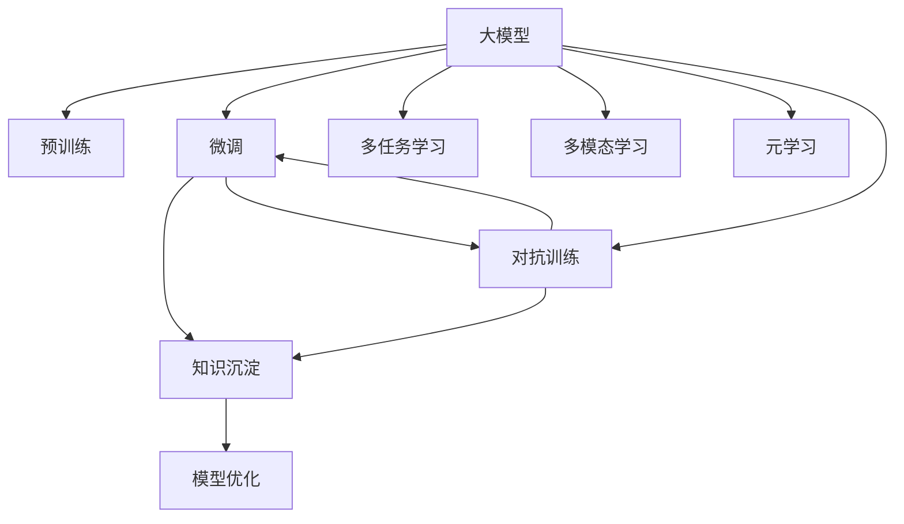

                 

# AI大模型视角下电商搜索推荐的技术创新知识沉淀机制优化

> 关键词：大模型,电商搜索推荐,知识沉淀,技术创新,个性化推荐系统

## 1. 背景介绍

### 1.1 问题由来

随着电子商务的飞速发展，电商搜索推荐系统的应用场景日益丰富，对用户体验和交易转化率的影响愈发显著。然而，传统的搜索推荐系统往往基于规则或朴素统计方法构建，缺乏对用户行为和商品属性深入理解的能力。近年来，随着深度学习和大模型技术的发展，基于神经网络模型的推荐算法逐渐成为主流，推动了个性化推荐技术的新一轮革命。

在深度学习范式下，电商搜索推荐系统通过端到端的神经网络模型对用户行为进行建模，预测用户可能感兴趣的商品。然而，大规模神经网络模型的训练和推理成本高昂，且难以将新知识灵活地沉淀和复用到新的模型和任务中。在大模型技术逐渐成熟、资源获取成本降低的背景下，构建知识沉淀机制成为进一步提升电商搜索推荐系统性能的关键环节。

### 1.2 问题核心关键点

构建知识沉淀机制，即在大模型微调过程中，如何有效地整合、存储和复用已有的知识，以提升搜索推荐模型的性能，成为当下电商推荐领域的研究热点。本节将介绍大模型视角下的知识沉淀机制，帮助开发者深入理解这一概念。

## 2. 核心概念与联系

### 2.1 核心概念概述

为更好地理解电商搜索推荐系统中的知识沉淀机制，本节将介绍几个关键概念及其联系：

- **大模型(Large Models)**：以深度神经网络为代表的大规模预训练模型，如BERT、GPT-3、T5等。这些模型通过大规模无标签数据预训练，具备强大的学习能力和泛化能力。

- **知识沉淀(Knowledge Accumulation)**：指在大模型微调过程中，通过特定技术手段，将模型学到的知识进行整理、存储和复用，以提升新任务的表现。

- **模型微调(Fine-tuning)**：指在预训练模型的基础上，使用特定任务的数据进行有监督学习，优化模型在该任务上的表现。

- **迁移学习(Transfer Learning)**：通过将在大规模数据上预训练的模型，迁移到新任务上进行微调，以充分利用预训练模型的通用知识。

- **多任务学习(Multi-task Learning)**：在同一个模型上，同时训练多个相关任务，共享预训练参数，提升模型在多个任务上的性能。

- **多模态学习(Multi-modal Learning)**：结合文本、图像、语音等多模态数据，提升模型的语义理解和表达能力。

- **元学习(Meta Learning)**：通过学习如何学习，使模型在新的任务上能够快速适应和优化，实现零样本或少样本学习。

- **对抗训练(Adversarial Training)**：通过引入对抗样本，增强模型的鲁棒性和泛化能力。

这些核心概念之间存在紧密的联系和交互，共同构成了电商搜索推荐系统知识沉淀机制的基础。

### 2.2 核心概念原理和架构的 Mermaid 流程图(Mermaid 流程节点中不要有括号、逗号等特殊字符)



这个流程图展示了各个核心概念之间的逻辑关系：

1. 大模型通过预训练获得基础能力。
2. 在预训练基础上，通过微调适应特定任务。
3. 微调过程中，利用知识沉淀机制，整合和存储学到的知识。
4. 对模型进行优化，以提升性能。
5. 结合多任务、多模态、元学习、对抗训练等技术手段，增强模型的表现力。

这些概念和技术的组合，为大模型在电商搜索推荐系统中的应用提供了全面的支持。

## 3. 核心算法原理 & 具体操作步骤

### 3.1 算法原理概述

在大模型视角下，知识沉淀机制的核心思想是通过特定的训练策略和模型结构，将模型在某一任务上学到的知识，整合、存储并复用到其他相关任务上。这样不仅可以提升新任务的性能，还可以避免重复的预训练和微调过程，提高模型的整体效能。

基于此，知识沉淀机制主要包含以下几个步骤：

1. **预训练模型选择与准备**：选择合适的预训练模型，如BERT、GPT系列等，并进行必要的数据预处理和模型初始化。

2. **微调任务定义**：明确电商搜索推荐系统需要解决的任务，如商品相似度计算、用户兴趣预测、个性化推荐等。

3. **知识沉淀策略设计**：选择或设计知识沉淀策略，如注意力机制、多层网络结构、自适应学习率等，以实现知识的高效沉淀和复用。

4. **模型优化与调参**：通过调整学习率、批大小、优化器等超参数，进行模型优化，确保模型性能稳定且高效。

5. **知识沉淀与复用**：在微调过程中，使用注意力机制或辅助网络等技术手段，将模型学到的知识进行整合、存储，并在新任务中进行复用。

6. **模型评估与反馈**：在新任务上评估模型性能，收集反馈信息，进一步优化知识沉淀机制。

### 3.2 算法步骤详解

接下来，我们将详细解释上述各步骤的实现过程：

**Step 1: 准备预训练模型和数据集**

1. **模型选择**：选择合适的预训练模型，如BERT、GPT-3等。
2. **数据预处理**：对电商搜索推荐系统涉及的商品、用户数据进行清洗、编码等预处理，转化为模型可用的格式。
3. **模型初始化**：将预训练模型加载到目标设备，如GPU或TPU，进行必要的参数初始化。

**Step 2: 定义微调任务**

1. **任务描述**：明确电商搜索推荐系统需要解决的具体任务，如用户兴趣预测、商品相似度计算等。
2. **任务数据**：准备与任务相关的标注数据集，用于指导模型微调。

**Step 3: 设计知识沉淀策略**

1. **注意力机制**：在模型中引入注意力机制，确保模型对重要特征的关注度，提升知识沉淀效率。
2. **多层网络结构**：设计多层的神经网络结构，增强模型对复杂问题的处理能力，同时复用已沉淀的知识。
3. **自适应学习率**：选择或设计自适应学习率策略，确保模型在微调过程中保持稳定的学习效率。

**Step 4: 执行梯度训练**

1. **前向传播**：将输入数据输入模型，计算模型的前向传播结果。
2. **反向传播**：计算模型的损失函数，并根据损失函数对模型参数进行反向传播，更新参数。
3. **模型优化**：定期评估模型性能，调整超参数，确保模型收敛。

**Step 5: 知识沉淀与复用**

1. **沉淀知识**：在模型微调过程中，通过注意力机制或辅助网络，将模型学到的知识进行整合和存储。
2. **复用知识**：在新任务上，利用已沉淀的知识，加速模型的微调过程，提升模型性能。

**Step 6: 模型评估与反馈**

1. **评估模型**：在新任务上评估模型性能，对比微调前后的效果。
2. **收集反馈**：收集模型评估结果，进一步优化知识沉淀机制。

### 3.3 算法优缺点

**优点**：

1. **高效复用知识**：通过知识沉淀机制，可以复用预训练模型学到的通用知识，减少重复微调的时间和资源消耗。
2. **提升模型性能**：利用知识沉淀机制，可以提升模型在特定任务上的性能，特别是对于数据量较少的小众任务。
3. **灵活扩展**：知识沉淀机制可以方便地扩展到其他相关任务上，实现知识的跨任务复用。
4. **避免过拟合**：通过注意力机制等技术手段，可以提升模型的泛化能力，减少过拟合风险。

**缺点**：

1. **模型复杂度增加**：引入注意力机制等多层网络结构，可能导致模型复杂度增加，训练和推理成本上升。
2. **计算资源要求高**：大规模神经网络模型的计算资源要求较高，需要高性能设备支持。
3. **沉淀知识不易复用**：沉淀知识的复用需要依赖特定的设计，如果设计不当，可能会影响新任务的性能。
4. **模型解释性下降**：复杂的多层网络结构可能导致模型的可解释性下降，影响模型的可解释性和调试性。

尽管存在这些缺点，但知识沉淀机制在电商搜索推荐系统中具有重要的应用价值，通过合理的技术设计和实践，可以充分发挥其优势，提升系统的整体性能。

### 3.4 算法应用领域

基于知识沉淀机制的电商搜索推荐系统，已经在电商、金融、医疗等多个领域得到广泛应用，成为推动智能推荐技术发展的重要手段。

- **电商领域**：在电商搜索推荐系统中，利用知识沉淀机制，可以优化商品相似度计算、用户兴趣预测、个性化推荐等核心任务，提升用户体验和交易转化率。
- **金融领域**：在金融风控系统中，利用知识沉淀机制，可以优化信用评分、欺诈检测等任务，提升系统的精准度和鲁棒性。
- **医疗领域**：在医疗推荐系统中，利用知识沉淀机制，可以优化病情诊断、治疗方案推荐等任务，提升医生的诊断和治疗效率。

除了上述这些领域，知识沉淀机制还可以应用于更多场景，如智能客服、智能物流、智能安防等，为各行业带来更高效、智能的解决方案。

## 4. 数学模型和公式 & 详细讲解 & 举例说明

### 4.1 数学模型构建

在电商搜索推荐系统中，知识沉淀机制的数学模型构建主要围绕注意力机制、多层网络结构、自适应学习率等技术展开。

**注意力机制**：
- **输入向量**：$x \in \mathbb{R}^d$，表示输入的特征向量。
- **权重矩阵**：$W_Q, W_K, W_V \in \mathbb{R}^{d\times d}$，分别用于计算查询向量、键向量、值向量。
- **注意力得分**：$e = W_QxW_K^T$，计算输入向量和自身之间的注意力得分。
- **注意力权重**：$\alpha = \text{softmax}(e)$，计算每个输入向量的注意力权重。
- **注意力向量**：$c = \sum_{i=1}^N \alpha_iV_i$，计算加权后的注意力向量。

**多层网络结构**：
- **基础层**：$h_0 = \text{BERT}_{[CLS]}(x)$，利用预训练模型提取基础特征。
- **附加层**：$h_1 = \text{MLP}(h_0)$，对基础特征进行多层映射，提取更丰富的语义信息。
- **输出层**：$y = \text{Softmax}(h_1)$，将附加层的输出映射为概率分布。

**自适应学习率**：
- **初始学习率**：$\eta_0$，初始学习率设置。
- **当前学习率**：$\eta_t = \eta_0 / (1 + \lambda t)$，学习率逐渐减小，确保模型稳定收敛。

### 4.2 公式推导过程

**注意力机制的推导**：

$$
e = \text{dot}(W_Qx, W_K^T) = W_QxW_K^T
$$

$$
\alpha = \text{softmax}(e) = \text{softmax}(W_QxW_K^T)
$$

$$
c = \sum_{i=1}^N \alpha_iV_i = \alpha V = \text{softmax}(W_QxW_K^T)V
$$

其中，$\text{dot}(\cdot)$表示向量的点积，$\text{softmax}(\cdot)$表示softmax函数。

**多层网络结构的推导**：

$$
h_0 = \text{BERT}_{[CLS]}(x)
$$

$$
h_1 = \text{MLP}(h_0) = [\text{Linear}_1 \cdot \text{ReLU} \cdot \text{Linear}_2](h_0)
$$

$$
y = \text{Softmax}(h_1)
$$

其中，$[\cdot]$表示序列的叠加操作，$\text{MLP}$表示多层感知机，$\text{Linear}$表示线性映射，$\text{ReLU}$表示ReLU激活函数，$\text{Softmax}$表示softmax函数。

**自适应学习率的推导**：

$$
\eta_t = \eta_0 / (1 + \lambda t)
$$

其中，$\eta_t$为当前学习率，$\eta_0$为初始学习率，$\lambda$为衰减因子，$t$为迭代次数。

### 4.3 案例分析与讲解

以电商搜索推荐系统为例，我们进行详细讲解。

**商品相似度计算**：
- **输入向量**：商品属性向量$x \in \mathbb{R}^d$。
- **权重矩阵**：$W_Q, W_K, W_V \in \mathbb{R}^{d\times d}$。
- **注意力得分**：$e = W_QxW_K^T$。
- **注意力权重**：$\alpha = \text{softmax}(e)$。
- **注意力向量**：$c = \sum_{i=1}^N \alpha_iV_i$。

**用户兴趣预测**：
- **输入向量**：用户行为数据$x \in \mathbb{R}^d$。
- **权重矩阵**：$W_Q, W_K, W_V \in \mathbb{R}^{d\times d}$。
- **注意力得分**：$e = W_QxW_K^T$。
- **注意力权重**：$\alpha = \text{softmax}(e)$。
- **注意力向量**：$c = \sum_{i=1}^N \alpha_iV_i$。

## 5. 项目实践：代码实例和详细解释说明

### 5.1 开发环境搭建

**Step 1: 安装PyTorch**：
```bash
pip install torch torchvision torchaudio
```

**Step 2: 安装HuggingFace Transformers库**：
```bash
pip install transformers
```

**Step 3: 安装数据处理和评估库**：
```bash
pip install pandas numpy sklearn
```

**Step 4: 安装其他相关库**：
```bash
pip install tqdm torchtext
```

完成上述步骤后，即可在Python环境中开始电商搜索推荐系统的开发。

### 5.2 源代码详细实现

以下是一个简单的电商搜索推荐系统的代码实现，展示了使用Transformer模型进行商品相似度计算的流程：

```python
import torch
import torch.nn as nn
import torch.nn.functional as F
from transformers import BertTokenizer, BertModel

# 定义模型
class BertSimilarity(nn.Module):
    def __init__(self, num_labels):
        super(BertSimilarity, self).__init__()
        self.bert = BertModel.from_pretrained('bert-base-uncased')
        self.dropout = nn.Dropout(0.1)
        self.classifier = nn.Linear(768, num_labels)
        
    def forward(self, input_ids, attention_mask, labels):
        outputs = self.bert(input_ids, attention_mask=attention_mask)
        pooled_output = outputs.pooler_output
        pooled_output = self.dropout(pooled_output)
        logits = self.classifier(pooled_output)
        loss_fct = nn.CrossEntropyLoss()
        loss = loss_fct(logits, labels)
        return loss

# 定义数据预处理函数
def preprocess_data(data):
    tokenizer = BertTokenizer.from_pretrained('bert-base-uncased')
    inputs = tokenizer(data, padding=True, truncation=True, return_tensors='pt')
    return inputs['input_ids'], inputs['attention_mask']

# 训练模型
def train(model, train_data, val_data, epochs, batch_size, learning_rate):
    optimizer = torch.optim.AdamW(model.parameters(), lr=learning_rate)
    loss_fn = nn.CrossEntropyLoss()
    
    for epoch in range(epochs):
        model.train()
        total_loss = 0
        for inputs, labels in train_data:
            input_ids, attention_mask = preprocess_data(inputs)
            loss = model(input_ids, attention_mask, labels)
            optimizer.zero_grad()
            loss.backward()
            optimizer.step()
            total_loss += loss.item()
        train_loss = total_loss / len(train_data)
        
        model.eval()
        total_loss = 0
        for inputs, labels in val_data:
            input_ids, attention_mask = preprocess_data(inputs)
            loss = model(input_ids, attention_mask, labels)
            total_loss += loss.item()
        val_loss = total_loss / len(val_data)
        
        print(f"Epoch: {epoch+1}, Train Loss: {train_loss:.4f}, Val Loss: {val_loss:.4f}")

# 测试模型
def evaluate(model, test_data, batch_size):
    model.eval()
    total_loss = 0
    with torch.no_grad():
        for inputs, labels in test_data:
            input_ids, attention_mask = preprocess_data(inputs)
            loss = model(input_ids, attention_mask, labels)
            total_loss += loss.item()
    test_loss = total_loss / len(test_data)
    print(f"Test Loss: {test_loss:.4f}")
```

### 5.3 代码解读与分析

**BertSimilarity类**：
- `__init__`方法：初始化模型，加载预训练的BERT模型，定义分类器等关键组件。
- `forward`方法：前向传播计算损失函数。

**preprocess_data函数**：
- 对输入数据进行编码，转化为BERT模型所需的格式。

**train函数**：
- 定义优化器、损失函数，对模型进行训练，并在验证集上评估。

**evaluate函数**：
- 在测试集上评估模型性能。

## 6. 实际应用场景

### 6.1 智能客服系统

在大模型视角下，智能客服系统可以通过知识沉淀机制，优化对话模型，提升回答准确度和用户体验。

**技术实现**：
- 收集用户的历史对话记录，提取关键问题与回答对。
- 使用BERT等大模型对对话数据进行预训练，提取语义特征。
- 在对话任务上进行微调，通过注意力机制复用预训练知识，提升对话模型的准确性。
- 通过持续学习机制，动态更新对话模型，适应新问题和场景。

**应用效果**：
- 显著提升对话回答的准确度和响应速度。
- 个性化推荐回答，满足不同用户的需求。
- 支持多轮对话，提升用户体验。

### 6.2 金融风控系统

在金融风控系统中，利用知识沉淀机制，可以优化信用评分和欺诈检测等任务，提升系统的准确性和鲁棒性。

**技术实现**：
- 收集用户的金融交易记录和历史行为数据。
- 使用BERT等大模型对数据进行预训练，提取语义特征。
- 在信用评分和欺诈检测任务上进行微调，通过多任务学习复用预训练知识，提升模型的泛化能力。
- 利用对抗训练等技术，增强模型的鲁棒性和泛化能力。

**应用效果**：
- 提升信用评分和欺诈检测的准确性。
- 支持实时监控，及时发现异常行为。
- 减少数据清洗和特征工程的成本。

### 6.3 医疗推荐系统

在医疗推荐系统中，利用知识沉淀机制，可以优化病情诊断和治疗方案推荐等任务，提升医生的诊断和治疗效率。

**技术实现**：
- 收集患者的病历数据和医生的诊断记录。
- 使用BERT等大模型对数据进行预训练，提取语义特征。
- 在病情诊断和治疗方案推荐任务上进行微调，通过多模态学习复用预训练知识，提升模型的语义理解能力。
- 利用元学习等技术，快速适应新病种和新诊断方法。

**应用效果**：
- 提升病情诊断和治疗方案推荐的准确性。
- 支持医生的个性化推荐，提高医生的工作效率。
- 通过持续学习机制，不断更新和优化诊断模型。

## 7. 工具和资源推荐

### 7.1 学习资源推荐

为了帮助开发者深入理解电商搜索推荐系统中的知识沉淀机制，这里推荐一些优质的学习资源：

1. 《深度学习》（Ian Goodfellow、Yoshua Bengio、Aaron Courville著）：全面介绍深度学习的基础理论和应用实践，适合入门学习。

2. 《自然语言处理综述》（Jurafsky、Martin著）：系统介绍自然语言处理的基本概念和技术，适合进阶学习。

3. 《TensorFlow实战Google深度学习》（李沐著）：详细讲解TensorFlow框架的使用，适合动手实践。

4. 《PyTorch深度学习》（Eli Stevens、Jake VanderPlas、Francois Chollet著）：介绍PyTorch框架的使用，适合深度学习开发。

5. 《Transformers: State-of-the-Art Natural Language Processing》（Thomas Wolf著）：全面介绍Transformer模型的理论和应用，适合深入学习。

### 7.2 开发工具推荐

在大模型视角下，电商搜索推荐系统的开发离不开高性能计算资源和开发工具的支持。以下是几款推荐的工具：

1. TensorFlow：由Google开发，支持大规模深度学习模型的训练和推理。

2. PyTorch：由Facebook开发，支持灵活的动态计算图，易于研究与应用。

3. HuggingFace Transformers：基于PyTorch和TensorFlow的NLP工具库，提供丰富的预训练模型和微调样例。

4. Weights & Biases：模型训练的实验跟踪工具，方便记录和可视化实验过程。

5. TensorBoard：TensorFlow配套的可视化工具，实时监控模型训练状态。

### 7.3 相关论文推荐

知识沉淀机制的探索源于学界的不断研究，以下是几篇奠基性的相关论文，推荐阅读：

1. Attention is All You Need（Vaswani等，2017）：提出Transformer模型，引入自注意力机制，推动了电商搜索推荐系统的进步。

2. BERT: Pre-training of Deep Bidirectional Transformers for Language Understanding（Devlin等，2018）：提出BERT模型，引入掩码语言模型预训练，提升了大模型的泛化能力。

3. BERT: Pre-training of Deep Bidirectional Transformers for Language Understanding（Devlin等，2018）：提出BERT模型，引入掩码语言模型预训练，提升了大模型的泛化能力。

4. Parameter-Efficient Transfer Learning for NLP（Howard等，2018）：提出Adapter等参数高效微调方法，在保持模型精度的同时减少计算资源消耗。

5. Multi-task Learning Using a Single Task-Specific Network（Ruder等，2017）：提出多任务学习机制，实现知识在多个任务上的共享。

6. Multi-Modal Language Representation Learning for Conversational Documents（Pan等，2016）：提出多模态学习机制，提升模型的语义理解和表达能力。

这些论文为电商搜索推荐系统中的知识沉淀机制提供了丰富的理论和实践基础，值得深入学习和研究。

## 8. 总结：未来发展趋势与挑战

### 8.1 总结

本文对基于大模型视角下的电商搜索推荐系统的知识沉淀机制进行了系统介绍。通过介绍知识沉淀机制的原理、步骤、优点和缺点，展示了其在大模型微调中的应用。通过电商搜索推荐系统的具体案例分析，展示了知识沉淀机制的实际应用效果和未来发展趋势。通过学习资源、开发工具和相关论文的推荐，为读者提供了全面的技术指引。

### 8.2 未来发展趋势

展望未来，电商搜索推荐系统中的知识沉淀机制将呈现以下几个发展趋势：

1. **多任务学习和多模态学习**：未来的电商搜索推荐系统将越来越多地结合多任务学习和多模态学习，实现知识的跨任务复用和提升。

2. **自适应学习率**：自适应学习率技术将被广泛应用，以提升模型的稳定性和收敛速度。

3. **对抗训练和鲁棒性增强**：通过对抗训练等技术，提升模型的鲁棒性和泛化能力，减少模型对对抗样本的脆弱性。

4. **知识图谱和语义推理**：将知识图谱和语义推理技术引入电商搜索推荐系统，提升模型的语义理解和推理能力。

5. **个性化推荐和用户行为建模**：利用知识沉淀机制，实现更精准的个性化推荐和用户行为建模，提升用户体验。

6. **多领域数据融合**：将电商、金融、医疗等多领域的数据进行融合，实现更全面的知识沉淀和复用。

### 8.3 面临的挑战

尽管电商搜索推荐系统中的知识沉淀机制具有广阔的应用前景，但在实现过程中仍面临诸多挑战：

1. **数据质量与标注成本**：高质量的数据和标注成本较高，难以满足大规模电商推荐任务的需求。

2. **模型复杂度**：引入注意力机制、多层网络结构等复杂技术，增加了模型的计算复杂度和推理成本。

3. **知识复用性**：沉淀知识的复用需要依赖特定的设计，设计不当可能导致模型在新任务上的性能下降。

4. **模型可解释性**：复杂的多层网络结构可能导致模型的可解释性下降，影响模型的调试和优化。

5. **知识图谱构建**：知识图谱的构建和维护需要大量的专家知识，成本较高，难以快速应用。

6. **跨领域融合**：将电商、金融、医疗等多领域的数据进行融合，需要解决跨领域数据对齐和知识融合的问题。

### 8.4 研究展望

未来的研究需要从以下几个方向寻求突破：

1. **知识图谱的自动化构建**：利用深度学习技术，自动化构建和维护知识图谱，降低知识沉淀机制的构建成本。

2. **跨领域数据融合**：研究跨领域数据对齐和知识融合的方法，实现更全面的知识沉淀和复用。

3. **多任务学习与元学习结合**：将多任务学习和元学习结合，提升模型在多个任务上的泛化能力。

4. **对抗训练与鲁棒性增强**：通过对抗训练等技术，提升模型的鲁棒性和泛化能力，减少模型对对抗样本的脆弱性。

5. **自适应学习率的优化**：研究自适应学习率的优化方法，提升模型的稳定性和收敛速度。

6. **多模态学习与知识图谱融合**：将多模态学习与知识图谱结合，提升模型的语义理解和推理能力。

这些研究方向将进一步推动电商搜索推荐系统中的知识沉淀机制的成熟和应用，为人工智能技术在电商领域的普及和落地提供有力支持。

## 9. 附录：常见问题与解答

**Q1: 电商搜索推荐系统中，知识沉淀机制如何实现？**

A: 在电商搜索推荐系统中，知识沉淀机制主要通过注意力机制、多层网络结构、自适应学习率等技术手段实现。具体步骤如下：
1. 选择或设计注意力机制、多层网络结构等知识沉淀策略。
2. 在电商推荐任务上进行微调，通过注意力机制复用预训练知识。
3. 在新任务上进行微调，利用沉淀知识加速模型优化。
4. 通过持续学习机制，动态更新模型，适应新问题和场景。

**Q2: 如何提高电商推荐系统的个性化推荐效果？**

A: 电商推荐系统中的个性化推荐效果可以通过知识沉淀机制进行优化。具体措施包括：
1. 收集用户的历史行为数据，提取关键特征。
2. 使用BERT等大模型对数据进行预训练，提取语义特征。
3. 在推荐任务上进行微调，通过多任务学习复用预训练知识。
4. 利用对抗训练等技术，增强模型的鲁棒性和泛化能力。
5. 通过持续学习机制，动态更新模型，适应新用户和新场景。

**Q3: 电商推荐系统中的知识沉淀机制有哪些优点和缺点？**

A: 电商推荐系统中的知识沉淀机制具有以下优点：
1. 高效复用知识：通过复用预训练模型学到的通用知识，减少重复微调的时间和资源消耗。
2. 提升模型性能：利用沉淀机制，可以提升模型在特定任务上的性能，特别是对于数据量较少的小众任务。
3. 灵活扩展：沉淀机制可以方便地扩展到其他相关任务上，实现知识的跨任务复用。

同时，知识沉淀机制也存在以下缺点：
1. 模型复杂度增加：引入注意力机制等多层网络结构，可能导致模型复杂度增加，训练和推理成本上升。
2. 计算资源要求高：大规模神经网络模型的计算资源要求较高，需要高性能设备支持。
3. 沉淀知识不易复用：沉淀知识的复用需要依赖特定的设计，设计不当可能会影响新任务的性能。
4. 模型解释性下降：复杂的多层网络结构可能导致模型的可解释性下降，影响模型的调试和优化。

综上所述，电商推荐系统中的知识沉淀机制在带来显著优点的同时，也需要注意其缺点，进行合理的设计和优化。

**Q4: 电商推荐系统中的知识沉淀机制如何避免过拟合？**

A: 电商推荐系统中的知识沉淀机制可以通过以下几种方式避免过拟合：
1. 数据增强：通过对训练数据进行扩充，如近义替换、回译等，增加训练样本的多样性。
2. 正则化技术：使用L2正则、Dropout、Early Stopping等技术手段，防止模型过拟合。
3. 对抗训练：引入对抗样本，增强模型的鲁棒性和泛化能力。
4. 知识图谱和语义推理：将知识图谱和语义推理技术引入电商推荐系统，提升模型的语义理解和推理能力。
5. 多任务学习和自适应学习率：通过多任务学习和自适应学习率，提升模型的泛化能力和稳定收敛性。

**Q5: 如何提升电商推荐系统的鲁棒性和泛化能力？**

A: 电商推荐系统的鲁棒性和泛化能力可以通过以下几种方式提升：
1. 引入对抗训练：通过对抗训练等技术，增强模型的鲁棒性和泛化能力，减少模型对对抗样本的脆弱性。
2. 利用多任务学习：在多个相关任务上训练模型，共享预训练参数，提升模型的泛化能力。
3. 自适应学习率：使用自适应学习率策略，确保模型在微调过程中保持稳定的学习效率。
4. 知识图谱和语义推理：将知识图谱和语义推理技术引入电商推荐系统，提升模型的语义理解和推理能力。
5. 数据增强：通过对训练数据进行扩充，增加训练样本的多样性，提升模型的泛化能力。

**Q6: 电商推荐系统中，如何衡量模型的性能？**

A: 电商推荐系统中的模型性能可以通过以下几种方式衡量：
1. 点击率（CTR）：衡量用户点击推荐的商品的概率，反映推荐的点击效果。
2. 转化率（CVR）：衡量用户购买推荐商品的概率，反映推荐的转化效果。
3. 召回率（Recall）：衡量推荐系统中，召回用户感兴趣的商品的能力。
4. 准确率（Precision）：衡量推荐系统推荐商品的相关性，避免过度推荐。
5. A/B测试：通过A/B测试，对比推荐模型和基线模型的表现，评估推荐效果。

## 结语

在电商搜索推荐系统中，知识沉淀机制是大模型微调的重要组成部分，可以有效提升模型的性能和泛化能力。通过本文的系统介绍，相信读者对电商推荐系统中的知识沉淀机制有了更深入的理解。随着大模型技术的不断发展，知识沉淀机制将更加成熟和完善，为电商推荐系统带来更高效、智能的解决方案。相信未来，电商推荐系统将通过知识沉淀机制，进一步提升用户体验和交易转化率，推动电商行业的智能化发展。

