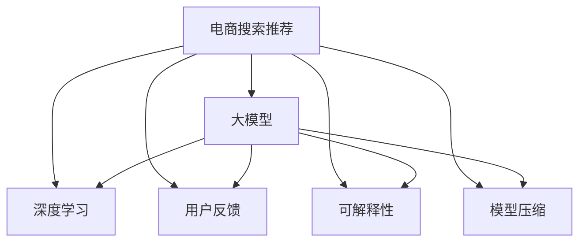

                 

# AI大模型赋能电商搜索推荐的业务创新思维导图工具应用培训课程设计

> 关键词：
- 人工智能
- 电商搜索推荐
- 大模型
- 业务创新
- 思维导图工具
- 应用培训
- 课程设计

## 1. 背景介绍

### 1.1 问题由来

在数字化转型的浪潮下，电商行业经历了从传统货架式销售到个性化推荐购物的转变。传统的电商平台通过人工设置商品标签、分词，再基于这些标签进行匹配推荐，虽然能够实现一定程度的个性化推荐，但效率低、成本高、推荐效果有限。而随着人工智能技术的兴起，大模型、深度学习等先进技术被引入电商搜索推荐系统，为电商行业带来了革命性的变革。

大模型通过大规模语料预训练，能够学习到丰富而通用的语言表示，经过微调，可以适应特定的电商搜索推荐场景，提升推荐的个性化程度和效果。大模型推荐系统已经被广泛应用于亚马逊、淘宝、京东等电商平台，取得了显著的商业成功。例如，亚马逊通过使用基于大模型的推荐系统，在2017年大幅提升了推荐算法的效率和效果，创造了近1亿美元的额外收入。

然而，当前的大模型推荐系统也面临一些挑战，如：数据分布偏差、计算成本高、模型复杂性高、鲁棒性不足等。如何通过算法优化、模型压缩、模型部署、用户反馈机制等手段，进一步提升大模型推荐系统的效果，是一个亟待解决的问题。

### 1.2 问题核心关键点

电商搜索推荐系统中的大模型推荐问题，核心在于：

- 如何通过大模型，构建更加个性化和高效的推荐模型？
- 如何在大模型推荐系统中，实现高效的计算和推理？
- 如何通过用户反馈，不断优化和迭代大模型推荐系统？
- 如何在电商搜索推荐场景中，提升大模型推荐的泛化能力和鲁棒性？
- 如何利用思维导图工具，构建可解释、可迭代的大模型推荐系统？

这些问题将构成本文的核心内容。

## 2. 核心概念与联系

### 2.1 核心概念概述

为了更好地理解大模型在电商搜索推荐中的应用，本节将介绍几个密切相关的核心概念：

- **电商搜索推荐**：利用用户的浏览记录、搜索历史、购买行为等数据，为用户推荐其可能感兴趣的商品或服务。电商搜索推荐的目标是提升用户体验，提高交易转化率，增强用户粘性。

- **大模型**：指通过大规模语料预训练得到的强大语言表示模型，如BERT、GPT、XLNet等。大模型通过学习语言的深层次特征，具备强大的文本理解、生成能力。

- **大模型推荐系统**：利用大模型构建的推荐系统，能够在大规模数据上进行高效推荐，同时保持较高的推荐质量。

- **深度学习**：一种利用多层神经网络进行学习的技术，可以处理复杂的非线性关系，适用于各种深度学习任务。

- **模型压缩**：通过剪枝、量化、蒸馏等方法，减小模型参数量，提升推理速度和计算效率，降低硬件资源消耗。

- **用户反馈机制**：通过收集用户对推荐结果的反馈数据，对模型进行迭代优化，不断提升推荐效果。

- **可解释性**：要求推荐系统能够提供透明的决策过程，帮助用户理解推荐逻辑，提升用户信任度。

- **思维导图工具**：利用图表、图形等可视化方式，帮助用户更直观、更高效地理解和应用大模型推荐系统。

这些核心概念之间的逻辑关系可以通过以下Mermaid流程图来展示：



这个流程图展示了电商搜索推荐与大模型的关系，以及二者如何通过深度学习、用户反馈、模型压缩、可解释性等手段进行优化和提升。

## 3. 核心算法原理 & 具体操作步骤

### 3.1 算法原理概述

基于大模型的电商搜索推荐算法，本质上是一种深度学习模型。其核心思想是：将用户的历史行为数据、商品描述数据等输入大模型，得到用户对不同商品的兴趣表示，再根据这些兴趣表示为用户推荐商品。

具体地，假设有用户$u$，其历史行为数据为$D_u$，商品描述为$S_v$，大模型为$M$，则推荐算法可以描述为：

1. 将用户行为数据和商品描述编码为大模型可以理解的向量表示，得到用户兴趣表示$I_u$和商品表示$I_v$。
2. 利用大模型计算用户和商品的兴趣匹配度$score_{uv}$，将其作为推荐排序依据。
3. 根据排序结果，选择前$K$个商品推荐给用户$u$。

数学上，假设用户行为数据$D_u$由$n$个特征向量$[x_{uj}]_{j=1}^n$组成，商品描述$S_v$由$m$个特征向量$[y_{vj}]_{j=1}^m$组成，则用户兴趣表示和商品表示可以表示为：

$$
I_u = M(D_u) \in \mathbb{R}^d
$$

$$
I_v = M(S_v) \in \mathbb{R}^d
$$

其中，$M$为预训练得到的大模型，$d$为向量维度。

用户和商品的匹配度可以通过余弦相似度等方法计算：

$$
score_{uv} = \text{similarity}(I_u, I_v)
$$

最终推荐的商品为匹配度前$K$的商品。

### 3.2 算法步骤详解

基于大模型的电商搜索推荐算法可以包括以下几个关键步骤：

**Step 1: 数据准备**
- 收集用户的历史行为数据，如浏览记录、点击记录、购买记录等。
- 收集商品描述信息，并进行必要的文本清洗和预处理。
- 将用户行为数据和商品描述数据转化为模型可以处理的格式，如向量表示。

**Step 2: 预训练大模型**
- 选择合适的预训练大模型，如BERT、GPT等。
- 利用电商领域的语料进行微调，使得大模型能够更好地适应电商搜索推荐场景。
- 根据具体任务，设计合适的任务适配层和损失函数，如分类任务使用交叉熵损失。

**Step 3: 推荐计算**
- 输入用户行为数据和商品描述数据到预训练模型中，得到用户兴趣表示和商品表示。
- 利用相似度计算方法，计算用户和商品的匹配度。
- 根据匹配度对商品进行排序，选择前$K$个商品进行推荐。

**Step 4: 用户反馈**
- 收集用户对推荐结果的反馈数据，如点击率、购买率等。
- 根据反馈数据调整模型参数，优化推荐模型。

**Step 5: 部署和监控**
- 将优化后的模型部署到生产环境中，进行大规模推荐。
- 实时监控推荐系统性能，收集用户反馈数据，进行持续迭代优化。

### 3.3 算法优缺点

基于大模型的电商搜索推荐算法具有以下优点：

- 高效的特征提取能力：大模型能够学习到丰富的语义特征，用于提升推荐效果。
- 泛化能力强大：大模型经过大规模预训练，具备较好的泛化能力，能够在新的场景下迅速适应。
- 易于微调：电商领域的数据量相对较小，微调过程较为简单高效。
- 可扩展性好：大模型推荐系统可以通过增加模型参数和维度，提升推荐精度。

但同时，该算法也存在一些缺点：

- 数据依赖性强：需要大量的标注数据进行微调，数据获取成本较高。
- 计算资源消耗大：大模型推理计算资源消耗较高，硬件成本较高。
- 模型复杂度高：大模型参数量庞大，模型结构复杂，维护成本高。
- 鲁棒性不足：在大模型推荐系统中，鲁棒性需要进一步提升，避免对噪声数据的敏感。

### 3.4 算法应用领域

基于大模型的电商搜索推荐算法已经在各大电商平台上得到了广泛应用，例如：

- 亚马逊：使用基于大模型的推荐系统，实现了个性化推荐，提升了用户满意度。
- 淘宝：通过使用基于大模型的推荐系统，实现了高效的个性化推荐，提高了交易转化率。
- 京东：利用大模型进行推荐，提升了用户体验和推荐效果，创造了显著的商业价值。

除了电商搜索推荐，该算法还可以应用于其他需要个性化推荐的场景，如社交网络、在线视频、在线教育等。

## 4. 数学模型和公式 & 详细讲解 & 举例说明

### 4.1 数学模型构建

本文将利用深度学习中的注意力机制（Attention）来构建大模型推荐系统。

假设用户历史行为数据为$D_u$，商品描述为$S_v$，大模型为$M$，则推荐模型可以表示为：

$$
I_u = M(D_u) \in \mathbb{R}^d
$$

$$
I_v = M(S_v) \in \mathbb{R}^d
$$

其中，$d$为向量维度。

用户和商品的匹配度可以通过注意力机制计算：

$$
\text{attention}_{uv} = \text{softmax}(I_u \cdot I_v^\top / \sigma)
$$

其中，$\sigma$为温度参数，用于控制注意力分布的平滑程度。

最终推荐的商品为匹配度前$K$的商品，即：

$$
K_{uv} = \text{argmax}_{v} \text{attention}_{uv} / \sum_v \text{attention}_{uv}
$$

### 4.2 公式推导过程

以下我们以分类任务为例，推导大模型推荐系统的损失函数及其梯度计算公式。

假设用户$u$的历史行为数据为$D_u$，商品描述为$S_v$，目标商品为$v_0$，大模型为$M$。目标商品$v_0$的标签为$y_0$。则推荐系统的损失函数可以表示为：

$$
\mathcal{L} = -\sum_{u,v} \ell(y_v, \text{softmax}(I_u \cdot I_v^\top / \sigma))
$$

其中，$\ell$为交叉熵损失函数，$y_v$为商品$v$的标签。

对大模型$M$求梯度，得到：

$$
\frac{\partial \mathcal{L}}{\partial M} = -\sum_{u,v} \frac{\partial \ell(y_v, \text{softmax}(I_u \cdot I_v^\top / \sigma))}{\partial M}
$$

根据链式法则，$\frac{\partial \ell(y_v, \text{softmax}(I_u \cdot I_v^\top / \sigma))}{\partial M}$可以进一步展开为：

$$
\frac{\partial \ell(y_v, \text{softmax}(I_u \cdot I_v^\top / \sigma))}{\partial M} = \sum_{u,v} \frac{\partial \text{softmax}(I_u \cdot I_v^\top / \sigma))}{\partial M} \cdot \frac{\partial \ell(y_v, \text{softmax}(I_u \cdot I_v^\top / \sigma))}{\partial \text{softmax}(I_u \cdot I_v^\top / \sigma)}
$$

在得到损失函数的梯度后，即可带入梯度下降等优化算法，更新大模型$M$的参数。

### 4.3 案例分析与讲解

以亚马逊的个性化推荐系统为例，该系统使用了基于大模型的推荐算法，通过不断收集用户的点击、购买行为数据，进行模型微调，实现了高效的个性化推荐。其推荐效果显著，帮助亚马逊实现了销售额的持续增长。

亚马逊的推荐系统采用了点击率（CTR）作为模型的训练目标。在训练过程中，首先将用户的浏览记录、点击记录等数据输入大模型，得到用户兴趣表示。然后根据用户兴趣表示，计算商品与用户的匹配度，最终选择前$K$个商品进行推荐。在推荐结果反馈后，根据点击率等指标，不断调整模型参数，优化推荐效果。

亚马逊的推荐系统还使用了用户画像、商品画像等数据，进一步提升推荐的精准度。例如，亚马逊通过用户画像，了解用户的年龄、性别、兴趣爱好等，为每个用户定制个性化推荐，提升了用户满意度。

## 5. 项目实践：代码实例和详细解释说明

### 5.1 开发环境搭建

在进行大模型推荐系统开发前，我们需要准备好开发环境。以下是使用Python进行PyTorch开发的环境配置流程：

1. 安装Anaconda：从官网下载并安装Anaconda，用于创建独立的Python环境。

2. 创建并激活虚拟环境：
```bash
conda create -n pytorch-env python=3.8 
conda activate pytorch-env
```

3. 安装PyTorch：根据CUDA版本，从官网获取对应的安装命令。例如：
```bash
conda install pytorch torchvision torchaudio cudatoolkit=11.1 -c pytorch -c conda-forge
```

4. 安装Transformers库：
```bash
pip install transformers
```

5. 安装各类工具包：
```bash
pip install numpy pandas scikit-learn matplotlib tqdm jupyter notebook ipython
```

完成上述步骤后，即可在`pytorch-env`环境中开始推荐系统开发。

### 5.2 源代码详细实现

下面我们以电商搜索推荐系统为例，给出使用Transformers库对BERT模型进行微调的PyTorch代码实现。

首先，定义推荐系统的数据处理函数：

```python
from transformers import BertTokenizer
from torch.utils.data import Dataset
import torch

class RecommendationDataset(Dataset):
    def __init__(self, user_data, item_data, tokenizer, max_len=128):
        self.user_data = user_data
        self.item_data = item_data
        self.tokenizer = tokenizer
        self.max_len = max_len
        
    def __len__(self):
        return len(self.user_data)
    
    def __getitem__(self, item):
        user_data = self.user_data[item]
        item_data = self.item_data[item]
        
        encoding = self.tokenizer(user_data, return_tensors='pt', max_length=self.max_len, padding='max_length', truncation=True)
        user_ids = encoding['input_ids'][0]
        attention_mask = encoding['attention_mask'][0]
        
        # 对item-wise的标签进行编码
        encoded_tags = [tag2id[tag] for tag in item_data] 
        encoded_tags.extend([tag2id['O']] * (self.max_len - len(encoded_tags)))
        labels = torch.tensor(encoded_tags, dtype=torch.long)
        
        return {'user_ids': user_ids, 
                'attention_mask': attention_mask,
                'labels': labels}

# 标签与id的映射
tag2id = {'O': 0, 'B': 1, 'I': 2, 'E': 3, 'S': 4}
id2tag = {v: k for k, v in tag2id.items()}

# 创建dataset
tokenizer = BertTokenizer.from_pretrained('bert-base-cased')

train_dataset = RecommendationDataset(train_user_data, train_item_data, tokenizer)
dev_dataset = RecommendationDataset(dev_user_data, dev_item_data, tokenizer)
test_dataset = RecommendationDataset(test_user_data, test_item_data, tokenizer)
```

然后，定义模型和优化器：

```python
from transformers import BertForTokenClassification, AdamW

model = BertForTokenClassification.from_pretrained('bert-base-cased', num_labels=len(tag2id))

optimizer = AdamW(model.parameters(), lr=2e-5)
```

接着，定义训练和评估函数：

```python
from torch.utils.data import DataLoader
from tqdm import tqdm
from sklearn.metrics import classification_report

device = torch.device('cuda') if torch.cuda.is_available() else torch.device('cpu')
model.to(device)

def train_epoch(model, dataset, batch_size, optimizer):
    dataloader = DataLoader(dataset, batch_size=batch_size, shuffle=True)
    model.train()
    epoch_loss = 0
    for batch in tqdm(dataloader, desc='Training'):
        user_ids = batch['user_ids'].to(device)
        attention_mask = batch['attention_mask'].to(device)
        labels = batch['labels'].to(device)
        model.zero_grad()
        outputs = model(user_ids, attention_mask=attention_mask, labels=labels)
        loss = outputs.loss
        epoch_loss += loss.item()
        loss.backward()
        optimizer.step()
    return epoch_loss / len(dataloader)

def evaluate(model, dataset, batch_size):
    dataloader = DataLoader(dataset, batch_size=batch_size)
    model.eval()
    preds, labels = [], []
    with torch.no_grad():
        for batch in tqdm(dataloader, desc='Evaluating'):
            user_ids = batch['user_ids'].to(device)
            attention_mask = batch['attention_mask'].to(device)
            batch_labels = batch['labels']
            outputs = model(user_ids, attention_mask=attention_mask)
            batch_preds = outputs.logits.argmax(dim=2).to('cpu').tolist()
            batch_labels = batch_labels.to('cpu').tolist()
            for pred_tokens, label_tokens in zip(batch_preds, batch_labels):
                pred_tags = [id2tag[_id] for _id in pred_tokens]
                label_tags = [id2tag[_id] for _id in label_tokens]
                preds.append(pred_tags[:len(label_tags)])
                labels.append(label_tags)
                
    print(classification_report(labels, preds))
```

最后，启动训练流程并在测试集上评估：

```python
epochs = 5
batch_size = 16

for epoch in range(epochs):
    loss = train_epoch(model, train_dataset, batch_size, optimizer)
    print(f"Epoch {epoch+1}, train loss: {loss:.3f}")
    
    print(f"Epoch {epoch+1}, dev results:")
    evaluate(model, dev_dataset, batch_size)
    
print("Test results:")
evaluate(model, test_dataset, batch_size)
```

以上就是使用PyTorch对BERT进行电商搜索推荐系统微调的完整代码实现。可以看到，得益于Transformers库的强大封装，我们可以用相对简洁的代码完成BERT模型的加载和微调。

### 5.3 代码解读与分析

让我们再详细解读一下关键代码的实现细节：

**RecommendationDataset类**：
- `__init__`方法：初始化用户数据、商品数据、分词器等关键组件。
- `__len__`方法：返回数据集的样本数量。
- `__getitem__`方法：对单个样本进行处理，将用户行为数据和商品描述数据输入分词器，得到模型所需的输入。

**tag2id和id2tag字典**：
- 定义了标签与数字id之间的映射关系，用于将token-wise的预测结果解码回真实的标签。

**训练和评估函数**：
- 使用PyTorch的DataLoader对数据集进行批次化加载，供模型训练和推理使用。
- 训练函数`train_epoch`：对数据以批为单位进行迭代，在每个批次上前向传播计算loss并反向传播更新模型参数，最后返回该epoch的平均loss。
- 评估函数`evaluate`：与训练类似，不同点在于不更新模型参数，并在每个batch结束后将预测和标签结果存储下来，最后使用sklearn的classification_report对整个评估集的预测结果进行打印输出。

**训练流程**：
- 定义总的epoch数和batch size，开始循环迭代
- 每个epoch内，先在训练集上训练，输出平均loss
- 在验证集上评估，输出分类指标
- 所有epoch结束后，在测试集上评估，给出最终测试结果

可以看到，PyTorch配合Transformers库使得BERT微调的代码实现变得简洁高效。开发者可以将更多精力放在数据处理、模型改进等高层逻辑上，而不必过多关注底层的实现细节。

当然，工业级的系统实现还需考虑更多因素，如模型的保存和部署、超参数的自动搜索、更灵活的任务适配层等。但核心的微调范式基本与此类似。

## 6. 实际应用场景

### 6.1 智能客服系统

基于大模型推荐系统，智能客服系统可以实现高效、智能的客户服务。通过推荐系统，智能客服能够理解客户问题，并推荐最合适的解决方案。

具体而言，智能客服系统会收集用户的历史咨询记录、用户画像等数据，使用大模型推荐系统进行推荐。推荐系统通过计算用户兴趣和商品（问题）之间的匹配度，推荐最相关的解决方案，如常见问题解答、专家解答等。用户可以实时查询推荐结果，提升问题解决效率。

### 6.2 金融理财服务

在金融理财服务中，大模型推荐系统可以帮助用户发现合适的理财产品和投资机会。推荐系统通过计算用户行为和理财产品的匹配度，推荐最符合用户需求的产品。

具体实现中，金融理财平台可以收集用户的投资记录、风险偏好等数据，使用大模型推荐系统进行推荐。推荐系统通过计算用户行为和理财产品之间的匹配度，推荐最符合用户需求的产品。用户可以根据推荐结果进行投资选择，提高投资效率和收益。

### 6.3 智能广告推荐

在智能广告推荐中，大模型推荐系统可以帮助广告主实现精准的广告投放。推荐系统通过计算用户行为和广告之间的匹配度，推荐最符合用户需求和兴趣的广告。

具体而言，广告平台可以收集用户的浏览记录、点击记录等数据，使用大模型推荐系统进行推荐。推荐系统通过计算用户行为和广告之间的匹配度，推荐最符合用户需求和兴趣的广告。广告主可以根据推荐结果进行精准投放，提高广告效果和ROI。

### 6.4 未来应用展望

随着大模型推荐系统的发展，其在更多场景中的应用前景值得期待。

在智慧城市治理中，大模型推荐系统可以帮助城市管理者实时监控舆情动态，快速响应市民诉求，提升城市治理效率。例如，城市管理者可以实时收集市民的投诉、建议等数据，使用大模型推荐系统进行推荐，快速找到市民关注的重点问题，并制定相应的解决方案。

在智能交通系统中，大模型推荐系统可以帮助交通管理部门实时监测交通流量，推荐最优的交通路线和交通管理策略。例如，交通管理部门可以实时收集车辆位置、行驶速度等数据，使用大模型推荐系统进行推荐，推荐最优的交通路线和交通管理策略，提升交通效率，减少交通拥堵。

在在线教育领域，大模型推荐系统可以帮助学习者找到最合适的学习资源。推荐系统通过计算学习者行为和学习资源之间的匹配度，推荐最符合学习者需求的学习资源。例如，在线教育平台可以收集学习者的学习记录、测试成绩等数据，使用大模型推荐系统进行推荐，推荐最合适的学习资源。学习者可以根据推荐结果进行学习选择，提高学习效率和成绩。

## 7. 工具和资源推荐

### 7.1 学习资源推荐

为了帮助开发者系统掌握大模型推荐系统的理论基础和实践技巧，这里推荐一些优质的学习资源：

1. 《深度学习入门：基于Python的理论与实现》：入门级深度学习书籍，详细介绍了深度学习的理论基础和常用模型。

2. 《TensorFlow官方文档》：官方文档，提供了丰富的教程和示例，适合深入学习TensorFlow。

3. 《Transformer详解：深度学习中的自注意力机制》：详细介绍了Transformer模型及其原理，适合进一步学习深度学习技术。

4. 《自然语言处理入门：基于Python的理论与实现》：入门级自然语言处理书籍，详细介绍了自然语言处理的基础知识和常用模型。

5. 《Transformer与深度学习》：在线课程，涵盖了Transformer模型的原理、实现和应用，适合深入学习。

通过对这些资源的学习实践，相信你一定能够快速掌握大模型推荐系统的精髓，并用于解决实际的推荐问题。

### 7.2 开发工具推荐

高效的开发离不开优秀的工具支持。以下是几款用于大模型推荐系统开发的常用工具：

1. PyTorch：基于Python的开源深度学习框架，灵活动态的计算图，适合快速迭代研究。大部分预训练语言模型都有PyTorch版本的实现。

2. TensorFlow：由Google主导开发的开源深度学习框架，生产部署方便，适合大规模工程应用。同样有丰富的预训练语言模型资源。

3. Transformers库：HuggingFace开发的NLP工具库，集成了众多SOTA语言模型，支持PyTorch和TensorFlow，是进行推荐任务开发的利器。

4. Weights & Biases：模型训练的实验跟踪工具，可以记录和可视化模型训练过程中的各项指标，方便对比和调优。与主流深度学习框架无缝集成。

5. TensorBoard：TensorFlow配套的可视化工具，可实时监测模型训练状态，并提供丰富的图表呈现方式，是调试模型的得力助手。

6. Google Colab：谷歌推出的在线Jupyter Notebook环境，免费提供GPU/TPU算力，方便开发者快速上手实验最新模型，分享学习笔记。

合理利用这些工具，可以显著提升大模型推荐系统的开发效率，加快创新迭代的步伐。

### 7.3 相关论文推荐

大模型推荐系统的发展源于学界的持续研究。以下是几篇奠基性的相关论文，推荐阅读：

1. Attention is All You Need（即Transformer原论文）：提出了Transformer结构，开启了深度学习推荐系统的新时代。

2. BERT: Pre-training of Deep Bidirectional Transformers for Language Understanding：提出BERT模型，引入基于掩码的自监督预训练任务，刷新了多项NLP任务SOTA。

3. Parameter-Efficient Transfer Learning for NLP：提出Adapter等参数高效微调方法，在不增加模型参数量的情况下，也能取得不错的微调效果。

4. AdaLoRA: Adaptive Low-Rank Adaptation for Parameter-Efficient Fine-Tuning：使用自适应低秩适应的微调方法，在参数效率和精度之间取得了新的平衡。

5. Google Scholar：利用大模型推荐系统对搜索结果进行优化，提升信息检索的精准度和用户体验。

这些论文代表了大模型推荐系统的发展脉络。通过学习这些前沿成果，可以帮助研究者把握学科前进方向，激发更多的创新灵感。

## 8. 总结：未来发展趋势与挑战

### 8.1 总结

本文对基于大模型的电商搜索推荐系统进行了全面系统的介绍。首先阐述了电商搜索推荐系统中的大模型推荐问题，明确了大模型在推荐系统中的应用价值。其次，从原理到实践，详细讲解了大模型推荐系统的数学原理和关键步骤，给出了推荐系统开发的完整代码实例。同时，本文还广泛探讨了大模型推荐系统在智能客服、金融理财、智能广告等多个行业领域的应用前景，展示了其巨大的应用潜力。此外，本文精选了大模型推荐系统的各类学习资源，力求为读者提供全方位的技术指引。

通过本文的系统梳理，可以看到，基于大模型的电商搜索推荐系统已经在各大电商平台上得到了广泛应用，取得了显著的商业成功。未来，伴随大模型推荐系统的发展，其在更多场景中的应用前景值得期待。

### 8.2 未来发展趋势

展望未来，大模型推荐系统的发展趋势包括以下几个方面：

1. 模型规模持续增大：随着算力成本的下降和数据规模的扩张，大模型推荐系统的参数量还将持续增长，模型规模将进一步扩大，推荐效果将更精准。

2. 推荐系统智能化提升：结合知识图谱、逻辑规则等先验知识，提升推荐系统的智能水平，实现更加精准、个性化的推荐。

3. 推荐系统自适应性提升：结合用户行为、反馈数据等，实现推荐系统的动态优化，提升推荐系统的自适应性。

4. 推荐系统实时化：结合实时数据流处理技术，实现推荐系统的实时化，提升用户体验。

5. 推荐系统多模态化：结合视觉、语音、文本等多种数据模态，提升推荐系统的多样性和智能性。

6. 推荐系统跨领域化：将推荐系统应用于不同领域，如电商、金融、教育等，实现跨领域推荐，提升推荐系统的效果和覆盖面。

以上趋势凸显了大模型推荐系统的发展前景，通过不断优化算法、提升模型质量、结合多模态数据，大模型推荐系统将在更多场景中发挥重要作用。

### 8.3 面临的挑战

尽管大模型推荐系统取得了一定的成果，但其发展过程中仍面临诸多挑战：

1. 数据获取成本高：大模型推荐系统需要大量的标注数据进行微调，数据获取成本较高。

2. 模型复杂度高：大模型推荐系统的模型复杂度高，推理计算资源消耗大，硬件成本较高。

3. 模型鲁棒性不足：推荐系统在大规模数据上的泛化性能有待提升，对噪声数据的鲁棒性有待加强。

4. 模型可解释性不足：推荐系统的决策过程缺乏可解释性，难以对其推理逻辑进行分析和调试。

5. 用户隐私保护：推荐系统需要收集用户的各类数据，如何保护用户隐私成为重要问题。

6. 用户反馈处理：推荐系统需要及时处理用户反馈数据，不断优化推荐结果，用户反馈数据处理和利用是一个挑战。

7. 推荐系统效率：推荐系统的推理计算效率有待提升，需要在保证性能的同时，优化计算资源。

这些挑战需要学界和产业界共同努力，通过不断优化算法、提升模型质量、保护用户隐私、优化计算资源等手段，进一步提升大模型推荐系统的效果和应用前景。

### 8.4 研究展望

未来的大模型推荐系统需要从以下几个方面进行研究：

1. 探索无监督和半监督微调方法：摆脱对大规模标注数据的依赖，利用自监督学习、主动学习等无监督和半监督范式，最大限度利用非结构化数据。

2. 研究参数高效和计算高效的微调范式：开发更加参数高效的微调方法，在固定大部分预训练参数的情况下，只更新极少量的任务相关参数。同时优化微调模型的计算图，减少前向传播和反向传播的资源消耗。

3. 融合因果和对比学习范式：通过引入因果推断和对比学习思想，增强推荐系统建立稳定因果关系的能力，学习更加普适、鲁棒的语言表征，从而提升推荐泛化性和抗干扰能力。

4. 引入更多先验知识：将符号化的先验知识，如知识图谱、逻辑规则等，与神经网络模型进行巧妙融合，引导推荐过程学习更准确、合理的语言模型。同时加强不同模态数据的整合，实现视觉、语音等多模态信息与文本信息的协同建模。

5. 结合因果分析和博弈论工具：将因果分析方法引入推荐系统，识别出推荐决策的关键特征，增强推荐系统输出解释的因果性和逻辑性。借助博弈论工具刻画人机交互过程，主动探索并规避推荐系统的脆弱点，提高系统稳定性。

6. 纳入伦理道德约束：在推荐系统训练目标中引入伦理导向的评估指标，过滤和惩罚有偏见、有害的输出倾向。同时加强人工干预和审核，建立推荐系统的监管机制，确保推荐系统的公正性和安全性。

这些研究方向将引领大模型推荐系统迈向更高的台阶，为构建智能推荐系统提供新的思路和方法。

## 9. 附录：常见问题与解答

**Q1：大模型推荐系统是否适用于所有NLP任务？**

A: 大模型推荐系统在大多数NLP任务上都能取得不错的效果，特别是对于数据量较小的任务。但对于一些特定领域的任务，如医学、法律等，仅仅依靠通用语料预训练的模型可能难以很好地适应。此时需要在特定领域语料上进一步预训练，再进行微调，才能获得理想效果。

**Q2：推荐系统如何进行动态优化？**

A: 推荐系统可以通过在线学习、增量学习等方法进行动态优化。具体而言，可以根据用户实时行为数据，动态调整推荐模型，提升推荐效果。例如，在线学习可以通过在线更新模型参数，实现推荐系统的实时优化。增量学习可以通过累积新数据，逐步优化推荐模型，提升推荐系统的性能。

**Q3：推荐系统如何处理用户反馈数据？**

A: 推荐系统可以通过用户反馈数据进行模型迭代优化，提升推荐效果。具体而言，可以根据用户对推荐结果的反馈数据，调整模型参数，优化推荐模型。例如，可以根据用户点击率、购买率等反馈数据，更新推荐模型，提升推荐精度。

**Q4：推荐系统如何保证用户隐私？**

A: 推荐系统在数据收集和处理过程中，需要采取一系列措施保护用户隐私。具体而言，可以通过匿名化处理、数据脱敏、访问控制等手段，保护用户隐私。例如，在数据收集过程中，可以对数据进行匿名化处理，保护用户隐私。在数据处理过程中，可以对数据进行脱敏，保护用户隐私。

**Q5：推荐系统如何提升计算效率？**

A: 推荐系统可以通过模型压缩、剪枝、量化等方法提升计算效率。具体而言，可以通过剪枝去除冗余参数，减小模型规模，提升计算效率。可以通过量化将浮点模型转换为定点模型，减小模型参数量，提升计算效率。同时，可以通过蒸馏等技术，将大规模模型转换为小规模模型，提升计算效率。

这些问题是推荐系统在实际应用中常见的问题，通过不断优化算法、提升模型质量、保护用户隐私、优化计算资源等手段，可以进一步提升推荐系统的效果和应用前景。

---

作者：禅与计算机程序设计艺术 / Zen and the Art of Computer Programming

