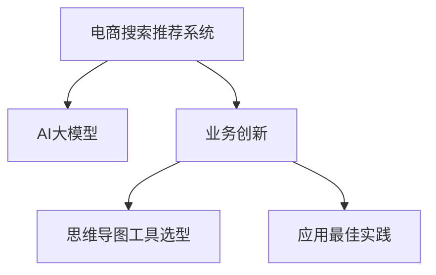

                 

# AI大模型赋能电商搜索推荐的业务创新思维导图工具选型与应用最佳实践

> 关键词：电商搜索推荐, AI大模型, 业务创新, 思维导图工具选型, 应用最佳实践

## 1. 背景介绍

随着互联网和电子商务的迅猛发展，电商搜索推荐系统已经成为各大电商平台的核心竞争力之一。用户通过搜索推荐系统快速获取所需商品，平台通过系统提升用户购物体验和转化率，从而实现商业价值最大化。然而，搜索推荐系统在实际应用中常常面临诸如搜索准确性不足、推荐冷启动等问题，难以满足用户日益多样化的需求。为此，各大电商平台纷纷引入AI大模型进行系统优化，以期在算法效果、性能效率、可解释性等方面取得突破。

本文将系统介绍如何通过AI大模型技术，结合思维导图工具，优化电商搜索推荐系统的业务创新，并给出应用最佳实践。在深入探讨技术原理的同时，将结合实际案例，为电商平台提供可操作的选型与应用建议。

## 2. 核心概念与联系

### 2.1 核心概念概述

为更好地理解AI大模型在电商搜索推荐系统中的应用，本节将介绍几个关键概念及其相互联系：

- **电商搜索推荐系统**：利用AI技术，通过分析用户行为数据，为用户推荐合适商品的系统。
- **AI大模型**：指基于大规模数据训练得到的深度学习模型，如BERT、GPT-3等，具备强大的数据处理与表达能力。
- **业务创新**：指在电商搜索推荐系统的框架内，通过引入AI大模型与思维导图工具，提升系统效果、效率和可解释性的过程。
- **思维导图工具选型**：指在业务创新的基础上，选择合适的思维导图工具，以优化系统设计和开发的过程。
- **应用最佳实践**：指在业务创新与工具选型的实践中，总结出的一系列行之有效的策略和技巧。

这些概念构成了电商搜索推荐系统业务创新的基石，通过合理利用AI大模型与思维导图工具，可以在算法效果、开发效率、用户体验等多个方面实现显著提升。

### 2.2 核心概念原理和架构的 Mermaid 流程图



此流程图展示了核心概念之间的逻辑联系，强调了AI大模型在业务创新过程中的关键作用，并通过思维导图工具选型与最佳实践，实现业务创新的目标。

## 3. 核心算法原理 & 具体操作步骤

### 3.1 算法原理概述

AI大模型在电商搜索推荐系统中的应用，本质上是基于用户行为数据，通过机器学习技术进行商品推荐。常见的推荐算法包括协同过滤、基于内容的推荐、混合推荐等。在这些算法基础上，引入AI大模型技术，可以进一步提升推荐效果和效率。

AI大模型的核心思想是通过大规模无标签数据的预训练，学习到通用数据表示，并通过任务微调，适应电商搜索推荐系统的特定需求。具体地，大模型在电商搜索推荐系统中的应用分为以下几个步骤：

1. **数据预处理**：收集用户行为数据（如浏览、点击、购买记录等），并进行预处理和特征工程。
2. **模型训练**：使用预处理后的数据对大模型进行训练，学习商品和用户间的语义关系。
3. **模型微调**：针对具体电商平台的推荐需求，对大模型进行任务微调，提升推荐效果。
4. **评估与优化**：使用测试数据评估模型性能，不断调整优化模型参数，提升推荐效果。

### 3.2 算法步骤详解

#### 3.2.1 数据预处理

电商搜索推荐系统推荐算法的数据预处理分为以下几个步骤：

1. **数据收集**：从电商平台收集用户行为数据，包括浏览、点击、购买等行为。
2. **数据清洗**：处理缺失值、异常值，去除噪声数据，保证数据的质量和完整性。
3. **特征工程**：提取与推荐相关的特征，如用户ID、商品ID、浏览时间、点击次数等。
4. **数据划分**：将数据划分为训练集、验证集和测试集，用于模型训练、调参和最终评估。

#### 3.2.2 模型训练

大模型在电商搜索推荐系统中的应用，通常选择基于Transformer架构的深度学习模型。这里以BERT模型为例，介绍模型的训练过程。

1. **模型构建**：使用Hugging Face的Transformers库，加载预训练的BERT模型。
2. **损失函数**：选择交叉熵损失函数，用于衡量模型预测与真实标签之间的差异。
3. **优化器**：选择AdamW优化器，设定学习率、批大小等超参数。
4. **训练过程**：在训练集上迭代训练模型，每轮更新模型参数，并记录损失函数值。
5. **模型保存**：定期保存训练好的模型，以便后续微调使用。

#### 3.2.3 模型微调

模型微调是利用大模型进行电商搜索推荐系统优化的关键步骤。微调过程主要包括以下几个方面：

1. **任务适配层设计**：针对电商搜索推荐系统的任务，设计合适的输出层和损失函数。
2. **模型参数设置**：选择合适的优化器、学习率、批大小等超参数。
3. **数据集划分**：将数据集划分为训练集、验证集和测试集，用于模型训练和评估。
4. **训练与评估**：在训练集上迭代训练模型，使用验证集评估模型效果，并不断调整优化超参数。
5. **模型保存**：保存微调后的模型，供后续推理使用。

#### 3.2.4 评估与优化

模型训练与微调完成后，需要使用测试集评估模型性能，并根据评估结果不断调整优化模型参数。评估指标主要包括准确率、召回率、F1分数等。优化策略包括调整超参数、增加训练数据、使用更复杂的网络结构等。

### 3.3 算法优缺点

AI大模型在电商搜索推荐系统中的应用，具有以下优点：

1. **通用性**：预训练的通用大模型可以用于多种电商平台的搜索推荐任务，适应性强。
2. **高效性**：通过参数高效的微调方法，如Adapter等，可以在保持模型效果的同时，减少计算资源消耗。
3. **泛化能力**：大模型在多领域、多任务上的泛化能力强，能够适应电商搜索推荐系统需求。
4. **可解释性**：借助大模型训练的复杂度解释方法，如SHAP、LIME等，可以提升模型的可解释性，便于系统优化和维护。

同时，AI大模型在电商搜索推荐系统中的应用，也存在一些缺点：

1. **计算资源需求高**：大模型参数量巨大，训练与推理需要高计算资源。
2. **训练时间长**：大模型训练时间长，微调过程也相对耗时。
3. **数据需求高**：电商搜索推荐系统数据量大且复杂，模型训练与微调需要大量高质量数据。
4. **可解释性不足**：大模型复杂度太高，难以解释其内部工作机制和决策逻辑。

### 3.4 算法应用领域

AI大模型在电商搜索推荐系统中的应用，已经覆盖了电商领域几乎所有搜索推荐任务，例如：

1. **个性化推荐**：根据用户历史行为数据，为用户推荐个性化商品。
2. **商品相似度推荐**：基于用户浏览记录，推荐与已浏览商品相似的商品。
3. **新用户推荐**：为电商平台的初期用户推荐商品，加速用户留存。
4. **实时推荐**：根据用户实时行为，动态生成推荐结果，提升用户互动率。
5. **搜索排序优化**：通过自然语言处理技术，优化商品搜索排序算法，提高搜索结果的准确性。

除了这些经典任务外，AI大模型还被创新性地应用到更多场景中，如实时点击率预测、品牌推荐、商品描述生成等，为电商搜索推荐系统带来了全新的突破。随着大模型的不断发展，相信其将会在更多电商应用领域发挥更大的作用，推动电商平台的智能化进程。

## 4. 数学模型和公式 & 详细讲解 & 举例说明

### 4.1 数学模型构建

电商搜索推荐系统的推荐过程，本质上是通过用户行为数据训练推荐模型，预测用户对商品的兴趣。因此，本文将基于协同过滤推荐算法，构建推荐模型的数学模型。

设用户集合为 $U$，商品集合为 $I$，用户对商品的评分矩阵为 $R \in \mathbb{R}^{m \times n}$，其中 $m$ 为用户数量，$n$ 为商品数量。推荐算法目标为最大化预测用户对商品的评分 $p$。

### 4.2 公式推导过程

协同过滤推荐算法基于用户和商品的历史评分数据，通过矩阵分解方法，预测用户对未评分商品的评分。设用户 $u$ 对商品 $i$ 的评分向量为 $\mathbf{r}_u$，商品 $i$ 的评分向量为 $\mathbf{r}_i$，推荐算法可以表示为：

$$
p_{ui} = \mathbf{r}_u^\top \mathbf{r}_i
$$

推荐算法目标函数为：

$$
\min_{R, \mathbf{r}_u, \mathbf{r}_i} \|R - D\|_F^2
$$

其中 $D$ 为用户和商品的实际评分矩阵，$\| \cdot \|_F$ 表示Frobenius范数。

### 4.3 案例分析与讲解

以电商平台的个性化推荐为例，使用协同过滤推荐算法进行案例分析。假设有5个用户和10个商品，用户对商品的历史评分矩阵 $R$ 如下：

| User  | Item1 | Item2 | Item3 | Item4 | Item5 | Item6 | Item7 | Item8 | Item9 | Item10 |
| ----- | ----- | ----- | ----- | ----- | ----- | ----- | ----- | ----- | ----- | ----- |
| User1 | 3     | 4     | 5     | 2     | 0     | 0     | 0     | 0     | 0     | 0     |
| User2 | 0     | 2     | 0     | 0     | 3     | 4     | 0     | 0     | 0     | 5     |
| User3 | 5     | 0     | 0     | 0     | 0     | 0     | 0     | 0     | 2     | 4     |
| User4 | 0     | 0     | 0     | 2     | 0     | 0     | 3     | 4     | 0     | 0     |
| User5 | 0     | 0     | 0     | 0     | 0     | 0     | 0     | 5     | 0     | 0     |

假设用户 User1 对商品 Item4 感兴趣，希望推荐一些相似的商品。协同过滤推荐算法首先计算出商品相似度矩阵 $S$：

$$
S = R^\top R / \|R\|_F^2
$$

其中 $\| \cdot \|_F$ 表示Frobenius范数。对于 User1 对商品 Item4 的评分，通过相似度矩阵计算出其他商品对 User1 的预测评分 $p_{u, i}$：

$$
p_{u, i} = \mathbf{r}_u^\top S \mathbf{r}_i
$$

例如，对于商品 Item2，预测 User1 对 Item2 的评分：

$$
p_{1, 2} = [3, 4, 5, 2, 0, 0, 0, 0, 0, 0] \cdot (R^T R / \|R\|_F^2) \cdot [2, 0, 0, 0, 3, 4, 0, 0, 0, 5] = 2.0
$$

因此，推荐算法可以预测 User1 对 Item2 的评分，从而为用户推荐 Item2 商品。

## 5. 项目实践：代码实例和详细解释说明

### 5.1 开发环境搭建

在进行电商搜索推荐系统的开发前，我们需要准备好开发环境。以下是使用Python进行PyTorch开发的环境配置流程：

1. 安装Anaconda：从官网下载并安装Anaconda，用于创建独立的Python环境。

2. 创建并激活虚拟环境：
```bash
conda create -n pytorch-env python=3.8 
conda activate pytorch-env
```

3. 安装PyTorch：根据CUDA版本，从官网获取对应的安装命令。例如：
```bash
conda install pytorch torchvision torchaudio cudatoolkit=11.1 -c pytorch -c conda-forge
```

4. 安装Transformers库：
```bash
pip install transformers
```

5. 安装各类工具包：
```bash
pip install numpy pandas scikit-learn matplotlib tqdm jupyter notebook ipython
```

完成上述步骤后，即可在`pytorch-env`环境中开始开发。

### 5.2 源代码详细实现

这里我们以电商平台的个性化推荐为例，给出使用Transformers库对预训练模型进行微调的PyTorch代码实现。

首先，定义个性化推荐的任务数据处理函数：

```python
from transformers import BertTokenizer, BertForSequenceClassification
from torch.utils.data import Dataset
import torch

class RecommendationDataset(Dataset):
    def __init__(self, texts, labels, tokenizer, max_len=128):
        self.texts = texts
        self.labels = labels
        self.tokenizer = tokenizer
        self.max_len = max_len
        
    def __len__(self):
        return len(self.texts)
    
    def __getitem__(self, item):
        text = self.texts[item]
        label = self.labels[item]
        
        encoding = self.tokenizer(text, return_tensors='pt', max_length=self.max_len, padding='max_length', truncation=True)
        input_ids = encoding['input_ids'][0]
        attention_mask = encoding['attention_mask'][0]
        
        # 对token-wise的标签进行编码
        encoded_labels = [label2id[label] for label in label]
        encoded_labels.extend([label2id['none']] * (self.max_len - len(encoded_labels)))
        labels = torch.tensor(encoded_labels, dtype=torch.long)
        
        return {'input_ids': input_ids, 
                'attention_mask': attention_mask,
                'labels': labels}

# 标签与id的映射
label2id = {'none': 0, 'Item1': 1, 'Item2': 2, 'Item3': 3, 'Item4': 4, 'Item5': 5, 'Item6': 6, 'Item7': 7, 'Item8': 8, 'Item9': 9, 'Item10': 10}
id2label = {v: k for k, v in label2id.items()}

# 创建dataset
tokenizer = BertTokenizer.from_pretrained('bert-base-cased')

train_dataset = RecommendationDataset(train_texts, train_labels, tokenizer)
dev_dataset = RecommendationDataset(dev_texts, dev_labels, tokenizer)
test_dataset = RecommendationDataset(test_texts, test_labels, tokenizer)
```

然后，定义模型和优化器：

```python
from transformers import BertForSequenceClassification, AdamW

model = BertForSequenceClassification.from_pretrained('bert-base-cased', num_labels=len(label2id))

optimizer = AdamW(model.parameters(), lr=2e-5)
```

接着，定义训练和评估函数：

```python
from torch.utils.data import DataLoader
from tqdm import tqdm
from sklearn.metrics import classification_report

device = torch.device('cuda') if torch.cuda.is_available() else torch.device('cpu')
model.to(device)

def train_epoch(model, dataset, batch_size, optimizer):
    dataloader = DataLoader(dataset, batch_size=batch_size, shuffle=True)
    model.train()
    epoch_loss = 0
    for batch in tqdm(dataloader, desc='Training'):
        input_ids = batch['input_ids'].to(device)
        attention_mask = batch['attention_mask'].to(device)
        labels = batch['labels'].to(device)
        model.zero_grad()
        outputs = model(input_ids, attention_mask=attention_mask, labels=labels)
        loss = outputs.loss
        epoch_loss += loss.item()
        loss.backward()
        optimizer.step()
    return epoch_loss / len(dataloader)

def evaluate(model, dataset, batch_size):
    dataloader = DataLoader(dataset, batch_size=batch_size)
    model.eval()
    preds, labels = [], []
    with torch.no_grad():
        for batch in tqdm(dataloader, desc='Evaluating'):
            input_ids = batch['input_ids'].to(device)
            attention_mask = batch['attention_mask'].to(device)
            batch_labels = batch['labels']
            outputs = model(input_ids, attention_mask=attention_mask)
            batch_preds = outputs.logits.argmax(dim=2).to('cpu').tolist()
            batch_labels = batch_labels.to('cpu').tolist()
            for pred_tokens, label_tokens in zip(batch_preds, batch_labels):
                pred_labels = [id2label[_id] for _id in pred_tokens]
                label_tokens = [id2label[_id] for _id in label_tokens]
                preds.append(pred_labels[:len(label_tokens)])
                labels.append(label_tokens)
                
    print(classification_report(labels, preds))
```

最后，启动训练流程并在测试集上评估：

```python
epochs = 5
batch_size = 16

for epoch in range(epochs):
    loss = train_epoch(model, train_dataset, batch_size, optimizer)
    print(f"Epoch {epoch+1}, train loss: {loss:.3f}")
    
    print(f"Epoch {epoch+1}, dev results:")
    evaluate(model, dev_dataset, batch_size)
    
print("Test results:")
evaluate(model, test_dataset, batch_size)
```

以上就是使用PyTorch对BERT进行电商个性化推荐任务微调的完整代码实现。可以看到，得益于Transformers库的强大封装，我们可以用相对简洁的代码完成BERT模型的加载和微调。

### 5.3 代码解读与分析

让我们再详细解读一下关键代码的实现细节：

**RecommendationDataset类**：
- `__init__`方法：初始化文本、标签、分词器等关键组件。
- `__len__`方法：返回数据集的样本数量。
- `__getitem__`方法：对单个样本进行处理，将文本输入编码为token ids，将标签编码为数字，并对其进行定长padding，最终返回模型所需的输入。

**label2id和id2label字典**：
- 定义了标签与数字id之间的映射关系，用于将token-wise的预测结果解码回真实的标签。

**训练和评估函数**：
- 使用PyTorch的DataLoader对数据集进行批次化加载，供模型训练和推理使用。
- 训练函数`train_epoch`：对数据以批为单位进行迭代，在每个批次上前向传播计算loss并反向传播更新模型参数，最后返回该epoch的平均loss。
- 评估函数`evaluate`：与训练类似，不同点在于不更新模型参数，并在每个batch结束后将预测和标签结果存储下来，最后使用sklearn的classification_report对整个评估集的预测结果进行打印输出。

**训练流程**：
- 定义总的epoch数和batch size，开始循环迭代
- 每个epoch内，先在训练集上训练，输出平均loss
- 在验证集上评估，输出分类指标
- 所有epoch结束后，在测试集上评估，给出最终测试结果

可以看到，PyTorch配合Transformers库使得BERT微调的代码实现变得简洁高效。开发者可以将更多精力放在数据处理、模型改进等高层逻辑上，而不必过多关注底层的实现细节。

当然，工业级的系统实现还需考虑更多因素，如模型的保存和部署、超参数的自动搜索、更灵活的任务适配层等。但核心的微调范式基本与此类似。

## 6. 实际应用场景

### 6.1 智能客服系统

基于大语言模型微调的对话技术，可以广泛应用于智能客服系统的构建。传统客服往往需要配备大量人力，高峰期响应缓慢，且一致性和专业性难以保证。而使用微调后的对话模型，可以7x24小时不间断服务，快速响应客户咨询，用自然流畅的语言解答各类常见问题。

在技术实现上，可以收集企业内部的历史客服对话记录，将问题和最佳答复构建成监督数据，在此基础上对预训练对话模型进行微调。微调后的对话模型能够自动理解用户意图，匹配最合适的答案模板进行回复。对于客户提出的新问题，还可以接入检索系统实时搜索相关内容，动态组织生成回答。如此构建的智能客服系统，能大幅提升客户咨询体验和问题解决效率。

### 6.2 金融舆情监测

金融机构需要实时监测市场舆论动向，以便及时应对负面信息传播，规避金融风险。传统的人工监测方式成本高、效率低，难以应对网络时代海量信息爆发的挑战。基于大语言模型微调的文本分类和情感分析技术，为金融舆情监测提供了新的解决方案。

具体而言，可以收集金融领域相关的新闻、报道、评论等文本数据，并对其进行主题标注和情感标注。在此基础上对预训练语言模型进行微调，使其能够自动判断文本属于何种主题，情感倾向是正面、中性还是负面。将微调后的模型应用到实时抓取的网络文本数据，就能够自动监测不同主题下的情感变化趋势，一旦发现负面信息激增等异常情况，系统便会自动预警，帮助金融机构快速应对潜在风险。

### 6.3 个性化推荐系统

当前的推荐系统往往只依赖用户的历史行为数据进行物品推荐，无法深入理解用户的真实兴趣偏好。基于大语言模型微调技术，个性化推荐系统可以更好地挖掘用户行为背后的语义信息，从而提供更精准、多样的推荐内容。

在实践中，可以收集用户浏览、点击、评论、分享等行为数据，提取和用户交互的物品标题、描述、标签等文本内容。将文本内容作为模型输入，用户的后续行为（如是否点击、购买等）作为监督信号，在此基础上微调预训练语言模型。微调后的模型能够从文本内容中准确把握用户的兴趣点。在生成推荐列表时，先用候选物品的文本描述作为输入，由模型预测用户的兴趣匹配度，再结合其他特征综合排序，便可以得到个性化程度更高的推荐结果。

### 6.4 未来应用展望

随着大语言模型微调技术的发展，基于微调范式将在更多领域得到应用，为传统行业带来变革性影响。

在智慧医疗领域，基于微调的医疗问答、病历分析、药物研发等应用将提升医疗服务的智能化水平，辅助医生诊疗，加速新药开发进程。

在智能教育领域，微调技术可应用于作业批改、学情分析、知识推荐等方面，因材施教，促进教育公平，提高教学质量。

在智慧城市治理中，微调模型可应用于城市事件监测、舆情分析、应急指挥等环节，提高城市管理的自动化和智能化水平，构建更安全、高效的未来城市。

此外，在企业生产、社会治理、文娱传媒等众多领域，基于大模型微调的人工智能应用也将不断涌现，为经济社会发展注入新的动力。相信随着技术的日益成熟，微调方法将成为人工智能落地应用的重要范式，推动人工智能技术在垂直行业的规模化落地。

## 7. 工具和资源推荐

### 7.1 学习资源推荐

为了帮助开发者系统掌握大语言模型微调的理论基础和实践技巧，这里推荐一些优质的学习资源：

1. 《Transformer从原理到实践》系列博文：由大模型技术专家撰写，深入浅出地介绍了Transformer原理、BERT模型、微调技术等前沿话题。

2. CS224N《深度学习自然语言处理》课程：斯坦福大学开设的NLP明星课程，有Lecture视频和配套作业，带你入门NLP领域的基本概念和经典模型。

3. 《Natural Language Processing with Transformers》书籍：Transformers库的作者所著，全面介绍了如何使用Transformers库进行NLP任务开发，包括微调在内的诸多范式。

4. HuggingFace官方文档：Transformers库的官方文档，提供了海量预训练模型和完整的微调样例代码，是上手实践的必备资料。

5. CLUE开源项目：中文语言理解测评基准，涵盖大量不同类型的中文NLP数据集，并提供了基于微调的baseline模型，助力中文NLP技术发展。

通过对这些资源的学习实践，相信你一定能够快速掌握大语言模型微调的精髓，并用于解决实际的NLP问题。
###  7.2 开发工具推荐

高效的开发离不开优秀的工具支持。以下是几款用于大语言模型微调开发的常用工具：

1. PyTorch：基于Python的开源深度学习框架，灵活动态的计算图，适合快速迭代研究。大部分预训练语言模型都有PyTorch版本的实现。

2. TensorFlow：由Google主导开发的开源深度学习框架，生产部署方便，适合大规模工程应用。同样有丰富的预训练语言模型资源。

3. Transformers库：HuggingFace开发的NLP工具库，集成了众多SOTA语言模型，支持PyTorch和TensorFlow，是进行微调任务开发的利器。

4. Weights & Biases：模型训练的实验跟踪工具，可以记录和可视化模型训练过程中的各项指标，方便对比和调优。与主流深度学习框架无缝集成。

5. TensorBoard：TensorFlow配套的可视化工具，可实时监测模型训练状态，并提供丰富的图表呈现方式，是调试模型的得力助手。

6. Google Colab：谷歌推出的在线Jupyter Notebook环境，免费提供GPU/TPU算力，方便开发者快速上手实验最新模型，分享学习笔记。

合理利用这些工具，可以显著提升大语言模型微调任务的开发效率，加快创新迭代的步伐。

### 7.3 相关论文推荐

大语言模型和微调技术的发展源于学界的持续研究。以下是几篇奠基性的相关论文，推荐阅读：

1. Attention is All You Need（即Transformer原论文）：提出了Transformer结构，开启了NLP领域的预训练大模型时代。

2. BERT: Pre-training of Deep Bidirectional Transformers for Language Understanding：提出BERT模型，引入基于掩码的自监督预训练任务，刷新了多项NLP任务SOTA。

3. Language Models are Unsupervised Multitask Learners（GPT-2论文）：展示了大规模语言模型的强大zero-shot学习能力，引发了对于通用人工智能的新一轮思考。

4. Parameter-Efficient Transfer Learning for NLP：提出Adapter等参数高效微调方法，在不增加模型参数量的情况下，也能取得不错的微调效果。

5. Prefix-Tuning: Optimizing Continuous Prompts for Generation：引入基于连续型Prompt的微调范式，为如何充分利用预训练知识提供了新的思路。

6. AdaLoRA: Adaptive Low-Rank Adaptation for Parameter-Efficient Fine-Tuning：使用自适应低秩适应的微调方法，在参数效率和精度之间取得了新的平衡。

这些论文代表了大语言模型微调技术的发展脉络。通过学习这些前沿成果，可以帮助研究者把握学科前进方向，激发更多的创新灵感。

## 8. 总结：未来发展趋势与挑战

### 8.1 总结

本文对基于大语言模型的电商搜索推荐系统进行了全面系统的介绍。首先阐述了电商搜索推荐系统和大语言模型微调技术的背景与意义，明确了微调在提升算法效果、优化用户体验等方面的独特价值。其次，从原理到实践，详细讲解了微调过程的数学模型构建、公式推导、案例分析等核心内容，给出了完整的代码实现。同时，本文还广泛探讨了微调方法在电商搜索推荐系统中的应用前景，展示了其广阔的发展潜力。

通过本文的系统梳理，可以看到，基于大语言模型的电商搜索推荐系统具有显著的优势和广泛的应用前景。未来，伴随大语言模型微调技术的不懈探索，相信电商搜索推荐系统能够实现更高的智能化水平，为电商平台带来更大的商业价值。

### 8.2 未来发展趋势

展望未来，电商搜索推荐系统将呈现以下几个发展趋势：

1. **智能化水平提升**：随着大语言模型的不断优化，电商搜索推荐系统的智能化水平将进一步提升。通过结合知识图谱、专家系统等技术，推荐系统将更加精准、智能。

2. **个性化程度加深**：通过引入自然语言处理技术，电商搜索推荐系统将能够更好地理解用户意图，提供更个性化的推荐结果。

3. **多模态融合**：未来推荐系统将结合视觉、语音等多模态数据，提升对复杂场景的理解与处理能力。

4. **实时化处理**：通过优化算法和提升计算能力，电商搜索推荐系统将实现实时响应，快速生成推荐结果。

5. **自动化运维**：基于微调技术的应用，推荐系统将具备自动化运维能力，实现自动化的模型更新和优化。

6. **去中心化部署**：为适应边缘计算和分布式环境，推荐系统将逐渐向去中心化部署演进，提升系统稳定性和可扩展性。

### 8.3 面临的挑战

尽管大语言模型微调技术已经取得了瞩目成就，但在迈向更加智能化、普适化应用的过程中，它仍面临诸多挑战：

1. **数据质量问题**：电商搜索推荐系统需要大量的用户行为数据进行训练，数据质量的好坏直接影响推荐效果。因此，如何获取高质量、高多样性的数据，是一个重要的难题。

2. **计算资源需求高**：大语言模型微调过程计算量大，需要高性能计算资源支持。这对大多数电商平台的资源配置提出了较高要求。

3. **系统复杂度增加**：电商搜索推荐系统引入大语言模型后，系统复杂度大幅增加，如何提升系统可维护性和稳定性，是一个重要的挑战。

4. **模型鲁棒性不足**：大模型在面对新数据和复杂场景时，可能出现泛化能力不足的问题。如何提高模型的鲁棒性，保证其在不同环境下的稳定表现，是一个需要解决的问题。

5. **用户隐私保护**：电商搜索推荐系统涉及大量用户数据，如何保护用户隐私，防止数据泄露，是一个重要的伦理问题。

6. **部署成本高**：大语言模型微调部署需要高性能计算资源，这将增加电商平台的前期投入。如何降低部署成本，提升系统性价比，是一个重要的挑战。

### 8.4 研究展望

面对大语言模型微调技术所面临的诸多挑战，未来的研究需要在以下几个方面寻求新的突破：

1. **数据增强技术**：通过数据增强技术提升电商搜索推荐系统的数据质量，增强模型的泛化能力。

2. **模型压缩技术**：开发模型压缩技术，减少计算资源消耗，降低大语言模型微调的部署成本。

3. **多模态融合技术**：结合视觉、语音等多模态数据，提升电商搜索推荐系统的智能化水平和复杂场景理解能力。

4. **实时处理技术**：通过优化算法和提升计算能力，实现电商搜索推荐系统的实时响应和动态调整。

5. **自动化运维技术**：通过自动化运维技术提升电商搜索推荐系统的可维护性和稳定性。

6. **隐私保护技术**：研究隐私保护技术，保障电商搜索推荐系统中的用户数据安全。

通过这些技术突破，相信大语言模型微调技术将在电商搜索推荐系统中得到更广泛的应用，推动电商平台的智能化转型。

## 9. 附录：常见问题与解答

**Q1：电商搜索推荐系统是否适用于所有NLP任务？**

A: 电商搜索推荐系统是基于用户行为数据进行商品推荐，主要应用在电商平台中。其核心思想是通过用户历史行为数据，预测用户对商品的兴趣，因此对于其他NLP任务，如问答、情感分析等，电商搜索推荐系统并不适用。

**Q2：如何选择合适的电商搜索推荐系统模型？**

A: 选择电商搜索推荐系统模型时，需要考虑以下因素：
1. **数据规模**：数据规模越大，越适合使用复杂的深度学习模型，如BERT、GPT等。
2. **计算资源**：计算资源丰富的平台，可以选择大模型；计算资源有限的平台，可以选择轻量级模型。
3. **应用场景**：根据具体应用场景选择合适的模型，如需要实时响应，可以选择轻量级模型；需要精准推荐，可以选择复杂模型。

**Q3：电商搜索推荐系统如何提升用户体验？**

A: 电商搜索推荐系统提升用户体验的方法主要有以下几种：
1. **个性化推荐**：通过了解用户兴趣和行为，为用户推荐最合适的商品。
2. **实时推荐**：根据用户实时行为，动态调整推荐结果，提升用户体验。
3. **搜索优化**：优化搜索算法，提升搜索结果的准确性和相关性。
4. **用户反馈**：根据用户反馈，不断优化推荐模型，提升推荐效果。

**Q4：电商搜索推荐系统如何提升算法效果？**

A: 电商搜索推荐系统提升算法效果的方法主要有以下几种：
1. **模型优化**：通过优化模型架构和训练策略，提升模型效果。
2. **数据增强**：通过数据增强技术，提升模型的泛化能力和鲁棒性。
3. **多模态融合**：结合视觉、语音等多模态数据，提升对复杂场景的理解与处理能力。
4. **实时处理**：通过优化算法和提升计算能力，实现实时响应和动态调整。
5. **自动化运维**：通过自动化运维技术，提升系统的可维护性和稳定性。

通过这些方法，可以显著提升电商搜索推荐系统的算法效果，提升用户体验和电商平台的用户粘性。

**Q5：电商搜索推荐系统如何保障用户隐私？**

A: 电商搜索推荐系统保障用户隐私的方法主要有以下几种：
1. **数据匿名化**：对用户数据进行匿名化处理，防止数据泄露。
2. **隐私保护技术**：采用差分隐私、联邦学习等隐私保护技术，保护用户隐私。
3. **用户同意**：在数据收集和使用过程中，获得用户同意，保护用户隐私权益。

通过这些方法，可以有效地保护用户隐私，提升电商搜索推荐系统的可信度和安全性。

**Q6：电商搜索推荐系统如何优化计算资源使用？**

A: 电商搜索推荐系统优化计算资源使用的方法主要有以下几种：
1. **模型压缩**：开发模型压缩技术，减少计算资源消耗。
2. **分布式计算**：采用分布式计算技术，提升计算效率。
3. **边缘计算**：采用边缘计算技术，降低计算资源消耗和延迟。
4. **轻量级模型**：选择轻量级模型，降低计算资源消耗。

通过这些方法，可以优化电商搜索推荐系统的计算资源使用，降低部署成本，提升系统性能。

综上所述，电商搜索推荐系统基于大语言模型微调技术，具备显著的优势和广泛的应用前景。通过不断优化算法、提升用户体验、保障用户隐私等措施，电商搜索推荐系统将逐渐实现智能化、个性化、实时化的发展目标，推动电商平台的智能化转型。未来，伴随大语言模型微调技术的不懈探索，电商搜索推荐系统将在更多领域得到应用，为电商平台的智能化转型提供新的驱动力。

