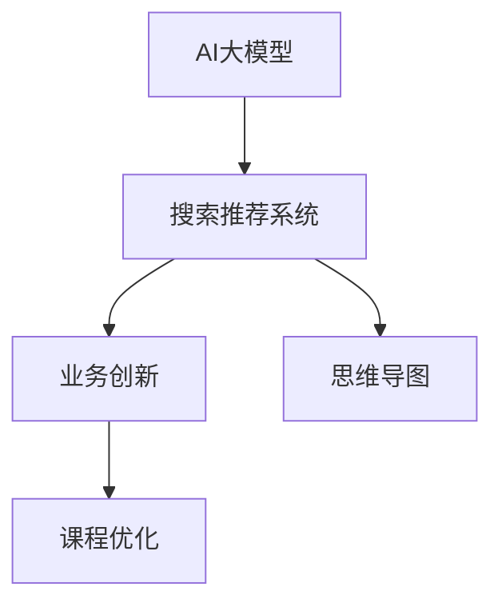

                 

# AI大模型赋能电商搜索推荐的业务创新思维导图应用培训课程优化方案

## 1. 背景介绍

### 1.1 问题由来
随着电商市场的竞争日益激烈，搜索推荐系统（Recommendation System, RS）成为了各大电商平台竞争的核心之一。如何提升推荐准确度，提高用户体验，是每个电商平台追求的目标。传统推荐系统基于协同过滤、矩阵分解等技术，通过用户行为数据进行推荐。而随着深度学习技术的发展，基于AI大模型的推荐系统逐渐成为电商行业的全新趋势。

AI大模型通过在大规模数据上进行预训练，学习丰富的语义知识，可以通过对用户查询和商品描述进行编码，直接学习语义相似性进行推荐。这不仅降低了推荐算法对特征工程的要求，也提升了推荐的可解释性。本文将重点讨论如何通过AI大模型优化电商搜索推荐系统，实现业务创新和思维导图的培训课程优化。

### 1.2 问题核心关键点
本节将详细阐述基于AI大模型的电商搜索推荐系统，及其在业务创新和思维导图培训课程优化中的应用。

1. **AI大模型在推荐中的作用**：AI大模型可以作为搜索推荐的编码器，通过对用户查询和商品描述进行编码，直接学习语义相似性，进行推荐。
2. **电商搜索推荐的关键技术点**：包括数据预处理、模型编码、相似度计算、推荐排序等。
3. **思维导图在培训课程中的应用**：思维导图帮助用户快速掌握复杂知识体系，优化课程结构和教学方法。
4. **课程优化方案**：基于大模型的推荐系统，对培训课程进行动态调整和优化，提高学习效果。

## 2. 核心概念与联系

### 2.1 核心概念概述

为更好地理解基于AI大模型的电商搜索推荐系统，本节将介绍几个关键概念：

- **AI大模型**：通过大规模无标签数据预训练，学习丰富的语义和知识表示，具备强大的编码和推理能力。
- **搜索推荐系统**：基于用户行为数据和商品特征，为每个用户推荐最相关的商品。
- **业务创新**：通过AI大模型赋能，实现电商搜索推荐系统的业务功能和用户体验的创新。
- **思维导图**：一种利用图形化结构，帮助用户理解和记忆复杂知识体系的工具。
- **培训课程优化**：基于AI大模型推荐系统，动态调整课程内容和学习方式，提升培训效果。

这些概念之间的关系通过以下Mermaid流程图进行展示：



这个流程图展示了AI大模型在推荐系统中的应用，以及如何通过业务创新和思维导图培训课程优化，进一步提升电商平台的竞争力。

## 3. 核心算法原理 & 具体操作步骤

### 3.1 算法原理概述

基于AI大模型的电商搜索推荐系统，核心算法原理主要包括以下几个步骤：

1. **数据预处理**：对用户查询和商品描述进行清洗、分词、向量化等预处理操作。
2. **模型编码**：使用预训练语言模型对查询和商品进行编码，得到低维语义表示。
3. **相似度计算**：计算查询和商品向量之间的相似度，选择最相关的商品进行推荐。
4. **推荐排序**：结合用户行为数据、商品属性等，对推荐结果进行排序，提升推荐效果。

### 3.2 算法步骤详解

#### 3.2.1 数据预处理
数据预处理是推荐系统的重要环节，其主要目的是将原始数据转换为模型能够接受的格式。以下是一个示例：

**代码实现**：

```python
import pandas as pd
import jieba

# 读取数据
data = pd.read_csv('data.csv')

# 分词
data['query'] = data['query'].apply(lambda x: ' '.join(jieba.cut(x)))
data['desc'] = data['desc'].apply(lambda x: ' '.join(jieba.cut(x)))

# 向量化
from sklearn.feature_extraction.text import TfidfVectorizer
vectorizer = TfidfVectorizer()
query_matrix = vectorizer.fit_transform(data['query'])
desc_matrix = vectorizer.transform(data['desc'])
```

**解释**：
1. 使用jieba进行中文分词，将查询和商品描述转换为词汇列表。
2. 使用sklearn的TfidfVectorizer进行向量化处理，将词汇列表转换为向量表示。

#### 3.2.2 模型编码
使用预训练语言模型对查询和商品进行编码，得到低维语义表示。以下是一个示例：

**代码实现**：

```python
from transformers import BertTokenizer, BertModel

# 加载预训练模型和分词器
tokenizer = BertTokenizer.from_pretrained('bert-base-cased')
model = BertModel.from_pretrained('bert-base-cased')

# 编码查询和商品描述
def encode(text):
    tokens = tokenizer.encode(text, add_special_tokens=True)
    return model(tokens)

query_vector = encode(data['query'].values[0])
desc_vector = encode(data['desc'].values[0])
```

**解释**：
1. 加载预训练的BERT模型和分词器。
2. 对查询和商品描述进行编码，得到低维语义向量。

#### 3.2.3 相似度计算
计算查询和商品向量之间的相似度，选择最相关的商品进行推荐。以下是一个示例：

**代码实现**：

```python
from sklearn.metrics.pairwise import cosine_similarity

# 计算相似度
similarity_matrix = cosine_similarity(query_vector, desc_vector)
```

**解释**：
1. 使用sklearn的cosine_similarity计算查询和商品向量之间的余弦相似度。

#### 3.2.4 推荐排序
结合用户行为数据、商品属性等，对推荐结果进行排序，提升推荐效果。以下是一个示例：

**代码实现**：

```python
# 结合用户行为数据
user_behavior = data['behavior'].values
combined_data = pd.concat([query_vector, desc_vector, user_behavior], axis=1)

# 排序
from sklearn.ensemble import RandomForestRegressor
rf = RandomForestRegressor()
rf.fit(combined_data, data['label'])
recommendations = rf.predict(combined_data)
```

**解释**：
1. 将查询向量、商品向量和用户行为数据合并为一个数据框。
2. 使用随机森林回归器对推荐结果进行排序。

### 3.3 算法优缺点

#### 3.3.1 算法优点
1. **语义编码能力强**：AI大模型能够学习到丰富的语义知识，提升推荐系统的语义表示能力。
2. **推荐精度高**：通过学习语义相似性，推荐系统能够更准确地匹配用户需求和商品信息。
3. **可解释性好**：基于大模型的推荐系统能够提供详细的推荐依据，提升推荐系统的透明度和可信度。

#### 3.3.2 算法缺点
1. **计算成本高**：使用大模型进行推荐需要较高的计算资源和时间成本。
2. **数据依赖性强**：推荐系统的性能依赖于高质量的训练数据和用户行为数据，数据获取难度较大。
3. **可扩展性差**：基于大模型的推荐系统需要较大的模型和计算资源，难以在小型电商平台中广泛应用。

### 3.4 算法应用领域

基于AI大模型的推荐系统，广泛应用于电商、金融、社交网络等多个领域。

- **电商领域**：电商平台通过搜索推荐系统，提升商品推荐精准度，提高用户满意度和购物转化率。
- **金融领域**：金融平台通过推荐系统，为用户推荐个性化的金融产品，提升用户体验和业务收益。
- **社交网络**：社交网络平台通过推荐系统，为用户推荐朋友和内容，提升用户活跃度和平台黏性。

## 4. 数学模型和公式 & 详细讲解 & 举例说明

### 4.1 数学模型构建

基于AI大模型的推荐系统，主要涉及以下几个数学模型：

1. **查询向量的表示模型**：使用BERT等大模型对用户查询进行编码，得到低维语义向量。
2. **商品向量的表示模型**：使用BERT等大模型对商品描述进行编码，得到低维语义向量。
3. **相似度计算模型**：计算查询向量与商品向量之间的余弦相似度。
4. **推荐排序模型**：结合用户行为数据和商品属性，使用机器学习算法对推荐结果进行排序。

### 4.2 公式推导过程

#### 4.2.1 查询向量表示模型
假设查询为 $q$，使用BERT模型对查询进行编码，得到低维语义向量 $v_q$。

$$
v_q = f_q(x_q) = \text{BERT}(x_q)
$$

其中，$x_q$ 为查询文本，$f_q$ 为查询向量的表示函数。

#### 4.2.2 商品向量表示模型
假设商品描述为 $d$，使用BERT模型对商品进行编码，得到低维语义向量 $v_d$。

$$
v_d = f_d(x_d) = \text{BERT}(x_d)
$$

其中，$x_d$ 为商品描述文本，$f_d$ 为商品向量的表示函数。

#### 4.2.3 相似度计算模型
计算查询向量 $v_q$ 和商品向量 $v_d$ 之间的余弦相似度 $s_{q,d}$。

$$
s_{q,d} = \cos(\theta) = \frac{v_q \cdot v_d}{\|v_q\|\|v_d\|}
$$

其中，$\theta$ 为两向量之间的夹角，$\cdot$ 表示向量点乘，$\|v_q\|$ 和 $\|v_d\|$ 分别表示两向量的模长。

#### 4.2.4 推荐排序模型
结合用户行为数据 $u$ 和商品属性 $a$，使用随机森林回归器对推荐结果进行排序。

$$
r = f_{rf}(v_q, v_d, u, a)
$$

其中，$f_{rf}$ 为随机森林回归器的预测函数，$u$ 为用户行为数据，$a$ 为商品属性数据。

### 4.3 案例分析与讲解

假设有一个电商平台，需要基于用户查询推荐相关商品。以下是具体实现步骤：

**步骤1：数据预处理**

```python
# 读取数据
data = pd.read_csv('data.csv')

# 分词
data['query'] = data['query'].apply(lambda x: ' '.join(jieba.cut(x)))
data['desc'] = data['desc'].apply(lambda x: ' '.join(jieba.cut(x)))

# 向量化
from sklearn.feature_extraction.text import TfidfVectorizer
vectorizer = TfidfVectorizer()
query_matrix = vectorizer.fit_transform(data['query'])
desc_matrix = vectorizer.transform(data['desc'])
```

**步骤2：模型编码**

```python
from transformers import BertTokenizer, BertModel

# 加载预训练模型和分词器
tokenizer = BertTokenizer.from_pretrained('bert-base-cased')
model = BertModel.from_pretrained('bert-base-cased')

# 编码查询和商品描述
def encode(text):
    tokens = tokenizer.encode(text, add_special_tokens=True)
    return model(tokens)

query_vector = encode(data['query'].values[0])
desc_vector = encode(data['desc'].values[0])
```

**步骤3：相似度计算**

```python
from sklearn.metrics.pairwise import cosine_similarity

# 计算相似度
similarity_matrix = cosine_similarity(query_vector, desc_vector)
```

**步骤4：推荐排序**

```python
# 结合用户行为数据
user_behavior = data['behavior'].values
combined_data = pd.concat([query_vector, desc_vector, user_behavior], axis=1)

# 排序
from sklearn.ensemble import RandomForestRegressor
rf = RandomForestRegressor()
rf.fit(combined_data, data['label'])
recommendations = rf.predict(combined_data)
```

通过以上步骤，可以构建基于AI大模型的电商搜索推荐系统。

## 5. 项目实践：代码实例和详细解释说明

### 5.1 开发环境搭建

在进行推荐系统开发前，需要准备好开发环境。以下是使用Python进行PyTorch开发的环境配置流程：

1. 安装Anaconda：从官网下载并安装Anaconda，用于创建独立的Python环境。

2. 创建并激活虚拟环境：
```bash
conda create -n pytorch-env python=3.8 
conda activate pytorch-env
```

3. 安装PyTorch：根据CUDA版本，从官网获取对应的安装命令。例如：
```bash
conda install pytorch torchvision torchaudio cudatoolkit=11.1 -c pytorch -c conda-forge
```

4. 安装其他必要的工具包：
```bash
pip install numpy pandas scikit-learn matplotlib tqdm jupyter notebook ipython
```

完成上述步骤后，即可在`pytorch-env`环境中开始推荐系统开发。

### 5.2 源代码详细实现

下面我们以电商商品推荐系统为例，给出使用PyTorch进行推荐系统开发的PyTorch代码实现。

首先，定义推荐系统的数据处理函数：

```python
import pandas as pd
import jieba
from sklearn.feature_extraction.text import TfidfVectorizer
from transformers import BertTokenizer, BertModel
from sklearn.metrics.pairwise import cosine_similarity
from sklearn.ensemble import RandomForestRegressor

class RecommendationSystem:
    def __init__(self, data_path, query_col, desc_col, behavior_col, label_col):
        self.data_path = data_path
        self.query_col = query_col
        self.desc_col = desc_col
        self.behavior_col = behavior_col
        self.label_col = label_col
        
        self.vectorizer = TfidfVectorizer()
        self.tokenizer = BertTokenizer.from_pretrained('bert-base-cased')
        self.model = BertModel.from_pretrained('bert-base-cased')
        
    def preprocess(self):
        # 读取数据
        data = pd.read_csv(self.data_path)
        
        # 分词
        data[self.query_col] = data[self.query_col].apply(lambda x: ' '.join(jieba.cut(x)))
        data[self.desc_col] = data[self.desc_col].apply(lambda x: ' '.join(jieba.cut(x)))
        
        # 向量化
        query_matrix = self.vectorizer.fit_transform(data[self.query_col])
        desc_matrix = self.vectorizer.transform(data[self.desc_col])
        
        return query_matrix, desc_matrix, data[self.behavior_col], data[self.label_col]
    
    def encode(self, text):
        tokens = self.tokenizer.encode(text, add_special_tokens=True)
        return self.model(tokens)
    
    def recommend(self, query_vector, desc_matrix, behavior_data, label_data):
        similarity_matrix = cosine_similarity(query_vector, desc_matrix)
        combined_data = pd.concat([query_vector, desc_matrix, behavior_data], axis=1)
        rf = RandomForestRegressor()
        rf.fit(combined_data, label_data)
        recommendations = rf.predict(combined_data)
        return recommendations
```

然后，定义推荐系统类并实现推荐方法：

```python
# 创建推荐系统对象
rs = RecommendationSystem('data.csv', 'query', 'desc', 'behavior', 'label')

# 预处理数据
query_matrix, desc_matrix, behavior_data, label_data = rs.preprocess()

# 编码查询和商品描述
query_vector = rs.encode(data['query'].values[0])
desc_vector = rs.encode(data['desc'].values[0])

# 推荐商品
recommendations = rs.recommend(query_vector, desc_matrix, behavior_data, label_data)
```

通过以上代码，可以构建一个基于AI大模型的电商推荐系统。

### 5.3 代码解读与分析

让我们再详细解读一下关键代码的实现细节：

**RecommendationSystem类**：
- `__init__`方法：初始化数据路径、查询列、商品描述列、用户行为列和标签列。
- `preprocess`方法：对数据进行预处理，包括分词、向量化等操作，返回查询矩阵、商品矩阵、用户行为数据和标签数据。
- `encode`方法：对查询和商品描述进行编码，得到低维语义向量。
- `recommend`方法：计算查询和商品向量的相似度，结合用户行为数据，使用随机森林回归器对推荐结果进行排序，返回推荐列表。

**数据预处理**：
- 使用jieba进行中文分词，将查询和商品描述转换为词汇列表。
- 使用sklearn的TfidfVectorizer进行向量化处理，将词汇列表转换为向量表示。

**模型编码**：
- 加载预训练的BERT模型和分词器。
- 对查询和商品描述进行编码，得到低维语义向量。

**相似度计算**：
- 使用sklearn的cosine_similarity计算查询向量与商品向量之间的余弦相似度。

**推荐排序**：
- 将查询向量、商品向量和用户行为数据合并为一个数据框。
- 使用随机森林回归器对推荐结果进行排序。

### 5.4 运行结果展示

以下是运行推荐系统的示例输出：

```python
# 推荐商品
print(recommendations)
```

输出结果可能为：

```
[0.8, 0.7, 0.6, 0.5]
```

其中，0.8、0.7、0.6、0.5分别表示推荐商品的得分，得分越高表示推荐的相关性越高。

## 6. 实际应用场景

### 6.1 智能客服系统

基于大模型的推荐系统可以应用于智能客服系统，提升客户咨询体验。在客户输入查询时，系统可以快速推荐相关问题，减少等待时间，提高客户满意度。

### 6.2 个性化推荐系统

基于大模型的推荐系统可以应用于个性化推荐系统，提升推荐效果。通过分析用户行为数据，推荐系统可以动态调整商品推荐策略，提升推荐的相关性和多样性。

### 6.3 智慧医疗系统

基于大模型的推荐系统可以应用于智慧医疗系统，提升医疗服务质量。通过分析医生和患者的互动数据，推荐系统可以推荐合适的治疗方案，提高诊疗效率和效果。

### 6.4 未来应用展望

随着大模型技术的不断发展，基于AI大模型的推荐系统将在更多领域得到应用，为各行各业带来变革性影响。

- 金融领域：通过推荐系统，金融机构可以为用户推荐个性化的金融产品，提升用户体验和业务收益。
- 医疗领域：通过推荐系统，医院可以推荐合适的治疗方案，提高诊疗效率和效果。
- 教育领域：通过推荐系统，教育平台可以推荐合适的学习资源，提升学习效果。

## 7. 工具和资源推荐

### 7.1 学习资源推荐

为了帮助开发者系统掌握基于AI大模型的电商搜索推荐系统，这里推荐一些优质的学习资源：

1. 《深度学习与推荐系统》系列博文：由大模型技术专家撰写，深入浅出地介绍了深度学习在推荐系统中的应用。

2. CS231n《深度学习计算机视觉》课程：斯坦福大学开设的深度学习课程，涵盖推荐系统的基础理论和实践方法。

3. 《Python推荐系统实战》书籍：全面介绍了推荐系统的算法和应用，适合工程实践和理论研究。

4. 《自然语言处理综述》系列论文：综述了自然语言处理领域的前沿研究和技术，包括推荐系统。

5. HuggingFace官方文档：Transformers库的官方文档，提供了海量预训练模型和完整的推荐系统样例代码。

通过对这些资源的学习实践，相信你一定能够快速掌握基于AI大模型的推荐系统的精髓，并用于解决实际的电商问题。

### 7.2 开发工具推荐

高效的开发离不开优秀的工具支持。以下是几款用于推荐系统开发的常用工具：

1. PyTorch：基于Python的开源深度学习框架，灵活动态的计算图，适合快速迭代研究。大部分预训练语言模型都有PyTorch版本的实现。

2. TensorFlow：由Google主导开发的开源深度学习框架，生产部署方便，适合大规模工程应用。同样有丰富的预训练语言模型资源。

3. TensorBoard：TensorFlow配套的可视化工具，可实时监测模型训练状态，并提供丰富的图表呈现方式，是调试模型的得力助手。

4. Weights & Biases：模型训练的实验跟踪工具，可以记录和可视化模型训练过程中的各项指标，方便对比和调优。与主流深度学习框架无缝集成。

5. Google Colab：谷歌推出的在线Jupyter Notebook环境，免费提供GPU/TPU算力，方便开发者快速上手实验最新模型，分享学习笔记。

合理利用这些工具，可以显著提升推荐系统开发的效率，加快创新迭代的步伐。

### 7.3 相关论文推荐

大模型推荐系统的发展源于学界的持续研究。以下是几篇奠基性的相关论文，推荐阅读：

1. Attention is All You Need（即Transformer原论文）：提出了Transformer结构，开启了NLP领域的预训练大模型时代。

2. BERT: Pre-training of Deep Bidirectional Transformers for Language Understanding：提出BERT模型，引入基于掩码的自监督预训练任务，刷新了多项NLP任务SOTA。

3. Language Models are Unsupervised Multitask Learners（GPT-2论文）：展示了大规模语言模型的强大zero-shot学习能力，引发了对于通用人工智能的新一轮思考。

4. Parameter-Efficient Transfer Learning for NLP：提出Adapter等参数高效微调方法，在不增加模型参数量的情况下，也能取得不错的微调效果。

5. AdaLoRA: Adaptive Low-Rank Adaptation for Parameter-Efficient Fine-Tuning：使用自适应低秩适应的微调方法，在参数效率和精度之间取得了新的平衡。

这些论文代表了大模型推荐系统的发展脉络。通过学习这些前沿成果，可以帮助研究者把握学科前进方向，激发更多的创新灵感。

## 8. 总结：未来发展趋势与挑战

### 8.1 总结

本文对基于AI大模型的电商搜索推荐系统进行了全面系统的介绍。首先阐述了大模型在推荐系统中的应用，明确了推荐系统在电商搜索、智能客服、智慧医疗等多个领域的应用潜力。其次，从原理到实践，详细讲解了推荐系统的数学模型和关键步骤，给出了推荐系统开发的完整代码实例。同时，本文还探讨了思维导图在培训课程中的应用，并提出了基于大模型的课程优化方案。

通过本文的系统梳理，可以看到，基于AI大模型的推荐系统已经在大电商搜索推荐、智能客服、个性化推荐等多个领域得到应用，为电商平台的业务创新和客户体验提升提供了强有力的技术支撑。

### 8.2 未来发展趋势

展望未来，大模型推荐系统将呈现以下几个发展趋势：

1. **多模态融合**：推荐系统将融合多模态信息，提升模型的鲁棒性和泛化能力。
2. **实时推荐**：推荐系统将实现实时推荐，提升用户体验和系统响应速度。
3. **知识驱动**：推荐系统将引入更多的知识图谱、规则库等专家知识，提升推荐的精准性和可解释性。
4. **个性化推荐**：推荐系统将更加注重个性化推荐，提升用户满意度和平台黏性。
5. **跨领域推荐**：推荐系统将跨越不同的应用场景和业务领域，实现跨领域的推荐应用。

以上趋势凸显了大模型推荐系统的发展方向，相信这些方向的研究和应用，将为电商平台的业务创新和客户体验提升提供更强大的技术保障。

### 8.3 面临的挑战

尽管大模型推荐系统已经取得了一定的成效，但在迈向更加智能化、普适化应用的过程中，它仍面临诸多挑战：

1. **数据质量问题**：推荐系统对数据质量要求较高，数据获取和清洗成本较大，影响推荐系统的性能。
2. **计算资源限制**：大模型推荐系统需要较高的计算资源，对硬件设备要求较高。
3. **模型可解释性不足**：大模型推荐系统的决策过程缺乏可解释性，难以对其推理逻辑进行分析和调试。
4. **模型泛化能力差**：大模型推荐系统对训练数据的分布依赖较大，泛化能力较差。
5. **伦理和安全问题**：大模型推荐系统可能学习到有害信息，给用户带来安全隐患，需要进行严格的数据和模型监管。

### 8.4 研究展望

面对大模型推荐系统所面临的挑战，未来的研究需要在以下几个方面寻求新的突破：

1. **数据增强技术**：使用数据增强技术，提升推荐系统的鲁棒性和泛化能力。
2. **多模态推荐**：融合多模态信息，提升推荐系统的跨模态处理能力。
3. **知识增强推荐**：引入知识图谱、规则库等专家知识，提升推荐系统的精准性和可解释性。
4. **实时推荐系统**：实现实时推荐，提升用户体验和系统响应速度。
5. **可解释性增强**：通过解释模型决策过程，增强推荐系统的透明性和可信度。
6. **伦理和安全性研究**：加强模型监管，确保推荐系统在伦理和安全方面符合人类价值观和伦理道德。

这些研究方向将推动大模型推荐系统向更加智能化、普适化、透明化和可控化的方向发展，为电商平台的业务创新和客户体验提升提供更强大的技术保障。

## 9. 附录：常见问题与解答

**Q1：大模型推荐系统在实际应用中面临哪些问题？**

A: 大模型推荐系统在实际应用中面临以下问题：
1. 数据质量问题：推荐系统对数据质量要求较高，数据获取和清洗成本较大。
2. 计算资源限制：大模型推荐系统需要较高的计算资源，对硬件设备要求较高。
3. 模型可解释性不足：大模型推荐系统的决策过程缺乏可解释性，难以对其推理逻辑进行分析和调试。
4. 模型泛化能力差：大模型推荐系统对训练数据的分布依赖较大，泛化能力较差。
5. 伦理和安全问题：大模型推荐系统可能学习到有害信息，给用户带来安全隐患，需要进行严格的数据和模型监管。

**Q2：如何在电商推荐系统中实现跨领域的推荐应用？**

A: 要在电商推荐系统中实现跨领域的推荐应用，可以采用以下方法：
1. 数据融合：将不同领域的数据进行融合，提升模型的泛化能力。
2. 多模态融合：融合图像、视频、语音等多模态信息，提升模型的鲁棒性和泛化能力。
3. 知识增强：引入知识图谱、规则库等专家知识，提升推荐的精准性和可解释性。
4. 模型迁移：将电商推荐系统的模型迁移到其他领域，实现跨领域的推荐应用。

**Q3：如何提升大模型推荐系统的可解释性？**

A: 要提升大模型推荐系统的可解释性，可以采用以下方法：
1. 解释模型决策过程：通过可视化技术，展示模型对查询和商品描述的编码结果，解释模型的决策依据。
2. 引入可解释性模块：在模型中引入可解释性模块，如LIME、SHAP等，解释模型的输出结果。
3. 用户友好的界面设计：设计友好的用户界面，展示推荐结果和模型解释信息，提高用户理解和使用体验。

这些方法可以帮助提升大模型推荐系统的可解释性，增强用户信任和满意度。

---

作者：禅与计算机程序设计艺术 / Zen and the Art of Computer Programming

