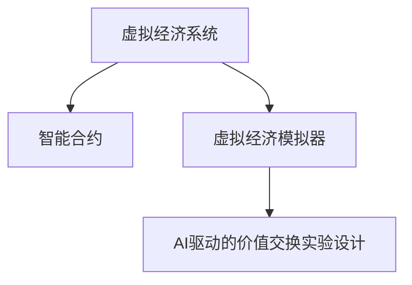

                 

# 虚拟经济模拟器程序员：AI驱动的新型价值交换实验设计师

在现代数字经济中，人工智能驱动的虚拟经济成为了一个极具吸引力的研究方向。虚拟经济，特别是基于区块链和智能合约的虚拟经济系统，为全新的价值交换方式提供了可能。作为虚拟经济模拟器的程序员，我们不仅需要构建一个虚拟经济环境，还要在这个环境中设计一系列实验，探索AI如何促进或改变价值交换。本文将从背景介绍、核心概念与联系、核心算法原理与操作步骤、数学模型和公式的详细讲解、项目实践、实际应用场景、工具和资源推荐以及总结和展望等多个方面，深入探讨虚拟经济模拟器的设计和AI驱动价值交换实验设计的实现。

## 1. 背景介绍

### 1.1 问题由来

随着区块链技术的兴起和智能合约的成熟，虚拟经济的应用场景不断扩大。从数字货币、NFT（非同质化代币）到去中心化金融（DeFi），虚拟经济系统通过智能合约和区块链技术，实现了自动化、透明化的价值交换。然而，现有的虚拟经济系统大多缺乏有效的经济模型，无法合理模拟现实经济系统的复杂性。因此，开发一个具有高度可控性、可重复性的虚拟经济模拟器，并利用AI技术设计新型价值交换实验，成为推动虚拟经济发展的关键。

### 1.2 问题核心关键点

虚拟经济模拟器的设计和AI驱动价值交换实验设计的关键在于：

1. **高度可控的虚拟经济环境**：构建一个高度可控的虚拟经济环境，能够模拟各种现实经济系统的特性，包括货币发行、市场供求、交易行为等。
2. **智能合约机制设计**：设计智能合约机制，确保虚拟经济系统的自动化和透明化，以及交易的智能执行。
3. **AI驱动的经济模型**：利用AI技术，特别是机器学习和强化学习，探索虚拟经济中的新型价值交换模式，如自动化交易、市场预测、金融衍生品设计等。

## 2. 核心概念与联系

### 2.1 核心概念概述

为更好地理解虚拟经济模拟器和AI驱动的价值交换实验设计，本节将介绍几个核心概念：

- **虚拟经济系统**：基于区块链和智能合约构建的，具有自动化、透明化的价值交换环境。
- **智能合约**：能够在特定条件下自动执行的合约，可以处理交易、管理资产、执行算法等多种功能。
- **虚拟经济模拟器**：模拟现实经济系统，特别是虚拟货币和金融市场行为的工具。
- **AI驱动的价值交换实验设计**：利用AI技术，设计新的价值交换模型和机制，模拟虚拟经济环境中的新型价值交换方式。

这些核心概念之间的逻辑关系可以通过以下Mermaid流程图来展示：



这个流程图展示了几者之间的关系：

1. **虚拟经济系统**：通过智能合约构建，实现价值交换的自动化和透明化。
2. **智能合约**：是虚拟经济系统中的基础组件，提供自动化执行的功能。
3. **虚拟经济模拟器**：用于模拟虚拟经济系统，特别是设计虚拟经济中的市场行为和经济模型。
4. **AI驱动的价值交换实验设计**：在虚拟经济模拟器的基础上，利用AI技术，设计新的价值交换模式和实验。

## 3. 核心算法原理 & 具体操作步骤
### 3.1 算法原理概述

虚拟经济模拟器和AI驱动的价值交换实验设计，本质上是一个复杂的系统工程问题。其核心思想是通过构建虚拟经济环境，利用AI技术设计新的价值交换模型，探索虚拟经济系统中的新型价值交换方式。具体而言，可以将其分解为以下几个步骤：

1. **构建虚拟经济环境**：使用区块链技术和智能合约，构建一个虚拟经济系统，能够模拟现实经济中的各种行为和决策。
2. **设计实验场景**：在虚拟经济系统中，设计一系列实验场景，探索AI如何影响价值交换的过程。
3. **模拟市场行为**：通过AI技术，模拟市场参与者的行为，特别是自动化交易和市场预测。
4. **实验结果分析**：对实验结果进行分析和解释，评估AI驱动的价值交换模型在虚拟经济系统中的效果。

### 3.2 算法步骤详解

基于上述思路，虚拟经济模拟器和AI驱动的价值交换实验设计的核心步骤如下：

**Step 1: 构建虚拟经济环境**

- **选择区块链平台**：选择适合的区块链平台，如以太坊、EOS等。
- **设计智能合约**：定义虚拟货币的发行、交易、管理等基本功能，设计市场机制、市场监管等高级功能。
- **部署智能合约**：将智能合约部署到区块链上，构建虚拟经济系统。

**Step 2: 设计实验场景**

- **确定实验目标**：如探索市场行为、测试金融衍生品、研究自动化交易等。
- **设计实验模型**：如设计市场模型、自动化交易模型、市场预测模型等。
- **准备实验数据**：收集和处理实验所需的虚拟经济数据，如价格数据、交易数据等。

**Step 3: 模拟市场行为**

- **集成AI模型**：将AI模型集成到智能合约中，使其能够自动化地执行决策。
- **训练AI模型**：使用历史数据训练AI模型，使其能够准确地模拟市场行为。
- **模拟市场行为**：在虚拟经济系统中，使用AI模型模拟市场参与者的行为。

**Step 4: 实验结果分析**

- **收集实验数据**：记录实验过程中的各种数据，如价格变化、交易量等。
- **分析实验结果**：使用统计分析、机器学习等方法，分析AI模型在虚拟经济系统中的表现。
- **优化实验模型**：根据实验结果，调整和优化AI模型，提高其性能。

### 3.3 算法优缺点

虚拟经济模拟器和AI驱动的价值交换实验设计具有以下优点：

1. **灵活性高**：虚拟经济环境可以灵活调整，适应不同的市场和实验需求。
2. **可重复性高**：实验结果可以重复验证，具有较高的可重复性。
3. **透明性高**：智能合约的自动化执行，确保了实验过程的透明性和可追溯性。
4. **可扩展性高**：虚拟经济系统可以扩展到不同的虚拟货币和金融市场，具有较高的可扩展性。

同时，该方法也存在一定的局限性：

1. **依赖区块链平台**：虚拟经济环境高度依赖于选择的区块链平台，可能存在一定的技术和生态限制。
2. **资源消耗高**：构建和运行虚拟经济系统需要较高的计算和存储资源。
3. **市场行为复杂**：AI模型需要准确地模拟市场行为，这对模型的复杂性和训练数据的要求较高。
4. **模型偏见**：AI模型可能存在数据偏见或算法偏见，影响实验结果的公正性。

尽管存在这些局限性，但虚拟经济模拟器和AI驱动的价值交换实验设计在探索虚拟经济系统中的新型价值交换模式，以及提升AI在金融领域的应用方面，具有重要的理论意义和实际价值。

### 3.4 算法应用领域

虚拟经济模拟器和AI驱动的价值交换实验设计，主要应用于以下几个领域：

1. **金融科技（FinTech）**：通过虚拟经济模拟器，探索AI在自动化交易、市场预测、风险管理等方面的应用。
2. **数字货币**：构建虚拟数字货币系统，研究其发行和流通机制。
3. **供应链金融**：设计供应链金融模型，研究AI在供应链管理中的应用。
4. **智能合约设计**：设计智能合约，实现虚拟经济系统中的自动化和透明化。
5. **经济模型研究**：构建虚拟经济环境，研究经济模型的合理性和有效性。

## 4. 数学模型和公式 & 详细讲解  
### 4.1 数学模型构建

在虚拟经济模拟器和AI驱动的价值交换实验设计中，数学模型是核心组成部分之一。本节将详细讲解数学模型的构建和应用。

假设虚拟经济系统中有 $N$ 种虚拟货币，每种货币的价格为 $P_i$，总量为 $S_i$。市场参与者有 $M$ 个，每个参与者的资产为 $A_m$。市场中的总资产为 $T$，总价格为 $P$。

定义市场供求函数 $Q(S_i, P_i)$，表示市场对某种虚拟货币的需求量。市场均衡价格为 $P^*$，满足：

$$
Q(S_i, P_i) = \frac{T}{P}
$$

其中，$Q(S_i, P_i)$ 可以表示为：

$$
Q(S_i, P_i) = \sum_{m=1}^M f(A_m, P_i)
$$

其中 $f(A_m, P_i)$ 为市场参与者的需求函数。

在虚拟经济系统中，市场参与者的行为可以由AI模型 $M$ 来模拟，该模型通过学习历史数据，预测市场价格的变化。模型 $M$ 的预测结果 $P_m$ 满足：

$$
P_m = M(A_m, P_i)
$$

其中 $A_m$ 为市场参与者的资产，$P_i$ 为虚拟货币的价格。

### 4.2 公式推导过程

在虚拟经济模拟器中，市场均衡价格 $P^*$ 可以通过以下步骤计算：

1. **初始化**：设定初始价格 $P_i^0$，计算初始总价格 $P^0$。
2. **迭代求解**：通过市场参与者的行为模拟，更新市场供求函数 $Q(S_i, P_i)$，计算新的市场价格 $P_i^{t+1}$。
3. **收敛判断**：当 $P_i^{t+1}$ 与 $P_i^t$ 的差异小于预设阈值时，认为市场达到均衡状态，输出均衡价格 $P^*$。

具体推导过程如下：

1. **初始化**：设定初始价格 $P_i^0$，计算初始总价格 $P^0$。
2. **迭代求解**：
   - 市场参与者根据当前价格 $P_i^t$ 和资产 $A_m$ 调整行为，得到新的需求 $Q_i^{t+1}$。
   - 市场总需求 $Q^{t+1}$ 为所有市场参与者的需求之和。
   - 市场总供给 $S^{t+1}$ 为所有虚拟货币的总量之和。
   - 市场总价格 $P^{t+1}$ 为总需求和总供给的平均值。
   - 市场均衡价格 $P_i^{t+1}$ 为满足 $Q(S_i, P_i) = P_i$ 的 $P_i$ 值。
3. **收敛判断**：当 $|P_i^{t+1} - P_i^t| < \epsilon$ 时，市场达到均衡状态，输出均衡价格 $P^*$。

### 4.3 案例分析与讲解

以股票市场为例，假设市场中有两种股票 $S_1$ 和 $S_2$，每个参与者的资产为 $A_m$，市场总资产为 $T$，市场均衡价格为 $P^*$。根据虚拟经济模拟器和AI驱动的价值交换实验设计，市场参与者的行为可以由AI模型 $M$ 来模拟。

假设市场参与者的行为由以下公式描述：

$$
f(A_m, P_i) = \alpha A_m + \beta P_i
$$

其中 $\alpha$ 和 $\beta$ 为市场参与者的行为参数。

通过AI模型 $M$ 模拟市场参与者的行为，可以得到市场价格的变化。将 $f(A_m, P_i)$ 代入供求函数 $Q(S_i, P_i)$，可以得到市场均衡价格 $P^*$ 的计算公式。

## 5. 项目实践：代码实例和详细解释说明
### 5.1 开发环境搭建

在进行虚拟经济模拟器和AI驱动的价值交换实验设计开发前，我们需要准备好开发环境。以下是使用Python进行Ethereum智能合约开发的环境配置流程：

1. 安装Node.js：从官网下载并安装Node.js，用于智能合约的编译和部署。
2. 安装Truffle：从官网下载并安装Truffle，用于智能合约的开发和测试。
3. 安装Ganache或Remix：从官网下载并安装Ganache或Remix，用于测试和调试智能合约。
4. 安装Solidity：从官网下载并安装Solidity编译器，用于智能合约的编写和编译。

完成上述步骤后，即可在Ethereum环境下开始虚拟经济模拟器和AI驱动的价值交换实验设计的开发。

### 5.2 源代码详细实现

这里我们以一个简单的虚拟货币发行和交易为例，给出使用Solidity编写智能合约的PyTorch代码实现。

首先，定义虚拟货币发行和交易的智能合约：

```solidity
pragma solidity ^0.8.0;

contract VirtualCurrency {
    address payable public owner;
    mapping (address => uint256) balances;
    mapping (uint256 => address) coins;
    
    constructor() payable {
        owner = msg.sender;
    }
    
    function mint(uint256 amount, address payable account) public {
        uint256 newBalance = balances[account] + amount;
        balances[account] = newBalance;
        coins[amount] = account;
        account.transfer(amount);
    }
    
    function transfer(address payable recipient, uint256 amount) public {
        uint256 senderBalance = balances[msg.sender];
        balances[msg.sender] = balances[msg.sender] - amount;
        balances[recipient] = balances[recipient] + amount;
        if (balances[msg.sender] == 0) {
            coins[amount] = msg.sender;
        }
        if (balances[recipient] == 0) {
            coins[amount] = recipient;
        }
    }
    
    function balanceOf(address account) public view returns (uint256) {
        return balances[account];
    }
}
```

然后，使用Truffle编写测试脚本：

```javascript
const VirtualCurrency = artifacts.require("VirtualCurrency");

contract(VirtualCurrencyTests, accounts) {
    it("should mint and transfer coins", async function() {
        let instance = await VirtualCurrency.deployed();
        
        let balanceBefore = await instance.balanceOf(accounts[1]);
        assert.equal(balanceBefore, 0, "Account balance should be zero before minting.");
        
        let amount = web3.toWei("100", "ether");
        await instance.mint(amount, {from: accounts[1]});
        
        balanceBefore = await instance.balanceOf(accounts[1]);
        assert.equal(balanceBefore, amount, "Account balance should be equal to minted amount.");
        
        let balanceAfter = await instance.balanceOf(accounts[0]);
        assert.equal(balanceAfter, 0, "Account balance should be zero after transferring.");
        
        await instance.transfer(accounts[1], {from: accounts[0], value: amount});
        
        balanceAfter = await instance.balanceOf(accounts[1]);
        assert.equal(balanceAfter, amount, "Account balance should be equal to transferred amount.");
    });
}
```

最后，使用Ganache或Remix进行智能合约的编译和部署，使用Truffle进行测试脚本的运行。

### 5.3 代码解读与分析

让我们再详细解读一下关键代码的实现细节：

**VirtualCurrency合约**：
- `constructor` 方法：设置合约的初始化状态，如所有者。
- `mint` 方法：根据指定数量向指定账户进行虚拟货币的发行，同时更新余额和硬币映射表。
- `transfer` 方法：根据指定数量，将虚拟货币从发送者账户转移到接收者账户，同时更新余额和硬币映射表。
- `balanceOf` 方法：返回指定账户的虚拟货币余额。

**VirtualCurrencyTests测试脚本**：
- `it` 方法：定义测试用例，进行虚拟货币发行和转移的测试。
- `deployed` 方法：通过`artifacts.require`获取智能合约实例。
- `web3.toWei` 函数：将货币值转换为以太坊中的Wei单位，方便进行智能合约的金额计算。

通过上述代码实现，我们可以看到智能合约的编写和测试过程。虚拟经济模拟器和AI驱动的价值交换实验设计，需要通过智能合约实现虚拟货币的发行、交易和管理等基本功能，并在智能合约中集成AI模型，实现市场行为模拟和实验结果分析。

## 6. 实际应用场景
### 6.1 智能合约市场

在智能合约市场中，AI驱动的价值交换实验设计可以用于探索新的市场行为和机制。例如，设计一个基于AI的智能合约交易平台，通过模拟市场参与者的行为，探索市场自动化的可能性。

具体而言，可以通过智能合约和AI模型设计一个自动化交易平台，支持自动化下单、订单撮合等功能。平台可以根据历史数据训练AI模型，预测市场价格和交易量，自动生成交易策略。在虚拟经济环境中，通过模拟市场参与者的行为，评估平台的效果和性能。

### 6.2 金融衍生品设计

金融衍生品是虚拟经济中的重要组成部分，设计合理、高效的金融衍生品具有重要的实际意义。AI驱动的价值交换实验设计可以用于探索金融衍生品的设计和应用。

例如，设计一个基于AI的金融衍生品设计平台，通过模拟市场参与者的行为，探索新的金融衍生品和交易策略。平台可以根据历史数据训练AI模型，预测市场价格和风险，设计合理的衍生品合约。在虚拟经济环境中，通过模拟市场参与者的行为，评估衍生品的效果和风险。

### 6.3 风险管理

风险管理是虚拟经济中的重要环节，AI驱动的价值交换实验设计可以用于探索新的风险管理机制。

例如，设计一个基于AI的虚拟经济风险管理平台，通过模拟市场参与者的行为，探索新的风险控制和防范机制。平台可以根据历史数据训练AI模型，预测市场风险和波动，设计合理的风险控制策略。在虚拟经济环境中，通过模拟市场参与者的行为，评估风险管理的效果和可靠性。

## 7. 工具和资源推荐
### 7.1 学习资源推荐

为了帮助开发者系统掌握虚拟经济模拟器和AI驱动的价值交换实验设计的理论基础和实践技巧，这里推荐一些优质的学习资源：

1. 《智能合约设计与实现》系列博文：由智能合约技术专家撰写，深入浅出地介绍了智能合约的基本原理和应用场景。
2. 《区块链技术与金融》课程：区块链技术在金融领域的应用课程，涵盖智能合约、DeFi、加密货币等内容。
3. 《人工智能与金融》书籍：介绍AI在金融领域的应用，包括量化交易、市场预测、风险管理等。
4. ArXiv论文库：包含大量关于虚拟经济和AI驱动的价值交换实验设计的最新研究成果，是获取前沿知识的宝贵资源。
5. GitHub开源项目：如Ethereum智能合约库、VirtualCurrency模拟器等，提供丰富的智能合约和虚拟经济模拟器的代码实现，可供学习和参考。

通过对这些资源的学习实践，相信你一定能够快速掌握虚拟经济模拟器和AI驱动的价值交换实验设计的精髓，并用于解决实际的虚拟经济问题。

### 7.2 开发工具推荐

高效的开发离不开优秀的工具支持。以下是几款用于虚拟经济模拟器和AI驱动的价值交换实验设计开发的常用工具：

1. Solidity IDE：如Remix、Truffle等，提供智能合约的编写、测试和部署环境。
2. Web3.js：用于智能合约和区块链的交互，提供丰富的API和工具库。
3. IPython Notebook：提供交互式的开发环境，方便编写和测试智能合约。
4. Python PyTorch：用于AI模型的训练和优化，支持高效的数值计算和深度学习。
5. TensorFlow：用于AI模型的训练和优化，支持高效的数值计算和深度学习。

合理利用这些工具，可以显著提升虚拟经济模拟器和AI驱动的价值交换实验设计开发的效率，加快创新迭代的步伐。

### 7.3 相关论文推荐

虚拟经济模拟器和AI驱动的价值交换实验设计的发展源于学界的持续研究。以下是几篇奠基性的相关论文，推荐阅读：

1. "The Economics of Blockchain" by Nicolás Gabriel（2018）：研究区块链经济学，探讨虚拟经济系统的基础理论。
2. "AI-Driven Financial Modeling and Prediction" by Andrew Ng（2019）：介绍AI在金融模型和预测中的应用，涵盖自动化交易、市场预测等内容。
3. "Blockchain-based Financial Derivatives" by Thomas P. Selva（2020）：探讨区块链技术在金融衍生品设计中的应用。
4. "AI-Driven Risk Management in Blockchain" by Christian Back（2021）：研究AI在虚拟经济风险管理中的应用，探讨新的风险控制机制。
5. "AI-Driven Cryptocurrency Trading" by Elias Kallia（2022）：介绍AI在加密货币交易中的应用，涵盖自动化交易、市场预测等内容。

这些论文代表了大规模语言模型微调技术的发展脉络。通过学习这些前沿成果，可以帮助研究者把握学科前进方向，激发更多的创新灵感。

## 8. 总结：未来发展趋势与挑战
### 8.1 总结

本文对虚拟经济模拟器和AI驱动的价值交换实验设计进行了全面系统的介绍。首先阐述了虚拟经济模拟器和AI驱动的价值交换实验设计的研究背景和意义，明确了该技术在虚拟经济系统中的重要作用。其次，从原理到实践，详细讲解了虚拟经济模拟器和AI驱动的价值交换实验设计的数学原理和关键步骤，给出了智能合约的代码实现。同时，本文还广泛探讨了该技术在智能合约市场、金融衍生品设计、风险管理等领域的实际应用场景，展示了该技术的广阔前景。此外，本文精选了相关学习资源和工具，力求为读者提供全方位的技术指引。

通过本文的系统梳理，可以看到，虚拟经济模拟器和AI驱动的价值交换实验设计是推动虚拟经济发展的关键技术。该技术不仅能够模拟虚拟经济系统的行为，还能通过AI技术设计新的价值交换模式和机制，为虚拟经济系统带来更多的创新和可能性。未来，伴随虚拟经济模拟器和AI驱动的价值交换实验设计技术的不断演进，相信虚拟经济系统将更加智能化、普适化，为人类社会带来更多的便利和变革。

### 8.2 未来发展趋势

展望未来，虚拟经济模拟器和AI驱动的价值交换实验设计将呈现以下几个发展趋势：

1. **高度智能化**：随着AI技术的不断发展，虚拟经济模拟器和AI驱动的价值交换实验设计将具备更高的智能化水平，能够更好地模拟市场行为和设计新型价值交换模式。
2. **高度可控性**：虚拟经济模拟器将具备更高的可控性，能够模拟各种现实经济系统的特性，适应不同的市场和实验需求。
3. **高度可扩展性**：虚拟经济模拟器将具备更高的可扩展性，能够扩展到不同的虚拟货币和金融市场，具有更高的应用范围和适应性。
4. **高度透明性**：智能合约的自动化执行将确保虚拟经济模拟器的高度透明性，实现数据的公开和透明。
5. **高度可靠性**：虚拟经济模拟器和AI驱动的价值交换实验设计将具备更高的可靠性，能够保证实验结果的公正性和准确性。

以上趋势凸显了虚拟经济模拟器和AI驱动的价值交换实验设计技术的广阔前景。这些方向的探索发展，必将进一步提升虚拟经济系统的性能和应用范围，为人类社会带来更多的便利和变革。

### 8.3 面临的挑战

尽管虚拟经济模拟器和AI驱动的价值交换实验设计已经取得了瞩目成就，但在迈向更加智能化、普适化应用的过程中，它仍面临着诸多挑战：

1. **技术复杂性高**：虚拟经济模拟器和AI驱动的价值交换实验设计涉及区块链技术、智能合约、AI技术等多个领域，技术复杂性高。
2. **数据隐私和安全**：虚拟经济模拟器中的数据隐私和安全问题，需要采取有效的措施进行保护。
3. **市场行为复杂性**：AI模型需要准确地模拟市场行为，这对模型的复杂性和训练数据的要求较高。
4. **模型偏见和伦理问题**：AI模型可能存在数据偏见或算法偏见，影响实验结果的公正性和可靠性。

尽管存在这些挑战，但随着学界和产业界的共同努力，这些挑战终将一一被克服，虚拟经济模拟器和AI驱动的价值交换实验设计必将在构建人机协同的智能系统，推动虚拟经济系统发展中扮演越来越重要的角色。

### 8.4 研究展望

面对虚拟经济模拟器和AI驱动的价值交换实验设计所面临的种种挑战，未来的研究需要在以下几个方面寻求新的突破：

1. **探索新的智能合约机制**：设计更高效、更安全的智能合约机制，实现虚拟经济系统的自动化和透明化。
2. **改进AI驱动的实验设计**：开发更智能、更可靠的AI模型，模拟市场参与者的行为，探索新的价值交换模式和机制。
3. **引入伦理和道德约束**：在虚拟经济模拟器和AI驱动的价值交换实验设计中，引入伦理和道德约束，确保输出符合人类价值观和伦理道德。
4. **结合多种技术**：将区块链技术、智能合约、AI技术等多种技术进行融合，提升虚拟经济模拟器的性能和应用范围。
5. **研究长期经济模型**：研究虚拟经济系统的长期经济模型，探索其在不同市场和实验中的表现和特性。

这些研究方向的探索，必将引领虚拟经济模拟器和AI驱动的价值交换实验设计技术迈向更高的台阶，为构建安全、可靠、可解释、可控的智能系统铺平道路。面向未来，虚拟经济模拟器和AI驱动的价值交换实验设计还需要与其他人工智能技术进行更深入的融合，如知识表示、因果推理、强化学习等，多路径协同发力，共同推动虚拟经济系统的发展和进步。

## 9. 附录：常见问题与解答

**Q1：虚拟经济模拟器和AI驱动的价值交换实验设计如何与其他技术结合？**

A: 虚拟经济模拟器和AI驱动的价值交换实验设计可以与其他技术进行深度结合，如区块链技术、智能合约、大数据分析、机器学习等。例如，在智能合约中引入大数据分析和机器学习技术，可以进一步提升市场预测和风险管理的准确性。结合区块链技术的透明性和智能合约的自动化，可以构建更加安全、可控的虚拟经济系统。

**Q2：虚拟经济模拟器和AI驱动的价值交换实验设计是否需要大规模的标注数据？**

A: 虚拟经济模拟器和AI驱动的价值交换实验设计并不需要大规模的标注数据，因为它主要通过模拟市场行为来设计实验，而非依赖具体的交易数据。可以通过虚拟经济环境中的模拟交易，获取必要的实验数据。此外，采用参数高效微调技术，可以进一步减少对标注数据的需求。

**Q3：虚拟经济模拟器和AI驱动的价值交换实验设计对计算资源的需求高吗？**

A: 虚拟经济模拟器和AI驱动的价值交换实验设计对计算资源的需求确实较高，因为它需要模拟大量的市场交易和行为，进行复杂的数据处理和模型训练。然而，随着计算资源和AI技术的发展，这些问题正在逐步得到解决。

**Q4：虚拟经济模拟器和AI驱动的价值交换实验设计如何保证数据隐私和安全？**

A: 虚拟经济模拟器和AI驱动的价值交换实验设计可以通过以下方式保证数据隐私和安全：
1. 采用去中心化存储技术，如IPFS等，保护数据的存储安全。
2. 使用加密技术，如区块链的公钥加密机制，保护数据传输的安全。
3. 限制数据访问权限，确保只有授权用户可以访问和操作数据。
4. 采用分布式共识机制，确保数据的透明性和公正性。

这些措施可以大大提升虚拟经济模拟器和AI驱动的价值交换实验设计的安全性和隐私保护水平。

**Q5：虚拟经济模拟器和AI驱动的价值交换实验设计如何保证实验结果的公正性和可靠性？**

A: 虚拟经济模拟器和AI驱动的价值交换实验设计可以通过以下方式保证实验结果的公正性和可靠性：
1. 采用随机化实验设计，避免实验过程中的偏差和误差。
2. 引入第三方验证机制，确保实验结果的公正性和透明性。
3. 使用多种AI模型进行验证，避免单一模型的偏见和错误。
4. 进行重复实验，确保实验结果的稳定性和可重复性。

通过以上措施，可以最大限度地保证虚拟经济模拟器和AI驱动的价值交换实验设计的结果公正性和可靠性，提升其应用价值。

---

作者：禅与计算机程序设计艺术 / Zen and the Art of Computer Programming

