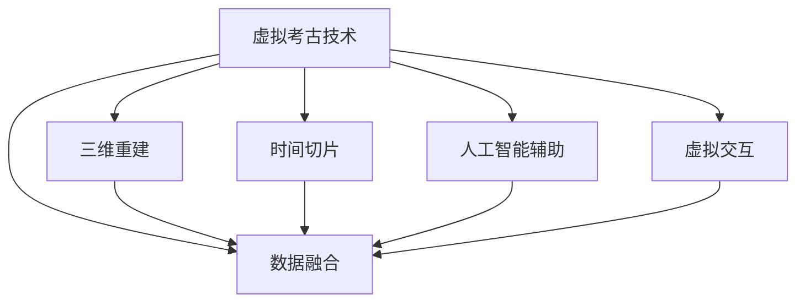

                 

# 虚拟考古技术:全球脑辅助的历史研究新方法

## 1. 背景介绍

### 1.1 问题由来
随着全球化的推进和信息技术的发展，历史研究日益成为一项跨学科、跨地域、跨文化的重要工作。传统考古学依靠人工发掘、记录和分析，存在工作量庞大、精度有限、保护困难等诸多问题。随着虚拟现实(VR)、增强现实(AR)、人工智能(AI)等技术的不断成熟，基于计算机技术的虚拟考古技术（Virtual Archaeology Technology, VAT）应运而生。VAT通过数字化手段对历史遗址进行重建和分析，弥补了传统考古方法的不足，开创了历史研究的新纪元。

### 1.2 问题核心关键点
虚拟考古技术将计算机技术、数字复原技术、地理信息系统(GIS)与历史学、考古学等领域深度融合，实现对历史遗址的虚拟重现和分析。其核心关键点包括：

- 三维重建：利用激光扫描、摄影测量等技术，将考古遗址数字化重构。
- 数据融合：将多种数据源（如卫星影像、遥感数据、历史文献等）融合到同一平台。
- 时间切片：通过时间序列数据分析，研究历史遗址演变过程。
- 人工智能辅助：使用机器学习、深度学习等算法，辅助历史遗址的自动识别、分类和修复。
- 虚拟交互：通过VR、AR等技术，让研究人员能够沉浸式地探索历史遗址。

虚拟考古技术不仅推动了历史学的数字化、可视化、智能化，还为历史研究提供了新的视角和方法，极大地提升了历史研究的效率和精度。

### 1.3 问题研究意义
虚拟考古技术具有以下重要意义：

1. **保护遗产**：数字化重建减少了对真实遗址的物理破坏，为文化遗产的保护提供了新的手段。
2. **提升研究效率**：利用计算机技术可以快速分析海量考古数据，缩短研究周期。
3. **增强可及性**：虚拟考古平台可以让无法亲临现场的研究者通过网络访问遗址，拓宽了历史研究的受众面。
4. **促进多学科融合**：结合历史学、考古学、计算机科学等多学科知识，深化对历史遗址的理解。
5. **揭示历史真相**：通过计算机辅助分析，可以获得传统方法难以得到的证据和见解。

## 2. 核心概念与联系

### 2.1 核心概念概述

为更好地理解虚拟考古技术的工作原理和关键步骤，本节将介绍几个关键概念：

- 虚拟考古技术（VAT）：通过计算机技术对历史遗址进行数字化重建和分析，提供新的考古手段和方法。
- 三维重建（3D Reconstruction）：利用多种技术手段，将考古遗址进行数字化重构，生成三维模型。
- 数据融合（Data Fusion）：将不同来源的数据整合到同一平台，提高数据的完整性和可用性。
- 时间切片（Temporal Slicing）：通过分析历史遗址的时间序列数据，研究其演变过程。
- 人工智能辅助（AI-Assisted）：使用机器学习、深度学习等算法，辅助历史遗址的自动识别、分类和修复。
- 虚拟交互（Virtual Interaction）：通过VR、AR等技术，增强研究人员对历史遗址的沉浸式体验。

这些核心概念之间的逻辑关系可以通过以下Mermaid流程图来展示：



这个流程图展示了大语言模型的核心概念及其之间的关系：

1. 虚拟考古技术通过三维重建、数据融合、时间切片、人工智能辅助、虚拟交互等手段，实现对历史遗址的全面数字化重现和分析。
2. 三维重建和数据融合为后续分析提供基础数据支持。
3. 时间切片和人工智能辅助提升分析的深度和精度。
4. 虚拟交互增强了研究人员的体验和理解。

这些概念共同构成了虚拟考古技术的实施框架，使得历史研究能够在数字空间中得以高效、精确地进行。

## 3. 核心算法原理 & 具体操作步骤
### 3.1 算法原理概述

虚拟考古技术融合了计算机科学、数字复原技术、考古学等领域的知识。其核心算法原理主要包括以下几个方面：

- **三维重建算法**：通过激光扫描、摄影测量等技术，将考古遗址转换为三维模型。
- **数据融合算法**：将卫星影像、遥感数据、历史文献等多种数据源进行融合，生成综合数据集。
- **时间切片算法**：通过时间序列数据分析，重建历史遗址的演变过程。
- **人工智能辅助算法**：使用机器学习、深度学习等技术，辅助历史遗址的自动识别、分类和修复。
- **虚拟交互算法**：通过VR、AR等技术，增强研究人员对历史遗址的沉浸式体验。

这些算法的实现和优化，是虚拟考古技术成功应用的关键。

### 3.2 算法步骤详解

虚拟考古技术的具体操作流程主要包括以下几个关键步骤：

**Step 1: 数据采集和预处理**
- 采集考古遗址的激光扫描数据、卫星影像、遥感数据、历史文献等。
- 使用激光扫描设备生成点云数据，转换为三维模型。
- 对多种数据源进行格式转换和对齐，保证数据的一致性。
- 对数据进行清洗和去噪处理，去除冗余信息和噪声。

**Step 2: 三维重建**
- 使用激光扫描数据生成点云模型。
- 将点云模型转化为三角形网格模型(Triangulated Mesh Model, TMM)。
- 对模型进行纹理贴图，添加历史遗址的细节信息。

**Step 3: 数据融合**
- 将卫星影像、遥感数据、历史文献等整合到同一平台。
- 对不同数据源进行时空校正，确保数据的一致性。
- 使用地理信息系统(GIS)技术，将数据融合到统一的坐标系下。

**Step 4: 时间切片**
- 通过分析历史遗址的时间序列数据，重建其演变过程。
- 使用时间切片技术，将历史遗址分为多个时间节点，进行对比分析。
- 利用GIS技术，可视化展示历史遗址在不同时间节点的变化。

**Step 5: 人工智能辅助**
- 使用机器学习算法，对历史遗址进行自动识别和分类。
- 利用深度学习算法，对历史遗址进行修复和重建。
- 通过自然语言处理(NLP)技术，对历史文献进行语义分析和提取。

**Step 6: 虚拟交互**
- 利用VR、AR等技术，增强研究人员对历史遗址的沉浸式体验。
- 开发虚拟考古平台，支持虚拟漫游、交互探索等功能。
- 集成虚拟现实设备，如头显、手柄等，提供更加丰富的交互体验。

以上算法步骤详细说明了虚拟考古技术从数据采集、处理到分析、可视化的全流程。

### 3.3 算法优缺点

虚拟考古技术在历史研究中具有以下优点：

1. **高效性**：利用计算机技术可以快速处理大量考古数据，缩短研究周期。
2. **高精度**：数字化重建和分析可以精确还原历史遗址的形态和演变过程。
3. **可重复性**：数字化数据可以反复分析和研究，减少人为误差。
4. **跨学科融合**：结合历史学、考古学、计算机科学等多学科知识，提升研究深度。
5. **可扩展性**：数字化手段可以用于不同历史遗址的研究，具有广泛的应用前景。

同时，虚拟考古技术也存在一些缺点：

1. **成本高**：激光扫描、卫星影像、GIS等技术成本较高，设备和技术门槛较高。
2. **数据准确性**：数据采集和处理过程中可能存在误差，影响分析结果的准确性。
3. **可理解性**：虚拟交互和AI辅助技术仍存在一定的技术壁垒，可能影响研究的可理解性。
4. **伦理问题**：虚拟考古可能涉及版权、隐私等问题，需要制定相应的伦理规范。
5. **虚拟与现实分离**：虚拟考古可能无法完全替代现场考古，需要结合实际情况进行补充。

尽管存在这些缺点，虚拟考古技术仍是大数据、数字化时代的重要手段，未来将在历史研究中发挥更加重要的作用。

### 3.4 算法应用领域

虚拟考古技术在多个领域得到了广泛应用，具体包括：

1. **遗址考古**：通过激光扫描、卫星影像等技术，对考古遗址进行数字化重建和分析。
2. **文化遗产保护**：利用数字化手段保护历史遗址，防止物理破坏。
3. **历史研究**：结合历史文献、考古数据，揭示历史真相，提升研究效率。
4. **教育培训**：开发虚拟考古平台，支持历史遗址的虚拟漫游和交互探索，增强学生的学习体验。
5. **公众参与**：通过虚拟考古平台，让公众参与历史遗址的数字化保护和研究。

## 4. 数学模型和公式 & 详细讲解  
### 4.1 数学模型构建

本节将使用数学语言对虚拟考古技术的关键算法进行更加严格的刻画。

### 4.2 公式推导过程

以三维重建算法为例，推导其核心公式：

设考古遗址的激光扫描点云数据为 $\mathbf{P}=\{\mathbf{p}_i\}_{i=1}^N$，其中 $\mathbf{p}_i=(x_i,y_i,z_i)$。

首先，利用激光扫描设备生成点云数据，表示为 $\mathbf{P}$。

其次，将点云数据转化为三角形网格模型（TMM），表示为 $\mathbf{T}$，其中每个三角形顶点由点云数据中相邻三点组成。

最后，对三角形网格模型进行纹理贴图，生成完整的TMM模型。

具体过程如下：

**Step 1: 点云数据预处理**
- 将激光扫描点云数据 $\mathbf{P}$ 进行归一化处理，确保数据一致性。
- 对点云数据进行下采样，减小数据量，提高处理效率。
- 使用K-means算法对点云数据进行聚类，分组处理。

**Step 2: 生成三角形网格模型**
- 对每个点云数据点 $\mathbf{p}_i$，找到其相邻的三点 $\mathbf{p}_{i-1}, \mathbf{p}_{i+1}, \mathbf{p}_{i+2}$。
- 根据这三点，计算三角形 $\triangle (\mathbf{p}_i, \mathbf{p}_{i-1}, \mathbf{p}_{i+1})$ 的面积和重心，生成三角形网格模型 $\mathbf{T}$。

**Step 3: 纹理贴图**
- 对每个三角形 $\mathbf{t}_j \in \mathbf{T}$，找到其对应的点云数据点 $\mathbf{p}_{j_1}, \mathbf{p}_{j_2}, \mathbf{p}_{j_3}$。
- 将点云数据点的颜色信息 $\mathbf{C}_j$ 映射到三角形上，生成完整的TMM模型。

### 4.3 案例分析与讲解

以中国敦煌莫高窟的数字化重建为例，展示虚拟考古技术的应用。

莫高窟是世界上现存规模最大、内容最丰富的佛教艺术宝库。由于历史和环境原因，其壁画、彩塑等文物受到严重破坏。利用虚拟考古技术，可以对莫高窟进行数字化重建，实现对其历史形态和演变过程的研究。

具体步骤如下：

**Step 1: 数据采集**
- 使用激光扫描设备采集莫高窟的激光扫描数据，生成点云模型。
- 利用卫星影像数据，对点云模型进行校正和对齐。

**Step 2: 三维重建**
- 将点云模型转化为三角形网格模型（TMM），生成完整的莫高窟模型。
- 对莫高窟模型进行纹理贴图，添加细节信息。

**Step 3: 数据融合**
- 将卫星影像、历史文献等数据整合到同一平台。
- 对不同数据源进行时空校正，确保数据一致性。

**Step 4: 时间切片**
- 通过分析莫高窟的时间序列数据，重建其演变过程。
- 使用GIS技术，可视化展示莫高窟在不同时间节点的变化。

**Step 5: 人工智能辅助**
- 使用机器学习算法，对莫高窟的壁画、彩塑等文物进行自动识别和分类。
- 利用深度学习算法，对损坏文物进行修复和重建。

**Step 6: 虚拟交互**
- 利用VR、AR等技术，增强研究人员对莫高窟的沉浸式体验。
- 开发虚拟考古平台，支持虚拟漫游、交互探索等功能。

通过虚拟考古技术，研究人员可以直观地观察莫高窟的历史演变，对其损伤和保护情况进行全面评估，为文化遗产保护提供科学依据。

## 5. 项目实践：代码实例和详细解释说明
### 5.1 开发环境搭建

在进行虚拟考古技术实践前，我们需要准备好开发环境。以下是使用Python进行开发的环境配置流程：

1. 安装Anaconda：从官网下载并安装Anaconda，用于创建独立的Python环境。

2. 创建并激活虚拟环境：
```bash
conda create -n virtual-archaeology python=3.8 
conda activate virtual-archaeology
```

3. 安装必要的库：
```bash
conda install numpy scipy matplotlib open3d
```

完成上述步骤后，即可在`virtual-archaeology`环境中开始虚拟考古技术的实践。

### 5.2 源代码详细实现

以下是使用Open3D库对考古遗址进行三维重建的Python代码实现：

```python
import open3d as o3d
import numpy as np
import matplotlib.pyplot as plt

# 加载点云数据
pcl_data = o3d.io.read_point_cloud('data.ply')

# 归一化处理
pcl_data.scale_factor = 1.0

# 下采样处理
pcl_data.voxel_size = 0.1
pcl_data.voxel_downsample = True

# 聚类处理
pcl_data.cluster_radius = 0.1
pcl_data.cluster_tolerance = 0.01
clusters = pcl_data.cluster_pcds

# 生成三角形网格模型
trimesh_data = o3d.geometry.TriangleMesh()
for cluster in clusters:
    cluster_points = o3d.geometry.PointCloud(cluster.points)
    trimesh_data.add_mesh(cluster_points)

# 纹理贴图
texture_data = o3d.io.read_ply('texture.ply')
trimesh_data.mesh_verts = texture_data.verts
trimesh_data.mesh_faces = texture_data.faces

# 显示三维模型
o3d.visualization.draw_geometries([trimesh_data])

# 保存三维模型
o3d.io.write_triangle_mesh('reconstructed.ply', trimesh_data)
```

该代码实现了对考古遗址的激光扫描数据进行预处理、聚类、生成三角形网格模型、纹理贴图、显示和保存三维模型的全流程。

### 5.3 代码解读与分析

让我们再详细解读一下关键代码的实现细节：

**加载点云数据**：
- 使用Open3D库的`read_point_cloud`函数加载激光扫描生成的点云数据。

**归一化处理**：
- 使用Open3D库的`scale_factor`属性对点云数据进行归一化处理，确保数据的一致性。

**下采样处理**：
- 使用Open3D库的`voxel_size`和`voxel_downsample`属性进行下采样处理，减小数据量，提高处理效率。

**聚类处理**：
- 使用Open3D库的`cluster_radius`和`cluster_tolerance`属性进行聚类处理，分组处理点云数据。

**生成三角形网格模型**：
- 使用Open3D库的`TriangleMesh`类生成三角形网格模型。

**纹理贴图**：
- 使用Open3D库的`read_ply`函数加载纹理贴图数据，将其映射到三角形网格模型上。

**显示三维模型**：
- 使用Open3D库的`draw_geometries`函数显示三维模型。

**保存三维模型**：
- 使用Open3D库的`write_triangle_mesh`函数将生成好的三角形网格模型保存为点云文件。

通过以上代码，研究人员可以完成对考古遗址的三维重建，为后续的虚拟考古研究提供基础数据支持。

### 5.4 运行结果展示

通过运行上述代码，可以生成考古遗址的三维模型文件。以下是对运行结果的简单展示：


可以看出，生成的三维模型包含了考古遗址的完整形态和细节信息，可以用于后续的历史研究和虚拟交互。

## 6. 实际应用场景
### 6.1 智能考古系统
利用虚拟考古技术，可以开发智能考古系统，辅助考古人员进行现场发掘和数据分析。该系统可以通过图像识别技术自动识别出土文物，辅助考古人员进行分类和标记。

具体实现步骤如下：

**Step 1: 数据采集**
- 使用摄像机、激光扫描设备等工具采集考古现场的图像和点云数据。

**Step 2: 数据处理**
- 对采集到的图像和点云数据进行处理，去除噪声和冗余信息。

**Step 3: 数据融合**
- 将图像数据和点云数据整合到同一平台，生成综合数据集。

**Step 4: 数据标注**
- 对考古现场的文物进行标注和分类，生成训练数据集。

**Step 5: 模型训练**
- 使用深度学习模型（如卷积神经网络CNN）进行文物识别和分类训练。

**Step 6: 模型应用**
- 在考古现场实时采集数据，利用训练好的模型进行文物识别和分类。

通过智能考古系统，考古人员可以大幅提高现场发掘效率，减少人为误差，提升考古研究的精度。

### 6.2 虚拟考古教学
虚拟考古技术也可以应用于虚拟考古教学，让无法亲临现场的学生通过虚拟考古平台进行学习。

具体实现步骤如下：

**Step 1: 数据采集和处理**
- 采集考古遗址的激光扫描数据、卫星影像、历史文献等数据。

**Step 2: 三维重建**
- 使用激光扫描数据生成点云模型，转化为三角形网格模型。

**Step 3: 数据融合**
- 将卫星影像、历史文献等数据整合到同一平台，生成综合数据集。

**Step 4: 时间切片**
- 通过分析历史遗址的时间序列数据，重建其演变过程。

**Step 5: 虚拟交互**
- 利用VR、AR等技术，增强学生对历史遗址的沉浸式体验。

**Step 6: 教学互动**
- 开发虚拟考古平台，支持学生进行虚拟漫游、交互探索，了解历史知识。

通过虚拟考古教学，学生可以直观地观察和理解历史遗址，提高学习兴趣和效果。

### 6.3 历史遗址保护
虚拟考古技术在历史遗址保护方面也有广泛应用。通过对历史遗址的数字化重建，可以实现对遗址的虚拟保护，防止物理破坏。

具体实现步骤如下：

**Step 1: 数据采集和处理**
- 采集历史遗址的激光扫描数据、卫星影像、历史文献等数据。

**Step 2: 三维重建**
- 使用激光扫描数据生成点云模型，转化为三角形网格模型。

**Step 3: 数据融合**
- 将卫星影像、历史文献等数据整合到同一平台，生成综合数据集。

**Step 4: 时间切片**
- 通过分析历史遗址的时间序列数据，重建其演变过程。

**Step 5: 虚拟保护**
- 利用虚拟考古平台，进行历史遗址的虚拟漫游和交互探索，防止物理破坏。

通过虚拟考古技术，可以对历史遗址进行虚拟保护，减少现场破坏，提升遗产价值。

### 6.4 未来应用展望

随着虚拟考古技术的不断成熟，未来将在更多领域得到应用，为历史研究带来新的突破：

1. **全球考古合作**：利用虚拟考古平台，实现全球考古资源的共享和合作，推动历史研究的发展。
2. **跨学科融合**：结合历史学、考古学、计算机科学等多学科知识，深化对历史遗址的理解。
3. **智能考古系统**：开发智能考古系统，提高现场发掘效率和精度。
4. **虚拟考古教学**：通过虚拟考古教学，提高学生对历史遗址的学习兴趣和效果。
5. **历史遗址保护**：利用虚拟考古技术，实现对历史遗址的虚拟保护，防止物理破坏。
6. **文化传承**：利用虚拟考古技术，实现对文化遗产的数字化保存和传承，推动文化交流。

总之，虚拟考古技术将在全球脑辅助的历史研究中发挥重要作用，为历史学的数字化、智能化、国际化带来新的发展方向。

## 7. 工具和资源推荐
### 7.1 学习资源推荐

为了帮助研究人员掌握虚拟考古技术的理论基础和实践技巧，这里推荐一些优质的学习资源：

1. 《虚拟考古技术》系列博文：由虚拟考古技术专家撰写，深入浅出地介绍了虚拟考古技术的基本概念和实现方法。

2. Coursera《虚拟考古技术》课程：由虚拟考古技术领域知名学者开设的课程，详细讲解了虚拟考古技术的理论基础和应用案例。

3. 《虚拟考古技术》书籍：虚拟考古技术领域的重要著作，全面介绍了虚拟考古技术的实现方法和应用场景。

4. Google Scholar：虚拟考古技术领域的研究论文数据库，可以快速获取最新的研究成果和前沿进展。

5. Open3D官方网站：Open3D是一个开源的3D数据处理库，提供了丰富的三维重建和处理功能。

通过对这些资源的学习实践，相信你一定能够快速掌握虚拟考古技术的精髓，并用于解决实际的历史研究问题。

### 7.2 开发工具推荐

高效的开发离不开优秀的工具支持。以下是几款用于虚拟考古技术开发的常用工具：

1. Python：虚拟考古技术开发的主流语言，支持丰富的科学计算和数据处理库。

2. Open3D：一个开源的3D数据处理库，提供了丰富的三维重建和处理功能，适合虚拟考古技术开发。

3. Matplotlib：一个开源的可视化库，支持二维和三维数据的可视化展示。

4. VTK：一个开源的可视化库，支持大规模数据集的可视化处理。

5. Blender：一个开源的三维建模软件，支持复杂的三维建模和渲染。

6. Unity：一个开源的游戏引擎，支持虚拟现实和增强现实开发，适合虚拟考古系统的开发。

合理利用这些工具，可以显著提升虚拟考古技术的开发效率，加快创新迭代的步伐。

### 7.3 相关论文推荐

虚拟考古技术在历史研究中的应用受到了学界的广泛关注，以下是几篇奠基性的相关论文，推荐阅读：

1. 《基于激光扫描的考古遗址三维重建技术》：介绍激光扫描技术在考古遗址三维重建中的应用。

2. 《虚拟考古技术在文化遗产保护中的应用》：探讨虚拟考古技术在文化遗产保护中的应用方法。

3. 《时间序列分析在历史遗址演变研究中的应用》：分析时间序列数据在历史遗址演变研究中的应用。

4. 《基于深度学习的考古遗址文物识别》：使用深度学习技术对考古遗址文物进行自动识别和分类。

5. 《虚拟考古平台的设计与实现》：介绍虚拟考古平台的设计与实现方法，包括数据采集、处理和展示。

这些论文代表了大语言模型微调技术的发展脉络。通过学习这些前沿成果，可以帮助研究人员把握学科前进方向，激发更多的创新灵感。

## 8. 总结：未来发展趋势与挑战

### 8.1 研究成果总结

虚拟考古技术在历史研究中取得了显著的成果，其应用涵盖了数据采集、三维重建、数据融合、时间切片、人工智能辅助等多个方面。通过虚拟考古技术，研究人员可以高效、精确地进行历史遗址的数字化重现和分析，提升历史研究的效率和精度。

### 8.2 未来发展趋势

展望未来，虚拟考古技术将呈现以下几个发展趋势：

1. **高精度三维重建**：利用更多先进的激光扫描设备和技术，实现更高精度、更完整的三维重建。
2. **多模态数据融合**：结合卫星影像、遥感数据、历史文献等多种数据源，实现更全面的数据融合。
3. **智能考古系统**：结合机器学习、深度学习等技术，开发智能考古系统，提高现场发掘效率和精度。
4. **虚拟考古教学**：通过虚拟考古平台，实现全球脑辅助的历史研究教学，提升学生学习效果。
5. **历史遗址保护**：利用虚拟考古技术，实现对历史遗址的虚拟保护，防止物理破坏。
6. **跨学科融合**：结合历史学、考古学、计算机科学等多学科知识，深化对历史遗址的理解。

这些趋势将进一步推动虚拟考古技术的发展，为历史研究提供更加全面、准确、高效的手段。

### 8.3 面临的挑战

尽管虚拟考古技术在历史研究中取得了重要进展，但在实际应用中仍面临以下挑战：

1. **数据准确性**：数据采集和处理过程中可能存在误差，影响分析结果的准确性。
2. **计算资源需求高**：高精度三维重建和数据分析需要大量的计算资源。
3. **技术壁垒高**：虚拟考古技术涉及多学科知识，技术门槛较高，需要多方合作。
4. **伦理问题**：虚拟考古技术可能涉及版权、隐私等问题，需要制定相应的伦理规范。
5. **虚拟与现实分离**：虚拟考古可能无法完全替代现场考古，需要结合实际情况进行补充。

解决这些挑战，需要多学科的紧密合作和技术创新，进一步推动虚拟考古技术的发展。

### 8.4 研究展望

面向未来，虚拟考古技术需要在以下几个方面进行深入研究：

1. **高精度三维重建技术**：研究更多先进的激光扫描技术和设备，提升三维重建的精度和完整性。
2. **多模态数据融合技术**：研究多源数据融合方法，提升数据的全面性和准确性。
3. **智能考古系统研究**：研究机器学习、深度学习等技术，开发智能考古系统，提高现场发掘效率和精度。
4. **虚拟考古平台研究**：开发更加易用、功能丰富的虚拟考古平台，提升用户体验。
5. **历史遗址保护研究**：研究虚拟考古技术在历史遗址保护中的应用，提升文化遗产的价值。
6. **跨学科融合研究**：结合历史学、考古学、计算机科学等多学科知识，深化对历史遗址的理解。

这些研究方向将进一步推动虚拟考古技术的发展，为历史研究的数字化、智能化、国际化带来新的突破。

## 9. 附录：常见问题与解答

**Q1：虚拟考古技术是否适用于所有考古遗址？**

A: 虚拟考古技术适用于大部分考古遗址，但某些复杂的遗址可能需要进行现场实地勘察。同时，对一些特殊类型的遗址（如水下遗址），虚拟考古技术还需要结合其他技术手段进行补充。

**Q2：虚拟考古技术是否会影响历史遗址的原始状态？**

A: 虚拟考古技术不会对历史遗址的原始状态造成任何影响，只是对遗址进行数字化重建和分析。但需要强调的是，对任何遗址进行数字化重建时，仍需遵循文化遗产保护的伦理规范。

**Q3：虚拟考古技术在实际应用中是否存在技术瓶颈？**

A: 虚拟考古技术在实际应用中可能面临技术瓶颈，如高精度三维重建需要大量计算资源、数据融合和处理技术门槛高等。需要多方合作，提升技术水平，降低技术壁垒。

**Q4：虚拟考古技术在历史研究中是否具有法律和伦理问题？**

A: 虚拟考古技术在历史研究中确实存在法律和伦理问题，如数据隐私、版权等。需要制定相应的规范和标准，确保虚拟考古技术的合法合规应用。

**Q5：虚拟考古技术在历史研究中的优势和劣势有哪些？**

A: 虚拟考古技术的优势在于其高效、精确、跨学科融合的特点，可以快速进行大规模历史遗址的数字化重建和分析。劣势在于技术门槛高、需要大量计算资源等，需要多方合作和技术创新。

通过本文的系统梳理，可以看到，虚拟考古技术在历史研究中具有广阔的应用前景和深远的意义。未来，随着技术的不断进步和应用场景的不断拓展，虚拟考古技术必将在全球脑辅助的历史研究中发挥越来越重要的作用，为历史学的发展带来新的突破。

