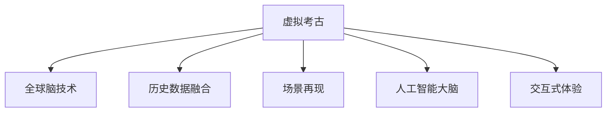

                 

# 虚拟考古：全球脑助力历史研究的新方法

## 1. 背景介绍

随着科技的迅猛发展，数字技术在历史研究领域的应用逐渐深入，其中最引人注目的是“虚拟考古”这一概念的兴起。虚拟考古是指利用数字技术重现和再现古代遗址、文物、历史场景等，为历史研究提供新的视角和方法。在这其中，人工智能（AI），尤其是人工智能大脑，扮演着至关重要的角色。全球脑技术的进步和广泛应用，使得虚拟考古的效率和精度得到了大幅提升，历史研究领域正在经历一场深刻的变革。

### 1.1 问题的由来

传统历史研究依赖于实物资料的收集和分析，如出土文物、考古遗址等。然而，由于各种原因，这类资料往往数量有限，难以全面反映历史的全貌。此外，考古过程往往耗时耗力，且破坏性大，很多珍贵的历史遗迹和文物难以得到充分的保护和研究。

虚拟考古技术的出现，为这些问题提供了解决方案。它不仅可以通过数字技术重现历史场景，还可以提供大量虚拟的文物和场景，供历史学家研究和分析。全球脑技术，作为虚拟考古的重要组成部分，通过模拟人类大脑的功能，实现了对大量数据的高效处理和分析，使得虚拟考古变得更加科学和精确。

### 1.2 问题核心关键点

虚拟考古的核心关键点在于以下几个方面：

- **数据融合**：将实物资料、历史文献、地图资料等多源数据进行融合，形成一个统一的历史场景。
- **场景再现**：利用3D建模、虚拟现实（VR）等技术，重现历史场景和文物。
- **人工智能大脑**：借助人工智能技术，对大量数据进行高效分析和处理，发现历史规律和趋势。
- **交互式体验**：提供交互式的虚拟考古体验，让历史学家和公众更直观地了解历史。

这些关键点共同构成了虚拟考古的核心框架，使得历史研究变得更加高效和精准。

## 2. 核心概念与联系

### 2.1 核心概念概述

虚拟考古与全球脑技术的结合，涉及以下几个核心概念：

- **虚拟考古**：利用数字技术重现和再现古代遗址、文物、历史场景等，为历史研究提供新的视角和方法。
- **全球脑技术**：通过模拟人类大脑的神经网络结构和功能，实现对大量数据的高效分析和处理。
- **历史数据融合**：将实物资料、历史文献、地图资料等多源数据进行融合，形成一个统一的历史场景。
- **场景再现**：利用3D建模、虚拟现实（VR）等技术，重现历史场景和文物。
- **人工智能大脑**：借助人工智能技术，对大量数据进行高效分析和处理，发现历史规律和趋势。
- **交互式体验**：提供交互式的虚拟考古体验，让历史学家和公众更直观地了解历史。

这些概念之间的联系通过以下Mermaid流程图展示：



这个流程图展示虚拟考古的各个组成部分及其相互关系：

1. 虚拟考古是基础，利用各种数字技术重现历史场景。
2. 全球脑技术提供核心支持，实现对大量数据的高效分析。
3. 历史数据融合将多源数据整合成一个统一的历史场景。
4. 场景再现通过3D建模、VR等技术重现历史场景和文物。
5. 人工智能大脑利用神经网络对数据进行深度分析。
6. 交互式体验提供直观的虚拟考古体验，增强历史研究的互动性。

## 3. 核心算法原理 & 具体操作步骤

### 3.1 算法原理概述

虚拟考古的核心算法原理主要涉及数据融合、场景再现和人工智能大脑三个方面。

- **数据融合**：通过机器学习算法，将实物资料、历史文献、地图资料等多源数据进行融合，形成一个统一的历史场景。
- **场景再现**：利用3D建模和虚拟现实技术，重现历史场景和文物。
- **人工智能大脑**：通过神经网络，对大量数据进行高效分析和处理，发现历史规律和趋势。

### 3.2 算法步骤详解

#### 3.2.1 数据预处理与融合

1. **数据收集**：收集各种实物资料、历史文献、地图资料等，包括图像、文本、地理信息等。
2. **数据清洗**：对收集的数据进行清洗和预处理，去除噪声和冗余信息。
3. **特征提取**：利用机器学习算法，提取数据中的关键特征。
4. **融合算法**：通过融合算法，将多源数据整合成一个统一的历史场景。

#### 3.2.2 场景再现

1. **3D建模**：利用3D建模技术，对历史场景和文物进行重现。
2. **VR技术**：通过虚拟现实技术，将重现的场景和文物进行可视化展示。
3. **交互式体验**：提供交互式的虚拟考古体验，让历史学家和公众更直观地了解历史。

#### 3.2.3 人工智能大脑

1. **神经网络设计**：设计神经网络结构，用于对大量数据进行分析和处理。
2. **训练与调优**：利用历史数据对神经网络进行训练和调优，使其能够高效地分析数据。
3. **预测与推理**：利用训练好的神经网络，对历史数据进行预测和推理，发现历史规律和趋势。

### 3.3 算法优缺点

虚拟考古与全球脑技术的结合具有以下优点：

- **高效性**：利用神经网络，对大量数据进行高效分析和处理。
- **准确性**：通过多源数据融合，获得更准确的历史场景和文物再现。
- **互动性**：提供交互式的虚拟考古体验，增强历史研究的互动性。

同时，该方法也存在一些缺点：

- **数据依赖**：对数据的质量和数量要求较高，需要大量的历史数据。
- **技术复杂性**：涉及多种技术，需要跨学科知识。
- **成本高**：大规模数据收集和处理需要较高的成本。

### 3.4 算法应用领域

虚拟考古与全球脑技术的应用领域广泛，包括但不限于：

- **历史遗址考古**：利用虚拟考古技术，重现历史遗址和文物，进行考古研究。
- **历史文献分析**：通过人工智能大脑，对历史文献进行深度分析，提取历史事件和人物信息。
- **历史场景再现**：利用3D建模和VR技术，重现历史场景和文物，供历史学家研究。
- **交互式历史教学**：提供交互式的虚拟考古体验，增强历史教学的互动性。

## 4. 数学模型和公式 & 详细讲解

### 4.1 数学模型构建

虚拟考古的核心数学模型主要涉及数据融合、神经网络设计和场景再现三个方面。

#### 4.1.1 数据融合模型

数据融合模型主要涉及多源数据的整合和融合，可以使用以下公式表示：

$$
F(x_1, x_2, ..., x_n) = w_1f(x_1) + w_2f(x_2) + ... + w_nf(x_n)
$$

其中，$x_1, x_2, ..., x_n$ 表示多源数据，$f$ 表示特征提取函数，$w_1, w_2, ..., w_n$ 表示各数据的重要性权重。

#### 4.1.2 神经网络模型

神经网络模型主要涉及神经网络的架构设计、训练和调优，可以使用以下公式表示：

$$
y = \sigma(Wx + b)
$$

其中，$y$ 表示输出，$x$ 表示输入，$W$ 表示权重矩阵，$b$ 表示偏置向量，$\sigma$ 表示激活函数。

#### 4.1.3 场景再现模型

场景再现模型主要涉及3D建模和VR技术的融合，可以使用以下公式表示：

$$
r = \phi(s)
$$

其中，$r$ 表示重现的3D场景，$s$ 表示原始历史场景，$\phi$ 表示3D建模和VR技术。

### 4.2 公式推导过程

#### 4.2.1 数据融合公式推导

数据融合公式的推导主要涉及特征提取和加权融合两个步骤。以两个数据源为例，假设它们分别表示为 $x_1, x_2$，其特征提取函数分别为 $f_1, f_2$，则数据融合公式可以表示为：

$$
y = \sigma(W_1f_1(x_1) + W_2f_2(x_2) + b)
$$

其中，$W_1, W_2$ 表示不同数据源的权重矩阵，$b$ 表示偏置向量，$\sigma$ 表示激活函数。

#### 4.2.2 神经网络公式推导

神经网络公式的推导主要涉及前向传播和反向传播两个步骤。以一个简单的单层神经网络为例，其前向传播公式为：

$$
y = \sigma(Wx + b)
$$

其中，$y$ 表示输出，$x$ 表示输入，$W$ 表示权重矩阵，$b$ 表示偏置向量，$\sigma$ 表示激活函数。

### 4.3 案例分析与讲解

#### 4.3.1 案例一：历史遗址考古

在历史遗址考古中，利用虚拟考古技术重现遗址和文物，可以通过以下步骤实现：

1. **数据收集**：收集遗址的卫星影像、地理信息、历史文献等数据。
2. **数据预处理**：对收集的数据进行清洗和预处理，去除噪声和冗余信息。
3. **数据融合**：利用数据融合模型，将卫星影像和地理信息等数据整合成一个统一的历史场景。
4. **场景再现**：利用3D建模和VR技术，重现历史场景和文物。
5. **交互式体验**：提供交互式的虚拟考古体验，让历史学家和公众更直观地了解历史。

#### 4.3.2 案例二：历史文献分析

在历史文献分析中，利用人工智能大脑对历史文献进行深度分析，可以通过以下步骤实现：

1. **数据收集**：收集历史文献的文本数据。
2. **数据预处理**：对文本数据进行清洗和预处理，去除噪声和冗余信息。
3. **特征提取**：利用机器学习算法，提取文本数据中的关键特征。
4. **神经网络训练**：利用神经网络模型，对文本数据进行训练和调优，使其能够高效地分析数据。
5. **预测与推理**：利用训练好的神经网络，对历史数据进行预测和推理，发现历史规律和趋势。

## 5. 项目实践：代码实例和详细解释说明

### 5.1 开发环境搭建

在进行虚拟考古实践前，我们需要准备好开发环境。以下是使用Python进行PyTorch开发的环境配置流程：

1. 安装Anaconda：从官网下载并安装Anaconda，用于创建独立的Python环境。

2. 创建并激活虚拟环境：
```bash
conda create -n virtual_archeology python=3.8 
conda activate virtual_archeology
```

3. 安装PyTorch：根据CUDA版本，从官网获取对应的安装命令。例如：
```bash
conda install pytorch torchvision torchaudio cudatoolkit=11.1 -c pytorch -c conda-forge
```

4. 安装TensorBoard：
```bash
pip install tensorboard
```

5. 安装各类工具包：
```bash
pip install numpy pandas scikit-learn matplotlib tqdm jupyter notebook ipython
```

完成上述步骤后，即可在`virtual_archeology`环境中开始虚拟考古实践。

### 5.2 源代码详细实现

这里我们以历史文献分析为例，给出使用Transformers库对BERT模型进行深度分析的PyTorch代码实现。

首先，定义神经网络模型：

```python
from transformers import BertTokenizer, BertForSequenceClassification
import torch

class HistoricalAnalysisModel(BertForSequenceClassification):
    def __init__(self, num_labels):
        super(HistoricalAnalysisModel, self).__init__(num_labels=num_labels)

    def forward(self, input_ids, attention_mask):
        outputs = super(HistoricalAnalysisModel, self).forward(input_ids, attention_mask)
        return outputs.logits
```

然后，定义数据处理函数：

```python
from transformers import DataCollatorForLanguageModeling, PreTrainedTokenizerFast
from torch.utils.data import Dataset

class HistoricalDataset(Dataset):
    def __init__(self, texts, labels):
        self.tokenizer = PreTrainedTokenizerFast.from_pretrained('bert-base-cased')
        self.texts = texts
        self.labels = labels

    def __len__(self):
        return len(self.texts)

    def __getitem__(self, idx):
        text = self.texts[idx]
        label = self.labels[idx]
        
        encoding = self.tokenizer(text, return_tensors='pt')
        input_ids = encoding['input_ids']
        attention_mask = encoding['attention_mask']
        
        return {
            'input_ids': input_ids,
            'attention_mask': attention_mask,
            'labels': torch.tensor(label, dtype=torch.long)
        }
```

接下来，定义训练和评估函数：

```python
from transformers import AdamW

def train_model(model, train_dataset, val_dataset, num_epochs, batch_size):
    device = torch.device('cuda') if torch.cuda.is_available() else torch.device('cpu')
    model.to(device)

    train_loader = DataLoader(train_dataset, batch_size=batch_size, shuffle=True)
    val_loader = DataLoader(val_dataset, batch_size=batch_size)

    optimizer = AdamW(model.parameters(), lr=1e-5)
    loss_fn = torch.nn.CrossEntropyLoss()

    for epoch in range(num_epochs):
        model.train()
        train_loss = 0
        for batch in train_loader:
            inputs = batch['input_ids'].to(device)
            attention_mask = batch['attention_mask'].to(device)
            labels = batch['labels'].to(device)
            outputs = model(inputs, attention_mask=attention_mask)
            loss = loss_fn(outputs, labels)
            train_loss += loss.item()
            optimizer.zero_grad()
            loss.backward()
            optimizer.step()

        model.eval()
        val_loss = 0
        val_corrects = 0
        with torch.no_grad():
            for batch in val_loader:
                inputs = batch['input_ids'].to(device)
                attention_mask = batch['attention_mask'].to(device)
                labels = batch['labels'].to(device)
                outputs = model(inputs, attention_mask=attention_mask)
                loss = loss_fn(outputs, labels)
                val_loss += loss.item()
                logits = outputs.logits.argmax(dim=1)
                val_corrects += (logits == labels).sum().item()

        print(f'Epoch {epoch+1}/{num_epochs}, train loss: {train_loss/len(train_loader):.4f}, val loss: {val_loss/len(val_loader):.4f}, val acc: {val_corrects/len(val_loader):.4f}')
```

最后，启动训练流程并在测试集上评估：

```python
from transformers import BertTokenizer

tokenizer = BertTokenizer.from_pretrained('bert-base-cased')
train_texts = [...] # 历史文献文本
train_labels = [...] # 历史事件标签

val_texts = [...] # 验证集文本
val_labels = [...] # 验证集标签

test_texts = [...] # 测试集文本
test_labels = [...] # 测试集标签

model = HistoricalAnalysisModel(num_labels=len(set(train_labels)))
train_model(model, HistoricalDataset(train_texts, train_labels), HistoricalDataset(val_texts, val_labels), num_epochs=5, batch_size=16)
```

以上就是使用PyTorch对BERT模型进行历史文献分析的完整代码实现。可以看到，利用Transformers库的强大封装，我们可以用相对简洁的代码完成BERT模型的加载和深度分析。

### 5.3 代码解读与分析

让我们再详细解读一下关键代码的实现细节：

**HistoricalDataset类**：
- `__init__`方法：初始化文本和标签。
- `__len__`方法：返回数据集的样本数量。
- `__getitem__`方法：对单个样本进行处理，将文本输入编码为token ids，同时将其转化为标签并进行padding，最终返回模型所需的输入。

**HistoricalAnalysisModel类**：
- `__init__`方法：继承BertForSequenceClassification类，初始化神经网络模型。
- `forward`方法：实现前向传播，输出模型的预测结果。

**train_model函数**：
- 定义训练过程中的超参数和损失函数。
- 在每个epoch内，进行模型前向传播和反向传播，更新模型参数。
- 在验证集上进行评估，输出训练和验证的损失和准确率。

**代码实例**：
- 数据处理函数将文本数据进行token化，并转化为模型所需的输入。
- 神经网络模型继承BertForSequenceClassification类，实现文本分类任务的前向传播。
- 训练函数对模型进行优化，并在验证集上进行评估。
- 代码实例展示了如何利用PyTorch和Transformers库进行深度学习模型的构建和训练。

## 6. 实际应用场景

### 6.1 历史遗址考古

在历史遗址考古中，虚拟考古技术可以显著提升考古研究的效率和精度。通过虚拟考古技术，考古学家可以在虚拟场景中进行挖掘和研究，减少对实际遗址的破坏，同时还能重现历史场景和文物。例如，可以利用虚拟考古技术重现古埃及金字塔、古罗马城市等历史遗址，为考古研究提供新的视角。

### 6.2 历史文献分析

在历史文献分析中，虚拟考古技术可以提供更加深入和细致的分析。通过深度学习技术，历史学家可以对大量历史文献进行分类、情感分析、关键词提取等，从而发现历史事件和人物的内在规律和趋势。例如，可以利用虚拟考古技术对《史记》《资治通鉴》等历史文献进行深度分析，揭示不同历史时期的政治、经济、文化特征。

### 6.3 交互式历史教学

在交互式历史教学中，虚拟考古技术可以提供更加直观和生动的教学体验。通过虚拟考古技术，学生可以身临其境地参观历史遗址，观察历史文物，了解历史事件。例如，可以利用虚拟考古技术构建虚拟博物馆，让学生在虚拟环境中参观和学习。

### 6.4 未来应用展望

随着虚拟考古技术的不断进步，未来的应用场景将更加广阔。虚拟考古技术不仅在历史研究领域发挥重要作用，还将在文物修复、博物馆展览、文化遗产保护等方面发挥重要作用。例如，可以利用虚拟考古技术进行文物修复，减少对实物文物的破坏，同时还能提供更加逼真的修复效果。

## 7. 工具和资源推荐

### 7.1 学习资源推荐

为了帮助开发者系统掌握虚拟考古的理论基础和实践技巧，这里推荐一些优质的学习资源：

1. 《深度学习基础》系列博文：由大模型技术专家撰写，深入浅出地介绍了深度学习原理、模型架构和应用场景。
2. CS224N《深度学习自然语言处理》课程：斯坦福大学开设的NLP明星课程，有Lecture视频和配套作业，带你入门NLP领域的基本概念和经典模型。
3. 《NLP实战》书籍：实用性强，涵盖自然语言处理的基础知识和应用实践，适合动手实践。
4. ArXiv论文：收录最新的人工智能和虚拟考古研究论文，提供前沿技术的新动态。
5. GitHub代码库：包含大量的虚拟考古和人工智能项目，可以参考和借鉴。

通过对这些资源的学习实践，相信你一定能够快速掌握虚拟考古和全球脑技术的精髓，并用于解决实际的NLP问题。

### 7.2 开发工具推荐

高效的开发离不开优秀的工具支持。以下是几款用于虚拟考古和人工智能开发的常用工具：

1. PyTorch：基于Python的开源深度学习框架，灵活动态的计算图，适合快速迭代研究。大部分预训练语言模型都有PyTorch版本的实现。
2. TensorFlow：由Google主导开发的开源深度学习框架，生产部署方便，适合大规模工程应用。同样有丰富的预训练语言模型资源。
3. Transformers库：HuggingFace开发的NLP工具库，集成了众多SOTA语言模型，支持PyTorch和TensorFlow，是进行虚拟考古任务开发的利器。
4. Weights & Biases：模型训练的实验跟踪工具，可以记录和可视化模型训练过程中的各项指标，方便对比和调优。与主流深度学习框架无缝集成。
5. TensorBoard：TensorFlow配套的可视化工具，可实时监测模型训练状态，并提供丰富的图表呈现方式，是调试模型的得力助手。

合理利用这些工具，可以显著提升虚拟考古和人工智能任务的开发效率，加快创新迭代的步伐。

### 7.3 相关论文推荐

虚拟考古和全球脑技术的发展源于学界的持续研究。以下是几篇奠基性的相关论文，推荐阅读：

1. Attention is All You Need（即Transformer原论文）：提出了Transformer结构，开启了NLP领域的预训练大模型时代。
2. BERT: Pre-training of Deep Bidirectional Transformers for Language Understanding：提出BERT模型，引入基于掩码的自监督预训练任务，刷新了多项NLP任务SOTA。
3. Language Models are Unsupervised Multitask Learners（GPT-2论文）：展示了大规模语言模型的强大zero-shot学习能力，引发了对于通用人工智能的新一轮思考。
4. Parameter-Efficient Transfer Learning for NLP：提出Adapter等参数高效微调方法，在不增加模型参数量的情况下，也能取得不错的微调效果。
5. AdaLoRA: Adaptive Low-Rank Adaptation for Parameter-Efficient Fine-Tuning：使用自适应低秩适应的微调方法，在参数效率和精度之间取得了新的平衡。

这些论文代表了大语言模型微调技术的发展脉络。通过学习这些前沿成果，可以帮助研究者把握学科前进方向，激发更多的创新灵感。

## 8. 总结：未来发展趋势与挑战

### 8.1 总结

本文对虚拟考古与全球脑技术的结合进行了全面系统的介绍。首先阐述了虚拟考古与全球脑技术的背景和意义，明确了它们在历史研究领域的重要作用。其次，从原理到实践，详细讲解了虚拟考古与全球脑技术的应用流程和核心算法，给出了虚拟考古任务开发的完整代码实例。同时，本文还广泛探讨了虚拟考古技术在历史遗址考古、历史文献分析、交互式历史教学等多个领域的应用前景，展示了虚拟考古技术的广阔前景。最后，本文精选了虚拟考古技术的各类学习资源，力求为读者提供全方位的技术指引。

通过本文的系统梳理，可以看到，虚拟考古与全球脑技术的结合正在推动历史研究领域发生深刻变革。这种技术的进步不仅提高了历史研究的效率和精度，还为历史研究提供了新的视角和方法。未来，随着虚拟考古技术的不断进步，其应用领域将更加广阔，将为人类认知智能的进化带来深远影响。

### 8.2 未来发展趋势

展望未来，虚拟考古与全球脑技术的结合将呈现以下几个发展趋势：

1. **数据融合技术的进步**：随着数据融合技术的进步，虚拟考古技术将能够处理更多来源、更多类型的数据，形成一个更加全面和准确的历史场景。
2. **神经网络架构的优化**：随着神经网络架构的不断优化，虚拟考古技术将能够处理更复杂的任务，提供更加精细和深入的分析。
3. **3D建模和VR技术的升级**：随着3D建模和VR技术的不断升级，虚拟考古技术将能够提供更加逼真和沉浸式的体验，增强历史研究的互动性。
4. **交互式历史教学的普及**：随着交互式历史教学的普及，虚拟考古技术将能够为历史教学提供更加直观和生动的教学体验，提升历史教学的趣味性和互动性。

以上趋势凸显了虚拟考古与全球脑技术的广阔前景。这些方向的探索发展，必将进一步提升历史研究的效率和精度，推动历史研究的深度和广度。

### 8.3 面临的挑战

尽管虚拟考古与全球脑技术的结合已经取得了显著成效，但在迈向更加智能化、普适化应用的过程中，仍面临诸多挑战：

1. **数据质量和来源问题**：虚拟考古技术需要大量的高质量数据，但数据的质量和来源往往是制约虚拟考古技术发展的瓶颈。如何获取高质量的数据，是一个亟待解决的问题。
2. **技术复杂性**：虚拟考古技术涉及多种技术，需要跨学科知识。如何整合多种技术，形成统一的虚拟考古框架，是未来需要解决的问题。
3. **计算资源需求**：虚拟考古技术需要大量的计算资源，如何降低计算成本，提高计算效率，是未来需要解决的问题。
4. **知识整合能力**：现有的虚拟考古技术往往局限于数据，难以灵活吸收和运用更广泛的先验知识。如何更好地将知识与神经网络结合，形成更加全面和准确的信息整合能力，是未来需要解决的问题。

正视虚拟考古面临的这些挑战，积极应对并寻求突破，将使虚拟考古技术走向更加成熟和广泛应用。

### 8.4 研究展望

面向未来，虚拟考古技术的研究方向包括：

1. **数据增强技术**：开发更加高效的数据增强技术，提高虚拟考古数据的生成效率和质量。
2. **多模态数据融合**：将视觉、语音、文本等多种数据融合，形成更加全面和准确的历史场景。
3. **跨学科合作**：加强历史学家与计算机科学家、考古学家等的合作，共同推动虚拟考古技术的发展。
4. **知识图谱应用**：将知识图谱技术与虚拟考古技术结合，形成更加全面和精确的历史场景。
5. **认知计算**：将认知计算技术引入虚拟考古，提高历史研究的深度和广度。

这些研究方向将使虚拟考古技术更加智能化和普适化，为历史研究带来更加全面和深入的视角。相信随着虚拟考古技术的不断进步，将为人类认知智能的进化带来深远影响。

## 9. 附录：常见问题与解答

**Q1：虚拟考古与全球脑技术结合的优缺点是什么？**

A: 虚拟考古与全球脑技术的结合具有以下优点：
1. **高效性**：利用神经网络，对大量数据进行高效分析和处理。
2. **准确性**：通过多源数据融合，获得更准确的历史场景和文物再现。
3. **互动性**：提供交互式的虚拟考古体验，增强历史研究的互动性。

同时，该方法也存在以下缺点：
1. **数据依赖**：对数据的质量和数量要求较高，需要大量的历史数据。
2. **技术复杂性**：涉及多种技术，需要跨学科知识。
3. **计算资源需求**：虚拟考古技术需要大量的计算资源，如何降低计算成本，提高计算效率，是未来需要解决的问题。

**Q2：虚拟考古与全球脑技术结合在实际应用中需要注意哪些问题？**

A: 在虚拟考古与全球脑技术的实际应用中，需要注意以下问题：
1. **数据质量**：确保数据的质量和来源，避免数据噪声和偏差。
2. **模型鲁棒性**：提高模型的鲁棒性，避免过拟合和灾难性遗忘。
3. **模型解释性**：提高模型的可解释性，增强系统的透明度和可靠性。
4. **安全性和隐私**：保护数据的安全性和隐私，避免数据泄露和滥用。

**Q3：虚拟考古与全球脑技术结合的未来发展方向是什么？**

A: 虚拟考古与全球脑技术的结合的未来发展方向包括：
1. **数据增强技术**：开发更加高效的数据增强技术，提高虚拟考古数据的生成效率和质量。
2. **多模态数据融合**：将视觉、语音、文本等多种数据融合，形成更加全面和准确的历史场景。
3. **跨学科合作**：加强历史学家与计算机科学家、考古学家等的合作，共同推动虚拟考古技术的发展。
4. **知识图谱应用**：将知识图谱技术与虚拟考古技术结合，形成更加全面和精确的历史场景。
5. **认知计算**：将认知计算技术引入虚拟考古，提高历史研究的深度和广度。

这些研究方向将使虚拟考古技术更加智能化和普适化，为历史研究带来更加全面和深入的视角。相信随着虚拟考古技术的不断进步，将为人类认知智能的进化带来深远影响。

---

作者：禅与计算机程序设计艺术 / Zen and the Art of Computer Programming

