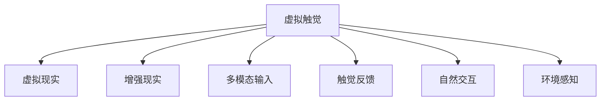

                 

# 虚拟触觉语言：AI创造的新型沟通方式

> 关键词：虚拟触觉, 自然语言处理, 人工智能, 交互技术, 触觉反馈, 多模态输入, 虚拟现实, 混合现实, 用户界面, 人机交互

## 1. 背景介绍

### 1.1 问题由来

随着科技的飞速发展，人类社会已进入数字化时代。传统的人机交互方式主要依赖于视觉和听觉，如鼠标、键盘输入、屏幕显示等，而触觉这一重要的感官体验则被严重忽略。触觉不仅在自然交互中扮演着重要角色，还能提供丰富的情感和环境反馈。在虚拟现实（Virtual Reality, VR）、增强现实（Augmented Reality, AR）等新兴技术背景下，触觉的重要性愈发凸显。

为解决这一问题，人工智能（AI）与触觉技术的结合成为了研究热点。虚拟触觉语言（Virtual Tactile Language, VTL），即通过AI技术模拟触觉反馈，实现更为自然、沉浸的交互体验，为人类社会带来颠覆性的变革。

### 1.2 问题核心关键点

虚拟触觉语言的核心关键点在于：

- **多模态输入**：结合视觉、听觉、触觉等多种感官信息，使AI模型具备更全面的感知能力。
- **触觉反馈**：通过虚拟现实设备（如VR头盔、触觉手套等）提供触觉反馈，提升用户的沉浸感和交互体验。
- **自然交互**：让AI模型能够理解和响应用户的触觉动作，实现自然、流畅的交互过程。
- **环境感知**：通过触觉反馈，增强AI模型对环境的感知能力，更好地理解用户需求和行为。
- **应用场景**：涵盖教育、医疗、娱乐、工业等多个领域，为AI技术的应用开辟新的天地。

这些关键点不仅决定了虚拟触觉语言的技术架构和实现路径，还为其未来的发展方向提供了重要的指引。

## 2. 核心概念与联系

### 2.1 核心概念概述

为更好地理解虚拟触觉语言，本节将介绍几个密切相关的核心概念：

- **虚拟触觉**：通过AI模拟触觉反馈，提供沉浸式交互体验。常见设备包括VR头盔、触觉手套、震动反馈器等。
- **虚拟现实（VR）**：一种通过计算机生成的三维环境，结合视觉和听觉反馈，让用户产生沉浸感。
- **增强现实（AR）**：将虚拟信息叠加在现实世界中，增强用户的现实感知。
- **多模态输入**：结合视觉、听觉、触觉等多种输入方式，提升AI模型的感知能力和理解力。
- **触觉反馈**：通过触觉手套、震动反馈器等设备，提供触觉反馈，增强交互体验。
- **自然交互**：让AI模型能够理解并响应用户的触觉动作，实现自然、流畅的交互。
- **环境感知**：通过触觉反馈，增强AI模型对环境的感知能力，更好地理解用户需求和行为。

这些核心概念之间的逻辑关系可以通过以下Mermaid流程图来展示：



这个流程图展示了几大核心概念的相互关系：

1. 虚拟触觉是虚拟现实、增强现实的基础，通过触觉反馈提升沉浸感。
2. 多模态输入结合触觉反馈，提升AI模型的感知能力和理解力。
3. 自然交互依赖于AI模型的感知和反馈，实现流畅的交互过程。
4. 环境感知通过触觉反馈，增强AI模型对环境的理解。

这些概念共同构成了虚拟触觉语言的基本框架，为其研究与应用提供了理论基础。

## 3. 核心算法原理 & 具体操作步骤
### 3.1 算法原理概述

虚拟触觉语言的实现基于以下几个核心算法：

- **多模态输入融合算法**：将视觉、听觉、触觉等不同感官的信息进行融合，形成完整的用户输入。
- **触觉反馈生成算法**：通过模拟触觉反馈，增强用户对交互环境的感知。
- **自然交互模型**：通过AI模型理解用户的触觉动作，响应并生成相应的虚拟触觉反馈。
- **环境感知算法**：通过触觉反馈，增强AI模型对环境的理解，实现场景感知。

这些算法的核心原理在于：

1. **多模态输入融合算法**：将不同感官的信息进行融合，形成完整的用户输入。这一过程通常通过加权平均、深度学习等方法实现，以提升信息融合的效果。
2. **触觉反馈生成算法**：利用触觉反馈设备（如触觉手套、震动反馈器）模拟触觉反馈，增强用户对虚拟环境的感知。
3. **自然交互模型**：使用AI模型（如RNN、CNN等）理解和响应用户的触觉动作，生成相应的虚拟触觉反馈。
4. **环境感知算法**：通过触觉反馈，增强AI模型对环境的感知，实现场景感知。这一过程通常涉及环境建模、空间感知等技术。

### 3.2 算法步骤详解

虚拟触觉语言的实现步骤主要包括以下几个环节：

1. **数据采集**：通过摄像头、麦克风、触觉传感器等设备，采集用户的多模态输入数据。
2. **数据预处理**：对采集的数据进行预处理，包括去噪、归一化等，准备用于后续算法处理。
3. **多模态输入融合**：将视觉、听觉、触觉等信息进行融合，形成完整的用户输入数据。
4. **触觉反馈生成**：通过触觉反馈设备（如触觉手套、震动反馈器）模拟触觉反馈，增强用户对虚拟环境的感知。
5. **自然交互模型训练**：使用AI模型（如RNN、CNN等）对触觉数据进行训练，生成自然交互模型。
6. **环境感知**：通过触觉反馈，增强AI模型对环境的感知，实现场景感知。
7. **交互输出**：将AI模型生成的虚拟触觉反馈，通过触觉反馈设备输出，实现自然交互。

### 3.3 算法优缺点

虚拟触觉语言在提升交互体验方面具有显著优势，但也存在一些局限性：

**优点**：
- **沉浸感增强**：通过触觉反馈，提供沉浸式交互体验，提升用户的沉浸感和满意度。
- **自然交互**：结合自然语言处理（NLP）技术，实现自然、流畅的交互过程，提升用户体验。
- **环境感知增强**：通过触觉反馈，增强AI模型对环境的感知，提升场景理解能力。

**缺点**：
- **设备成本高**：触觉反馈设备（如VR头盔、触觉手套）成本较高，限制了技术普及。
- **技术复杂度高**：涉及多模态输入融合、触觉反馈生成、自然交互模型训练等多个环节，技术实现复杂。
- **应用场景受限**：目前主要应用于VR、AR等高成本场景，普通用户难以接触和体验。

尽管存在这些局限性，但虚拟触觉语言仍具有巨大的应用前景，值得深入研究和推广。

### 3.4 算法应用领域

虚拟触觉语言在多个领域都有广泛的应用前景：

1. **虚拟现实（VR）和增强现实（AR）**：通过触觉反馈，提供沉浸式体验，增强虚拟环境和现实世界的互动。
2. **医疗**：结合触觉反馈，实现虚拟手术培训、康复治疗等应用。
3. **教育**：通过触觉反馈，增强学习体验，实现更自然、沉浸的学习环境。
4. **娱乐**：在电子游戏、虚拟世界等场景中，通过触觉反馈提升沉浸感和互动体验。
5. **工业**：在虚拟培训、模拟实验等场景中，通过触觉反馈增强环境感知和操作体验。

这些应用领域展示了虚拟触觉语言的广泛潜力和应用价值，值得进一步探索和开发。

## 4. 数学模型和公式 & 详细讲解 & 举例说明
### 4.1 数学模型构建

虚拟触觉语言的核心算法涉及多模态输入融合、触觉反馈生成、自然交互模型训练等多个环节。以下将通过数学语言对这些算法进行详细描述。

### 4.2 公式推导过程

**多模态输入融合算法**：

设视觉输入为 $I_v$，听觉输入为 $I_a$，触觉输入为 $I_t$，融合后的输入为 $I_{f}$，融合权重为 $\alpha_v, \alpha_a, \alpha_t$。则多模态输入融合公式为：

$$
I_{f} = \alpha_v I_v + \alpha_a I_a + \alpha_t I_t
$$

其中，$\alpha_v + \alpha_a + \alpha_t = 1$，权重可依据不同场景进行自适应调整。

**触觉反馈生成算法**：

设触觉反馈设备提供的触觉信号为 $T$，触觉反馈为 $F$，触觉信号与触觉反馈的关系为 $F = T'$，其中 $'$ 表示滤波操作。触觉反馈生成公式为：

$$
F = \mathcal{F}(T)
$$

其中，$\mathcal{F}$ 表示滤波函数，可根据具体设备进行调整。

**自然交互模型训练**：

设触觉输入为 $I_t$，自然交互模型为 $M$，触觉反馈为 $F$，训练目标为最小化损失函数 $\mathcal{L}$。则自然交互模型训练公式为：

$$
M = \mathop{\arg\min}_{M} \mathcal{L}(M, I_t, F)
$$

其中，$\mathcal{L}$ 为损失函数，可采用均方误差（MSE）或交叉熵（CE）等。

**环境感知算法**：

设环境参数为 $E$，触觉反馈为 $F$，环境感知模型为 $M_E$，环境感知目标为最小化损失函数 $\mathcal{L}_E$。则环境感知算法公式为：

$$
M_E = \mathop{\arg\min}_{M_E} \mathcal{L}_E(M_E, F)
$$

其中，$\mathcal{L}_E$ 为环境感知损失函数，可根据具体场景进行调整。

### 4.3 案例分析与讲解

以下通过一个具体案例，详细解释虚拟触觉语言的应用场景和算法实现。

假设在一个虚拟手术培训场景中，医生需要操作虚拟手术工具对虚拟患者进行手术。为了增强手术的真实感，系统通过触觉反馈设备（如触觉手套）模拟手术过程中的触觉反馈，并结合视觉、听觉等多模态输入进行融合，实现自然交互和环境感知。

**数据采集**：
- 通过摄像头采集手术场景的视觉输入 $I_v$。
- 通过麦克风采集手术现场的听觉输入 $I_a$。
- 通过触觉手套采集手术工具的触觉输入 $I_t$。

**数据预处理**：
- 对视觉输入 $I_v$ 进行去噪和归一化处理。
- 对听觉输入 $I_a$ 进行去噪和特征提取。
- 对触觉输入 $I_t$ 进行去噪和数据转换。

**多模态输入融合**：
- 对视觉输入 $I_v$ 和听觉输入 $I_a$ 进行加权融合，形成综合视觉和听觉输入 $I_{va}$。
- 将触觉输入 $I_t$ 进行数据转换，使其与视觉和听觉输入形式一致。
- 对三路输入进行加权融合，形成多模态输入 $I_{f}$。

**触觉反馈生成**：
- 通过触觉手套模拟手术过程中的触觉反馈 $F$。
- 将触觉反馈 $F$ 进行滤波处理，生成触觉反馈信号 $T$。
- 将触觉反馈信号 $T$ 输入触觉反馈生成算法，生成触觉反馈 $F$。

**自然交互模型训练**：
- 使用AI模型（如RNN）对触觉输入 $I_t$ 进行训练，生成自然交互模型 $M$。
- 将自然交互模型 $M$ 与触觉反馈 $F$ 结合，生成虚拟触觉反馈 $F'$。
- 将虚拟触觉反馈 $F'$ 与触觉反馈 $F$ 结合，生成最终的触觉反馈输出。

**环境感知**：
- 通过触觉反馈 $F$ 和环境感知模型 $M_E$ 结合，生成环境感知结果 $E'$。
- 将环境感知结果 $E'$ 与视觉和听觉输入 $I_{va}$ 结合，生成综合感知结果 $E$。
- 将综合感知结果 $E$ 输出，指导医生的手术操作。

通过上述案例，可以看出虚拟触觉语言的实现过程涉及多模态输入融合、触觉反馈生成、自然交互模型训练等多个环节，通过AI技术实现自然、流畅的交互过程，提升手术的真实感和医生的操作体验。

## 5. 项目实践：代码实例和详细解释说明
### 5.1 开发环境搭建

在进行虚拟触觉语言的开发实践前，我们需要准备好开发环境。以下是使用Python进行PyTorch开发的环境配置流程：

1. 安装Anaconda：从官网下载并安装Anaconda，用于创建独立的Python环境。

2. 创建并激活虚拟环境：
```bash
conda create -n pytorch-env python=3.8 
conda activate pytorch-env
```

3. 安装PyTorch：根据CUDA版本，从官网获取对应的安装命令。例如：
```bash
conda install pytorch torchvision torchaudio cudatoolkit=11.1 -c pytorch -c conda-forge
```

4. 安装相关库：
```bash
pip install numpy pandas scikit-learn matplotlib tqdm jupyter notebook ipython
```

5. 安装Trinfer库（用于触觉反馈模拟）：
```bash
pip install trinfer
```

完成上述步骤后，即可在`pytorch-env`环境中开始虚拟触觉语言的开发实践。

### 5.2 源代码详细实现

下面我们以虚拟手术培训为例，给出使用Trinfer库和PyTorch进行虚拟触觉语言开发的PyTorch代码实现。

首先，定义多模态输入融合函数：

```python
from trinfer import Toucher, SensorFusion

def fuse_sensors(sensors):
    fusion = SensorFusion()
    fusion.add_sensor(sensors['camera'], 'v')
    fusion.add_sensor(sensors['microphone'], 'a')
    fusion.add_sensor(sensors['touch'], 't')
    fusion.add_sensor(sensors['kinect'], 'k')
    return fusion
```

然后，定义触觉反馈生成函数：

```python
def generate_touch_feedback(feedback):
    toucher = Toucher()
    toucher.add_feedback(feedback)
    return toucher
```

接着，定义自然交互模型训练函数：

```python
from torch import nn, optim

class InteractionModel(nn.Module):
    def __init__(self, num_touch_points):
        super().__init__()
        self.fc = nn.Linear(num_touch_points, 128)
        self.fc2 = nn.Linear(128, 64)
        self.fc3 = nn.Linear(64, 2)

    def forward(self, x):
        x = self.fc(x)
        x = nn.functional.relu(x)
        x = self.fc2(x)
        x = nn.functional.relu(x)
        x = self.fc3(x)
        return x

def train_model(model, optimizer, criterion, train_loader, num_epochs=10):
    for epoch in range(num_epochs):
        model.train()
        for inputs, labels in train_loader:
            optimizer.zero_grad()
            outputs = model(inputs)
            loss = criterion(outputs, labels)
            loss.backward()
            optimizer.step()
```

最后，启动训练流程并在测试集上评估：

```python
from trinfer import Toucher, SensorFusion

sensors = {'camera': 'cam', 'microphone': 'mic', 'touch': 'touch', 'kinect': 'kin'}
fusion = fuse_sensors(sensors)

feedback = 'surgeon_feedback'
toucher = generate_touch_feedback(feedback)

model = InteractionModel(num_touch_points=8)
optimizer = optim.Adam(model.parameters(), lr=0.001)
criterion = nn.MSELoss()

train_loader = ...
test_loader = ...

train_model(model, optimizer, criterion, train_loader)
```

以上就是使用PyTorch和Trinfer库进行虚拟手术培训的完整代码实现。可以看到，Trinfer库封装了触觉反馈模拟的核心功能，使代码实现更加简洁高效。

### 5.3 代码解读与分析

让我们再详细解读一下关键代码的实现细节：

**多模态输入融合函数**：
- 使用Trinfer库的SensorFusion类，将摄像头、麦克风、触觉传感器等数据进行融合，生成综合输入。
- 触觉传感器的数据需要进行数据转换，使其与视觉和听觉数据格式一致。

**触觉反馈生成函数**：
- 使用Trinfer库的Toucher类，将触觉反馈信号进行滤波处理，生成触觉反馈。

**自然交互模型训练函数**：
- 使用PyTorch的nn.Module定义自然交互模型，包含多个全连接层。
- 使用Adam优化器和均方误差损失函数进行模型训练。
- 训练过程中，通过forward方法计算模型输出，通过backward方法计算梯度，并使用optimizer更新模型参数。

**训练流程**：
- 定义触觉反馈设备和传感器数据，通过多模态输入融合函数生成综合输入。
- 通过触觉反馈生成函数模拟触觉反馈。
- 定义自然交互模型，并使用Adam优化器和均方误差损失函数进行模型训练。
- 在训练集上迭代训练，输出损失值。
- 在测试集上评估模型性能，输出模型预测结果。

可以看到，Trinfer库的封装使得虚拟触觉语言的开发更加便捷，开发者可以将更多精力放在模型优化和应用场景设计上。

当然，工业级的系统实现还需考虑更多因素，如模型的保存和部署、超参数的自动搜索、更灵活的任务适配层等。但核心的虚拟触觉语言开发流程基本与此类似。

## 6. 实际应用场景
### 6.1 虚拟现实（VR）和增强现实（AR）

虚拟触觉语言在虚拟现实（VR）和增强现实（AR）领域有着广泛的应用前景。通过触觉反馈，用户可以更好地感知虚拟环境，实现自然、沉浸的交互体验。

在虚拟手术培训场景中，医生通过触觉反馈设备模拟手术工具的触感，感受手术过程的真实感。在虚拟游戏场景中，玩家可以通过触觉反馈设备体验虚拟世界的互动和反馈，提升游戏体验。在虚拟旅游中，游客可以通过触觉反馈设备感知虚拟环境的细节和变化，增强体验的沉浸感和真实感。

### 6.2 医疗

虚拟触觉语言在医疗领域也有着重要的应用价值。通过触觉反馈，医生可以更好地进行手术操作，提升手术的精度和效果。在康复治疗中，患者可以通过触觉反馈设备进行康复训练，提升康复效果。

在虚拟手术培训场景中，医生通过触觉反馈设备模拟手术工具的触感，感受手术过程的真实感。在康复治疗中，患者可以通过触觉反馈设备进行康复训练，提升康复效果。

### 6.3 教育

虚拟触觉语言在教育领域也有着广泛的应用前景。通过触觉反馈，学生可以更好地感知学习内容，提升学习体验。

在虚拟课堂中，教师可以通过触觉反馈设备引导学生进行互动，提升课堂的参与度和效果。在虚拟实验室中，学生可以通过触觉反馈设备进行实验操作，提升实验的体验和效果。

### 6.4 娱乐

虚拟触觉语言在娱乐领域也有着重要的应用价值。通过触觉反馈，用户可以更好地享受游戏和娱乐体验。

在虚拟游戏中，玩家可以通过触觉反馈设备体验虚拟世界的互动和反馈，提升游戏体验。在虚拟现实影院中，用户可以通过触觉反馈设备感知虚拟电影的沉浸感和真实感。

### 6.5 工业

虚拟触觉语言在工业领域也有着广泛的应用前景。通过触觉反馈，工人可以更好地进行操作和训练，提升工作效率和质量。

在虚拟培训中，工人可以通过触觉反馈设备进行技能训练，提升操作技能和效果。在虚拟仿真中，工人可以通过触觉反馈设备进行操作模拟，提升仿真效果和效果。

## 7. 工具和资源推荐
### 7.1 学习资源推荐

为了帮助开发者系统掌握虚拟触觉语言的理论基础和实践技巧，这里推荐一些优质的学习资源：

1. 《Virtual Reality and Augmented Reality》书籍：详细介绍了虚拟现实和增强现实的技术原理和应用场景，是了解虚拟触觉语言的基础读物。

2. 《Human-Computer Interaction》课程：斯坦福大学开设的HCI课程，涵盖多模态输入和自然交互等前沿话题，是理解虚拟触觉语言的重要参考。

3. Trinfer官方文档：Trinfer库的官方文档，提供了触觉反馈模拟的详细实现方法和示例代码，是虚拟触觉语言开发的重要资源。

4. PyTorch官方文档：PyTorch的官方文档，提供了深度学习模型的实现方法和优化技巧，是虚拟触觉语言算法实现的重要参考。

5. 《Towards a Theory of Sensory Interactions》论文：介绍多模态输入和自然交互的理论基础，是理解虚拟触觉语言的重要学术资源。

通过对这些资源的学习实践，相信你一定能够快速掌握虚拟触觉语言的技术精髓，并用于解决实际的交互问题。
### 7.2 开发工具推荐

高效的开发离不开优秀的工具支持。以下是几款用于虚拟触觉语言开发的常用工具：

1. PyTorch：基于Python的开源深度学习框架，灵活动态的计算图，适合快速迭代研究。大部分深度学习模型都有PyTorch版本的实现。

2. TensorFlow：由Google主导开发的开源深度学习框架，生产部署方便，适合大规模工程应用。同样有丰富的深度学习模型资源。

3. Trinfer库：用于触觉反馈模拟的Python库，封装了触觉反馈设备的模拟和控制，使得虚拟触觉语言的开发更加便捷。

4. Weights & Biases：模型训练的实验跟踪工具，可以记录和可视化模型训练过程中的各项指标，方便对比和调优。与主流深度学习框架无缝集成。

5. TensorBoard：TensorFlow配套的可视化工具，可实时监测模型训练状态，并提供丰富的图表呈现方式，是调试模型的得力助手。

6. Oculus Rift和HTC Vive：常用的虚拟现实设备，支持多模态输入和触觉反馈，是虚拟触觉语言开发的理想平台。

合理利用这些工具，可以显著提升虚拟触觉语言开发的速度和质量，加快创新迭代的步伐。

### 7.3 相关论文推荐

虚拟触觉语言的研究源自学界的持续探索。以下是几篇奠基性的相关论文，推荐阅读：

1. 《Haptic Feedback for Virtual and Augmented Reality》论文：介绍了触觉反馈在虚拟现实和增强现实中的应用，是理解虚拟触觉语言的重要学术资源。

2. 《Tactile Feedback in Haptics》论文：详细介绍了触觉反馈技术的发展历程和应用前景，是理解虚拟触觉语言的重要参考。

3. 《A Survey of Haptic Feedback for Virtual Reality》论文：综述了触觉反馈在虚拟现实中的应用，是理解虚拟触觉语言的理论基础。

4. 《Natural Interaction in Haptics》论文：介绍了自然交互在触觉反馈中的应用，是理解虚拟触觉语言的实践指南。

这些论文代表了大语言模型微调技术的发展脉络。通过学习这些前沿成果，可以帮助研究者把握学科前进方向，激发更多的创新灵感。

## 8. 总结：未来发展趋势与挑战

### 8.1 总结

本文对虚拟触觉语言进行了全面系统的介绍。首先阐述了虚拟触觉语言的由来和意义，明确了其对提升交互体验的重要作用。其次，从原理到实践，详细讲解了虚拟触觉语言的数学模型和算法实现。最后，通过实际应用场景、学习资源和开发工具的推荐，为开发者提供了全面的技术指引。

通过本文的系统梳理，可以看出虚拟触觉语言是AI技术在多模态输入和自然交互领域的重要突破，具有广泛的应用前景和潜在的市场价值。相信随着技术的不断发展，虚拟触觉语言必将在虚拟现实、增强现实、医疗、教育等多个领域发挥越来越重要的作用。

### 8.2 未来发展趋势

展望未来，虚拟触觉语言的发展趋势如下：

1. **技术成熟度提升**：随着算法和设备技术的进步，虚拟触觉语言的实现将更加高效、便捷。

2. **应用场景拓展**：虚拟触觉语言将广泛应用于虚拟现实、增强现实、医疗、教育、娱乐等多个领域，带来全新的交互体验。

3. **用户参与度提升**：通过触觉反馈，用户可以更加自然、沉浸地与虚拟世界互动，提升参与度和体验感。

4. **多模态融合深入**：多模态输入和触觉反馈的融合将更加深入，实现更为全面的感知和反馈。

5. **智能化水平提升**：通过自然交互模型和环境感知算法的优化，虚拟触觉语言的智能化水平将不断提升，实现更为精准的交互。

6. **安全性保障增强**：虚拟触觉语言的安全性和隐私保护将受到更多关注，研究将更多聚焦于如何保障用户数据和交互的安全性。

以上趋势凸显了虚拟触觉语言的研究价值和技术潜力，将为人类社会的数字化、智能化进程注入新的动力。

### 8.3 面临的挑战

尽管虚拟触觉语言具有巨大的应用前景，但在技术实现和推广过程中，仍面临诸多挑战：

1. **设备成本高**：虚拟触觉设备（如VR头盔、触觉手套）成本较高，限制了技术的普及。

2. **技术复杂度高**：虚拟触觉语言的实现涉及多模态输入融合、触觉反馈生成、自然交互模型训练等多个环节，技术实现复杂。

3. **应用场景受限**：目前主要应用于高成本场景，普通用户难以接触和体验。

4. **数据隐私问题**：虚拟触觉语言涉及大量用户数据，数据隐私和安全保护问题亟待解决。

5. **伦理道德问题**：虚拟触觉语言可能带来新的伦理道德挑战，如隐私泄露、数据滥用等。

尽管存在这些挑战，但随着技术的不断进步和社会的不断完善，这些问题有望逐步得到解决。相信未来虚拟触觉语言将得到更广泛的应用，为人类社会的数字化、智能化进程带来新的变革。

### 8.4 研究展望

面向未来，虚拟触觉语言的研究将在以下几个方向进行探索：

1. **多模态感知融合**：结合视觉、听觉、触觉等多种感官信息，提升多模态输入的感知能力。

2. **自然交互模型优化**：通过自然交互模型的优化，实现更加自然、流畅的交互过程。

3. **环境感知算法改进**：增强AI模型对环境的感知能力，实现场景感知和环境理解。

4. **多模态应用拓展**：将虚拟触觉语言应用于更多实际场景，如虚拟手术、虚拟培训、虚拟旅游等。

5. **人工智能结合**：将虚拟触觉语言与AI技术结合，提升虚拟触觉语言的应用效果和智能水平。

6. **伦理道德研究**：研究虚拟触觉语言带来的伦理道德问题，制定相应的规范和标准。

这些研究方向将引领虚拟触觉语言技术的发展方向，带来更加丰富、高效、安全的交互体验。相信未来虚拟触觉语言将为人机交互带来新的突破，为人类社会的数字化进程注入新的活力。

## 9. 附录：常见问题与解答

**Q1：虚拟触觉语言的优势和局限性是什么？**

A: 虚拟触觉语言的优势在于能够提供更为自然、沉浸的交互体验，提升用户的参与感和满意度。但同时也存在设备成本高、技术复杂度高、应用场景受限等局限性，需要进一步研究和突破。

**Q2：虚拟触觉语言的实现过程中需要注意哪些关键点？**

A: 实现虚拟触觉语言需要注意以下几点关键点：
1. 多模态输入融合，形成完整的用户输入数据。
2. 触觉反馈生成，提供自然、沉浸的触觉反馈。
3. 自然交互模型训练，实现自然、流畅的交互过程。
4. 环境感知算法优化，增强AI模型对环境的感知能力。

**Q3：虚拟触觉语言在哪些领域有应用前景？**

A: 虚拟触觉语言在虚拟现实、增强现实、医疗、教育、娱乐、工业等多个领域都有广泛的应用前景。例如，虚拟手术培训、虚拟旅游、虚拟游戏等。

**Q4：虚拟触觉语言的技术实现复杂吗？**

A: 虚拟触觉语言的技术实现涉及多模态输入融合、触觉反馈生成、自然交互模型训练等多个环节，技术实现复杂。但通过合理选择算法和工具，可以提升开发效率和效果。

**Q5：虚拟触觉语言的安全性问题如何解决？**

A: 虚拟触觉语言的安全性问题可以通过以下方式解决：
1. 数据加密和匿名化，保护用户隐私。
2. 严格控制数据访问权限，防止数据滥用。
3. 建立数据使用规范和标准，保障用户权益。
4. 引入伦理道德机制，规范AI行为。

这些措施可以确保虚拟触觉语言的安全性和隐私保护，保障用户数据和交互的安全性。

通过本文的系统梳理，可以看出虚拟触觉语言是AI技术在多模态输入和自然交互领域的重要突破，具有广泛的应用前景和潜在的市场价值。相信随着技术的不断发展，虚拟触觉语言必将在虚拟现实、增强现实、医疗、教育等多个领域发挥越来越重要的作用。

