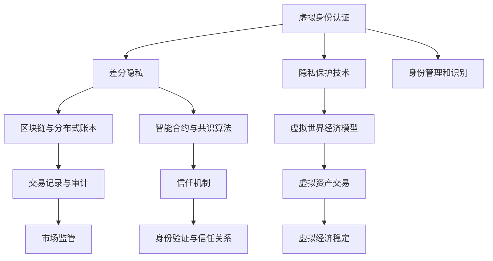

                 

# 虚拟身份市场：AI时代的自我营销

## 1. 背景介绍

### 1.1 问题由来

在AI时代，虚拟身份市场（Metaverse Identity Market）应运而生。随着元宇宙（Metaverse）技术的兴起，人们开始在数字世界中进行交流、协作和交易。虚拟身份不仅是数字世界的身份认证方式，更成为了个性展示、价值表达和社交互动的重要手段。然而，如何构建和维护一个安全的虚拟身份市场，同时促进用户的自我营销和身份认同，成为了一个复杂且重要的课题。

### 1.2 问题核心关键点

虚拟身份市场涉及到多个核心关键点：

- **用户身份管理**：如何在虚拟世界中准确识别用户身份，防止身份伪造和滥用。
- **隐私保护**：如何保护用户隐私，避免个人信息泄露。
- **信任机制**：如何在虚拟身份之间建立信任关系，防止欺诈和恶意行为。
- **自我营销**：如何帮助用户通过虚拟身份进行自我展示和价值传递。
- **市场监管**：如何设计有效的监管机制，防止市场乱象。

本文旨在探讨虚拟身份市场中的核心概念、算法原理及其应用，为开发者和研究者提供全面的技术指导。

## 2. 核心概念与联系

### 2.1 核心概念概述

在虚拟身份市场中，以下几个核心概念尤为关键：

- **虚拟身份认证**：通过加密技术和生物特征识别等手段，验证用户在虚拟世界中的身份合法性。
- **隐私保护技术**：如差分隐私、同态加密、零知识证明等，确保用户数据在传输和存储过程中的安全。
- **区块链与分布式账本技术**：为虚拟身份市场提供去中心化、透明、不可篡改的身份认证和交易记录。
- **信任机制**：基于共识算法、智能合约等技术，实现虚拟身份之间的信任建立和维护。
- **虚拟世界经济模型**：涉及虚拟货币、虚拟资产和虚拟经济体系的设计和管理。

这些概念相互交织，共同构成了虚拟身份市场的基础框架。

### 2.2 核心概念原理和架构的 Mermaid 流程图



这张流程图展示了虚拟身份市场中的关键流程和技术架构：

1. 用户通过虚拟身份认证，验证身份合法性。
2. 隐私保护技术保障数据安全，防止信息泄露。
3. 区块链与分布式账本提供去中心化的身份认证和交易记录。
4. 智能合约与共识算法建立信任机制，实现身份验证和交易。
5. 虚拟世界经济模型设计虚拟货币、资产和市场体系。
6. 信任机制保障身份验证与信任关系的可靠。
7. 交易记录与审计确保市场监管透明和合规。

这些技术相互支持，共同保障了虚拟身份市场的安全、透明和稳定。

## 3. 核心算法原理 & 具体操作步骤

### 3.1 算法原理概述

在虚拟身份市场中，核心算法原理主要包括以下几个方面：

- **身份认证算法**：基于公钥基础设施（PKI）、生物特征识别、多因素认证（MFA）等技术，验证用户身份。
- **隐私保护算法**：如差分隐私、同态加密、零知识证明等，保护用户隐私。
- **共识算法**：如PoW、PoS、DPoS等，确保虚拟身份市场中的信任关系和交易记录的不可篡改性。
- **智能合约**：自动执行、不可篡改的合约，实现虚拟身份之间的信任和交易。

这些算法共同构成了虚拟身份市场的基础框架，保障了市场的高效运作和安全。

### 3.2 算法步骤详解

虚拟身份市场中的算法实现步骤如下：

1. **身份认证**：用户提交身份信息，通过公钥基础设施（PKI）、生物特征识别等多因素认证手段验证身份合法性。

2. **隐私保护**：采用差分隐私技术，对用户数据进行处理，确保数据在传输和存储过程中不被泄露。

3. **共识机制**：采用PoW、PoS等共识算法，实现虚拟身份之间的信任建立和交易记录的不可篡改性。

4. **智能合约**：部署智能合约，实现自动执行、不可篡改的交易和身份验证。

5. **市场监管**：设计有效的监管机制，防止市场乱象，保障市场的公平性和透明度。

### 3.3 算法优缺点

虚拟身份市场的算法实现具有以下优缺点：

**优点**：

- 去中心化的身份认证和交易记录，增强了市场透明度和可信度。
- 采用先进的隐私保护技术，保障用户数据安全。
- 基于共识算法和智能合约，建立可靠的信任机制。

**缺点**：

- 技术复杂，实现成本高。
- 需要强大的计算和存储能力支持。
- 用户隐私和数据安全问题仍需进一步解决。

### 3.4 算法应用领域

虚拟身份市场中的算法广泛应用于以下几个领域：

- **虚拟社交平台**：如Meta Horizon、Decentraland等，通过虚拟身份实现社交互动和内容创作。
- **虚拟经济**：如加密货币、NFT市场等，通过虚拟身份进行资产交易和价值传递。
- **虚拟教育和培训**：通过虚拟身份进行在线学习和互动。
- **虚拟医疗**：通过虚拟身份进行远程诊疗和健康管理。
- **虚拟政府服务**：通过虚拟身份提供公共服务和政务管理。

## 4. 数学模型和公式 & 详细讲解 & 举例说明

### 4.1 数学模型构建

虚拟身份市场的数学模型主要包括以下几个方面：

- **身份认证模型**：基于PKI的公钥密码学模型，用于验证用户身份。
- **隐私保护模型**：差分隐私模型，用于保护用户数据隐私。
- **共识机制模型**：PoW、PoS等共识算法模型，用于确保交易记录的不可篡改性。
- **智能合约模型**：基于区块链技术的智能合约模型，用于自动执行和不可篡改的交易。

### 4.2 公式推导过程

以差分隐私模型为例，其公式推导如下：

$$
\mathcal{D}_{\epsilon}(f) = \{f: f(x) = f(x') + \mathcal{N}(0, \sigma^2) \quad \forall x, x' \in \mathcal{D}, |x - x'| \leq \delta\}
$$

其中，$\mathcal{D}$ 为数据集，$\epsilon$ 为隐私参数，$\sigma$ 为噪声标准差，$\delta$ 为相邻样本的最大差值。

### 4.3 案例分析与讲解

以智能合约为例，其核心公式如下：

$$
\text{if} \, (\text{Condition}) \, \text{then} \, \text{Action} \, \text{else} \, \text{Action}_\text{Default}
$$

其中，Condition为触发条件，Action为执行动作，Action_Default为默认动作。

## 5. 项目实践：代码实例和详细解释说明

### 5.1 开发环境搭建

1. 安装Python：在虚拟身份市场中，Python是最常用的开发语言。

2. 安装依赖库：包括web3.py、pysha3、pandas、numpy等。

3. 搭建测试网络：使用Ganache或Infura等测试网络进行开发测试。

### 5.2 源代码详细实现

以下是一个简单的智能合约示例代码，用于实现虚拟身份市场的身份验证和信任机制：

```python
from web3 import Web3

def create_identity(identity, proof):
    identity_address = identity['address']
    identity_name = identity['name']
    identity_proof = proof

    contract = web3.eth.contract(abi, address=identity_address)

    tx = {
        'to': identity_address,
        'from': web3.eth.accounts[0],
        'gas': 200000,
        'gasPrice': web3.toWei('10', 'gwei'),
        'data': contract.functions.createIdentity(identity_name, identity_proof).encodeABI()
    }

    web3.eth.sendTransaction(tx)
```

### 5.3 代码解读与分析

上述代码实现了创建虚拟身份的功能，主要步骤如下：

1. 使用web3.py连接到以太坊网络。
2. 定义身份信息，包括地址、名称和身份证明。
3. 调用智能合约的createIdentity函数，创建虚拟身份。
4. 发送交易，创建虚拟身份并记录到区块链上。

## 6. 实际应用场景

### 6.1 虚拟社交平台

在虚拟社交平台中，用户可以通过虚拟身份进行互动和内容创作。平台可以使用基于区块链的智能合约，记录和验证用户的社交行为和内容，保障用户隐私和数据安全。

### 6.2 虚拟经济

在虚拟经济中，用户可以通过虚拟身份进行资产交易和价值传递。平台可以使用差分隐私和同态加密等技术，保护用户的交易数据，防止数据泄露和滥用。

### 6.3 虚拟教育和培训

在虚拟教育和培训中，用户可以通过虚拟身份进行在线学习和互动。平台可以使用智能合约，记录和验证学习行为和成绩，保障教育的公平性和透明度。

### 6.4 虚拟医疗

在虚拟医疗中，用户可以通过虚拟身份进行远程诊疗和健康管理。平台可以使用区块链和智能合约，记录和验证诊疗数据，保障医疗信息的安全和可靠。

## 7. 工具和资源推荐

### 7.1 学习资源推荐

1. 《区块链技术与智能合约》：系统介绍区块链和智能合约的基础知识，适合入门学习。
2. 《差分隐私理论与实践》：详细讲解差分隐私的理论和应用，适合深入学习。
3. 《分布式账本与共识机制》：深入介绍分布式账本和共识机制的工作原理，适合技术爱好者。

### 7.2 开发工具推荐

1. Web3.py：Python语言与以太坊智能合约的桥梁，方便开发者使用智能合约。
2. Truffle Suite：基于Solidity语言的智能合约开发工具，支持多种测试网络和部署平台。
3. Ganache：轻量级的以太坊测试网络，方便开发者进行测试和调试。

### 7.3 相关论文推荐

1. 《区块链技术与智能合约》：Yale大学的Sebastian Guner教授所写，系统介绍区块链和智能合约的技术基础。
2. 《差分隐私理论与实践》：John Hopkins大学的Cynthia Dwork教授所写，详细介绍差分隐私的理论和应用。
3. 《分布式账本与共识机制》：IBM的研究团队所写，详细讨论了分布式账本和共识机制的实现。

## 8. 总结：未来发展趋势与挑战

### 8.1 研究成果总结

虚拟身份市场是一个新兴的技术领域，其核心技术如区块链、智能合约、差分隐私等仍在快速发展中。通过本文的探讨，读者可以全面了解虚拟身份市场的基本框架和实现方法。

### 8.2 未来发展趋势

未来，虚拟身份市场将呈现以下几个发展趋势：

- **技术集成**：虚拟身份市场将与其他技术进行深度集成，如AR/VR、IoT等，提供更加丰富和多样的应用场景。
- **跨平台互通**：不同虚拟身份平台之间的互通将更加顺畅，用户可以在不同平台间自由切换，增加使用体验。
- **用户驱动**：用户将更多地参与虚拟身份市场的管理和运营，提高市场的透明度和公平性。

### 8.3 面临的挑战

虚拟身份市场仍面临以下挑战：

- **技术复杂**：实现虚拟身份市场需要掌握多项先进技术，技术门槛较高。
- **数据安全**：如何保障用户数据的安全，防止隐私泄露和数据滥用，仍是一个重要问题。
- **市场规范**：虚拟身份市场缺乏统一的标准和规范，需要制定相应的行业标准和监管机制。

### 8.4 研究展望

未来，虚拟身份市场的研究方向将包括以下几个方面：

- **隐私保护技术**：进一步研究差分隐私、同态加密等隐私保护技术，保障用户隐私。
- **智能合约设计**：研究如何设计更加高效、可靠的智能合约，支持更多的应用场景。
- **跨平台互通**：研究不同虚拟身份平台之间的互通技术，提高用户体验。
- **用户参与管理**：研究如何设计用户友好的界面和交互方式，让用户更多地参与虚拟身份市场的管理和运营。

## 9. 附录：常见问题与解答

**Q1：虚拟身份市场中的身份认证方式有哪些？**

A: 虚拟身份市场中的身份认证方式主要有以下几种：

- 基于公钥基础设施（PKI）的公钥密码学认证。
- 生物特征识别认证，如指纹、人脸识别等。
- 多因素认证（MFA），如短信验证码、邮件验证等。

这些认证方式可以单独使用，也可以组合使用，以提高认证的可靠性和安全性。

**Q2：如何保障虚拟身份市场的隐私安全？**

A: 保障虚拟身份市场的隐私安全主要采用以下几种方式：

- 差分隐私技术，通过对用户数据进行处理，确保数据在传输和存储过程中不被泄露。
- 同态加密技术，允许在加密数据上进行计算，保护用户隐私。
- 零知识证明技术，在不泄露信息的情况下，验证用户身份和数据的真实性。

这些技术可以单独使用，也可以组合使用，以提高隐私保护的效果。

**Q3：什么是共识算法？**

A: 共识算法是指在去中心化的网络中，多个节点通过协商达成一致的算法。常见的共识算法有：

- 工作量证明（PoW）：通过计算工作量来达成共识，如比特币区块链。
- 权益证明（PoS）：根据节点持有权益的大小来达成共识，如以太坊2.0。
- 委托权益证明（DPoS）：通过节点投票选举权益较大的节点来达成共识，如EOS。

这些共识算法可以确保虚拟身份市场中的交易记录不可篡改，增强市场的可信度。

**Q4：如何设计虚拟身份市场的智能合约？**

A: 设计虚拟身份市场的智能合约主要包括以下几个步骤：

- 定义合约的功能和操作。
- 编写合约的ABI（Application Binary Interface）接口。
- 编写合约的Solidity代码，实现合约功能。
- 部署合约到区块链上，并进行测试。

设计智能合约时，需要考虑合约的安全性、可靠性和可扩展性，确保合约能够正常运行。

---

作者：禅与计算机程序设计艺术 / Zen and the Art of Computer Programming

