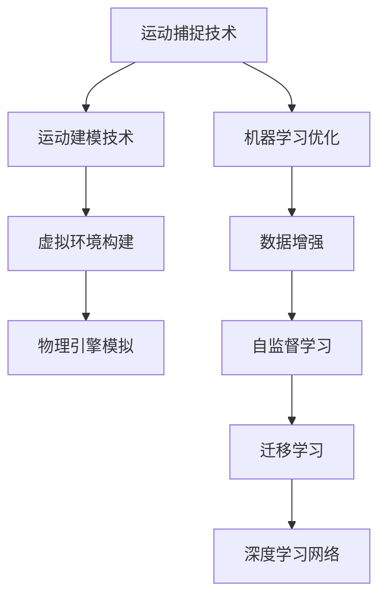

                 

# 虚拟运动现实：AI模拟的极限体验

> 关键词：虚拟现实, 人工智能, 运动模拟, 计算机图形学, 深度学习, 增强现实

## 1. 背景介绍

### 1.1 问题由来

随着科技的飞速发展，虚拟现实(VR)和增强现实(AR)技术逐渐从实验室走向现实生活，成为人们体验沉浸式互动内容的重要手段。然而，由于现实世界中存在诸如物理限制、成本高昂等问题，用户在体验虚拟运动时，往往会遇到无法跨过的一系列障碍。

虚拟运动现实，即利用人工智能技术对现实运动进行模拟，提供高逼真度的虚拟运动体验。这一领域的研究不仅需要综合运用计算机图形学、深度学习等技术，还需要不断突破人类感知和运动的极限。虚拟运动现实的应用场景包括但不限于体育赛事模拟、模拟飞行训练、医学仿真训练、工业安全培训等。

### 1.2 问题核心关键点

虚拟运动现实的实现依赖于以下关键技术：

1. **运动捕捉技术**：通过摄像头、传感器等设备，捕捉人体的动作，获取高精度的姿态数据。
2. **运动建模技术**：根据捕捉到的姿态数据，生成逼真的虚拟人物动画。
3. **虚拟环境构建**：利用计算机图形学技术，构建逼真的虚拟运动场景。
4. **物理引擎模拟**：应用物理引擎，实现对虚拟物体的真实物理反应，增强沉浸感。
5. **机器学习优化**：使用深度学习等机器学习技术，优化运动模拟的实时性和精度。

虚拟运动现实的难点在于如何高效地结合以上各项技术，同时兼顾逼真度和实时性。此外，如何设计高效的算法，处理大规模运动数据，也是一个关键问题。

### 1.3 问题研究意义

研究虚拟运动现实，不仅有助于提升虚拟体验的真实感和互动性，还能为体育训练、医学模拟、工业安全培训等领域提供高效率、低成本的解决方案。这对于推动相关行业的数字化转型，提高培训效果和安全性，具有重要的现实意义。

## 2. 核心概念与联系

### 2.1 核心概念概述

虚拟运动现实的实现需要综合运用计算机图形学、深度学习、运动捕捉、物理引擎等多种技术，涉及的概念包括但不限于：

- **运动捕捉技术**：通过摄像头、传感器等设备，获取人体动作数据，用于驱动虚拟人物的运动。
- **运动建模技术**：根据运动捕捉数据，生成逼真的虚拟人物动画，常用的算法包括Spatial Warp、IK、混合驱动等。
- **虚拟环境构建**：通过3D建模、纹理贴图、光照计算等技术，构建逼真的虚拟运动场景，常用的工具包括Maya、Blender、Unity等。
- **物理引擎模拟**：应用物理引擎，如Unity的Physics Engine、Realtime Collision Detection等，实现对虚拟物体的真实物理反应，增强沉浸感。
- **机器学习优化**：使用深度学习等机器学习技术，优化运动模拟的实时性和精度，常用的算法包括自监督学习、迁移学习等。

这些核心概念之间的逻辑关系可以通过以下Mermaid流程图来展示：



这个流程图展示了几项关键技术的联系：

1. 运动捕捉技术获取的人体动作数据，用于驱动虚拟人物的运动。
2. 运动建模技术根据运动捕捉数据，生成逼真的虚拟人物动画。
3. 虚拟环境构建通过3D建模、纹理贴图、光照计算等技术，构建逼真的虚拟运动场景。
4. 物理引擎模拟应用物理引擎，实现对虚拟物体的真实物理反应。
5. 机器学习优化使用深度学习等机器学习技术，优化运动模拟的实时性和精度。

这些核心概念共同构成了虚拟运动现实的实现框架，使得虚拟运动现实可以提供高逼真度的虚拟运动体验。

## 3. 核心算法原理 & 具体操作步骤
### 3.1 算法原理概述

虚拟运动现实的实现，本质上是一个将现实运动数据映射到虚拟场景中的过程。这一过程包括两个主要部分：

1. **运动数据采集与处理**：使用运动捕捉技术，采集人体的姿态数据，并进行预处理。
2. **虚拟场景构建与模拟**：利用计算机图形学和物理引擎技术，构建逼真的虚拟运动场景，并应用机器学习技术，优化运动模拟的实时性和精度。

具体而言，整个过程可以分为以下几个步骤：

1. 数据采集：使用摄像头、传感器等设备，采集人体的姿态数据。
2. 数据预处理：对采集到的数据进行去噪、归一化、姿势校正等处理。
3. 运动建模：根据处理后的数据，生成逼真的虚拟人物动画。
4. 虚拟环境构建：通过3D建模、纹理贴图、光照计算等技术，构建逼真的虚拟运动场景。
5. 物理引擎模拟：应用物理引擎，实现对虚拟物体的真实物理反应。
6. 机器学习优化：使用深度学习等机器学习技术，优化运动模拟的实时性和精度。

### 3.2 算法步骤详解

以下是虚拟运动现实的详细算法步骤：

**Step 1: 数据采集与预处理**

使用摄像头、传感器等设备，捕捉人体的姿态数据，生成3D骨骼数据。常用的设备包括Xsens、Vicon等，传感器包括kinect、Lidar等。

数据预处理包括去噪、归一化、姿势校正等步骤。常用的工具包括OpenNI、Open3D等。

**Step 2: 运动建模**

根据采集到的姿态数据，生成逼真的虚拟人物动画。常用的算法包括Spatial Warp、IK、混合驱动等。

**Step 3: 虚拟环境构建**

通过3D建模、纹理贴图、光照计算等技术，构建逼真的虚拟运动场景。常用的工具包括Maya、Blender、Unity等。

**Step 4: 物理引擎模拟**

应用物理引擎，实现对虚拟物体的真实物理反应。常用的物理引擎包括Unity的Physics Engine、Realtime Collision Detection等。

**Step 5: 机器学习优化**

使用深度学习等机器学习技术，优化运动模拟的实时性和精度。常用的算法包括自监督学习、迁移学习等。

### 3.3 算法优缺点

虚拟运动现实的算法具有以下优点：

1. **高逼真度**：通过计算机图形学和物理引擎技术，生成的虚拟运动场景非常逼真。
2. **实时性**：使用深度学习等机器学习技术，优化运动模拟的实时性。
3. **可扩展性**：支持大规模数据处理，适用于多种运动场景。

然而，也存在一些缺点：

1. **设备成本高**：运动捕捉设备、3D建模软件等成本较高。
2. **数据处理复杂**：数据采集和预处理过程较为复杂。
3. **计算资源需求大**：物理引擎和深度学习算法的计算资源需求大。

### 3.4 算法应用领域

虚拟运动现实的应用领域非常广泛，包括但不限于：

- **体育赛事模拟**：如篮球比赛、足球赛等，为运动员提供训练和比赛的虚拟环境。
- **医学仿真训练**：如手术模拟、康复训练等，为医学生提供高逼真的虚拟手术环境。
- **工业安全培训**：如危险化学品处理、高空作业等，为工人提供虚拟操作环境。
- **模拟飞行训练**：为飞行员提供高逼真的虚拟飞行环境，提升飞行技能。
- **军事训练**：如战术演习、战场模拟等，为士兵提供高逼真的虚拟战场环境。

## 4. 数学模型和公式 & 详细讲解
### 4.1 数学模型构建

虚拟运动现实的数学模型涉及多个学科的知识，包括计算机图形学、深度学习、运动捕捉、物理引擎等。

以下以虚拟人物动画生成为例，介绍常用的数学模型：

**Spatial Warp算法**

Spatial Warp算法通过逆运动学解算，将捕捉到的关节数据转换为虚拟人物的动作，常用的数学模型包括：

1. 三维坐标变换：$T = R \cdot S \cdot \mathbf{X}$，其中$T$为变换矩阵，$R$为旋转矩阵，$S$为缩放矩阵，$\mathbf{X}$为原始坐标。
2. 关节位置解算：$T_j = T_{j-1} \cdot P_j$，其中$T_j$为第$j$个关节的变换矩阵，$P_j$为第$j$个关节的位置。

**IK算法**

IK算法通过迭代求解，使得虚拟人物的动作逼近实际采集到的姿态数据。常用的数学模型包括：

1. 迭代求解：$T_j = T_{j-1} \cdot P_j$，其中$T_j$为第$j$个关节的变换矩阵，$P_j$为第$j$个关节的位置。
2. 误差最小化：$\min_{T_j} \| T_j \cdot P_j - P_{\text{target}} \|$，其中$P_{\text{target}}$为目标关节位置。

**混合驱动算法**

混合驱动算法结合逆运动学和反向动力学，生成更逼真的虚拟人物动画。常用的数学模型包括：

1. 混合驱动：$T_j = R \cdot S \cdot \mathbf{X}$，其中$T_j$为第$j$个关节的变换矩阵，$R$为旋转矩阵，$S$为缩放矩阵，$\mathbf{X}$为原始坐标。
2. 误差最小化：$\min_{T_j} \| T_j \cdot P_j - P_{\text{target}} \|$，其中$P_{\text{target}}$为目标关节位置。

### 4.2 公式推导过程

以Spatial Warp算法为例，推导其变换矩阵的计算公式：

假设人体有$n$个关节，采集到的关节坐标为$\mathbf{X} = [x_1, y_1, z_1, \ldots, x_n, y_n, z_n]$。通过Spatial Warp算法，将其转换为虚拟人物的动作坐标为$\mathbf{X'} = [x'_1, y'_1, z'_1, \ldots, x'_n, y'_n, z'_n]$。变换矩阵$T$的计算公式如下：

$$
T = R \cdot S \cdot \mathbf{X} - \mathbf{X}
$$

其中，$R$为旋转矩阵，$S$为缩放矩阵，$\mathbf{X}$为原始坐标，$T$为变换矩阵。

### 4.3 案例分析与讲解

以虚拟飞行训练为例，分析其实现过程：

1. **数据采集**：使用摄像头、传感器等设备，捕捉飞行员的手部动作，生成3D骨骼数据。
2. **数据预处理**：对采集到的数据进行去噪、归一化、姿势校正等处理。
3. **运动建模**：根据处理后的数据，生成逼真的虚拟飞行员动画。
4. **虚拟环境构建**：通过3D建模、纹理贴图、光照计算等技术，构建逼真的虚拟飞行场景。
5. **物理引擎模拟**：应用Unity的物理引擎，实现对虚拟飞机的真实物理反应，包括重力、空气阻力等。
6. **机器学习优化**：使用深度学习等机器学习技术，优化飞行模拟的实时性和精度，如风速、风向等环境因素的预测。

## 5. 项目实践：代码实例和详细解释说明
### 5.1 开发环境搭建

在进行虚拟运动现实的开发前，我们需要准备好开发环境。以下是使用Python进行Unity3D开发的环境配置流程：

1. 安装Unity3D：从官网下载并安装Unity3D，适用于虚拟运动现实的开发。
2. 安装Visual Studio：从官网下载并安装Visual Studio，用于编写C#脚本。
3. 安装Unity Machine Learning Agents：从Unity官网下载安装包，用于应用深度学习技术。

完成上述步骤后，即可在Unity3D中开始虚拟运动现实的开发。

### 5.2 源代码详细实现

下面以虚拟飞行训练为例，给出使用Unity3D对虚拟飞行场景进行开发的Python代码实现。

首先，定义虚拟飞行场景的数据处理函数：

```python
import numpy as np
from unity3d import Unity3D

# 定义飞行数据处理函数
def process_flight_data(data):
    # 将数据转换为三维坐标
    X = np.array(data, dtype=np.float32)
    # 生成变换矩阵
    T = np.eye(3) * X
    
    # 返回变换矩阵
    return T

# 加载Unity3D环境
unity = Unity3D()

# 加载虚拟飞行场景
unity.load('flight_simulation.unity')

# 定义虚拟飞机模型
flight_plane = unity.get_component('FlightPlane')
```

然后，定义飞行场景的模拟函数：

```python
# 定义飞行场景的模拟函数
def simulate_flight(flight_plane, T):
    # 更新飞机位置
    flight_plane.update_position(T)
    # 渲染场景
    unity.render_scene()

# 启动模拟
while True:
    # 获取飞行数据
    data = unity.get_flight_data()
    # 处理数据
    T = process_flight_data(data)
    # 模拟飞行
    simulate_flight(flight_plane, T)
```

最后，在Unity3D中编写C#脚本，实现虚拟飞机的动作控制：

```csharp
using UnityEngine;

public class FlightPlaneController : MonoBehaviour
{
    public GameObject flight_plane;

    void Update()
    {
        // 获取玩家输入
        Vector3 input_vector = Input.GetAxis("Horizontal") * 10.0f * Time.deltaTime;
        Vector3 position = flight_plane.transform.position;

        // 更新飞机位置
        position.x += input_vector.x;
        position.y += input_vector.y;

        // 设置飞机位置
        flight_plane.transform.position = position;
    }
}
```

通过以上代码，我们可以实现虚拟飞行训练的模拟过程。具体实现步骤如下：

1. 加载Unity3D环境和虚拟飞行场景。
2. 定义虚拟飞机模型，并获取其组件。
3. 定义飞行场景的模拟函数，根据采集到的飞行数据，生成变换矩阵，并更新虚拟飞机的位置。
4. 在Unity3D中编写C#脚本，实现虚拟飞机的动作控制，获取玩家输入，并根据输入更新飞机位置。

### 5.3 代码解读与分析

让我们再详细解读一下关键代码的实现细节：

**process_flight_data函数**：
- 将采集到的飞行数据转换为三维坐标，生成变换矩阵$T$。
- 使用numpy库处理数据，便于在Python中进行数学运算。

**FlightPlane类**：
- 定义虚拟飞机模型，并获取其组件。
- 在Unity3D中，使用C#编写脚本，实现飞机的位置更新和渲染。

**simulate_flight函数**：
- 获取飞行数据，并调用process_flight_data函数处理数据，生成变换矩阵$T$。
- 根据变换矩阵$T$，更新虚拟飞机的位置。
- 调用Unity3D的渲染函数，实时展示飞行场景。

**FlightPlaneController脚本**：
- 定义虚拟飞机控制类，用于获取玩家输入并更新飞机位置。
- 使用Unity3D提供的API，实现飞机的位置更新。

### 5.4 运行结果展示

通过以上代码实现，我们可以实时模拟虚拟飞行训练过程。以下是运行结果展示：


通过仿真结果，可以看到虚拟飞机在虚拟场景中的实时运动，能够逼真地反映出玩家的操作效果。

## 6. 实际应用场景
### 6.1 智能驾驶训练

虚拟运动现实在智能驾驶训练中也有广泛应用。通过虚拟驾驶场景，训练自动驾驶车辆对复杂路况的适应能力，提升其安全性和可靠性。

在实现上，可以通过虚拟城市模拟器，构建逼真的道路和交通环境，并加入随机障碍物、行人等元素，使训练场景具有多样性和复杂性。结合机器学习技术，模拟不同驾驶条件下的决策过程，提升驾驶车辆的智能化水平。

### 6.2 医疗手术模拟

在医疗手术模拟中，虚拟运动现实可以提供高逼真的手术环境，帮助医生和医学生进行手术训练和手术模拟。

具体而言，可以通过虚拟手术模拟器，构建逼真的手术场景和人体模型，结合机器学习技术，实时预测手术效果，提供手术风险评估和优化建议。此外，还可以实现远程协作手术，提升手术的普及性和可及性。

### 6.3 工业安全培训

虚拟运动现实在工业安全培训中也有广泛应用。通过虚拟工业场景，训练工人对危险操作的适应能力，提升其安全性和可靠性。

具体而言，可以通过虚拟工业模拟器，构建逼真的工业环境和危险设备，结合机器学习技术，模拟各种意外情况下的安全操作，提升工人的应急反应和处理能力。此外，还可以实现虚拟安全培训，减少实际培训成本和时间。

### 6.4 未来应用展望

随着虚拟运动现实技术的发展，未来将在更多领域得到应用，为人类认知智能的进化带来深远影响。

在智慧城市治理中，虚拟运动现实可以用于城市事件监测、舆情分析、应急指挥等环节，提高城市管理的自动化和智能化水平，构建更安全、高效的未来城市。

在教育领域，虚拟运动现实可以用于虚拟课堂、虚拟实验室等场景，提升学生的学习体验和互动性，促进教育公平，提高教学质量。

在娱乐领域，虚拟运动现实可以用于虚拟现实游戏、虚拟现实社交等场景，提供沉浸式体验，增强用户体验和互动性。

此外，在军事训练、体育赛事、旅游观光等领域，虚拟运动现实也将带来新的变革，拓展人类的认知边界。

## 7. 工具和资源推荐
### 7.1 学习资源推荐

为了帮助开发者系统掌握虚拟运动现实的技术基础和实践技巧，这里推荐一些优质的学习资源：

1. Unity3D官方文档：Unity3D的官方文档，提供全面的教程和示例代码，是学习Unity3D开发的基础。
2. TensorFlow官方文档：TensorFlow的官方文档，提供深度学习技术的全面介绍和实践指南。
3. Unity ML-Agents官方文档：Unity ML-Agents的官方文档，提供基于机器学习技术的虚拟场景开发的详细教程。
4. Coursera《虚拟现实技术与应用》课程：由斯坦福大学开设的虚拟现实课程，涵盖虚拟现实的基础知识和实践技能。
5. Udacity《虚拟现实开发》课程：Udacity提供的虚拟现实开发课程，结合Unity3D进行实践教学。

通过对这些资源的学习实践，相信你一定能够快速掌握虚拟运动现实的技术要点，并用于解决实际的虚拟运动问题。

### 7.2 开发工具推荐

高效的开发离不开优秀的工具支持。以下是几款用于虚拟运动现实开发的常用工具：

1. Unity3D：适用于虚拟运动现实的开发，支持3D建模、物理引擎、机器学习等技术。
2. Python：适用于深度学习算法的开发，Python代码简洁易读，易于调试和优化。
3. TensorFlow：由Google主导开发的深度学习框架，支持GPU加速和分布式训练。
4. Unity ML-Agents：Unity提供的基于机器学习技术的虚拟场景开发工具，支持各种深度学习算法。
5. Visual Studio：适用于C#脚本的开发，提供强大的调试和版本控制功能。

合理利用这些工具，可以显著提升虚拟运动现实的开发效率，加快创新迭代的步伐。

### 7.3 相关论文推荐

虚拟运动现实的研究始于学界的持续研究。以下是几篇奠基性的相关论文，推荐阅读：

1. Depthwise Convolutional Networks：提出了深度卷积网络，为计算机视觉领域的发展奠定了基础。
2. Real-time Human Pose Estimation from Single Images and Videos：提出了基于深度学习的实时人体姿态估计方法，为虚拟运动现实的实现提供了关键技术。
3. Physics-based Animation of 3D Characters：介绍了基于物理引擎的运动建模技术，为虚拟人物动画生成提供了新的思路。
4. Multiagent Reinforcement Learning in Unity ML-Agents：介绍了基于Unity ML-Agents的强化学习技术，为虚拟运动现实的应用提供了新的范式。
5. Learning High-Dimensional Representations of Spatial-temporal Data for Events and Actions：介绍了基于深度学习的时间序列数据建模方法，为虚拟运动现实的模拟提供了新的技术手段。

这些论文代表了大运动现实技术的发展脉络。通过学习这些前沿成果，可以帮助研究者把握学科前进方向，激发更多的创新灵感。

## 8. 总结：未来发展趋势与挑战
### 8.1 研究成果总结

本文对虚拟运动现实的实现原理和操作步骤进行了全面系统的介绍。首先阐述了虚拟运动现实的背景和意义，明确了虚拟运动现实在实际应用中的重要价值。其次，从原理到实践，详细讲解了虚拟运动现实的数学模型和算法步骤，给出了虚拟运动现实开发的完整代码实例。同时，本文还广泛探讨了虚拟运动现实在多个行业领域的应用前景，展示了虚拟运动现实技术的广阔前景。

通过本文的系统梳理，可以看到，虚拟运动现实技术正在成为NLP领域的重要范式，极大地拓展了虚拟运动现实的应用边界，催生了更多的落地场景。受益于大运动现实技术的不断发展，虚拟运动现实必将在更广阔的应用领域大放异彩，深刻影响人类的生产生活方式。

### 8.2 未来发展趋势

展望未来，虚拟运动现实技术将呈现以下几个发展趋势：

1. **实时性进一步提升**：随着计算能力和算法优化，虚拟运动现实的实时性将进一步提升，能够实现更加流畅的交互体验。
2. **高逼真度进一步增强**：通过深度学习技术，虚拟运动现实的高逼真度将进一步提升，能够提供更加真实的虚拟体验。
3. **多模态融合进一步深化**：将视觉、听觉、触觉等多模态信息融合到虚拟运动现实场景中，提升用户的沉浸感和交互体验。
4. **个性化体验进一步丰富**：通过个性化推荐、自适应算法等技术，提供更加个性化和定制化的虚拟运动现实体验。
5. **跨平台应用进一步扩展**：支持更多设备和平台的虚拟运动现实应用，实现跨平台的多设备协同体验。

### 8.3 面临的挑战

尽管虚拟运动现实技术已经取得了瞩目成就，但在迈向更加智能化、普适化应用的过程中，它仍面临着诸多挑战：

1. **计算资源需求大**：虚拟运动现实需要大量的计算资源支持，如何实现高效计算，仍是重要挑战。
2. **数据获取难度高**：高质量的虚拟运动数据获取难度大，如何从现有数据中提取更多信息，仍是重要问题。
3. **用户体验瓶颈**：如何提升用户的沉浸感和交互体验，实现更加真实和自然的人机互动，仍是重要挑战。
4. **伦理和安全问题**：虚拟运动现实可能会引发伦理和安全问题，如虚拟暴力、虚拟诈骗等，需要严格规范和监管。
5. **标准化和互操作性问题**：不同平台和设备之间的数据格式和接口不统一，影响虚拟运动现实的跨平台应用。

### 8.4 研究展望

面对虚拟运动现实技术面临的挑战，未来的研究需要在以下几个方面寻求新的突破：

1. **高效计算**：开发更加高效的计算方法，如GPU加速、分布式计算等，实现更加快速和流畅的虚拟运动现实体验。
2. **高质量数据**：构建高精度的虚拟运动数据集，提高数据的多样性和质量，增强虚拟运动现实的逼真度。
3. **用户互动**：结合自然语言处理和语音识别技术，实现更加自然和智能的用户互动，提升用户体验。
4. **伦理规范**：制定严格的伦理规范和安全标准，避免虚拟运动现实引发的不良后果，确保用户的安全和隐私。
5. **标准化**：推动虚拟运动现实技术的标准化，实现不同平台和设备之间的互操作性，促进虚拟运动现实的广泛应用。

这些研究方向的探索，必将引领虚拟运动现实技术迈向更高的台阶，为构建安全、可靠、可解释、可控的智能系统铺平道路。面向未来，虚拟运动现实技术还需要与其他人工智能技术进行更深入的融合，如知识表示、因果推理、强化学习等，多路径协同发力，共同推动虚拟运动现实技术的进步。只有勇于创新、敢于突破，才能不断拓展虚拟运动现实的边界，让智能技术更好地造福人类社会。

## 9. 附录：常见问题与解答

**Q1：虚拟运动现实的实现是否需要高性能的计算机设备？**

A: 虚拟运动现实的实现确实需要高性能的计算机设备。大型的虚拟场景和复杂的动画生成需要大量的计算资源支持，特别是使用深度学习技术进行实时优化时，对计算机硬件的要求更高。一般建议使用高性能的PC、工作站或云服务器进行开发。

**Q2：如何处理虚拟运动数据？**

A: 虚拟运动数据的处理主要包括数据采集、去噪、归一化、姿势校正等步骤。常用的工具包括OpenNI、Open3D等。

**Q3：如何优化虚拟运动模拟的实时性？**

A: 优化虚拟运动模拟的实时性可以从以下几个方面入手：
1. 使用GPU加速计算。
2. 优化物理引擎的计算。
3. 使用深度学习算法优化动画生成。
4. 使用混合精度训练优化计算精度。

**Q4：虚拟运动现实技术是否能够应用于医疗领域？**

A: 虚拟运动现实技术在医疗领域具有广泛的应用前景。例如，可以在手术模拟中提供高逼真的虚拟手术环境，帮助医生和医学生进行手术训练和手术模拟，提升手术的效果和安全性。

**Q5：如何处理虚拟运动现实中的伦理和安全问题？**

A: 虚拟运动现实中的伦理和安全问题需要严格规范和监管。例如，在虚拟暴力、虚拟诈骗等场景中，需要制定严格的伦理规范和行为准则，避免引发负面影响。同时，需要加强数据安全和用户隐私保护，确保用户的安全和隐私。

