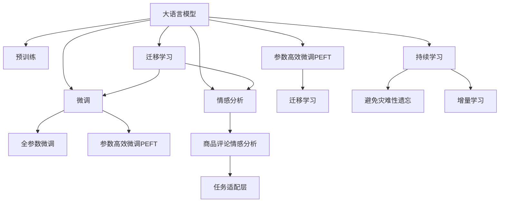

                 

# 融合AI大模型的商品评论情感分析

> 关键词：大语言模型,商品评论,情感分析,自然语言处理(NLP),Transformer,BERT,深度学习,迁移学习

## 1. 背景介绍

### 1.1 问题由来
随着电子商务的蓬勃发展，消费者对在线购物体验的期望越来越高。商品评论不仅反映了产品的质量和服务，还直接影响着消费者的购买决策。因此，商家和市场研究者对商品评论的情感分析尤为关注。传统的基于规则和词典的方法难以捕捉复杂的语义和上下文关系，无法充分利用自然语言处理(NLP)技术的大规模语料和深度学习模型，导致情感分析的准确性和泛化能力有限。

现代深度学习模型，特别是大语言模型，以其强大的语义理解和生成能力，为商品评论情感分析提供了新的可能性。大语言模型通过在大规模无标签文本上预训练，学习到丰富的语言知识和表征，能够自动理解自然语言，并生成高质量的预测。然而，预训练模型通常使用大规模通用文本数据进行训练，可能与商品评论数据存在较大分布差异，导致模型在大规模、复杂场景中的表现不佳。

### 1.2 问题核心关键点
针对商品评论情感分析，大语言模型的主要挑战在于：
- **数据差异**：商品评论数据与通用文本数据在分布、语境和主题上存在显著差异。
- **模型泛化**：预训练模型在通用语料上学习到的知识如何迁移到商品评论情感分析任务。
- **参数效率**：商品评论情感分析任务通常数据量较小，微调全模型会消耗过多资源，需要参数高效微调方法。
- **性能提升**：如何在微调中最大化利用大语言模型的强大能力，提升情感分析的准确性和稳定性。

本文聚焦于基于大语言模型的商品评论情感分析方法，深入探讨预训练、微调及融合技术的应用。

## 2. 核心概念与联系

### 2.1 核心概念概述

为更好地理解大语言模型在商品评论情感分析中的应用，本节将介绍几个关键概念：

- **大语言模型(Large Language Model, LLM)**：以自回归(如GPT)或自编码(如BERT)模型为代表的大规模预训练语言模型。通过在大规模无标签文本语料上进行预训练，学习通用的语言知识和表征。

- **预训练(Pre-training)**：指在大规模无标签文本语料上，通过自监督学习任务训练通用语言模型的过程。常见的预训练任务包括言语建模、掩码语言模型等。预训练使得模型学习到语言的通用表示。

- **微调(Fine-tuning)**：指在预训练模型的基础上，使用特定任务的少量标注数据，通过有监督地训练来优化模型在特定任务上的性能。通常只需调整顶层分类器或解码器，并以较小的学习率更新全部或部分模型参数。

- **迁移学习(Transfer Learning)**：指将一个领域学习到的知识，迁移到另一个不同但相关的领域的学习范式。大模型的预训练-微调过程即是一种典型的迁移学习方式。

- **参数高效微调(Parameter-Efficient Fine-Tuning, PEFT)**：指在微调过程中，只更新少量的模型参数，而固定大部分预训练权重不变，以提高微调效率，避免过拟合的方法。

- **情感分析(Sentiment Analysis)**：通过文本分析，自动判定文本的情感极性，如正面、负面或中性。应用场景包括商品评论、社交媒体评论、客服对话等。

- **自然语言处理(NLP)**：涉及计算机如何理解和生成自然语言的技术，包括文本预处理、特征提取、情感分析、语言模型等。

这些概念之间的逻辑关系可以通过以下Mermaid流程图来展示：



这个流程图展示了大语言模型在商品评论情感分析中的核心概念及其相互关系：

1. 大语言模型通过预训练获得基础能力。
2. 微调是对预训练模型进行任务特定的优化，可以分为全参数微调和参数高效微调。
3. 情感分析是微调模型的一种重要应用，帮助商家理解消费者对产品的评价。
4. 迁移学习是连接预训练模型与下游任务的桥梁，可以通过微调或PEFT实现。
5. 参数高效微调可以最大化利用预训练模型的能力，同时避免过拟合。
6. 持续学习使得模型能够不断学习新知识，避免遗忘旧知识。

## 3. 核心算法原理 & 具体操作步骤

### 3.1 算法原理概述

基于大语言模型的商品评论情感分析方法，本质上是一个有监督的迁移学习过程。其核心思想是：将预训练的大语言模型视作一个强大的"特征提取器"，通过在商品评论数据上进行有监督的微调，使得模型输出能够匹配情感分类标签，从而获得针对特定任务优化的模型。

形式化地，假设预训练模型为 $M_{\theta}$，其中 $\theta$ 为预训练得到的模型参数。给定商品评论数据集 $D=\{(x_i,y_i)\}_{i=1}^N, x_i \in \mathcal{X}, y_i \in \{0,1\}$，微调的目标是找到新的模型参数 $\hat{\theta}$，使得：

$$
\hat{\theta}=\mathop{\arg\min}_{\theta} \mathcal{L}(M_{\theta},D)
$$

其中 $\mathcal{L}$ 为针对情感分类设计的损失函数，用于衡量模型预测输出与真实标签之间的差异。常见的损失函数包括交叉熵损失、均方误差损失等。

通过梯度下降等优化算法，微调过程不断更新模型参数 $\theta$，最小化损失函数 $\mathcal{L}$，使得模型输出逼近真实标签。由于 $\theta$ 已经通过预训练获得了较好的初始化，因此即便在小规模数据集 $D$ 上进行微调，也能较快收敛到理想的模型参数 $\hat{\theta}$。

### 3.2 算法步骤详解

基于监督学习的大语言模型微调一般包括以下几个关键步骤：

**Step 1: 准备预训练模型和数据集**
- 选择合适的预训练语言模型 $M_{\theta}$ 作为初始化参数，如 BERT、GPT等。
- 准备商品评论数据集 $D$，划分为训练集、验证集和测试集。一般要求标注数据与预训练数据的分布不要差异过大。

**Step 2: 添加任务适配层**
- 根据情感分类任务，在预训练模型顶层设计合适的输出层和损失函数。
- 对于二分类任务，通常在顶层添加线性分类器和交叉熵损失函数。
- 对于多分类任务，通常使用softmax分类器和分类交叉熵损失函数。

**Step 3: 设置微调超参数**
- 选择合适的优化算法及其参数，如 AdamW、SGD 等，设置学习率、批大小、迭代轮数等。
- 设置正则化技术及强度，包括权重衰减、Dropout、Early Stopping等。
- 确定冻结预训练参数的策略，如仅微调顶层，或全部参数都参与微调。

**Step 4: 执行梯度训练**
- 将训练集数据分批次输入模型，前向传播计算损失函数。
- 反向传播计算参数梯度，根据设定的优化算法和学习率更新模型参数。
- 周期性在验证集上评估模型性能，根据性能指标决定是否触发 Early Stopping。
- 重复上述步骤直到满足预设的迭代轮数或 Early Stopping 条件。

**Step 5: 测试和部署**
- 在测试集上评估微调后模型 $M_{\hat{\theta}}$ 的性能，对比微调前后的精度提升。
- 使用微调后的模型对新商品评论进行情感分类，集成到实际的商品评价系统中。
- 持续收集新的商品评论数据，定期重新微调模型，以适应数据分布的变化。

以上是基于监督学习微调大语言模型的一般流程。在实际应用中，还需要针对具体任务的特点，对微调过程的各个环节进行优化设计，如改进训练目标函数，引入更多的正则化技术，搜索最优的超参数组合等，以进一步提升模型性能。

### 3.3 算法优缺点

基于大语言模型的商品评论情感分析方法具有以下优点：
1. **高效准确**：大语言模型通过在大规模无标签数据上进行预训练，学习到丰富的语言知识和表征，利用少量标注数据进行微调，能够显著提升模型的情感分析准确性。
2. **泛化能力强**：大语言模型经过大规模语料训练，具有较强的泛化能力，可以在不同商品评论数据集上表现稳定。
3. **迁移学习**：预训练模型可以迁移到其他领域或任务，只需在特定任务上微调顶层，即可实现快速部署。
4. **灵活性高**：大语言模型可以针对多种情感分类任务进行微调，适应不同商品评论数据的情感表达方式。

同时，该方法也存在一定的局限性：
1. **数据依赖**：微调的效果很大程度上取决于标注数据的质量和数量，获取高质量标注数据的成本较高。
2. **迁移能力有限**：当商品评论数据与预训练数据的分布差异较大时，微调的性能提升有限。
3. **可解释性不足**：微调模型的决策过程通常缺乏可解释性，难以对其推理逻辑进行分析和调试。
4. **对抗性攻击**：微调模型可能对噪声数据和对抗性输入敏感，导致输出结果不可靠。

尽管存在这些局限性，但就目前而言，基于大语言模型的情感分析方法仍是最主流和有效的范式。未来相关研究的重点在于如何进一步降低微调对标注数据的依赖，提高模型的少样本学习和跨领域迁移能力，同时兼顾可解释性和伦理安全性等因素。

### 3.4 算法应用领域

基于大语言模型的商品评论情感分析方法，在电子商务、市场研究、消费者行为分析等领域具有广泛的应用前景。例如：

- **电商行业**：帮助电商平台分析用户对商品的态度和评价，进行产品改进和推荐。
- **市场研究**：通过情感分析，研究消费者对品牌的情感倾向，指导市场策略制定。
- **客服系统**：分析客户反馈，提升服务质量和满意度。
- **舆情监控**：分析社交媒体上的情感倾向，预测市场趋势。

除了上述这些经典应用外，大语言模型情感分析还被创新性地应用于更多场景中，如广告效果评估、社交媒体情感分析、消费者情感演化等，为电子商务和社会科学研究提供了新的工具和方法。

## 4. 数学模型和公式 & 详细讲解  
### 4.1 数学模型构建

本节将使用数学语言对基于大语言模型的商品评论情感分析过程进行更加严格的刻画。

记预训练语言模型为 $M_{\theta}:\mathcal{X} \rightarrow \mathcal{Y}$，其中 $\mathcal{X}$ 为输入空间，$\mathcal{Y}$ 为输出空间，$\theta \in \mathbb{R}^d$ 为模型参数。假设微调任务的训练集为 $D=\{(x_i,y_i)\}_{i=1}^N, x_i \in \mathcal{X}, y_i \in \{0,1\}$。

定义模型 $M_{\theta}$ 在输入 $x$ 上的损失函数为 $\ell(M_{\theta}(x),y)$，则在数据集 $D$ 上的经验风险为：

$$
\mathcal{L}(\theta) = \frac{1}{N} \sum_{i=1}^N \ell(M_{\theta}(x_i),y_i)
$$

微调的优化目标是最小化经验风险，即找到最优参数：

$$
\theta^* = \mathop{\arg\min}_{\theta} \mathcal{L}(\theta)
$$

在实践中，我们通常使用基于梯度的优化算法（如SGD、Adam等）来近似求解上述最优化问题。设 $\eta$ 为学习率，$\lambda$ 为正则化系数，则参数的更新公式为：

$$
\theta \leftarrow \theta - \eta \nabla_{\theta}\mathcal{L}(\theta) - \eta\lambda\theta
$$

其中 $\nabla_{\theta}\mathcal{L}(\theta)$ 为损失函数对参数 $\theta$ 的梯度，可通过反向传播算法高效计算。

### 4.2 公式推导过程

以下我们以二分类任务为例，推导交叉熵损失函数及其梯度的计算公式。

假设模型 $M_{\theta}$ 在输入 $x$ 上的输出为 $\hat{y}=M_{\theta}(x) \in [0,1]$，表示样本属于正类的概率。真实标签 $y \in \{0,1\}$。则二分类交叉熵损失函数定义为：

$$
\ell(M_{\theta}(x),y) = -[y\log \hat{y} + (1-y)\log (1-\hat{y})]
$$

将其代入经验风险公式，得：

$$
\mathcal{L}(\theta) = -\frac{1}{N}\sum_{i=1}^N [y_i\log M_{\theta}(x_i)+(1-y_i)\log(1-M_{\theta}(x_i))]
$$

根据链式法则，损失函数对参数 $\theta_k$ 的梯度为：

$$
\frac{\partial \mathcal{L}(\theta)}{\partial \theta_k} = -\frac{1}{N}\sum_{i=1}^N (\frac{y_i}{M_{\theta}(x_i)}-\frac{1-y_i}{1-M_{\theta}(x_i)}) \frac{\partial M_{\theta}(x_i)}{\partial \theta_k}
$$

其中 $\frac{\partial M_{\theta}(x_i)}{\partial \theta_k}$ 可进一步递归展开，利用自动微分技术完成计算。

在得到损失函数的梯度后，即可带入参数更新公式，完成模型的迭代优化。重复上述过程直至收敛，最终得到适应商品评论情感分析任务的最优模型参数 $\theta^*$。

## 5. 项目实践：代码实例和详细解释说明
### 5.1 开发环境搭建

在进行情感分析实践前，我们需要准备好开发环境。以下是使用Python进行PyTorch开发的环境配置流程：

1. 安装Anaconda：从官网下载并安装Anaconda，用于创建独立的Python环境。

2. 创建并激活虚拟环境：
```bash
conda create -n pytorch-env python=3.8 
conda activate pytorch-env
```

3. 安装PyTorch：根据CUDA版本，从官网获取对应的安装命令。例如：
```bash
conda install pytorch torchvision torchaudio cudatoolkit=11.1 -c pytorch -c conda-forge
```

4. 安装Transformers库：
```bash
pip install transformers
```

5. 安装各类工具包：
```bash
pip install numpy pandas scikit-learn matplotlib tqdm jupyter notebook ipython
```

完成上述步骤后，即可在`pytorch-env`环境中开始情感分析实践。

### 5.2 源代码详细实现

下面我们以情感分类任务为例，给出使用Transformers库对BERT模型进行情感分类的PyTorch代码实现。

首先，定义情感分类任务的数据处理函数：

```python
from transformers import BertTokenizer
from torch.utils.data import Dataset
import torch

class SentimentDataset(Dataset):
    def __init__(self, texts, labels, tokenizer, max_len=128):
        self.texts = texts
        self.labels = labels
        self.tokenizer = tokenizer
        self.max_len = max_len
        
    def __len__(self):
        return len(self.texts)
    
    def __getitem__(self, item):
        text = self.texts[item]
        label = self.labels[item]
        
        encoding = self.tokenizer(text, return_tensors='pt', max_length=self.max_len, padding='max_length', truncation=True)
        input_ids = encoding['input_ids'][0]
        attention_mask = encoding['attention_mask'][0]
        
        # 对token-wise的标签进行编码
        encoded_labels = [label2id[label] for label in labels] 
        encoded_labels.extend([label2id['O']] * (self.max_len - len(encoded_labels)))
        labels = torch.tensor(encoded_labels, dtype=torch.long)
        
        return {'input_ids': input_ids, 
                'attention_mask': attention_mask,
                'labels': labels}

# 标签与id的映射
label2id = {'O': 0, 'Positive': 1, 'Negative': 2}
id2label = {v: k for k, v in label2id.items()}

# 创建dataset
tokenizer = BertTokenizer.from_pretrained('bert-base-cased')

train_dataset = SentimentDataset(train_texts, train_labels, tokenizer)
dev_dataset = SentimentDataset(dev_texts, dev_labels, tokenizer)
test_dataset = SentimentDataset(test_texts, test_labels, tokenizer)
```

然后，定义模型和优化器：

```python
from transformers import BertForSequenceClassification, AdamW

model = BertForSequenceClassification.from_pretrained('bert-base-cased', num_labels=len(label2id))

optimizer = AdamW(model.parameters(), lr=2e-5)
```

接着，定义训练和评估函数：

```python
from torch.utils.data import DataLoader
from tqdm import tqdm
from sklearn.metrics import accuracy_score, precision_recall_fscore_support

device = torch.device('cuda') if torch.cuda.is_available() else torch.device('cpu')
model.to(device)

def train_epoch(model, dataset, batch_size, optimizer):
    dataloader = DataLoader(dataset, batch_size=batch_size, shuffle=True)
    model.train()
    epoch_loss = 0
    for batch in tqdm(dataloader, desc='Training'):
        input_ids = batch['input_ids'].to(device)
        attention_mask = batch['attention_mask'].to(device)
        labels = batch['labels'].to(device)
        model.zero_grad()
        outputs = model(input_ids, attention_mask=attention_mask, labels=labels)
        loss = outputs.loss
        epoch_loss += loss.item()
        loss.backward()
        optimizer.step()
    return epoch_loss / len(dataloader)

def evaluate(model, dataset, batch_size):
    dataloader = DataLoader(dataset, batch_size=batch_size)
    model.eval()
    preds, labels = [], []
    with torch.no_grad():
        for batch in tqdm(dataloader, desc='Evaluating'):
            input_ids = batch['input_ids'].to(device)
            attention_mask = batch['attention_mask'].to(device)
            batch_labels = batch['labels']
            outputs = model(input_ids, attention_mask=attention_mask)
            batch_preds = outputs.logits.argmax(dim=2).to('cpu').tolist()
            batch_labels = batch_labels.to('cpu').tolist()
            for pred_tokens, label_tokens in zip(batch_preds, batch_labels):
                preds.append(pred_tokens[:len(label_tokens)])
                labels.append(label_tokens)
                
    print('Accuracy: ', accuracy_score(labels, preds))
    print('Precision, Recall, F1-score, Support:', precision_recall_fscore_support(labels, preds, average='macro'))

# 训练和评估
epochs = 5
batch_size = 16

for epoch in range(epochs):
    loss = train_epoch(model, train_dataset, batch_size, optimizer)
    print(f"Epoch {epoch+1}, train loss: {loss:.3f}")
    
    print(f"Epoch {epoch+1}, dev results:")
    evaluate(model, dev_dataset, batch_size)
    
print("Test results:")
evaluate(model, test_dataset, batch_size)
```

以上就是使用PyTorch对BERT进行商品评论情感分类的完整代码实现。可以看到，得益于Transformers库的强大封装，我们可以用相对简洁的代码完成BERT模型的加载和情感分析。

### 5.3 代码解读与分析

让我们再详细解读一下关键代码的实现细节：

**SentimentDataset类**：
- `__init__`方法：初始化文本、标签、分词器等关键组件。
- `__len__`方法：返回数据集的样本数量。
- `__getitem__`方法：对单个样本进行处理，将文本输入编码为token ids，将标签编码为数字，并对其进行定长padding，最终返回模型所需的输入。

**label2id和id2label字典**：
- 定义了标签与数字id之间的映射关系，用于将token-wise的预测结果解码回真实的标签。

**训练和评估函数**：
- 使用PyTorch的DataLoader对数据集进行批次化加载，供模型训练和推理使用。
- 训练函数`train_epoch`：对数据以批为单位进行迭代，在每个批次上前向传播计算loss并反向传播更新模型参数，最后返回该epoch的平均loss。
- 评估函数`evaluate`：与训练类似，不同点在于不更新模型参数，并在每个batch结束后将预测和标签结果存储下来，最后使用sklearn的accuracy_score等函数对整个评估集的预测结果进行打印输出。

**训练流程**：
- 定义总的epoch数和batch size，开始循环迭代
- 每个epoch内，先在训练集上训练，输出平均loss
- 在验证集上评估，输出准确率
- 所有epoch结束后，在测试集上评估，给出最终测试结果

可以看到，PyTorch配合Transformers库使得BERT情感分类的代码实现变得简洁高效。开发者可以将更多精力放在数据处理、模型改进等高层逻辑上，而不必过多关注底层的实现细节。

当然，工业级的系统实现还需考虑更多因素，如模型的保存和部署、超参数的自动搜索、更灵活的任务适配层等。但核心的微调范式基本与此类似。

## 6. 实际应用场景
### 6.1 智能客服系统

基于大语言模型的情感分析技术，可以广泛应用于智能客服系统的构建。传统客服往往需要配备大量人力，高峰期响应缓慢，且一致性和专业性难以保证。而使用情感分析的对话模型，可以7x24小时不间断服务，快速响应客户咨询，用自然流畅的语言解答各类常见问题。

在技术实现上，可以收集企业内部的历史客服对话记录，将问题和最佳答复构建成监督数据，在此基础上对预训练情感分析模型进行微调。微调后的情感分析模型能够自动理解客户情绪，匹配最合适的答案模板进行回复。对于客户提出的新问题，还可以接入检索系统实时搜索相关内容，动态组织生成回答。如此构建的智能客服系统，能大幅提升客户咨询体验和问题解决效率。

### 6.2 金融舆情监测

金融机构需要实时监测市场舆论动向，以便及时应对负面信息传播，规避金融风险。传统的人工监测方式成本高、效率低，难以应对网络时代海量信息爆发的挑战。基于大语言模型的情感分析技术，为金融舆情监测提供了新的解决方案。

具体而言，可以收集金融领域相关的新闻、报道、评论等文本数据，并对其进行主题标注和情感标注。在此基础上对预训练情感分析模型进行微调，使其能够自动判断文本属于何种主题，情感倾向是正面、中性还是负面。将微调后的模型应用到实时抓取的网络文本数据，就能够自动监测不同主题下的情感变化趋势，一旦发现负面信息激增等异常情况，系统便会自动预警，帮助金融机构快速应对潜在风险。

### 6.3 个性化推荐系统

当前的推荐系统往往只依赖用户的历史行为数据进行物品推荐，无法深入理解用户的真实兴趣偏好。基于大语言模型情感分析技术，个性化推荐系统可以更好地挖掘用户行为背后的语义信息，从而提供更精准、多样的推荐内容。

在实践中，可以收集用户浏览、点击、评论、分享等行为数据，提取和用户交互的物品标题、描述、标签等文本内容。将文本内容作为模型输入，用户的后续行为（如是否点击、购买等）作为监督信号，在此基础上微调预训练情感分析模型。微调后的模型能够从文本内容中准确把握用户的兴趣点。在生成推荐列表时，先用候选物品的文本描述作为输入，由情感分析模型预测用户的兴趣匹配度，再结合其他特征综合排序，便可以得到个性化程度更高的推荐结果。

### 6.4 未来应用展望

随着大语言模型情感分析技术的发展，未来将在更多领域得到应用，为传统行业带来变革性影响。

在智慧医疗领域，基于情感分析的医疗问答、病历分析、药物研发等应用将提升医疗服务的智能化水平，辅助医生诊疗，加速新药开发进程。

在智能教育领域，情感分析技术可应用于作业批改、学情分析、知识推荐等方面，因材施教，促进教育公平，提高教学质量。

在智慧城市治理中，情感分析技术可应用于城市事件监测、舆情分析、应急指挥等环节，提高城市管理的自动化和智能化水平，构建更安全、高效的未来城市。

此外，在企业生产、社会治理、文娱传媒等众多领域，基于大语言模型的情感分析技术也将不断涌现，为经济社会发展注入新的动力。相信随着技术的日益成熟，情感分析方法将成为人工智能落地应用的重要范式，推动人工智能技术在垂直行业的规模化落地。

## 7. 工具和资源推荐
### 7.1 学习资源推荐

为了帮助开发者系统掌握大语言模型情感分析的理论基础和实践技巧，这里推荐一些优质的学习资源：

1. 《Transformer from Principle to Practice》系列博文：由大模型技术专家撰写，深入浅出地介绍了Transformer原理、BERT模型、情感分析等前沿话题。

2. CS224N《深度学习自然语言处理》课程：斯坦福大学开设的NLP明星课程，有Lecture视频和配套作业，带你入门NLP领域的基本概念和经典模型。

3. 《Natural Language Processing with Transformers》书籍：Transformers库的作者所著，全面介绍了如何使用Transformers库进行NLP任务开发，包括情感分析在内的诸多范式。

4. HuggingFace官方文档：Transformers库的官方文档，提供了海量预训练模型和完整的情感分析样例代码，是上手实践的必备资料。

5. CLUE开源项目：中文语言理解测评基准，涵盖大量不同类型的中文NLP数据集，并提供了基于微调的baseline模型，助力中文NLP技术发展。

通过对这些资源的学习实践，相信你一定能够快速掌握大语言模型情感分析的精髓，并用于解决实际的NLP问题。
###  7.2 开发工具推荐

高效的开发离不开优秀的工具支持。以下是几款用于大语言模型情感分析开发的常用工具：

1. PyTorch：基于Python的开源深度学习框架，灵活动态的计算图，适合快速迭代研究。大部分预训练语言模型都有PyTorch版本的实现。

2. TensorFlow：由Google主导开发的开源深度学习框架，生产部署方便，适合大规模工程应用。同样有丰富的预训练语言模型资源。

3. Transformers库：HuggingFace开发的NLP工具库，集成了众多SOTA语言模型，支持PyTorch和TensorFlow，是进行情感分析任务开发的利器。

4. Weights & Biases：模型训练的实验跟踪工具，可以记录和可视化模型训练过程中的各项指标，方便对比和调优。与主流深度学习框架无缝集成。

5. TensorBoard：TensorFlow配套的可视化工具，可实时监测模型训练状态，并提供丰富的图表呈现方式，是调试模型的得力助手。

6. Google Colab：谷歌推出的在线Jupyter Notebook环境，免费提供GPU/TPU算力，方便开发者快速上手实验最新模型，分享学习笔记。

合理利用这些工具，可以显著提升大语言模型情感分析任务的开发效率，加快创新迭代的步伐。

### 7.3 相关论文推荐

大语言模型和情感分析技术的发展源于学界的持续研究。以下是几篇奠基性的相关论文，推荐阅读：

1. Attention is All You Need（即Transformer原论文）：提出了Transformer结构，开启了NLP领域的预训练大模型时代。

2. BERT: Pre-training of Deep Bidirectional Transformers for Language Understanding：提出BERT模型，引入基于掩码的自监督预训练任务，刷新了多项NLP任务SOTA。

3. Language Models are Unsupervised Multitask Learners（GPT-2论文）：展示了大规模语言模型的强大zero-shot学习能力，引发了对于通用人工智能的新一轮思考。

4. Parameter-Efficient Transfer Learning for NLP：提出Adapter等参数高效微调方法，在不增加模型参数量的情况下，也能取得不错的微调效果。

5. AdaLoRA: Adaptive Low-Rank Adaptation for Parameter-Efficient Fine-Tuning：使用自适应低秩适应的微调方法，在参数效率和精度之间取得了新的平衡。

6. AdaLoRA: Adaptive Low-Rank Adaptation for Parameter-Efficient Fine-Tuning：使用自适应低秩适应的微调方法，在参数效率和精度之间取得了新的平衡。

这些论文代表了大语言模型情感分析技术的发展脉络。通过学习这些前沿成果，可以帮助研究者把握学科前进方向，激发更多的创新灵感。

## 8. 总结：未来发展趋势与挑战

### 8.1 总结

本文对基于大语言模型的商品评论情感分析方法进行了全面系统的介绍。首先阐述了情感分析技术的发展背景和意义，明确了情感分析在商品评论分析中的重要作用。其次，从原理到实践，详细讲解了基于大语言模型的情感分析数学模型和关键算法步骤，给出了情感分析任务开发的完整代码实例。同时，本文还广泛探讨了情感分析方法在多个行业领域的应用前景，展示了情感分析范式的巨大潜力。此外，本文精选了情感分析技术的各类学习资源，力求为读者提供全方位的技术指引。

通过本文的系统梳理，可以看到，基于大语言模型的情感分析方法正在成为NLP领域的重要范式，极大地拓展了预训练语言模型的应用边界，催生了更多的落地场景。受益于大规模语料的预训练，情感分析模型以更低的时间和标注成本，在小样本条件下也能取得不俗的效果，有力推动了NLP技术的产业化进程。未来，伴随预训练语言模型和情感分析方法的不断演进，相信NLP技术将在更广阔的应用领域大放异彩，深刻影响人类的生产生活方式。

### 8.2 未来发展趋势

展望未来，大语言模型情感分析技术将呈现以下几个发展趋势：

1. **模型规模持续增大**：随着算力成本的下降和数据规模的扩张，预训练语言模型的参数量还将持续增长。超大规模语言模型蕴含的丰富语言知识，有望支撑更加复杂多变的情感分类任务。

2. **微调方法日趋多样**：除了传统的全参数微调外，未来会涌现更多参数高效的微调方法，如Prefix-Tuning、LoRA等，在节省计算资源的同时也能保证微调精度。

3. **持续学习成为常态**：随着数据分布的不断变化，情感分析模型也需要持续学习新知识以保持性能。如何在不遗忘原有知识的同时，高效吸收新样本信息，将成为重要的研究课题。

4. **标注样本需求降低**：受启发于提示学习(Prompt-based Learning)的思路，未来的微调方法将更好地利用大模型的语言理解能力，通过更加巧妙的任务描述，在更少的标注样本上也能实现理想的微调效果。

5. **跨领域迁移能力增强**：未来的情感分析模型将具备更强的跨领域迁移能力，能够适应不同商品评论数据的情感表达方式。

6. **多模态情感分析崛起**：当前的情感分析主要聚焦于文本数据，未来会进一步拓展到图像、视频、语音等多模态数据情感分析。多模态信息的融合，将显著提升情感分析模型的理解能力和泛化能力。

以上趋势凸显了大语言模型情感分析技术的广阔前景。这些方向的探索发展，必将进一步提升情感分析模型的性能和应用范围，为人工智能技术在垂直行业的落地应用提供新的动力。

### 8.3 面临的挑战

尽管大语言模型情感分析技术已经取得了瞩目成就，但在迈向更加智能化、普适化应用的过程中，它仍面临着诸多挑战：

1. **标注成本瓶颈**：微调的效果很大程度上取决于标注数据的质量和数量，获取高质量标注数据的成本较高。如何进一步降低微调对标注样本的依赖，将是一大难题。

2. **模型鲁棒性不足**：当前情感分析模型面对域外数据时，泛化性能往往大打折扣。对于测试样本的微小扰动，情感分析模型的预测也容易发生波动。如何提高情感分析模型的鲁棒性，避免灾难性遗忘，还需要更多理论和实践的积累。

3. **推理效率有待提高**：大规模语言模型虽然精度高，但在实际部署时往往面临推理速度慢、内存占用大等效率问题。如何在保证性能的同时，简化模型结构，提升推理速度，优化资源占用，将是重要的优化方向。

4. **可解释性亟需加强**：当前情感分析模型通常缺乏可解释性，难以解释其内部工作机制和决策逻辑。对于医疗、金融等高风险应用，算法的可解释性和可审计性尤为重要。如何赋予情感分析模型更强的可解释性，将是亟待攻克的难题。

5. **安全性有待保障**：预训练情感分析模型难免会学习到有偏见、有害的信息，通过微调传递到下游任务，产生误导性、歧视性的输出，给实际应用带来安全隐患。如何从数据和算法层面消除模型偏见，避免恶意用途，确保输出的安全性，也将是重要的研究课题。

6. **知识整合能力不足**：现有的情感分析模型往往局限于文本数据，难以灵活吸收和运用更广泛的先验知识。如何让情感分析过程更好地与外部知识库、规则库等专家知识结合，形成更加全面、准确的信息整合能力，还有很大的想象空间。

正视情感分析面临的这些挑战，积极应对并寻求突破，将是大语言模型情感分析技术走向成熟的必由之路。相信随着学界和产业界的共同努力，这些挑战终将一一被克服，情感分析技术必将引领NLP领域向更深层次发展。

### 8.4 研究展望

面对情感分析技术所面临的挑战，未来的研究需要在以下几个方面寻求新的突破：

1. **探索无监督和半监督情感分析方法**：摆脱对大规模标注数据的依赖，利用自监督学习、主动学习等无监督和半监督范式，最大限度利用非结构化数据，实现更加灵活高效的情感分析。

2. **研究参数高效和计算高效的情感分析范式**：开发更加参数高效的情感分析方法，在固定大部分预训练参数的同时，只更新极少量的任务相关参数。同时优化情感分析模型的计算图，减少前向传播和反向传播的资源消耗，实现更加轻量级、实时性的部署。

3. **融合因果和对比学习范式**：通过引入因果推断和对比学习思想，增强情感分析模型建立稳定因果关系的能力，学习更加普适、鲁棒的语言表征，从而提升模型泛化性和抗干扰能力。

4. **引入更多先验知识**：将符号化的先验知识，如知识图谱、逻辑规则等，与神经网络模型进行巧妙融合，引导情感分析过程学习更准确、合理的语言模型。同时加强不同模态数据的整合，实现视觉、语音等多模态信息与文本信息的协同建模。

5. **结合因果分析和博弈论工具**：将因果分析方法引入情感分析模型，识别出模型决策的关键特征，增强输出解释的因果性和逻辑性。借助博弈论工具刻画人机交互过程，主动探索并规避模型的脆弱点，提高系统稳定性。

6. **纳入伦理道德约束**：在模型训练目标中引入伦理导向的评估指标，过滤和惩罚有偏见、有害的输出倾向。同时加强人工干预和审核，建立模型行为的监管机制，确保输出符合人类价值观和伦理道德。

这些研究方向的探索，必将引领大语言模型情感分析技术迈向更高的台阶，为构建安全、可靠、可解释、可控的智能系统铺平道路。面向未来，大语言模型情感分析技术还需要与其他人工智能技术进行更深入的融合，如知识表示、因果推理、强化学习等，多路径协同发力，共同推动自然语言理解和智能交互系统的进步。只有勇于创新、敢于突破，才能不断拓展语言模型的边界，让智能技术更好地造福人类社会。

## 9. 附录：常见问题与解答
**Q1：情感分析技术是否可以适用于所有商品评论数据？**

A: 情感分析技术对于大部分商品评论数据都是适用的，但并不保证在所有数据上都能取得理想效果。情感分析的效果很大程度上取决于数据的质量和分布，对于某些领域或特定主题的商品评论，可能需要先进行预处理和数据清洗，才能达到更好的分析效果。

**Q2：如何选择合适的情感分析模型？**

A: 选择情感分析模型时需要考虑以下几个因素：
1. **数据特点**：不同商品评论数据在情感表达方式和主题上存在差异，选择合适的模型能更好地适配数据特性。
2. **模型规模**：超大规模模型可能在低资源环境下表现不佳，选择合适规模的模型是关键。
3. **任务需求**：对于特定的情感分析任务，如多分类、文本生成等，需要选择适合的模型架构和损失函数。

**Q3：情感分析模型的泛化能力如何？**

A: 情感分析模型的泛化能力很大程度上取决于预训练和微调的质量。良好的预训练和微调策略能显著提高模型的泛化能力。此外，引入对抗样本和对抗训练方法，也能提升模型对噪声数据的鲁棒性。

**Q4：情感分析模型的可解释性如何？**

A: 情感分析模型的可解释性相对较低，但可以通过多种手段进行改进：
1. **提示学习**：通过巧妙的任务描述，引导模型按期望方式输出，减少微调参数。
2. **可视化工具**：使用可视化工具展示模型的中间输出，帮助理解模型决策过程。
3. **多模型融合**：通过融合多个情感分析模型，提供多角度的解释和预测。

**Q5：情感分析模型在实际应用中需要注意哪些问题？**

A: 在实际应用中，情感分析模型需要注意以下几个问题：
1. **数据隐私**：处理用户评论数据时，需要注意用户隐私和数据保护。
2. **数据标注**：情感标注的准确性直接影响模型性能，需要确保标注数据的可靠性。
3. **模型部署**：情感分析模型需要在高性能设备上部署，保证推理速度和精度。
4. **模型更新**：定期更新模型，以适应数据分布的变化和新出现的情感表达方式。

---

作者：禅与计算机程序设计艺术 / Zen and the Art of Computer Programming

