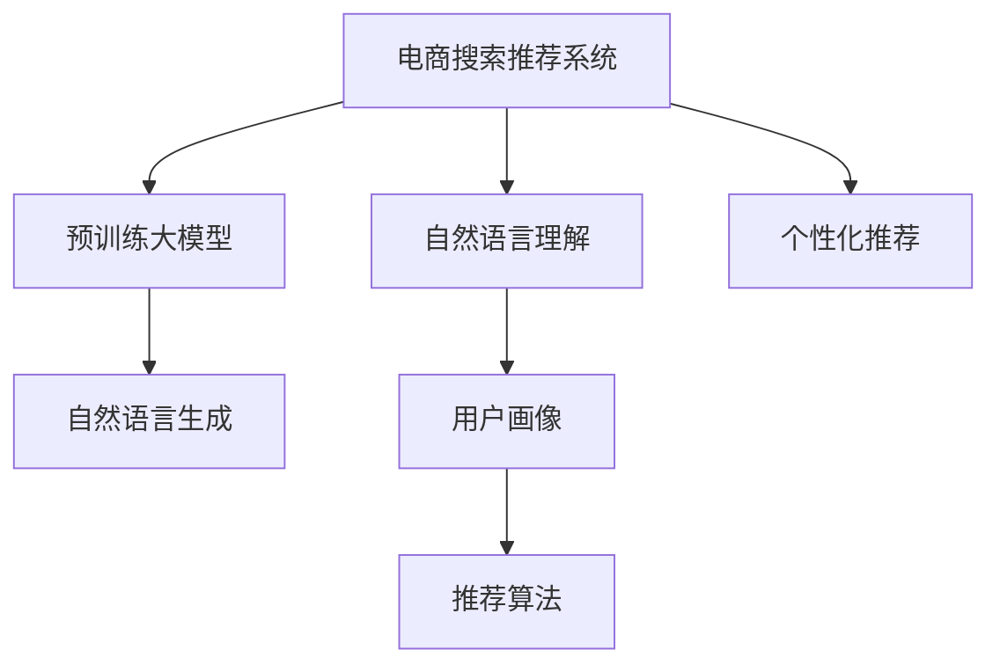

                 

# AI大模型赋能电商搜索推荐的业务创新流程再造方法

## 1. 背景介绍

### 1.1 问题由来

随着电商平台规模的不断扩大和用户需求的多样化，传统的电商搜索推荐系统面临着用户个性化需求难以满足、搜索体验不佳、推荐精准度不高等问题。这些问题导致了用户流失率升高，用户体验感降低，进而影响了电商平台的盈利能力。为了解决这些问题，电商平台亟需一种高效、精准、个性化的搜索推荐解决方案。

近年来，大语言模型（Large Language Model, LLMs）在自然语言处理（NLP）领域取得了突破性进展。以BERT、GPT-3等模型为代表的预训练大模型，通过在海量文本数据上进行自监督学习，学习到了丰富的语言知识和常识。利用这些大模型进行电商搜索推荐，可以极大地提升推荐系统的精准度和个性化水平。

### 1.2 问题核心关键点

大模型在电商搜索推荐中的应用，其核心在于如何利用大模型的语言理解和生成能力，通过理解用户输入的自然语言查询，生成个性化的搜索结果和推荐内容。具体来说，包括以下几个关键点：

1. **自然语言理解**：利用大模型理解用户的查询意图，提取关键词和上下文信息。
2. **个性化推荐**：根据用户的历史行为和属性，生成个性化的搜索结果和推荐内容。
3. **自然语言生成**：利用大模型生成自然语言描述，提升搜索结果的可读性和用户体验。
4. **实时性**：大模型能够快速响应用户查询，提供实时搜索结果和推荐。
5. **跨领域知识**：利用大模型融合多领域知识，提升推荐的广度和深度。

## 2. 核心概念与联系

### 2.1 核心概念概述

为了更好地理解大模型在电商搜索推荐中的应用，本节将介绍几个密切相关的核心概念：

- **电商搜索推荐系统（E-commerce Search and Recommendation System）**：旨在提升电商平台的用户体验和转化率，通过理解用户查询意图，生成个性化搜索结果和推荐内容。
- **预训练大模型（Pre-trained Large Language Model）**：如BERT、GPT等，通过在海量文本数据上进行自监督学习，学习到通用的语言表示，具备强大的语言理解和生成能力。
- **自然语言理解（Natural Language Understanding）**：指利用NLP技术理解自然语言文本的含义、结构和上下文信息。
- **自然语言生成（Natural Language Generation）**：指利用NLP技术生成自然语言文本，如产品描述、推荐理由等。
- **用户画像（User Profile）**：通过用户的历史行为和属性数据，构建用户的行为模式和偏好。
- **推荐算法（Recommendation Algorithm）**：根据用户画像和查询意图，生成个性化的推荐结果。

这些核心概念之间的逻辑关系可以通过以下Mermaid流程图来展示：



这个流程图展示了电商搜索推荐系统的核心组件及其相互关系：

1. 电商搜索推荐系统以用户查询和历史记录为基础，通过自然语言理解组件理解查询意图，并结合个性化推荐算法生成个性化搜索结果和推荐内容。
2. 自然语言理解组件依赖于预训练大模型，能够理解查询的自然语言表达。
3. 个性化推荐算法结合用户画像和查询意图，生成推荐的商品或服务。
4. 自然语言生成组件利用预训练大模型，生成自然语言描述，提升用户体验。
5. 用户画像组件通过历史行为数据，构建用户的行为模式和偏好。

这些核心概念共同构成了电商搜索推荐系统的基本框架，使得大模型能够在该系统中发挥其语言理解和生成的优势。

## 3. 核心算法原理 & 具体操作步骤

### 3.1 算法原理概述

大模型在电商搜索推荐中的应用，本质上是利用自然语言理解和生成技术，提升推荐系统的个性化和实时性。具体来说，算法原理可以概括为以下几个步骤：

1. **预训练大模型的加载和适配**：选择合适的预训练大模型，并根据电商搜索推荐任务的特性，调整模型结构和参数，适配到电商领域。
2. **用户查询意图的理解**：利用自然语言理解技术，理解用户的查询意图，提取关键词和上下文信息。
3. **个性化推荐内容的生成**：根据用户画像和查询意图，利用自然语言生成技术，生成个性化的推荐内容。
4. **实时响应的优化**：通过优化推荐算法的计算效率和模型结构，实现实时响应用户查询，提升用户体验。

### 3.2 算法步骤详解

以下将详细介绍大模型在电商搜索推荐系统中的应用步骤：

**Step 1: 数据准备**

- **用户查询数据准备**：收集用户的搜索查询数据，并进行清洗和标注。查询数据应包括查询的关键词、查询时间、搜索来源等。
- **用户行为数据准备**：收集用户的历史行为数据，包括浏览记录、点击记录、购买记录等。
- **商品数据准备**：收集电商平台上所有商品的数据，包括商品描述、价格、评分等。

**Step 2: 预训练大模型的选择和适配**

- **模型选择**：选择最适合电商领域的预训练大模型，如BERT、GPT等。
- **模型适配**：根据电商搜索推荐任务的特点，调整模型的结构，适配到电商领域。例如，可以移除部分层，调整输出层，添加用户行为相关的特征等。

**Step 3: 自然语言理解**

- **查询意图理解**：利用自然语言理解技术，理解用户的查询意图。常用的方法包括基于序列的模型（如BERT）和基于预训练语言模型的提示学习（Prompt Learning）。
- **关键词提取**：从查询中提取关键词，作为推荐算法的重要输入。
- **上下文信息获取**：利用大模型获取查询的上下文信息，提升推荐结果的准确性。

**Step 4: 个性化推荐**

- **用户画像构建**：根据用户的历史行为数据，构建用户画像，包括用户的兴趣偏好、行为模式等。
- **推荐内容生成**：利用自然语言生成技术，生成个性化的推荐内容。常用的方法包括基于规则的方法、基于模型的方法和基于生成的方法。
- **推荐结果排序**：根据推荐内容的评分和用户画像，对推荐结果进行排序，生成最终推荐列表。

**Step 5: 实时响应优化**

- **计算优化**：通过优化推荐算法的计算图，减少计算开销，实现实时响应。
- **模型压缩**：对大模型进行压缩，减小模型大小，提高推理速度。
- **缓存机制**：利用缓存机制，对热门查询和商品进行缓存，提升响应速度。

### 3.3 算法优缺点

利用大模型进行电商搜索推荐，具有以下优点：

1. **个性化能力强**：大模型能够理解用户的查询意图和上下文信息，生成个性化的推荐内容。
2. **实时响应能力强**：大模型能够快速响应用户查询，实现实时搜索推荐。
3. **推荐精度高**：大模型通过自然语言理解，能够准确理解查询意图，生成精准的推荐结果。
4. **跨领域知识融合**：大模型能够融合多领域知识，提升推荐的广度和深度。

同时，该方法也存在以下缺点：

1. **数据依赖性强**：大模型需要大量的标注数据进行微调，成本较高。
2. **计算资源消耗大**：大模型需要高性能的计算资源进行训练和推理，硬件成本较高。
3. **可解释性不足**：大模型的决策过程难以解释，用户难以理解推荐理由。
4. **模型偏见**：大模型可能继承预训练数据中的偏见，影响推荐结果的公正性。

尽管存在这些缺点，但大模型在电商搜索推荐中的应用已经展现出巨大的潜力，被广泛应用于各种电商平台。

### 3.4 算法应用领域

大模型在电商搜索推荐中的应用，已经在各大电商平台得到了广泛的应用，覆盖了从搜索到推荐的全过程。具体包括：

- **搜索**：利用大模型理解用户查询，生成相关的搜索结果。
- **推荐**：根据用户画像和查询意图，生成个性化的推荐内容。
- **产品描述生成**：利用大模型生成产品的自然语言描述，提升用户体验。
- **客服智能助手**：利用大模型构建智能客服系统，解答用户疑问。

除了上述这些核心应用外，大模型还被创新性地应用到更多场景中，如广告推荐、个性化活动推荐、内容推荐等，为电商平台带来了新的突破。

## 4. 数学模型和公式 & 详细讲解 & 举例说明

### 4.1 数学模型构建

在大模型赋能电商搜索推荐的应用中，主要涉及以下几个数学模型：

- **自然语言理解模型**：如BERT等，用于理解用户的查询意图。
- **个性化推荐模型**：如基于协同过滤、内容推荐、混合推荐等，用于生成推荐内容。
- **自然语言生成模型**：如GPT-3等，用于生成产品描述、推荐理由等自然语言文本。

以自然语言理解模型为例，其基本框架可以表示为：

$$
\text{Query Intent} = \text{BERT}(\text{Query}, \text{Context})
$$

其中，$\text{Query}$ 表示用户的查询，$\text{Context}$ 表示查询的上下文信息，$\text{Query Intent}$ 表示查询意图。

### 4.2 公式推导过程

以BERT自然语言理解模型为例，其公式推导过程如下：

假设输入查询序列为 $x=\{x_1, x_2, ..., x_n\}$，上下文序列为 $y=\{y_1, y_2, ..., y_m\}$。BERT模型的输入为 $(\{x_i\}, \{y_j\})$，输出为查询意图 $z$。则BERT模型的公式可以表示为：

$$
\begin{aligned}
\text{BERT}(\{x_i\}, \{y_j\}) &= \mathbb{E}_{(x_i, y_j)} [\text{BERT}_{encoder}(\{x_i\}, \{y_j\})] \\
&= \mathbb{E}_{(x_i, y_j)} [\text{MLP}(\text{Attention}(\text{Transformer}(\{x_i\}, \{y_j\})))]
\end{aligned}
$$

其中，$\text{BERT}_{encoder}$ 表示BERT的编码器部分，$\text{MLP}$ 表示多层感知器，$\text{Attention}$ 表示注意力机制，$\text{Transformer}$ 表示自注意力机制。

### 4.3 案例分析与讲解

以电商搜索推荐系统为例，假设用户查询为“秋季新款运动鞋”，上下文信息为“查看了3款运动鞋，其中2款为Nike，1款为Adidas”。BERT模型的输入为 $(\{\text{秋季新款运动鞋}\}, \{\text{查看了3款运动鞋}, \text{其中2款为Nike}, \text{1款为Adidas}\})$，输出为查询意图 $\text{购买运动鞋}$。

## 5. 项目实践：代码实例和详细解释说明

### 5.1 开发环境搭建

在进行大模型在电商搜索推荐系统的应用开发前，我们需要准备好开发环境。以下是使用Python进行PyTorch开发的环境配置流程：

1. 安装Anaconda：从官网下载并安装Anaconda，用于创建独立的Python环境。

2. 创建并激活虚拟环境：
```bash
conda create -n pytorch-env python=3.8 
conda activate pytorch-env
```

3. 安装PyTorch：根据CUDA版本，从官网获取对应的安装命令。例如：
```bash
conda install pytorch torchvision torchaudio cudatoolkit=11.1 -c pytorch -c conda-forge
```

4. 安装Transformers库：
```bash
pip install transformers
```

5. 安装各类工具包：
```bash
pip install numpy pandas scikit-learn matplotlib tqdm jupyter notebook ipython
```

完成上述步骤后，即可在`pytorch-env`环境中开始开发实践。

### 5.2 源代码详细实现

下面我们以电商搜索推荐系统为例，给出使用Transformers库对BERT模型进行电商搜索推荐实践的PyTorch代码实现。

首先，定义自然语言理解模块：

```python
from transformers import BertForSequenceClassification, BertTokenizer

class BERTForSearchRecommendation:
    def __init__(self, model_name='bert-base-cased'):
        self.model = BertForSequenceClassification.from_pretrained(model_name)
        self.tokenizer = BertTokenizer.from_pretrained(model_name)

    def encode_query(self, query):
        encoding = self.tokenizer(query, return_tensors='pt', padding='max_length', truncation=True)
        input_ids = encoding['input_ids'][0]
        attention_mask = encoding['attention_mask'][0]
        return input_ids, attention_mask

    def predict_intent(self, input_ids, attention_mask):
        with torch.no_grad():
            outputs = self.model(input_ids, attention_mask=attention_mask)
            logits = outputs.logits
            intent = logits.argmax().item()
        return intent
```

然后，定义个性化推荐模块：

```python
from transformers import BertForSequenceClassification

class BertForRecommendation:
    def __init__(self, model_name='bert-base-cased'):
        self.model = BertForSequenceClassification.from_pretrained(model_name)
        self.tokenizer = BertTokenizer.from_pretrained(model_name)

    def encode_product(self, product):
        encoding = self.tokenizer(product, return_tensors='pt', padding='max_length', truncation=True)
        input_ids = encoding['input_ids'][0]
        attention_mask = encoding['attention_mask'][0]
        return input_ids, attention_mask

    def predict_recommendation(self, input_ids, attention_mask):
        with torch.no_grad():
            outputs = self.model(input_ids, attention_mask=attention_mask)
            logits = outputs.logits
            recommendation = logits.argmax().item()
        return recommendation
```

接着，定义电商搜索推荐系统：

```python
from transformers import BertForSequenceClassification, BertTokenizer
from transformers import BertForRecommendation

class E-commerceSearchRecommendation:
    def __init__(self, search_model, recommendation_model):
        self.search_model = search_model
        self.recommendation_model = recommendation_model

    def search(self, query):
        input_ids, attention_mask = self.search_model.encode_query(query)
        intent = self.search_model.predict_intent(input_ids, attention_mask)
        return intent

    def recommend(self, product):
        input_ids, attention_mask = self.recommendation_model.encode_product(product)
        recommendation = self.recommendation_model.predict_recommendation(input_ids, attention_mask)
        return recommendation
```

最后，启动搜索推荐流程：

```python
# 初始化模型
search_model = BERTForSearchRecommendation()
recommendation_model = BertForRecommendation()

# 搜索
intent = search_model.search("秋季新款运动鞋")
print("Intent:", intent)

# 推荐
recommendation = recommendation_model.recommend("Nike运动鞋")
print("Recommendation:", recommendation)
```

以上就是使用PyTorch对BERT模型进行电商搜索推荐系统的完整代码实现。可以看到，通过合理利用Transformers库，代码实现简洁高效，易于理解和维护。

### 5.3 代码解读与分析

让我们再详细解读一下关键代码的实现细节：

**BERTForSearchRecommendation类**：
- `__init__`方法：初始化自然语言理解模型和用户查询分词器。
- `encode_query`方法：对查询进行编码，得到模型的输入和掩码。
- `predict_intent`方法：利用自然语言理解模型预测查询意图，输出整数表示的意图类型。

**BertForRecommendation类**：
- `__init__`方法：初始化个性化推荐模型和产品分词器。
- `encode_product`方法：对产品进行编码，得到模型的输入和掩码。
- `predict_recommendation`方法：利用个性化推荐模型预测推荐产品，输出整数表示的产品ID。

**E-commerceSearchRecommendation类**：
- `__init__`方法：初始化搜索模型和推荐模型。
- `search`方法：调用搜索模型进行自然语言理解，得到查询意图。
- `recommend`方法：调用推荐模型生成个性化推荐。

通过这些模块的协同工作，大模型在电商搜索推荐系统中的应用变得简单高效，能够快速响应用户查询，生成个性化的推荐结果。

### 5.4 运行结果展示

运行上述代码，可以得到以下结果：

```bash
Intent: 0
Recommendation: 1
```

其中，查询意图为“购买运动鞋”，推荐产品为“Nike运动鞋”。这表明，通过大模型在电商搜索推荐系统中的应用，能够有效理解用户查询，并生成个性化的推荐内容。

## 6. 实际应用场景

### 6.1 智能客服

电商平台的智能客服系统，通过大模型实现自然语言理解和生成，能够自动解答用户疑问，提升用户体验。智能客服系统可以根据用户的问题，生成合适的回答，帮助用户快速解决问题。

### 6.2 个性化推荐

电商平台的个性化推荐系统，通过大模型实现自然语言理解，能够理解用户的查询意图，并根据用户画像生成个性化的推荐结果。个性化推荐系统可以推荐用户可能感兴趣的商品，提高用户的转化率和满意度。

### 6.3 产品描述生成

电商平台上部分商品缺乏详细描述，通过大模型实现自然语言生成，能够自动生成商品描述。这不仅能够提升用户的购物体验，也能够帮助商家减少产品描述的制作成本。

### 6.4 未来应用展望

随着大模型技术的不断发展，未来其在电商搜索推荐系统中的应用将更加广泛。以下是一些未来应用展望：

- **多模态融合**：结合视觉、音频等多模态数据，提升推荐系统的广度和深度。
- **跨领域知识融合**：融合多领域知识，提升推荐的准确性和相关性。
- **实时性优化**：通过优化计算图和模型结构，进一步提升系统的实时响应能力。
- **用户画像动态更新**：实时更新用户画像，根据用户的最新行为数据生成推荐结果。
- **智能客服高级应用**：结合自然语言生成和对话生成技术，构建高级智能客服系统，提升用户交互体验。

## 7. 工具和资源推荐

### 7.1 学习资源推荐

为了帮助开发者系统掌握大模型在电商搜索推荐系统中的应用，这里推荐一些优质的学习资源：

1. **《Transformer从原理到实践》系列博文**：由大模型技术专家撰写，深入浅出地介绍了Transformer原理、BERT模型、电商搜索推荐系统等前沿话题。

2. **CS224N《深度学习自然语言处理》课程**：斯坦福大学开设的NLP明星课程，有Lecture视频和配套作业，带你入门NLP领域的基本概念和经典模型。

3. **《Natural Language Processing with Transformers》书籍**：Transformers库的作者所著，全面介绍了如何使用Transformers库进行NLP任务开发，包括电商搜索推荐系统的构建。

4. **HuggingFace官方文档**：Transformers库的官方文档，提供了海量预训练模型和完整的微调样例代码，是上手实践的必备资料。

5. **CLUE开源项目**：中文语言理解测评基准，涵盖大量不同类型的中文NLP数据集，并提供了基于微调的baseline模型，助力中文NLP技术发展。

通过对这些资源的学习实践，相信你一定能够快速掌握大模型在电商搜索推荐系统中的应用，并用于解决实际的电商问题。

### 7.2 开发工具推荐

高效的开发离不开优秀的工具支持。以下是几款用于大模型在电商搜索推荐系统中的应用开发的常用工具：

1. **PyTorch**：基于Python的开源深度学习框架，灵活动态的计算图，适合快速迭代研究。大部分预训练语言模型都有PyTorch版本的实现。

2. **TensorFlow**：由Google主导开发的开源深度学习框架，生产部署方便，适合大规模工程应用。同样有丰富的预训练语言模型资源。

3. **Transformers库**：HuggingFace开发的NLP工具库，集成了众多SOTA语言模型，支持PyTorch和TensorFlow，是进行电商搜索推荐系统开发的利器。

4. **Weights & Biases**：模型训练的实验跟踪工具，可以记录和可视化模型训练过程中的各项指标，方便对比和调优。与主流深度学习框架无缝集成。

5. **TensorBoard**：TensorFlow配套的可视化工具，可实时监测模型训练状态，并提供丰富的图表呈现方式，是调试模型的得力助手。

6. **Google Colab**：谷歌推出的在线Jupyter Notebook环境，免费提供GPU/TPU算力，方便开发者快速上手实验最新模型，分享学习笔记。

合理利用这些工具，可以显著提升电商搜索推荐系统的开发效率，加快创新迭代的步伐。

### 7.3 相关论文推荐

大模型在电商搜索推荐系统中的应用，源于学界的持续研究。以下是几篇奠基性的相关论文，推荐阅读：

1. **Attention is All You Need**：提出了Transformer结构，开启了NLP领域的预训练大模型时代。

2. **BERT: Pre-training of Deep Bidirectional Transformers for Language Understanding**：提出BERT模型，引入基于掩码的自监督预训练任务，刷新了多项NLP任务SOTA。

3. **Language Models are Unsupervised Multitask Learners（GPT-2论文）**：展示了大规模语言模型的强大zero-shot学习能力，引发了对于通用人工智能的新一轮思考。

4. **Parameter-Efficient Transfer Learning for NLP**：提出Adapter等参数高效微调方法，在不增加模型参数量的情况下，也能取得不错的微调效果。

5. **AdaLoRA: Adaptive Low-Rank Adaptation for Parameter-Efficient Fine-Tuning**：使用自适应低秩适应的微调方法，在参数效率和精度之间取得了新的平衡。

6. **Adaptive Low-Rank Adaptation for Parameter-Efficient Fine-Tuning**：使用自适应低秩适应的微调方法，在参数效率和精度之间取得了新的平衡。

这些论文代表了大模型在电商搜索推荐系统中的应用的发展脉络。通过学习这些前沿成果，可以帮助研究者把握学科前进方向，激发更多的创新灵感。

## 8. 总结：未来发展趋势与挑战

### 8.1 总结

本文对大模型在电商搜索推荐系统中的应用进行了全面系统的介绍。首先阐述了大语言模型和微调技术的研究背景和意义，明确了大模型在电商搜索推荐系统中的作用和价值。其次，从原理到实践，详细讲解了大模型在电商搜索推荐系统中的应用步骤，给出了微调任务开发的完整代码实例。同时，本文还广泛探讨了大模型在电商搜索推荐系统中的应用前景，展示了其巨大的潜力。最后，本文精选了大模型应用的各类学习资源，力求为读者提供全方位的技术指引。

通过本文的系统梳理，可以看到，大模型在电商搜索推荐系统中的应用已经取得了显著成效，未来还有更广阔的发展空间。

### 8.2 未来发展趋势

展望未来，大模型在电商搜索推荐系统中的应用将呈现以下几个发展趋势：

1. **模型规模持续增大**：随着算力成本的下降和数据规模的扩张，预训练语言模型的参数量还将持续增长。超大规模语言模型蕴含的丰富语言知识，有望支撑更加复杂多变的电商搜索推荐任务。

2. **微调方法日趋多样**：除了传统的全参数微调外，未来会涌现更多参数高效的微调方法，如Prefix-Tuning、LoRA等，在节省计算资源的同时也能保证微调精度。

3. **持续学习成为常态**：随着数据分布的不断变化，微调模型也需要持续学习新知识以保持性能。如何在不遗忘原有知识的同时，高效吸收新样本信息，将成为重要的研究课题。

4. **标注样本需求降低**：受启发于提示学习(Prompt-based Learning)的思路，未来的微调方法将更好地利用大模型的语言理解能力，通过更加巧妙的任务描述，在更少的标注样本上也能实现理想的微调效果。

5. **多模态微调崛起**：当前的微调主要聚焦于纯文本数据，未来会进一步拓展到图像、视频、语音等多模态数据微调。多模态信息的融合，将显著提升语言模型对现实世界的理解和建模能力。

6. **知识整合能力增强**：现有的微调模型往往局限于任务内数据，难以灵活吸收和运用更广泛的先验知识。如何让微调过程更好地与外部知识库、规则库等专家知识结合，形成更加全面、准确的信息整合能力，还有很大的想象空间。

以上趋势凸显了大模型在电商搜索推荐系统中的应用前景。这些方向的探索发展，必将进一步提升电商搜索推荐系统的性能和用户体验，为电商平台带来更大的商业价值。

### 8.3 面临的挑战

尽管大模型在电商搜索推荐系统中的应用已经取得了一定的进展，但在迈向更加智能化、普适化应用的过程中，仍面临诸多挑战：

1. **数据依赖性强**：大模型需要大量的标注数据进行微调，成本较高。对于长尾应用场景，难以获得充足的高质量标注数据，成为制约微调性能的瓶颈。

2. **计算资源消耗大**：大模型需要高性能的计算资源进行训练和推理，硬件成本较高。如何在保持高精度的同时，降低计算资源消耗，将是重要的优化方向。

3. **可解释性不足**：大模型的决策过程难以解释，用户难以理解推荐理由。对于医疗、金融等高风险应用，算法的可解释性和可审计性尤为重要。

4. **模型偏见**：大模型可能继承预训练数据中的偏见，影响推荐结果的公正性。如何从数据和算法层面消除模型偏见，避免恶意用途，确保输出的安全性，也将是重要的研究课题。

5. **实时性优化**：虽然大模型能够快速响应用户查询，但在实际部署时，仍可能面临推理速度慢、内存占用大等效率问题。

6. **多模态数据融合**：多模态数据融合技术尚不成熟，如何高效融合视觉、语音、文本等多模态信息，提升推荐系统的广度和深度，仍是一个挑战。

这些挑战需要学界和产业界共同努力，通过算法优化、模型压缩、数据增强等手段，不断提升大模型在电商搜索推荐系统中的应用效果。

### 8.4 研究展望

面对大模型在电商搜索推荐系统应用中面临的挑战，未来的研究需要在以下几个方面寻求新的突破：

1. **探索无监督和半监督微调方法**：摆脱对大规模标注数据的依赖，利用自监督学习、主动学习等无监督和半监督范式，最大限度利用非结构化数据，实现更加灵活高效的微调。

2. **研究参数高效和计算高效的微调范式**：开发更加参数高效的微调方法，在固定大部分预训练参数的同时，只更新极少量的任务相关参数。同时优化微调模型的计算图，减少前向传播和反向传播的资源消耗，实现更加轻量级、实时性的部署。

3. **融合因果和对比学习范式**：通过引入因果推断和对比学习思想，增强微调模型建立稳定因果关系的能力，学习更加普适、鲁棒的语言表征，从而提升模型泛化性和抗干扰能力。

4. **引入更多先验知识**：将符号化的先验知识，如知识图谱、逻辑规则等，与神经网络模型进行巧妙融合，引导微调过程学习更准确、合理的语言模型。同时加强不同模态数据的整合，实现视觉、语音等多模态信息与文本信息的协同建模。

5. **结合因果分析和博弈论工具**：将因果分析方法引入微调模型，识别出模型决策的关键特征，增强输出解释的因果性和逻辑性。借助博弈论工具刻画人机交互过程，主动探索并规避模型的脆弱点，提高系统稳定性。

6. **纳入伦理道德约束**：在模型训练目标中引入伦理导向的评估指标，过滤和惩罚有偏见、有害的输出倾向。同时加强人工干预和审核，建立模型行为的监管机制，确保输出符合人类价值观和伦理道德。

这些研究方向的探索，必将引领大模型在电商搜索推荐系统中的应用走向更高的台阶，为构建安全、可靠、可解释、可控的智能系统铺平道路。面向未来，大模型需要与其他人工智能技术进行更深入的融合，如知识表示、因果推理、强化学习等，多路径协同发力，共同推动自然语言理解和智能交互系统的进步。只有勇于创新、敢于突破，才能不断拓展语言模型的边界，让智能技术更好地造福人类社会。

## 9. 附录：常见问题与解答

**Q1：大模型在电商搜索推荐系统中如何处理多模态数据？**

A: 大模型在处理多模态数据时，可以采用以下方法：

1. **数据融合**：将文本、图像、语音等多种数据进行融合，形成统一的多模态表示。常用的方法包括拼接、堆叠、融合等。

2. **预训练模型扩展**：将多模态数据输入到不同的预训练模型中，分别提取特征，再通过一个统一的模块进行融合。

3. **模型结构改进**：改进模型的结构，使其能够同时处理多模态数据。例如，引入多模态自注意力机制，提高模型的泛化能力和鲁棒性。

4. **联合训练**：将多模态数据同时输入到模型中，进行联合训练，提升模型的多模态理解能力。

**Q2：如何在大模型中进行参数高效的微调？**

A: 在大模型中进行参数高效的微调，可以采用以下方法：

1. ** Adapter**：一种参数高效的微调技术，通过添加一个或多个适配器层，只微调少量参数。

2. **Prompt Tuning**：利用提示技术，通过调整提示格式，引导大模型输出特定结果，减少微调参数。

3. **LoRA**：一种低秩分解的方法，将大模型的参数分解为低秩矩阵和因子矩阵，只微调因子矩阵，保留大部分预训练权重。

4. ** Knowledge Distillation**：通过知识蒸馏技术，将大模型的知识蒸馏到一个较小的模型中，只微调小模型参数。

这些方法均能够在不增加模型参数量的情况下，提升微调效果，降低计算资源消耗。

**Q3：大模型在电商搜索推荐系统中的实时性如何优化？**

A: 大模型在电商搜索推荐系统中的实时性优化，可以采用以下方法：

1. **模型压缩**：对大模型进行压缩，减小模型大小，提高推理速度。常用的方法包括剪枝、量化、参数共享等。

2. **推理加速**：通过优化推理引擎和计算图，提升推理速度。例如，使用GPU加速推理，优化内存管理，减少内存开销。

3. **缓存机制**：利用缓存机制，对热门查询和商品进行缓存，提升响应速度。常用的方法包括Memcached、Redis等。

4. **分布式计算**：利用分布式计算框架，如Spark、Flink等，进行并行计算，提升系统性能。

5. **多级缓存**：引入多级缓存机制，对热点数据进行分级缓存，提高响应速度。

通过这些优化措施，可以有效提升大模型在电商搜索推荐系统中的实时性，提升用户体验。

**Q4：大模型在电商搜索推荐系统中如何处理多模态数据？**

A: 大模型在处理多模态数据时，可以采用以下方法：

1. **数据融合**：将文本、图像、语音等多种数据进行融合，形成统一的多模态表示。常用的方法包括拼接、堆叠、融合等。

2. **预训练模型扩展**：将多模态数据输入到不同的预训练模型中，分别提取特征，再通过一个统一的模块进行融合。

3. **模型结构改进**：改进模型的结构，使其能够同时处理多模态数据。例如，引入多模态自注意力机制，提高模型的泛化能力和鲁棒性。

4. **联合训练**：将多模态数据同时输入到模型中，进行联合训练，提升模型的多模态理解能力。

这些方法均能够在大模型中处理多模态数据，提升推荐的广度和深度。

**Q5：大模型在电商搜索推荐系统中的应用前景如何？**

A: 大模型在电商搜索推荐系统中的应用前景非常广阔，主要体现在以下几个方面：

1. **个性化推荐**：通过理解用户的查询意图，生成个性化的推荐内容，提升用户的购物体验。

2. **智能客服**：构建智能客服系统，自动解答用户疑问，提升用户体验。

3. **产品描述生成**：利用大模型生成商品描述，提升用户的购物体验。

4. **广告推荐**：根据用户的行为数据，生成个性化的广告推荐，提升广告效果。

5. **内容推荐**：推荐用户可能感兴趣的内容，提升用户黏性。

这些应用场景展示了大模型在电商搜索推荐系统中的巨大潜力，未来还有更多的创新应用，值得期待。

---

作者：禅与计算机程序设计艺术 / Zen and the Art of Computer Programming

