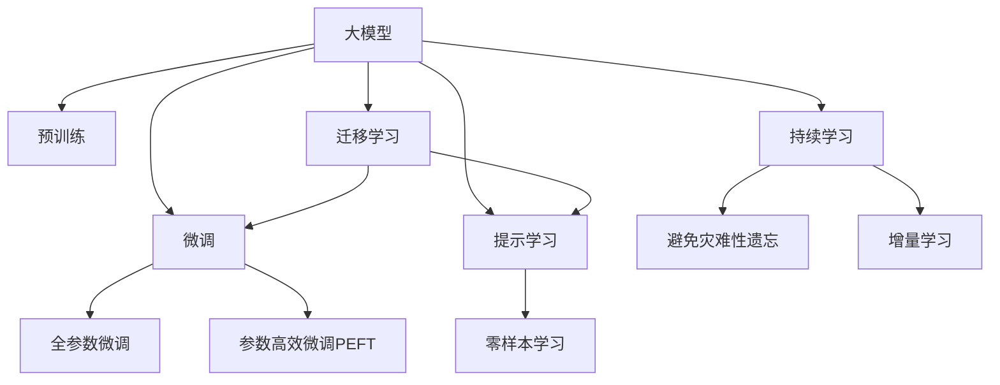

                 

# AI大模型赋能电商搜索推荐的实践与思考

## 1. 背景介绍

### 1.1 问题由来
随着互联网的迅速发展，电子商务市场已成为全球最大的经济体之一。电商平台的搜索推荐系统（Recommendation System, RS）成为其核心竞争力，能显著提升用户体验和销售转化率。传统基于规则、协同过滤等方法的推荐系统面临数据稀疏性、冷启动等问题。

近年来，深度学习技术在推荐领域迅猛发展。尤其是大模型（Large Model），通过自监督或监督学习训练，拥有强大的数据表示能力，已经在电商搜索推荐中展现出巨大潜力。如何高效利用大模型赋能电商推荐，是当下亟需解决的问题。

### 1.2 问题核心关键点
目前，大模型在电商搜索推荐中的应用主要集中在以下几方面：

- **电商数据特征提取**：将用户、商品、行为等多维数据映射到大模型中，获得高维语义表示。
- **商品特征表示学习**：学习商品的语言描述，生成商品高维语义向量，提升搜索召回效果。
- **用户行为理解**：结合用户历史行为，理解用户兴趣和偏好，优化个性化推荐。
- **动态生成推荐内容**：通过大模型生成动态文本，实现内容丰富度高的推荐结果。

大模型的关键优势在于其强大的语义表示能力，可以高效处理复杂的电商数据，提升推荐系统的效果。但大模型的训练和部署复杂，如何在电商场景下高效利用大模型，仍需深入研究。

### 1.3 问题研究意义
利用大模型赋能电商搜索推荐，对电商行业有以下几方面的重要意义：

1. **提升推荐效果**：通过语义表示学习，提高推荐的相关性和多样性。
2. **优化用户体验**：根据用户意图和兴趣，提供个性化推荐，提升用户满意度。
3. **降低运营成本**：通过自动生成推荐内容，减少人力成本。
4. **增强市场竞争力**：提升推荐效果和用户体验，从而增强平台市场竞争力。
5. **拓展推荐应用**：借助大模型，将推荐系统应用于更多电商场景，如个性化广告、内容推荐等。

本文将系统介绍大模型在电商搜索推荐中的理论基础和实践方法，为电商企业提供技术借鉴。

## 2. 核心概念与联系

### 2.1 核心概念概述

为更好地理解大模型赋能电商推荐的方法，本节将介绍几个密切相关的核心概念：

- **大模型（Large Model）**：指通过大规模数据和强大计算能力训练出的深度神经网络模型，如GPT、BERT、Transformer等。拥有强大的语义表示和泛化能力，适用于多种自然语言处理任务。

- **搜索推荐系统（Recommendation System, RS）**：通过分析和理解用户行为，为用户推荐可能感兴趣的商品或内容。推荐系统包括协同过滤、内容推荐、混合推荐等策略。

- **预训练（Pre-training）**：指在大规模无标签数据上训练模型，使其掌握语言的通用表示。如BERT通过掩码语言模型进行预训练，Transformer通过自回归模型进行预训练。

- **微调（Fine-tuning）**：在预训练模型的基础上，使用标注数据进行有监督学习，以适应特定任务。在电商推荐中，微调可以学习用户商品之间的关系，优化推荐结果。

- **迁移学习（Transfer Learning）**：指在大模型上进行预训练后，将其知识迁移到其他相似任务中。电商推荐可以利用通用大模型的知识，提升推荐效果。

- **提示学习（Prompt Learning）**：通过精心设计输入文本，引导大模型进行特定任务的推理和生成。如在推荐系统中，可以设计提示文本，让大模型自动生成推荐内容。

- **零样本学习（Zero-shot Learning）**：指模型无需经过训练，仅凭任务描述即可执行新任务。在电商推荐中，大模型可以生成推荐摘要或标题，无需额外训练。

这些核心概念之间的逻辑关系可以通过以下Mermaid流程图来展示：



这个流程图展示了大模型的核心概念及其之间的关系：

1. 大模型通过预训练获得基础能力。
2. 微调是对预训练模型进行任务特定的优化，可以分为全参数微调和参数高效微调（PEFT）。
3. 提示学习是一种不更新模型参数的方法，可以实现零样本或少样本学习。
4. 迁移学习是连接预训练模型与下游任务的桥梁，可以通过微调或提示学习来实现。
5. 持续学习旨在使模型能够不断学习新知识，同时避免遗忘旧知识。

这些概念共同构成了大模型赋能电商推荐的理论框架，为大模型在电商推荐中的应用提供了指导。

## 3. 核心算法原理 & 具体操作步骤
### 3.1 算法原理概述

大模型在电商搜索推荐中的应用，本质上是一种基于监督学习的迁移学习范式。其核心思想是：将预训练的大模型看作一个强大的"特征提取器"，通过在电商推荐数据的标注数据上进行有监督的微调，使得模型能够从用户行为、商品描述等复杂数据中提取特征，生成高质量的推荐结果。

具体而言，假设预训练模型为 $M_{\theta}$，其中 $\theta$ 为预训练得到的模型参数。给定电商推荐任务 $T$ 的标注数据集 $D=\{(x_i, y_i)\}_{i=1}^N, x_i \in \mathbb{R}^{d_1}, y_i \in \{0,1\}$，微调的目标是找到新的模型参数 $\hat{\theta}$，使得：

$$
\hat{\theta}=\mathop{\arg\min}_{\theta} \mathcal{L}(M_{\theta},D)
$$

其中 $\mathcal{L}$ 为针对任务 $T$ 设计的损失函数，用于衡量模型预测输出与真实标签之间的差异。常见的损失函数包括交叉熵损失、均方误差损失等。

通过梯度下降等优化算法，微调过程不断更新模型参数 $\theta$，最小化损失函数 $\mathcal{L}$，使得模型输出逼近真实标签。由于 $\theta$ 已经通过预训练获得了较好的初始化，因此即便在电商推荐的小规模数据集 $D$ 上进行微调，也能较快收敛到理想的模型参数 $\hat{\theta}$。

### 3.2 算法步骤详解

基于监督学习的大模型在电商搜索推荐中的应用，一般包括以下几个关键步骤：

**Step 1: 准备预训练模型和数据集**
- 选择合适的预训练语言模型 $M_{\theta}$ 作为初始化参数，如 BERT、GPT 等。
- 准备电商推荐任务 $T$ 的标注数据集 $D$，划分为训练集、验证集和测试集。标注数据应包括用户行为记录、商品描述、评分、评论等。

**Step 2: 添加任务适配层**
- 根据电商推荐任务类型，在预训练模型顶层设计合适的输出层和损失函数。
- 对于推荐任务，通常在顶层添加线性分类器或回归器，并使用交叉熵或均方误差作为损失函数。

**Step 3: 设置微调超参数**
- 选择合适的优化算法及其参数，如 AdamW、SGD 等，设置学习率、批大小、迭代轮数等。
- 设置正则化技术及强度，包括权重衰减、Dropout、Early Stopping 等。
- 确定冻结预训练参数的策略，如仅微调顶层，或全部参数都参与微调。

**Step 4: 执行梯度训练**
- 将训练集数据分批次输入模型，前向传播计算损失函数。
- 反向传播计算参数梯度，根据设定的优化算法和学习率更新模型参数。
- 周期性在验证集上评估模型性能，根据性能指标决定是否触发 Early Stopping。
- 重复上述步骤直到满足预设的迭代轮数或 Early Stopping 条件。

**Step 5: 测试和部署**
- 在测试集上评估微调后模型 $M_{\hat{\theta}}$ 的性能，对比微调前后的精度提升。
- 使用微调后的模型对新样本进行推理预测，集成到实际的应用系统中。
- 持续收集新的数据，定期重新微调模型，以适应数据分布的变化。

以上是基于监督学习微调大模型在电商搜索推荐中的一般流程。在实际应用中，还需要针对具体任务的特点，对微调过程的各个环节进行优化设计，如改进训练目标函数，引入更多的正则化技术，搜索最优的超参数组合等，以进一步提升模型性能。

### 3.3 算法优缺点

基于监督学习的大模型在电商搜索推荐中的应用，具有以下优点：

1. 简单高效。只需准备少量标注数据，即可对预训练模型进行快速适配，获得较大的性能提升。
2. 通用适用。适用于多种电商推荐任务，如商品推荐、个性化广告、内容推荐等，设计简单的任务适配层即可实现微调。
3. 参数高效。利用参数高效微调技术，在固定大部分预训练参数的情况下，仍可取得不错的提升。
4. 效果显著。在学术界和工业界的诸多电商推荐任务上，基于微调的方法已经刷新了最先进的性能指标。

同时，该方法也存在一定的局限性：

1. 依赖标注数据。微调的效果很大程度上取决于标注数据的质量和数量，获取高质量标注数据的成本较高。
2. 迁移能力有限。当目标任务与预训练数据的分布差异较大时，微调的性能提升有限。
3. 负面效果传递。预训练模型的固有偏见、有害信息等，可能通过微调传递到下游任务，造成负面影响。
4. 可解释性不足。微调模型的决策过程通常缺乏可解释性，难以对其推理逻辑进行分析和调试。

尽管存在这些局限性，但就目前而言，基于监督学习的微调方法仍是大模型在电商推荐中的应用主流范式。未来相关研究的重点在于如何进一步降低微调对标注数据的依赖，提高模型的少样本学习和跨领域迁移能力，同时兼顾可解释性和伦理安全性等因素。

### 3.4 算法应用领域

基于大模型微调的监督学习方法，在电商推荐领域已经得到了广泛的应用，覆盖了几乎所有常见任务，例如：

- **商品推荐**：根据用户历史行为，推荐可能感兴趣的商品。通过微调，模型能够理解商品描述和用户兴趣之间的关系。
- **个性化广告**：为广告主推荐合适用户群体，提高广告点击率。通过微调，模型可以准确匹配广告内容与用户需求。
- **内容推荐**：根据用户阅读历史，推荐相关文章、视频等内容。通过微调，模型可以学习内容与用户兴趣的语义关系。
- **组合推荐**：根据用户需求，推荐合适的商品组合。通过微调，模型可以综合考虑商品特性和用户偏好。
- **动态推荐**：实时生成个性化推荐结果，提升用户体验。通过微调，模型可以动态调整推荐策略。

除了上述这些经典任务外，大模型微调也被创新性地应用到更多场景中，如可控商品生成、价格优化、用户行为预测等，为电商推荐系统带来了新的突破。随着预训练模型和微调方法的不断进步，相信电商推荐技术将在更广阔的应用领域大放异彩。

## 4. 数学模型和公式 & 详细讲解  
### 4.1 数学模型构建

本节将使用数学语言对基于监督学习的大模型在电商搜索推荐中的微调过程进行更加严格的刻画。

记预训练语言模型为 $M_{\theta}$，其中 $\theta$ 为预训练得到的模型参数。假设电商推荐任务 $T$ 的标注数据集 $D=\{(x_i, y_i)\}_{i=1}^N, x_i \in \mathbb{R}^{d_1}, y_i \in \{0,1\}$。

定义模型 $M_{\theta}$ 在输入 $x_i$ 上的输出为 $M_{\theta}(x_i) \in \mathbb{R}^{d_2}$，其中 $d_2$ 为输出向量维度。

定义任务 $T$ 的损失函数为 $\mathcal{L}(\theta)$，表示模型预测输出与真实标签之间的差异。对于二分类任务，交叉熵损失函数定义为：

$$
\mathcal{L}(\theta) = -\frac{1}{N}\sum_{i=1}^N [y_i\log M_{\theta}(x_i)+(1-y_i)\log(1-M_{\theta}(x_i))]
$$

其中 $y_i \in \{0,1\}$ 表示样本的真实标签，$M_{\theta}(x_i)$ 表示模型对样本的预测概率。

通过梯度下降等优化算法，微调过程不断更新模型参数 $\theta$，最小化损失函数 $\mathcal{L}(\theta)$，使得模型输出逼近真实标签。由于 $\theta$ 已经通过预训练获得了较好的初始化，因此即便在电商推荐的小规模数据集 $D$ 上进行微调，也能较快收敛到理想的模型参数 $\hat{\theta}$。

### 4.2 公式推导过程

以下我们以二分类推荐任务为例，推导交叉熵损失函数及其梯度的计算公式。

假设模型 $M_{\theta}$ 在输入 $x_i$ 上的输出为 $\hat{y}=M_{\theta}(x_i) \in [0,1]$，表示样本属于正类的概率。真实标签 $y_i \in \{0,1\}$。则二分类交叉熵损失函数定义为：

$$
\ell(M_{\theta}(x_i),y_i) = -[y_i\log \hat{y} + (1-y_i)\log (1-\hat{y})]
$$

将其代入经验风险公式，得：

$$
\mathcal{L}(\theta) = -\frac{1}{N}\sum_{i=1}^N [y_i\log M_{\theta}(x_i)+(1-y_i)\log(1-M_{\theta}(x_i))]
$$

根据链式法则，损失函数对参数 $\theta_k$ 的梯度为：

$$
\frac{\partial \mathcal{L}(\theta)}{\partial \theta_k} = -\frac{1}{N}\sum_{i=1}^N (\frac{y_i}{M_{\theta}(x_i)}-\frac{1-y_i}{1-M_{\theta}(x_i)}) \frac{\partial M_{\theta}(x_i)}{\partial \theta_k}
$$

其中 $\frac{\partial M_{\theta}(x_i)}{\partial \theta_k}$ 可进一步递归展开，利用自动微分技术完成计算。

在得到损失函数的梯度后，即可带入参数更新公式，完成模型的迭代优化。重复上述过程直至收敛，最终得到适应电商推荐任务的最优模型参数 $\hat{\theta}$。

## 5. 项目实践：代码实例和详细解释说明
### 5.1 开发环境搭建

在进行电商推荐系统的大模型微调实践前，我们需要准备好开发环境。以下是使用Python进行PyTorch开发的环境配置流程：

1. 安装Anaconda：从官网下载并安装Anaconda，用于创建独立的Python环境。

2. 创建并激活虚拟环境：
```bash
conda create -n pytorch-env python=3.8 
conda activate pytorch-env
```

3. 安装PyTorch：根据CUDA版本，从官网获取对应的安装命令。例如：
```bash
conda install pytorch torchvision torchaudio cudatoolkit=11.1 -c pytorch -c conda-forge
```

4. 安装Transformers库：
```bash
pip install transformers
```

5. 安装各类工具包：
```bash
pip install numpy pandas scikit-learn matplotlib tqdm jupyter notebook ipython
```

完成上述步骤后，即可在`pytorch-env`环境中开始微调实践。

### 5.2 源代码详细实现

下面我以推荐系统中的用户商品推荐任务为例，给出使用Transformers库对BERT模型进行微调的PyTorch代码实现。

首先，定义推荐任务的数据处理函数：

```python
from transformers import BertTokenizer
from torch.utils.data import Dataset
import torch

class RecommendationDataset(Dataset):
    def __init__(self, users, items, user_item_pairs, tokenizer, max_len=128):
        self.users = users
        self.items = items
        self.user_item_pairs = user_item_pairs
        self.tokenizer = tokenizer
        self.max_len = max_len
        
    def __len__(self):
        return len(self.user_item_pairs)
    
    def __getitem__(self, item):
        user = self.user_item_pairs[item][0]
        item = self.user_item_pairs[item][1]
        user_item_pair = f"{user} has rated item {item}"
        
        encoding = self.tokenizer(user_item_pair, return_tensors='pt', max_length=self.max_len, padding='max_length', truncation=True)
        input_ids = encoding['input_ids'][0]
        attention_mask = encoding['attention_mask'][0]
        
        # 对token-wise的标签进行编码
        encoded_tags = [tag2id[tag] for tag in [1]]  # 假设标签为二分类，1表示正类（已购买）
        encoded_tags.extend([tag2id['O']] * (self.max_len - len(encoded_tags)))
        labels = torch.tensor(encoded_tags, dtype=torch.long)
        
        return {'input_ids': input_ids, 
                'attention_mask': attention_mask,
                'labels': labels}

# 标签与id的映射
tag2id = {'O': 0, '1': 1}
id2tag = {v: k for k, v in tag2id.items()}

# 创建dataset
tokenizer = BertTokenizer.from_pretrained('bert-base-cased')

train_dataset = RecommendationDataset(train_users, train_items, train_user_item_pairs, tokenizer)
dev_dataset = RecommendationDataset(dev_users, dev_items, dev_user_item_pairs, tokenizer)
test_dataset = RecommendationDataset(test_users, test_items, test_user_item_pairs, tokenizer)
```

然后，定义模型和优化器：

```python
from transformers import BertForTokenClassification, AdamW

model = BertForTokenClassification.from_pretrained('bert-base-cased', num_labels=len(tag2id))

optimizer = AdamW(model.parameters(), lr=2e-5)
```

接着，定义训练和评估函数：

```python
from torch.utils.data import DataLoader
from tqdm import tqdm
from sklearn.metrics import classification_report

device = torch.device('cuda') if torch.cuda.is_available() else torch.device('cpu')
model.to(device)

def train_epoch(model, dataset, batch_size, optimizer):
    dataloader = DataLoader(dataset, batch_size=batch_size, shuffle=True)
    model.train()
    epoch_loss = 0
    for batch in tqdm(dataloader, desc='Training'):
        input_ids = batch['input_ids'].to(device)
        attention_mask = batch['attention_mask'].to(device)
        labels = batch['labels'].to(device)
        model.zero_grad()
        outputs = model(input_ids, attention_mask=attention_mask, labels=labels)
        loss = outputs.loss
        epoch_loss += loss.item()
        loss.backward()
        optimizer.step()
    return epoch_loss / len(dataloader)

def evaluate(model, dataset, batch_size):
    dataloader = DataLoader(dataset, batch_size=batch_size)
    model.eval()
    preds, labels = [], []
    with torch.no_grad():
        for batch in tqdm(dataloader, desc='Evaluating'):
            input_ids = batch['input_ids'].to(device)
            attention_mask = batch['attention_mask'].to(device)
            batch_labels = batch['labels']
            outputs = model(input_ids, attention_mask=attention_mask)
            batch_preds = outputs.logits.argmax(dim=2).to('cpu').tolist()
            batch_labels = batch_labels.to('cpu').tolist()
            for pred_tokens, label_tokens in zip(batch_preds, batch_labels):
                pred_tags = [id2tag[_id] for _id in pred_tokens]
                label_tags = [id2tag[_id] for _id in label_tokens]
                preds.append(pred_tags[:len(label_tokens)])
                labels.append(label_tags)
                
    print(classification_report(labels, preds))
```

最后，启动训练流程并在测试集上评估：

```python
epochs = 5
batch_size = 16

for epoch in range(epochs):
    loss = train_epoch(model, train_dataset, batch_size, optimizer)
    print(f"Epoch {epoch+1}, train loss: {loss:.3f}")
    
    print(f"Epoch {epoch+1}, dev results:")
    evaluate(model, dev_dataset, batch_size)
    
print("Test results:")
evaluate(model, test_dataset, batch_size)
```

以上就是使用PyTorch对BERT进行电商推荐任务微调的完整代码实现。可以看到，得益于Transformers库的强大封装，我们可以用相对简洁的代码完成BERT模型的加载和微调。

### 5.3 代码解读与分析

让我们再详细解读一下关键代码的实现细节：

**RecommendationDataset类**：
- `__init__`方法：初始化用户、商品、用户-商品对等关键组件。
- `__len__`方法：返回数据集的样本数量。
- `__getitem__`方法：对单个样本进行处理，将用户商品对输入编码为token ids，将标签编码为数字，并对其进行定长padding，最终返回模型所需的输入。

**tag2id和id2tag字典**：
- 定义了标签与数字id之间的映射关系，用于将token-wise的预测结果解码回真实的标签。

**训练和评估函数**：
- 使用PyTorch的DataLoader对数据集进行批次化加载，供模型训练和推理使用。
- 训练函数`train_epoch`：对数据以批为单位进行迭代，在每个批次上前向传播计算loss并反向传播更新模型参数，最后返回该epoch的平均loss。
- 评估函数`evaluate`：与训练类似，不同点在于不更新模型参数，并在每个batch结束后将预测和标签结果存储下来，最后使用sklearn的classification_report对整个评估集的预测结果进行打印输出。

**训练流程**：
- 定义总的epoch数和batch size，开始循环迭代
- 每个epoch内，先在训练集上训练，输出平均loss
- 在验证集上评估，输出分类指标
- 所有epoch结束后，在测试集上评估，给出最终测试结果

可以看到，PyTorch配合Transformers库使得BERT微调的代码实现变得简洁高效。开发者可以将更多精力放在数据处理、模型改进等高层逻辑上，而不必过多关注底层的实现细节。

当然，工业级的系统实现还需考虑更多因素，如模型的保存和部署、超参数的自动搜索、更灵活的任务适配层等。但核心的微调范式基本与此类似。

## 6. 实际应用场景
### 6.1 电商智能客服

基于大模型的电商搜索推荐技术，可以广泛应用于电商平台的智能客服系统。传统客服往往需要配备大量人力，高峰期响应缓慢，且一致性和专业性难以保证。而使用微调后的推荐模型，可以7x24小时不间断服务，快速响应客户咨询，用推荐结果替代人工推荐，提升客户满意度。

在技术实现上，可以收集企业内部的历史推荐数据，将用户行为和商品评分构建成监督数据，在此基础上对预训练推荐模型进行微调。微调后的推荐模型能够自动理解用户意图和商品关系，匹配最合适的商品推荐。对于客户提出的新商品查询，还可以接入检索系统实时搜索相关商品，动态组织生成推荐结果。如此构建的智能客服系统，能大幅提升客户咨询体验和问题解决效率。

### 6.2 电商个性化广告

基于大模型的电商搜索推荐技术，可以进一步应用于个性化广告推荐。传统广告推荐系统往往依赖于人工设计的广告特征，无法自动理解和匹配广告内容与用户需求。而使用微调后的推荐模型，可以自动学习广告与用户的相关性，生成个性化的广告推荐，提高广告点击率。

在实际应用中，可以通过收集用户浏览、点击、购买等行为数据，将广告文本和用户历史行为数据作为训练样本，进行有监督的微调。微调后的模型可以自动生成广告推荐结果，并根据用户行为进行实时调整，提升广告效果。

### 6.3 电商智能内容推荐

基于大模型的电商搜索推荐技术，可以进一步应用于智能内容推荐。传统内容推荐系统往往基于静态的特征提取方法，无法处理动态的文本数据。而使用微调后的推荐模型，可以自动学习用户对内容的兴趣，生成个性化的内容推荐，提高用户满意度。

在实际应用中，可以通过收集用户阅读、点赞、分享等行为数据，将内容文本和用户历史行为数据作为训练样本，进行有监督的微调。微调后的模型可以自动生成内容推荐结果，并根据用户行为进行实时调整，提升内容推荐效果。

### 6.4 未来应用展望

随着大模型和微调技术的不断发展，基于微调范式将在更多领域得到应用，为电商行业带来变革性影响。

在智慧医疗领域，基于微调的推荐模型可以推荐合适的医疗产品，提升用户健康管理效果。在智能教育领域，微调技术可应用于作业批改、学情分析、知识推荐等方面，因材施教，促进教育公平，提高教学质量。

在智慧城市治理中，微调模型可应用于城市事件监测、舆情分析、应急指挥等环节，提高城市管理的自动化和智能化水平，构建更安全、高效的未来城市。

此外，在企业生产、社会治理、文娱传媒等众多领域，基于大模型微调的人工智能应用也将不断涌现，为经济社会发展注入新的动力。相信随着技术的日益成熟，微调方法将成为人工智能落地应用的重要范式，推动人工智能技术在垂直行业的规模化落地。总之，微调需要开发者根据具体任务，不断迭代和优化模型、数据和算法，方能得到理想的效果。

## 7. 工具和资源推荐
### 7.1 学习资源推荐

为了帮助开发者系统掌握大模型赋能电商推荐的技术基础和实践技巧，这里推荐一些优质的学习资源：

1. 《Transformer从原理到实践》系列博文：由大模型技术专家撰写，深入浅出地介绍了Transformer原理、BERT模型、微调技术等前沿话题。

2. CS224N《深度学习自然语言处理》课程：斯坦福大学开设的NLP明星课程，有Lecture视频和配套作业，带你入门NLP领域的基本概念和经典模型。

3. 《Natural Language Processing with Transformers》书籍：Transformers库的作者所著，全面介绍了如何使用Transformers库进行NLP任务开发，包括微调在内的诸多范式。

4. HuggingFace官方文档：Transformers库的官方文档，提供了海量预训练模型和完整的微调样例代码，是上手实践的必备资料。

5. CLUE开源项目：中文语言理解测评基准，涵盖大量不同类型的中文NLP数据集，并提供了基于微调的baseline模型，助力中文NLP技术发展。

通过对这些资源的学习实践，相信你一定能够快速掌握大模型赋能电商推荐的精髓，并用于解决实际的电商推荐问题。
###  7.2 开发工具推荐

高效的开发离不开优秀的工具支持。以下是几款用于大模型微调开发的常用工具：

1. PyTorch：基于Python的开源深度学习框架，灵活动态的计算图，适合快速迭代研究。大部分预训练语言模型都有PyTorch版本的实现。

2. TensorFlow：由Google主导开发的开源深度学习框架，生产部署方便，适合大规模工程应用。同样有丰富的预训练语言模型资源。

3. Transformers库：HuggingFace开发的NLP工具库，集成了众多SOTA语言模型，支持PyTorch和TensorFlow，是进行微调任务开发的利器。

4. Weights & Biases：模型训练的实验跟踪工具，可以记录和可视化模型训练过程中的各项指标，方便对比和调优。与主流深度学习框架无缝集成。

5. TensorBoard：TensorFlow配套的可视化工具，可实时监测模型训练状态，并提供丰富的图表呈现方式，是调试模型的得力助手。

6. Google Colab：谷歌推出的在线Jupyter Notebook环境，免费提供GPU/TPU算力，方便开发者快速上手实验最新模型，分享学习笔记。

合理利用这些工具，可以显著提升大模型微调任务的开发效率，加快创新迭代的步伐。

### 7.3 相关论文推荐

大模型和微调技术的发展源于学界的持续研究。以下是几篇奠基性的相关论文，推荐阅读：

1. Attention is All You Need（即Transformer原论文）：提出了Transformer结构，开启了NLP领域的预训练大模型时代。

2. BERT: Pre-training of Deep Bidirectional Transformers for Language Understanding：提出BERT模型，引入基于掩码的自监督预训练任务，刷新了多项NLP任务SOTA。

3. Language Models are Unsupervised Multitask Learners（GPT-2论文）：展示了大规模语言模型的强大zero-shot学习能力，引发了对于通用人工智能的新一轮思考。

4. Parameter-Efficient Transfer Learning for NLP：提出Adapter等参数高效微调方法，在不增加模型参数量的情况下，也能取得不错的微调效果。

5. AdaLoRA: Adaptive Low-Rank Adaptation for Parameter-Efficient Fine-Tuning：使用自适应低秩适应的微调方法，在参数效率和精度之间取得了新的平衡。

6. Prompt Learning: Scaling Language Models to Tasks: Architecture and Experiments：引入基于连续型Prompt的微调范式，为如何充分利用预训练知识提供了新的思路。

这些论文代表了大模型赋能电商推荐技术的发展脉络。通过学习这些前沿成果，可以帮助研究者把握学科前进方向，激发更多的创新灵感。

## 8. 总结：未来发展趋势与挑战

### 8.1 总结

本文对大模型在电商搜索推荐中的应用进行了全面系统的介绍。首先阐述了大模型和微调技术的研究背景和意义，明确了微调在提升电商推荐效果方面的独特价值。其次，从原理到实践，详细讲解了大模型在电商推荐中的数学模型构建和微调算法步骤，给出了电商推荐任务的完整代码实例。同时，本文还广泛探讨了电商搜索推荐在大模型中的广泛应用，展示了其巨大的应用前景。

通过本文的系统梳理，可以看到，大模型在电商推荐中的微调技术已初具规模，有助于电商企业提升推荐效果和用户体验。未来，伴随大模型和微调方法的持续演进，相信电商推荐技术将在更广阔的应用领域大放异彩，深刻影响电商行业的发展进程。

### 8.2 未来发展趋势

展望未来，大模型在电商搜索推荐中的应用将呈现以下几个发展趋势：

1. 模型规模持续增大。随着算力成本的下降和数据规模的扩张，预训练语言模型的参数量还将持续增长。超大规模语言模型蕴含的丰富语言知识，有望支撑更加复杂多变的电商推荐任务。

2. 微调方法日趋多样。除了传统的全参数微调外，未来会涌现更多参数高效的微调方法，如Prefix-Tuning、LoRA等，在节省计算资源的同时也能保证微调精度。

3. 持续学习成为常态。随着电商推荐数据的动态变化，微调模型也需要持续学习新知识以保持性能。如何在不遗忘原有知识的同时，高效吸收新样本信息，将成为重要的研究课题。

4. 标注样本需求降低。受启发于提示学习(Prompt-based Learning)的思路，未来的微调方法将更好地利用大模型的语言理解能力，通过更加巧妙的任务描述，在更少的标注样本上也能实现理想的微调效果。

5. 迁移能力增强。经过海量数据的预训练和多领域任务的微调，大模型的迁移能力将进一步增强，能够在更多电商场景下取得较好的推荐效果。

6. 模型通用性提升。未来的电商推荐模型将具备更强的跨领域迁移能力，能够在不同电商场景下进行优化，提升推荐系统的效果。

以上趋势凸显了大模型在电商推荐中的广泛应用前景。这些方向的探索发展，必将进一步提升电商推荐系统的性能和应用范围，为电商企业带来更多的商业价值。

### 8.3 面临的挑战

尽管大模型在电商推荐中的应用已经取得了显著成果，但在迈向更加智能化、普适化应用的过程中，仍面临诸多挑战：

1. 标注成本瓶颈。电商推荐任务涉及海量数据，获取高质量标注数据的成本较高。如何进一步降低微调对标注样本的依赖，将是一大难题。

2. 模型鲁棒性不足。大模型在电商推荐中可能面临域外数据时，泛化性能有限。对于测试样本的微小扰动，模型的推荐结果也可能发生波动。如何提高大模型的鲁棒性，避免灾难性遗忘，还需要更多理论和实践的积累。

3. 推理效率有待提高。大规模语言模型虽然精度高，但在实际部署时往往面临推理速度慢、内存占用大等效率问题。如何在保证性能的同时，简化模型结构，提升推理速度，优化资源占用，将是重要的优化方向。

4. 可解释性亟需加强。当前大模型在电商推荐中的应用，其决策过程通常缺乏可解释性，难以对其推理逻辑进行分析和调试。对于电商推荐这种高风险应用，算法的可解释性和可审计性尤为重要。

5. 安全性有待保障。预训练语言模型难免会学习到有偏见、有害的信息，通过微调传递到下游任务，产生误导性、歧视性的输出，给实际应用带来安全隐患。如何从数据和算法层面消除模型偏见，避免恶意用途，确保输出的安全性，也将是重要的研究课题。

6. 知识整合能力不足。现有的微调模型往往局限于任务内数据，难以灵活吸收和运用更广泛的先验知识。如何让微调过程更好地与外部知识库、规则库等专家知识结合，形成更加全面、准确的信息整合能力，还有很大的想象空间。

正视大模型在电商推荐中面临的这些挑战，积极应对并寻求突破，将是大模型微调技术走向成熟的必由之路。相信随着学界和产业界的共同努力，这些挑战终将一一被克服，大模型在电商推荐中的应用将更加广泛和深入。

### 8.4 研究展望

面向未来，大模型在电商推荐中的应用前景广阔，研究方向包括：

1. 探索无监督和半监督微调方法。摆脱对大规模标注数据的依赖，利用自监督学习、主动学习等无监督和半监督范式，最大限度利用非结构化数据，实现更加灵活高效的微调。

2. 研究参数高效和计算高效的微调范式。开发更加参数高效的微调方法，在固定大部分预训练参数的同时，只更新极少量的任务相关参数。同时优化微调模型的计算图，减少前向传播和反向传播的资源消耗，实现更加轻量级、实时性的部署。

3. 融合因果和对比学习范式。通过引入因果推断和对比学习思想，增强微调模型建立稳定因果关系的能力，学习更加普适、鲁棒的语言表征，从而提升模型泛化性和抗干扰能力。

4. 引入更多先验知识。将符号化的先验知识，如知识图谱、逻辑规则等，与神经网络模型进行巧妙融合，引导微调过程学习更准确、合理的语言模型。同时加强不同模态数据的整合，实现视觉、语音等多模态信息与文本信息的协同建模。

5. 结合因果分析和博弈论工具。将因果分析方法引入微调模型，识别出模型决策的关键特征，增强输出解释的因果性和逻辑性。借助博弈论工具刻画人机交互过程，主动探索并规避模型的脆弱点，提高系统稳定性。

6. 纳入伦理道德约束。在模型训练目标中引入伦理导向的评估指标，过滤和惩罚有偏见、有害的输出倾向。同时加强人工干预和审核，建立模型行为的监管机制，确保输出符合人类价值观和伦理道德。

这些研究方向的探索，必将引领大模型在电商推荐中的应用进入新的阶段，为电商推荐系统带来更加智能化、普适化的解决方案。只有勇于创新、敢于突破，才能不断拓展电商推荐系统的边界，让大模型在电商推荐中发挥更大的价值。

## 9. 附录：常见问题与解答

**Q1：大模型在电商推荐中的应用是否适用于所有推荐任务？**

A: 大模型在电商推荐中的应用通常适用于大多数推荐任务，特别是涉及文本数据的任务，如商品推荐、个性化广告、内容推荐等。但对于图像、视频等非文本数据推荐任务，可能需要先进行文本化处理，才能应用大模型进行微调。此外，对于一些需要高实时性的推荐任务，如实时广告投放，大模型的微调过程可能需要更高效的算法支持。

**Q2：微调过程中如何选择合适的学习率？**

A: 电商推荐任务的学习率通常比预训练时小1-2个数量级，以避免破坏预训练权重。一般建议从1e-5开始调参，逐步减小学习率，直至收敛。可以使用warmup策略，在开始阶段使用较小的学习率，再逐渐过渡到预设值。需要注意的是，不同的优化器(如AdamW、Adafactor等)以及不同的学习率调度策略，可能需要设置不同的学习率阈值。

**Q3：电商推荐任务中的数据标注成本是否太高？**

A: 电商推荐任务的数据标注成本确实较高，涉及海量用户行为和商品数据。但可以利用半监督学习、主动学习等技术，减少对标注样本的依赖。此外，可以采用数据增强、数据合成等技术，丰富训练数据的多样性，提高模型的泛化能力。

**Q4：电商推荐任务中的模型鲁棒性如何提升？**

A: 电商推荐任务中的模型鲁棒性可以通过以下方式提升：
1. 数据增强：通过回译、近义替换等方式扩充训练集
2. 正则化：使用L2正则、Dropout、Early Stopping等避免过拟合
3. 对抗训练：引入对抗样本，提高模型鲁棒性
4. 参数高效微调：只调整少量参数(如Adapter、Prefix等)，减小过拟合风险
5. 多模型集成：训练多个微调模型，取平均输出，抑制过拟合

这些策略往往需要根据具体任务和数据特点进行灵活组合。只有在数据、模型、训练、推理等各环节进行全面优化，才能最大限度地发挥大模型微调的威力。

**Q5：电商推荐任务中的模型推理效率如何优化？**

A: 电商推荐任务中的模型推理效率可以通过以下方式优化：
1. 模型裁剪：去除不必要的层和参数，减小模型尺寸，加快推理速度
2. 量化加速：将浮点模型转为定点模型，压缩存储空间，提高计算效率
3. 服务化封装：将模型封装为标准化服务接口，便于集成调用
4. 弹性伸缩：根据请求流量动态调整资源配置，平衡服务质量和成本
5. 监控告警：实时采集系统指标，设置异常告警阈值，确保服务稳定性

大模型在电商推荐中的应用，往往需要实时响应大量请求，推理效率的优化至关重要。只有通过上述技术手段，才能确保模型的实时性，满足电商推荐系统的高需求。

---

作者：禅与计算机程序设计艺术 / Zen and the Art of Computer Programming

