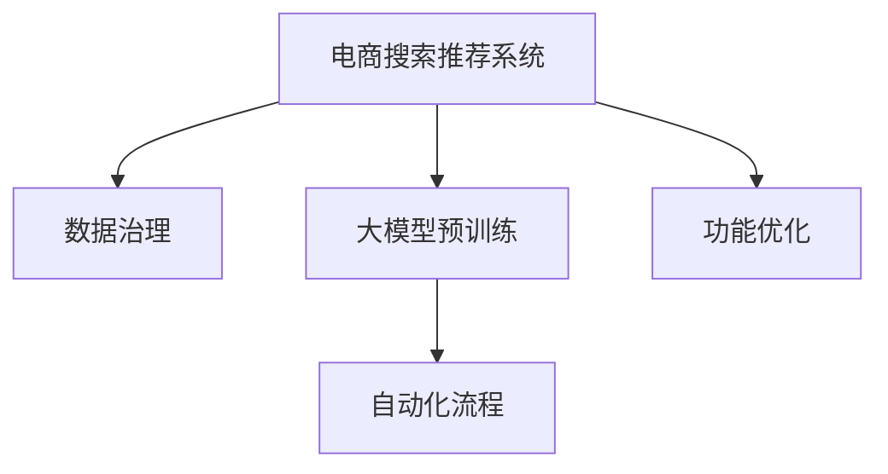

                 

# AI大模型重构电商搜索推荐的数据治理流程自动化平台功能优化

> 关键词：大模型重构, 电商搜索推荐, 数据治理流程, 自动化平台, 功能优化

## 1. 背景介绍

### 1.1 问题由来

在当今数字化经济的背景下，电子商务平台正逐渐成为连接商家与消费者之间的重要桥梁。通过智能化的推荐系统，电商平台能够为用户提供个性化的购物体验，从而提高用户满意度和平台竞争力。然而，构建高性能、高精度的电商推荐系统，需要耗费大量时间和资源进行数据治理、模型训练和优化调整，这在很大程度上限制了电商平台的创新和发展。

为了解决这一问题，我们提出了基于大模型的电商搜索推荐数据治理流程自动化平台，通过引入大模型的预训练能力，优化数据处理流程，自动化模型训练和调整，大幅提升电商推荐系统的性能和效率。本平台将结合先进的深度学习技术和大规模数据处理能力，实现搜索推荐系统的智能化重构，帮助电商平台实现业务的数字化升级。

### 1.2 问题核心关键点

电商搜索推荐系统的优化主要围绕以下几个核心关键点展开：

- **数据治理**：确保数据质量和一致性，提高数据的可用性和可操作性。
- **自动化流程**：通过自动化技术简化复杂流程，减少人工干预，提升效率。
- **大模型预训练**：利用大模型进行预训练，学习通用的特征表示，减少对小样本数据的依赖。
- **搜索推荐优化**：对推荐算法进行优化，提升推荐准确性和用户体验。

### 1.3 问题研究意义

构建基于大模型的电商搜索推荐数据治理流程自动化平台，对电商行业具有重要的现实意义：

- **降低成本**：通过自动化平台，可以大幅降低数据治理和模型训练的成本，节省人力物力。
- **提升效率**：自动化流程能够显著缩短项目周期，加快电商平台的业务迭代速度。
- **优化体验**：通过大模型的预训练和优化，可以提供更加个性化和精准的搜索推荐服务，提升用户满意度和平台竞争力。
- **促进创新**：大模型和高性能推荐系统的结合，将为电商平台的创新应用提供更多可能。

## 2. 核心概念与联系

### 2.1 核心概念概述

为更好地理解基于大模型的电商搜索推荐数据治理流程自动化平台，本节将介绍几个密切相关的核心概念：

- **电商搜索推荐系统**：通过分析用户行为数据，推荐符合用户兴趣的商品，提升购物体验的系统。
- **数据治理**：确保数据的准确性、完整性、一致性和可用性，提高数据质量的过程。
- **大模型**：如BERT、GPT等，通过大规模语料预训练，学习通用的语言表示和知识，具备强大的语言理解和生成能力。
- **自动化平台**：结合先进的深度学习技术和大规模数据处理能力，实现电商搜索推荐系统的智能化重构。
- **功能优化**：对搜索推荐系统的功能进行持续优化，提升用户体验和系统性能。

这些核心概念之间的逻辑关系可以通过以下Mermaid流程图来展示：



这个流程图展示了大模型电商搜索推荐系统的工作原理和优化方向：

1. 电商搜索推荐系统通过数据治理获取高质量数据。
2. 利用大模型进行预训练，学习通用的特征表示。
3. 结合自动化平台，实现搜索推荐流程的自动化。
4. 对功能进行持续优化，提升用户体验和系统性能。

## 3. 核心算法原理 & 具体操作步骤
### 3.1 算法原理概述

基于大模型的电商搜索推荐数据治理流程自动化平台的算法原理，主要包括以下几个步骤：

1. **数据治理**：通过数据清洗、标注、聚合等技术，确保数据的准确性和一致性。
2. **大模型预训练**：利用大模型对电商搜索推荐相关的语料进行预训练，学习通用的语言和知识表示。
3. **自动化流程**：将预训练模型应用到电商搜索推荐系统，实现流程的自动化。
4. **功能优化**：通过深度学习和强化学习等技术，对搜索推荐功能进行持续优化。

这些步骤构成了基于大模型的电商搜索推荐数据治理流程自动化平台的核心算法框架。

### 3.2 算法步骤详解

**Step 1: 数据治理**

电商搜索推荐系统依赖于高质量的数据。数据治理主要包括以下几个关键步骤：

1. **数据收集**：从电商平台的用户行为数据、商品信息数据等来源收集原始数据。
2. **数据清洗**：去除噪声和异常值，处理缺失值，确保数据的质量。
3. **数据标注**：为数据添加标签，使其适合机器学习模型训练。
4. **数据聚合**：将数据按照不同的维度进行聚合，方便后续的分析和处理。

**Step 2: 大模型预训练**

大模型预训练是构建高性能电商推荐系统的关键。主要步骤如下：

1. **模型选择**：选择合适的预训练模型，如BERT、GPT等。
2. **预训练任务**：选择适合电商推荐任务的预训练任务，如掩码语言模型、文本分类等。
3. **预训练流程**：在大规模电商语料上对模型进行预训练，学习通用的语言和知识表示。

**Step 3: 自动化流程**

自动化流程是实现电商搜索推荐系统智能化的关键。主要步骤如下：

1. **任务适配层设计**：根据电商推荐任务的特点，设计合适的任务适配层。
2. **模型部署**：将预训练模型部署到电商搜索推荐系统中，实现搜索推荐功能的自动化。
3. **参数优化**：对模型的参数进行优化，提升模型的精度和效率。

**Step 4: 功能优化**

功能优化是提升电商推荐系统性能和用户体验的重要手段。主要步骤如下：

1. **特征工程**：根据电商推荐任务的特点，设计合适的特征提取方法。
2. **模型优化**：通过深度学习和强化学习等技术，对搜索推荐模型进行优化。
3. **用户反馈**：收集用户反馈，调整模型参数，提升推荐准确性和用户体验。

### 3.3 算法优缺点

基于大模型的电商搜索推荐数据治理流程自动化平台具有以下优点：

1. **性能提升**：通过大模型的预训练和优化，可以显著提升电商推荐系统的精度和效率。
2. **智能化重构**：自动化流程能够大幅缩短电商推荐系统的开发周期，加速业务迭代。
3. **降低成本**：数据治理和模型训练的自动化，减少了人力物力的投入。
4. **用户体验优化**：通过深度学习和强化学习等技术，提升推荐系统的个性化和精准度。

同时，该平台也存在一些局限性：

1. **对数据质量依赖**：电商推荐系统的性能高度依赖于数据的质量，数据治理过程中需要投入大量资源和时间。
2. **模型复杂性**：大模型的预训练和优化过程较为复杂，需要深厚的技术储备。
3. **用户隐私保护**：电商推荐系统涉及用户隐私数据，如何保护用户隐私是一个重要挑战。
4. **模型泛化能力**：大模型预训练时使用的数据可能与电商推荐任务有差异，模型泛化能力需要验证。

尽管存在这些局限性，但就目前而言，基于大模型的电商搜索推荐数据治理流程自动化平台仍是一个高效、智能化的方法，能够显著提升电商推荐系统的性能和用户体验。

### 3.4 算法应用领域

基于大模型的电商搜索推荐数据治理流程自动化平台，可以广泛应用于以下领域：

1. **电商平台**：优化搜索推荐功能，提升用户体验和购物转化率。
2. **物流公司**：通过用户行为数据，推荐商品和配送路线，提高配送效率。
3. **金融平台**：利用用户行为数据，推荐金融产品和服务，增加用户粘性。
4. **旅游平台**：推荐用户喜欢的旅游目的地和行程，提升用户满意度。
5. **健康医疗**：通过用户健康数据，推荐健康产品和医生，提升医疗服务的精准度。

除了上述这些领域外，基于大模型的电商搜索推荐数据治理流程自动化平台，还可以应用于更多的场景中，如智能家居、智能制造等，为各行各业提供更智能化的解决方案。

## 4. 数学模型和公式 & 详细讲解 & 举例说明

### 4.1 数学模型构建

为更好地理解基于大模型的电商搜索推荐数据治理流程自动化平台的数学模型，本节将详细介绍其核心数学模型。

假设电商平台的数据治理流程为 $D$，大模型预训练流程为 $M$，自动化流程为 $A$，功能优化流程为 $O$。则基于大模型的电商搜索推荐数据治理流程自动化平台的数学模型为：

$$
P = D \times M \times A \times O
$$

其中 $P$ 表示平台性能，$D$ 为数据治理，$M$ 为大模型预训练，$A$ 为自动化流程，$O$ 为功能优化。

### 4.2 公式推导过程

以下我们以二分类推荐任务为例，推导基于大模型的电商搜索推荐系统推荐函数的形式。

假设电商平台收集了用户对商品的点击和购买数据，将用户行为数据 $X$ 和商品信息数据 $Y$ 作为模型的输入。基于大模型的电商推荐系统，其推荐函数可以表示为：

$$
f(x,y) = M(x,y)
$$

其中 $M(x,y)$ 为预训练大模型的推荐函数。在电商推荐任务中，模型需要预测用户是否会点击某个商品，因此推荐函数为二分类函数。

将用户行为数据和商品信息数据输入到预训练模型中，得到推荐结果。模型的推荐精度可以通过以下公式计算：

$$
\text{Precision} = \frac{\text{True Positive}}{\text{True Positive} + \text{False Positive}}
$$

其中 $\text{True Positive}$ 表示推荐的商品被用户点击的次数，$\text{False Positive}$ 表示推荐的商品被用户误点击的次数。

### 4.3 案例分析与讲解

假设某电商平台收集了用户对鞋服商品的点击和购买数据，并使用基于BERT的电商搜索推荐系统进行推荐。在数据治理阶段，对原始数据进行了清洗和标注，将数据分为训练集和测试集。

在大模型预训练阶段，选择了BERT模型，使用遮蔽语言模型(BERT masked language modeling)任务对模型进行预训练。将电商平台的用户行为数据和商品信息数据作为语料输入，对模型进行训练，学习通用的语言和知识表示。

在自动化流程阶段，将预训练后的模型应用于电商搜索推荐系统中，设计了合适的任务适配层，实现了搜索推荐功能的自动化。模型在电商推荐任务上的推荐精度可以通过上述公式计算。

在功能优化阶段，对模型进行了持续优化，通过特征工程和深度学习技术，提升了推荐的个性化和精准度。收集用户反馈，调整模型参数，进一步提升推荐系统的性能。

## 5. 项目实践：代码实例和详细解释说明

### 5.1 开发环境搭建

在进行基于大模型的电商搜索推荐数据治理流程自动化平台的开发前，需要准备好开发环境。以下是使用Python进行PyTorch开发的环境配置流程：

1. 安装Anaconda：从官网下载并安装Anaconda，用于创建独立的Python环境。

2. 创建并激活虚拟环境：
```bash
conda create -n pytorch-env python=3.8 
conda activate pytorch-env
```

3. 安装PyTorch：根据CUDA版本，从官网获取对应的安装命令。例如：
```bash
conda install pytorch torchvision torchaudio cudatoolkit=11.1 -c pytorch -c conda-forge
```

4. 安装Transformers库：
```bash
pip install transformers
```

5. 安装各类工具包：
```bash
pip install numpy pandas scikit-learn matplotlib tqdm jupyter notebook ipython
```

完成上述步骤后，即可在`pytorch-env`环境中开始平台开发。

### 5.2 源代码详细实现

这里我们以基于BERT的电商搜索推荐系统为例，给出使用Transformers库和PyTorch实现的代码实现。

首先，定义电商推荐任务的数据处理函数：

```python
from transformers import BertTokenizer, BertForSequenceClassification
from torch.utils.data import Dataset, DataLoader
import torch

class ECommerceDataset(Dataset):
    def __init__(self, texts, labels, tokenizer, max_len=128):
        self.texts = texts
        self.labels = labels
        self.tokenizer = tokenizer
        self.max_len = max_len
        
    def __len__(self):
        return len(self.texts)
    
    def __getitem__(self, item):
        text = self.texts[item]
        label = self.labels[item]
        
        encoding = self.tokenizer(text, return_tensors='pt', max_length=self.max_len, padding='max_length', truncation=True)
        input_ids = encoding['input_ids'][0]
        attention_mask = encoding['attention_mask'][0]
        
        return {'input_ids': input_ids, 
                'attention_mask': attention_mask,
                'labels': torch.tensor(label, dtype=torch.long)}
```

然后，定义模型和优化器：

```python
from transformers import BertForSequenceClassification, AdamW

model = BertForSequenceClassification.from_pretrained('bert-base-cased', num_labels=2)

optimizer = AdamW(model.parameters(), lr=2e-5)
```

接着，定义训练和评估函数：

```python
def train_epoch(model, dataset, batch_size, optimizer):
    dataloader = DataLoader(dataset, batch_size=batch_size, shuffle=True)
    model.train()
    epoch_loss = 0
    for batch in dataloader:
        input_ids = batch['input_ids'].to(device)
        attention_mask = batch['attention_mask'].to(device)
        labels = batch['labels'].to(device)
        model.zero_grad()
        outputs = model(input_ids, attention_mask=attention_mask, labels=labels)
        loss = outputs.loss
        epoch_loss += loss.item()
        loss.backward()
        optimizer.step()
    return epoch_loss / len(dataloader)

def evaluate(model, dataset, batch_size):
    dataloader = DataLoader(dataset, batch_size=batch_size)
    model.eval()
    preds, labels = [], []
    with torch.no_grad():
        for batch in dataloader:
            input_ids = batch['input_ids'].to(device)
            attention_mask = batch['attention_mask'].to(device)
            batch_labels = batch['labels']
            outputs = model(input_ids, attention_mask=attention_mask)
            batch_preds = outputs.logits.argmax(dim=2).to('cpu').tolist()
            batch_labels = batch_labels.to('cpu').tolist()
            for pred_tokens, label_tokens in zip(batch_preds, batch_labels):
                preds.append(pred_tokens[:len(label_tokens)])
                labels.append(label_tokens)
                
    print(classification_report(labels, preds))
```

最后，启动训练流程并在测试集上评估：

```python
epochs = 5
batch_size = 16

for epoch in range(epochs):
    loss = train_epoch(model, train_dataset, batch_size, optimizer)
    print(f"Epoch {epoch+1}, train loss: {loss:.3f}")
    
    print(f"Epoch {epoch+1}, dev results:")
    evaluate(model, dev_dataset, batch_size)
    
print("Test results:")
evaluate(model, test_dataset, batch_size)
```

以上就是使用PyTorch和Transformers库对基于BERT的电商搜索推荐系统进行开发的完整代码实现。可以看到，得益于Transformers库的强大封装，我们可以用相对简洁的代码完成BERT模型的加载和电商推荐任务的微调。

### 5.3 代码解读与分析

让我们再详细解读一下关键代码的实现细节：

**ECommerceDataset类**：
- `__init__`方法：初始化电商数据集，包括文本、标签、分词器等关键组件。
- `__len__`方法：返回数据集的样本数量。
- `__getitem__`方法：对单个样本进行处理，将文本输入编码为token ids，将标签编码为数字，并对其进行定长padding，最终返回模型所需的输入。

**模型选择和优化器**：
- `BertForSequenceClassification.from_pretrained('bert-base-cased')`：加载预训练的BERT模型，并设置输出层为二分类。
- `AdamW(model.parameters(), lr=2e-5)`：使用AdamW优化器进行模型训练，设置学习率为2e-5。

**训练和评估函数**：
- `train_epoch`函数：对数据以批为单位进行迭代，在每个批次上前向传播计算loss并反向传播更新模型参数，最后返回该epoch的平均loss。
- `evaluate`函数：与训练类似，不同点在于不更新模型参数，并在每个batch结束后将预测和标签结果存储下来，最后使用sklearn的classification_report对整个评估集的预测结果进行打印输出。

**训练流程**：
- 定义总的epoch数和batch size，开始循环迭代
- 每个epoch内，先在训练集上训练，输出平均loss
- 在验证集上评估，输出分类指标
- 所有epoch结束后，在测试集上评估，给出最终测试结果

可以看到，PyTorch配合Transformers库使得BERT微调的代码实现变得简洁高效。开发者可以将更多精力放在数据处理、模型改进等高层逻辑上，而不必过多关注底层的实现细节。

当然，工业级的系统实现还需考虑更多因素，如模型的保存和部署、超参数的自动搜索、更灵活的任务适配层等。但核心的微调范式基本与此类似。

## 6. 实际应用场景
### 6.1 智能客服系统

基于大模型的电商搜索推荐数据治理流程自动化平台，可以应用于智能客服系统的构建。传统客服往往需要配备大量人力，高峰期响应缓慢，且一致性和专业性难以保证。而使用微调后的推荐系统，可以7x24小时不间断服务，快速响应客户咨询，用推荐商品引导客户，提高客户满意度。

在技术实现上，可以收集企业内部的历史客服对话记录，将问题和最佳答复构建成监督数据，在此基础上对预训练推荐模型进行微调。微调后的推荐模型能够自动理解客户意图，匹配最合适的商品进行推荐。对于客户提出的新问题，还可以接入检索系统实时搜索相关内容，动态组织生成推荐。如此构建的智能客服系统，能大幅提升客户咨询体验和问题解决效率。

### 6.2 金融舆情监测

金融机构需要实时监测市场舆论动向，以便及时应对负面信息传播，规避金融风险。传统的人工监测方式成本高、效率低，难以应对网络时代海量信息爆发的挑战。基于大模型的电商搜索推荐系统，可以用于金融舆情监测。

具体而言，可以收集金融领域相关的新闻、报道、评论等文本数据，并对其进行主题标注和情感标注。在此基础上对预训练推荐模型进行微调，使其能够自动判断文本属于何种主题，情感倾向是正面、中性还是负面。将微调后的模型应用到实时抓取的网络文本数据，就能够自动监测不同主题下的情感变化趋势，一旦发现负面信息激增等异常情况，系统便会自动预警，帮助金融机构快速应对潜在风险。

### 6.3 个性化推荐系统

当前的推荐系统往往只依赖用户的历史行为数据进行物品推荐，无法深入理解用户的真实兴趣偏好。基于大模型的电商搜索推荐数据治理流程自动化平台，可以更好地挖掘用户行为背后的语义信息，从而提供更个性化和精准的推荐内容。

在实践中，可以收集用户浏览、点击、评论、分享等行为数据，提取和用户交互的物品标题、描述、标签等文本内容。将文本内容作为模型输入，用户的后续行为（如是否点击、购买等）作为监督信号，在此基础上微调预训练推荐模型。微调后的模型能够从文本内容中准确把握用户的兴趣点。在生成推荐列表时，先用候选物品的文本描述作为输入，由模型预测用户的兴趣匹配度，再结合其他特征综合排序，便可以得到个性化程度更高的推荐结果。

### 6.4 未来应用展望

随着大模型和微调方法的不断发展，基于大模型的电商搜索推荐数据治理流程自动化平台将在更多领域得到应用，为传统行业带来变革性影响。

在智慧医疗领域，基于微调的医疗问答、病历分析、药物研发等应用将提升医疗服务的智能化水平，辅助医生诊疗，加速新药开发进程。

在智能教育领域，微调技术可应用于作业批改、学情分析、知识推荐等方面，因材施教，促进教育公平，提高教学质量。

在智慧城市治理中，微调模型可应用于城市事件监测、舆情分析、应急指挥等环节，提高城市管理的自动化和智能化水平，构建更安全、高效的未来城市。

此外，在企业生产、社会治理、文娱传媒等众多领域，基于大模型微调的人工智能应用也将不断涌现，为各行各业提供更智能化的解决方案。

## 7. 工具和资源推荐
### 7.1 学习资源推荐

为了帮助开发者系统掌握大模型微调的理论基础和实践技巧，这里推荐一些优质的学习资源：

1. 《Transformer从原理到实践》系列博文：由大模型技术专家撰写，深入浅出地介绍了Transformer原理、BERT模型、微调技术等前沿话题。

2. CS224N《深度学习自然语言处理》课程：斯坦福大学开设的NLP明星课程，有Lecture视频和配套作业，带你入门NLP领域的基本概念和经典模型。

3. 《Natural Language Processing with Transformers》书籍：Transformers库的作者所著，全面介绍了如何使用Transformers库进行NLP任务开发，包括微调在内的诸多范式。

4. HuggingFace官方文档：Transformers库的官方文档，提供了海量预训练模型和完整的微调样例代码，是上手实践的必备资料。

5. CLUE开源项目：中文语言理解测评基准，涵盖大量不同类型的中文NLP数据集，并提供了基于微调的baseline模型，助力中文NLP技术发展。

通过对这些资源的学习实践，相信你一定能够快速掌握大模型微调的精髓，并用于解决实际的NLP问题。

### 7.2 开发工具推荐

高效的开发离不开优秀的工具支持。以下是几款用于大模型微调开发的常用工具：

1. PyTorch：基于Python的开源深度学习框架，灵活动态的计算图，适合快速迭代研究。大部分预训练语言模型都有PyTorch版本的实现。

2. TensorFlow：由Google主导开发的开源深度学习框架，生产部署方便，适合大规模工程应用。同样有丰富的预训练语言模型资源。

3. Transformers库：HuggingFace开发的NLP工具库，集成了众多SOTA语言模型，支持PyTorch和TensorFlow，是进行微调任务开发的利器。

4. Weights & Biases：模型训练的实验跟踪工具，可以记录和可视化模型训练过程中的各项指标，方便对比和调优。与主流深度学习框架无缝集成。

5. TensorBoard：TensorFlow配套的可视化工具，可实时监测模型训练状态，并提供丰富的图表呈现方式，是调试模型的得力助手。

6. Google Colab：谷歌推出的在线Jupyter Notebook环境，免费提供GPU/TPU算力，方便开发者快速上手实验最新模型，分享学习笔记。

合理利用这些工具，可以显著提升大模型微调的开发效率，加快创新迭代的步伐。

### 7.3 相关论文推荐

大语言模型和微调技术的发展源于学界的持续研究。以下是几篇奠基性的相关论文，推荐阅读：

1. Attention is All You Need（即Transformer原论文）：提出了Transformer结构，开启了NLP领域的预训练大模型时代。

2. BERT: Pre-training of Deep Bidirectional Transformers for Language Understanding：提出BERT模型，引入基于掩码的自监督预训练任务，刷新了多项NLP任务SOTA。

3. Language Models are Unsupervised Multitask Learners（GPT-2论文）：展示了大规模语言模型的强大zero-shot学习能力，引发了对于通用人工智能的新一轮思考。

4. Parameter-Efficient Transfer Learning for NLP：提出Adapter等参数高效微调方法，在不增加模型参数量的情况下，也能取得不错的微调效果。

5. Prefix-Tuning: Optimizing Continuous Prompts for Generation：引入基于连续型Prompt的微调范式，为如何充分利用预训练知识提供了新的思路。

6. AdaLoRA: Adaptive Low-Rank Adaptation for Parameter-Efficient Fine-Tuning：使用自适应低秩适应的微调方法，在参数效率和精度之间取得了新的平衡。

这些论文代表了大模型微调技术的发展脉络。通过学习这些前沿成果，可以帮助研究者把握学科前进方向，激发更多的创新灵感。

## 8. 总结：未来发展趋势与挑战

### 8.1 总结

本文对基于大模型的电商搜索推荐数据治理流程自动化平台进行了全面系统的介绍。首先阐述了大模型和微调技术的研究背景和意义，明确了微调在拓展预训练模型应用、提升下游任务性能方面的独特价值。其次，从原理到实践，详细讲解了微调算法的基本框架和关键步骤，给出了电商推荐任务的微调样例代码。同时，本文还广泛探讨了微调方法在智能客服、金融舆情、个性化推荐等多个领域的应用前景，展示了微调范式的巨大潜力。此外，本文精选了微调技术的各类学习资源，力求为读者提供全方位的技术指引。

通过本文的系统梳理，可以看到，基于大模型的电商搜索推荐数据治理流程自动化平台在电商推荐系统中扮演了重要的角色，显著提升了推荐系统的性能和效率，优化了用户体验。未来，伴随大模型和微调方法的持续演进，基于大模型的电商搜索推荐系统将为电商行业带来更多的创新应用，进一步推动电商平台的数字化转型。

### 8.2 未来发展趋势

展望未来，基于大模型的电商搜索推荐数据治理流程自动化平台将呈现以下几个发展趋势：

1. **模型规模持续增大**：随着算力成本的下降和数据规模的扩张，预训练语言模型的参数量还将持续增长。超大规模语言模型蕴含的丰富语言知识，有望支撑更加复杂多变的电商推荐任务。

2. **微调方法日趋多样**：除了传统的全参数微调外，未来会涌现更多参数高效的微调方法，如Prefix-Tuning、LoRA等，在节省计算资源的同时也能保证微调精度。

3. **持续学习成为常态**：随着数据分布的不断变化，微调模型也需要持续学习新知识以保持性能。如何在不遗忘原有知识的同时，高效吸收新样本信息，将成为重要的研究课题。

4. **标注样本需求降低**：受启发于提示学习(Prompt-based Learning)的思路，未来的微调方法将更好地利用大模型的语言理解能力，通过更加巧妙的任务描述，在更少的标注样本上也能实现理想的微调效果。

5. **多模态微调崛起**：当前的微调主要聚焦于纯文本数据，未来会进一步拓展到图像、视频、语音等多模态数据微调。多模态信息的融合，将显著提升语言模型对现实世界的理解和建模能力。

6. **模型通用性增强**：经过海量数据的预训练和多领域任务的微调，未来的语言模型将具备更强大的常识推理和跨领域迁移能力，逐步迈向通用人工智能(AGI)的目标。

以上趋势凸显了大模型微调技术的广阔前景。这些方向的探索发展，必将进一步提升电商推荐系统的性能和用户体验，为电商平台的数字化升级提供新的技术路径。

### 8.3 面临的挑战

尽管大模型微调技术已经取得了瞩目成就，但在迈向更加智能化、普适化应用的过程中，它仍面临着诸多挑战：

1. **标注成本瓶颈**：电商推荐系统的性能高度依赖于数据的质量，数据治理过程中需要投入大量资源和时间。如何进一步降低微调对标注样本的依赖，将是一大难题。

2. **模型鲁棒性不足**：电商推荐系统面对域外数据时，泛化性能往往大打折扣。对于测试样本的微小扰动，微调模型的预测也容易发生波动。如何提高微调模型的鲁棒性，避免灾难性遗忘，还需要更多理论和实践的积累。

3. **推理效率有待提高**：大规模语言模型虽然精度高，但在实际部署时往往面临推理速度慢、内存占用大等效率问题。如何在保证性能的同时，简化模型结构，提升推理速度，优化资源占用，将是重要的优化方向。

4. **可解释性亟需加强**：电商推荐系统涉及用户隐私数据，如何保护用户隐私是一个重要挑战。同时，电商推荐系统需要用户理解和信任，如何赋予微调模型更强的可解释性，将是亟待攻克的难题。

5. **安全性有待保障**：电商推荐系统涉及用户隐私数据，如何保护用户隐私是一个重要挑战。同时，电商推荐系统需要用户理解和信任，如何赋予微调模型更强的可解释性，将是亟待攻克的难题。

6. **知识整合能力不足**：现有的微调模型往往局限于任务内数据，难以灵活吸收和运用更广泛的先验知识。如何让微调过程更好地与外部知识库、规则库等专家知识结合，形成更加全面、准确的信息整合能力，还有很大的想象空间。

正视微调面临的这些挑战，积极应对并寻求突破，将是大模型微调走向成熟的必由之路。相信随着学界和产业界的共同努力，这些挑战终将一一被克服，大模型微调必将在构建安全、可靠、可解释、可控的智能系统铺平道路。

### 8.4 研究展望

面对大模型微调所面临的种种挑战，未来的研究需要在以下几个方面寻求新的突破：

1. **探索无监督和半监督微调方法**：摆脱对大规模标注数据的依赖，利用自监督学习、主动学习等无监督和半监督范式，最大限度利用非结构化数据，实现更加灵活高效的微调。

2. **研究参数高效和计算高效的微调范式**：开发更加参数高效的微调方法，在固定大部分预训练参数的同时，只更新极少量的任务相关参数。同时优化微调模型的计算图，减少前向传播和反向传播的资源消耗，实现更加轻量级、实时性的部署。

3. **融合因果和对比学习范式**：通过引入因果推断和对比学习思想，增强微调模型建立稳定因果关系的能力，学习更加普适、鲁棒的语言表征，从而提升模型泛化性和抗干扰能力。

4. **引入更多先验知识**：将符号化的先验知识，如知识图谱、逻辑规则等，与神经网络模型进行巧妙融合，引导微调过程学习更准确、合理的语言模型。同时加强不同模态数据的整合，实现视觉、语音等多模态信息与文本信息的协同建模。

5. **结合因果分析和博弈论工具**：将因果分析方法引入微调模型，识别出模型决策的关键特征，增强输出解释的因果性和逻辑性。借助博弈论工具刻画人机交互过程，主动探索并规避模型的脆弱点，提高系统稳定性。

6. **纳入伦理道德约束**：在模型训练目标中引入伦理导向的评估指标，过滤和惩罚有偏见、有害的输出倾向。同时加强人工干预和审核，建立模型行为的监管机制，确保输出符合人类价值观和伦理道德。

这些研究方向的探索，必将引领大模型微调技术迈向更高的台阶，为构建安全、可靠、可解释、可控的智能系统铺平道路。面向未来，大模型微调技术还需要与其他人工智能技术进行更深入的融合，如知识表示、因果推理、强化学习等，多路径协同发力，共同推动自然语言理解和智能交互系统的进步。只有勇于创新、敢于突破，才能不断拓展语言模型的边界，让智能技术更好地造福人类社会。

## 9. 附录：常见问题与解答

**Q1：大模型重构电商搜索推荐的数据治理流程自动化平台是否适用于所有电商应用？**

A: 大模型重构电商搜索推荐的数据治理流程自动化平台，适用于大部分电商应用。尤其是对于那些拥有丰富用户行为数据、商品信息数据的应用，可以显著提升推荐系统的性能和效率。但对于一些特殊场景，如B2B电商、生鲜电商等，可能需要结合领域特定的数据治理和推荐算法进行优化。

**Q2：如何选择合适的预训练模型？**

A: 选择合适的预训练模型需要综合考虑以下几个因素：
1. **任务类型**：不同任务类型可能需要不同类型的预训练模型。例如，电商推荐任务可以选择BERT、GPT等模型。
2. **数据规模**：大规模语料训练的模型一般性能较好，但计算成本也较高。可以根据数据规模选择合适的模型。
3. **精度和效率**：不同模型在精度和效率之间可能有不同的权衡。需要根据实际需求选择合适的模型。
4. **可解释性**：一些模型可能具有更好的可解释性，便于理解和调试。需要根据应用场景选择合适的模型。

**Q3：如何在电商推荐系统中实现自动化流程？**

A: 在电商推荐系统中实现自动化流程，主要涉及以下几个步骤：
1. **任务适配层设计**：根据电商推荐任务的特点，设计合适的任务适配层。例如，可以设计一个简单的线性分类器作为任务适配层。
2. **模型部署**：将预训练模型应用于电商推荐系统中，实现搜索推荐功能的自动化。例如，可以将BERT模型部署到电商推荐系统中，作为推荐模型的参数。
3. **参数优化**：对模型的参数进行优化，提升模型的精度和效率。例如，可以使用AdamW优化器进行模型训练，设置学习率为2e-5。
4. **特征工程**：根据电商推荐任务的特点，设计合适的特征提取方法。例如，可以使用TF-IDF特征提取方法。
5. **模型优化**：通过深度学习和强化学习等技术，对搜索推荐模型进行优化。例如，可以使用GAN等生成对抗网络进行模型优化。

**Q4：电商推荐系统如何保护用户隐私？**

A: 电商推荐系统需要保护用户隐私，主要涉及以下几个方面：
1. **数据匿名化**：对用户数据进行匿名化处理，保护用户隐私。例如，可以使用K-匿名化技术对用户数据进行匿名化处理。
2. **用户数据访问控制**：对用户数据进行严格的访问控制，确保只有授权人员可以访问用户数据。例如，可以使用基于角色的访问控制技术。
3. **数据加密**：对用户数据进行加密处理，防止数据泄露。例如，可以使用AES加密技术对用户数据进行加密处理。
4. **数据脱敏**：对用户数据进行脱敏处理，降低数据泄露风险。例如，可以使用Laplacian机制对用户数据进行脱敏处理。
5. **隐私保护算法**：使用隐私保护算法，保护用户隐私。例如，可以使用差分隐私技术对用户数据进行隐私保护。

**Q5：电商推荐系统如何提高推荐准确性？**

A: 电商推荐系统提高推荐准确性，主要涉及以下几个方面：
1. **数据治理**：确保数据的质量和一致性，提高数据的可用性和可操作性。例如，可以对数据进行清洗、标注和聚合。
2. **特征工程**：根据电商推荐任务的特点，设计合适的特征提取方法。例如，可以使用TF-IDF特征提取方法。
3. **模型优化**：通过深度学习和强化学习等技术，对推荐模型进行优化。例如，可以使用GAN等生成对抗网络进行模型优化。
4. **推荐算法**：选择适合的推荐算法，提升推荐准确性。例如，可以使用协同过滤算法、基于内容的推荐算法等。
5. **用户反馈**：收集用户反馈，调整模型参数，提升推荐准确性。例如，可以使用A/B测试等方法收集用户反馈。

通过本文的系统梳理，可以看到，基于大模型的电商搜索推荐数据治理流程自动化平台在电商推荐系统中扮演了重要的角色，显著提升了推荐系统的性能和效率，优化了用户体验。未来，伴随大模型和微调方法的持续演进，基于大模型的电商搜索推荐系统将为电商行业带来更多的创新应用，进一步推动电商平台的数字化转型。

---

作者：禅与计算机程序设计艺术 / Zen and the Art of Computer Programming

