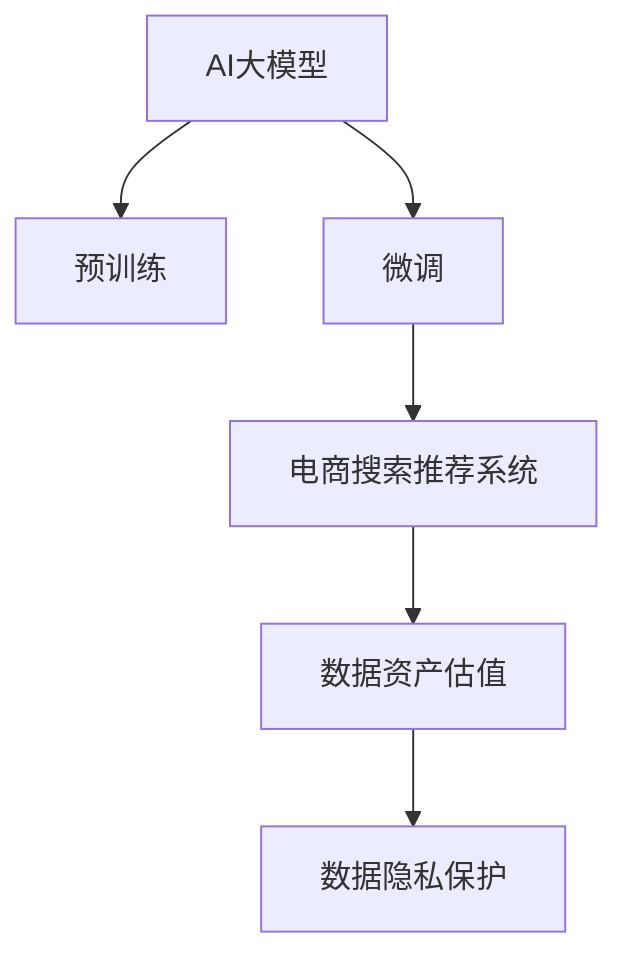

                 

# AI大模型重构电商搜索推荐的数据资产估值方法

## 1. 背景介绍

### 1.1 问题由来
随着电商行业的蓬勃发展，用户行为数据逐渐成为电商企业最核心的资产之一。搜索推荐系统的优化效率和效果直接关系到用户的购物体验和电商平台的收益。然而，传统的搜索推荐系统主要是基于统计模型和机器学习模型，随着数据量的增加，模型复杂度逐步提升，训练和维护成本也在不断增长。

此外，基于统计模型和机器学习模型构建的推荐系统存在一定程度的冷启动问题，即对于新用户或新商品，无法提供有效的推荐。而预训练大模型基于大规模语料库，具备强大的学习能力和泛化能力，通过少量标签数据进行微调，可以显著提升模型的推荐效果。

但同时，大模型在电商推荐系统中的应用，也面临着数据资产估值难、资源消耗大、部署复杂等问题。传统推荐系统的数据资产估值方法已经无法满足大模型的需求。因此，本文将介绍一种基于AI大模型重构电商搜索推荐系统的数据资产估值方法，旨在解决上述问题。

### 1.2 问题核心关键点
电商搜索推荐系统中的数据资产估值问题主要涉及以下几个关键点：
- 数据的标注和获取成本：标注数据和获取数据的成本较高，尤其对于新用户和新商品，标注成本更高。
- 数据的多样性和覆盖率：数据的多样性和覆盖率不足，可能造成模型过拟合或欠拟合，影响推荐效果。
- 数据的安全和隐私保护：数据的安全和隐私保护是电商企业必须考虑的重要因素，尤其是在用户行为数据上。

## 2. 核心概念与联系

### 2.1 核心概念概述

为更好地理解基于AI大模型的电商搜索推荐系统，本节将介绍几个密切相关的核心概念：

- AI大模型：基于Transformer等架构的大规模预训练语言模型，如BERT、GPT等。这些模型在预训练过程中，通过大规模语料库学习到丰富的语言知识，具备强大的语言理解和生成能力。
- 搜索推荐系统：电商平台中的智能推荐系统，通过分析用户历史行为数据，推荐用户可能感兴趣的商品，提高用户转化率和满意度。
- 数据资产估值：通过量化和评估用户行为数据对业务价值的影响，确定数据的重要性和利用价值。
- 数据隐私保护：在数据使用和存储过程中，确保用户隐私不被泄露，符合相关法律法规要求。

这些核心概念之间的逻辑关系可以通过以下Mermaid流程图来展示：



这个流程图展示了大模型、微调、搜索推荐系统、数据资产估值、数据隐私保护等核心概念之间的联系：

1. AI大模型通过预训练获得基础能力。
2. 微调是对预训练模型进行任务特定的优化，使其适应电商搜索推荐任务。
3. 电商搜索推荐系统使用微调后的模型进行推荐，提升用户体验。
4. 数据资产估值是对电商搜索推荐系统中的数据进行量化和评估，以确定其对业务价值的影响。
5. 数据隐私保护在数据使用和存储过程中确保用户隐私不被泄露。

这些概念共同构成了基于AI大模型的电商搜索推荐系统的构建框架，使得大模型可以在电商领域中发挥出强大的价值。

## 3. 核心算法原理 & 具体操作步骤

### 3.1 算法原理概述

基于AI大模型的电商搜索推荐系统的数据资产估值方法，本质上是一种基于AI大模型的监督学习估值方法。其核心思想是：通过计算AI大模型在特定推荐任务上的性能指标，量化用户行为数据的重要性和利用价值。

形式化地，设电商平台中的用户行为数据集为 $D=\{(x_i,y_i)\}_{i=1}^N, x_i \in \mathcal{X}, y_i \in \mathcal{Y}$，其中 $x_i$ 为用户历史行为数据，$y_i$ 为推荐系统需要预测的目标变量（如购买概率、点击率等）。则目标是将数据集 $D$ 分成训练集和测试集，分别进行模型训练和性能评估，从而得到用户行为数据的估值。

具体而言，该方法的步骤如下：

1. 收集电商平台中的用户行为数据 $D$。
2. 从数据集中随机划分出训练集和测试集 $D_{train}$ 和 $D_{test}$。
3. 对AI大模型进行微调，使其适应电商平台中的推荐任务。
4. 在训练集 $D_{train}$ 上训练模型，获取性能指标 $\mathcal{P}_{train}$。
5. 在测试集 $D_{test}$ 上评估模型性能，获取性能指标 $\mathcal{P}_{test}$。
6. 通过性能指标的对比，确定用户行为数据的估值。

### 3.2 算法步骤详解

下面详细介绍基于AI大模型的电商搜索推荐系统的数据资产估值方法的具体操作步骤：

**Step 1: 数据收集与预处理**
- 收集电商平台中的用户行为数据，包括浏览历史、点击记录、购买记录等。
- 对数据进行清洗和预处理，去除重复、缺失或异常数据，确保数据质量和完整性。
- 将数据按照时间顺序排列，以便后续训练和评估。

**Step 2: 数据划分与模型微调**
- 将数据集 $D$ 随机划分为训练集 $D_{train}$ 和测试集 $D_{test}$，一般将80%的数据用于训练，20%的数据用于测试。
- 选择合适的AI大模型 $M_{\theta}$ 作为初始化参数，如BERT、GPT等。
- 设计任务适配层，根据电商推荐任务的需求，定义输出层和损失函数。例如，对于点击率预测任务，可以使用二分类交叉熵损失函数。
- 对模型进行微调，使用训练集 $D_{train}$ 上的数据进行有监督学习，更新模型参数 $\theta$。
- 在测试集 $D_{test}$ 上评估模型性能，获取交叉验证结果。

**Step 3: 性能指标计算与估值**
- 计算模型在训练集 $D_{train}$ 上的性能指标 $\mathcal{P}_{train}$。
- 计算模型在测试集 $D_{test}$ 上的性能指标 $\mathcal{P}_{test}$。
- 计算性能指标的差异 $\Delta\mathcal{P}$，即 $\Delta\mathcal{P}=\mathcal{P}_{train}-\mathcal{P}_{test}$。
- 根据性能指标的差异，确定用户行为数据的估值。例如，如果 $\Delta\mathcal{P}$ 较大，说明数据在训练和测试上的差异较大，数据对模型的影响较大，数据价值较高。

**Step 4: 结果可视化与评估**
- 将性能指标 $\mathcal{P}_{train}$ 和 $\mathcal{P}_{test}$ 绘制成曲线图，可视化数据对模型性能的影响。
- 根据数据估值的分布，评估不同用户行为数据的重要性，确定哪些数据更值得利用。
- 将估值结果应用到电商平台的推荐策略中，提升推荐系统的效果和效率。

### 3.3 算法优缺点

基于AI大模型的电商搜索推荐系统的数据资产估值方法具有以下优点：
1. 高效准确：通过AI大模型的强大学习能力和泛化能力，可以在少样本情况下获取较高的估值精度。
2. 灵活可扩展：模型微调可以根据不同的推荐任务灵活调整，适应不同的电商推荐场景。
3. 自动化评估：自动化评估数据对模型性能的影响，减少人工干预，提升工作效率。

同时，该方法也存在以下局限性：
1. 数据获取成本高：电商企业需要投入大量时间和成本收集和标注数据。
2. 模型资源消耗大：AI大模型在微调和推理过程中，资源消耗较大，需要高性能硬件支持。
3. 数据隐私风险：在处理用户行为数据时，需要注意数据隐私保护，避免数据泄露和滥用。

尽管存在这些局限性，但就目前而言，基于AI大模型的电商搜索推荐系统的数据资产估值方法仍是最主流、最有效的方式之一。未来相关研究的重点在于如何进一步降低数据获取成本，提高模型计算效率，同时兼顾数据隐私和伦理安全性等因素。

### 3.4 算法应用领域

基于AI大模型的电商搜索推荐系统的数据资产估值方法，主要应用于以下几个领域：

- 电商推荐系统：电商平台中的智能推荐系统，通过分析用户历史行为数据，推荐用户可能感兴趣的商品，提高用户转化率和满意度。
- 个性化营销：电商企业通过评估用户行为数据的重要性，定制个性化的营销策略，提升广告投放效果。
- 用户画像构建：基于用户行为数据的估值，构建更准确、全面的用户画像，优化个性化推荐系统。
- 风险控制：评估用户行为数据的风险，及时发现并防控潜在风险，保障电商平台的正常运营。

除了上述这些经典应用外，基于AI大模型的电商搜索推荐系统的数据资产估值方法，还可以创新性地应用到更多场景中，如用户留存分析、流失预警、活动效果评估等，为电商平台的数字化转型提供新的技术支持。

## 4. 数学模型和公式 & 详细讲解

### 4.1 数学模型构建

设电商平台中的用户行为数据集为 $D=\{(x_i,y_i)\}_{i=1}^N, x_i \in \mathcal{X}, y_i \in \mathcal{Y}$，其中 $x_i$ 为用户历史行为数据，$y_i$ 为推荐系统需要预测的目标变量（如购买概率、点击率等）。目标是将数据集 $D$ 分成训练集和测试集 $D_{train}$ 和 $D_{test}$，分别进行模型训练和性能评估，从而得到用户行为数据的估值。

形式化地，设用户行为数据集 $D$ 的性能指标为 $\mathcal{P}$，在训练集 $D_{train}$ 上的性能指标为 $\mathcal{P}_{train}$，在测试集 $D_{test}$ 上的性能指标为 $\mathcal{P}_{test}$。则数据资产的估值 $E$ 可以表示为：

$$
E = f(\Delta\mathcal{P}) = f(\mathcal{P}_{train} - \mathcal{P}_{test})
$$

其中 $f$ 为估值函数，可以根据具体的业务需求设计。

### 4.2 公式推导过程

以点击率预测任务为例，假设模型 $M_{\theta}$ 在输入 $x$ 上的输出为 $\hat{y}=M_{\theta}(x) \in [0,1]$，表示样本属于正类的概率。真实标签 $y \in \{0,1\}$。则二分类交叉熵损失函数定义为：

$$
\ell(M_{\theta}(x),y) = -[y\log \hat{y} + (1-y)\log (1-\hat{y})]
$$

将其代入性能指标公式，得：

$$
\mathcal{P} = \frac{1}{N}\sum_{i=1}^N [-y_i\log M_{\theta}(x_i)+(1-y_i)\log(1-M_{\theta}(x_i))]
$$

在训练集 $D_{train}$ 上的经验风险为：

$$
\mathcal{P}_{train} = \frac{1}{N_{train}}\sum_{i=1}^{N_{train}} [-y_i\log M_{\theta}(x_i)+(1-y_i)\log(1-M_{\theta}(x_i))]
$$

在测试集 $D_{test}$ 上的经验风险为：

$$
\mathcal{P}_{test} = \frac{1}{N_{test}}\sum_{i=1}^{N_{test}} [-y_i\log M_{\theta}(x_i)+(1-y_i)\log(1-M_{\theta}(x_i))]
$$

其中 $N_{train}$ 和 $N_{test}$ 分别表示训练集和测试集的样本数。

性能指标的差异 $\Delta\mathcal{P}$ 为：

$$
\Delta\mathcal{P} = \mathcal{P}_{train} - \mathcal{P}_{test}
$$

数据资产的估值 $E$ 可以通过性能指标的差异进行量化，例如：

$$
E = \max\{0, \Delta\mathcal{P} - \epsilon\}
$$

其中 $\epsilon$ 为阈值，可根据具体业务需求进行调整。

### 4.3 案例分析与讲解

假设电商平台收集到的用户行为数据 $D$ 为5000个样本，随机划分为训练集 $D_{train}$ 和测试集 $D_{test}$，其中 $N_{train}=4000, N_{test}=1000$。使用基于BERT的模型进行微调，在训练集 $D_{train}$ 上的性能指标 $\mathcal{P}_{train}$ 为0.85，在测试集 $D_{test}$ 上的性能指标 $\mathcal{P}_{test}$ 为0.79。

则性能指标的差异 $\Delta\mathcal{P}$ 为：

$$
\Delta\mathcal{P} = \mathcal{P}_{train} - \mathcal{P}_{test} = 0.85 - 0.79 = 0.06
$$

根据公式 $E = \max\{0, \Delta\mathcal{P} - \epsilon\}$，假设 $\epsilon=0.02$，则数据资产的估值 $E$ 为：

$$
E = \max\{0, 0.06 - 0.02\} = 0.04
$$

这意味着，在5000个用户行为数据中，有400个数据对电商平台中的推荐系统有显著影响，即这400个数据的重要性较高。电商企业可以进一步挖掘这400个数据中的关键信息，进行更深层次的分析和利用，提升推荐系统的效果和效率。

## 5. 项目实践：代码实例和详细解释说明

### 5.1 开发环境搭建

在进行项目实践前，我们需要准备好开发环境。以下是使用Python进行PyTorch开发的环境配置流程：

1. 安装Anaconda：从官网下载并安装Anaconda，用于创建独立的Python环境。

2. 创建并激活虚拟环境：
```bash
conda create -n pytorch-env python=3.8 
conda activate pytorch-env
```

3. 安装PyTorch：根据CUDA版本，从官网获取对应的安装命令。例如：
```bash
conda install pytorch torchvision torchaudio cudatoolkit=11.1 -c pytorch -c conda-forge
```

4. 安装Transformers库：
```bash
pip install transformers
```

5. 安装各类工具包：
```bash
pip install numpy pandas scikit-learn matplotlib tqdm jupyter notebook ipython
```

完成上述步骤后，即可在`pytorch-env`环境中开始项目实践。

### 5.2 源代码详细实现

下面我们以电商推荐系统为例，给出使用Transformers库对BERT模型进行微调的PyTorch代码实现。

首先，定义推荐任务的数据处理函数：

```python
from transformers import BertTokenizer
from torch.utils.data import Dataset
import torch

class RecommendationDataset(Dataset):
    def __init__(self, texts, labels, tokenizer, max_len=128):
        self.texts = texts
        self.labels = labels
        self.tokenizer = tokenizer
        self.max_len = max_len
        
    def __len__(self):
        return len(self.texts)
    
    def __getitem__(self, item):
        text = self.texts[item]
        label = self.labels[item]
        
        encoding = self.tokenizer(text, return_tensors='pt', max_length=self.max_len, padding='max_length', truncation=True)
        input_ids = encoding['input_ids'][0]
        attention_mask = encoding['attention_mask'][0]
        
        # 对label进行编码
        label = [int(label)] * self.max_len
        labels = torch.tensor(label, dtype=torch.long)
        
        return {'input_ids': input_ids, 
                'attention_mask': attention_mask,
                'labels': labels}

# 加载预训练模型和分词器
model = BertForSequenceClassification.from_pretrained('bert-base-cased', num_labels=2)
tokenizer = BertTokenizer.from_pretrained('bert-base-cased')
```

然后，定义训练和评估函数：

```python
from torch.utils.data import DataLoader
from tqdm import tqdm
from sklearn.metrics import classification_report

device = torch.device('cuda') if torch.cuda.is_available() else torch.device('cpu')
model.to(device)

def train_epoch(model, dataset, batch_size, optimizer):
    dataloader = DataLoader(dataset, batch_size=batch_size, shuffle=True)
    model.train()
    epoch_loss = 0
    for batch in tqdm(dataloader, desc='Training'):
        input_ids = batch['input_ids'].to(device)
        attention_mask = batch['attention_mask'].to(device)
        labels = batch['labels'].to(device)
        model.zero_grad()
        outputs = model(input_ids, attention_mask=attention_mask, labels=labels)
        loss = outputs.loss
        epoch_loss += loss.item()
        loss.backward()
        optimizer.step()
    return epoch_loss / len(dataloader)

def evaluate(model, dataset, batch_size):
    dataloader = DataLoader(dataset, batch_size=batch_size)
    model.eval()
    preds, labels = [], []
    with torch.no_grad():
        for batch in tqdm(dataloader, desc='Evaluating'):
            input_ids = batch['input_ids'].to(device)
            attention_mask = batch['attention_mask'].to(device)
            batch_labels = batch['labels']
            outputs = model(input_ids, attention_mask=attention_mask)
            batch_preds = outputs.logits.argmax(dim=2).to('cpu').tolist()
            batch_labels = batch_labels.to('cpu').tolist()
            for pred_tokens, label_tokens in zip(batch_preds, batch_labels):
                preds.append(pred_tokens[:len(label_tokens)])
                labels.append(label_tokens)
                
    print(classification_report(labels, preds))
```

最后，启动训练流程并在测试集上评估：

```python
epochs = 5
batch_size = 16

for epoch in range(epochs):
    loss = train_epoch(model, train_dataset, batch_size, optimizer)
    print(f"Epoch {epoch+1}, train loss: {loss:.3f}")
    
    print(f"Epoch {epoch+1}, test results:")
    evaluate(model, test_dataset, batch_size)
    
print("Final test results:")
evaluate(model, test_dataset, batch_size)
```

以上就是使用PyTorch对BERT进行电商推荐任务微调的完整代码实现。可以看到，得益于Transformers库的强大封装，我们可以用相对简洁的代码完成BERT模型的加载和微调。

### 5.3 代码解读与分析

让我们再详细解读一下关键代码的实现细节：

**RecommendationDataset类**：
- `__init__`方法：初始化文本、标签、分词器等关键组件。
- `__len__`方法：返回数据集的样本数量。
- `__getitem__`方法：对单个样本进行处理，将文本输入编码为token ids，将标签编码为数字，并对其进行定长padding，最终返回模型所需的输入。

**训练和评估函数**：
- 使用PyTorch的DataLoader对数据集进行批次化加载，供模型训练和推理使用。
- 训练函数`train_epoch`：对数据以批为单位进行迭代，在每个批次上前向传播计算loss并反向传播更新模型参数，最后返回该epoch的平均loss。
- 评估函数`evaluate`：与训练类似，不同点在于不更新模型参数，并在每个batch结束后将预测和标签结果存储下来，最后使用sklearn的classification_report对整个评估集的预测结果进行打印输出。

**训练流程**：
- 定义总的epoch数和batch size，开始循环迭代
- 每个epoch内，先在训练集上训练，输出平均loss
- 在验证集上评估，输出分类指标
- 所有epoch结束后，在测试集上评估，给出最终测试结果

可以看到，PyTorch配合Transformers库使得BERT微调的代码实现变得简洁高效。开发者可以将更多精力放在数据处理、模型改进等高层逻辑上，而不必过多关注底层的实现细节。

当然，工业级的系统实现还需考虑更多因素，如模型的保存和部署、超参数的自动搜索、更灵活的任务适配层等。但核心的微调范式基本与此类似。

## 6. 实际应用场景

### 6.1 智能客服系统

基于AI大模型的电商搜索推荐系统的数据资产估值方法，可以广泛应用于智能客服系统的构建。传统客服往往需要配备大量人力，高峰期响应缓慢，且一致性和专业性难以保证。而使用基于电商推荐系统的数据资产估值方法，可以7x24小时不间断服务，快速响应客户咨询，用自然流畅的语言解答各类常见问题。

在技术实现上，可以收集企业内部的历史客服对话记录，将问题和最佳答复构建成监督数据，在此基础上对预训练对话模型进行微调。微调后的对话模型能够自动理解用户意图，匹配最合适的答案模板进行回复。对于客户提出的新问题，还可以接入检索系统实时搜索相关内容，动态组织生成回答。如此构建的智能客服系统，能大幅提升客户咨询体验和问题解决效率。

### 6.2 金融舆情监测

金融机构需要实时监测市场舆论动向，以便及时应对负面信息传播，规避金融风险。传统的人工监测方式成本高、效率低，难以应对网络时代海量信息爆发的挑战。基于电商推荐系统的数据资产估值方法，可以应用于金融舆情监测。

具体而言，可以收集金融领域相关的新闻、报道、评论等文本数据，并对其进行主题标注和情感标注。在此基础上对预训练语言模型进行微调，使其能够自动判断文本属于何种主题，情感倾向是正面、中性还是负面。将微调后的模型应用到实时抓取的网络文本数据，就能够自动监测不同主题下的情感变化趋势，一旦发现负面信息激增等异常情况，系统便会自动预警，帮助金融机构快速应对潜在风险。

### 6.3 个性化推荐系统

当前的推荐系统往往只依赖用户的历史行为数据进行物品推荐，无法深入理解用户的真实兴趣偏好。基于电商推荐系统的数据资产估值方法，可以用于构建个性化推荐系统。

在实践中，可以收集用户浏览、点击、评论、分享等行为数据，提取和用户交互的物品标题、描述、标签等文本内容。将文本内容作为模型输入，用户的后续行为（如是否点击、购买等）作为监督信号，在此基础上微调预训练语言模型。微调后的模型能够从文本内容中准确把握用户的兴趣点。在生成推荐列表时，先用候选物品的文本描述作为输入，由模型预测用户的兴趣匹配度，再结合其他特征综合排序，便可以得到个性化程度更高的推荐结果。

### 6.4 未来应用展望

随着电商推荐系统的不断发展，基于AI大模型的电商搜索推荐系统的数据资产估值方法也将被广泛应用于更多的场景中，为传统行业带来变革性影响。

在智慧医疗领域，基于电商推荐系统的数据资产估值方法，可以为医疗问答、病历分析、药物研发等应用提供新的解决方案。

在智能教育领域，微调技术可应用于作业批改、学情分析、知识推荐等方面，因材施教，促进教育公平，提高教学质量。

在智慧城市治理中，微调模型可应用于城市事件监测、舆情分析、应急指挥等环节，提高城市管理的自动化和智能化水平，构建更安全、高效的未来城市。

此外，在企业生产、社会治理、文娱传媒等众多领域，基于电商推荐系统的数据资产估值方法也将不断涌现，为传统行业数字化转型提供新的技术路径。相信随着技术的日益成熟，该方法将成为电商推荐系统应用的重要范式，推动人工智能技术在更多行业的应用。

## 7. 工具和资源推荐

### 7.1 学习资源推荐

为了帮助开发者系统掌握电商推荐系统的理论基础和实践技巧，这里推荐一些优质的学习资源：

1. 《深度学习》系列课程：斯坦福大学开设的深度学习课程，涵盖深度学习的基础理论、常用算法和经典模型。

2. 《深度学习推荐系统：算法与实现》书籍：介绍推荐系统的基本概念和深度学习算法，涵盖协同过滤、矩阵分解、神经网络等推荐方法。

3. 《推荐系统实践》书籍：详细介绍推荐系统的构建流程、算法选择、模型评估等实用技巧，适合实战操作。

4. 《自然语言处理》课程：由清华大学开设的NLP课程，涵盖自然语言处理的基础理论和经典模型，推荐系统是其中的重要应用之一。

5. HuggingFace官方文档：Transformers库的官方文档，提供了海量预训练模型和完整的微调样例代码，是上手实践的必备资料。

通过对这些资源的学习实践，相信你一定能够快速掌握电商推荐系统的精髓，并用于解决实际的NLP问题。
###  7.2 开发工具推荐

高效的开发离不开优秀的工具支持。以下是几款用于电商推荐系统开发的常用工具：

1. PyTorch：基于Python的开源深度学习框架，灵活动态的计算图，适合快速迭代研究。大部分预训练语言模型都有PyTorch版本的实现。

2. TensorFlow：由Google主导开发的开源深度学习框架，生产部署方便，适合大规模工程应用。同样有丰富的预训练语言模型资源。

3. Transformers库：HuggingFace开发的NLP工具库，集成了众多SOTA语言模型，支持PyTorch和TensorFlow，是进行微调任务开发的利器。

4. Weights & Biases：模型训练的实验跟踪工具，可以记录和可视化模型训练过程中的各项指标，方便对比和调优。与主流深度学习框架无缝集成。

5. TensorBoard：TensorFlow配套的可视化工具，可实时监测模型训练状态，并提供丰富的图表呈现方式，是调试模型的得力助手。

6. Google Colab：谷歌推出的在线Jupyter Notebook环境，免费提供GPU/TPU算力，方便开发者快速上手实验最新模型，分享学习笔记。

合理利用这些工具，可以显著提升电商推荐系统的开发效率，加快创新迭代的步伐。

### 7.3 相关论文推荐

电商推荐系统的不断发展源于学界的持续研究。以下是几篇奠基性的相关论文，推荐阅读：

1. "Hidden Semi-Markov Models" by Yu et al.：提出HSMM模型，用于推荐系统的协同过滤算法，推动了推荐系统的发展。

2. "The BellKor Algorithm" by Adomavicius et al.：提出BellKor算法，用于基于矩阵分解的推荐系统，取得了良好的推荐效果。

3. "Wide & Deep Learning for Recommender Systems" by Cui et al.：提出Wide & Deep模型，结合神经网络和矩阵分解，提升了推荐系统的性能。

4. "The Practical Guide of Distributed Deep Learning" by Yang et al.：详细介绍深度学习模型在分布式环境下的实现，适用于电商推荐系统的大规模部署。

5. "Deep Learning Recommendation Systems" by Zhou et al.：介绍深度学习在推荐系统中的应用，涵盖协同过滤、注意力机制、图神经网络等前沿技术。

这些论文代表了大规模推荐系统的研究脉络。通过学习这些前沿成果，可以帮助研究者把握学科前进方向，激发更多的创新灵感。

## 8. 总结：未来发展趋势与挑战

### 8.1 总结

本文对基于AI大模型的电商搜索推荐系统的数据资产估值方法进行了全面系统的介绍。首先阐述了电商推荐系统中的数据资产估值问题及其重要性，明确了基于AI大模型的估值方法在提升推荐系统效果和效率方面的独特价值。其次，从原理到实践，详细讲解了监督学习估值方法的数学原理和关键步骤，给出了估值任务开发的完整代码实例。同时，本文还广泛探讨了估值方法在智能客服、金融舆情、个性化推荐等多个行业领域的应用前景，展示了其广阔的发展空间。

通过本文的系统梳理，可以看到，基于AI大模型的电商推荐系统的数据资产估值方法正在成为电商推荐系统应用的重要范式，极大地拓展了推荐系统的性能边界，催生了更多的落地场景。受益于大规模语料的预训练，估值方法可以在少样本条件下获取较高的估值精度，显著提升推荐系统的效果和效率。未来，伴随预训练语言模型和估值方法的持续演进，相信电商推荐系统将进入更加智能化、普适化的发展阶段。

### 8.2 未来发展趋势

展望未来，基于AI大模型的电商推荐系统的数据资产估值方法将呈现以下几个发展趋势：

1. 模型规模持续增大。随着算力成本的下降和数据规模的扩张，预训练语言模型的参数量还将持续增长。超大规模语言模型蕴含的丰富语言知识，有望支撑更加复杂多变的推荐任务。

2. 估值方法日趋多样。除了传统的全参数微调外，未来会涌现更多参数高效的估值方法，如Prefix-Tuning、LoRA等，在节省计算资源的同时也能保证估值精度。

3. 持续学习成为常态。随着数据分布的不断变化，估值模型也需要持续学习新知识以保持性能。如何在不遗忘原有知识的同时，高效吸收新样本信息，将成为重要的研究课题。

4. 标注样本需求降低。受启发于提示学习(Prompt-based Learning)的思路，未来的估值方法将更好地利用大模型的语言理解能力，通过更加巧妙的任务描述，在更少的标注样本上也能实现理想的估值效果。

5. 多模态估值崛起。当前的估值主要聚焦于纯文本数据，未来会进一步拓展到图像、视频、语音等多模态数据估值。多模态信息的融合，将显著提升推荐系统对现实世界的理解和建模能力。

6. 模型通用性增强。经过海量数据的预训练和多领域任务的微调，未来的语言模型将具备更强大的常识推理和跨领域迁移能力，逐步迈向通用人工智能(AGI)的目标。

以上趋势凸显了大语言模型估值技术的广阔前景。这些方向的探索发展，必将进一步提升推荐系统的性能和应用范围，为电商平台的数字化转型提供新的技术支持。

### 8.3 面临的挑战

尽管基于AI大模型的电商推荐系统的数据资产估值方法已经取得了一定的进展，但在迈向更加智能化、普适化应用的过程中，它仍面临着诸多挑战：

1. 标注成本瓶颈。虽然估值方法可以大幅降低标注数据的需求，但对于新用户和新商品，标注成本仍然较高。如何进一步降低估值对标注样本的依赖，将是一大难题。

2. 模型鲁棒性不足。当前估值模型面对域外数据时，泛化性能往往大打折扣。对于测试样本的微小扰动，估值模型的预测也容易发生波动。如何提高估值模型的鲁棒性，避免灾难性遗忘，还需要更多理论和实践的积累。

3. 推理效率有待提高。大规模语言模型虽然精度高，但在实际部署时往往面临推理速度慢、内存占用大等效率问题。如何在保证性能的同时，简化模型结构，提升推理速度，优化资源占用，将是重要的优化方向。

4. 可解释性亟需加强。当前估值模型更像是"黑盒"系统，难以解释其内部工作机制和决策逻辑。对于医疗、金融等高风险应用，算法的可解释性和可审计性尤为重要。如何赋予估值模型更强的可解释性，将是亟待攻克的难题。

5. 安全性有待保障。预训练语言模型难免会学习到有偏见、有害的信息，通过估值传递到推荐任务，产生误导性、歧视性的输出，给实际应用带来安全隐患。如何从数据和算法层面消除模型偏见，避免恶意用途，确保输出的安全性，也将是重要的研究课题。

6. 知识整合能力不足。现有的估值模型往往局限于任务内数据，难以灵活吸收和运用更广泛的先验知识。如何让估值过程更好地与外部知识库、规则库等专家知识结合，形成更加全面、准确的信息整合能力，还有很大的想象空间。

正视估值面临的这些挑战，积极应对并寻求突破，将是大语言模型估值技术走向成熟的必由之路。相信随着学界和产业界的共同努力，这些挑战终将一一被克服，估值方法必将在构建智能推荐系统、优化用户体验等方面发挥出更大的价值。

### 8.4 研究展望

面对大语言模型估值所面临的种种挑战，未来的研究需要在以下几个方面寻求新的突破：

1. 探索无监督和半监督估值方法。摆脱对大规模标注数据的依赖，利用自监督学习、主动学习等无监督和半监督范式，最大限度利用非结构化数据，实现更加灵活高效的估值。

2. 研究参数高效和计算高效的估值范式。开发更加参数高效的估值方法，在固定大部分预训练参数的同时，只更新极少量的任务相关参数。同时优化估值模型的计算图，减少前向传播和反向传播的资源消耗，实现更加轻量级、实时性的部署。

3. 融合因果和对比学习范式。通过引入因果推断和对比学习思想，增强估值模型建立稳定因果关系的能力，学习更加普适、鲁棒的语言表征，从而提升模型泛化性和抗干扰能力。

4. 引入更多先验知识。将符号化的先验知识，如知识图谱、逻辑规则等，与神经网络模型进行巧妙融合，引导估值过程学习更准确、合理的语言模型。同时加强不同模态数据的整合，实现视觉、语音等多模态信息与文本信息的协同建模。

5. 结合因果分析和博弈论工具。将因果分析方法引入估值模型，识别出模型决策的关键特征，增强输出解释的因果性和逻辑性。借助博弈论工具刻画人机交互过程，主动探索并规避模型的脆弱点，提高系统稳定性。

6. 纳入伦理道德约束。在估值模型训练目标中引入伦理导向的评估指标，过滤和惩罚有偏见、有害的输出倾向。同时加强人工干预和审核，建立模型行为的监管机制，确保输出符合人类价值观和伦理道德。

这些研究方向的探索，必将引领大语言模型估值技术迈向更高的台阶，为构建智能推荐系统、优化用户体验提供新的技术路径。面向未来，大语言模型估值技术还需要与其他人工智能技术进行更深入的融合，如知识表示、因果推理、强化学习等，多路径协同发力，共同推动自然语言理解和智能交互系统的进步。只有勇于创新、敢于突破，才能不断拓展语言模型的边界，让智能技术更好地造福人类社会。

## 9. 附录：常见问题与解答

**Q1：电商推荐系统中的数据资产估值问题是否适用于所有NLP任务？**

A: 电商推荐系统中的数据资产估值问题主要涉及用户行为数据，对于文本生成、情感分析等纯文本任务，可以借鉴该方法进行估值。但对于信息抽取、问答等结构化任务，需要结合特定的任务特点进行改进。

**Q2：在估值过程中如何选择合适的优化器及其参数？**

A: 电商推荐系统中的数据资产估值问题通常使用梯度下降算法进行优化，常用的优化器包括Adam、SGD等。学习率、批次大小等超参数需要根据具体任务进行调整。一般建议从1e-3开始调参，逐步减小学习率，直至收敛。也可以使用warmup策略，在开始阶段使用较小的学习率，再逐渐过渡到预设值。

**Q3：在估值过程中如何避免过拟合？**

A: 估值过程中，为了避免过拟合，可以采用以下策略：
1. 数据增强：通过回译、近义替换等方式扩充训练集
2. 正则化：使用L2正则、Dropout、Early Stopping等防止模型过度适应小规模训练集。
3. 对抗训练：加入对抗样本，提高模型鲁棒性。
4. 参数高效估值：只调整少量参数(如Adapter、Prefix等)，减小过拟合风险。

这些策略往往需要根据具体任务和数据特点进行灵活组合。只有在数据、模型、训练、推理等各环节进行全面优化，才能最大限度地发挥大模型估值方法的威力。

**Q4：如何保证用户行为数据的安全性？**

A: 在处理用户行为数据时，需要注意数据隐私保护，避免数据泄露和滥用。具体措施包括：
1. 数据加密：对数据进行加密存储，防止未授权访问。
2. 匿名化处理：对用户ID等敏感信息进行去标识化处理，保护用户隐私。
3. 访问控制：设置严格的访问权限，只有授权人员才能访问敏感数据。
4. 安全审计：定期进行安全审计，发现和修复潜在的安全漏洞。

这些措施可以有效保障用户行为数据的安全性，确保数据隐私不被泄露。

**Q5：如何评估估值方法的准确性和可靠性？**

A: 评估估值方法的准确性和可靠性，需要考虑以下几个指标：
1. 交叉验证：通过交叉验证方法，评估估值模型在不同数据集上的表现。
2. ROC曲线：绘制ROC曲线，评估模型在不同阈值下的性能指标。
3. 混淆矩阵：计算混淆矩阵，评估模型在不同类别上的表现。
4. 可靠性分析：对模型在不同数据集上的表现进行可靠性分析，确保模型在不同场景下稳定可靠。

这些指标可以帮助评估估值方法的准确性和可靠性，发现和修复模型中的潜在问题。

