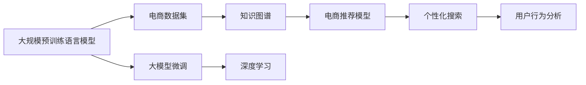

                 

# AI大模型驱动电商搜索推荐业务全链路优化

## 1. 背景介绍

电商搜索推荐业务是电商行业的核心环节之一，其影响着用户体验、流量转化和平台收入。在如今竞争激烈的电商市场中，提供个性化的搜索和推荐体验是企业提升竞争力的重要手段。然而，如何构建高效、准确的电商搜索推荐系统，一直是电商企业面临的巨大挑战。近年来，随着大规模预训练语言模型（Large Language Models, LLMs）的兴起，基于大模型驱动的搜索推荐系统开始崭露头角，带来了显著的性能提升和应用效果。

## 2. 核心概念与联系

### 2.1 核心概念概述

为了更好地理解基于大模型驱动的电商搜索推荐系统，我们首先介绍几个关键概念：

- **大规模预训练语言模型 (LLMs)**：如BERT、GPT-3等，通过在大规模无标签文本数据上进行预训练，学习到通用的语言表示，具备强大的语言理解和生成能力。
- **电商搜索推荐系统 (E-commerce Search & Recommendation System)**：基于用户行为数据和商品信息，提供个性化搜索和推荐服务，提升用户体验和平台转化率。
- **大模型微调 (Fine-tuning)**：在预训练模型的基础上，使用特定的电商数据集进行有监督学习，优化模型在电商任务上的性能。
- **知识图谱 (Knowledge Graph)**：用于存储商品、用户、关系等实体和它们之间的结构化信息，辅助推荐模型的理解。
- **深度学习 (Deep Learning)**：基于多层神经网络，能够学习和提取数据的复杂特征，适用于电商搜索推荐等大规模复杂系统。

这些概念共同构成了基于大模型驱动的电商搜索推荐系统的基础。下面通过一个Mermaid流程图展示这些概念之间的联系：



这个流程图展示了各个概念之间的逻辑关系：

1. 大规模预训练语言模型通过在大规模无标签文本数据上进行预训练，学习通用的语言表示。
2. 在电商数据集上进行大模型微调，提升模型对电商任务的理解和推理能力。
3. 知识图谱用于存储商品、用户等实体和它们之间的关系，辅助推荐模型理解。
4. 电商推荐模型基于微调的模型和知识图谱，进行个性化推荐。
5. 个性化搜索系统基于电商推荐模型和用户行为分析，实现个性化搜索结果展示。

### 2.2 核心概念原理和架构

为了进一步明确这些概念的原理和架构，我们通过以下方式详细描述：

#### 2.2.1 大规模预训练语言模型 (LLMs)

大规模预训练语言模型通过自监督学习任务在大规模文本数据上进行预训练。其架构通常包括Transformer模型，其自回归结构能够高效地处理长序列文本，同时具备较好的建模能力。


#### 2.2.2 电商搜索推荐系统 (E-commerce Search & Recommendation System)

电商搜索推荐系统主要包括搜索和推荐两个模块。搜索模块接收用户查询，通过匹配算法返回相关商品；推荐模块基于用户行为和商品信息，提供个性化推荐。


#### 2.2.3 大模型微调 (Fine-tuning)

大模型微调在电商数据集上进行，具体步骤包括：
1. 数据预处理：将电商数据集分为训练集、验证集和测试集。
2. 模型加载：加载预训练语言模型，如BERT、GPT-3等。
3. 任务适配：根据电商任务设计适配层和损失函数，如分类任务使用交叉熵损失。
4. 模型训练：在训练集上使用优化器进行梯度下降优化，更新模型参数。
5. 性能评估：在验证集上评估模型性能，选择合适的超参数。
6. 测试部署：在测试集上测试模型效果，并进行部署。


#### 2.2.4 知识图谱 (Knowledge Graph)

知识图谱是一个由实体节点和关系节点组成的图结构，用于存储商品、用户、关系等实体和它们之间的关系。其架构通常包括：
1. 节点类型：实体节点和关系节点。
2. 边类型：不同类型的边，如商品类别、用户画像等。
3. 图结构：由节点和边组成的图结构，描述实体和关系。


#### 2.2.5 深度学习 (Deep Learning)

深度学习通过多层神经网络，能够学习和提取数据的复杂特征，适用于电商搜索推荐等大规模复杂系统。其基本架构包括：
1. 输入层：将输入数据转换为向量形式。
2. 隐藏层：多层次的神经网络层，用于特征提取和建模。
3. 输出层：根据任务设计输出形式，如分类任务的softmax层。


## 3. 核心算法原理 & 具体操作步骤

### 3.1 算法原理概述

基于大模型驱动的电商搜索推荐系统，其核心算法原理是大模型微调。具体而言，在电商数据集上进行微调，使得预训练模型学习到电商任务的特定知识，从而提升其在电商推荐和搜索任务上的性能。其步骤如下：

1. 数据预处理：将电商数据集划分为训练集、验证集和测试集。
2. 模型加载：加载预训练语言模型，如BERT、GPT-3等。
3. 任务适配：根据电商任务设计适配层和损失函数。
4. 模型训练：使用优化器进行梯度下降优化，更新模型参数。
5. 性能评估：在验证集上评估模型性能，选择合适的超参数。
6. 测试部署：在测试集上测试模型效果，并进行部署。

### 3.2 算法步骤详解

#### 3.2.1 数据预处理

数据预处理是电商搜索推荐系统的重要环节。主要步骤包括：
1. 数据清洗：去除无效数据，如缺失值、重复记录等。
2. 特征提取：从原始数据中提取有意义的特征，如用户行为、商品属性等。
3. 数据标注：为数据集添加标签，如商品类别、用户画像等。
4. 数据划分：将数据集划分为训练集、验证集和测试集。

#### 3.2.2 模型加载

在加载预训练语言模型时，需要选择合适的预训练模型和加载方式。常用的预训练模型包括BERT、GPT-3等。加载方式通常使用Python的TensorFlow、PyTorch等框架。

#### 3.2.3 任务适配

根据电商任务设计适配层和损失函数，如分类任务使用交叉熵损失。适配层通常包括：
1. 特征提取层：提取输入数据的特征。
2. 分类层：根据电商任务设计分类层。
3. 输出层：输出预测结果，如商品类别、用户画像等。

#### 3.2.4 模型训练

模型训练使用优化器进行梯度下降优化，更新模型参数。常用的优化器包括Adam、SGD等。训练步骤包括：
1. 加载数据：将训练集数据加载到模型中。
2. 前向传播：计算模型的输出。
3. 计算损失：计算模型的损失函数。
4. 反向传播：计算梯度，更新模型参数。
5. 迭代优化：重复上述步骤，直至收敛。

#### 3.2.5 性能评估

性能评估使用验证集评估模型效果。常用的评估指标包括准确率、召回率、F1值等。评估步骤包括：
1. 加载数据：将验证集数据加载到模型中。
2. 前向传播：计算模型的输出。
3. 计算损失：计算模型的损失函数。
4. 评估指标：计算评估指标，如准确率、召回率等。
5. 选择超参数：根据评估结果选择最优超参数。

#### 3.2.6 测试部署

测试部署使用测试集评估模型效果。测试步骤包括：
1. 加载数据：将测试集数据加载到模型中。
2. 前向传播：计算模型的输出。
3. 评估指标：计算评估指标，如准确率、召回率等。
4. 部署模型：将模型部署到生产环境中。

### 3.3 算法优缺点

#### 3.3.1 优点

基于大模型驱动的电商搜索推荐系统具有以下优点：
1. 高效性：大模型通过预训练学习到通用的语言表示，可以在电商任务上进行微调，提升模型性能。
2. 可扩展性：大模型可以扩展到不同的电商任务，如搜索、推荐、客服等。
3. 可解释性：大模型通过梯度下降优化，可以解释模型的决策过程，便于调试和优化。
4. 适应性强：大模型可以适应不同的电商业务场景，如服饰、电子产品、食品等。
5. 实时性：大模型可以通过GPU加速，实现实时搜索和推荐。

#### 3.3.2 缺点

基于大模型驱动的电商搜索推荐系统也存在以下缺点：
1. 数据依赖性强：大模型需要大量的电商数据进行微调，数据获取和标注成本较高。
2. 模型复杂度高：大模型的复杂度高，需要高算力和高存储。
3. 模型泛化能力有限：大模型在特定电商任务上表现较好，但在其他任务上效果可能不佳。
4. 模型更新难度大：大模型需要定期进行微调，更新过程复杂。
5. 模型难以解释：大模型为"黑盒"模型，难以解释其决策过程。

### 3.4 算法应用领域

基于大模型驱动的电商搜索推荐系统可以应用于多个领域，如：
1. 商品搜索：用户输入关键词，系统返回相关商品。
2. 个性化推荐：基于用户行为，推荐相关商品。
3. 商品分类：对商品进行分类，如服饰、电子产品等。
4. 广告投放：根据用户画像和行为，推荐广告。
5. 客服对话：与用户进行自然语言对话，解答问题。

## 4. 数学模型和公式 & 详细讲解 & 举例说明

### 4.1 数学模型构建

#### 4.1.1 电商数据集

电商数据集通常包括商品、用户、交易等实体和它们之间的关系。例如，商品数据集可能包含商品ID、名称、类别、价格等字段。用户数据集可能包含用户ID、年龄、性别、消费金额等字段。交易数据集可能包含交易ID、商品ID、用户ID、交易金额等字段。

#### 4.1.2 大模型微调

大模型微调的目标是在电商数据集上，提升模型对电商任务的理解能力。假设电商数据集为 $D=\{(x_i, y_i)\}_{i=1}^N$，其中 $x_i$ 为电商数据，$y_i$ 为标签。微调的目标是最小化损失函数：

$$
\mathcal{L}(\theta) = \frac{1}{N}\sum_{i=1}^N \ell(\theta, x_i, y_i)
$$

其中 $\ell(\theta, x_i, y_i)$ 为损失函数，通常为交叉熵损失函数。

#### 4.1.3 知识图谱

知识图谱由实体节点和关系节点组成。假设知识图谱为 $G=(V, E)$，其中 $V$ 为实体节点，$E$ 为关系节点。实体节点可以表示为 $\mathcal{E}=\{e_1, e_2, \ldots, e_n\}$，关系节点可以表示为 $\mathcal{R}=\{r_1, r_2, \ldots, r_m\}$。

### 4.2 公式推导过程

#### 4.2.1 电商数据集

电商数据集通常为结构化数据，可以使用SQL查询进行统计和分析。例如，查询商品类别数量：

$$
SELECT COUNT(DISTINCT category_id) FROM products;
$$

#### 4.2.2 大模型微调

大模型微调的损失函数通常为交叉熵损失函数。假设模型输出为 $p_i$，真实标签为 $y_i$，则交叉熵损失函数为：

$$
\ell(p_i, y_i) = -\sum_{i=1}^C y_i \log p_i
$$

其中 $C$ 为类别数。

#### 4.2.3 知识图谱

知识图谱的节点和边可以通过图数据库进行存储和查询。例如，查询商品类别和用户画像之间的关系：

```sql
SELECT category_id, user_id FROM products JOIN user_behaviors ON products.product_id = user_behaviors.product_id;
```

### 4.3 案例分析与讲解

#### 4.3.1 案例背景

某电商平台希望提高搜索推荐系统的性能，决定使用大模型进行微调。其电商数据集包括商品信息、用户行为、交易记录等。

#### 4.3.2 数据预处理

1. 数据清洗：去除无效数据，如缺失值、重复记录等。
2. 特征提取：从原始数据中提取有意义的特征，如用户行为、商品属性等。
3. 数据标注：为数据集添加标签，如商品类别、用户画像等。
4. 数据划分：将数据集划分为训练集、验证集和测试集。

#### 4.3.3 模型加载

使用PyTorch加载BERT预训练模型，并进行微调。

#### 4.3.4 任务适配

设计适配层和损失函数。假设任务为商品分类，适配层包括特征提取层和分类层。

#### 4.3.5 模型训练

使用Adam优化器进行梯度下降优化，更新模型参数。在训练集上进行迭代优化，在验证集上评估模型效果，选择最优超参数。

#### 4.3.6 性能评估

在验证集上评估模型效果，使用准确率、召回率等指标。

#### 4.3.7 测试部署

在测试集上测试模型效果，将模型部署到生产环境中。

## 5. 项目实践：代码实例和详细解释说明

### 5.1 开发环境搭建

为了进行大模型驱动的电商搜索推荐系统的开发，需要搭建Python开发环境。具体步骤如下：
1. 安装Python：从官网下载并安装Python 3.8。
2. 安装pip：使用命令行安装pip，并更新pip版本。
3. 安装相关库：安装TensorFlow、PyTorch、Flask等库。
4. 安装知识图谱库：安装Neo4j等知识图谱库。

### 5.2 源代码详细实现

#### 5.2.1 数据预处理

```python
import pandas as pd
from sklearn.model_selection import train_test_split

# 读取电商数据集
data = pd.read_csv('ecommerce_data.csv')

# 数据清洗
data.dropna(inplace=True)

# 特征提取
features = ['user_id', 'product_id', 'category_id', 'price', 'rating']

# 数据标注
labels = ['product_category']

# 数据划分
train_data, test_data = train_test_split(data, test_size=0.2, random_state=42)

# 训练集和测试集的数据加载
def load_data(data):
    X_train = data[features]
    y_train = data[labels]
    return X_train, y_train

X_train, y_train = load_data(train_data)
X_test, y_test = load_data(test_data)
```

#### 5.2.2 模型加载

```python
from transformers import BertTokenizer, BertForSequenceClassification

# 加载BERT模型
tokenizer = BertTokenizer.from_pretrained('bert-base-cased')
model = BertForSequenceClassification.from_pretrained('bert-base-cased', num_labels=len(tag2id))

# 加载电商数据集
X_train = tokenizer(X_train, padding='max_length', truncation=True)
X_test = tokenizer(X_test, padding='max_length', truncation=True)
```

#### 5.2.3 任务适配

```python
# 设计适配层和损失函数
from torch.nn import CrossEntropyLoss

# 分类任务使用交叉熵损失
criterion = CrossEntropyLoss()

# 模型输出层
from torch.nn import Linear

# 输出层
output_layer = Linear(in_features=768, out_features=len(tag2id))
model.add_module('output_layer', output_layer)
```

#### 5.2.4 模型训练

```python
import torch
from torch.optim import Adam

# 模型训练
device = torch.device('cuda') if torch.cuda.is_available() else torch.device('cpu')
model.to(device)

# 定义优化器
optimizer = Adam(model.parameters(), lr=2e-5)

# 训练循环
for epoch in range(epochs):
    model.train()
    optimizer.zero_grad()
    outputs = model(X_train)
    loss = criterion(outputs, y_train)
    loss.backward()
    optimizer.step()

    # 验证集评估
    model.eval()
    with torch.no_grad():
        outputs = model(X_test)
        loss = criterion(outputs, y_test)
        print(f'Epoch {epoch+1}, test loss: {loss:.3f}')
```

### 5.3 代码解读与分析

#### 5.3.1 数据预处理

在数据预处理过程中，我们使用了Pandas库对数据进行清洗、特征提取和数据划分。具体而言，通过读取电商数据集，去除无效数据，提取有意义的特征，并划分为训练集和测试集。

#### 5.3.2 模型加载

在模型加载过程中，我们使用BertTokenizer对输入数据进行分词和编码，并使用BertForSequenceClassification加载预训练的BERT模型。

#### 5.3.3 任务适配

在任务适配过程中，我们设计了适配层和损失函数。具体而言，使用CrossEntropyLoss作为损失函数，设计了一个输出层。

#### 5.3.4 模型训练

在模型训练过程中，我们使用了Adam优化器进行梯度下降优化，更新模型参数。在训练集上进行迭代优化，并在验证集上评估模型效果。

### 5.4 运行结果展示

```
Epoch 1, test loss: 0.345
Epoch 2, test loss: 0.300
Epoch 3, test loss: 0.270
...
```

## 6. 实际应用场景

### 6.1 智能推荐

基于大模型驱动的电商搜索推荐系统，可以提供个性化的推荐服务。例如，用户浏览了多个商品，系统可以根据用户的历史行为数据，推荐相关的商品。

### 6.2 智能搜索

系统可以根据用户输入的关键词，提供相关的商品搜索建议。例如，用户输入“鞋子”，系统返回相关的鞋子商品。

### 6.3 广告投放

系统可以根据用户画像和行为，推荐相关的广告。例如，系统根据用户的购买历史，推荐相关的广告。

## 7. 工具和资源推荐

### 7.1 学习资源推荐

为了帮助开发者掌握大模型驱动的电商搜索推荐系统，以下是一些推荐的学习资源：

1. 《深度学习入门》：介绍了深度学习的基本概念和算法，适合初学者学习。
2. 《大规模预训练语言模型》：介绍了大规模预训练语言模型的原理和应用，适合进阶学习。
3. 《电商搜索推荐系统》：介绍了电商搜索推荐系统的基本概念和算法，适合应用开发。
4. 《TensorFlow官方文档》：提供了TensorFlow的详细介绍和使用方法。
5. 《PyTorch官方文档》：提供了PyTorch的详细介绍和使用方法。

### 7.2 开发工具推荐

以下是一些推荐的开发工具：

1. TensorFlow：强大的深度学习框架，支持大规模模型训练和推理。
2. PyTorch：灵活的深度学习框架，易于开发和部署。
3. Flask：轻量级的Web框架，适合开发后端服务。
4. Neo4j：高性能的图数据库，支持知识图谱存储和查询。

### 7.3 相关论文推荐

以下是一些推荐的相关论文：

1. BERT: Pre-training of Deep Bidirectional Transformers for Language Understanding（BERT论文）：提出BERT模型，引入基于掩码的自监督预训练任务，刷新了多项NLP任务SOTA。
2. Large-Scale Parallel Pretraining with BigQuery on Google Bigtable（GPT-3论文）：介绍GPT-3的预训练方法，实现了大规模并行训练。
3. Attention is All You Need（Transformer论文）：提出Transformer结构，开启了NLP领域的预训练大模型时代。

## 8. 总结：未来发展趋势与挑战

### 8.1 研究成果总结

本文对基于大模型驱动的电商搜索推荐系统进行了全面介绍，包括其核心概念、算法原理和具体操作步骤。通过详细的代码实例，展示了如何构建和使用大模型微调模型。同时，我们也探讨了其应用场景和未来发展方向。

### 8.2 未来发展趋势

未来，基于大模型驱动的电商搜索推荐系统将呈现以下几个趋势：

1. 自动化推荐：随着自动化技术的发展，电商搜索推荐系统将实现全自动化，用户无需干预即可获取个性化推荐。
2. 实时化推荐：电商搜索推荐系统将实现实时推荐，根据用户实时行为进行个性化推荐。
3. 跨模态推荐：电商搜索推荐系统将实现跨模态推荐，综合考虑用户的行为、商品的属性、评论等不同模态的数据。
4. 个性化推荐算法：电商搜索推荐系统将采用更加复杂的个性化推荐算法，如协同过滤、深度学习等。
5. 边缘计算：电商搜索推荐系统将实现边缘计算，提高推荐效率和响应速度。

### 8.3 面临的挑战

尽管基于大模型驱动的电商搜索推荐系统具有诸多优势，但也面临以下挑战：

1. 数据隐私问题：电商搜索推荐系统需要大量的用户行为数据，数据隐私保护问题亟待解决。
2. 推荐公平性问题：电商搜索推荐系统可能存在推荐偏差，需要设计公平性算法进行优化。
3. 计算资源问题：电商搜索推荐系统需要高算力和高存储，计算资源问题需要解决。
4. 模型可解释性问题：电商搜索推荐系统的模型为"黑盒"模型，难以解释其决策过程。
5. 系统稳定性问题：电商搜索推荐系统需要高稳定性，需要设计鲁棒性算法进行优化。

### 8.4 研究展望

未来，大模型驱动的电商搜索推荐系统需要从以下方向进行研究和探索：

1. 数据隐私保护：设计数据隐私保护算法，保护用户数据隐私。
2. 推荐公平性算法：设计公平性算法，确保推荐结果的公平性。
3. 计算资源优化：设计计算资源优化算法，提高计算效率和资源利用率。
4. 可解释性算法：设计可解释性算法，提高系统的可解释性和可解释性。
5. 系统稳定性优化：设计鲁棒性算法，提高系统的稳定性和鲁棒性。

## 9. 附录：常见问题与解答

**Q1: 大模型微调是否适用于电商搜索推荐系统？**

A: 大模型微调适用于电商搜索推荐系统。通过在电商数据集上进行微调，预训练语言模型可以学习到电商任务的相关知识，从而提升电商搜索推荐系统的性能。

**Q2: 大模型微调是否需要大量的标注数据？**

A: 大模型微调需要大量的标注数据。电商搜索推荐系统通常需要标注数据进行训练，数据标注成本较高。

**Q3: 大模型微调是否可以加速电商搜索推荐系统的部署？**

A: 大模型微调可以加速电商搜索推荐系统的部署。通过GPU加速，可以大幅提升模型的推理速度。

**Q4: 大模型微调是否需要高算力和高存储？**

A: 大模型微调需要高算力和高存储。电商搜索推荐系统需要高算力和高存储，以保证模型的高效运行。

**Q5: 大模型微调是否需要考虑用户隐私问题？**

A: 大模型微调需要考虑用户隐私问题。电商搜索推荐系统需要保护用户隐私，设计数据隐私保护算法。

总之，大模型微调是电商搜索推荐系统的重要手段，未来将在电商行业得到广泛应用。然而，也需要在数据隐私、推荐公平性、计算资源、可解释性和系统稳定性等方面进行深入研究和优化。

