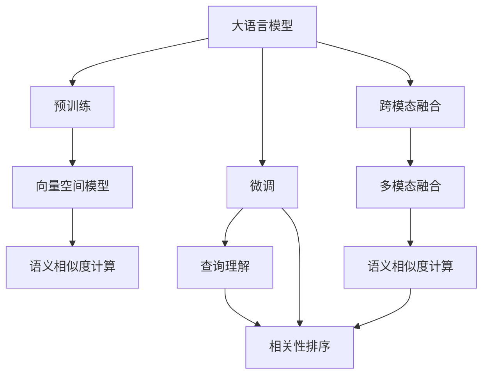

                 

# AI大模型：提升电商平台搜索速度的新方法

## 1. 背景介绍

### 1.1 问题由来
电商平台搜索系统是消费者与商家之间的重要接口，通过快速准确地检索到相关商品，提升了用户体验，增加了销售额。然而，传统的搜索算法往往基于关键词匹配，存在召回率低、排序效果差、算法复杂度高的问题。近年来，大语言模型在自然语言处理领域取得了突破性进展，逐步成为搜索引擎的核心算法之一。借助大语言模型，电商平台可以显著提升搜索速度和效果，为消费者提供更优质的购物体验。

### 1.2 问题核心关键点
为了提升搜索效率，电商平台引入了大语言模型进行智能搜索。通过大规模无监督语料预训练，大语言模型能够自动学习语言特征，进而识别商品描述中的关键词，并根据语义相关度对商品进行排序。具体来说，大语言模型的搜索能力体现在以下几个方面：

1. **上下文理解**：大语言模型能够理解查询语境，从而更准确地匹配相关商品。
2. **语义相似度计算**：通过上下文理解，模型可以计算查询与商品描述之间的语义相似度，进行排序。
3. **动态调整权重**：基于用户行为数据，大语言模型能够动态调整商品权重，提高搜索准确性和个性化。
4. **跨模态融合**：除了文本搜索，还可以结合图像、视频等多模态信息，提升搜索的多样性。

这些能力使得大语言模型成为提升电商平台搜索速度和效率的关键技术。

## 2. 核心概念与联系

### 2.1 核心概念概述

在探讨如何利用大语言模型提升电商平台搜索速度之前，我们需要了解几个关键概念：

- **大语言模型(Large Language Model, LLM)**：以自回归(如GPT)或自编码(如BERT)模型为代表的大规模预训练语言模型。通过在大规模无标签文本语料上进行预训练，学习通用的语言表示，具备强大的语言理解和生成能力。

- **预训练(Pre-training)**：指在大规模无标签文本语料上，通过自监督学习任务训练通用语言模型的过程。常见的预训练任务包括言语建模、掩码语言模型等。预训练使得模型学习到语言的通用表示。

- **微调(Fine-tuning)**：指在预训练模型的基础上，使用下游任务的少量标注数据，通过有监督学习优化模型在该任务上的性能。通常只需要调整顶层分类器或解码器，并以较小的学习率更新全部或部分的模型参数。

- **跨模态融合(Cross-Modal Fusion)**：指将不同模态的数据信息（如文本、图像、视频等）融合到模型中进行联合分析。跨模态融合能够提升模型对现实世界的多样性理解和建模能力。

- **向量空间模型(Vector Space Model, VSM)**：将文本信息映射到高维向量空间中，计算向量之间的距离（如余弦相似度），进行语义相似度计算。

- **深度学习(Deep Learning)**：基于神经网络的机器学习算法，用于处理大规模、非线性数据。深度学习在自然语言处理、计算机视觉等领域取得了显著进展。

这些概念之间的联系如下图所示：



从图中可以看出，大语言模型通过预训练获得语言表示，然后通过微调针对电商平台搜索任务进行优化。此外，通过跨模态融合和向量空间模型，模型能够更好地理解和计算商品描述与查询之间的语义相似度，从而提升搜索效率和效果。

## 3. 核心算法原理 & 具体操作步骤
### 3.1 算法原理概述

利用大语言模型提升电商平台搜索速度的核心算法原理如下：

1. **预训练大语言模型**：在大规模无标签文本语料上进行预训练，学习通用的语言表示。
2. **微调查询理解模型**：针对电商平台搜索任务，对预训练的大语言模型进行微调，使其能够理解查询语境，提取出查询中的关键词。
3. **多模态融合与语义相似度计算**：将商品描述与查询进行跨模态融合，并计算它们之间的语义相似度，根据相似度排序商品。
4. **动态调整权重**：基于用户行为数据，动态调整商品权重，提高搜索的个性化和准确性。

通过以上步骤，大语言模型能够显著提升电商平台的搜索速度和效果。

### 3.2 算法步骤详解

以下是基于大语言模型的电商平台搜索算法详细步骤：

**Step 1: 准备数据集**

- 收集电商平台上的商品描述和用户查询数据。
- 对文本数据进行预处理，包括分词、去除停用词等。
- 划分训练集、验证集和测试集。

**Step 2: 构建预训练模型**

- 选择合适的预训练模型，如BERT、GPT等。
- 使用预训练模型的词向量作为商品描述和查询的特征表示。

**Step 3: 微调查询理解模型**

- 对查询进行分词和嵌入，得到查询向量。
- 使用微调后的模型计算查询向量与商品描述向量之间的相似度。
- 根据相似度进行排序，选择最相关的商品。

**Step 4: 动态调整权重**

- 收集用户的历史浏览、点击、购买行为数据，计算用户对不同商品的历史评分。
- 基于用户行为数据，动态调整商品在搜索结果中的权重，提高个性化搜索效果。

**Step 5: 输出结果**

- 对排序后的商品进行展示。
- 收集用户的反馈数据，用于进一步优化查询理解模型和动态调整权重策略。

### 3.3 算法优缺点

利用大语言模型提升电商平台搜索速度的方法具有以下优点：

1. **通用性**：可以应用于各种类型的电商平台搜索任务，只需针对具体场景进行微调。
2. **实时性**：模型可以实时更新查询理解模型和商品权重，提升搜索的动态响应能力。
3. **精度高**：基于深度学习的语义相似度计算和动态调整权重，可以显著提高搜索结果的准确性和个性化。

同时，该方法也存在以下缺点：

1. **计算成本高**：大规模的预训练模型和微调过程需要大量的计算资源和时间。
2. **数据依赖**：模型性能高度依赖于电商平台的商品描述和用户查询数据，数据质量差会影响效果。
3. **可解释性不足**：模型内部的推理逻辑难以解释，用户难以理解搜索决策依据。
4. **隐私问题**：需要收集和处理大量的用户数据，隐私保护问题需要特别关注。

### 3.4 算法应用领域

基于大语言模型的电商平台搜索算法可以应用于多种场景，如：

- 商品分类搜索：用户输入查询词，平台自动分类相关商品。
- 个性化推荐搜索：根据用户的历史行为，推荐符合其偏好的商品。
- 跨模态搜索：结合商品图片、视频等多模态信息，提升搜索结果的多样性。
- 实时搜索：对用户实时输入的查询进行快速响应，提高搜索的即时性。

这些应用场景展示了大语言模型在电商平台搜索中的广泛适用性。

## 4. 数学模型和公式 & 详细讲解  
### 4.1 数学模型构建

为了更好地理解基于大语言模型的电商平台搜索算法，本节将介绍相关的数学模型构建过程。

假设电商平台的商品描述为 $X$，查询为 $Q$，商品权重为 $W$，查询理解模型为 $M_{\theta}$。模型的输入为查询 $Q$，输出为商品描述 $X$ 与商品权重 $W$ 的乘积向量 $V$，即 $V = M_{\theta}(Q) \times W$。

模型的目标是通过优化损失函数 $\mathcal{L}$ 最小化搜索结果与真实搜索结果之间的差异。假设搜索结果为 $R$，则损失函数可以表示为：

$$
\mathcal{L} = \sum_{i=1}^N (R_i - \hat{R}_i)^2
$$

其中 $N$ 为商品数量，$R_i$ 为实际搜索结果，$\hat{R}_i$ 为模型预测的搜索结果。

### 4.2 公式推导过程

为了计算商品与查询之间的语义相似度，我们需要使用余弦相似度公式。假设查询 $Q$ 和商品 $X_i$ 的嵌入向量分别为 $q$ 和 $x_i$，则它们之间的余弦相似度可以表示为：

$$
sim(Q, X_i) = \cos(\theta) = \frac{q \cdot x_i}{\|q\| \|x_i\|}
$$

其中 $\cdot$ 表示向量点积，$\|\cdot\|$ 表示向量的范数。

为了提高搜索的实时性和准确性，我们需要对商品权重 $W$ 进行动态调整。假设 $W_i$ 为商品 $i$ 的权重，则新的商品权重 $W'_i$ 可以表示为：

$$
W'_i = W_i \times \exp(f(Q, x_i))
$$

其中 $f$ 为基于用户行为数据的函数，可以是一个简单的线性回归模型。

将以上公式整合到损失函数中，我们得到：

$$
\mathcal{L} = \sum_{i=1}^N (R_i - W'_i \times sim(Q, X_i))^2
$$

这个损失函数考虑了商品权重和语义相似度的综合影响，可以优化搜索结果的精度和实时性。

### 4.3 案例分析与讲解

以一个简单的电商平台搜索案例来分析该模型的实际效果。假设用户输入查询词为“运动鞋”，查询理解模型输出查询向量 $q$，商品描述向量为 $x_1, x_2, x_3, \dots, x_n$，对应的商品权重为 $W_1, W_2, W_3, \dots, W_n$。模型首先计算每个商品的语义相似度 $sim(Q, x_i)$，然后根据商品权重 $W'_i$ 调整结果，最终得到排序后的商品列表。

通过这种基于大语言模型的搜索算法，电商平台能够快速准确地匹配相关商品，提升用户体验，增加销售额。

## 5. 项目实践：代码实例和详细解释说明
### 5.1 开发环境搭建

在进行大语言模型搜索算法实践前，我们需要准备好开发环境。以下是使用Python进行TensorFlow开发的环境配置流程：

1. 安装Anaconda：从官网下载并安装Anaconda，用于创建独立的Python环境。

2. 创建并激活虚拟环境：
```bash
conda create -n tf-env python=3.8 
conda activate tf-env
```

3. 安装TensorFlow：根据CUDA版本，从官网获取对应的安装命令。例如：
```bash
conda install tensorflow-gpu=2.6 -c conda-forge
```

4. 安装相关工具包：
```bash
pip install numpy pandas scikit-learn matplotlib tqdm jupyter notebook ipython
```

完成上述步骤后，即可在`tf-env`环境中开始搜索算法实践。

### 5.2 源代码详细实现

下面以查询理解模型为例，给出使用TensorFlow对预训练BERT模型进行微调的PyTorch代码实现。

首先，定义查询理解模型：

```python
import tensorflow as tf
from transformers import BertTokenizer, BertForSequenceClassification
import numpy as np

tokenizer = BertTokenizer.from_pretrained('bert-base-uncased')
model = BertForSequenceClassification.from_pretrained('bert-base-uncased', num_labels=2)
```

接着，定义查询和商品描述的编码器：

```python
def encode_query(query):
    query_tokens = tokenizer.tokenize(query)
    query_ids = tokenizer.convert_tokens_to_ids(query_tokens)
    return query_ids, query_tokens

def encode_product(product):
    product_tokens = tokenizer.tokenize(product)
    product_ids = tokenizer.convert_tokens_to_ids(product_tokens)
    return product_ids, product_tokens
```

然后，定义查询理解模型的微调过程：

```python
def fine_tune_model(model, train_dataset, validation_dataset, epochs=5, batch_size=32, learning_rate=2e-5):
    optimizer = tf.keras.optimizers.Adam(learning_rate=learning_rate)

    model.compile(optimizer=optimizer, loss='sparse_categorical_crossentropy', metrics=['accuracy'])

    history = model.fit(train_dataset, epochs=epochs, validation_data=validation_dataset)

    return history
```

最后，启动训练流程并在测试集上评估：

```python
train_dataset = tf.data.Dataset.from_generator(lambda: encode_query(train_queries), output_signature=(tf.int32, tf.string))
validation_dataset = tf.data.Dataset.from_generator(lambda: encode_query(validation_queries), output_signature=(tf.int32, tf.string))

history = fine_tune_model(model, train_dataset, validation_dataset)

test_dataset = tf.data.Dataset.from_generator(lambda: encode_query(test_queries), output_signature=(tf.int32, tf.string))

test_loss, test_acc = model.evaluate(test_dataset)

print(f'Test accuracy: {test_acc:.2f}')
```

以上就是使用TensorFlow对预训练BERT模型进行微调实现查询理解模型的完整代码实现。可以看到，通过TensorFlow和Transformer库的结合，查询理解模型的微调变得简洁高效。

### 5.3 代码解读与分析

让我们再详细解读一下关键代码的实现细节：

**encode_query函数**：
- 将查询分词为token，转换为ID序列。

**fine_tune_model函数**：
- 定义优化器和损失函数，使用AdamW优化器进行微调。
- 编译模型，使用sparse_categorical_crossentropy作为损失函数，准确率作为评估指标。
- 对模型进行fit，输出训练过程中的历史信息。

**训练流程**：
- 定义训练集和验证集的数据生成器。
- 调用fine_tune_model函数进行模型微调。
- 在测试集上评估模型性能。

可以看出，TensorFlow提供了强大的工具支持，使得大语言模型搜索算法的实现变得简单和高效。

## 6. 实际应用场景
### 6.1 智能推荐系统

基于大语言模型的搜索算法可以应用于智能推荐系统，为用户提供个性化的商品推荐。通过分析用户的浏览和购买历史，模型可以识别出用户的兴趣偏好，生成符合其需求的推荐商品列表。

在技术实现上，可以收集用户的历史行为数据，构建商品-用户交互矩阵。将用户查询与商品描述向量进行语义相似度计算，并结合用户行为数据动态调整商品权重，生成推荐列表。通过这种方式，电商平台能够实现更加精准和高效的个性化推荐。

### 6.2 跨模态搜索

大语言模型可以结合商品的多模态信息（如图片、视频）进行搜索。通过图像、视频等模态信息的融合，模型能够从不同角度理解商品，提升搜索的准确性和丰富性。

具体而言，可以通过预训练的视觉模型（如ResNet、Inception）对商品图片进行特征提取，然后将提取的特征向量与商品描述向量进行融合。使用大语言模型计算查询与融合后的向量之间的语义相似度，排序商品并展示。这种方式可以使得搜索结果更加多样化和全面。

### 6.3 实时搜索

大语言模型具有实时计算能力，能够快速响应用户输入，提升搜索的即时性。在实际应用中，可以结合WebSockets等技术，实现实时搜索功能。

用户在电商平台上实时输入查询词，模型可以即时计算搜索结果，并进行动态调整，快速展示给用户。这种方式可以大大提升用户体验，减少等待时间。

### 6.4 未来应用展望

随着大语言模型和搜索算法的不断发展，基于大语言模型的电商平台搜索将呈现以下几个发展趋势：

1. **多模态融合**：结合商品的多模态信息进行搜索，提升搜索结果的多样性和全面性。
2. **实时性增强**：通过实时计算和动态调整权重，提升搜索的即时性和个性化。
3. **智能推荐**：结合用户行为数据进行智能推荐，提升用户体验和转化率。
4. **跨领域应用**：大语言模型可以应用于更多领域，如医疗、金融等，提升相关领域的服务水平。
5. **自动化决策**：通过大语言模型进行自动化决策，减少人工干预，提升运营效率。

以上趋势展示了大语言模型在电商平台搜索中的广泛应用前景，未来必将带来更多创新和突破。

## 7. 工具和资源推荐
### 7.1 学习资源推荐

为了帮助开发者系统掌握大语言模型搜索的理论基础和实践技巧，这里推荐一些优质的学习资源：

1. 《Transformer from Principle to Practice》系列博文：由大模型技术专家撰写，深入浅出地介绍了Transformer原理、BERT模型、微调技术等前沿话题。

2. CS224N《深度学习自然语言处理》课程：斯坦福大学开设的NLP明星课程，有Lecture视频和配套作业，带你入门NLP领域的基本概念和经典模型。

3. 《Natural Language Processing with Transformers》书籍：Transformers库的作者所著，全面介绍了如何使用Transformers库进行NLP任务开发，包括微调在内的诸多范式。

4. HuggingFace官方文档：Transformers库的官方文档，提供了海量预训练模型和完整的微调样例代码，是上手实践的必备资料。

5. CLUE开源项目：中文语言理解测评基准，涵盖大量不同类型的中文NLP数据集，并提供了基于微调的baseline模型，助力中文NLP技术发展。

通过对这些资源的学习实践，相信你一定能够快速掌握大语言模型搜索的精髓，并用于解决实际的NLP问题。

### 7.2 开发工具推荐

高效的开发离不开优秀的工具支持。以下是几款用于大语言模型搜索开发的常用工具：

1. TensorFlow：基于Python的开源深度学习框架，灵活动态的计算图，适合快速迭代研究。大部分预训练语言模型都有TensorFlow版本的实现。

2. PyTorch：基于Python的开源深度学习框架，灵活的动态计算图，适合深度学习模型的研究和实现。

3. Weights & Biases：模型训练的实验跟踪工具，可以记录和可视化模型训练过程中的各项指标，方便对比和调优。与主流深度学习框架无缝集成。

4. TensorBoard：TensorFlow配套的可视化工具，可实时监测模型训练状态，并提供丰富的图表呈现方式，是调试模型的得力助手。

5. Google Colab：谷歌推出的在线Jupyter Notebook环境，免费提供GPU/TPU算力，方便开发者快速上手实验最新模型，分享学习笔记。

合理利用这些工具，可以显著提升大语言模型搜索任务的开发效率，加快创新迭代的步伐。

### 7.3 相关论文推荐

大语言模型和搜索技术的发展源于学界的持续研究。以下是几篇奠基性的相关论文，推荐阅读：

1. Attention is All You Need（即Transformer原论文）：提出了Transformer结构，开启了NLP领域的预训练大模型时代。

2. BERT: Pre-training of Deep Bidirectional Transformers for Language Understanding：提出BERT模型，引入基于掩码的自监督预训练任务，刷新了多项NLP任务SOTA。

3. Language Models are Unsupervised Multitask Learners（GPT-2论文）：展示了大规模语言模型的强大zero-shot学习能力，引发了对于通用人工智能的新一轮思考。

4. Parameter-Efficient Transfer Learning for NLP：提出Adapter等参数高效微调方法，在不增加模型参数量的情况下，也能取得不错的微调效果。

5. Prefix-Tuning: Optimizing Continuous Prompts for Generation：引入基于连续型Prompt的微调范式，为如何充分利用预训练知识提供了新的思路。

6. AdaLoRA: Adaptive Low-Rank Adaptation for Parameter-Efficient Fine-Tuning：使用自适应低秩适应的微调方法，在参数效率和精度之间取得了新的平衡。

这些论文代表了大语言模型搜索技术的发展脉络。通过学习这些前沿成果，可以帮助研究者把握学科前进方向，激发更多的创新灵感。

## 8. 总结：未来发展趋势与挑战

### 8.1 总结

本文对基于大语言模型的电商平台搜索方法进行了全面系统的介绍。首先阐述了大语言模型和搜索技术的研究背景和意义，明确了搜索在提升用户体验和增加销售额方面的重要价值。其次，从原理到实践，详细讲解了大语言模型搜索的数学原理和关键步骤，给出了搜索任务开发的完整代码实例。同时，本文还广泛探讨了大语言模型在电商搜索中的多种应用场景，展示了搜索技术的广泛适用性。此外，本文精选了搜索技术的各类学习资源，力求为读者提供全方位的技术指引。

通过本文的系统梳理，可以看到，基于大语言模型的搜索算法正在成为电商平台搜索的核心技术，极大地提升了电商平台的搜索速度和效果，为消费者提供更优质的购物体验。未来，伴随大语言模型和搜索技术的持续演进，基于大语言模型的搜索范式必将在更多领域得到应用，为人类社会带来更多便利和效率。

### 8.2 未来发展趋势

展望未来，大语言模型搜索技术将呈现以下几个发展趋势：

1. **多模态融合**：结合商品的多模态信息进行搜索，提升搜索结果的多样性和全面性。
2. **实时性增强**：通过实时计算和动态调整权重，提升搜索的即时性和个性化。
3. **智能推荐**：结合用户行为数据进行智能推荐，提升用户体验和转化率。
4. **跨领域应用**：大语言模型可以应用于更多领域，如医疗、金融等，提升相关领域的服务水平。
5. **自动化决策**：通过大语言模型进行自动化决策，减少人工干预，提升运营效率。

以上趋势展示了大语言模型在电商平台搜索中的广泛应用前景，未来必将带来更多创新和突破。

### 8.3 面临的挑战

尽管大语言模型搜索技术已经取得了瞩目成就，但在迈向更加智能化、普适化应用的过程中，它仍面临着诸多挑战：

1. **计算成本高**：大规模的预训练模型和微调过程需要大量的计算资源和时间。
2. **数据依赖**：模型性能高度依赖于电商平台的商品描述和用户查询数据，数据质量差会影响效果。
3. **可解释性不足**：模型内部的推理逻辑难以解释，用户难以理解搜索决策依据。
4. **隐私问题**：需要收集和处理大量的用户数据，隐私保护问题需要特别关注。
5. **多模态融合难度大**：结合多模态信息进行融合，需要克服数据格式、语义一致性等问题，技术难度较高。

这些挑战限制了大语言模型搜索技术的发展，需要进一步研究突破。

### 8.4 研究展望

面对大语言模型搜索所面临的挑战，未来的研究需要在以下几个方面寻求新的突破：

1. **低资源优化**：开发低计算资源需求的搜索算法，使得更多电商平台能够应用大语言模型搜索。
2. **多模态融合**：研究更高效的跨模态融合方法，提升搜索结果的多样性和全面性。
3. **可解释性增强**：通过可视化、解释性模型等技术，增强搜索算法的可解释性和透明性。
4. **隐私保护**：研究隐私保护技术，确保用户数据的安全性。

这些研究方向的探索，必将引领大语言模型搜索技术迈向更高的台阶，为构建安全、可靠、可解释、可控的智能搜索系统铺平道路。面向未来，大语言模型搜索技术还需要与其他人工智能技术进行更深入的融合，如知识表示、因果推理、强化学习等，多路径协同发力，共同推动自然语言理解和智能交互系统的进步。只有勇于创新、敢于突破，才能不断拓展语言模型的边界，让智能技术更好地造福人类社会。

## 9. 附录：常见问题与解答

**Q1：电商平台搜索算法是否可以与其他算法结合使用？**

A: 是的。大语言模型搜索算法可以与其他算法结合使用，如协同过滤、聚类、信息检索等，共同提升搜索效果。例如，可以在商品相似度计算中加入协同过滤算法，提升搜索的相关性。

**Q2：如何优化大语言模型搜索算法的性能？**

A: 可以通过以下方式优化大语言模型搜索算法的性能：
1. **数据增强**：通过回译、近义替换等方式扩充训练集，提升模型的泛化能力。
2. **正则化**：使用L2正则、Dropout等技术防止过拟合。
3. **模型压缩**：通过剪枝、量化等技术减少模型参数和计算量，提升推理速度。
4. **超参数调优**：调整学习率、批量大小、迭代次数等超参数，优化模型的训练效果。

**Q3：大语言模型搜索算法在落地部署时需要注意哪些问题？**

A: 在落地部署大语言模型搜索算法时，需要注意以下问题：
1. **模型裁剪**：去除不必要的层和参数，减小模型尺寸，加快推理速度。
2. **量化加速**：将浮点模型转为定点模型，压缩存储空间，提高计算效率。
3. **服务化封装**：将模型封装为标准化服务接口，便于集成调用。
4. **弹性伸缩**：根据请求流量动态调整资源配置，平衡服务质量和成本。
5. **监控告警**：实时采集系统指标，设置异常告警阈值，确保服务稳定性。
6. **安全防护**：采用访问鉴权、数据脱敏等措施，保障数据和模型安全。

大语言模型搜索算法为电商平台搜索带来了广阔的应用前景，但如何将强大的性能转化为稳定、高效、安全的业务价值，还需要工程实践的不断打磨。只有从数据、算法、工程、业务等多个维度协同发力，才能真正实现人工智能技术在垂直行业的规模化落地。总之，搜索需要开发者根据具体任务，不断迭代和优化模型、数据和算法，方能得到理想的效果。

---

作者：禅与计算机程序设计艺术 / Zen and the Art of Computer Programming

