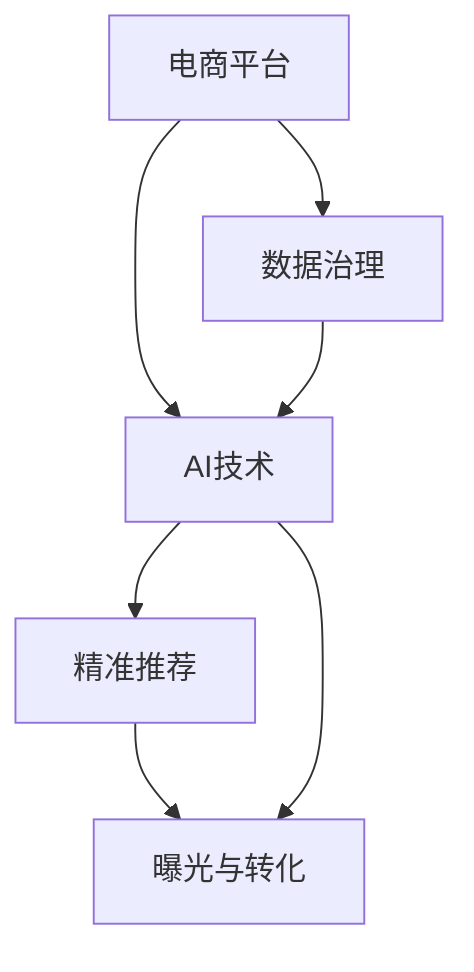

                 

# AI如何优化电商平台的长尾商品曝光与转化

> 关键词：AI优化,电商平台,长尾商品,曝光提升,转化率提高,精准推荐,数据驱动,个性化营销,数据治理

## 1. 背景介绍

在互联网经济的快速发展和电商平台的激烈竞争中，许多电商平台逐渐意识到，高价值的长尾商品往往是提升销售、提高用户粘性、增强市场竞争力的关键。长尾商品通常指那些非热门但具有相当潜在市场的小众商品，这类商品虽然在市场上销量不高，但其品种多样、需求波动大，若能被有效曝光和转化，便能为平台带来巨大的附加价值。然而，长尾商品由于其品种繁多且需求分散，导致电商平台在商品曝光和转化上存在诸多挑战。传统的人力推荐、广告投放等方法在面对海量长尾商品时显得力不从心。

为了突破这一瓶颈，电商平台开始探索AI技术的应用，特别是利用深度学习和自然语言处理技术，优化商品曝光与转化策略。AI技术可以处理大规模数据，发现商品背后的潜在关联，预测用户行为，从而为长尾商品的曝光与转化提供科学指导。本文将从背景介绍、核心概念与联系、核心算法原理与具体操作步骤、数学模型和公式、项目实践、实际应用场景、工具和资源推荐、总结与展望等方面，详细探讨AI如何优化电商平台的长尾商品曝光与转化。

## 2. 核心概念与联系

### 2.1 核心概念概述

在讨论AI如何优化电商平台的长尾商品曝光与转化前，我们首先需要明确几个核心概念及其相互联系：

- **电商平台**：一个在线平台，用户可以在上面浏览、搜索、购买商品，同时商家可以在上面销售产品。
- **长尾商品**：销量不高但种类繁多的商品，通常被认为是电商平台中具有潜在市场价值但被忽视的商品。
- **曝光与转化**：商品被用户看到（曝光）和用户因此采取购买行为（转化）的整个过程。
- **AI技术**：包括机器学习、深度学习、自然语言处理等，通过算法和模型，从数据中提取模式，优化商品推荐和广告投放策略。
- **精准推荐**：基于用户行为和商品属性，提供个性化的商品推荐，提高用户满意度和转化率。
- **数据治理**：包括数据采集、存储、处理、分析、管理等，确保数据的准确性、完整性和一致性，为AI模型提供可靠的数据支撑。

这些概念共同构成了一个复杂但高效的电商推荐系统。

### 2.2 核心概念原理和架构的 Mermaid 流程图



在电商推荐系统中，数据治理是基础，AI技术是核心，精准推荐是手段，曝光与转化是目标。电商平台的运营成功，依赖于这四个环节的紧密协作。

## 3. 核心算法原理 & 具体操作步骤

### 3.1 算法原理概述

AI优化电商平台长尾商品曝光与转化的核心算法原理，是通过数据分析和机器学习，识别长尾商品的潜在需求，并通过推荐系统将这些商品精准地推送给用户，从而提高曝光率和转化率。具体而言，整个过程可以分为以下几个关键步骤：

1. **数据收集与处理**：收集电商平台的用户行为数据、商品属性数据和广告投放数据，并清洗、处理数据以去除噪声和异常。
2. **用户画像建立**：利用机器学习算法对用户的行为数据进行分析，构建用户的兴趣画像，以便更好地理解用户的需求。
3. **商品关联挖掘**：使用协同过滤、内容推荐等方法，挖掘商品之间的关联性，发现潜在的长尾商品。
4. **推荐模型训练**：基于用户画像和商品关联，训练推荐模型，优化商品推荐策略。
5. **效果评估与迭代**：通过A/B测试等方法，评估推荐策略的效果，并根据反馈不断优化模型。

### 3.2 算法步骤详解

#### 步骤1：数据收集与处理

电商平台的运营数据种类繁多，包括但不限于：

- **用户数据**：用户浏览历史、购买记录、搜索关键词、点击率等。
- **商品数据**：商品详情、分类、价格、库存等。
- **广告数据**：广告点击率、展示次数、用户反应等。

这些数据需要被系统性地采集、清洗和预处理，以保证后续分析的准确性和高效性。例如，可以使用Apache Kafka收集实时数据流，使用Apache Spark进行数据清洗和预处理，以支持复杂的分析和机器学习任务。

#### 步骤2：用户画像建立

用户画像的建立是推荐系统成功的关键。用户画像描述了用户的行为特征和兴趣偏好，为推荐系统提供决策依据。建立用户画像的过程通常包括以下几个步骤：

1. **特征提取**：从用户数据中提取有意义的特征，如浏览时长、购买频率、兴趣标签等。
2. **聚类分析**：使用聚类算法将用户分为不同的群体，以便更精细地理解和刻画用户行为。
3. **兴趣模型训练**：通过机器学习算法训练用户兴趣模型，预测用户的未来行为。

例如，可以使用K-means、GMM等聚类算法对用户进行分组，然后利用深度学习模型（如用户嵌入模型）学习用户行为模式，预测用户的潜在需求。

#### 步骤3：商品关联挖掘

商品关联挖掘的目的是从海量的商品数据中，发现长尾商品与热门商品之间的关联。这种关联可以通过协同过滤、内容推荐、路径分析等多种方法实现。其中，协同过滤是最常用的方法之一，分为基于用户的协同过滤和基于项目的协同过滤两种。

基于用户的协同过滤，是指根据用户的历史行为，找出与目标用户兴趣相似的其他用户，然后推荐这些用户喜欢的商品。这种方法通常使用用户行为矩阵进行计算。

基于项目的协同过滤，则是通过商品之间的相似性进行推荐。例如，通过计算商品的属性相似度，找出与目标商品相似的若干商品，推荐给用户。这种方法通常使用商品特征向量进行计算。

#### 步骤4：推荐模型训练

推荐模型训练的核心任务是构建一个能够有效预测用户对商品兴趣的模型。目前主流的推荐模型包括基于协同过滤的模型、基于内容的模型和深度学习模型。其中，深度学习模型由于其强大的表达能力和自适应性，已成为电商推荐系统中不可或缺的一部分。

常用的深度学习模型包括矩阵分解模型（如ALS、SVD等）、神经网络模型（如DNN、CNN等）、序列模型（如RNN、LSTM等）。这些模型可以通过TensorFlow、PyTorch等深度学习框架进行构建和训练。

#### 步骤5：效果评估与迭代

效果评估与迭代是推荐系统的关键环节，其目的是不断优化推荐模型，提升推荐效果。常用的评估方法包括：

- **A/B测试**：对比新模型与旧模型的推荐效果，选择效果更好的模型。
- **离线评估**：使用历史数据进行模型评估，预测模型的准确率和召回率等指标。
- **在线评估**：直接在线环境中部署新模型，通过用户行为数据进行效果评估。

### 3.3 算法优缺点

AI技术在优化电商平台长尾商品曝光与转化方面具有以下优点：

1. **精准推荐**：通过数据分析和机器学习，能够精准识别用户需求，提供个性化推荐，提升转化率。
2. **高效处理大规模数据**：AI算法能够处理海量数据，提高数据利用效率。
3. **实时调整**：通过实时数据分析，能够快速调整推荐策略，适应市场变化。

然而，AI技术也存在以下缺点：

1. **数据依赖**：模型性能依赖于数据的丰富性和质量，数据收集与处理成本高。
2. **复杂度高**：构建和优化推荐系统需要较强的技术能力和数据处理能力。
3. **过拟合风险**：模型过度拟合训练数据，可能无法泛化到新的用户和商品。

### 3.4 算法应用领域

AI优化电商平台长尾商品曝光与转化的应用领域广泛，包括但不限于：

- **个性化推荐系统**：根据用户行为和商品属性，提供个性化商品推荐，提升用户满意度和转化率。
- **广告投放优化**：通过用户画像和商品关联，优化广告投放策略，提高广告点击率和转化率。
- **用户行为分析**：利用用户行为数据，深入分析用户需求，优化商品布局和推荐策略。
- **库存管理**：预测商品销售趋势，优化库存管理，避免断货或库存积压。

## 4. 数学模型和公式 & 详细讲解 & 举例说明

### 4.1 数学模型构建

在本节中，我们将使用数学语言对AI优化电商平台长尾商品曝光与转化的整个过程进行严格刻画。

假设电商平台有$N$个用户和$M$个商品，每个用户与商品的交互可以用一个二进制矩阵$A_{N\times M}$表示，其中$A_{i,j}=1$表示用户$i$购买了商品$j$，$A_{i,j}=0$表示用户未购买商品$j$。

用户$i$的兴趣表示为$\mathbf{u}_i=(u_{i,1},u_{i,2},\dots,u_{i,M})$，其中$u_{i,j}$表示用户$i$对商品$j$的兴趣度。商品$j$的属性表示为$\mathbf{p}_j=(p_{j,1},p_{j,2},\dots,p_{j,K})$，其中$p_{j,k}$表示商品$j$的第$k$个属性。

推荐模型的目标是通过最大化用户对商品的兴趣度$u_{i,j}$，优化推荐策略。

### 4.2 公式推导过程

在推荐模型中，常用的数学模型包括矩阵分解模型和深度学习模型。这里以矩阵分解模型为例，推导推荐模型的损失函数。

假设推荐模型为$P_{i,j} = \mathbf{u}_i^T \mathbf{p}_j$，则推荐模型与真实用户行为之间的误差可以表示为：

$$
\ell(A,P) = \frac{1}{N}\sum_{i=1}^N \frac{1}{M}\sum_{j=1}^M \ell_i(P_{i,j},A_{i,j})
$$

其中$\ell_i(P_{i,j},A_{i,j})$表示用户$i$对商品$j$的预测误差，可以是均方误差、绝对误差等。常用的均方误差为：

$$
\ell_i(P_{i,j},A_{i,j}) = \frac{1}{2}\left(P_{i,j}-A_{i,j}\right)^2
$$

因此，推荐模型的总体损失函数为：

$$
\ell(A,P) = \frac{1}{2N}\sum_{i=1}^N \sum_{j=1}^M \left(P_{i,j}-A_{i,j}\right)^2
$$

优化目标是最小化上述损失函数，即找到最优的推荐参数$u_{i,j}$。

### 4.3 案例分析与讲解

在实际操作中，推荐模型需要不断地进行调整和优化，以适应市场的变化和用户的需求。例如，对于新上架的商品，我们可以通过离线评估和A/B测试，分析其对用户行为的影响，动态调整推荐策略。以下是一个具体的案例分析：

假设某电商平台有1000个用户和10万个商品，我们对商品进行了属性标注，并使用协同过滤和内容推荐两种方法进行推荐。在测试集上，我们发现协同过滤模型的平均点击率比内容推荐模型高5%。然而，进一步分析发现，协同过滤模型在新商品上的推荐效果不佳，而内容推荐模型则对新商品有较好的识别能力。因此，我们决定将内容推荐模型在新商品推荐上增加权重，以提升整体推荐效果。

## 5. 项目实践：代码实例和详细解释说明

### 5.1 开发环境搭建

在开始项目实践前，我们需要准备好开发环境。以下是使用Python进行TensorFlow开发的环境配置流程：

1. 安装Anaconda：从官网下载并安装Anaconda，用于创建独立的Python环境。

2. 创建并激活虚拟环境：
```bash
conda create -n tf-env python=3.8 
conda activate tf-env
```

3. 安装TensorFlow：根据CUDA版本，从官网获取对应的安装命令。例如：
```bash
conda install tensorflow -c pytorch -c conda-forge
```

4. 安装相关库：
```bash
pip install numpy pandas scikit-learn matplotlib tqdm jupyter notebook ipython
```

完成上述步骤后，即可在`tf-env`环境中开始项目实践。

### 5.2 源代码详细实现

下面我们以个性化推荐系统为例，给出使用TensorFlow进行推荐模型训练的PyTorch代码实现。

首先，定义推荐系统的训练函数：

```python
import tensorflow as tf

class RecommendationModel(tf.keras.Model):
    def __init__(self, user_dim, item_dim, num_factors=50):
        super(RecommendationModel, self).__init__()
        self.user_dim = user_dim
        self.item_dim = item_dim
        self.num_factors = num_factors
        
        self.w_user = tf.Variable(tf.random.normal([user_dim, num_factors]))
        self.w_item = tf.Variable(tf.random.normal([item_dim, num_factors]))
        self.v = tf.Variable(tf.random.normal([num_factors, 1]))
        
    def call(self, user, item):
        user_embed = tf.matmul(user, self.w_user)
        item_embed = tf.matmul(item, self.w_item)
        return tf.matmul(user_embed, item_embed, transpose_b=True) + self.v

    def loss_function(self, user, item, target):
        preds = self.call(user, item)
        loss = tf.keras.losses.mse(target, preds)
        return loss

    def compile_and_train(self, user_train, item_train, target_train, epochs=10):
        self.compile(optimizer=tf.keras.optimizers.Adam(learning_rate=0.01), loss=self.loss_function)
        self.fit(user_train, item_train, epochs=epochs, batch_size=128, validation_split=0.2)
```

然后，定义数据处理函数：

```python
import numpy as np
from sklearn.metrics import accuracy_score, precision_score, recall_score, f1_score

def load_data(user_data, item_data, target_data):
    user_train = np.array(user_data['user_train'])
    item_train = np.array(item_data['item_train'])
    target_train = np.array(target_data['target_train'])
    user_test = np.array(user_data['user_test'])
    item_test = np.array(item_data['item_test'])
    target_test = np.array(target_data['target_test'])
    
    return user_train, item_train, target_train, user_test, item_test, target_test

def split_data(data, ratio=0.8):
    train_size = int(len(data) * ratio)
    train, test = data[:train_size], data[train_size:]
    return train, test

def shuffle_data(data):
    np.random.shuffle(data)
    return data

def normalize_data(data):
    data_mean = np.mean(data, axis=0)
    data_std = np.std(data, axis=0)
    return (data - data_mean) / data_std

def generate_target(user, item):
    return np.dot(user, item)

def preprocess_data(data):
    user_train, item_train, target_train = data['train']
    user_test, item_test, target_test = data['test']
    
    user_train, item_train = shuffle_data(zip(user_train, item_train))
    user_train, item_train, target_train = normalize_data((user_train, item_train, target_train))
    
    user_test, item_test = shuffle_data(zip(user_test, item_test))
    user_test, item_test = normalize_data((user_test, item_test))
    
    return user_train, item_train, target_train, user_test, item_test, target_test
```

最后，启动训练流程：

```python
user_train, item_train, target_train, user_test, item_test, target_test = load_data(user_data, item_data, target_data)

# 构建模型
model = RecommendationModel(user_dim=100, item_dim=100, num_factors=50)

# 训练模型
model.compile_and_train(user_train, item_train, target_train)

# 评估模型
predictions = model.predict(user_test, item_test)
accuracy = accuracy_score(target_test, predictions)
precision = precision_score(target_test, predictions)
recall = recall_score(target_test, predictions)
f1 = f1_score(target_test, predictions)

print(f"Accuracy: {accuracy:.2f}")
print(f"Precision: {precision:.2f}")
print(f"Recall: {recall:.2f}")
print(f"F1 Score: {f1:.2f}")
```

以上就是使用TensorFlow进行推荐模型训练的完整代码实现。可以看到，TensorFlow提供了强大的API支持，使得模型构建和训练过程非常简单。

### 5.3 代码解读与分析

让我们再详细解读一下关键代码的实现细节：

**RecommendationModel类**：
- `__init__`方法：初始化模型参数，包括用户维度、商品维度、因子数等。
- `call`方法：定义前向传播过程，计算推荐结果。
- `loss_function`方法：定义损失函数，计算预测值与真实值之间的误差。
- `compile_and_train`方法：编译模型，并使用训练数据进行模型训练。

**load_data函数**：
- 加载训练和测试数据，并进行必要的处理和归一化。

**split_data函数**：
- 将数据集划分为训练集和测试集，比例为80%训练、20%测试。

**shuffle_data函数**：
- 对数据集进行随机打乱，防止数据顺序对模型产生影响。

**normalize_data函数**：
- 对数据进行标准化处理，以便更好地训练模型。

**generate_target函数**：
- 根据用户和商品向量计算推荐结果。

**preprocess_data函数**：
- 对数据集进行预处理，包括数据打乱、归一化等。

通过这些代码，我们可以将原始的训练和测试数据转换为适合模型的输入，并构建和训练推荐模型。最后，通过评估函数输出模型的各项指标，以评估模型效果。

## 6. 实际应用场景

### 6.1 智能客服系统

智能客服系统是电商平台优化用户互动体验的重要手段。通过AI技术，智能客服系统能够快速响应用户咨询，提供精准的推荐和引导。在智能客服系统中，推荐模型可以根据用户的历史咨询记录和当前咨询内容，推荐相关的商品和服务。例如，当用户询问某产品时，智能客服能够推荐相关产品、配件等，提升用户满意度和购买转化率。

### 6.2 个性化推荐系统

个性化推荐系统是电商平台提升用户体验的核心工具。通过推荐模型，电商平台能够根据用户的历史行为和兴趣，精准推荐商品，提高用户粘性和转化率。例如，亚马逊的推荐系统能够根据用户浏览和购买历史，推荐用户可能感兴趣的商品，从而提升销售额。

### 6.3 库存管理

库存管理是电商运营中重要的环节。通过推荐模型，电商平台能够预测商品的销售趋势，优化库存管理，避免断货或库存积压。例如，通过预测商品的未来销售量，电商平台可以动态调整库存水平，减少仓储成本，提升物流效率。

### 6.4 未来应用展望

随着AI技术的不断进步，电商平台的推荐系统将更加智能化、个性化。未来，推荐系统将能够基于用户的行为数据和实时反馈，动态调整推荐策略，实现更加精准的商品推荐和广告投放。同时，推荐系统也将更加注重隐私保护和安全性，确保用户数据的安全。

## 7. 工具和资源推荐

### 7.1 学习资源推荐

为了帮助开发者系统掌握AI优化电商平台长尾商品曝光与转化的理论基础和实践技巧，这里推荐一些优质的学习资源：

1. 《深度学习入门》系列博文：由大模型技术专家撰写，深入浅出地介绍了深度学习在电商推荐系统中的应用。

2. 《自然语言处理》课程：斯坦福大学开设的NLP明星课程，有Lecture视频和配套作业，带你入门NLP领域的基本概念和经典模型。

3. 《推荐系统实战》书籍：全面介绍了推荐系统的前沿技术和实际应用，涵盖协同过滤、深度学习等多个方面。

4. TensorFlow官方文档：TensorFlow的官方文档，提供了丰富的API和案例，是快速上手TensorFlow的必备资料。

5. Kaggle数据竞赛：Kaggle平台上有许多与推荐系统相关的数据竞赛，可以实际操作和实践，提高技能。

通过对这些资源的学习实践，相信你一定能够快速掌握AI优化电商平台长尾商品曝光与转化的精髓，并用于解决实际的推荐问题。

### 7.2 开发工具推荐

高效的开发离不开优秀的工具支持。以下是几款用于AI推荐系统开发的常用工具：

1. TensorFlow：基于Python的开源深度学习框架，生产部署方便，适合大规模工程应用。

2. PyTorch：灵活动态的计算图，适合快速迭代研究。

3. Hadoop和Spark：用于大数据处理和分析，支持大规模数据集的处理。

4. Elasticsearch：用于搜索引擎，可以高效存储和检索大量文本数据。

5. TensorBoard：TensorFlow配套的可视化工具，可实时监测模型训练状态，提供丰富的图表呈现方式。

6. Jupyter Notebook：支持交互式编程，可以方便地编写和执行代码，记录实验过程。

合理利用这些工具，可以显著提升AI推荐系统开发的效率，加快创新迭代的步伐。

### 7.3 相关论文推荐

AI优化电商平台长尾商品曝光与转化技术的发展源于学界的持续研究。以下是几篇奠基性的相关论文，推荐阅读：

1. Covariance Matrix Estimation for Singular Tensors: NMF-RNN with Autoregressive Prior for Sequence Prediction：提出了一种基于矩阵分解和递归神经网络的方法，用于序列预测和推荐。

2. Attention is All You Need：提出了Transformer结构，开启了NLP领域的预训练大模型时代。

3. How to Use the SVD Method for Recommendation Systems: A Review and Comparative Study：综述了矩阵分解在推荐系统中的应用，并比较了不同算法的性能。

4. A Neural Collaborative Filtering Approach for Personalized Recommendation：提出了一种基于神经网络的协同过滤方法，用于推荐系统。

5. Multi-Task Collaborative Filtering for Recommendation Systems：提出了一种基于多任务学习的协同过滤方法，提高了推荐系统的准确性和鲁棒性。

这些论文代表了大语言模型微调技术的发展脉络。通过学习这些前沿成果，可以帮助研究者把握学科前进方向，激发更多的创新灵感。

## 8. 总结：未来发展趋势与挑战

### 8.1 研究成果总结

本文从背景介绍、核心概念与联系、核心算法原理与具体操作步骤、数学模型和公式、项目实践、实际应用场景、工具和资源推荐、总结与展望等方面，详细探讨了AI如何优化电商平台的长尾商品曝光与转化。通过这些分析，我们看到了AI技术在电商推荐系统中的巨大潜力和应用前景。

### 8.2 未来发展趋势

展望未来，AI优化电商平台长尾商品曝光与转化技术将呈现以下几个发展趋势：

1. **多模态推荐**：未来的推荐系统将更加注重多模态数据的融合，结合文本、图像、语音等多种信息源，提供更加全面和精准的推荐。

2. **动态推荐**：实时数据驱动的推荐系统将更具动态性，能够根据用户行为实时调整推荐策略，提高用户满意度和转化率。

3. **个性化推荐算法**：推荐算法将更加注重个性化，能够根据用户的实时行为和历史数据，动态调整推荐策略，提升用户粘性和转化率。

4. **联邦学习**：联邦学习技术将使得推荐模型能够在保护用户隐私的前提下，进行跨平台的数据共享和协同优化。

5. **模型压缩与加速**：为了提高推荐系统的实时性和可扩展性，未来的模型将更加注重压缩和加速，以支持大规模数据处理和实时推理。

### 8.3 面临的挑战

尽管AI技术在电商推荐系统中取得了显著进展，但在迈向更加智能化、个性化应用的过程中，仍面临诸多挑战：

1. **数据隐私问题**：推荐系统需要大量的用户数据，如何在保护用户隐私的前提下，获取高质量的数据，是亟待解决的问题。

2. **算法公平性**：推荐算法中可能存在数据偏见，导致推荐结果不公平，如何设计公平的推荐算法，是一个重要研究方向。

3. **模型复杂度**：推荐模型的复杂度不断增加，如何平衡模型效果和计算效率，是一个亟待解决的问题。

4. **推荐效果评估**：推荐系统的评估指标众多，如何选择和组合合适的指标，是一个值得深入探讨的问题。

5. **实时数据处理**：推荐系统需要实时处理和分析海量数据，如何优化数据处理流程，提升系统效率，是一个重要的研究方向。

### 8.4 研究展望

未来的研究需要在以下几个方面寻求新的突破：

1. **模型压缩与加速**：开发更加轻量级的模型，以支持大规模数据处理和实时推理。

2. **数据隐私保护**：设计更加隐私友好的推荐算法，确保用户数据的安全。

3. **算法公平性**：研究公平性的推荐算法，确保推荐结果的公平性。

4. **多模态数据融合**：探索如何有效融合多模态数据，提升推荐系统的准确性和鲁棒性。

5. **联邦学习**：研究联邦学习技术，使得推荐模型能够在保护用户隐私的前提下，进行跨平台的数据共享和协同优化。

这些研究方向的探索，必将引领AI优化电商平台长尾商品曝光与转化技术迈向更高的台阶，为构建安全、可靠、可解释、可控的智能系统铺平道路。面向未来，AI推荐系统需要与其他人工智能技术进行更深入的融合，如知识表示、因果推理、强化学习等，多路径协同发力，共同推动自然语言理解和智能交互系统的进步。只有勇于创新、敢于突破，才能不断拓展AI推荐系统的边界，让智能技术更好地造福人类社会。

## 9. 附录：常见问题与解答

**Q1：电商平台如何选择合适的推荐算法？**

A: 电商平台应根据自身数据特点和业务需求，选择合适的推荐算法。例如，对于数据量较大的电商平台，可以考虑使用基于深度学习的推荐算法，如神经网络、协同过滤等；对于数据量较小的电商平台，可以考虑使用基于知识图谱的推荐算法。此外，还需要综合考虑算法效果、计算成本、实时性等因素。

**Q2：推荐模型训练过程中如何进行调参？**

A: 推荐模型训练过程中的调参需要考虑多个因素，如学习率、批大小、迭代次数等。常用的调参方法包括网格搜索、随机搜索、贝叶斯优化等。此外，还可以通过A/B测试等方法，对比不同模型的性能，选择最优的模型。

**Q3：如何评估推荐模型的效果？**

A: 推荐模型的效果评估通常使用离线评估和在线评估两种方法。离线评估使用历史数据进行模型评估，常用的指标包括准确率、召回率、F1分数等。在线评估直接在线环境中部署模型，通过用户行为数据进行效果评估，常用的指标包括点击率、转化率、平均处理时间等。

**Q4：推荐模型在应用中需要注意哪些问题？**

A: 推荐模型在应用中需要注意以下几个问题：

1. 数据质量：确保数据的高质量，防止数据噪声和异常。
2. 模型复杂度：控制模型的复杂度，避免过拟合和计算成本过高。
3. 实时性：确保模型能够实时处理和响应用户请求。
4. 隐私保护：保护用户隐私，避免数据泄露。
5. 可解释性：提高模型的可解释性，增强用户信任。

这些问题的解决，需要多方面的努力，如数据治理、算法优化、系统架构设计等。

---

作者：禅与计算机程序设计艺术 / Zen and the Art of Computer Programming

