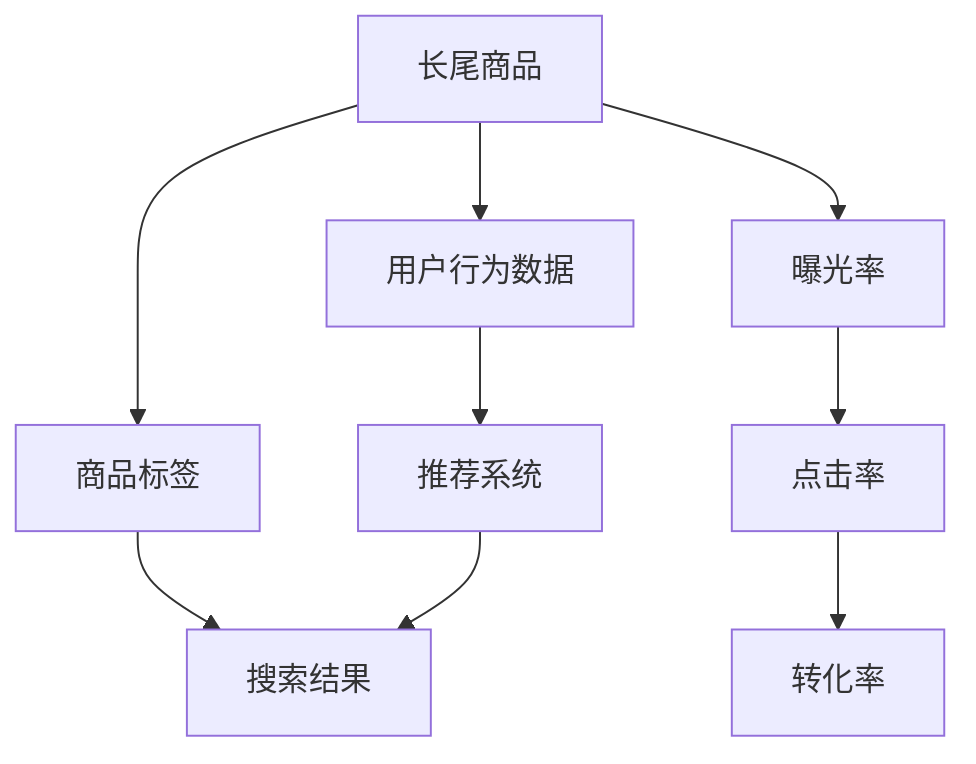

                 

## 1. 背景介绍

### 1.1 问题由来
电商平台在不断发展中，越来越多的商家入驻，商品种类繁多，但并非所有商品都能像热门商品一样获得巨大的曝光和销量。长尾商品，即那些需求较小但种类繁多的商品，往往在搜索结果和推荐列表中占比不大，导致用户难以发现，销量低迷。这不仅影响商家的销售，还降低了平台的商品丰富度和用户体验。

### 1.2 问题核心关键点
长尾商品的曝光与转化率提升问题，主要体现在：
- 长尾商品需求量小，难以被搜索引擎识别和推荐。
- 长尾商品种类繁多，商家缺乏有效的运营手段来提升曝光率和转化率。
- 电商平台无法对长尾商品进行精细化管理，导致资源分配不均衡。

## 2. 核心概念与联系

### 2.1 核心概念概述

要优化电商平台长尾商品的曝光与转化率，首先需要明确几个核心概念：

- **长尾商品(Long-Tail Products)**：指需求量较少，但种类繁多的商品。通常由那些既不热门也不冷门的商品组成。
- **曝光率(Exposure Rate)**：指商品在搜索结果和推荐列表中出现的频率。曝光率是衡量商品可见性的重要指标。
- **转化率(Conversion Rate)**：指用户浏览商品后进行购买的比例。转化率是衡量商品销售效率的关键指标。
- **搜索引擎(Search Engine)**：指通过爬取网页内容和用户行为数据，提供搜索结果和推荐列表的系统。

这些核心概念之间通过电商平台的推荐系统和搜索系统紧密联系，共同影响着长尾商品的曝光和转化。

### 2.2 核心概念原理和架构的 Mermaid 流程图



这个流程图展示了长尾商品在电商平台中的工作流程：

1. 长尾商品被平台收录，并打上相关标签。
2. 用户行为数据被收集并输入到推荐系统中。
3. 推荐系统根据用户行为数据和商品标签，生成推荐列表。
4. 长尾商品出现在搜索结果和推荐列表中，形成曝光。
5. 用户点击商品后，形成点击率。
6. 用户购买商品后，形成转化率。

## 3. 核心算法原理 & 具体操作步骤

### 3.1 算法原理概述

要优化长尾商品的曝光和转化率，可以采用一系列的算法和策略。核心思想是利用推荐算法和大数据分析技术，将长尾商品更有效地展示给用户，并通过用户行为反馈优化推荐效果，提高转化率。

### 3.2 算法步骤详解

1. **数据采集与清洗**：收集电商平台的用户行为数据，包括浏览记录、点击记录、购买记录等，并对数据进行清洗，去除无效和异常数据。

2. **特征工程**：对用户和商品数据进行特征提取，例如用户性别、年龄、浏览时长等，以及商品的类别、价格、评价等，用于构建推荐模型。

3. **推荐算法选择**：选择合适的推荐算法，如协同过滤、内容推荐、深度学习推荐等，根据电商平台的数据特性和用户需求，选择合适的算法模型。

4. **模型训练与优化**：使用电商平台的历史数据对推荐模型进行训练，并通过A/B测试等方法不断优化模型参数，提高推荐准确率和效果。

5. **曝光与转化优化**：根据优化后的模型，调整商品在搜索结果和推荐列表中的展示位置，以及曝光时间和频率，同时对转化过程进行优化，例如采用优惠券、限时折扣等手段，刺激用户购买。

### 3.3 算法优缺点

#### 优点：

1. **个性化推荐**：通过推荐算法和大数据分析，能够更好地了解用户需求和行为，提供个性化的商品推荐，提升用户满意度。
2. **曝光量提升**：通过优化商品在搜索结果和推荐列表中的展示位置，提高商品的曝光率，扩大其市场覆盖面。
3. **转化率提高**：通过用户行为反馈和优化，提高商品转化率，增加电商平台收入。

#### 缺点：

1. **数据依赖性强**：推荐算法和曝光优化效果依赖于大量用户行为数据的积累和分析。
2. **模型复杂度高**：深度学习等复杂的推荐模型需要大量计算资源和算力支持。
3. **用户隐私问题**：用户行为数据涉及个人隐私，需要在数据采集和使用中严格遵守隐私保护法规。

### 3.4 算法应用领域

这些算法和策略不仅适用于电商平台的商品推荐，还广泛应用于以下领域：

- **内容推荐系统**：如Netflix、YouTube等，通过分析用户观看历史和评分，推荐个性化的电影和视频。
- **广告投放**：如Google AdWords，通过分析用户搜索行为，投放个性化的广告。
- **金融服务**：如银行贷款审批，通过分析用户财务记录和信用评分，推荐合适的贷款产品。

## 4. 数学模型和公式 & 详细讲解 & 举例说明

### 4.1 数学模型构建

假设有一个电商平台，商品总数为$N$，用户总数为$M$。设用户对商品$n$的兴趣为$I_n$，用户点击商品$n$的概率为$P_n$，用户购买商品$n$的概率为$C_n$。电商平台通过推荐算法推荐商品$n$给用户$i$的概率为$R_{in}$。则长尾商品的曝光率$E_n$、点击率$C_n$和转化率$R_n$可以分别表示为：

$$
E_n = \frac{\sum_{i=1}^{M} R_{in}}{M}
$$

$$
C_n = \frac{\sum_{i=1}^{M} P_n \cdot R_{in}}{M}
$$

$$
R_n = \frac{\sum_{i=1}^{M} C_n \cdot R_{in}}{M}
$$

### 4.2 公式推导过程

1. **曝光率推导**：
   - 假设电商平台每天有$T$个推荐位置，每个用户每天最多浏览$L$个推荐商品。
   - 每个推荐商品$n$被用户$i$点击的概率为$P_n$，被用户$i$点击后购买的概率为$C_n$。
   - 则曝光率$E_n$可以表示为：
     - 每天每个用户点击的次数$P_{in}$：$P_{in} = P_n \cdot R_{in}$
     - 每天推荐位置总数：$T$
     - 每天用户浏览推荐次数：$L$
     - 则曝光率$E_n$为：
     - $E_n = \frac{\sum_{i=1}^{M} \frac{P_{in} \cdot T}{L}}{M} = \frac{T}{L} \cdot \frac{\sum_{i=1}^{M} P_n \cdot R_{in}}{M} = \frac{T}{L} \cdot C_n$

2. **点击率推导**：
   - 点击率$C_n$可以直接通过用户点击次数和点击概率推导：
     - $C_n = \frac{\sum_{i=1}^{M} P_n \cdot R_{in}}{M}$

3. **转化率推导**：
   - 转化率$R_n$可以直接通过用户购买次数和点击概率推导：
     - $R_n = \frac{\sum_{i=1}^{M} C_n \cdot R_{in}}{M}$

### 4.3 案例分析与讲解

以一个电商平台为例，假设商品总数为10万，用户总数为100万，每天推荐位置有100个。设商品$n$的兴趣度$I_n = 0.1$，用户点击概率$P_n = 0.05$，点击后购买概率$C_n = 0.1$。假设推荐算法推荐商品$n$给用户$i$的概率为$R_{in} = 0.01$。

**计算曝光率$E_n$**：
- 每天每个用户点击的次数$P_{in} = 0.05 \cdot 0.01 = 0.0005$
- 每天推荐位置总数：$T = 100$
- 每天用户浏览推荐次数：$L = 100$
- 曝光率$E_n = \frac{T}{L} \cdot \frac{\sum_{i=1}^{M} P_n \cdot R_{in}}{M} = \frac{100}{100} \cdot \frac{\sum_{i=1}^{100} 0.0005}{100} = 0.01$

**计算点击率$C_n$**：
- 点击率$C_n = \frac{\sum_{i=1}^{100} 0.05 \cdot 0.01}{100} = 0.005$

**计算转化率$R_n$**：
- 转化率$R_n = \frac{\sum_{i=1}^{100} 0.005 \cdot 0.01}{100} = 0.00005$

通过以上案例，可以看到，尽管商品$n$的兴趣度和点击率、转化率都很低，但由于推荐算法的高推荐概率$R_{in}$，其曝光率得到了显著提升，从而增加了点击率和转化率的机会。

## 5. 项目实践：代码实例和详细解释说明

### 5.1 开发环境搭建

要实现长尾商品的曝光和转化率优化，需要搭建一个基于Python的开发环境，包含以下关键工具和库：

- **Python**：作为开发语言，支持数据处理和算法实现。
- **Pandas**：用于数据清洗和预处理。
- **Scikit-Learn**：用于特征工程和模型训练。
- **XGBoost**：用于构建推荐模型。
- **Flask**：用于搭建Web应用，实现个性化推荐和广告投放。
- **TensorFlow**：用于深度学习推荐模型。

### 5.2 源代码详细实现

以下是一个基于TensorFlow的深度学习推荐模型示例：

```python
import tensorflow as tf
from tensorflow.keras.layers import Input, Embedding, Dense, Flatten, Dropout
from tensorflow.keras.models import Model
from tensorflow.keras.optimizers import Adam

# 定义模型输入
user_input = Input(shape=())
item_input = Input(shape=())

# 用户和商品嵌入层
user_embedding = Embedding(input_dim=10000, output_dim=128)(user_input)
item_embedding = Embedding(input_dim=10000, output_dim=128)(item_input)

# 连接层
concat = tf.keras.layers.concatenate([user_embedding, item_embedding])
flatten = Flatten()(concat)

# 隐藏层
dense = Dense(64, activation='relu')(flatten)
dropout = Dropout(0.2)(dense)

# 输出层
output = Dense(1, activation='sigmoid')(dropout)

# 定义模型
model = Model(inputs=[user_input, item_input], outputs=output)

# 编译模型
model.compile(optimizer=Adam(lr=0.001), loss='binary_crossentropy', metrics=['accuracy'])

# 训练模型
model.fit([train_user_ids, train_item_ids], train_labels, epochs=10, batch_size=32)
```

### 5.3 代码解读与分析

上述代码实现了基于TensorFlow的深度学习推荐模型。其主要步骤包括：

1. **输入层定义**：使用`Input`函数定义用户和商品的输入层。
2. **嵌入层定义**：使用`Embedding`函数将用户和商品的ID转换为向量表示。
3. **连接层定义**：将用户和商品的嵌入向量连接起来，并通过`Flatten`函数展开成一维向量。
4. **隐藏层定义**：使用`Dense`函数定义一个64个神经元的隐藏层，并使用`Dropout`函数进行正则化。
5. **输出层定义**：使用`Dense`函数定义一个神经元，并使用`sigmoid`函数激活输出，表示点击概率。
6. **模型编译与训练**：使用`compile`函数编译模型，使用`Adam`优化器和`binary_crossentropy`损失函数，训练10个epoch，每个batch包含32个样本。

### 5.4 运行结果展示

在训练过程中，可以通过监控准确率和损失函数的变化，判断模型是否收敛：

```python
import matplotlib.pyplot as plt

# 监控训练过程
loss = model.history.loss
acc = model.history.acc

plt.plot(loss, label='loss')
plt.plot(acc, label='acc')
plt.legend()
plt.show()
```

## 6. 实际应用场景

### 6.1 智能推荐系统

在智能推荐系统中，电商平台可以根据用户浏览历史、点击记录和购买记录，利用推荐算法生成个性化推荐列表。对于长尾商品，通过优化展示位置和推荐概率，可以提高其曝光率和转化率。

### 6.2 广告投放优化

在广告投放中，电商平台可以根据用户搜索历史和行为数据，推荐相关的广告内容。对于长尾商品，通过优化广告展示位置和点击率，可以提高其曝光率和转化率。

### 6.3 个性化电商推荐

在个性化电商推荐中，电商平台可以根据用户个性化需求，推荐相应的商品和优惠活动。对于长尾商品，通过优化推荐算法和展示策略，可以提高其曝光率和转化率。

## 7. 工具和资源推荐

### 7.1 学习资源推荐

1. **《推荐系统实战》**：一本详细介绍推荐系统原理和实现的书，涵盖了协同过滤、内容推荐等算法。
2. **Coursera《推荐系统》课程**：斯坦福大学开设的推荐系统课程，讲解推荐算法原理和案例。
3. **Kaggle推荐系统竞赛**：通过实际数据集练习推荐系统算法，提升实战能力。

### 7.2 开发工具推荐

1. **TensorFlow**：深度学习推荐模型的首选框架，支持多种推荐算法实现。
2. **PyTorch**：灵活的深度学习框架，适合动态模型和算法实现。
3. **Scikit-Learn**：简单易用的机器学习库，适合特征工程和模型训练。

### 7.3 相关论文推荐

1. **《协同过滤推荐系统》**：详细介绍了协同过滤算法的原理和应用。
2. **《深度学习在推荐系统中的应用》**：介绍了深度学习在推荐系统中的进展和挑战。
3. **《推荐系统中的特征工程》**：详细介绍了推荐系统中的特征提取和处理技术。

## 8. 总结：未来发展趋势与挑战

### 8.1 总结

本文介绍了通过推荐算法和大数据分析技术，优化电商平台长尾商品曝光与转化率的方法。首先阐述了长尾商品优化的问题由来和核心关键点，明确了推荐算法在优化长尾商品中的重要作用。其次，从原理到实践，详细讲解了推荐算法的数学模型和关键步骤，给出了代码实例。同时，本文还探讨了推荐算法在多个实际应用场景中的优化策略。最后，精选了推荐算法的学习资源和工具，力求为读者提供全方位的技术指引。

通过本文的系统梳理，可以看到，推荐算法在优化长尾商品曝光与转化率方面具有显著的效果。其简单高效的特点，使得电商平台能够更加精准地展示商品，提升用户满意度，增加收入。未来，随着推荐算法的不断进步和优化，相信长尾商品的曝光和转化率将进一步提升，电商平台将迎来更加健康、稳定的发展。

### 8.2 未来发展趋势

展望未来，推荐算法的发展趋势如下：

1. **个性化推荐**：随着大数据和深度学习技术的发展，推荐算法将更加注重个性化，能够根据用户实时行为，动态调整推荐策略，提供更加个性化的商品和服务。
2. **跨平台推荐**：推荐系统将不再局限于电商平台，跨平台推荐将成为未来趋势，如社交网络、视频网站等，通过推荐算法，提供综合化的推荐服务。
3. **实时推荐**：推荐系统将实现实时推荐，利用实时数据和算法模型，及时调整推荐内容，提升用户体验。
4. **多模态推荐**：推荐系统将实现多模态推荐，结合文本、图像、视频等多种数据，提供更丰富的推荐内容。
5. **跨领域推荐**：推荐系统将实现跨领域推荐，将不同领域的数据进行整合，提供更加全面、准确的商品和服务。

### 8.3 面临的挑战

尽管推荐算法在长尾商品优化方面取得了显著效果，但在实际应用中也面临诸多挑战：

1. **数据质量问题**：推荐算法的性能依赖于高质量的数据，如何保证数据的多样性和准确性，是一个重要问题。
2. **算法复杂性**：推荐算法的实现过程较为复杂，需要大量的计算资源和算力支持，如何在资源有限的情况下优化算法，是一个挑战。
3. **用户隐私保护**：用户行为数据涉及个人隐私，如何在数据采集和使用中保护用户隐私，是一个重要课题。
4. **模型鲁棒性**：推荐算法需要在不同数据和场景下保持鲁棒性，避免因数据变化导致的模型失效。
5. **实时性问题**：推荐系统需要实现实时推荐，如何保证算法的实时性和稳定性，是一个重要问题。

### 8.4 研究展望

未来的研究需要在以下几个方面寻求新的突破：

1. **无监督学习推荐**：探索无监督学习推荐算法，摆脱对标注数据的依赖，利用未标注数据进行推荐，提高推荐效果。
2. **多模态融合推荐**：结合图像、视频等多模态数据，提升推荐系统的丰富性和准确性。
3. **跨领域推荐**：将不同领域的数据进行整合，提供更加全面、准确的商品和服务。
4. **深度强化学习推荐**：利用强化学习思想，优化推荐策略，提高推荐系统的智能性和效果。
5. **联邦学习推荐**：利用联邦学习技术，实现跨平台、跨领域的推荐系统，保护用户隐私，提升推荐效果。

这些研究方向的探索，将引领推荐算法技术迈向更高的台阶，为长尾商品的优化提供更加智能、高效和安全的解决方案。面向未来，推荐算法需要与其他人工智能技术进行更深入的融合，共同推动自然语言理解和智能交互系统的进步。只有勇于创新、敢于突破，才能不断拓展推荐算法的边界，让智能技术更好地造福人类社会。

## 9. 附录：常见问题与解答

**Q1：推荐算法是否适用于所有电商平台？**

A: 推荐算法适用于多种类型的电商平台，如B2C、B2B、C2C等。不同类型电商平台的推荐算法可能略有差异，需要根据具体情况进行调整。

**Q2：推荐算法需要哪些数据？**

A: 推荐算法需要大量的用户行为数据，包括浏览记录、点击记录、购买记录等。这些数据可以从电商平台的用户互动中获取，也可以通过第三方数据源获取。

**Q3：推荐算法的训练周期有多长？**

A: 推荐算法的训练周期取决于数据量和模型复杂度。通常情况下，深度学习推荐模型的训练周期较长，需要在GPU或TPU等高性能设备上运行。

**Q4：推荐算法的评估标准有哪些？**

A: 推荐算法的评估标准包括准确率、召回率、F1分数、AUC等指标。通过A/B测试等方法，可以评估推荐算法的实际效果。

**Q5：推荐算法如何平衡曝光率和转化率？**

A: 推荐算法可以通过优化展示位置、调整推荐概率等方式，平衡曝光率和转化率。通常情况下，可以通过调整模型参数或采用多个模型集成的方式，实现多目标优化。

---

作者：禅与计算机程序设计艺术 / Zen and the Art of Computer Programming

