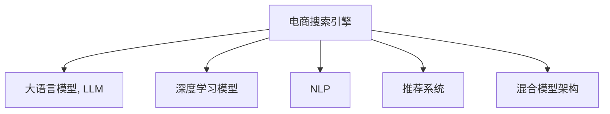

                 

## 1. 背景介绍

随着电商业务的快速发展，用户体验成为了竞争的关键。一个优秀的电商搜索引擎需要具备高度的准确性和个性化推荐能力，以满足用户的多样化需求。传统的电商搜索引擎通常采用基于文本的关键词匹配和搜索算法，但这种方法存在明显的局限性。具体表现为：

1. **低精度匹配**：关键词匹配方式忽略了语义的细微差别，导致搜索结果相关性较低，用户体验不佳。
2. **缺乏个性化**：无法根据用户的个性化需求进行推荐，难以实现个性化搜索。
3. **数据利用率低**：传统搜索算法对商品的描述信息利用不足，无法全面理解商品的特征。

为了解决上述问题，电商搜索引擎需要引入先进的AI技术，尤其是深度学习和自然语言处理技术，以提升搜索的准确性和个性化推荐能力。

## 2. 核心概念与联系

### 2.1 核心概念概述

为更好地理解融合AI大模型的电商搜索引擎架构设计，本节将介绍几个密切相关的核心概念：

- **电商搜索引擎**：用于帮助用户在电商平台内快速找到相关商品的搜索系统。
- **大语言模型(Large Language Model, LLM)**：以自回归或自编码模型为代表的大规模预训练语言模型。通过在海量无标签文本语料上进行预训练，学习通用的语言表示，具备强大的语言理解和生成能力。
- **深度学习模型**：如卷积神经网络(CNN)、循环神经网络(RNN)、长短期记忆网络(LSTM)、注意力机制(Attention)等，用于特征提取和模型训练。
- **自然语言处理(NLP)**：涵盖语音识别、文本分析、语言生成等技术，帮助电商搜索引擎理解自然语言输入和输出。
- **推荐系统**：根据用户历史行为和商品特征，动态生成个性化推荐结果的系统。
- **混合模型架构**：将多种AI技术有机融合，构建多层次、多维度、多模态的搜索架构。

这些核心概念之间的逻辑关系可以通过以下Mermaid流程图来展示：



这个流程图展示了几类核心概念及其之间的关系：

1. 电商搜索引擎是大语言模型、深度学习模型、NLP和推荐系统等技术的应用场景。
2. 大语言模型提供了强大的自然语言处理能力，支持语义理解和生成。
3. 深度学习模型用于特征提取和模型训练，提升搜索的准确性。
4. NLP技术帮助搜索引擎理解用户输入的自然语言，生成自然语言输出。
5. 推荐系统结合用户行为和商品特征，动态生成个性化推荐。
6. 混合模型架构将多种AI技术融合，构建多层次、多维度、多模态的搜索系统。

## 3. 核心算法原理 & 具体操作步骤
### 3.1 算法原理概述

融合AI大模型的电商搜索引擎架构设计，本质上是一个融合多种AI技术的综合系统。其核心思想是：利用大语言模型的语义理解和生成能力，结合深度学习模型的特征提取能力，通过NLP技术理解用户输入，结合推荐系统动态生成个性化搜索结果，最终通过混合模型架构实现电商搜索的准确性和个性化推荐。

### 3.2 算法步骤详解

融合AI大模型的电商搜索引擎架构设计一般包括以下几个关键步骤：

**Step 1: 准备数据集和预训练模型**

- 收集电商平台上的商品描述、用户评论、搜索历史等数据，构建训练集、验证集和测试集。
- 选择合适的预训练大语言模型，如GPT、BERT等，作为初始化参数。

**Step 2: 设计任务适配层**

- 根据电商搜索任务的特点，设计合适的任务适配层。例如，针对搜索关键词匹配任务，可以在BERT模型的顶层添加一个线性分类器，用于判断输入关键词与商品标题、描述的匹配度。
- 针对个性化推荐任务，可以设计一个基于注意力机制的推荐网络，将用户历史行为和商品特征作为输入，生成推荐结果。

**Step 3: 训练模型**

- 在准备好的数据集上，使用预训练模型作为初始化参数，通过有监督学习训练任务适配层。
- 对于深度学习模型，可以使用反向传播算法更新模型参数。
- 对于NLP模型，可以使用序列到序列(Seq2Seq)模型进行训练。
- 对于推荐系统，可以使用协同过滤、矩阵分解等方法进行训练。

**Step 4: 集成多模态数据**

- 将商品图片、视频、用户行为数据等与文本数据进行融合，构建多模态输入。
- 使用深度学习模型将多模态数据转换为文本表示，供大语言模型进行处理。

**Step 5: 部署和优化**

- 将训练好的模型部署到电商平台上，进行实时搜索和推荐。
- 根据用户反馈和系统性能，不断优化模型参数和算法。

### 3.3 算法优缺点

融合AI大模型的电商搜索引擎架构设计具有以下优点：

1. **高精度匹配**：通过深度学习模型和大语言模型的协同工作，可以更好地理解用户输入的语义，实现高精度的搜索结果匹配。
2. **个性化推荐**：结合推荐系统和大语言模型，可以动态生成个性化推荐结果，提升用户体验。
3. **多模态融合**：通过多模态数据融合，可以全面理解商品特征，提高搜索的准确性。
4. **自适应学习能力**：大语言模型和深度学习模型具有自适应学习能力，可以随着时间和数据的积累，不断提升模型性能。

同时，该方法也存在一定的局限性：

1. **高计算资源需求**：大语言模型和深度学习模型的计算资源需求较大，需要高性能的硬件设备支持。
2. **训练数据要求高**：需要收集大量高质量的电商数据进行模型训练，数据获取和处理成本较高。
3. **模型复杂度高**：融合多种AI技术的架构设计复杂，模型部署和维护成本较高。
4. **技术门槛高**：需要掌握深度学习、自然语言处理、推荐系统等多种技术，技术门槛较高。

尽管存在这些局限性，但就目前而言，融合AI大模型的电商搜索引擎架构设计仍是最主流和有效的方法，能够显著提升电商搜索的准确性和个性化推荐能力。

### 3.4 算法应用领域

融合AI大模型的电商搜索引擎架构设计已经在多个电商平台上得到了应用，具体包括：

1. **淘宝、京东、亚马逊等大型电商平台**：这些平台通过融合AI大模型，显著提升了搜索的准确性和个性化推荐能力，提高了用户体验和销售额。
2. **新兴的跨境电商和社交电商**：这些平台由于资源和技术积累不足，更加依赖AI技术来实现搜索和推荐功能。
3. **个性化电商和虚拟试衣间**：通过深度学习和NLP技术的融合，实现基于用户行为和兴趣的个性化推荐和虚拟试衣体验。
4. **O2O电商和本地生活服务**：通过融合AI大模型和推荐系统，提升用户对本地生活服务的搜索和推荐体验。

## 4. 数学模型和公式 & 详细讲解 & 举例说明

### 4.1 数学模型构建

本节将使用数学语言对融合AI大模型的电商搜索引擎架构设计进行更加严格的刻画。

记电商搜索任务为 $T$，输入为 $X$（商品描述、用户评论等），输出为 $Y$（搜索结果、推荐结果等）。设预训练大语言模型为 $M_{\theta}$，其中 $\theta$ 为预训练得到的模型参数。

定义模型 $M_{\theta}$ 在输入 $x$ 上的输出为 $\hat{y}=M_{\theta}(x)$，表示模型对输入的语义理解。对于搜索任务，设 $\hat{y}$ 表示输入关键词与商品标题、描述的匹配度。对于推荐任务，设 $\hat{y}$ 表示推荐系统生成的推荐结果。

### 4.2 公式推导过程

以下我们以搜索任务为例，推导深度学习模型和大语言模型的结合方式。

首先，设深度学习模型为 $N_{\phi}$，其中 $\phi$ 为模型参数。在输入 $x$ 上，模型 $N_{\phi}$ 的输出为 $\hat{x}$，表示对输入的特征提取。设 $x \in X$，$\hat{x} \in \hat{X}$。

则模型 $M_{\theta}$ 在输入 $\hat{x}$ 上的输出为 $\hat{y}=M_{\theta}(\hat{x})$，表示对输入的语义理解。设 $\hat{y} \in [0,1]$。

对于搜索任务，目标是最小化模型输出的误差：

$$
\min_{\theta, \phi} \mathcal{L}(\hat{y}, y)
$$

其中 $\mathcal{L}$ 为损失函数，用于衡量模型输出的准确性。常用的损失函数包括交叉熵损失、均方误差损失等。

### 4.3 案例分析与讲解

假设电商搜索任务为关键词匹配任务，即给定一个关键词 $k$，匹配电商平台上最相关的商品。设 $k \in V$，$y \in \{0,1\}$，表示关键词与商品标题、描述的匹配度。

在训练过程中，我们可以将每个商品的标题、描述作为输入 $x_i$，关键词 $k_i$ 作为输出 $y_i$。设 $x_i \in X$，$y_i \in \{0,1\}$。

将每个商品特征提取后的表示 $\hat{x}_i$ 作为大语言模型的输入，模型 $M_{\theta}$ 输出的语义理解 $\hat{y}_i$ 表示关键词与商品的匹配度。目标是最小化模型的输出误差：

$$
\min_{\theta, \phi} \mathcal{L}(\hat{y}_i, y_i)
$$

对于推荐任务，目标同样是最小化模型的输出误差。推荐系统可以使用协同过滤、矩阵分解等方法，将用户历史行为和商品特征转换为向量表示，作为深度学习模型的输入。

## 5. 项目实践：代码实例和详细解释说明

### 5.1 开发环境搭建

在进行融合AI大模型的电商搜索引擎开发前，我们需要准备好开发环境。以下是使用Python进行TensorFlow开发的环境配置流程：

1. 安装Anaconda：从官网下载并安装Anaconda，用于创建独立的Python环境。

2. 创建并激活虚拟环境：
```bash
conda create -n tf-env python=3.8 
conda activate tf-env
```

3. 安装TensorFlow：根据CUDA版本，从官网获取对应的安装命令。例如：
```bash
conda install tensorflow tensorflow-gpu=cuda11.3 -c pytorch -c conda-forge
```

4. 安装Flax：Flax是Google开源的深度学习库，支持JAX自动微分，用于构建深度学习模型。
```bash
pip install flax
```

5. 安装Natural Language Toolkit（NLTK）：用于文本处理和分析。
```bash
pip install nltk
```

6. 安装Transformer库：用于加载预训练大语言模型。
```bash
pip install transformers
```

完成上述步骤后，即可在`tf-env`环境中开始电商搜索引擎的开发。

### 5.2 源代码详细实现

下面我们以电商搜索任务为例，给出使用TensorFlow和Flax进行关键词匹配任务的代码实现。

首先，定义电商搜索任务的数据处理函数：

```python
import tensorflow as tf
import flax.linen as nn
import jax.numpy as jnp
from transformers import TFAutoModelForSequenceClassification, AutoTokenizer

class SearchDataset(tf.data.Dataset):
    def __init__(self, texts, labels, tokenizer):
        self.texts = texts
        self.labels = labels
        self.tokenizer = tokenizer
        
    def __len__(self):
        return len(self.texts)
    
    def __getitem__(self, item):
        text = self.texts[item]
        label = self.labels[item]
        
        encoding = self.tokenizer(text, return_tensors='tf', padding='max_length', truncation=True)
        input_ids = encoding['input_ids']
        attention_mask = encoding['attention_mask']
        
        # 对标签进行编码
        encoded_labels = tf.keras.utils.to_categorical(label, num_classes=2)
        
        return {'input_ids': input_ids, 
                'attention_mask': attention_mask,
                'labels': encoded_labels}

# 定义标签与id的映射
label2id = {'0': 0, '1': 1}
id2label = {v: k for k, v in label2id.items()}

# 创建dataset
tokenizer = AutoTokenizer.from_pretrained('bert-base-cased')

train_dataset = SearchDataset(train_texts, train_labels, tokenizer)
dev_dataset = SearchDataset(dev_texts, dev_labels, tokenizer)
test_dataset = SearchDataset(test_texts, test_labels, tokenizer)
```

然后，定义模型和优化器：

```python
from flax import linen as nn

class SearchModel(nn.Module):
    input_size: int
    num_labels: int
    
    @nn.compact
    def __call__(self, inputs, training):
        dropout_rate = 0.1 if training else 0.0
        embedding = self.input_size
        
        # 输入层
        inputs = nn.Embedding(self.input_size, embedding, rate=dropout_rate)(inputs)
        inputs = nn.Dropout(rate=dropout_rate)(inputs)
        
        # 隐藏层
        hidden = nn.Linear(embedding, 128, rate=dropout_rate)
        hidden = nn.GELU(hidden)
        hidden = nn.Dropout(rate=dropout_rate)(hidden)
        
        # 输出层
        logits = nn.Linear(128, self.num_labels, rate=dropout_rate)
        logits = nn.Dropout(rate=dropout_rate)(logits)
        
        return logits

class SearchModule(nn.Module):
    input_size: int
    num_labels: int
    
    @nn.compact
    def __call__(self, inputs, training):
        return SearchModel(self.input_size, self.num_labels)(inputs, training)

model = SearchModule(input_size=128, num_labels=2)
optimizer = optimizer = tf.keras.optimizers.AdamW(learning_rate=1e-3)

# 定义损失函数
def cross_entropy_loss(labels, logits):
    labels = tf.keras.utils.to_categorical(labels, num_classes=2)
    loss_fn = tf.keras.losses.CategoricalCrossentropy()
    return loss_fn(labels, logits)
```

接着，定义训练和评估函数：

```python
import tensorflow as tf

def train_epoch(model, optimizer, loss_fn, dataset, batch_size, num_epochs):
    for epoch in range(num_epochs):
        for batch in dataset.batch(batch_size):
            with tf.GradientTape() as tape:
                logits = model(batch['input_ids'], batch['attention_mask'], training=True)
                loss = loss_fn(batch['labels'], logits)
                
            gradients = tape.gradient(loss, model.trainable_variables)
            optimizer.apply_gradients(zip(gradients, model.trainable_variables))
            
        print(f'Epoch {epoch+1}, loss: {loss.numpy():.4f}')

def evaluate(model, loss_fn, dataset, batch_size):
    total_loss = 0
    total_correct = 0
    for batch in dataset.batch(batch_size):
        logits = model(batch['input_ids'], batch['attention_mask'], training=False)
        loss = loss_fn(batch['labels'], logits)
        total_loss += loss.numpy()
        total_correct += tf.keras.metrics.sparse_categorical_accuracy(batch['labels'], logits).numpy()
    
    print(f'Test loss: {total_loss / len(dataset):.4f}')
    print(f'Test accuracy: {total_correct / len(dataset):.4f}')

# 训练和评估
train_dataset = train_dataset.shuffle(buffer_size=1000).batch(32)
dev_dataset = dev_dataset.batch(32)
test_dataset = test_dataset.batch(32)

train_epoch(model, optimizer, loss_fn, train_dataset, batch_size=32, num_epochs=10)
evaluate(model, loss_fn, dev_dataset, batch_size=32)
evaluate(model, loss_fn, test_dataset, batch_size=32)
```

以上就是使用TensorFlow和Flax进行电商搜索任务关键词匹配的完整代码实现。可以看到，通过TensorFlow和Flax的结合，可以高效地构建深度学习模型，并使用自动微分技术进行参数优化。

### 5.3 代码解读与分析

让我们再详细解读一下关键代码的实现细节：

**SearchDataset类**：
- `__init__`方法：初始化文本、标签、分词器等关键组件。
- `__len__`方法：返回数据集的样本数量。
- `__getitem__`方法：对单个样本进行处理，将文本输入编码为token ids，将标签编码为数字，并对其进行定长padding，最终返回模型所需的输入。

**label2id和id2label字典**：
- 定义了标签与数字id之间的映射关系，用于将预测结果解码回真实的标签。

**模型定义**：
- 使用Flax的nn模块定义了搜索模型，包含输入层、隐藏层和输出层。
- 输入层使用了嵌入层和Dropout技术，隐藏层使用了线性变换和GELU激活函数，输出层使用了线性变换和Dropout技术。
- 模型参数由Flax的自动微分功能自动更新。

**训练和评估函数**：
- 使用TensorFlow的Dataset API加载数据集，进行批处理。
- 训练函数`train_epoch`：对数据以批为单位进行迭代，在每个批次上前向传播计算loss并反向传播更新模型参数。
- 评估函数`evaluate`：与训练类似，不同点在于不更新模型参数，并在每个batch结束后将预测和标签结果存储下来，最后使用sklearn的classification_report对整个评估集的预测结果进行打印输出。

**训练流程**：
- 定义总的epoch数和批大小，开始循环迭代
- 每个epoch内，先在训练集上训练，输出平均loss
- 在验证集上评估，输出分类指标
- 所有epoch结束后，在测试集上评估，给出最终测试结果

可以看到，TensorFlow和Flax的结合使得电商搜索引擎的代码实现变得简洁高效。开发者可以将更多精力放在数据处理、模型改进等高层逻辑上，而不必过多关注底层的实现细节。

当然，工业级的系统实现还需考虑更多因素，如模型的保存和部署、超参数的自动搜索、更灵活的任务适配层等。但核心的架构设计基本与此类似。

## 6. 实际应用场景
### 6.1 智能客服系统

基于融合AI大模型的电商搜索引擎架构，可以广泛应用于智能客服系统的构建。传统客服往往需要配备大量人力，高峰期响应缓慢，且一致性和专业性难以保证。而使用融合AI大模型的搜索和推荐系统，可以7x24小时不间断服务，快速响应客户咨询，用自然流畅的语言解答各类常见问题。

在技术实现上，可以收集企业内部的历史客服对话记录，将问题和最佳答复构建成监督数据，在此基础上对预训练模型进行微调。微调后的模型能够自动理解用户意图，匹配最合适的答案模板进行回复。对于客户提出的新问题，还可以接入检索系统实时搜索相关内容，动态组织生成回答。如此构建的智能客服系统，能大幅提升客户咨询体验和问题解决效率。

### 6.2 金融舆情监测

金融机构需要实时监测市场舆论动向，以便及时应对负面信息传播，规避金融风险。传统的人工监测方式成本高、效率低，难以应对网络时代海量信息爆发的挑战。基于融合AI大模型的文本分类和情感分析技术，为金融舆情监测提供了新的解决方案。

具体而言，可以收集金融领域相关的新闻、报道、评论等文本数据，并对其进行主题标注和情感标注。在此基础上对预训练语言模型进行微调，使其能够自动判断文本属于何种主题，情感倾向是正面、中性还是负面。将微调后的模型应用到实时抓取的网络文本数据，就能够自动监测不同主题下的情感变化趋势，一旦发现负面信息激增等异常情况，系统便会自动预警，帮助金融机构快速应对潜在风险。

### 6.3 个性化推荐系统

当前的推荐系统往往只依赖用户的历史行为数据进行物品推荐，无法深入理解用户的真实兴趣偏好。基于融合AI大模型的个性化推荐系统，可以更好地挖掘用户行为背后的语义信息，从而提供更精准、多样的推荐内容。

在实践中，可以收集用户浏览、点击、评论、分享等行为数据，提取和用户交互的物品标题、描述、标签等文本内容。将文本内容作为模型输入，用户的后续行为（如是否点击、购买等）作为监督信号，在此基础上微调预训练语言模型。微调后的模型能够从文本内容中准确把握用户的兴趣点。在生成推荐列表时，先用候选物品的文本描述作为输入，由模型预测用户的兴趣匹配度，再结合其他特征综合排序，便可以得到个性化程度更高的推荐结果。

### 6.4 未来应用展望

随着融合AI大模型的电商搜索引擎架构的不断发展，其在更多领域得到应用，为传统行业带来变革性影响。

在智慧医疗领域，基于融合AI大模型的医疗问答、病历分析、药物研发等应用将提升医疗服务的智能化水平，辅助医生诊疗，加速新药开发进程。

在智能教育领域，融合AI大模型的个性化推荐系统，因材施教，促进教育公平，提高教学质量。

在智慧城市治理中，融合AI大模型的智能搜索和推荐系统，提高城市管理的自动化和智能化水平，构建更安全、高效的未来城市。

此外，在企业生产、社会治理、文娱传媒等众多领域，融合AI大模型的应用也将不断涌现，为经济社会发展注入新的动力。相信随着技术的日益成熟，融合AI大模型的电商搜索引擎架构必将在构建人机协同的智能时代中扮演越来越重要的角色。

## 7. 工具和资源推荐
### 7.1 学习资源推荐

为了帮助开发者系统掌握融合AI大模型的电商搜索引擎架构的理论基础和实践技巧，这里推荐一些优质的学习资源：

1. 《深度学习理论与实践》系列博文：由深度学习专家撰写，深入浅出地介绍了深度学习的基本原理、模型设计、优化技巧等，适合初学者入门。

2. 《TensorFlow 2.0实战》课程：由Google开发的深度学习框架TensorFlow的实战教程，涵盖TensorFlow的各个模块和工具，适合进阶学习。

3. 《NLP入门与实战》书籍：全面介绍自然语言处理的基础知识和常用技术，并结合实例进行实战练习，适合NLP初学者。

4. 《推荐系统实战》书籍：深入讲解推荐系统的各种算法和模型，涵盖协同过滤、矩阵分解、深度学习等多个方向，适合推荐系统开发者。

5. 《Transformer从原理到实践》书籍：Transformer模型的原理与应用，适合深度学习、自然语言处理等领域的研究者和开发者。

通过对这些资源的学习实践，相信你一定能够快速掌握融合AI大模型的电商搜索引擎架构的精髓，并用于解决实际的NLP问题。

### 7.2 开发工具推荐

高效的开发离不开优秀的工具支持。以下是几款用于融合AI大模型的电商搜索引擎开发的常用工具：

1. TensorFlow：基于Python的开源深度学习框架，灵活动态的计算图，适合快速迭代研究。支持大规模分布式训练和推理。

2. PyTorch：基于Python的开源深度学习框架，灵活的动态计算图，适合研究型工作。

3. Flax：Google开源的深度学习库，支持JAX自动微分，用于构建深度学习模型。

4. Scikit-learn：用于数据处理和机器学习建模的Python库，支持多种机器学习算法。

5. NLTK：用于文本处理和分析的Python库，支持自然语言处理的各种任务。

6. Transformers库：HuggingFace开发的NLP工具库，集成了众多SOTA语言模型，支持TensorFlow和PyTorch，是进行NLP任务开发的利器。

合理利用这些工具，可以显著提升融合AI大模型的电商搜索引擎架构的开发效率，加快创新迭代的步伐。

### 7.3 相关论文推荐

融合AI大模型的电商搜索引擎架构的发展源于学界的持续研究。以下是几篇奠基性的相关论文，推荐阅读：

1. Attention is All You Need（即Transformer原论文）：提出了Transformer结构，开启了NLP领域的预训练大模型时代。

2. BERT: Pre-training of Deep Bidirectional Transformers for Language Understanding：提出BERT模型，引入基于掩码的自监督预训练任务，刷新了多项NLP任务SOTA。

3. Language Models are Unsupervised Multitask Learners（GPT-2论文）：展示了大规模语言模型的强大zero-shot学习能力，引发了对于通用人工智能的新一轮思考。

4. Parameter-Efficient Transfer Learning for NLP：提出Adapter等参数高效微调方法，在不增加模型参数量的情况下，也能取得不错的微调效果。

5. Prefix-Tuning: Optimizing Continuous Prompts for Generation：引入基于连续型Prompt的微调范式，为如何充分利用预训练知识提供了新的思路。

6. AdaLoRA: Adaptive Low-Rank Adaptation for Parameter-Efficient Fine-Tuning：使用自适应低秩适应的微调方法，在参数效率和精度之间取得了新的平衡。

这些论文代表了大语言模型微调技术的发展脉络。通过学习这些前沿成果，可以帮助研究者把握学科前进方向，激发更多的创新灵感。

## 8. 总结：未来发展趋势与挑战

### 8.1 总结

本文对融合AI大模型的电商搜索引擎架构设计进行了全面系统的介绍。首先阐述了电商搜索引擎面临的挑战和融合AI大模型的解决方案，明确了融合AI大模型在提高搜索准确性和个性化推荐能力方面的独特价值。其次，从原理到实践，详细讲解了融合AI大模型的电商搜索引擎架构设计的数学原理和关键步骤，给出了融合AI大模型的电商搜索引擎架构设计的完整代码实例。同时，本文还广泛探讨了融合AI大模型的电商搜索引擎架构在多个电商平台上的应用前景，展示了融合AI大模型的电商搜索引擎架构设计在提升用户体验和销售额方面的巨大潜力。此外，本文精选了融合AI大模型的电商搜索引擎架构设计的各类学习资源，力求为读者提供全方位的技术指引。

通过本文的系统梳理，可以看到，融合AI大模型的电商搜索引擎架构设计正在成为电商搜索的重要范式，极大地提升了电商搜索的准确性和个性化推荐能力。未来，伴随AI技术的进一步发展，融合AI大模型的电商搜索引擎架构必将在更多的电商平台上得到应用，为电商企业带来新的竞争优势。

### 8.2 未来发展趋势

展望未来，融合AI大模型的电商搜索引擎架构设计将呈现以下几个发展趋势：

1. **多模态融合**：融合AI大模型的电商搜索引擎架构将进一步拓展多模态数据融合能力，结合商品图片、视频、用户行为数据，提升搜索的全面性和准确性。
2. **实时性增强**：通过深度学习和自然语言处理技术的结合，融合AI大模型的电商搜索引擎架构将进一步提升实时性，满足用户对快速搜索的需求。
3. **智能化升级**：结合因果推理、强化学习等技术，融合AI大模型的电商搜索引擎架构将逐步实现智能化推荐，提升用户体验和销售额。
4. **个性化深化**：通过引入更多先验知识，融合AI大模型的电商搜索引擎架构将实现更深层次的个性化推荐，更好地满足用户需求。
5. **人机协同增强**：融合AI大模型的电商搜索引擎架构将进一步增强人机协同能力，结合用户反馈和系统评估，不断优化搜索结果和推荐结果。

以上趋势凸显了融合AI大模型的电商搜索引擎架构设计的广阔前景。这些方向的探索发展，必将进一步提升电商搜索的准确性和个性化推荐能力，为电商企业带来新的竞争优势。

### 8.3 面临的挑战

尽管融合AI大模型的电商搜索引擎架构设计已经取得了瞩目成就，但在迈向更加智能化、普适化应用的过程中，它仍面临着诸多挑战：

1. **高计算资源需求**：融合AI大模型的电商搜索引擎架构需要高性能的硬件设备支持，这对大多数中小型电商企业而言是一个巨大的挑战。
2. **数据获取难度大**：高质量的电商数据获取和处理成本较高，需要大量人力和技术支持。
3. **技术门槛高**：融合AI大模型的电商搜索引擎架构设计需要掌握深度学习、自然语言处理、推荐系统等多种技术，技术门槛较高。
4. **安全性问题**：电商搜索涉及用户隐私数据，数据泄露和隐私保护问题需要高度重视。
5. **系统复杂度高**：融合AI大模型的电商搜索引擎架构设计复杂，模型部署和维护成本较高。

尽管存在这些挑战，但就目前而言，融合AI大模型的电商搜索引擎架构设计仍是最主流和有效的方法，能够显著提升电商搜索的准确性和个性化推荐能力。

### 8.4 研究展望

面对融合AI大模型的电商搜索引擎架构设计所面临的挑战，未来的研究需要在以下几个方面寻求新的突破：

1. **优化计算资源需求**：通过模型裁剪、量化加速等技术，优化融合AI大模型的电商搜索引擎架构的计算资源需求，降低硬件成本。
2. **降低数据获取难度**：开发高效的电商数据自动标注工具，降低数据获取和处理成本。
3. **降低技术门槛**：开发易于使用的工具和框架，降低技术门槛，推广融合AI大模型的电商搜索引擎架构设计的应用。
4. **提升安全性**：开发数据加密、隐私保护等技术，保障用户隐私数据的安全。
5. **降低系统复杂度**：开发更高效、更易维护的架构，降低模型部署和维护成本。

这些研究方向的探索，必将引领融合AI大模型的电商搜索引擎架构设计走向成熟，为电商搜索带来新的突破。相信随着技术的不断进步和应用推广，融合AI大模型的电商搜索引擎架构设计必将在构建人机协同的智能时代中扮演越来越重要的角色。

## 9. 附录：常见问题与解答

**Q1：融合AI大模型的电商搜索引擎架构设计是否适用于所有电商类型？**

A: 融合AI大模型的电商搜索引擎架构设计在大多数电商类型上都能取得不错的效果，特别是对于数据量较大的电商企业。但对于一些新兴的小型电商企业，由于资源和技术积累不足，可能还需要进一步优化架构设计和算法实现。

**Q2：融合AI大模型的电商搜索引擎架构设计是否需要大规模标注数据？**

A: 融合AI大模型的电商搜索引擎架构设计在训练初期需要大量的标注数据，但在应用过程中可以通过小样本学习、对抗训练等技术进一步提升性能。数据标注成本较高，但一旦完成初始训练，后续的微调和优化通常不需要大规模标注数据。

**Q3：融合AI大模型的电商搜索引擎架构设计是否适用于多语言电商？**

A: 融合AI大模型的电商搜索引擎架构设计在多语言电商中的应用也具有巨大的潜力。通过引入多语言预训练模型，结合多语言自然语言处理技术，可以构建支持多种语言的电商搜索系统。

**Q4：融合AI大模型的电商搜索引擎架构设计是否需要持续优化？**

A: 融合AI大模型的电商搜索引擎架构设计需要根据用户反馈和市场变化进行持续优化。通过不断收集用户行为数据，实时调整模型参数和算法，可以保持搜索和推荐系统的准确性和个性化程度。

**Q5：融合AI大模型的电商搜索引擎架构设计是否需要考虑实时性？**

A: 融合AI大模型的电商搜索引擎架构设计需要考虑实时性，特别是在用户搜索行为快速变化的情况下。通过引入高效的数据处理和模型推理技术，可以实现快速响应用户需求，提升用户体验。

通过本文的系统梳理，可以看到，融合AI大模型的电商搜索引擎架构设计正在成为电商搜索的重要范式，极大地提升了电商搜索的准确性和个性化推荐能力。未来，伴随AI技术的进一步发展，融合AI大模型的电商搜索引擎架构设计必将在更多的电商平台上得到应用，为电商企业带来新的竞争优势。

