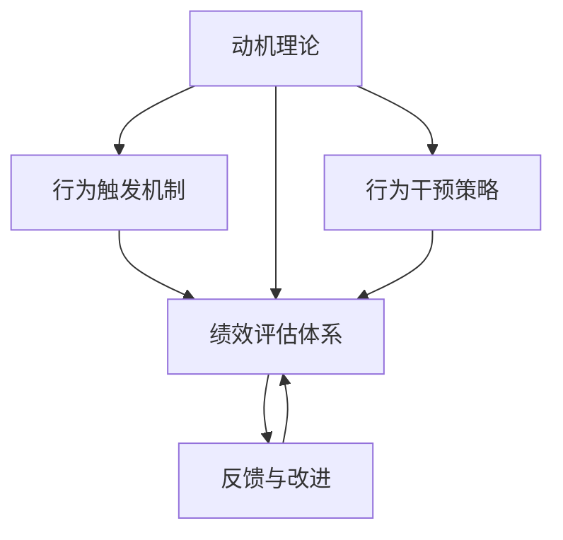

                 

# 行为模型:管理者塑造团队习惯的工具

> 关键词：行为模型, 管理者, 团队, 习惯塑造, 激励机制, 绩效管理, 组织文化, 变革管理

## 1. 背景介绍

### 1.1 问题由来

在现代企业管理中，如何有效塑造和激励员工的行为，一直是管理者面临的重大挑战。传统的激励措施往往以物质奖励为主，如奖金、晋升等，但这些措施效果有限，且难以持久。相比之下，行为模型提供了一种更为科学、系统的方法，通过分析员工的行为和心理特征，设计出更为有效、长效的激励机制，帮助管理者塑造团队习惯，提升组织绩效。

### 1.2 问题核心关键点

行为模型是行为科学的延伸，其核心思想是将员工的行为视为一系列决策和选择的集合。通过分析员工的动机、态度、环境等因素，行为模型旨在构建一套系统化的行为干预策略，以最大化员工的绩效和满意度。具体来说，行为模型关注以下几个关键点：

- **动机理论**：了解员工的内在动机，如自我实现、社交归属等，设计出与之相匹配的激励措施。
- **行为触发机制**：研究哪些外部刺激能引发员工的行为变化，如任务反馈、奖励制度等。
- **绩效评估**：建立科学的绩效评估体系，准确衡量员工的工作表现。
- **反馈与改进**：通过持续的反馈和调整，不断优化行为干预策略，提升团队绩效。

这些关键点共同构成了行为模型的方法论基础，为管理者提供了系统化的工具和方法，以塑造和引导员工的行为，进而提升组织绩效。

### 1.3 问题研究意义

研究行为模型对现代企业管理具有重要意义：

1. **提升员工绩效**：通过科学的行为干预，激发员工的积极性，提高其工作绩效。
2. **优化团队协作**：合理分配激励资源，促进团队成员间的协作与互助。
3. **增强组织粘性**：通过塑造共同的价值观和行为规范，增强员工的归属感和忠诚度。
4. **实现高效管理**：提供了一套科学的管理方法，提高组织运营的效率和效果。
5. **应对变革挑战**：在快速变化的商业环境中，行为模型为管理者提供了应对变革的工具。

## 2. 核心概念与联系

### 2.1 核心概念概述

行为模型主要包含以下几个核心概念：

- **动机理论**：解释员工行为的内在驱动因素，如马斯洛需求层次理论、期望理论等。
- **行为触发机制**：研究哪些因素能引发员工的行为变化，如目标设置理论、强化学习理论等。
- **绩效评估体系**：建立科学的评估体系，准确衡量员工的工作表现，如360度评估、关键绩效指标(KPI)等。
- **反馈与改进**：通过持续的反馈和调整，不断优化行为干预策略，如行为干预模型、反馈控制模型等。

这些核心概念之间的联系可以通过以下Mermaid流程图来展示：



这个流程图展示了行为模型的主要逻辑流程：

1. 从动机理论出发，理解员工的内在需求。
2. 通过行为触发机制，研究如何设计有效的激励措施。
3. 建立科学的绩效评估体系，衡量员工的工作表现。
4. 持续的反馈与改进，优化行为干预策略，实现绩效提升。

## 3. 核心算法原理 & 具体操作步骤

### 3.1 算法原理概述

行为模型的核心算法原理主要基于行为科学理论和心理学的研究成果，通过系统化的设计和实验验证，构建出一套行为干预策略。这些策略旨在最大化员工的绩效和满意度，同时增强组织的适应性和灵活性。

### 3.2 算法步骤详解

行为模型的构建和应用一般包括以下几个关键步骤：

**Step 1: 数据收集与分析**

- **动机数据**：通过问卷调查、访谈等方式，收集员工对工作环境、福利待遇、职业发展等方面的态度和期望。
- **行为数据**：收集员工的工作表现、出勤率、任务完成情况等行为数据，评估员工的工作绩效。
- **环境数据**：收集工作场所、团队结构、组织文化等方面的环境数据，分析其对员工行为的影响。

**Step 2: 行为触发机制设计**

- **目标设定**：根据员工的动机数据，设定合理的短期和长期目标，激励员工实现目标。
- **奖励与惩罚**：设计科学的奖励和惩罚机制，及时反馈员工的行为表现。
- **绩效评估**：建立科学的绩效评估体系，客观衡量员工的工作表现，提供公平的激励依据。

**Step 3: 行为干预策略实施**

- **策略设计**：根据行为触发机制的反馈，设计并实施行为干预策略，如培训、轮岗、团队建设等。
- **执行监控**：对行为干预策略的执行情况进行监控，确保其有效落地。
- **反馈与优化**：持续收集员工反馈，根据实际情况优化行为干预策略，确保其持续有效性。

**Step 4: 绩效评估与改进**

- **绩效评估**：根据绩效评估体系，定期对员工的工作表现进行评估，识别绩效优劣的原因。
- **改进措施**：针对评估结果，制定改进措施，提升员工的工作表现。
- **持续优化**：根据绩效评估结果和员工反馈，不断优化行为干预策略，实现长期效果。

### 3.3 算法优缺点

行为模型的优点包括：

- **系统性**：通过科学的数据分析和理论基础，构建系统化的行为干预策略。
- **科学性**：基于行为科学和心理学的研究成果，保证策略的有效性和合理性。
- **灵活性**：根据实际情况和反馈，不断优化行为干预策略，提升适应性和灵活性。

行为模型的缺点包括：

- **复杂性**：设计和管理行为模型需要大量的数据和理论支持，实施起来较为复杂。
- **成本高**：数据收集和分析、策略设计、执行监控等环节都需要投入大量的资源和时间。
- **效果不确定**：行为模型的效果受到多种因素的影响，如员工个人差异、环境变化等，难以保证绝对有效。

### 3.4 算法应用领域

行为模型在企业管理中的应用领域非常广泛，涵盖了以下几个关键方面：

- **人力资源管理**：通过行为模型优化招聘、培训、绩效评估等人力资源管理环节。
- **组织变革管理**：在组织变革过程中，通过行为模型引导员工适应新环境，实现平稳过渡。
- **团队建设与管理**：利用行为模型提升团队协作和沟通，构建高效的团队。
- **员工福利与激励**：设计科学的激励措施，提升员工的工作满意度和忠诚度。
- **企业文化建设**：通过行为模型塑造和传递组织的价值观和行为规范，构建统一的企业文化。

## 4. 数学模型和公式 & 详细讲解 & 举例说明

### 4.1 数学模型构建

行为模型的数学模型主要基于行为科学的理论框架，通过数学语言对员工的行为和心理特征进行建模。以下是一个简化的行为模型数学模型：

设员工行为由动机 $M$、环境 $E$、行为触发机制 $T$ 和反馈与改进 $F$ 共同决定，模型可以表示为：

$$
B = f(M, E, T, F)
$$

其中：
- $M$ 为员工的动机数据，如期望、动机强度等。
- $E$ 为员工所处的环境数据，如工作条件、团队结构等。
- $T$ 为行为触发机制，包括目标设定、奖励与惩罚等。
- $F$ 为反馈与改进机制，如绩效评估、改进措施等。

### 4.2 公式推导过程

行为模型的具体推导过程较为复杂，涉及多个心理学和行为科学的理论，以下是一个简化的推导过程：

设员工的动机 $M$ 可以表示为一个连续变量 $x$，其取值范围为 $[0, 1]$。员工的动机强度 $M_i$ 可以表示为：

$$
M_i = f_i(x, E, T)
$$

其中 $f_i$ 为动机函数，$E$ 和 $T$ 为环境因素和行为触发机制。

员工的行为 $B_i$ 可以表示为：

$$
B_i = g_i(M_i, F)
$$

其中 $g_i$ 为行为函数，$M_i$ 和 $F$ 分别为动机强度和反馈与改进机制。

通过联立上述方程，可以得到员工行为 $B$ 的最终模型：

$$
B = h(M, E, T, F)
$$

其中 $h$ 为综合函数，将动机、环境、触发机制和反馈机制整合为一个整体的行为模型。

### 4.3 案例分析与讲解

以下是一个行为模型的具体案例：

**案例背景**：一家科技公司最近合并了两个业务部门，员工之间存在一定的抵触情绪，影响了团队协作和整体绩效。

**动机分析**：通过问卷调查和访谈，发现员工对新环境适应不良，动机强度较低。部分员工对合并后的团队结构和文化感到迷茫和不满。

**行为触发机制设计**：
- **目标设定**：设定短期和长期目标，如提升团队合作、增强业务协同等。
- **奖励与惩罚**：设计激励措施，如表彰优秀团队和个人，对抵触行为进行适当的惩罚。

**行为干预策略实施**：
- **策略设计**：开展跨部门培训，增强员工对新环境的适应能力。组织团队建设活动，促进员工之间的沟通和协作。
- **执行监控**：通过绩效评估体系，定期检查目标实现情况，及时反馈和调整。

**绩效评估与改进**：
- **绩效评估**：根据目标实现情况和员工反馈，评估团队和个人的绩效表现。
- **改进措施**：针对评估结果，制定改进措施，如调整团队结构、优化团队文化等。

**案例结果**：通过上述行为模型，该公司在短时间内成功整合了两个业务部门，员工适应能力增强，团队协作效果显著提升。

## 5. 项目实践：代码实例和详细解释说明

### 5.1 开发环境搭建

在进行行为模型开发之前，需要先搭建开发环境。以下是使用Python进行行为模型开发的开发环境配置流程：

1. 安装Anaconda：从官网下载并安装Anaconda，用于创建独立的Python环境。

2. 创建并激活虚拟环境：
```bash
conda create -n behavior_model_env python=3.8 
conda activate behavior_model_env
```

3. 安装必要的库：
```bash
pip install numpy pandas scikit-learn statsmodels matplotlib jupyter notebook ipython
```

4. 导入相关库：
```python
import numpy as np
import pandas as pd
import statsmodels.api as sm
import matplotlib.pyplot as plt
```

完成上述步骤后，即可在`behavior_model_env`环境中开始行为模型开发。

### 5.2 源代码详细实现

以下是一个使用Python实现的行为模型示例代码：

```python
# 导入数据
data = pd.read_csv('employee_data.csv')

# 数据预处理
# 动机数据：期望、动机强度等
motivation = data['motivation'] 
# 环境数据：工作条件、团队结构等
environment = data['environment'] 
# 行为触发机制：目标设定、奖励与惩罚等
trigger = data['trigger'] 
# 反馈与改进：绩效评估、改进措施等
feedback = data['feedback']

# 动机函数
def motivation_function(motivation, environment, trigger):
    # 根据动机和环境，计算动机强度
    return (motivation + environment) * trigger

# 行为函数
def behavior_function(motivation, feedback):
    # 根据动机和反馈，计算行为表现
    return motivation * feedback

# 综合函数
def behavior_model(motivation, environment, trigger, feedback):
    # 根据动机、环境和反馈，计算行为表现
    return motivation_function(motivation, environment, trigger) * feedback

# 可视化行为表现
plt.figure(figsize=(10, 6))
plt.plot(data['time'], behavior_model(motivation, environment, trigger, feedback))
plt.title('Employee Behavior Model')
plt.xlabel('Time')
plt.ylabel('Behavior')
plt.show()
```

### 5.3 代码解读与分析

让我们再详细解读一下关键代码的实现细节：

**动机数据、环境数据、行为触发机制和反馈与改进**：
- `data` 变量存储了员工的行为数据，包括动机、环境、触发机制和反馈等关键信息。

**动机函数**：
- `motivation_function` 函数根据员工的动机、环境和行为触发机制，计算出动机强度。

**行为函数**：
- `behavior_function` 函数根据动机和反馈，计算出员工的行为表现。

**综合函数**：
- `behavior_model` 函数将动机函数和行为函数综合起来，计算出员工的行为表现。

**可视化行为表现**：
- `plt` 库用于绘制行为表现的趋势图，通过横轴表示时间，纵轴表示行为表现，展示员工行为的变化趋势。

## 6. 实际应用场景

### 6.1 智能客服系统

行为模型在智能客服系统中有着广泛的应用。通过行为模型，管理者可以了解员工在不同情境下的动机和行为表现，从而设计出科学的激励措施，提升客服人员的工作积极性和服务质量。

具体来说，可以收集客服人员的服务记录、客户反馈、工作满意度等数据，建立行为模型，分析客服人员的行为特征和动机。根据分析结果，设计个性化的激励措施，如服务质量奖励、客户满意度提升奖励等，激励客服人员提供更好的服务。

### 6.2 金融舆情监测

金融行业对舆情监测的需求非常强烈，行为模型可以帮助金融分析师更好地理解和分析舆情数据，及时发现风险信号。

具体而言，可以收集金融领域的舆情数据，包括新闻报道、社交媒体评论、金融论坛讨论等。建立行为模型，分析舆情数据中员工的行为特征和动机。根据分析结果，及时调整投资策略，避免潜在的风险。

### 6.3 人力资源管理

行为模型在人力资源管理中的应用也非常广泛。通过行为模型，人力资源部门可以更好地了解员工的需求和行为特征，从而设计出科学的人力资源政策，提升员工的工作满意度和绩效。

具体来说，可以收集员工的绩效数据、福利待遇、职业发展等数据，建立行为模型，分析员工的行为特征和动机。根据分析结果，设计个性化的福利政策，如职业发展规划、培训机会等，提升员工的工作满意度和忠诚度。

### 6.4 未来应用展望

随着行为模型理论的不断成熟，其在企业管理中的应用前景将更加广阔。未来，行为模型有望在以下几个方面得到更广泛的应用：

- **智能招聘**：通过行为模型分析应聘者的行为特征和动机，匹配最合适的岗位，提高招聘效率和成功率。
- **个性化培训**：根据员工的行为特征和动机，设计个性化的培训计划，提升培训效果。
- **绩效考核**：通过行为模型分析员工的行为特征和动机，制定科学的绩效考核体系，提升考核的公平性和准确性。
- **组织变革**：在组织变革过程中，通过行为模型引导员工适应新环境，实现平稳过渡。

## 7. 工具和资源推荐

### 7.1 学习资源推荐

为了帮助开发者系统掌握行为模型的理论基础和实践技巧，这里推荐一些优质的学习资源：

1. 《组织行为学》：经典的组织行为学教材，系统介绍了组织行为的基本理论和应用方法。
2. 《行为科学与管理》：介绍行为科学的理论基础和管理应用，适合管理者学习。
3. 《行为模型与绩效管理》：详细介绍行为模型的构建和应用，适合人力资源管理者学习。
4. 《行为科学在企业管理中的应用》：介绍行为科学在企业管理中的实际应用，适合企业高管学习。
5. 《行为科学与管理在线课程》：由知名大学开设的在线课程，系统介绍行为科学的理论和实践。

通过对这些资源的学习实践，相信你一定能够快速掌握行为模型的精髓，并用于解决实际的组织管理问题。

### 7.2 开发工具推荐

行为模型的开发和应用需要依赖数据和算法的支持，以下是几款常用的工具和库：

1. Python：作为一种流行的编程语言，Python拥有丰富的库和框架，适合进行数据处理和建模。
2. Jupyter Notebook：一种交互式编程环境，适合进行数据可视化和代码实现。
3. Scikit-learn：一个开源的Python机器学习库，提供各种机器学习算法和工具，适合进行数据建模和分析。
4. Pandas：一个开源的Python数据分析库，提供数据清洗、数据处理和数据可视化等功能，适合进行数据预处理和分析。
5. Statsmodels：一个开源的Python统计分析库，提供多种统计模型和工具，适合进行数据建模和分析。

合理利用这些工具，可以显著提升行为模型的开发效率，加快创新迭代的步伐。

### 7.3 相关论文推荐

行为模型的研究源于学界的持续努力，以下是几篇奠基性的相关论文，推荐阅读：

1. Expectancy Theory：Vroom提出的期望理论，解释员工行为的内在动机。
2. Goal Setting Theory：Locke提出的目标设定理论，探讨目标设定对员工绩效的影响。
3. Behavioral Economics：Kahneman提出的行为经济学理论，研究人类行为的心理特征。
4. Performance Management：Smith提出的绩效管理理论，探讨如何通过行为模型提升员工绩效。
5. Organizational Behavior：Bass提出的组织行为理论，探讨组织结构和文化对员工行为的影响。

这些论文代表了大行为模型理论的发展脉络，通过学习这些前沿成果，可以帮助研究者把握学科前进方向，激发更多的创新灵感。

## 8. 总结：未来发展趋势与挑战

### 8.1 总结

本文对行为模型进行全面系统的介绍。首先阐述了行为模型的研究背景和意义，明确了行为模型在企业管理中的重要作用。其次，从原理到实践，详细讲解了行为模型的核心概念和操作步骤，给出了行为模型开发和应用的具体实例。同时，本文还广泛探讨了行为模型在多个行业领域的应用前景，展示了行为模型的巨大潜力。此外，本文精选了行为模型的各类学习资源，力求为读者提供全方位的技术指引。

通过本文的系统梳理，可以看到，行为模型为企业管理提供了一套系统化的方法论，帮助管理者理解员工行为的内在动机，设计出科学的激励措施，提升组织绩效。行为模型有望在未来成为企业管理的重要工具，为构建高效、健康、适应性强的组织奠定坚实基础。

### 8.2 未来发展趋势

展望未来，行为模型将在以下几个方面呈现新的发展趋势：

1. **数据驱动**：通过大数据和人工智能技术，进一步提升行为模型的预测和分析能力。
2. **多维度整合**：将员工行为的多维度数据（如健康、家庭、社会）整合到行为模型中，提升模型的全面性和准确性。
3. **实时化调整**：利用实时数据和反馈，不断调整行为模型，提升模型的适应性和灵活性。
4. **个性化设计**：根据员工的不同需求和背景，设计个性化的激励和培训措施，提升员工的满意度和绩效。
5. **跨学科融合**：结合心理学、社会学、经济学等学科的研究成果，丰富行为模型的理论基础和实践应用。

这些趋势将推动行为模型在企业管理中的应用更加广泛和深入，带来更高的效率和效益。

### 8.3 面临的挑战

尽管行为模型在企业管理中已经取得了一定的成效，但在实际应用过程中仍面临一些挑战：

1. **数据获取难度**：数据是行为模型的核心，但获取高质量的数据成本较高，且需要持续维护和更新。
2. **模型复杂性**：行为模型的构建和应用涉及多个理论和模型，设计和实现较为复杂。
3. **结果解释性**：行为模型的输出结果缺乏解释性，难以对员工的行为进行合理的解释和分析。
4. **结果应用难度**：将行为模型的输出结果转化为实际的管理措施，需要管理者的专业知识和经验。
5. **效果评估难度**：行为模型的效果受多种因素影响，难以进行全面和准确的评估。

这些挑战需要通过理论和实践的不断探索和优化，逐步克服，推动行为模型在企业管理中的应用更加广泛和深入。

### 8.4 研究展望

未来，行为模型的研究需要在以下几个方面进行突破：

1. **数据融合技术**：探索如何整合多维度数据，提升行为模型的全面性和准确性。
2. **实时化处理技术**：研究如何实时处理和反馈数据，提升行为模型的适应性和灵活性。
3. **个性化设计方法**：开发更加个性化的激励和培训措施，提升员工的工作满意度和绩效。
4. **跨学科研究方法**：结合心理学、社会学、经济学等学科的研究成果，丰富行为模型的理论基础和实践应用。
5. **结果解释技术**：研究如何提升行为模型的结果解释性，帮助管理者理解和分析员工行为。

这些研究方向将推动行为模型在企业管理中的应用更加广泛和深入，带来更高的效率和效益。

## 9. 附录：常见问题与解答

**Q1：行为模型是否适用于所有组织和员工？**

A: 行为模型对所有组织和员工都有一定适用性，但需要根据组织和员工的特点进行适当的调整和优化。

**Q2：行为模型在实施过程中需要注意哪些问题？**

A: 行为模型在实施过程中需要注意以下问题：
1. 数据质量：确保数据收集和处理的质量，避免数据偏差和错误。
2. 员工参与：充分尊重员工的意见和反馈，确保激励措施的公平和合理。
3. 持续优化：根据反馈和效果，不断优化行为模型，提升其适用性和效果。
4. 法律法规：遵守相关法律法规，避免侵犯员工隐私和权益。

**Q3：行为模型如何与现有管理体系进行整合？**

A: 行为模型可以与现有管理体系进行整合，主要包括以下几个步骤：
1. 数据整合：将行为模型的数据与现有的绩效评估、培训等管理体系进行整合。
2. 流程优化：优化现有的管理体系流程，融入行为模型的反馈和改进机制。
3. 技术支持：利用现有的技术平台和工具，实现行为模型的自动化和数字化。

**Q4：行为模型在应用过程中如何确保公平性？**

A: 行为模型在应用过程中确保公平性，需要从以下几个方面进行考虑：
1. 公平的激励措施：确保激励措施的公平性和透明性，避免任何形式的偏见和歧视。
2. 全面的数据覆盖：确保数据覆盖面广，避免数据偏差和误导性。
3. 持续的反馈与改进：根据员工反馈和评估结果，不断优化行为模型，确保其公平性和有效性。

通过以上措施，可以确保行为模型在应用过程中的公平性和公正性，提升员工的工作满意度和绩效。

**Q5：行为模型在人力资源管理中的应用效果如何？**

A: 行为模型在人力资源管理中的应用效果显著，主要体现在以下几个方面：
1. 提升员工绩效：通过科学的行为干预，激发员工的积极性，提高其工作绩效。
2. 优化团队协作：合理分配激励资源，促进团队成员间的协作与互助。
3. 增强组织粘性：通过塑造共同的价值观和行为规范，增强员工的归属感和忠诚度。
4. 实现高效管理：提供了一套科学的管理方法，提高组织运营的效率和效果。
5. 应对变革挑战：在快速变化的商业环境中，行为模型为管理者提供了应对变革的工具。

通过行为模型的应用，人力资源管理更加科学化、系统化，能够更好地满足员工的需求和组织的需要，实现双赢。

---

作者：禅与计算机程序设计艺术 / Zen and the Art of Computer Programming

